# 如何用 Hugo 搭建一个 app

> 原文：<https://blog.logrocket.com/build-an-app-with-hugo/>

静态站点已经成为动态站点的强大替代品，尤其是随着静态站点生成器(SSG)的出现。由于 SSGs 的存在，开发者可以轻松地构建一个成熟的静态网站。

在本帖中，我们将采访雨果，一个以速度著称的强大的 SSG。我们将了解 Hugo 提供了什么好处，为什么它是最好的 SSG 之一，以及如何快速有效地构建一个简单的博客应用程序。

## 什么是静态站点和静态站点生成器？

当创建静态网站时，内容不是动态生成的，这意味着它是硬编码的。这看起来工作量很大，但却很方便。

动态网站消除了所有页面和帖子中不必要的单个 HTML 文件的重复，但它们通常很慢，不适合小型和大多数中型项目。

这就是 SSGs 和 Hugo 的用武之地。

SSG 提供基于原始数据(通常是 Markdown)和模板结构的静态 HTML 页面。它们通常创建快速且 SEO 友好的页面，是使用动态网站的内容管理系统(CMSes)的良好替代品。

SSG 还有助于自动编写单独的 HTML 页面。通过简单地提供数据，SSG 使用预定义的模板生成 HTML 页面以在网页上提供服务。

## 雨果是什么？

Hugo 是众多可用的静态站点生成器之一。然而，Hugo 是最快的静态站点生成器。它是用 Go 编写的[，内置了并发](https://blog.logrocket.com/getting-started-with-go-for-frontend-developers/)。

使用 Hugo，用户可以像许多 SSG 一样在 Markdown 中定义内容，并根据 Markdown 自动生成 HTML 文件。

### 使用 Hugo 的好处

#### 速度

默认情况下，静态站点比动态站点快；静态站点在构建时生成，HTTPS 处理其余的，不像动态站点，每次对资源发出请求时，每个请求都由服务器处理。

Hugo 仍然是最快的 SSG，因为它内置了多线程；现在做一个改变只需要不到 8 毫秒的时间，我们将在这篇文章的后面回顾。

#### 低至无代码

Hugo 使用起来也非常简单，不需要太多的技术知识，尤其是在安装和设置之后，这一点我们将在本文后面介绍。

此外，由于能够使用 [Dropbox Paper](https://paper.dropbox.com/) 或 [readme.so](https://readme.so/) ，开发人员可以直观地创建他们想要的内容，并将其导出到 Hugo 项目，从而无需深入了解降价和样式。

不需要配置服务器和基础设施，让开发人员可以启动并运行任何小项目，而不需要使用太多的技术和堆栈。

#### 低成本

部署 Hugo 时不需要后端基础设施，提供了一种管理博客或网站的廉价方式。

因为所有的 HTML 文件都是在构建时生成的，所以不需要配置服务器或数据库，消除了这些经常带来的财务挫折。

只需使用许多免费服务中的一个，如 GitHub pages、Netlify 或 Vercel，就可以部署一个博客或网站。

#### 安全性

Hugo 网站和应用程序实际上是不可破解的。因为 Hugo 站点没有数据库，所以一切都是静态可用的。

开发人员不必担心 SQL 注入可能通过表单字段或安全漏洞进入数据库。Hugo 不仅提供速度，而且还很安全。

* * *

### 更多来自 LogRocket 的精彩文章:

* * *

### 雨果权衡

虽然 Hugo 易于学习和使用，从速度到成本都有好处，但它也有一些缺点。

准备好权衡动态和静态。Hugo 速度很快，但是在 SSG 中手工操作会很麻烦，比如使用函数、变量和作用域。

在使用 Hugo 之前要考虑的另一个问题是缺少一个图形用户界面来以更具视觉吸引力的方式管理内容。但是，这可以通过使用像 Netlify CMS 或 Dato CMS 这样的第三方 CMS 作为数据源来解决。

## 使用 Hugo 构建应用程序

现在让我们通过设置和构建一个博客应用程序来看看 Hugo 的实际操作。

### 安装 Hugo

首先，我们必须安装雨果；[选择相应的操作系统安装包](https://gohugo.io/getting-started/installing)。

虽然我在这个项目中使用了 Linux，但是任何可以运行 Go 编译器工具的操作系统都可以在本地机器上安装 Hugo。

通过检查 Hugo 的版本是否是最新的来确认安装完成。从终端运行以下命令:

```
hugo version

```

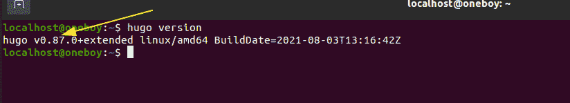

接下来，运行以下命令查看可用命令和标志的列表:

```
hugo help

```

因为 Hugo 的命令和标志列表很短，所以开发体验要容易得多。

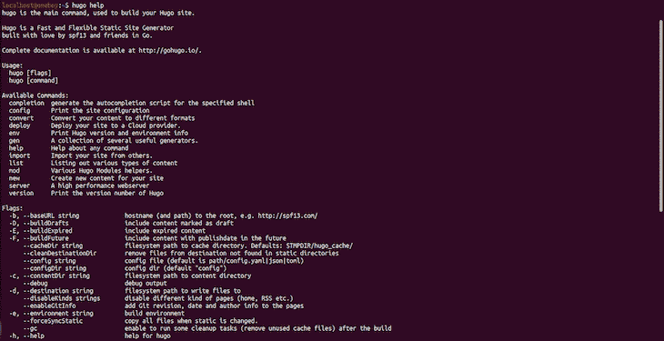

现在我们已经确认 Hugo 的安装是成功的，让我们创建一个 Hugo 网站。首先导航到所需的位置，然后运行以下命令:

```
hugo new site mysite

```

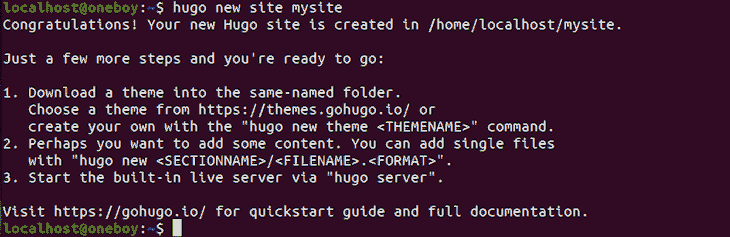

这将创建一个包含 Hugo 项目模板的`mysite`文件夹。我们现在可以在文本编辑器(比如 Visual Studio 代码)中打开`mysite`文件夹，查看它的结构。

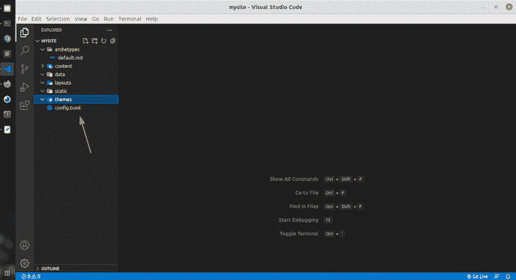

### 添加主题

接下来要做的是添加一个主题。我们甚至可以建立自己的主题，然而，为了这个指南，让我们使用在[https://themes.gohugo.io/](https://themes.gohugo.io/)可用的主题。

我决定用[阿南刻](https://themes.gohugo.io/themes/gohugo-theme-ananke/)来做这个教程；[从 GitHub](https://github.com/theNewDynamic/gohugo-theme-ananke) 下载这个主题的 zip 文件。

将`gohugo-theme-ananke-master`文件夹解压到 Hugo 项目的`themes`文件夹中。为了简单起见，将提取的文件夹重命名为`ananke`。

打开 Hugo 项目根目录下的`config.toml`,添加下面一行:

```
theme = 'ananke'

```

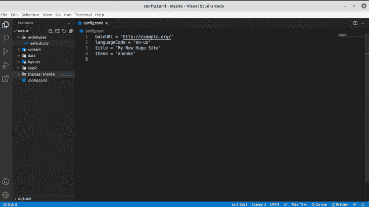

为了检查是否一切配置正确，让我们构建应用程序并在 web 上测试它。首先运行以下命令:

```
hugo server -D

```

如果您打算以草稿模式显示内容，则添加`-D`标志。此命令仅用于开发。

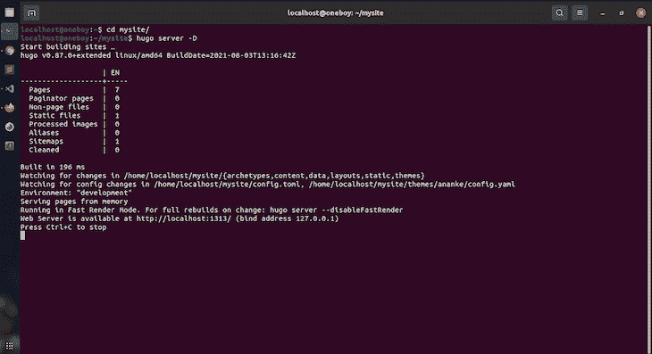

如果一切顺利，我们应该看到应用程序在 [http://localhost:1313/](http://localhost:1313/) 构建并提供服务。

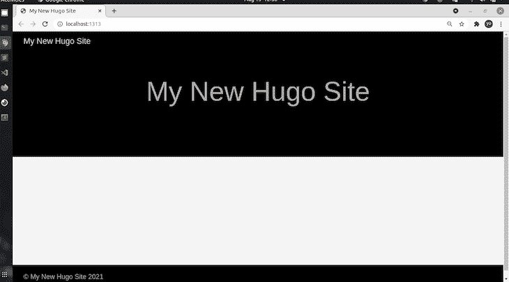

这只是主题的默认外观，没有添加内容。

### 添加内容

要向我们的博客添加内容，我们可以手动添加，也可以使用以下命令通过命令行添加:

```
hugo new posts/my-first-post.md

```

通过命令行添加内容的好处是它在 Markdown 中提供了一个样板文件，如下所示:

```
---
title: "My First Post"
date: 2021-08-13T13:06:28+01:00
draft: true
---

```

这将在`content`文件夹中创建以下内容:

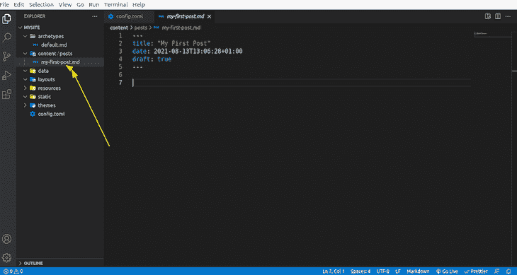

为了本教程，让我们添加一些随机数据和图像:

```
---
title: "J Cole Story"
featured_image: "/jcole.jpg"
date: 2021-08-13T13:06:28+01:00
draft: false
---
Jermaine Lamarr Cole (born January 28, 1985) known professionally as J. Cole, is an American rapper, singer, songwriter, and record producer. Cole is regarded as one of the most influential rappers of his generation.[5] Born on a military base in Germany and raised in Fayetteville, North Carolina,[6] Cole initially gained recognition as a rapper following the release of his debut mixtape, The Come Up, in early 2007\. Intent on further pursuing a musical career, he went on to release two additional mixtapes, The Warm Up (2009) and Friday Night Lights (2010) both to critical acclaim, after signing to Jay-Z's Roc Nation imprint in 2009.
Cole released his debut studio album, Cole World: The Sideline Story, in 2011\. It debuted at number one on the US Billboard 200.[7] His next album, Born Sinner (2013), also topped the Billboard 200\. Moving into more conscious themes, 2014 Forest Hills Drive (2014) topped the Billboard 200 and earned Cole a Best Rap Album nomination at the 2015 Grammy Awards.[8] His jazz influenced fourth album, 4 Your Eyez Only (2016), debuted at number one on the Billboard 200.[9] Cole's fifth album, KOD (2018), became his fifth number-one album on the Billboard 200 and featured a then-record six simultaneous top 20 hits on the Billboard Hot 100, tying The Beatles.[10] His sixth studio album, The Off-Season, was released on May 14, 2021.
 !\[Jcole\](/jcole.jpg)
Self-taught on piano, Cole also acts as a producer alongside his rap career, producing singles for artists such as Kendrick Lamar and Janet Jackson, as well as handling the majority of the production in his own projects.[11] He has also developed other ventures, including Dreamville Records, as well as a non-profit organization called the Dreamville Foundation.[12] Dreamville's compilation album Revenge of the Dreamers III (2019) debuted at number one on the Billboard 200 and was nominated for Best Rap Album at the 2020 Grammy Awards. In January 2015, Cole decided to house single mothers rent-free at his childhood home in Fayetteville, North Carolina.[13]

```

降价会产生以下结果:

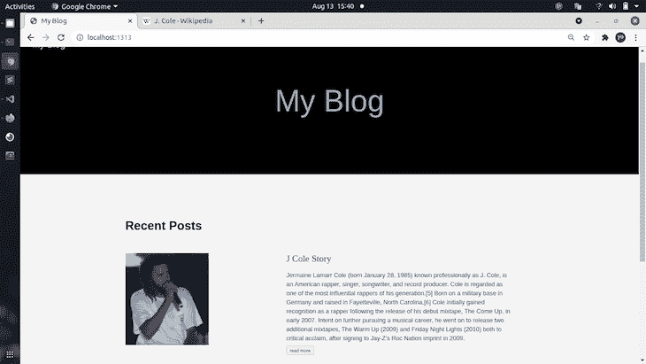

注意，在文章中添加图片时，它是通过静态文件夹访问的。放入静态文件夹的任何资产都是全局可用的，或者在根级别可用，不管我们在什么项目目录中。

需要注意的是，Markdown 文件的名称是应用程序中的一个路径，这意味着第一篇文章位于[http://localhost:1313/posts/my-first-post/](http://localhost:1313/posts/my-first-post/)。

此外，出于搜索引擎优化的目的，请始终以描述性的方式命名降价文件。

我继续前进，[为博客](https://github.com/bigpreshy/hugo/tree/main/content/posts)创建了两个额外的降价文件，包括一些我喜欢的说唱歌手的基本信息，以增加更多内容。

我们的博客现在正在形成。


## 标杆管理

还记得我们最初谈到速度是选择 Hugo 而不是其他静态站点生成器的主要原因之一吗？

每当 Hugo 服务器检测到变化时，就会进行基准测试；只需不到 8 毫秒的时间就可以重建并立即将更改提供给我们的浏览器。

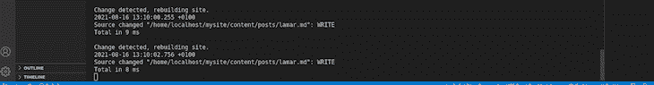

这是令人难以置信的快，不管机器构建应用程序。以下是为该项目提供服务的系统:

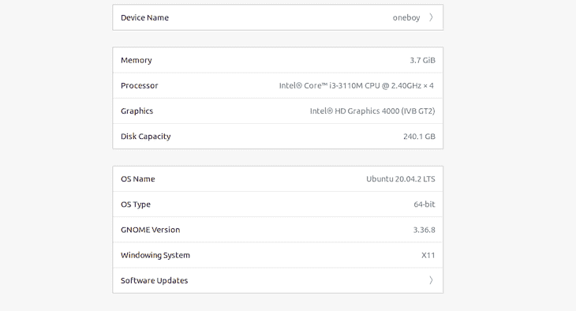

让我们再添加八个帖子，包括一个`featured_image`和图片。现在，让我们看看需要多长时间来建立。

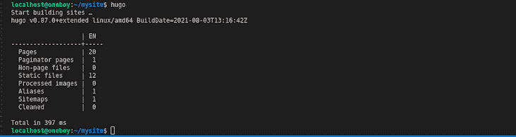

这个特定的构建大约需要 397 毫秒；一秒钟都没有！现在，想象一下，如果我们需要增加 100 或 1000 个帖子；与使用其他 SSG 或动态网页相比，使用 Hugo 花费的时间要少得多。

让我们看看在 Vercel 上部署这 11 个帖子需要多长时间。

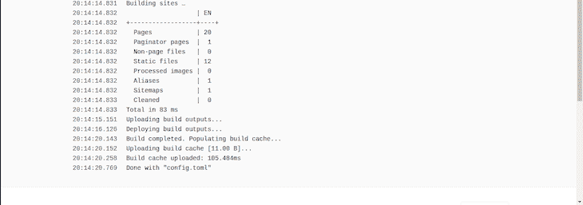

用了 83 毫秒；这真是太快了！

## 部署

在部署之前，我们希望确保将`config.toml`文件中的基本 URL 配置为我们希望部署到的 URL。

我已经[将它部署到 Vercel，你可以在这里](https://hugoblogproject.vercel.app/)访问它。

这是基本 URL，虽然它不会真正影响本地开发，但它会在构建项目时生成一个公共文件夹，所有静态生成的 HTML 文件都放在这个文件夹中并进行更新。如果基本 URL 不正确，这可能会导致图像链接断开。

现在，我们想首先将我们的代码推送到 GitHub 私有或公共存储库。有许多方法可以做到这一点，但是我们将通过运行以下命令在本地开发环境中简单地构建项目:

```
hugo server 

```

然后，运行以下命令:

```
hugo 

```

这些生成一个`public`文件夹，可以部署在任何地方，比如 Vercel、Netlify 或者常规的共享托管。问题是，要跟上变化变得非常困难。

这就是为什么我们将部署到 GitHub，然后将 GitHub 帐户连接到 Vercel。

为此，在 GitHub 上创建一个新的存储库。然后，在项目的根目录下依次运行以下命令:

```
git init
git commit -m "first commit"
git branch -M main
git remote add origin https://github.com/USERNAME/repository_name.git
git push -u origin main

```

这会将项目上传到 GitHub。刷新会产生以下结果:

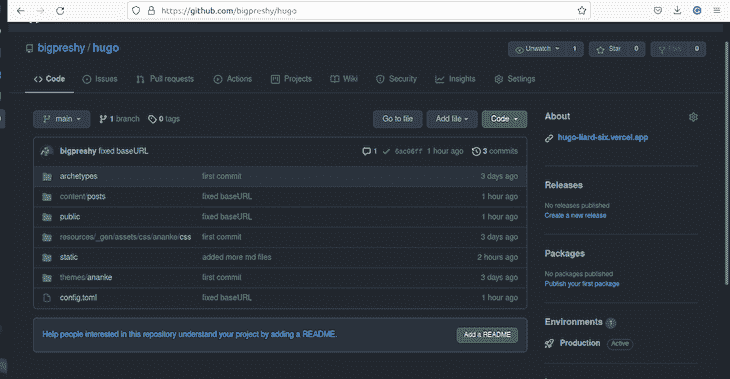

现在，将 GitHub 帐户连接到 Vercel。如果你注册了 Vercel ，你可以选择使用 GitHub 作为提供商。否则，请使用您现有的 GitHub 帐户。

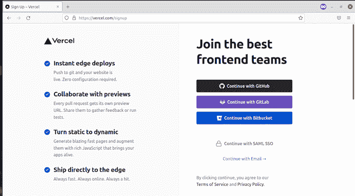

然后，我们应该看到以下内容；点击**新建项目**。

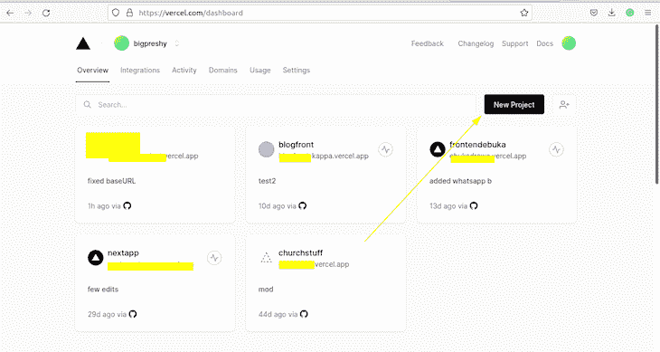

在 **Import Git Repository** 下，您应该看到所有可用的存储库按照升序排列，这是由您最后一次提交决定的。

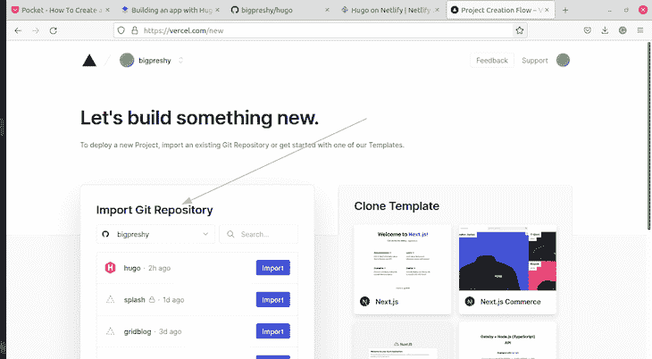

选择包含 Hugo 项目的存储库。

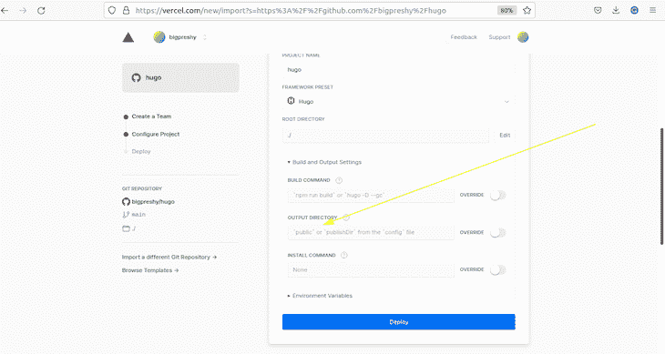

当 Hugo 项目第一次构建时，它会创建一个`public`目录，所有生成的 HTML 和其他将提供给网页的资源都驻留在这个目录中。

如果我们没有在本地开发环境中构建我们的项目，Vercel 会自动为我们创建这个文件夹。但是，由于有了`public`文件夹，Vercel 和其他流行的托管服务知道如何构建和服务`public`文件夹。

## 结论

恭喜你！你坚持到了最后。凭借 Hugo 的速度、简单性和静态特性，它在创建和部署应用程序时为新老开发者提供了无缝的开发体验。

## 使用 [LogRocket](https://lp.logrocket.com/blg/signup) 消除传统错误报告的干扰

[](https://lp.logrocket.com/blg/signup)

[LogRocket](https://lp.logrocket.com/blg/signup) 是一个数字体验分析解决方案，它可以保护您免受数百个假阳性错误警报的影响，只针对几个真正重要的项目。LogRocket 会告诉您应用程序中实际影响用户的最具影响力的 bug 和 UX 问题。

然后，使用具有深层技术遥测的会话重放来确切地查看用户看到了什么以及是什么导致了问题，就像你在他们身后看一样。

LogRocket 自动聚合客户端错误、JS 异常、前端性能指标和用户交互。然后 LogRocket 使用机器学习来告诉你哪些问题正在影响大多数用户，并提供你需要修复它的上下文。

关注重要的 bug—[今天就试试 LogRocket】。](https://lp.logrocket.com/blg/signup-issue-free)