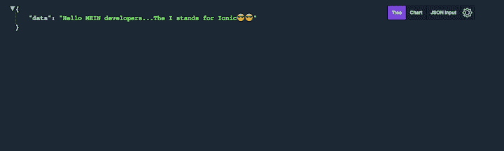
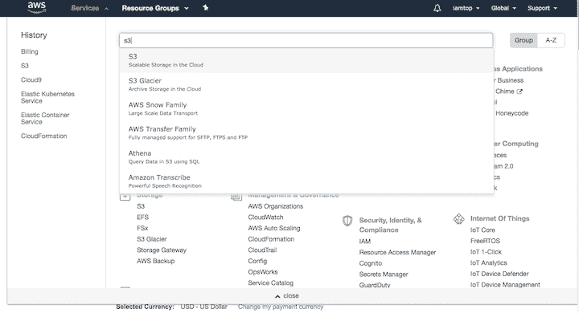
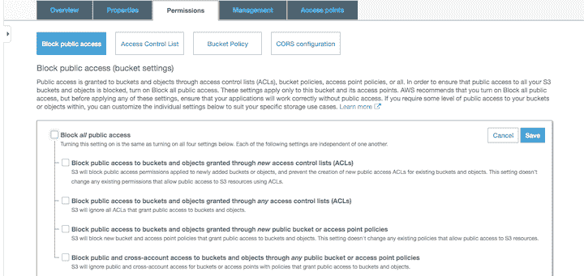
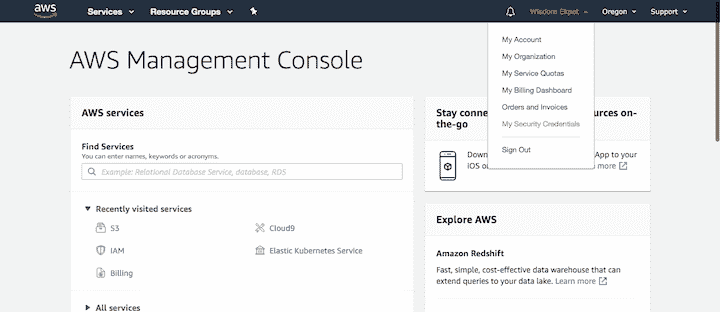
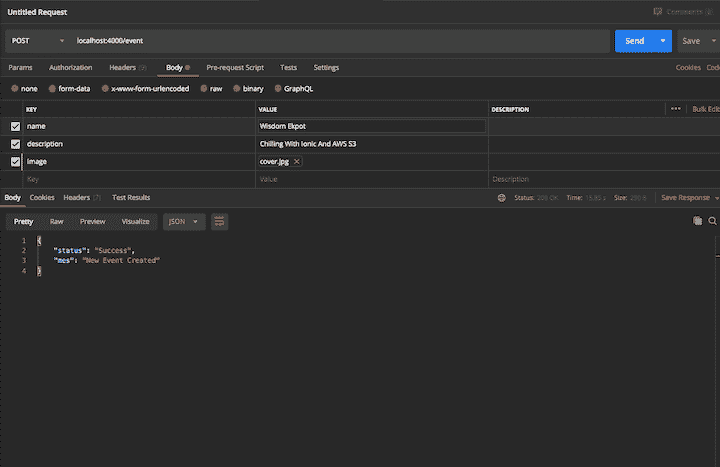
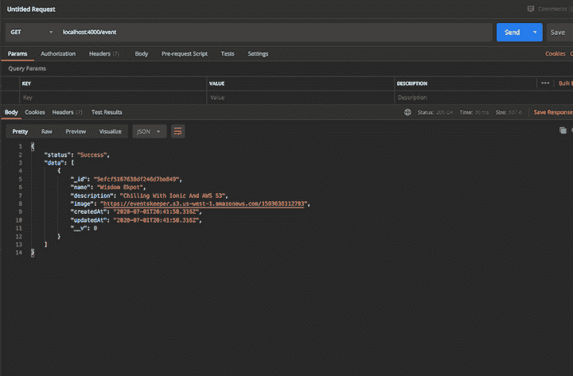
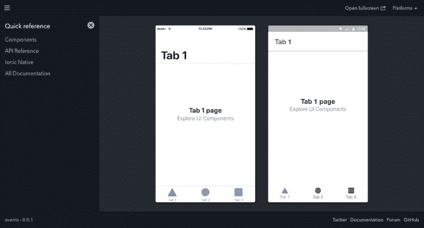
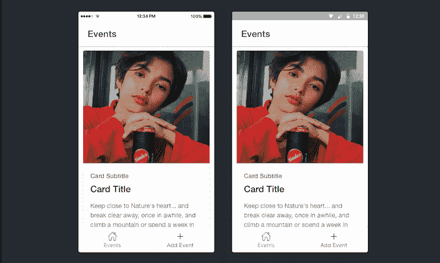
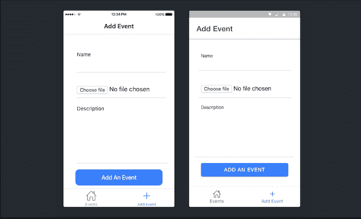
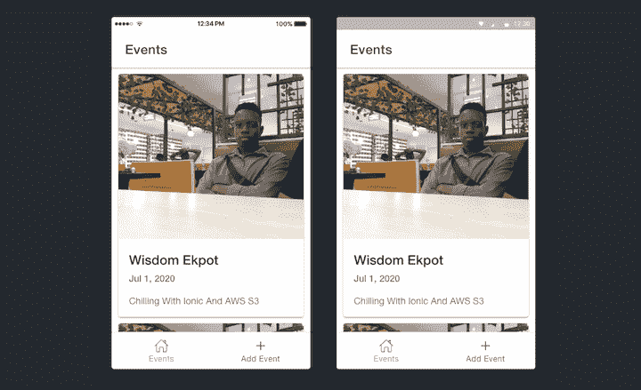

# 用 Ionic 和 AWS - LogRocket 博客构建一个事件管理器应用程序

> 原文：<https://blog.logrocket.com/build-an-event-keeper-app-with-ionic-and-aws/>

Ionic framework 是一个开源 UI 工具包，用于使用 web 技术(HTML、CSS 和 JavaScript)构建高性能、高质量的移动和桌面应用程序，并集成了 Angular、Vue 和 React 等流行框架。

亚马逊网络服务(AWS)以按需付费的方式提供按需云平台。

在本教程中，我们将使用名为 S3 的 AWS 服务构建一个事件管理器应用程序来保存我们的图像。所有上传到我们平台的图像将被存储在 AWS S3 桶中，我们的图像的 URL 将被返回。

## 先决条件

要跟随本教程，您需要:

*   对 HTML、CSS 和 JavaScript (ES6+)有基本的了解
*   安装了代码编辑器，如 VS 代码
*   邮递员已安装
*   MongoDB 设置
*   [角度](https://blog.logrocket.com/angular-10-is-now-available-heres-what-you-need-to-know/)和 Express.js 的基础知识

## 构建后端

要构建后端，请完成以下步骤。

1.  初始化新的节点项目
2.  安装所有必需的依赖项
3.  创建 Express 服务器并配置依赖关系
4.  创建和配置 MongoDB
5.  创建事件管理器模型
6.  设置 AWS 和 Multer
7.  创建必要的路线和控制器
8.  使用邮递员测试路线

## 初始化新的节点项目

让我们首先在桌面上为我们的应用程序创建一个文件夹。打开您的终端，键入以下内容。

```
cd desktop
mkdir event-app && cd event-app
mkdir server && cd server
code

```

这里我们在桌面上创建一个`event-app`目录。在`event-app`目录中，我们将创建一个`server`目录。这是我们设置后端应用程序的地方。

命令将在 VS 代码中设置我们的应用程序。VS 代码被重新定义和优化，用于构建和调试现代 web 和云应用程序。请随意使用您选择的任何文本编辑器。出于本教程的目的，我们将使用 VS 代码集成终端。

要设置 Node.js 应用程序，我们需要一个`package.json`文件来管理我们所有的项目依赖项。要创建它，在终端上运行`npm init -y`。

```
npm init -y

```

这将创建一个`package.json`文件。

## 安装所需的依赖项

我们的应用程序将需要以下 npm 包进行开发。

*   `Expressjs` —一个 node.js 框架，可以轻松构建 web 应用。
*   `mongoose` —一个用于异步查询 MongoDB 的对象建模工具，它提供了一个简单的、基于模式的解决方案来为您的应用程序数据建模
*   `body-parser` —允许 Express 读取请求主体，然后将其解析成可以理解的 JSON 对象的包
*   `cors` —一种中间件，可用于支持具有各种选项的 CORS
*   `morgan` —记录所有路由和请求的日志工具
*   `aws-sdk` —官方 AWS SDK for JavaScript，可用于浏览器、移动设备和 Node.js 后端
*   `multer` —用于处理多部分表单数据的 Node.js 中间件，主要用于上传文件
*   `dotenv` —一个零依赖模块，将环境变量从`.env`文件加载到`process.env`中。这是我们为应用程序存储所有外部环境变量的地方，比如 AWS secret、ID 等。
*   `multer-s3` —用于流式传输 AWS S3 Multer 存储引擎的包
*   每次我们修改代码时，这个包都会重新运行 Express 服务器

从全局安装 Nodemon 开始，这样就可以在本地机器上的任何地方访问它。

```
npm install -g nodemon

```

接下来，安装所有其他依赖项。

```
npm i --save express body-parser cors morgan aws-sdk multer multer-s3 mongoose dotenv

```

这个命令将安装所有这些包，并将它们添加到我们在`package.js file`中的依赖项中。它还创建了一个`node-modules`目录，这是我们所有包存储的地方。

记住，在将项目推送到 git 时，不要添加这个包。为了避免这种情况，创建一个`.gitignore`文件

```
touch .gitignore

```

该命令将创建一个`.gitignore`文件。打开文件并在其中键入`node-modules`。

## 创建 express 服务器并配置所有依赖项。

要设置 Express 服务器，创建一个 `src` 目录，并在其中放置一个 `index.js` 文件。这是我们应用程序的基本文件。我们将在这里定义我们的第一个路由并配置一些包。

将下面的代码添加到 `index.js` 文件中。

```
require('dotenv').config()
const express = require("express");
const PORT = process.env.PORT || 4000;
const morgan = require("morgan");
const cors = require("cors");
const bodyParser = require("body-parser");
const app = express();
//--------------registering cors -----------------
app.use(cors());
//----------------configure body parser --------------
app.use(bodyParser.urlencoded({
    extended: false
}));
app.use(bodyParser.json());
//---------------configure morgan  --------
app.use(morgan("dev"));

// define first route
app.get("/", (req, res) => {
    res.json({
        data: "Hello MEIN developers...The `I` stands for Ionic😎😎"
    });
});
app.listen(PORT, () => {
    console.log(`App is running on ${PORT}`);
});

```

打开`package.json`文件并添加以下内容。运行`npm run dev:start`将引导我们的应用程序。

```
"scripts": {
    "start:dev":"nodemon src"
  },

```

如果您在浏览器上打开应用程序，您应该会看到以下内容:



## 创建和配置 MongoDB 数据库

创建一个`config`目录。在`config`目录中，创建一个`mongoose.js`文件，并将以下代码添加到该文件中。

```
const mongoose = require("mongoose");
module.exports = function (app) {
    mongoose.connect("mongodb://localhost:27017/ionic-app", {
        useUnifiedTopology: true,
        useNewUrlParser: true,
        useFindAndModify: false
    }).then(res => console.log("Database conneceted")).catch(err => console.log(err))
    mongoose.Promise = global.Promise;
    process.on("SIGINT", cleanup);
    process.on("SIGTERM", cleanup);
    process.on("SIGHUP", cleanup);
    if (app) {
        app.set("mongoose", mongoose);
    }
};
function cleanup() {
    mongoose.connection.close(function () {
        process.exit(0);
    });
}

```

我们需要在我们的根文件中注册它，然后传递`express()`的实例。为此，我们需要在我们的`index.js`文件中要求这个模块。

```
require("./config/mongoose")(app);

```

一旦你这样做了，如果你的应用程序正在运行，你会在控制台上看到`Database conneceted`。

## 创建事件管理器模型

现在我们的数据库已经准备好了，我们需要创建我们的 Mongoose 模式，它接受一个定义事件模式属性的对象。

创建一个目录来保存模式、路由和控制器。

```
cd src
mkdir api && cd api
mkdir events && cd events
touch model.js && touch controller.js && touch routes.js

```

让我们通过在`events/model.js`文件中添加这些代码来定义我们的事件模式:

```
const mongoose = require("mongoose");
const eventSchema = mongoose.Schema({
    name: {
        type: String,
        required: true
    },
    image: {
        type: String,
        required: true
    },
    description: {
        type: String,
        required: true
    }
}, {
    timestamps: true,
});
const Event = mongoose.model("Event", eventSchema);
module.exports = Event;

```

Mongoose 将模式转换成数据库中的文档。这些属性然后被转换成文档中的字段。

## 设置 AWS 和 Multer

首先，你需要注册一个 [AWS 账户](https://aws.amazon.com)。

登录后，您会在导航栏上看到 `services` 链接。点击它并在搜索框中输入“s3”。



点击 S3。这是我们将用于云存储的内容。

通过单击“创建存储桶”，为您的应用程序创建新的存储桶将弹出一个模式，要求您指定您的 bucket 的名称。调用您的存储桶`eventskeeper`并选择`US West (N. California)`作为您的区域。

转到“权限”部分，取消选中复选框以阻止所有公共访问，然后保存您的更改。



Nex，我们需要拿到所有的安全证书。单击页面顶部的登录用户名，然后单击“我的安全凭证”



这将带您到一个页面，您可以在这里设置您的安全凭证。点按“访问密钥”，然后点按“创建新的访问密钥”您将看到一个包含您的安全细节的模型。复制这些细节，以便您可以将它们存储在一个`.env`文件中。

创建`.env`文件。

```
touch .env

```

在`.env`文件中，添加以下内容。

```
ACCESS_KEY=****************ZZN7SQDUJUPQ
ACEESS_SECRET=**********************ifn30**

```

用您从该网站获得的安全详细信息替换这些值。不要忘记将这个文件添加到`.gitignore`文件中。

在 config 目录中创建一个`aws.js`文件，并添加以下内容。

```
const aws = require('aws-sdk')
const multer = require('multer')
const multerS3 = require('multer-s3')

aws.config.update({
    secretAccessKey: process.env.ACEESS_SECRET,
    accessKeyId: process.env.ACCESS_KEY,
    region: 'eu-west-3'
})
const s3 = new aws.S3();
const fileFilter = (req, file, cb) => {
    if (file.mimetype.startsWith('image')) {
        cb(null, true);
    } else {
        cb(new Error('Not an image! Please upload an image.', 400), false);
    }
};
const upload = multer({
    fileFilter,
    storage: multerS3({
        s3,
        bucket: 'eventskeeper',
        acl: 'public-read',
        metadata: function (req, file, cb) {
            cb(null, {
                fieldName: "TESTING_META_DATA"
            });
        },
        key: function (req, file, cb) {
            cb(null, Date.now().toString())
        }
    })
})
module.exports = {
    upload,
    s3
}

```

首先将`aws-sdk`、`multer`和`multer-s3`导入该文件。接下来，使用存储在环境变量中的凭证来配置您的`aws-sdk`包。用配置对象中的区域替换您的区域。

下一步是为您的文件上传创建一个简单的过滤器，它只接受从`image`开始的`mimetype`文件类型。

在定义了这个过滤器之后，创建一个 Multer 实例来接收过滤器和我们将向其发送文件的 bucket 配置。在`multerS3`实例中，指定将保存您的文件的存储桶的名称，然后将`alc`设置为`public read`，以便您可以随时添加文件。

要使用这些方法，我们需要导出函数，以便任何 JS 模块都可以访问它。

## 创建必要的路线和控制器。

我们基本上有两条路线:一条获取所有事件，另一条添加新事件。

在`api/events/routes.js`文件中，添加以下路线。

```
const eventController = require("./controller");
const router = require("express").Router();

router.post("/", eventController.addEvent)
router.get("/", eventController.getAllEvents)

module.exports = router;

```

我们必须在控制器文件中创建`addEvent`和`getAllEvents`方法。首先在`api/events/controller.js`文件中创建`addEvent`方法。

```
let Event = require('./model');
const {
    upload,
    s3
} = require('../../config/aws')

const singleUpload = upload.single('image');
exports.addEvent = async (req, res) => {
    try {
        await singleUpload(req, res, err => {
            if (err) {
                return res.status(422).json({
                    title: "File Upload Error",
                    desription: err.message
                })
            }
            const event = new Event({
                name: req.body.name,
                description: req.body.description,
                image: req.file.location
            })
            event.save();
            res.status(200).json({
                status: "Success",
                mes: "New Event Created"
            })
        })
    } catch (err) {
        res.status(500).json({
            status: "error",
            error: err
        })
    }
}

```

我们还需要引入事件模块和 AWS 配置模块。首先检查在尝试上传图像时是否有任何错误，并为任何不可处理的实体抛出一个`422`错误。如果没有错误，使用`req.body`访问请求中发送的 JSON 数据，并使用`req.file.location`获取图像的 URL。

接下来，创建`getAllEvents`函数。这将基本上获得存储在 MongoDB 中的所有事件。

```
exports.getAllEvents = async (req, res) => {
    try {
        let events = await Event.find();
        res.status(200).json({
            status: "Success",
            data: events
        })
    } catch (err) {
        res.status(500).json({
            status: "error",
            error: err
        })
    }
}

```

使用`find()`方法获取数据库中存储的所有数据。

现在我们需要为我们的事件注册一个全局路由处理器。在`api`目录中创建一个`routeHandler.js`文件，并添加以下代码。

```
const EventRoutes = require("./events/routes");
module.exports = (app) => {
    app.use("/event", EventRoutes);
}

```

接下来，将其注册到`index.js`文件中。

```
require("./api/routehandler")(app);

```

是时候在 POSTMAN 上测试我们的应用程序了。

### 发布活动



### 获取所有事件



## 设置移动应用程序

在全球范围内安装离子和其他离子工具。

```
npm install -g @ionic/cli native-run cordova-res

```

在桌面上创建一个名为`events`的新目录。初始化一个新的离子应用程序和角度目录内。

```
cd desktop
cd event-app && mkdir events && cd events
ionic start events tabs --type=angular --capacitor

```

这个 Ionic Angular 应用程序使用 Tabs starter 模板，并为原生功能添加了电容器。

现在，我们可以通过运行以下命令进入我们的应用程序:

```
cd events

```

Ionic PWA 元素库将在我们的应用程序中提供基于 web 的功能。要安装它，请在应用程序目录中运行以下命令。

```
npm install @ionic/pwa-elements

```

要使用这个包，我们需要将它导入到我们的`src/main.ts`文件中。

```
import { defineCustomElements } from '@ionic/pwa-elements/loader';

// Call the element loader after the platform has been bootstrapped
defineCustomElements(window);

```

如果你的应用程序上没有安装 Ionic lab，你可以在你的终端上运行`npm i -D -E @ionic/lab`来安装它。

```
ionic serve --lab

```

这将在浏览器中打开我们的应用程序端口 8100。



## 设置用户界面

是时候设置用户界面了。我们将从定制选项卡开始。

转到`src/app/tabs/tabs.page`并修改代码，如下所示:

```
<ion-tabs>
  <ion-tab-bar slot="bottom">
    <ion-tab-button tab="tab1">
      <ion-icon name="home-outline"></ion-icon>
      <ion-label>Events</ion-label>
    </ion-tab-button>
    <ion-tab-button tab="tab2">
      <ion-icon name="add-outline"></ion-icon>
      <ion-label>Add Event</ion-label>
    </ion-tab-button>
  </ion-tab-bar>
</ion-tabs>

```

我们将使用卡片来表示我们的事件，所以现在转到`src/app/tab1/tab1.page.html`并用下面的代码修改那里的代码。

```
<ion-header [translucent]="true">
  <ion-toolbar>
    <ion-title>
      Events
    </ion-title>
  </ion-toolbar>
</ion-header>
<ion-content [fullscreen]="true">
  <ion-card>
    
    <ion-card-header>
      <ion-card-subtitle>Card Subtitle</ion-card-subtitle>
      <ion-card-title>Card Title</ion-card-title>
    </ion-card-header>
    <ion-card-content>
      Keep close to Nature's heart... and break clear away, once in awhile,
      and climb a mountain or spend a week in the woods. Wash your spirit clean.
    </ion-card-content>
  </ion-card>
</ion-content>

```

修改的结果应该如下所示:



在`tabs2`组件中创建一个表单，用于添加新事件。将以下内容添加到`src/app/tab2/tab2.page.html`。

```
<ion-header [translucent]="true">
  <ion-toolbar>
    <ion-title>
      Add Event
    </ion-title>
  </ion-toolbar>
</ion-header>
<ion-content [fullscreen]="true" class="ion-padding">
  <div id="container">
    <form>
      <ion-item id="rounded">
        <ion-label position="stacked">Name</ion-label>
        <ion-input id="input"></ion-input>
      </ion-item>
      <ion-item id="rounded">
        <ion-input id="photo" name="file" type="file" accept="image/*" (change)="handleFileInput($event.target.files)">
        </ion-input>
      </ion-item>
      <ion-item>
        <ion-label position="stacked">Description</ion-label>
        <ion-textarea rows="6" cols="20"></ion-textarea>
      </ion-item>
      <div class="ion-padding">
        <ion-button expand="block" type="submit" class="ion-no-margin">Add An Event</ion-button>
      </div>
    </form>
  </div>

</ion-content>

```

接下来，给`src/app/tab2/tab2.page.scss`添加一些样式。

```
#rounded {
    width: 100%;
    margin-top: 30px;
    -moz-border-radius: 50px;
    -webkit-border-radius: 50px;
    border-radius: 10px;
    margin-bottom: 10px;
}

```



## 创建事件服务

下一步是创建一个服务来处理应用程序的所有 HTTP 请求。

```
ionic generate service api/event

```

运行该命令将生成一个`api`目录。在`api`目录中，修改`event.service.ts`如下:

```
import { Injectable } from '@angular/core';
import { HttpClient } from '@angular/common/http';

@Injectable({
  providedIn: 'root'
})

export class EventService {
  readonly rootURL: string = 'http://localhost:4000';
  getAllEvents() {
    return this.http.get(`${this.rootURL}/event`);
  }
    addNewEvent(payload) {
      return this.http.post(`${this.rootURL}/event`, payload);
    }
  constructor(private http: HttpClient) {}
}

```

接下来，在你的`src/app/app.module.ts`中注册 Angular 的`HttpClientModule`。

```
import { HttpClientModule } from '@angular/common/http';

```

然后，将其添加到`imports`数组中。

```
  imports: [  ...other packages, HttpClientModule ]

```

## 实现 API

我们现在可以将我们的服务引入到我们的`tab1`和`tab2`组件中。用下面的代码编辑`src/app/tab1/tab1.page.ts`中的代码。

```
import { Component } from '@angular/core';
import { EventService } from '../../app/api/event.service';
@Component({
  selector: 'app-tab1',
  templateUrl: 'tab1.page.html',
  styleUrls: [ 'tab1.page.scss' ]
})
export class Tab1Page {
  constructor(private Event: EventService) {}
  events = [];
  getEvents() {
    console.log('hello');
    this.Event.getAllEvents().subscribe((data: any) => {
      this.events = data.data.reverse();
//the reverse method will get from the latest event added
    });
  }
  ngOnInit(): void {
    //Called after the constructor, initializing input properties, and the first call to ngOnChanges.
    //Add 'implements OnInit' to the class.
    this.getEvents();
  }
}

```

基本上，我们在这里做的是引入我们的事件服务，然后创建一个状态来保存所有的事件。我们还创建了一个新方法来查询所有事件，并将其注册到`ngOnInit`生命周期钩子中。

我们将通过修改代码在模板的卡片上显示我们的事件。

```
<ion-header [translucent]="true">
  <ion-toolbar>
    <ion-title>
      Events
    </ion-title>
  </ion-toolbar>
</ion-header>
<ion-content [fullscreen]="true">
  <ion-card *ngFor="let event of events">
    
    <ion-card-header>
      <ion-card-title>{{event.name}}</ion-card-title>
      <ion-card-subtitle>{{event.createdAt |date}}</ion-card-subtitle>
    </ion-card-header>
    <ion-card-content>
      {{event.description}}
    </ion-card-content>
  </ion-card>
</ion-content>

```

这样做将显示我们数据库中的所有事件。



## 实现添加事件

在 javascript 中，我们使用`formData`来处理文件上传。我们将使用角度反应形式来处理文件上传。我们将从导入`src/app/tab2/tab2.module.ts`文件中的`FormsModule`和`ReactiveFormsModule`模块开始:

```
import { FormsModule, ReactiveFormsModule } from '@angular/forms';
imports: [... other modules, FormsModule,ReactiveFormsModule, ],

```

我们现在可以在应用程序组件中使用 Angular 的反应形式。将`FormGroup`、`FormControl`和`EventService`导入到`tab2.page.ts`文件中，并使用`formControl`模块定义表单的一个实例。

```
import { FormGroup, FormControl } from '@angular/forms';
import { EventService } from '../../app/api/event.service';

//this should be added inside the Tab2Page Class
eventForm = new FormGroup({
    name: new FormControl(''),
    description: new FormControl('')
  });
  constructor(private Event: EventService) {}

```

我们需要定义一个方法来处理文件上传的输入字段。这将是一个更改事件，当选择一个文件时将会观察。您的文件上传输入应该如下所示:

```
 <ion-input id="photo" name="file" type="file" accept="image/*" (change)="handleFileInput($event.target.files)">
        </ion-input>

```

接下来，创建一个保存文件的状态并定义`handleFileInput`方法。

```
  fileToUpload: File = null;
  handleFileInput(files: FileList) {
    this.fileToUpload = files.item(0);
    console.log(this.fileToUpload);
  }

```

现在如果您选择一个图像来上传它，将被记录到控制台。试试吧！

接下来，创建一个添加新事件的方法。将以下方法添加到`tab2.page.ts`文件中。

```
    addEvent() {
        const formData: FormData = new FormData();
        formData.append('image', this.fileToUpload, this.fileToUpload.name);
        formData.append('name', this.eventForm.value.name);
        formData.append('description', this.eventForm.value.description);
        this.Event.addNewEvent(formData).subscribe(
            (data: any) => {
                console.log(data);
            },
            (err: HttpErrorResponse) => {
                console.log({ error: err });
            }
        );
    }

```

使用表单数据将数据添加到输入字段中，然后将`addNewEvent`服务中的`formData`作为有效载荷传递。

这样做之后，将您的`tab2`表单修改如下。

```
  <form [formGroup]="eventForm" (submit)="addEvent()">
      <ion-item id="rounded">
        <ion-label position="stacked">Name</ion-label>
        <ion-input formControlName="name" id="input" required></ion-input>
      </ion-item>
      <ion-item id="rounded">
        <ion-input id="photo" type="file" accept="image/*" (change)="handleFileInput($event.target.files)">
        </ion-input>
      </ion-item>
      <ion-item>
        <ion-label position="stacked">Description</ion-label>
        <ion-textarea formControlName="description" rows="6" cols="20" required></ion-textarea>
      </ion-item>
      <div class="ion-padding">
        <ion-button expand="block" type="submit" class="ion-no-margin">Add An Event</ion-button>
      </div>
    </form>

```

现在刷新您的应用程序，并尝试添加一个新事件。

## 添加旋转器和吐司

我们需要添加预加载器和 toast，这样我们就可以向用户显示添加事件方法是否成功。toast 将记录成功和错误消息。

导入`LoadingController`和`ToastController`，然后在构造函数中注册它们。

```
import { LoadingController } from '@ionic/angular';
import { ToastController } from '@ionic/angular';

constructor(
        private Event: EventService,
        public loadingController: LoadingController,
        public toastController: ToastController
    ) {}

```

我们必须定义一个方法来显示和隐藏我们的加载器，并显示我们的祝酒词。

```
    async presentLoading() {
        const loading = await this.loadingController.create({
            message: 'Please wait...',
            translucent: true
        });
        return await loading.present();
    }
    async presentToast(message) {
        const toast = await this.toastController.create({
            message: message,
            duration: 2000
        });
        return toast.present();
    }

```

我们现在可以修改我们的`addEvent`方法。

```
addEvent() {
        this.presentLoading();
        const formData: FormData = new FormData();
        formData.append('image', this.fileToUpload, this.fileToUpload.name);
        formData.append('name', this.eventForm.value.name);
        formData.append('description', this.eventForm.value.description);
        this.Event.addNewEvent(formData).subscribe(
            (data: any) => {
                this.loadingController.dismiss();
                this.eventForm.reset();
                this.presentToast('Event Added');
            },
            (err: HttpErrorResponse) => {
                this.loadingController.dismiss();
                this.presentToast('Something Went Wrong');
                console.log({ error: err });
            }
        );
    }

```

恭喜你！您刚刚构建了一个简单的活动应用程序。

## 结论

在本教程中，我们演示了如何用 Ionic 构建一个简单的应用程序。我们可以为我们的应用程序添加更好的功能，例如用户登录和注册。了解后端和移动应用程序如何通信将有助于您构建更大、更复杂、功能更丰富的应用程序。

对于本教程中使用的源代码，请前往 [GitHub](https://github.com/Wisdom132/Ionic-and-AWS-app) 。