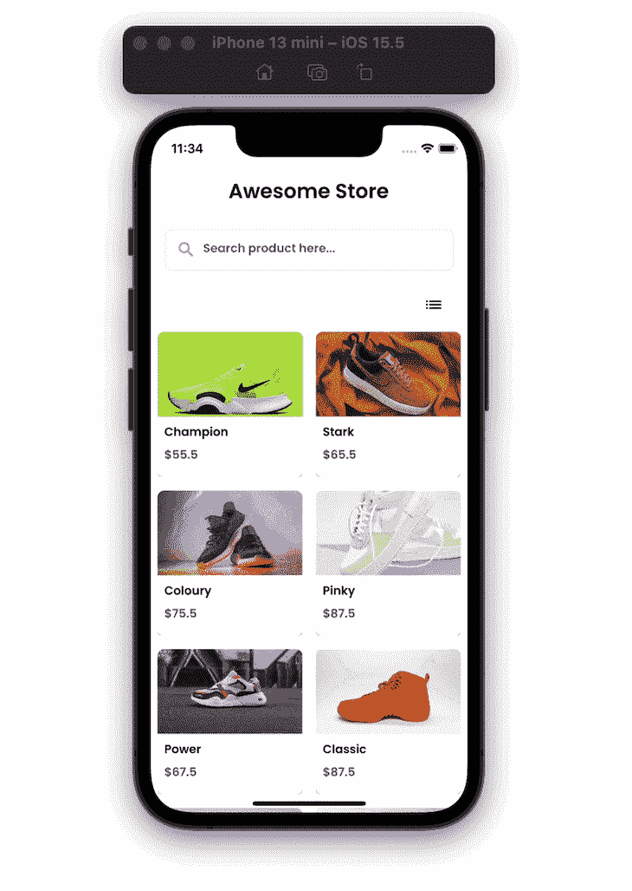
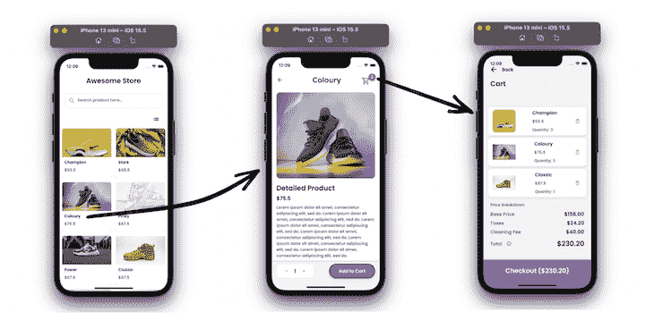
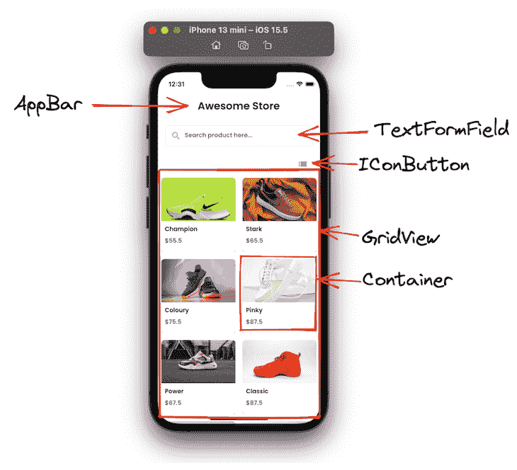
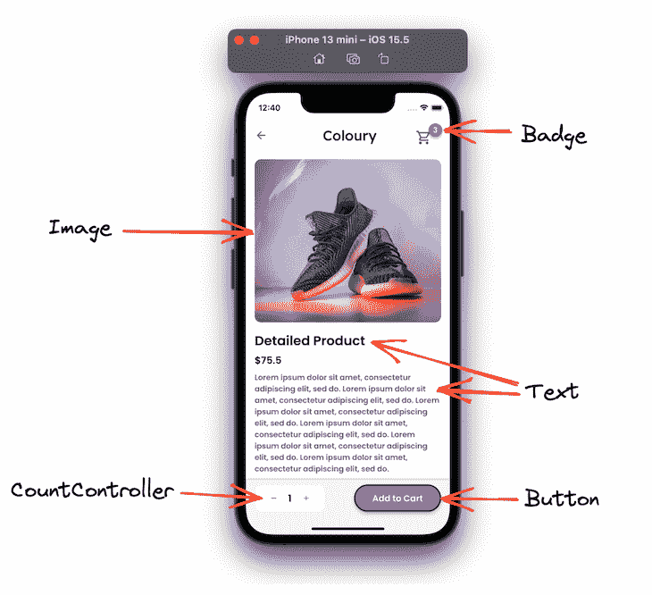
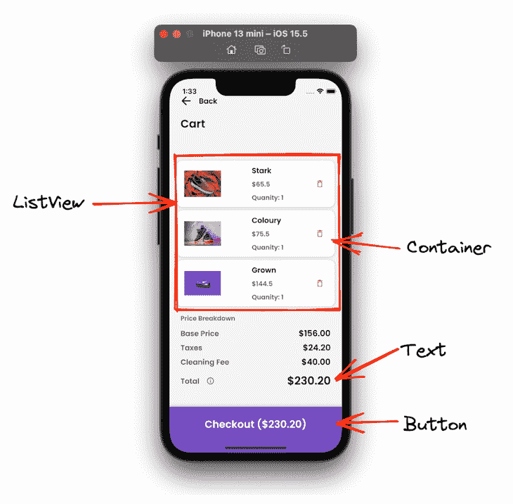
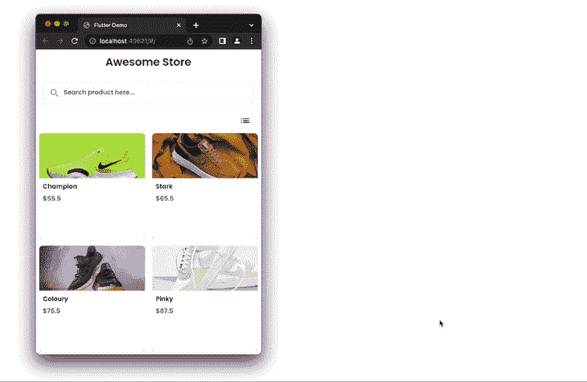
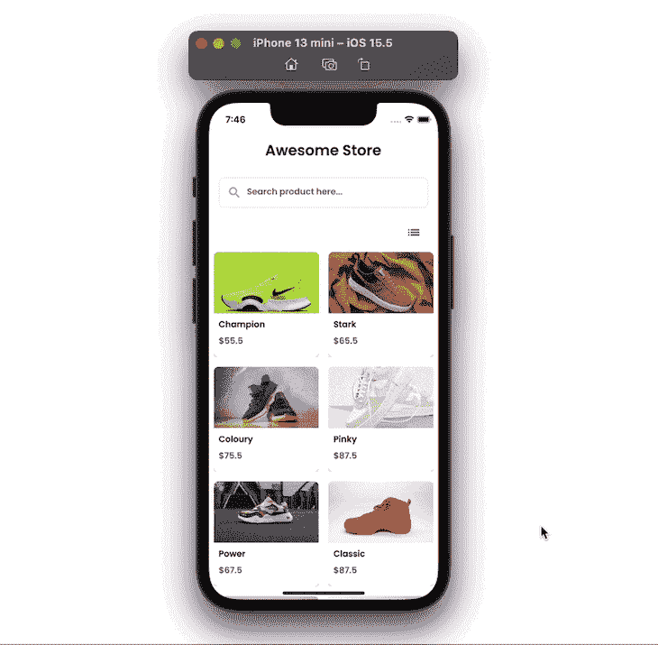

# 用 Flutter 建立一个直观的电子商务产品图库

> 原文：<https://blog.logrocket.com/build-an-intuitive-ecommerce-product-gallery-with-flutter/>

建立良好的用户体验对你的应用的成功至关重要。不管你卖的产品有多好，如果你的应用不能提供积极的 UX，你将会很挣扎。在本教程中，你将学习如何用 [Flutter](https://blog.logrocket.com/tag/flutter/) 构建一个直观的产品展示区，并提供更好的购买体验。

我们将构建一个示例应用程序，以引人入胜的方式列出产品——点击产品，我们将制作一个产品详细信息页面，您可以在其中设置其数量并将其添加到购物车中。在顶部，您还会看到添加到购物车的商品数量，当您单击它时，您会看到添加到它的所有产品的列表。

在本教程结束时，您将学习如何构建更宽的屏幕，允许搜索产品，切换视图，管理购物车的状态，以及在屏幕之间导航时添加材料运动，以获得流畅的用户体验。

以下是我们的 Flutter 电子商务产品图库完成后的外观:



以下是我们将在本教程中介绍的内容:

## 创建项目

在开始之前，您必须安装 Flutter SDK 并创建一个基本项目。让我们看看如何做到这一点。

先从[这个环节](https://docs.flutter.dev/get-started/install)获取 Flutter SDK。安装完成后，在终端中点击以下命令，检查是否一切正常:

```
flutter doctor

```

(注意:如果有任何内容标有红色标记，您必须在继续下一步之前解决它们)

现在，创建一个目录，并输入下面的命令。这将在指定的目录中创建一个全新的新项目。

```
flutter create ecomm_app

```

要打开、编辑文件内容并运行/调试/测试项目，您需要安装 IDE。您可以从以下任何编辑器中进行选择:

打开 projectfolder/lib/main.dart，通过点击 play 按钮从 IDE 运行 starter 应用程序。您也可以通过输入以下命令从命令行运行它:

```
flutter run
// Tip: If you are running multiple devices, you can run the 
// following:
flutter run -d "<device_name>"

```

## 创建屏幕

示例应用程序由三个屏幕组成:产品列表、产品详细信息和购物车页面。

让我们看看这些屏幕是如何适应流程的:



首先，你会看到所有的产品。轻按任何项目都会打开详细信息页面。您可以将商品添加到购物车并导航到购物车页面。

### 产品列表

第一个屏幕显示所有产品及其名称、图片和价格。在这里，您可以搜索产品，并在网格视图和列表视图之间切换视图。点击该项目，它会打开产品详细信息页面。

下面是一些基本的小部件，您可以使用它们来构建第一个屏幕:



下面是创建该容器的确切代码:

```
Container(
  //width: MediaQuery.of(context).size.width * 0.45,
  decoration: BoxDecoration(
    color: AppTheme.of(context).secondaryBackground,
    boxShadow: [
      BoxShadow(
        blurRadius: 4,
        color: Color(0x3600000F),
        offset: Offset(0, 2),
      )
    ],
    borderRadius: BorderRadius.circular(8),
  ),
  child: Padding(
    padding: EdgeInsetsDirectional.fromSTEB(0, 0, 0, 12),
    child: Column(
      mainAxisSize: MainAxisSize.max,
      children: [
        Row(
          mainAxisSize: MainAxisSize.max,
          children: [
            Expanded(
              child: ClipRRect(
                borderRadius: BorderRadius.only(
                  bottomLeft: Radius.circular(0),
                  bottomRight: Radius.circular(0),
                  topLeft: Radius.circular(8),
                  topRight: Radius.circular(8),
                ),
                child: Image.network(
                  product.image,
                  width: 100,
                  height: 100,
                  fit: BoxFit.cover,
                ),
              ),
            ),
          ],
        ),
        Padding(
          padding: EdgeInsetsDirectional.fromSTEB(0, 4, 0, 0),
          child: Row(
            mainAxisSize: MainAxisSize.max,
            children: [
              Padding(
                padding: EdgeInsetsDirectional.fromSTEB(8, 4, 0, 0),
                child: Text(
                  product.name,
                  style: AppTheme.of(context).bodyText1,
                ),
              ),
            ],
          ),
        ),
        Padding(
          padding: EdgeInsetsDirectional.fromSTEB(0, 2, 0, 0),
          child: Row(
            mainAxisSize: MainAxisSize.max,
            children: [
              Padding(
                padding: EdgeInsetsDirectional.fromSTEB(8, 4, 0, 0),
                child: Text(
                  '\$${product.price}',
                  style: AppTheme.of(context).bodyText2,
                ),
              ),
            ],
          ),
        ),
      ],
    ),
  ),
);

```

### 产品详情

产品详细信息页面显示产品信息。它允许您设置产品的数量并将其添加到购物车中。您也可以从该页面打开购物车。

以下是一些可用于构建产品详细信息窗口的基本小组件:



徽章小部件不是标准小部件；相反，它是从名为[徽章](https://pub.dev/packages/badges)的库中添加的。这将在值更新时自动激活徽章。

下面是在购物车商品上显示徽章的代码:

```
Badge(
  badgeContent: Text(
    '${cartItem.length}',
    style: AppTheme.of(context).bodyText1.override(
          fontFamily: 'Poppins',
          color: Colors.white,
        ),
  ),
  showBadge: true,
  shape: BadgeShape.circle,
  badgeColor: AppTheme.of(context).primaryColor,
  elevation: 4,
  padding: EdgeInsetsDirectional.fromSTEB(8, 8, 8, 8),
  position: BadgePosition.topEnd(),
  animationType: BadgeAnimationType.scale,
  toAnimate: true,
  child: IconButton(
    icon: Icon(
      Icons.shopping_cart_outlined,
      color: AppTheme.of(context).secondaryText,
      size: 30,
    ),
    onPressed: () {
      Navigator.push(
        context,
        MaterialPageRoute(
          builder: (context) => CheckoutWidget(),
        ),
      );
    },
  ),
)

```

### 手推车

该页面显示了添加到购物车中的所有商品的列表，可以从购物车中删除任何商品。在这里，您可以显示所有的价格汇总和一个结账选项。

下面是一些重要的小部件，您可以使用它们来构建购物车屏幕:



以下是如何显示购物车中所有商品的列表:

```
ListView.builder(
    padding: EdgeInsets.zero,
    primary: false,
    shrinkWrap: true,
    scrollDirection: Axis.vertical,
    itemCount: cartItems.length,
    itemBuilder: (BuildContext context, int index) {
      return Padding(
        padding: EdgeInsetsDirectional.fromSTEB(16, 8, 16, 0),
        child: Container(
          width: double.infinity,
          height: 100,
          decoration: BoxDecoration(
            color: AppTheme.of(context).secondaryBackground,
            boxShadow: [
              BoxShadow(
                blurRadius: 4,
                color: Color(0x320E151B),
                offset: Offset(0, 1),
              )
            ],
            borderRadius: BorderRadius.circular(12),
          ),
          child: Padding(
            padding: EdgeInsetsDirectional.fromSTEB(16, 8, 8, 8),
            child: Row(
              mainAxisSize: MainAxisSize.max,
              mainAxisAlignment: MainAxisAlignment.spaceBetween,
              children: [
                Hero(
                  tag: 'ControllerImage',
                  transitionOnUserGestures: true,
                  child: ClipRRect(
                    borderRadius: BorderRadius.circular(12),
                    child: Image.network(
                      cartItems[index].image,
                      width: 80,
                      height: 80,
                      fit: BoxFit.fitWidth,
                    ),
                  ),
                ),
                Padding(
                  padding: EdgeInsetsDirectional.fromSTEB(12, 0, 0, 0),
                  child: Column(
                    mainAxisSize: MainAxisSize.max,
                    mainAxisAlignment: MainAxisAlignment.center,
                    crossAxisAlignment: CrossAxisAlignment.start,
                    children: [
                      Padding(
                        padding: EdgeInsetsDirectional.fromSTEB(0, 0, 0, 8),
                        child: Text(
                          cartItems[index].name,
                          style: AppTheme.of(context).subtitle2.override(
                                fontFamily: 'Poppins',
                                color: AppTheme.of(context).primaryText,
                              ),
                        ),
                      ),
                      Text(
                        '\$${cartItems[index].price}',
                        style: AppTheme.of(context).bodyText2,
                      ),
                      Padding(
                        padding: EdgeInsetsDirectional.fromSTEB(0, 8, 0, 0),
                        child: Text(
                          'Quanity: ${cartItems[index].quantity}',
                          style: AppTheme.of(context).bodyText2,
                        ),
                      ),
                    ],
                  ),
                ),
                IconButton(
                  icon: Icon(
                    Icons.delete_outline_rounded,
                    color: Color(0xFFE86969),
                    size: 20,
                  ),
                  onPressed: () {
                  // Remove item
                  },
                ),
              ],
            ),
          ),
        ),
      );
    });

```

## 添加产品

一旦 UI 准备就绪，您就可以通过添加各种产品来填充产品列表。在真实的场景中，您将使用从后端服务器检索到的商品来填充该列表，但是出于简化的目的，我们将在本地变量中添加产品。

首先，创建一个产品类，它包含诸如`id`、`name`、`image`、`price`和`quantity`这样的字段。

```
class Product {
  final int id;
  final String name;
  final String image;
  final double price;
  int quantity;

  Product({required this.id, required this.name, required this.image, required this.price, this.quantity = 0});
}

```

现在，使用上面的类创建各种产品的列表。像这样:

```
final List<Product> products = [
  Product(
      id: 1,
      name: 'Champion',
      image:
          'https://images.unsplash.com/photo-1606107557195-0e29a4b5b4aa?ixlib=rb-1.2.1&ixid=MnwxMjA3fDB8MHxwaG90by1wYWdlfHx8fGVufDB8fHx8&auto=format&fit=crop&w=764&q=80',
      price: 55.5),
  Product(
      id: 2,
      name: 'Stark',
      image:
          'https://images.unsplash.com/photo-1549298916-b41d501d3772?ixlib=rb-1.2.1&ixid=MnwxMjA3fDB8MHxwaG90by1wYWdlfHx8fGVufDB8fHx8&auto=format&fit=crop&w=1624&q=80',
      price: 65.5),

];

```

同样，如果您愿意，您可以添加更多产品。一旦这个列表准备好了，就该传递并使用它来膨胀 [GridView](https://api.flutter.dev/flutter/widgets/GridView-class.html) 小部件了，如下所示:

```
GridView.builder(
  itemCount: products.length,
  itemBuilder: (context, index) => ProductTile(
    itemNo: index,
    product: products[index],
  ),
  gridDelegate: SliverGridDelegateWithFixedCrossAxisCount(
    crossAxisCount: 2,
    childAspectRatio: 1,
  ),
)

```

## 构建购物车

任何电子商务应用程序的核心功能是能够将产品添加到购物车中进行购买。为了构建这个特性，你可以在你的应用中加入状态管理。

对于这个应用程序，我们将使用名为 [Bloc](https://bloclibrary.dev/#/) 的状态管理技术，因为您可以将业务逻辑从 UI 中分离出来，这样更容易编写和重用测试。

[在这里](https://blog.logrocket.com/state-management-flutter-bloc-pattern/)，我们已经在一篇博文中讲述了如何使用 Bloc 设计模式。

阻塞状态管理要求您添加三个基本类:阻塞、事件和状态。为了在购物车中添加或删除商品，我们将添加以下类:

**卡丁车**

这是业务逻辑(添加和删除项目)驻留的地方。

```
class CartBloc extends Bloc<CartEvent, CartState> {
  CartBloc() : super(ProductAdded(cartItem: []));

  final List<Product> _cartItems = [];
  List<Product> get items => _cartItems;
  bool isGridView = true;

  @override
  Stream<CartState> mapEventToState(CartEvent event) async* {
    if (event is AddProduct) {
      _cartItems.add(event.productIndex);
      yield ProductAdded(cartItem: _cartItems);
    } else if (event is RemoveProduct) {
      _cartItems.remove(event.productIndex);
      yield ProductRemoved(cartItem: _cartItems);
    } else if (event is ChangeGallaryView) {
      isGridView = event.isGridView;
      yield ChangeGallaryViewState(isGridView: isGridView);
    }
  }
}

```

(注意:`_cartItems`是管理购物车商品的唯一来源)

**卡特事件**

这用于将项目发送到购物车。

```
abstract class CartEvent extends Equatable {
  const CartEvent();

  @override
  List<Object> get props => [];
}

class AddProduct extends CartEvent {
  final Product productIndex;

  const AddProduct(this.productIndex);

  @override
  List<Object> get props => [productIndex];

  @override
  String toString() => 'AddProduct { index: $productIndex }';
}

class RemoveProduct extends CartEvent {
  final Product productIndex;

  const RemoveProduct(this.productIndex);

  @override
  List<Object> get props => [productIndex];

  @override
  String toString() => 'RemoveProduct { index: $productIndex }';
}

```

**汽车状态**

这用于将项目发送到 UI。

* * *

### 更多来自 LogRocket 的精彩文章:

* * *

```
abstract class CartState {
  final List<Product> cartItem;
  final bool isGridView;
  const CartState({this.cartItem = const [], this.isGridView = true});

  @override
  List<Object> get props => [];
}

class CartLoadInProgress extends CartState {
  CartLoadInProgress({required super.cartItem});
}

class ProductAdded extends CartState {
  final List<Product> cartItem;

  const ProductAdded({required this.cartItem}) : super(cartItem: cartItem);

  @override
  List<Object> get props => [cartItem];

  @override
  String toString() => 'ProductAdded { todos: $cartItem }';
}

```

从 UI(带有“添加到购物车”文本的按钮)中，您可以插入以下代码来将商品添加到列表中:

```
onPressed: () {
  Product p = widget.product;
  p.quantity = countControllerValue!.toInt();
  BlocProvider.of<CartBloc>(context).add(AddProduct(p));
}

```

要从购物车中删除产品，只需触发事件来删除商品，如下所示:

```
onPressed: () {
  BlocProvider.of<CartBloc>(context).add(RemoveProduct(cartItems[index]));
}

```

要检索购物车中的商品，可以将 GridView 或 ListView 包装在 Bloc builder 中，每当添加或删除商品时，列表都会更新。

```
BlocBuilder<CartBloc, CartState>(builder: (_, cartState) {
  return ListView.builder();
}),

```

## 增加响应能力

你可能也想适应你的应用程序的网页版本。这意味着用户不应该觉得他们是在浏览器上使用移动应用程序；相反，它应该感觉像是一个原生的 web 应用程序。

对于这个应用程序，当应用程序在更宽的屏幕上使用时，我们可以显示更多的项目。您可能会惊讶地发现，只需对代码做一点小小的修改就可以实现这一点。

你可以这样做:

```
return LayoutBuilder(builder: (context, constraints) {
  return GridView.builder(
    itemCount: products.length,
    itemBuilder: (context, index) => ProductTileAnimation(
      itemNo: index,
      product: products[index],
    ),
    gridDelegate: SliverGridDelegateWithFixedCrossAxisCount(
      crossAxisCount: constraints.maxWidth > 700 ? 4 : 2, //<-SEE HERE
      childAspectRatio: 1,
    ),
  );
});

```

您可以将 GridView 小部件包装在`LayoutBuilder`中，它提供了用于确定宽度和高度的`constraints`。使用这些约束，我们可以构建各种用户界面。

对于我们的例子，在上面的代码中，每当屏幕分辨率在宽度上变为 700 或更大时，我们在横轴上显示四个项目。

它是这样工作的:



## 切换产品展示视图

有时您可能希望允许用户切换当前视图(即 GridView)并在 ListView 中显示它。

为此，您可以创建一个布尔变量(可能在块内)并切换其值。基于这个变量，您可以定义两个小部件— GridView 和 ListView —并更改图标。

以下是更改图标的方法:

```
BlocBuilder<CartBloc, CartState>(builder: (_, cartState) {
  bool isGridView = cartState.isGridView;
  return IconButton(
      onPressed: () {
        BlocProvider.of<CartBloc>(context).add(ChangeGallaryView(!isGridView));
      },
      icon: !isGridView ? Icon(Icons.grid_on) : Icon(Icons.list));
})

```

下面是选择显示哪个列表的代码:

```
BlocBuilder<CartBloc, CartState>(builder: (_, cartState) {
  bool isGridView = cartState.isGridView;
  if (isGridView) {
    return LayoutBuilder(builder: (context, constraints) {
      return GridView.builder(
        itemCount: products.length,
        itemBuilder: (context, index) => ProductTile(
          itemNo: index,
          product: products[index],
        ),
        gridDelegate: SliverGridDelegateWithFixedCrossAxisCount(
          crossAxisCount: 2,
          childAspectRatio: 1,
        ),
      );
    });
  } else {
    return ListView.builder(
        itemCount: products.length,
        itemBuilder: (BuildContext context, int index) {
          return ProductTile(
            itemNo: index,
            product: products[index],
          );
        });
  }
});

```

## 搜索产品

为了允许用户从列表中搜索，可以利用 TextFormField 的`onChanged`事件。这将为您提供输入到 TextFormField 中的最新字符。您可以使用它来过滤主列表，然后在新列表中提供搜索结果，如下所示:

```
TextFormField(
  controller: textController,
  obscureText: false,
  onChanged: (_) => EasyDebounce.debounce(
    'tFMemberController',
    Duration(milliseconds: 0),
    () {
      isSearchStarted =
          textController!.text.isNotEmpty && textController!.text.trim().length > 0;
      if (isSearchStarted) {
        print('${textController!.text.trim()}');
        searchedProducts = products
            .where((item) =>
                item.name.toLowerCase().contains(textController!.text.trim().toLowerCase()))
            .toList();
      }
      setState(() {});
    },
  ),
)

```

`isSearchStarted`变量用于指示是否显示搜索结果。

```
ProductList(
  products: isSearchStarted ? searchedProducts : products,
)

```

## 添加动画(Material Design 的运动系统)

可能需要添加动画来改善用户体验。除了默认的导航转换，你还可以添加动画，当你点击它时，它会平滑地打开产品详细信息页面。

通过将[动画](https://pub.dev/packages/animations)库添加到您的应用程序中，您可以使用材料运动系统中预先构建的动画集。

为此，将您的小部件包装在`OpenContainer`中，并在`openBuilder`参数中提供您想要制作动画的页面。

代码如下:

```
ContainerTransitionType _transitionType = ContainerTransitionType.fade;
OpenContainer<bool>(
  transitionType: _transitionType,
  openBuilder: (BuildContext _, VoidCallback openContainer) {
    return ProductDetailWidget(
      product: product,
    );
  },
  closedShape: const RoundedRectangleBorder(),
  closedElevation: 0.0,
  closedBuilder: (BuildContext _, VoidCallback openContainer) {
    return Container(
      // Product tile
    );
  },
)

```

它看起来是这样的:



这款 Flutter 电子商务应用的完整源代码可以在 GitHub [这里](https://github.com/pinkeshdarji/ecommerce_product_gallary)找到。

## 结论

创建直观的用户体验对于电子商务应用程序至关重要。本教程向您展示了如何开发好看的屏幕，并以引人入胜的方式展示产品。

我们还学习了如何使用 Bloc 等状态管理技术来管理购物车商品，以及如何通过添加切换、搜索和动画等功能来增强应用程序。

## [LogRocket](https://lp.logrocket.com/blg/ecommerce-signup) :看看用户为什么不完成你的电子商务流程中的一个步骤的技术和 UX 原因。

[](https://lp.logrocket.com/blg/ecommerce-signup)

LogRocket 就像是一个网络和移动应用程序和网站的 DVR，记录你的电子商务应用程序上发生的一切。LogRocket 没有猜测用户不转化的原因，而是主动揭示了阻止你转化的根本原因，比如 JavaScript 错误或死点击。LogRocket 还可以监控应用的性能，报告客户端 CPU 负载、客户端内存使用等指标。

开始主动监控您的电子商务应用程序— [免费试用](https://lp.logrocket.com/blg/ecommerce-signup)。