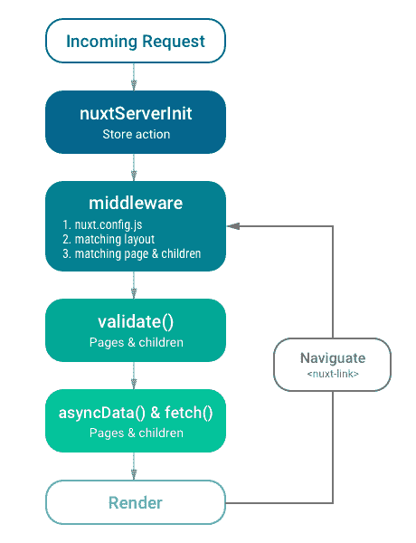
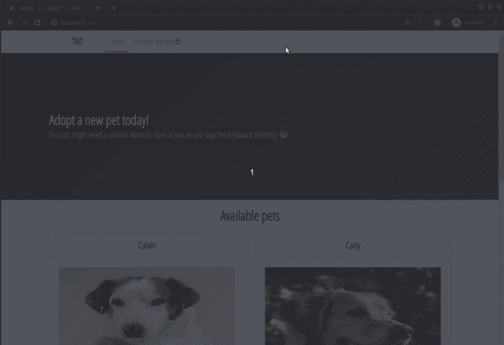
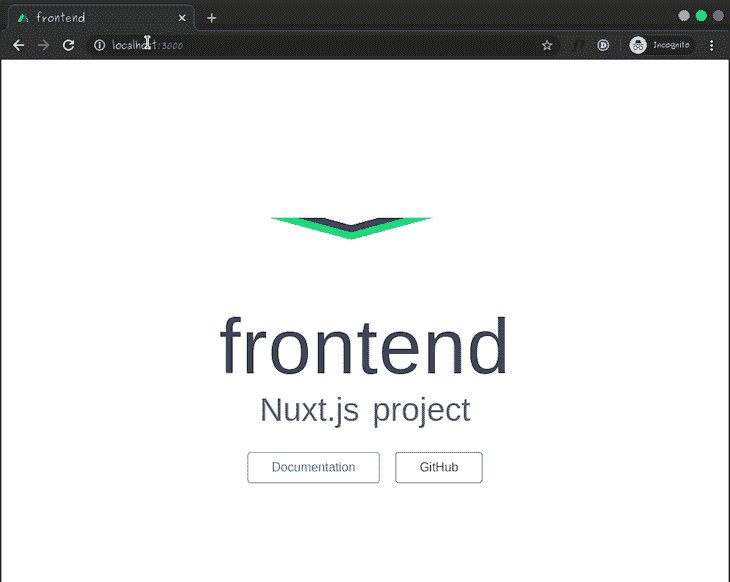
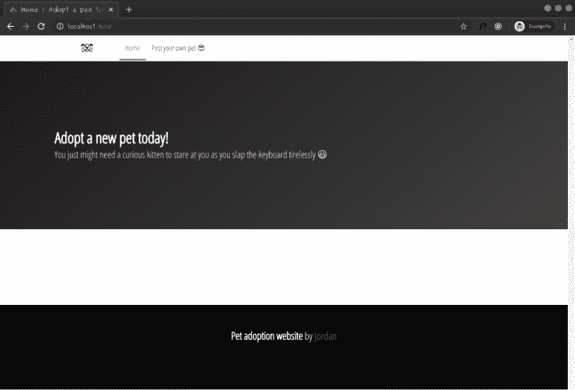
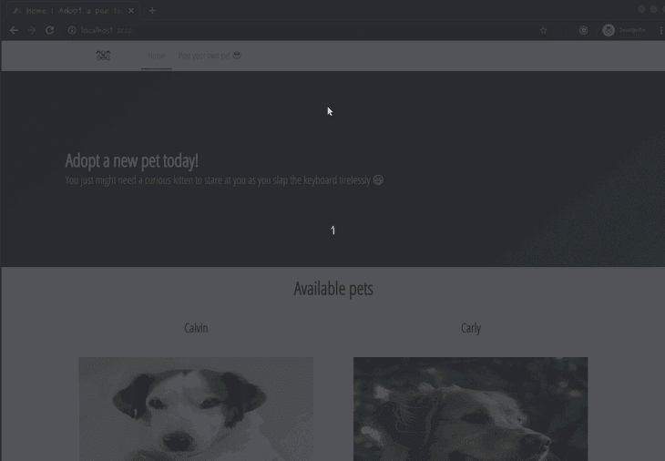
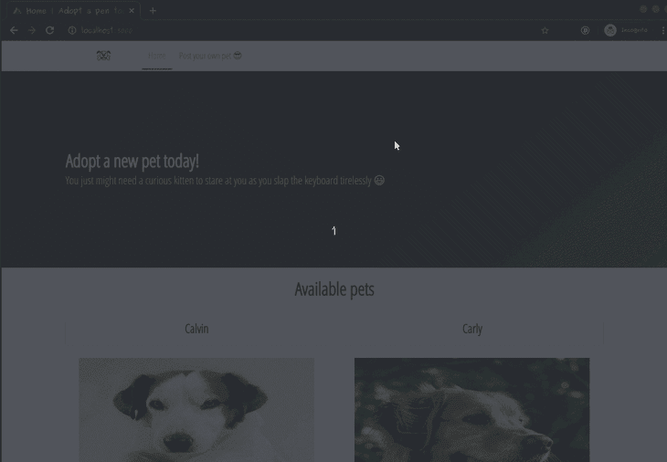

# 用 Nuxt.js 和 Node - LogRocket Blog 构建一个同构应用程序

> 原文：<https://blog.logrocket.com/build-an-isomorphic-application-with-nuxt-js-and-node/>

## 介绍

单页应用程序(SPAs)改变了互联网用户与网络应用程序交互的方式。SPA 是一个应用程序，它通过动态更新单个页面的内容来改善用户体验，而不是从服务器获取每个新页面。这些类型的 web 应用程序提供了以下好处:

### 愉快的路线

当用户从一个页面移动到另一个页面时，不需要重新加载页面，这会给人一种本地应用程序而不是 web 应用程序的感觉。一些开发人员在每次导航时添加过渡效果，以提供更流畅的体验。

### 消耗更少的带宽

在加载了主 JavaScript 包之后，spa 不必从服务器获取整个页面文档。这减少了数据交换中使用的带宽，并使网络应用程序易于在慢速互联网连接中使用。

### 快速加载时间

在传统的 web 应用程序中，浏览器在每个页面导航上向服务器发送一个 HTML 文件请求。SPAs 仅在第一次加载时发送此请求一次。需要的任何其他数据将被动态检索和注入。这使得 SPAs 比普通网站更快，因为当用户浏览应用程序时，他们不必加载新页面。

虽然水疗中心的概念是闪亮的，有很多优点，但它的设计也带来了一些缺点。这些缺点包括:

*   初始页面加载时间通常很慢，因为动态运行应用程序所需的 JavaScript 包很重
*   因为 web 应用程序是客户端呈现的，所以一些搜索引擎 web 爬虫和社交网络机器人在抓取页面时看不到应用程序的内容

## 什么是同构应用？

同构应用程序，如这里的[所描述的](https://en.wikipedia.org/wiki/Isomorphic_JavaScript)，旨在解决上面讨论的问题:

> 同构应用程序，也称为通用 JavaScript 应用程序，是在客户端运行应用程序之前，使用服务器端呈现预加载数据的 JavaScript 应用程序。这可以确保爬虫和其他机器人可以索引所有内容。

从头开始设置服务器端呈现的 JavaScript 应用程序可能会很麻烦，因为需要大量的配置。这是 Nuxt 旨在为 Vue 开发者解决的问题，[官方 Nuxt](https://nuxtjs.org/guide/) 网站将其描述为:

> Nuxt 是一个基于 Vue 的渐进式框架，它用于创建现代服务器端呈现的 web 应用程序。您可以使用 Nuxt 作为框架来处理应用程序的所有 UI 呈现，同时在服务器端预加载数据。

这个模式显示了在 Nuxt 应用程序中，当服务器被调用时或者当用户在 Nuxt 应用程序中导航时所发生的事情:



nuxt-schema

在本文中，我们将使用 Nuxt 和 Node 构建一个同构的宠物收养网站。下面是最终应用程序如何工作的演示:



让我们开始吧。

## 先决条件

本教程需要以下内容:

作为参考，本教程的源代码可以在 [GitHub](https://github.com/Jordanirabor/isomorphic-application) 上找到。

## 构建后端

我们将后端代码与前端代码分开，放在两个不同的文件夹中，但首先，让我们创建一个父目录来存放整个项目:

```
$ mkdir isomorphic-application
$ cd isomorphic-application
```

让我们在项目目录中创建`backend`文件夹:

```
$ mkdir backend
$ cd backend
```

我们要做的第一件事是初始化一个新的 npm 项目:

```
$ npm init -y
```

让我们安装 [Nodemon](https://www.npmjs.com/package/nodemon) 来帮助我们在修改代码时自动刷新服务器:

```
$ npm install nodemon -g
```

我们需要这些依赖项来帮助我们构建服务器、解析数据、处理图像和记录传入的请求:

```
$ npm install express cors request body-parser multer morgan mongoose crypto --save
```

让我们在`backend`目录中创建以下文件夹结构:

```
backend
└── /models
    └── pet.js
└── /routes
    └── api.js
└── index.js
└── mock.js
```

> 请注意，在后端目录中会自动生成其他文件和文件夹(如`node_modules`)。

让我们开始逐个更新这些文件，以逐渐成为我们的后端服务器来处理和处理请求。将以下代码粘贴到`models/pet.js`文件中:

```
// models/pet.js

const mongoose = require('mongoose');

const Schema = mongoose.Schema;

const petSchema = new Schema({
    name: { type: String },
    type: { type: String },
    imageUrl: { type: String },
    description: { type: String }
})

module.exports = mongoose.model('Pet', petSchema);
```

在上面的代码片段中，我们为想要创建的宠物定义了模式，并将其导出为一个[mongose](https://www.npmjs.com/package/mongoose)模型。我们希望每个宠物都有以下字段:

1.  名字
2.  类型(可能是一只猫或一只狗)
3.  imageUrl(其图像的地址)
4.  描述

现在将以下代码粘贴到`routes/api.js`文件中:

```
// routes/api.js

const Pet = require('../models/pet');
const express = require('express');
const path = require('path')
const multer = require('multer')
const crypto = require('crypto')
const router = express.Router();

const storage = multer.diskStorage({
    destination: 'public',
    filename: (req, file, callback) => {
        crypto.pseudoRandomBytes(16, function (err, raw) {
            if (err) return callback(err);
            callback(null, raw.toString('hex') + path.extname(file.originalname));
        });
    }
});

let upload = multer({ storage: storage })

router.post('/pet/new', upload.single('image'), (req, res) => {
    if (!req.file) {
        console.log("Please include a pet image");
        return res.send({
            success: false
        });
    } else {
        const host = req.get('host')
        const imageUrl = req.protocol + "://" + host + '/' + req.file.path;
        Pet.create({
            name: req.body.name,
            type: req.body.type,
            description: req.body.description,
            imageUrl
        }, (err, pet) => {
            if (err) {
                console.log('CREATE error: ' + err);
                res.status(500).send('Error')
            } else {
                res.status(200).json(pet)
            }
        })
    }
})

router.get('/pet/:_id', (req, res) => {
    Pet.findById(req.params._id, (err, pet) => {
        if (err) {
            console.log('RETRIEVE error: ' + err);
            res.status(500).send('Error');
        } else if (pet) {
            res.status(200).json(pet)
        } else {
            res.status(404).send('Item not found')
        }
    })
})

router.get('/pets', (req, res) => {
    const pets = Pet.find({}, (err, pets) => {
        if (err) {
            console.log('RETRIEVE error: ' + err);
            res.status(500).send('Error');
        } else if (pets) {
            res.status(200).json(pets);
        }
    })
})

module.exports = router;
```

在上面的代码片段中，我们导入了 [Multer](https://www.npmjs.com/package/multer) 包，并使用它来定义本地机器上图像的目的地。我们还使用了[加密](https://www.npmjs.com/package/crypto)包来为将要上传的宠物图片生成一个新的随机名称。

我们使用 [Express](https://www.npmjs.com/package/express) 路由器框架创建了三条路由:

1.  处理新宠物物品的上传
2.  `/pet/:_id`查找并返回一个现有的宠物，并在客户端进行渲染
3.  `/pets`返回所有宠物

最后，在代码片段的底部，我们导出了路由器。

打开`backend/index.js`文件并粘贴以下代码片段:

```
// backend/index.js

const express = require('express');
const bodyParser = require('body-parser');
const mongoose = require('mongoose')
const morgan = require('morgan');
const api = require('./routes/api')
const pets = require('./mock')
const path = require('path');
const app = express()

app.use((req, res, next) => {
    res.header("Access-Control-Allow-Origin", "*");
    res.header("Access-Control-Allow-Headers", "Origin, X-Requested-With, Content-Type, Accept");
    res.header("Access-Control-Allow-Methods", "GET, POST, PUT, DELETE, OPTIONS");
    next();
})

app.use(bodyParser.json());
app.use(bodyParser.urlencoded({ extended: true }));
app.use('/api', api);
app.use(morgan('dev'));
app.use('/public', express.static(path.join(__dirname, 'public')));

mongoose.connect('mongodb://localhost:27017/pets', { useNewUrlParser: true });

const db = mongoose.connection;
db.on('error', console.error.bind(console, 'Connection Error'))
db.once('open', () => {
    app.listen(9000, () => {
        console.log('Running on port 9000')
    })
    const petCollection = db.collection('pets')
    petCollection.estimatedDocumentCount((err, count) => {
        if (count) return
        petCollection.insertMany(pets)
    })
})
```

在上面的代码中，我们导入了我们需要的依赖项(包括一个我们尚未创建的模拟文件),并设置了头文件以防止 CORS 问题，因为客户端应用程序将在不同的端口上运行。

我们将`/public`(Multer 创建的图像的目的地)注册为一个[静态](https://expressjs.com/en/starter/static-files.html) URL，并使用 mongoose 客户端连接到 MongoDB。使用下面的代码块，我们在端口`9000`上启动服务器，如果数据库为空，则使用模拟数据播种数据库:

```
db.once('open', () => {
    app.listen(9000, () => {
        console.log('Running on port 9000')
    })
    const petCollection = db.collection('pets')
    petCollection.estimatedDocumentCount((err, count) => {
        if (count) return
        petCollection.insertMany(pets)
    })
})

```

现在让我们创建模拟数据，将以下代码粘贴到`backend/mock.js`文件中:

```
// backend/mock.js

const pets = [{
    'name': 'Calvin',
    'type': 'Dog',
    'imageUrl': 'https://placedog.net/636/660',
    'description': 'Great at giving warm hugs.'
},
{
    'name': 'Carly',
    'type': 'Dog',
    'imageUrl': 'https://placedog.net/660/636',
    'description': 'Has a little nice tail'
},
{
    'name': 'Muffy',
    'type': 'Cat',
    'imageUrl': 'https://placekitten.com/636/660',
    'description': 'Loves drinking milk'
},
{
    'name': 'Beth',
    'type': 'Cat',
    'imageUrl': 'https://placekitten.com/660/636',
    'description': 'Might give gentle bites when played with'
}]

module.exports = pets
```

上面的代码片段只是数据库的虚拟代码，因为我们希望应用程序总是显示一些宠物，即使是在第一次运行时。

我们可以通过在`backend`目录中运行以下命令来启动后端:

```
$ node index.js
```

为了在这个阶段测试后端，您可以使用 REST 客户端(如 [PostMan](https://www.getpostman.com/) )向端点发出请求。

## 构建前端

创建 Nuxt 项目的一个简单方法是使用团队创建的模板。如前所述，我们将把它安装到一个名为`frontend`的文件夹中，因此运行以下命令:

```
$ vue init nuxt/starter frontend
```

> 注意:您需要 vue-cli 来运行上面的命令。如果你的电脑上没有安装，你可以运行`npm install -g @vue/cli`来安装。

一旦命令运行，您将会看到询问一些问题的提示。您可以按下`Return`键接受默认值，因为它们将很好地适用于这个项目。现在运行以下命令:

```
$ cd frontend
$ npm install
```

我们将使用以下命令启动开发服务器:

```
$ npm run dev
```

服务器将从地址 [http://localhost:3000](http://localhost:3000) 启动，您将看到 nuxt 模板启动页面:



To confirm its server-side rendering, you can view the page’s source on your browser and you will see that the content on the page is rendered on the server and not injected during run-time by client-side JavaScript.

让我们通过相应地更新`nuxt.config.js`文件来进行一些配置:

```
// ./nuxt.config.js

module.exports = {
  /*
   * Headers of the page
   */
  head: {
    titleTemplate: '%s | Adopt a pet today',
    // ...
    link: [
      // ...
      {
        rel: 'stylesheet',
        href: 'https://cdn.jsdelivr.net/npm/[email protected]/css/bulma.min.css'
      },
      { rel: 'stylesheet', href: 'https://fonts.googleapis.com/css?family=Open+Sans+Condensed:300&display=swap' }
    ]
  },
  // ...
}
```

我们刚刚配置了我们的项目，使用`titleTemplate`选项根据我们所在的页面动态更新它的标题。我们将通过在应用程序的每个页面和布局上设置`title`属性来动态注入标题，并且`%s`占位符将被更新。

我们还引入了[布尔玛 CSS](https://bulma.io/) 来使用`link`属性设计我们的应用程序。

值得一提的是，当我们浏览时，Nuxt 使用 [vue-meta](https://github.com/nuxt/vue-meta) 来更新应用程序的标题。

## 扩展默认布局

我们安装的 Nuxt 模板附带了一个默认布局。我们将定制这个布局，并使用它来服务于我们为此应用程序定义的所有页面和组件。让我们用下面的代码片段替换`layouts/default.vue`文件的内容:

```
<!-- ./layouts/default.vue -->

<template>
  <div>
    <!-- begin navigation -->
    <nav class="navbar has-shadow" role="navigation" aria-label="main navigation">
      <div class="container">
        <div class="navbar-start">
          <nuxt-link to="/" class="navbar-item is-half">
            
          </nuxt-link>
          <nuxt-link active-class="is-active" to="/" class="navbar-item is-tab" exact>Home</nuxt-link>
          <nuxt-link
            active-class="is-active"
            to="/pet/new"
            class="navbar-item is-tab"
            exact
          >Post your own pet 😎</nuxt-link>
        </div>
      </div>
    </nav>
    <!-- end navigation -->
    <!-- displays the page component -->
    <nuxt />
    <!-- begin footer -->
    <footer class="footer home-footer has-background-black">
      <div class="content has-text-centered">
        <p class="has-text-white">
          <strong class="has-text-white">Pet adoption website</strong> by
          <a href="https://github.com/Jordanirabor">Jordan</a>
        </p>
      </div>
    </footer>
    <!-- end footer -->
  </div>
</template>

<style>
.main-content {
  margin: 20px 0;
}
body {
  font-family: "Open Sans Condensed", sans-serif;
}
p {
  font-size: 22px;
}
.home-footer{
  margin-top: 20vh;
}
</style>
```

在上面的自定义布局中，我们添加了一个导航标题，并使用`<nuxt-link>`来生成指向我们希望能够路由到的页面的链接:

1.  `/`到主页的路线
2.  `/pet/new`路由到允许用户上传新宠物的页面

单一的`<nuxt>`组件负责呈现动态页面内容。

## 创建主页

Nuxt 通过在页面目录中添加[单个文件组件](https://vuejs.org/v2/guide/single-file-components.html)，让我们可以选择创建页面，从而简化了路由。换句话说，`pages`目录中的每个文件都变成了可以访问的路径。

让我们通过用下面的代码片段替换`pages/index.vue`文件中的代码来创建主页:

```
<!-- ./pages/index.vue -->

<template>
  <div>
    <section class="hero is-medium is-dark is-bold">
      <div class="hero-body">
        <div class="container">
          <h1 class="title">Adopt a new pet today!</h1>
          <h2
            class="subtitle"
          >You just might need a curious kitten to stare at you as you slap the keyboard tirelessly 😃</h2>
        </div>
      </div>
    </section>
  </div>
</template>

<script>
export default {
  head: {
    title: "Home"
  }
};
</script>
```

在上面的代码片段中，我们使用[布尔玛 CSS](https://bulma.io/) 类定义了一些标记。在脚本部分，我们指定了一个等于“Home”的`title`,这样我们配置的`titleTemplate`在页面呈现在客户端之前就被更新了。

我们可以启动开发服务器(如果它还没有运行的话)。看看主页目前的样子:



This looks good, now we want to fetch the available pets from the backend server, loop through them and display each one of them in the homepage. Let’s start by replacing the `<template>` of the `pages/index.vue` file with this updated version:

```
<!-- ./pages/index.vue -->

<template>
  <!-- begin header -->
  <div>
    <section class="hero is-medium is-dark is-bold">
      <div class="hero-body">
        <div class="container">
          <h1 class="title">Adopt a new pet today!</h1>
          <h2
            class="subtitle"
          >You just might need a curious kitten to stare at you as you slap the keyboard tirelessly 😃</h2>
        </div>
      </div>
    </section>
    <!-- end header -->
    <!-- begin main content -->
    <section class="main-content">
      <div class="container">
        <h1 class="title has-text-centered">Available pets</h1>
        <div class="columns is-multiline">
          <div class="column is-half" v-for="pet in pets" :key="pet._id">
            <div class="card">
              <header class="card-header">
                <p class="card-header-title is-centered">{{ pet.name }}</p>
              </header>
              <div class="card-content">
                <figure class="image is-3by2">
                  
                </figure>
              </div>
              <footer class="card-footer">
                <nuxt-link :to="`/pet/${pet._id}`" class="card-footer-item">
                  <button class="button is-dark">Learn more about {{ pet.name }}</button>
                </nuxt-link>
              </footer>
            </div>
          </div>
        </div>
      </div>
    </section>
    <!-- end main content -->
  </div>
</template>
```

我们还将更新`<script>`部分，以便它向后端服务器发出请求，并在呈现客户端之前加载 pets 数据对象:

```
<!-- ./pages/index.vue -->

<script>
export default {
  head: {
    title: "Home"
  },
  async asyncData(context) {
    try {
      return await fetch("http://localhost:9000/api/pets")
        .then(res => res.json())
        .then(data => {
          return { pets: data };
        });
    } catch (e) {
      console.error("SOMETHING WENT WRONG :" + e);
    }
  },
  data() {
    return {
      pets: []
    };
  }
};
</script>
```

在上面的代码中，我们使用`asyncData`方法从后端服务器获取`pets`数据(使用基于承诺的[获取 API](https://developer.mozilla.org/en-US/docs/Web/API/Fetch_API) )。我们使用这种方法是因为它在向浏览器发送响应之前获取数据并在服务器端呈现数据。在从后端服务器成功检索数据之后，`pets`数据对象就可以作为 Vue 对象上的数据属性进行访问了。

现在，我们可以重新访问我们的应用程序，并查看预先填充了来自后端服务器的模拟数据的主页:

> 
> 
> Note: remember to keep the Node backend server running so the mock data is available.

## 构建动态单宠物页面

我们希望能够点击连接到每个宠物的卡片组件的按钮，并被路由到一个页面，显示该特定宠物的更多信息。我们如何用 Nuxt 实现这一点？Nuxt 允许我们添加动态路由，我们可以通过这样的 URL 访问它们:`/pet/1`。

为此，我们需要在 pages 文件夹中创建一个名为`pet`的新目录。然后，我们将像这样构造它:

```
pages
└── pet
    └── _id
        └── index.vue
```

像这样构建目录层次结构可以生成具有以下配置的动态路由:

```
router: {
  routes: [
    // ...
    {
      name: 'pet-id',
      path: '/pet/:id',
      component: 'pages/pet/_id/index.vue'
    }
  ]
}
```

一旦获得目录结构，将以下代码粘贴到`pages/pet/_id/index.vue`文件中:

```
<!-- ./pages/pet/_id/index.vue -->

<template>
  <div class="main-content">
    <div class="container">
      <div class="card">
        <header class="card-header">
          <p class="card-header-title is-centered">{{ pet.name }}</p>
        </header>
        <div class="card-content has-background-dark">
          <figure class="image is-1by1">
            
          </figure>
        </div>
        <br />
        <h4 class="title is-5 is-marginless">
          <p class="has-text-centered">About</p>
          <hr />
          <p class="has-text-centered">
            <strong>{{ pet.description }}</strong>
          </p>
          <br />
        </h4>
      </div>
    </div>
  </div>
</template>

<script>
export default {
  validate({ params }) {
    return /^[a-f\d]{24}$/i.test(params.id);
  },
  async asyncData({ params }) {
    try {
      let pet = await fetch(`http://localhost:9000/api/pet/${params.id}`)
        .then(res => res.json())
        .then(data => data);
      return { pet };
    } catch (e) {
      console.error("SOMETHING WENT WRONG :" + e);
      return { pet: {} };
    }
  },
  head() {
    return {
      title: this.pet.name,
      meta: [
        {
          hid: "description",
          name: "description",
          content: this.pet.description
        }
      ]
    };
  }
};
</script>
```

在上面的`<script>`部分，我们使用了一个叫做`validate()`的新方法。我们使用这个方法检查传递的路由参数是否是有效的十六进制 MongoDB [ObjectId](https://docs.mongodb.com/manual/reference/method/ObjectId/) 。在检查失败的情况下，Nuxt 将自动[重新加载页面，作为 404 错误](https://nuxtjs.org/api/pages-validate)。

在呈现页面之前，我们还使用了`asyncData`来获取单个宠物对象。再次访问我们的应用程序时，它将看起来像这样:



## 上传您的宠物

在这个阶段，浏览我们的应用程序并看到可爱的宠物图片已经很有趣了，但是如果我们有一只想要被收养的宠物呢？让我们创建一个新文件`pages/pet/new.vue`来实现这个特性。将以下代码粘贴到`pages/pet/new.vue`文件中:

```
<!-- pages/pet/new.vue -->  

<template>
  <div class="container">
    <br />
    <h1 class="title has-text-centered">{{pet.name}}</h1>
    <div class="columns is-multiline">
      <div class="column is-half">
        <form @submit.prevent="uploadPet">
          <div class="field">
            <label class="label">Name</label>
            <div class="control">
              <input
                class="input"
                type="text"
                placeholder="What is your pet's name?"
                v-model="pet.name"
              />
            </div>
          </div>
          <div class="field">
            <label class="label">Description</label>
            <div class="control">
              <textarea
                class="textarea"
                v-model="pet.description"
                placeholder="Describe your pet succintly"
              ></textarea>
            </div>
          </div>
          <div class="file">
            <label class="file-label">
              <input class="file-input" @change="onFileChange" type="file" name="resume" />
              <span class="file-cta">
                <span class="file-icon">
                  <i class="fas fa-upload"></i>
                </span>
                <span class="file-label">Upload a pet image…</span>
              </span>
            </label>
          </div>
          <br />
          <div class="field">
            <label class="label">Type of pet</label>
            <div class="control">
              <div class="select">
                <select v-model="pet.type">
                  <option value="Cat">Cat</option>
                  <option value="Dog">Dog</option>
                </select>
              </div>
            </div>
          </div>
          <div class="field is-grouped">
            <div class="control">
              <button class="button is-link">Submit</button>
            </div>
          </div>
        </form>
      </div>
      <div class="column is-half">
        <figure v-if="preview" class="image container is-256x256">
          
        </figure>
        <figure v-else class="image container is-256x256">
          
        </figure>
      </div>
    </div>
  </div>
</template>

<script>
export default {
  head() {
    return {
      title: "New Pet"
    };
  },
  data() {
    return {
      pet: {
        name: "",
        image: "",
        description: "",
        type: "Cat"
      },
      preview: ""
    };
  },
  methods: {
    onFileChange(e) {
      let files = e.target.files || e.dataTransfer.files;
      if (!files.length) {
        return;
      }
      this.pet.image = files[0];
      this.createImage(files[0]);
    },
    createImage(file) {
      let reader = new FileReader();
      let vm = this;
      reader.onload = e => {
        vm.preview = e.target.result;
      };
      reader.readAsDataURL(file);
    },
    async uploadPet() {
      let formData = new FormData();
      for (let data in this.pet) {
        formData.append(data, this.pet[data]);
      }
      try {
        let response = await fetch("http://localhost:9000/api/pet/new", {
          method: "post",
          body: formData
        });
        this.$router.push("/");
      } catch (e) {
        console.error(e);
      }
    }
  }
};
</script>
```

在上面的代码中，`uploadPet()`方法是一个异步方法，它向后端服务器发送一个新的 pet 对象，并在成功上传后重定向回主页:


万岁！这就把我们带到了教程的结尾。

## 结论

在这篇文章中，我们了解了水疗，它们的优点和缺点。我们还探索了同构应用程序的概念，并使用 Nuxt 构建了一个宠物收养网站，该网站在呈现 UI 之前在服务器端预加载数据。

本教程的源代码可以在 [GitHub](https://github.com/Jordanirabor/isomorphic-application) 上获得。

## 200 只显示器出现故障，生产中网络请求缓慢

部署基于节点的 web 应用程序或网站是容易的部分。确保您的节点实例继续为您的应用程序提供资源是事情变得更加困难的地方。如果您对确保对后端或第三方服务的请求成功感兴趣，

[try LogRocket](https://lp.logrocket.com/blg/node-signup)

.

[](https://lp.logrocket.com/blg/node-signup)[https://logrocket.com/signup/](https://lp.logrocket.com/blg/node-signup)

LogRocket 就像是网络和移动应用程序的 DVR，记录下用户与你的应用程序交互时发生的一切。您可以汇总并报告有问题的网络请求，以快速了解根本原因，而不是猜测问题发生的原因。

LogRocket 检测您的应用程序以记录基线性能计时，如页面加载时间、到达第一个字节的时间、慢速网络请求，还记录 Redux、NgRx 和 Vuex 操作/状态。

[Start monitoring for free](https://lp.logrocket.com/blg/node-signup)

.