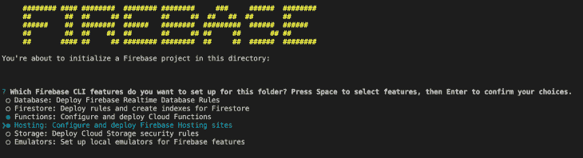
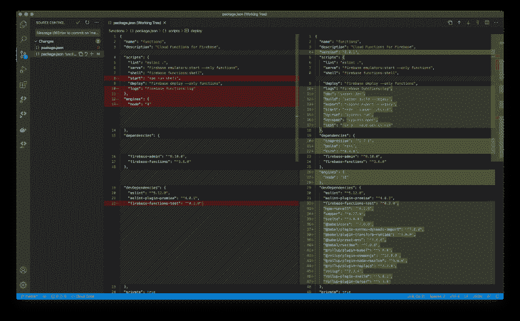

# 建立一个具有 Firebase 功能的 SSR web 应用程序，托管和苗条的 Sapper 

> 原文：<https://blog.logrocket.com/build-an-ssr-web-app-with-firebase-functions-hosting-and-svelte-sapper/>

前端开发人员的传统角色完全位于客户端。但是随着 Node.js、Jamstack 和无服务器架构的兴起，具备一定 JavaScript 知识水平的前端人员现在可以构建自己的 fullstack 解决方案。

你选择的道路是偏好和专业的结合。今天，我将介绍一种混合模式，我认为它提供了速度、可扩展性和成本的完美结合。

在本教程中，我们将构建一个服务器端呈现(SSR)的 web 应用程序，它使用可伸缩的无服务器功能为您的应用程序提供服务。当我们完成后，从用户的角度来看，我们的应用程序将像一个单页应用程序(SPA ),并且由于 SSR 的使用，搜索引擎将发现它非常容易消化。

这种在无服务器函数上进行服务器端渲染的双重性听起来非常愚蠢。然而，一切并不像看上去的那样。

无服务器意味着你不必自己管理服务器。在 Firebase 功能的情况下，Google 将为我们进行服务器管理、应用程序扩展以及其他复杂的基础设施和平台优化。这让我们专注于最好的部分——代码。

对于这个例子，我将使用 Firebase 作为部署我们的 web 应用程序的平台。不过，请记住，从微软的 Azure 函数到 AWS 的 Lambda 函数以及日益流行的 Netlify，每种口味都有一种无服务器函数。值得注意的是，大多数平台都有一个免费的功能层，这意味着使用率较低的小应用程序(如作品集网站)可能会免费运行。

## 让我们看看这将如何挂钩

我们的 web 应用程序由两部分组成:

*   **托管**:保存我们的`static files`，比如我们拥有的任何媒体、我们的收藏夹图标和任何其他静态内容。
*   **函数**:处理我们应用程序的服务器端呈现的小 JavaScript 函数，以及任何为我们可能最终使用的 API 提供端点的函数。

我们将使用的框架是 Svelte 的姐妹项目 [Sapper](https://sapper.svelte.dev/) 。Svelte 是前端界的后起之秀。这将允许我们在将应用程序发送到天空之灵之前对其进行编译，从一开始就提供超级快速的普通 JS 功能和反应组件。

### 什么是苗条和工整，我为什么要关心？

Svelte 和 Sapper 是 Javascript 大师理查德·哈里斯(臭名昭著的 Rollup 和其他开源软件的创造者)的创意。

它们建立在现代 Javascript 框架过于臃肿和过于虚拟化的概念之上。相反，他们通过提前编译代码，而不是使用客户端来完成繁重的工作，来提供一个轻松而简单的解决方案。

对于开发人员来说，他们提供了一套熟悉的打包在`.svelte`文件中的 HTML、CSS 和 JS 工具。只要有一点框架特定的语法，它们就可以被您喜欢的工具找到。当你准备好发送你的代码时，他们将所有的东西混合在一起，形成一个运行速度很快的机器可读的代码。

## 设置好一切

如果我已经说服你尝试一下 Sapper，那么欢迎来到一个教程，希望它能让你体验一下现代的、无摩擦的 web 应用程序是什么样子的。

我们将构建一个非常简单的站点，加入一些漂亮的特性，并通过命令行将其部署到云中。让我们开始吧。

### 你当地的环境

先走后跑，我们来谈谈你的设置。Visual Studio 代码是我在本教程中选择的编辑器。请随意使用您自己的，但您可能需要到处乱搞，以使您的设置工作。您的机器上还应该有 [Node.js](https://nodejs.org/en/) 。任何高于 10 的 LTS 版本都应该运行良好。

### 设置您的项目

让我们从创建项目文件夹开始。我们会给它起一个像`sapper-site`这样的帅气名字，并在 Visual Studio 代码中开放。

在工具栏的顶部，您应该看到`Terminal`，点击它，然后选择`New Terminal`。这将打开您选择的操作系统的命令提示符。很容易，我们将在您打算工作的项目文件夹中完成此操作。

我们将使用终端从主工蜂仓库构建工蜂基地，命令如下:

```
npx degit "sveltejs/sapper-template#rollup"
```

这将把模板直接链接到您的项目中。我们将安装我们与 npm 的依赖关系:

```
npm install
```

最后，我们将运行应用程序:

```
npm run dev
```

如果你在 localhost:3000 上打开浏览器，你会看到 Sapper base 项目:`Big Success`！万岁。

如果你想知道更多关于你刚刚做的东西的基本原理，我会推荐[官方文件](https://sapper.svelte.dev/docs)而不是在这里为你重复。

**让它成为我们自己的**

因此，我们有一个基础项目，我们让它开放。了不起。

值得注意的是，萨帕和斯维特的初始设置非常简单。这有助于它们运行得超快，但也意味着我们将不得不做一点家务，按照我们想要的方式来制作我们的 web 应用程序。这并不是说 Sapper 只有最基本的东西——你的应用已经有了自己的服务人员！相反，它生来就是一张空白的画布，由你来添加自己的色彩。

在你变得太有创造力之前，确保你的项目进入了 git 库。即使是最有经验的 gitter 也会留下一行代码，因为太晚而无法理清他们的错误。

* * *

### 更多来自 LogRocket 的精彩文章:

* * *

我个人喜欢我的 CSS 带有一点额外的 S，所以我在任何项目中的第一步都倾向于找到一种合适的方式来添加一个 SCSS 预编译器。寻找合适的资源通常需要反复试验。查看伟大的苗条社会[烹饪书食谱](https://github.com/svelte-society/recipes-mvp)让你行动起来。顺便说一句，苗条协会是一个很棒的团体，为所有苗条的人服务。

### 在云端

一旦你有了自己喜欢的 web 应用程序，是时候做一点重构来为 Firebase 做准备了。

这也是 git 提交的一个优点。我们即将把项目的大部分内容转移，我们不想失去我们所做的所有努力。

从现在开始，我们将进入谷歌的世界，所以你需要一个谷歌账户。由于我们正在使用 Firebase 函数，我们还需要运行一个`blaze plan`，这确实需要一个计费帐户。

为了开始向云的过渡，我们需要在本地安装 Firebase 工具。因为我们已经安装了节点，所以我们可以使用 npm:

```
npm install -g firebase-tools
```

这将允许我们为主机和功能设置回购。回到我们项目文件夹的终端，初始化 firebase:

```
firebase init
```

这为我们的项目提供了一组选项。我们将选择主机和功能。如果您想稍后在本地测试您的函数的服务，您也可以安装模拟器:



然后我们从列表中选择**创建一个新项目**。为您的项目取一个唯一的名称。可选地，你可以给你的项目一个`friendly name`。我们将选择 JavaScript 并启用 ESlint 来捕捉任何有问题的代码。

现在让 npm 安装它的依赖项，给它几分钟时间运行。

我们可以暂时将默认的 public repo 保留为 public，我们将同意将其配置为单页面应用程序。

### 重构 Firebase 的 Sapper repo

我们需要将我们的 Sapper 应用程序移动到 firebase functions 文件夹中，这样我们就可以运行 SSR 了。

让我们从将一些文件夹和文件填充到 functions 文件夹开始:

*   `Cypress/`
*   `Cypress.json`
*   `Rollup.config.js`
*   `src/`
*   `static/`

接下来，我们将我们的工兵`package.json`转移到函数上。我们可以使用 Visual Studio 代码的`Source Control`函数来匹配两个文件之间的变化。



这种合并的想法是尽可能多地保留两个文件，以便在我们的 functions 文件夹中生成一个`super`包文件。
在这一点上，我也把波尔卡换成了 Express，这是我首选的轻量级服务器。

一旦我们合并了我们的`package.json`，我们可以在我们的函数目录中进行 npm 安装。如果你卡住了，看看演示回购。这可能是一个有点棘手的过程。

接下来，我们需要更新一些文件。我们将从`index.js`开始，这是我们 web 应用程序 SSR 端的主要入口点。

```
// index.js
const functions = require('firebase-functions');
const { sapperServer } = require('./__sapper__/build/server/server');
exports.ssr = functions.https.onRequest(sapperServer); // see the server.js later for the name
```

我们在这里所做的只是将 Firebase 函数请求重定向到 Sapper 进行处理。我们需要将它与相应的`server.js`文件进行匹配，这样所有的东西都可以相互交流。

```
// server.js
import sirv from 'sirv';
import express from 'express';
import compression from 'compression';
import * as sapper from '@sapper/server';

const { PORT, NODE_ENV } = process.env;
const dev = NODE_ENV === 'development';

const sapperServer = express() // You can also use Express
   .use(
       compression({ threshold: 0 }),
       sirv('static', { dev }),
       sapper.middleware()
   )
   if(dev){
       sapperServer.listen(PORT, err => {
       if (err) console.log('error', err);
   });
   }

export {sapperServer}
```

在这里，出于偏好，我把波尔卡换成了 Express，但两者都可以。这里的主要变化是我们现在需要导出 Express，以便`index.js`可以读取它。

```
{
 "hosting": {
   "public": "functions/static",
   "ignore": [
     "firebase.json",
     "**/.*",
     "**/node_modules/**"
   ],
   "rewrites": [
     {
       "source": "**",
       "function": "ssr"
     }
   ]
 }
}
```

我们需要告诉 Firebase 将所有资源指向哪里，所以这个文件大部分都被重写了。

这是启动和运行我们的 Sapper 应用程序的关键:

*   我们告诉主机为我们所有的资源使用我们的函数/静态文件。这提供了我们的媒体，图标和清单。
*   我们告诉任何请求都要依靠 SSR 函数来有效地运行。

因此，让我们确保我们在函数目录中，并重新安装我们的`package.json`:

```
cd functions
npm install
```

检查一下我们的工兵项目是否还能用。

```
npm run dev
```

如果一切顺利，我们可以开始生产构建并将其部署到 Firebase。我们已经非常接近了，别担心。

```
npm run build
```

没有错误？太棒了。我们准备好做最后的部署了。

错误？别担心，在这一点上有一些问题是很常见的。我们已经搬了很多东西，错过其中的任何一步都会给你带来麻烦。这也不是你希望经常做的一步。调试的最佳方式是阅读您的控制台，确保您没有遗漏任何包，并将您的项目文件与示例 repo 进行比较。

### 为云部署

最后一步是部署我们的项目。我们将使用:

```
firebase deploy
```

这将我们的应用程序发送到云端。尤其是第一次部署到一个新项目时，您可以预期部署的功能方面会花费 5 分钟的时间。如果您已成功部署，您将在控制台中看到您的新托管 URL，您可以在控制台上预览您的 web 应用程序。如果您有一个自定义域，可以在 Firebase 控制台中将它附加到您的项目中。

## 结论

恭喜你！您已经成功地构建了一个 Sapper 项目，对其进行了重构以与 Firebase 一起工作，并将其发送到了天空中的无服务器服务器。

你的应用是轻量级的，可扩展的，同时也是小型的。如果你是 TL；DR type，您可以使用示例 repo 作为未来项目的起点，并在制作咖啡的时间内从 0 到 Firebase 函数。

点击查看 [github。](https://github.com/tristolliday/sapper-firebase-sample)

## 使用 [LogRocket](https://lp.logrocket.com/blg/signup) 消除传统错误报告的干扰

[](https://lp.logrocket.com/blg/signup)

[LogRocket](https://lp.logrocket.com/blg/signup) 是一个数字体验分析解决方案，它可以保护您免受数百个假阳性错误警报的影响，只针对几个真正重要的项目。LogRocket 会告诉您应用程序中实际影响用户的最具影响力的 bug 和 UX 问题。

然后，使用具有深层技术遥测的会话重放来确切地查看用户看到了什么以及是什么导致了问题，就像你在他们身后看一样。

LogRocket 自动聚合客户端错误、JS 异常、前端性能指标和用户交互。然后 LogRocket 使用机器学习来告诉你哪些问题正在影响大多数用户，并提供你需要修复它的上下文。

关注重要的 bug—[今天就试试 LogRocket】。](https://lp.logrocket.com/blg/signup-issue-free)