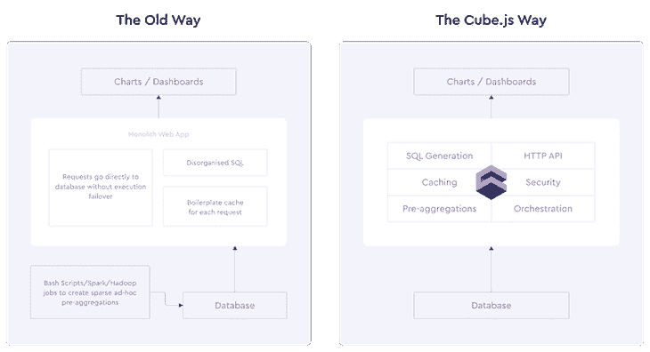
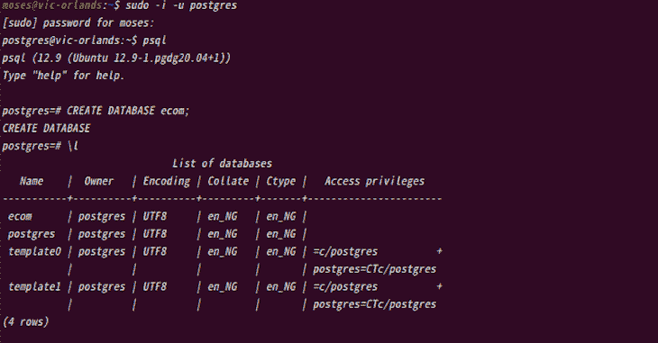
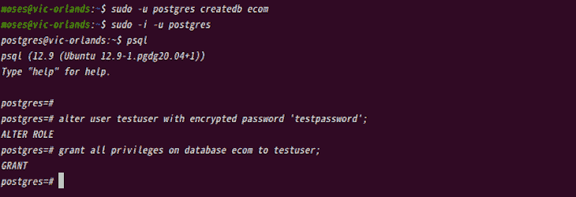
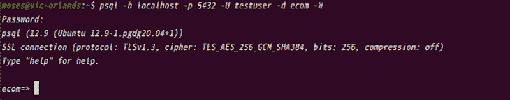
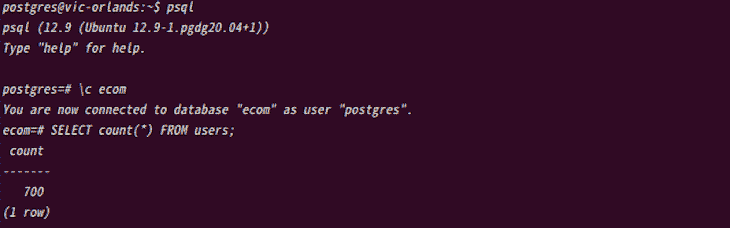
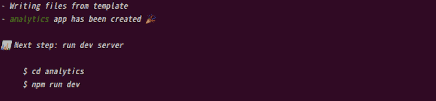
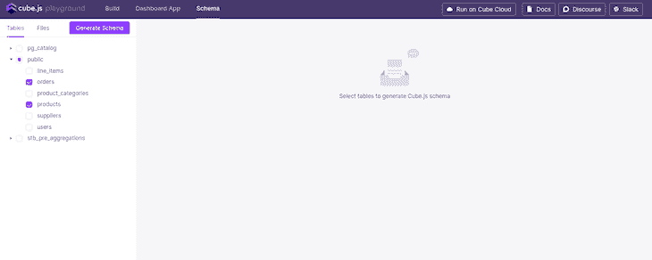
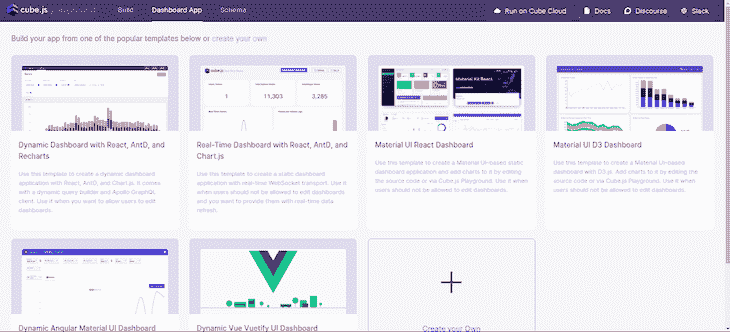

# 使用 React 和 Cube.js 构建一个分析应用程序

> 原文：<https://blog.logrocket.com/build-analytics-app-react-cube-js/>

在大数据世界中，数据分析和数据可视化齐头并进。借助数据可视化工具和技术，我们可以轻松分析海量信息，做出数据驱动的决策。

通过图表、表格、地图或图形等数据可视化类型提供数据的图形表示，可以简化决策过程。

在本文中，我们将学习如何构建一个分析应用程序来使用 React 和 Cube.js 监控和分析原始数据。该应用程序将监控通过 Cube.js 连接到 React 仪表板的数据库中的原始产品数据，显示产品的销售额以及产品销售给多少客户。

## Cube.js 是什么？

Cube.js 是一个开源分析平台，帮助用户在数据之上创建一个语义 API 层来管理访问控制和聚合数据。因为 Cube.js 是可视化不可知的，所以用户可以用任何选择的框架或库来构建前端。



Graphic from [GitHub](https://raw.githubusercontent.com/cube-js/cube.js/master/docs/content/old-was-vs-cubejs-way.png).

注意，Cube.js 不是数据库；相反，它是一个将数据库连接到前端的无头 API 层，因此用户可以更快地构建数据应用程序。

它还管理缓存和查询队列，并为前端提供 API 来构建仪表板和其他分析功能。

## React 和 Cube.js 教程先决条件

在我们继续之前，您必须对 React、PostgreSQL 和 [Recharts](https://blog.logrocket.com/using-recharts-react-add-charts/) 有一个基本的了解。另外，请注意，本文中的每个命令都在 Linux 上运行，因此 Windows 和 Mac 中的命令可能会有所不同。

## postgresql 数据库设置

Cube.js 需要一个数据库来存储和获取分析数据，所以[我们将使用](https://blog.logrocket.com/getting-started-with-postgres-in-your-react-app/)[Postgre](https://blog.logrocket.com/getting-started-with-postgres-in-your-react-app/)[SQL](https://blog.logrocket.com/getting-started-with-postgres-in-your-react-app/)[作为本教程](https://blog.logrocket.com/getting-started-with-postgres-in-your-react-app/)的数据库。

### 下载 Postgres

让我们从下载 PostgreSQL 或 Postgres 开始，并创建我们的数据库:

```
# Create the file repository configuration:
sudo sh -c 'echo "deb http://apt.postgresql.org/pub/repos/apt $(lsb_release -cs)-pgdg main" > /etc/apt/sources.list.d/pgdg.list'

# Import the repository signing key:
wget --quiet -O - https://www.postgresql.org/media/keys/ACCC4CF8.asc | sudo apt-key add -

# Update the package lists:
sudo apt-get update

# Install the latest version of PostgreSQL.
# If you want a specific version, use 'postgresql-12' or similar instead of 'postgresql':
sudo apt-get -y install postgresql

```

安装 Postgres 后，我们可以登录并创建一个数据库，稍后我们将把它连接到 Cube.js。

有两种方法可以创建 Postgres 数据库:要么使用`postgres`角色创建数据库，要么作为新用户创建数据库。让我们看看如何使用这两者。

### 使用`postgres`角色创建数据库

要使用`postgres`角色连接到 Postgres，我们必须通过键入以下命令切换到服务器上的 Postgres 帐户:

```
$ sudo -i -u postgres

```

这提示我们输入当前用户的密码；在这种情况下，它将是您计算机的密码。

然后，我们可以通过键入以下命令使用`psql`来访问 PostgreSQL:

```
$ psql

```

现在，运行以下命令创建一个新数据库:

```
CREATE DATABASE ecom;

```



我们已经成功创建了一个`ecom`数据库。

### 使用新用户创建数据库

使用这种方法，我们不需要登录 Postgres 我们可以简单地在家庭终端上运行这个命令:

```
sudo -u postgres createuser testuser

```

这个命令创建一个名为`testuser`的新 Postgres 用户。你可以给你的名字起任何你认为合适的名字。

然后，我们可以通过运行以下命令来创建数据库:

```
sudo -u postgres createdb ecom

```

使用新创建的名为`ecom`的数据库，让我们继续将所有特权授予我们刚刚创建的用户。要授予权限，我们必须首先登录 Postgres:

```
sudo -i -u postgres
psql

alter user testuser with encrypted password 'testpassword';
grant all privileges on database ecom to testuser;

```



我们现在可以通过运行以下命令尝试远程连接到我们的数据库:

```
psql -h localhost -p 5432 -U testuser -d ecom -W

```

该命令提示输入密码，因此输入数据库密码以连接到数据库。在我们的例子中，密码是`testpassword`。



### 用数据推广数据库

现在我们有了一个工作数据库，我们可以用一个电子商务样本数据集填充数据库。我们将在稍后配置 Cube.js 服务时使用这个数据集。

你也可以使用像这样的其他样本数据集 [dvdrental](https://www.postgresqltutorial.com/wp-content/uploads/2019/05/dvdrental.zip) ，但是一定要在这里阅读[如何使用它](https://www.postgresqltutorial.com/load-postgresql-sample-database/)。

要用电子商务数据集填充我们的数据库，请运行以下命令:

```
\q // to exit the psql terminal
sudo -i -u postgres // to login to postgres
curl -L http://cube.dev/downloads/ecom-dump.sql > ecom-dump.sql
psql --dbname ecom -f ecom-dump.sql
/pre>

After successfully populating the ecom database, run this command to see the user’s relations count in the database:
```

```
psql // to enter psql command line
\c ecom // to connect or enter your database
SELECT count(*) FROM users;

```



“关系”是表格的数学名称。因此，用户的关系计数是用户关系中表的总数。

我们还可以运行`\d+`来查看数据库中所有关系的列表。现在，我们完成了后端设置。

## Cube.js 安装程序

要搭建我们的 Cube.js 项目，请运行以下命令:

```
npx cubejs-cli create <project name> -d <database type>

```

现在，我们可以通过运行以下命令来设置我们的 Cube.js 项目:

```
npx cubejs-cli create analytics -d postgres

```

这会创建一个名为`analytics`和`postgres`的新项目作为我们的数据库。



接下来，让我们将以下 Postgres 数据库凭证手动添加到`.env`文件中。这允许我们将 Postgres 数据库连接到 Cube.js:

```
CUBEJS_DB_TYPE=postgres
CUBEJS_DB_HOST=localhost
CUBEJS_DB_NAME=ecom
CUBEJS_DB_USER=postgres
CUBEJS_DB_PASS=testpassword

```

如果您使用不同的数据库名称，比如`user`，请用您唯一的凭证填充它。

我们经常看不到文件夹中的`.env`文件，在看到`.env`文件之前，我们必须检查查看隐藏文件的选项。我们可以使用终端通过简单地运行以下命令来添加凭证:

```
cat .env   // to view the file in your terminal
vi .env    // to edit the file in your terminal editor
Press :wq! // keys to save the updated file and exit from the editor.
cat .env   // to see the updated file

```

之后，我们进入我们的文件夹并运行下面的命令:

```
cd analytics

npm run dev

```

让我们转到 [http://localhost:4000/](http://localhost:4000/) 来查看开发者园地，我们也在这里生成我们的数据模式。你可以阅读更多关于 [Cube.js 数据模式](https://cube.dev/docs/schema/getting-started)的内容。

接下来，点击**公共**下拉菜单，选择**产品**和**订单**，点击**生成模式**生成`Order.js`和`Products.js`模式文件。



请注意，在使用 ctrl+z 停止该过程并尝试再次运行它的情况下，您可能会得到一个错误。这是因为在使用地址时，进程仍在后台运行。

要清除此错误，请使用以下命令终止该进程并清除地址:

```
fuser -k 4000/tcp

```

## 设置 React 应用程序

这是本教程的最后一部分。为自己走到这一步鼓掌吧，这是你应得的。

现在，让我们继续完成我们开始的工作。我们可以通过两种方式将 Cube.js 连接到 React 应用程序:

1.  通过使用[cube . js](https://cube.dev/docs/dev-tools/dev-playground)[D](https://cube.dev/docs/dev-tools/dev-playground)[eveloper](https://cube.dev/docs/dev-tools/dev-playground)[P](https://cube.dev/docs/dev-tools/dev-playground)[lay ground](https://cube.dev/docs/dev-tools/dev-playground)
2.  通过使用现有的 React 应用程序

要使用开发者乐园，请转到**仪表板应用**部分，选择任何可用模板或创建一个新应用。



如果您正在使用现有的 React 应用程序，您只需要安装所需的包或依赖项，并连接到 Cube.js。

对于本教程，我们将使用现有的 React 应用程序，因此我们可以继续安装 Recharts 和 Cube.js 核心包:

```
npm i --save @cubejs-client/core @cubejs-client/react recharts

```

现在，让我们将已安装的软件包导入到我们的`Analytics.js`文件中:

```
import React from "react";
import cubejs from "@cubejs-client/core";
import { QueryRenderer } from "@cubejs-client/react";
import { BarChart, Bar, XAxis, YAxis, Tooltip } from "recharts";

```

最后，让我们导入我们安装的三个模块，分别是`@cubejs-client/core`、`@cubejs-client/react`和`recharts`:

```
import React from "react";
import cubejs from "@cubejs-client/core";
import { QueryRenderer } from "@cubejs-client/react";
import { BarChart, Bar, XAxis, YAxis, Tooltip } from "recharts";

const cubejsApi = cubejs(
  "4c2a328092cda6a1944499663fcaf730c1622823fb714ee4e60ba4917cd9a773219d98df8aa91817813a9fffe012d8ebe0f507849719606a0722b0a47d08757d",
  { apiUrl: "http://localhost:4000/cubejs-api/v1" }
);

const Analytics = () => {
  return (
    <QueryRenderer
      query={{
        measures: ["Orders.count"],
        dimensions: ["Products.name"],
        timeDimensions: [
          {
            dimension: "Orders.createdAt",
            granularity: "day",
            dateRange: "last 3 days"
          }
        ]
      }}
      cubejsApi={cubejsApi}
      render={({ resultSet }) => {
        if (!resultSet) {
          return "Loading Analytics...";
        }
        return (
          <BarChart width={600} height={300} data={resultSet.rawData()}>
            <XAxis dataKey="Products.name" stroke="#8884d8" />
            <YAxis />
            <Tooltip />
            <Bar barSize={30} dataKey="Orders.count" stroke="#8884d8" />
          </BarChart>
        );
      }}
    />
  );
};

```

`@cubejs-client/core`允许我们连接到我们的 Cube.js 后端，接受两个参数:我们的 Cube.js 秘密令牌，它可以在我们的`.env`文件中找到，以及 API URL，它是 Cube.js 在开发模式中的默认 URL。

`@cubejs-client/react`允许我们从我们的功能性 React 组件查询我们的 Cube.js 后端，使用`useCubeQuery`钩子来执行这个查询。然后我们可以将我们需要的`dimensions`和`measures`传递给钩子。

此外，这里的`dimensions`是我们的定量数据，如售出的单位数、独特访问数或订单数，而`measures`是分类数据，如性别、产品名称或时间单位(如日、周或月)。

我们可以将`granularity`查询分别改为`week`、`month`或`year`，或者将`dateRange`分别改为`last {n} week`、`month`或`year`。我们还可以根据生成的模式改变`measures`和`dimensions`。

有了所有的数据，我们最终可以使用来自 Recharts 模块的`BarChart`来可视化它。如果需要，我们也可以使用 Recharts 提供的`LineChart`、`AreaChart`或`PieChart`。

## 结论

我们可以为我们的分析应用程序使用任何数据库。要使用 MongoDB，只需下载`mongodb`实例和 MongoDB Connector for BI，它有助于在 MongoDB 上编写 SQL 查询。

我们也可以使用任何我们熟悉的可视化包，比如 D3.js 或 Charts.js。

访问 Cube.js 官方[网站](https://cube.dev/)了解如何认证您的分析应用程序，以便用户对分析数据拥有不同级别的访问权限，并利用 Cube.js 提供的许多很酷的分析功能。

## [LogRocket](https://lp.logrocket.com/blg/react-signup-general) :全面了解您的生产 React 应用

调试 React 应用程序可能很困难，尤其是当用户遇到难以重现的问题时。如果您对监视和跟踪 Redux 状态、自动显示 JavaScript 错误以及跟踪缓慢的网络请求和组件加载时间感兴趣，

[try LogRocket](https://lp.logrocket.com/blg/react-signup-general)

.

[ ](https://lp.logrocket.com/blg/react-signup-general) [](https://lp.logrocket.com/blg/react-signup-general) 

LogRocket 结合了会话回放、产品分析和错误跟踪，使软件团队能够创建理想的 web 和移动产品体验。这对你来说意味着什么？

LogRocket 不是猜测错误发生的原因，也不是要求用户提供截图和日志转储，而是让您回放问题，就像它们发生在您自己的浏览器中一样，以快速了解哪里出错了。

不再有嘈杂的警报。智能错误跟踪允许您对问题进行分类，然后从中学习。获得有影响的用户问题的通知，而不是误报。警报越少，有用的信号越多。

LogRocket Redux 中间件包为您的用户会话增加了一层额外的可见性。LogRocket 记录 Redux 存储中的所有操作和状态。

现代化您调试 React 应用的方式— [开始免费监控](https://lp.logrocket.com/blg/react-signup-general)。