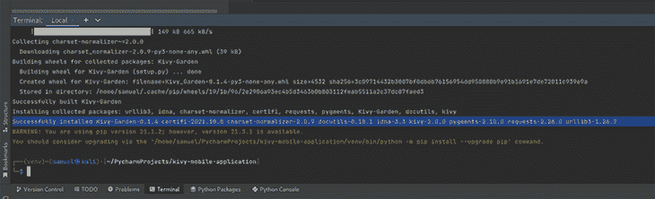
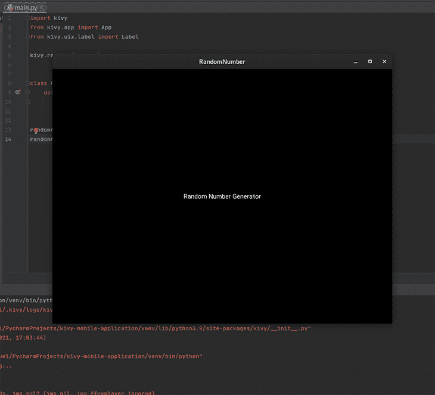
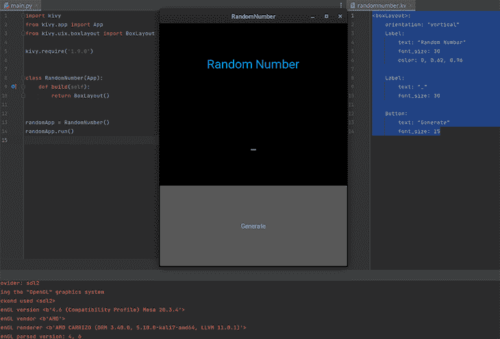
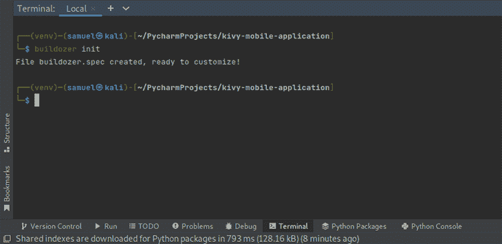
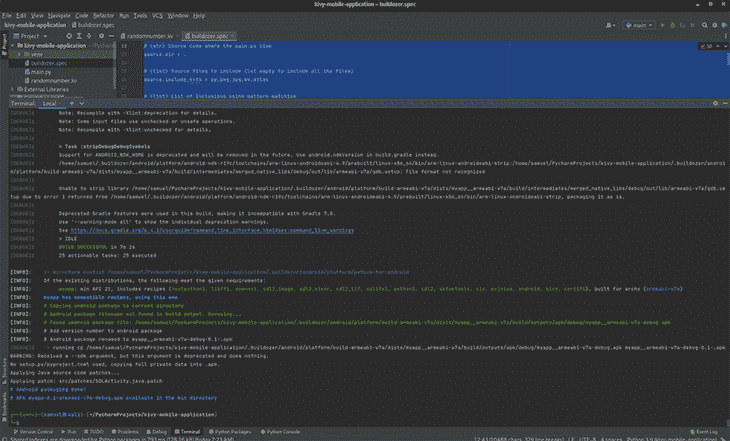
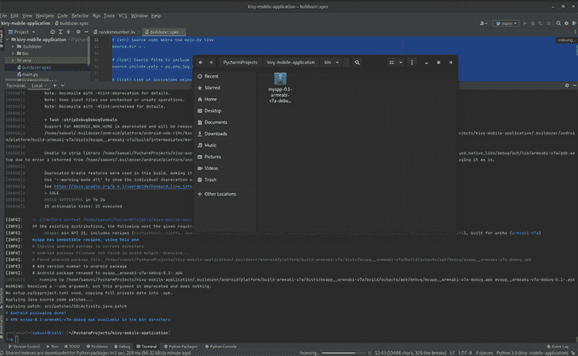

# 用 Kivy Python 框架构建一个 Android 应用程序

> 原文：<https://blog.logrocket.com/build-android-application-kivy-python-framework/>

如果你是一名 Python 开发者，正在考虑开始移动开发，那么 [Kivy framework](https://kivy.org/#home) 是你的最佳选择。使用 Kivy，您可以开发独立于平台的应用程序，为 iOS、Android、Windows、MacOS 和 Linux 编译。在本文中，我们将讨论:

要阅读本文，您应该熟悉 Python。我们开始吧！

## Kivy 入门

首先，你需要为你的应用程序创建一个新的目录。确保您的计算机上安装了 Python，并打开一个新的 Python 文件。您需要使用下面的命令从您的终端安装 Kivy 模块。为了避免任何包冲突，请确保在虚拟环境中安装 Kivy:

```
pip install kivy 
//
pip3 install kivy 

```

一旦你安装了 Kivy，你应该会在你的终端上看到一个类似下面截图的成功消息:


Kivy installation



接下来，导航到您的项目文件夹。在`main.py`文件中，我们需要导入 Kivy 模块并指定我们想要的版本。你可以使用 Kivy v2.0.0，但如果你有一部比 Android v8 更老的智能手机，我推荐 v1.9.0。你可以在构建期间摆弄不同的版本，看看功能和性能的差异。

要指定版本，在`import kivy`行后添加版本号，如下所示:

```
kivy.require('1.9.0')

```

### 创建`RandomNumber`类

现在，我们将创建一个类来定义我们的应用程序；我给我的取名`RandomNumber`。这个类将从 Kivy 继承`app`类。因此，您需要通过添加`from kivy.app import App`来导入`app`:

```
class RandomNumber(App): 

```

在`RandomNumber`类中，您需要添加一个名为`build`的函数，它接受一个`self`参数。为了实际返回 UI，我们将使用`build`函数。现在，我把它作为一个简单的标签返回。为此，您需要使用行`from kivy.uix.label import Label`导入`Label`:

```
import kivy
from kivy.app import App
from kivy.uix.label import Label

class RandomNumber(App):
  def build(self):
    return Label(text="Random Number Generator")

```

现在，我们的应用程序框架完成了！在继续之前，您应该创建一个`RandomNumber`类的实例，并在您的终端或 IDE 中运行它来查看接口:

```
import kivy
from kivy.app import App
from kivy.uix.label import Label

class RandomNumber(App):
  def build(self):
    return Label(text="Random Number Generator")

randomApp = RandomNumber()
randomApp.run()

```

当您运行带有文本`Random Number Generator`的类实例时，您应该会看到一个简单的界面或窗口，类似于下面的屏幕截图:



Simple interface after running the code

在你完成整个构建之前，你无法在 Android 上运行文本。

## 外包接口

接下来，我们需要一种外包接口的方法。首先，我们将在我们的目录中创建一个 Kivy 文件，它将包含我们的大部分设计工作。

### 关于文件命名的一个注记

您需要使用小写字母和扩展名`.kv`将这个文件命名为与您的类相同的名称。Kivy 会自动关联类名和文件名，但如果它们完全相同，可能在 Android 上不起作用。(这可能是我这边的一个小故障，但是你可以在你这边处理它。从我的测试来看，你必须用小写字母写你的 Kivy 文件名。)

在这个`.kv`文件中，您需要指定应用程序的布局，包括标签、按钮、表单等元素。Kivy 中的布局有不同的类型，但是有相同的功能——它们都是容器，用于以特定于所选布局的方式排列小部件；你可以[在他们的入门指南中阅读更多关于不同 Kivy 布局](https://kivy.org/doc/stable/gettingstarted/layouts.html)的信息。

### 应用方框布局

为了使这个应用程序简单，我将使用盒子布局。简而言之，box 布局以两种方向之一排列小部件和其他元素:垂直或水平。我将添加三个标签:

1.  一个为标题`RandomNumber`
2.  一个用作生成的随机数的占位符`_`
3.  调用`generate`功能的`Generate`按钮

请记住，这些标签将堆叠在彼此之上。

我的`.kv`文件看起来像下面的代码，但是你可以使用不同的值来满足你的需求:

```
<boxLayout>:
    orientation: "vertical"
    Label:
        text: "Random Number"
        font_size: 30
        color: 0, 0.62, 0.96

    Label:
        text: "_"
        font_size: 30

    Button:
        text: "Generate"
        font_size: 15 

```

在上面的代码片段中，第 2 行指定了我的应用程序使用的布局类型，第 3 行指定了我刚才提到的方向。其余的行是可定制的，因此您可以指定您希望 UI 元素如何显示。

### Kivy color values

Kivy 中的颜色值不是典型的 RGB 值，它们是归一化的。要理解颜色标准化，您需要知道颜色值的分布通常取决于照明。这取决于照明条件、镜头效果和其他因素。

为了避免这种情况，Kivy 接受了`(1, 1, 1)`约定。这是 Kivy 代表 RGB 的`(255, 255, 255)`。要将正常的 RGB 值转换为 Kivy 的约定，您需要将所有值除以 255。这样，你就可以从`0`–`1`中得到值。

### 构建 UI 的其余部分

在`main.py`文件中，您不再需要`Label` import 语句，因为 Kivy 文件会处理您的 UI。然而，您确实需要导入`boxlayout`，您将在 Kivy 文件中使用它。

在您的主文件中，添加导入语句并编辑您的`main.py`文件，在`build`方法中读取`return BoxLayout()`:

```
from kivy.uix.boxlayout import BoxLayout

```

如果您运行上面的命令，您应该会看到一个简单的界面，它有随机数标题、`_`占位符和可点击的`generate`按钮:



Random number app is generated

注意，您不需要导入任何额外的东西来使 Kivy 文件工作。基本上，当您运行应用程序时，它会通过在 Kivy 文件中查找与您的类同名的文件来返回`boxlayout`。请记住，这是一个简单的界面，所以您可以让您的应用程序尽可能健壮。请务必查看 Kv 语言文档以获取灵感。

## 生成随机数函数

现在我们的应用程序差不多完成了，我们需要一个简单的函数来在用户点击`generate`按钮时生成随机数。然后，它会将该随机数呈现到应用程序界面中。为此，我们需要更改文件中的一些内容。

首先，导入将用于生成随机数的 random 模块，并创建调用生成的数字的函数或方法。要导入随机模块，使用语句`import random`。

在这个演示中，我将使用一个介于`0`和`2000`之间的范围。用`random.randint(0, 2000)`一行程序生成随机数很简单。我们稍后会将它添加到我们的代码中。

接下来，我们将创建另一个类，它将是我们自己的 box 布局版本。我们的类将继承`box layout`类，它包含了生成随机数并在接口上呈现它们的方法:

```
class MyRoot(BoxLayout):
    def __init__(self):
        super(MyRoot, self).__init__()

```

之后，您需要在该类中创建`generate`方法，该方法不仅会生成随机数，还会操作标签，该标签控制在 Kivy 文件中显示为随机数的内容。

为了适应这种方法，我们首先需要对`.kv`文件进行修改。因为`MyRoot`类继承了`box layout`，所以您可以将`MyRoot`作为`.kv`文件中的顶级元素:

```
<MyRoot>:
    BoxLayout:
        orientation: "vertical"
        Label:
            text: "Random Number"
            font_size: 30
            color: 0, 0.62, 0.96

        Label:
            text: "_"
            font_size: 30

        Button:
            text: "Generate"
            font_size: 15

```

请注意，您仍然将所有的 UI 规范缩进在`Box Layout`中。之后，您需要在标签上添加一个 ID 来保存生成的数字，以便在调用`generate`函数时易于操作。您需要指定该文件中的`id`与顶部主代码中的另一个`BoxLayout`行之前的关系:

```
<MyRoot>:
    random_label: random_label
    BoxLayout:
        orientation: "vertical"
        Label:
            text: "Random Number"
            font_size: 30
            color: 0, 0.62, 0.96

        Label:
            id: random_label
            text: "_"
            font_size: 30

        Button:
            text: "Generate"
            font_size: 15

```

这条`random_label: random_label`线基本上意味着 ID 为`random_label`的标签会被映射到`main.py`文件中的`random_label`，这样任何操纵`random_label`的动作都会被映射到指定名称的标签上。

现在，您可以在`main.py`文件中创建生成随机数的方法:

```
def generate_number(self):
    self.random_label.text = str(random.randint(0, 2000))

```

注意 class 方法是如何操作`random_label`的文本属性的，方法是给它分配一个由`'random.randint(0, 2000)'`函数生成的新随机数。因为生成的随机数是一个整数，所以需要进行类型转换以使它成为一个字符串——否则，当您运行它时，您将在终端中得到一个类型错误。

`MyRoot`类现在应该看起来像下面的代码:

```
class MyRoot(BoxLayout):
    def __init__(self):
        super(MyRoot, self).__init__()

    def generate_number(self):
        self.random_label.text = str(random.randint(0, 2000))

```

恭喜你！你现在已经完成了应用程序的主文件。

## 手动测试应用程序

剩下唯一要做的事情就是确保在点击`generate`按钮时调用这个函数。您只需要将行`on_press: root.generate_number()`添加到您的`.kv`文件的按钮选择部分:

```
<MyRoot>:
    random_label: random_label
    BoxLayout:
        orientation: "vertical"
        Label:
            text: "Random Number"
            font_size: 30
            color: 0, 0.62, 0.96

        Label:
            id: random_label
            text: "_"
            font_size: 30

        Button:
            text: "Generate"
            font_size: 15
            on_press: root.generate_number()

```

现在，您可以运行这个应用程序:

[https://www.youtube.com/embed/6MvU27qV2ww](https://www.youtube.com/embed/6MvU27qV2ww)

视频

## 为 Android、Windows 和 iOS 编译我们的应用

在为 Android 编译我们的应用程序之前，我有一些坏消息要告诉 Windows 用户。你需要 Linux 或 macOS 来编译你的 Android 应用程序。然而，你不需要有一个单独的 Linux 发行版——相反，你可以使用一个虚拟机。

为了编译和生成一个完整的 Android `.apk`应用程序，我们将使用一个叫做 [Buildozer](https://buildozer.readthedocs.io/en/latest/) 的工具。使用以下命令之一通过我们的终端安装 Buildozer:

```
pip3 install buildozer
//
pip install buildozer

```

现在，我们将安装 Buildozer 所需的一些依赖项。我使用的是 [Linux Ergo](https://github.com/cristianoliveira/ergo) ，所以我将使用特定于 Linux 的命令。您应该逐个执行这些命令:

```
sudo apt update
sudo apt install -y git zip unzip openjdk-13-jdk python3-pip autoconf libtool pkg-config zlib1g-dev libncurses5-dev libncursesw5-dev libtinfo5 cmake libffi-dev libssl-dev

pip3 install --upgrade Cython==0.29.19 virtualenv 

# add the following line at the end of your ~/.bashrc file
export PATH=$PATH:~/.local/bin/

```

执行完具体命令后，运行`buildozer init`。您应该会看到类似下面截图的输出:



Buildozer successful initialization

上面的命令创建了一个 buildozer `.spec`文件，你可以用它来规范你的应用，包括应用的名字，图标等等。`.spec`文件应该类似于下面的代码块:

```
[app]

# (str) Title of your application
title = My Application

# (str) Package name
package.name = myapp

# (str) Package domain (needed for android/ios packaging)
package.domain = org.test

# (str) Source code where the main.py live
source.dir = .

# (list) Source files to include (let empty to include all the files)
source.include_exts = py,png,jpg,kv,atlas

# (list) List of inclusions using pattern matching
#source.include_patterns = assets/*,images/*.png

# (list) Source files to exclude (let empty to not exclude anything)
#source.exclude_exts = spec

# (list) List of directory to exclude (let empty to not exclude anything)
#source.exclude_dirs = tests, bin

# (list) List of exclusions using pattern matching
#source.exclude_patterns = license,images/*/*.jpg

# (str) Application versioning (method 1)
version = 0.1

# (str) Application versioning (method 2)
# version.regex = __version__ = \['"\](.*)['"]
# version.filename = %(source.dir)s/main.py

# (list) Application requirements
# comma separated e.g. requirements = sqlite3,kivy
requirements = python3,kivy

# (str) Custom source folders for requirements
# Sets custom source for any requirements with recipes
# requirements.source.kivy = ../../kivy

# (list) Garden requirements
#garden_requirements =

# (str) Presplash of the application
#presplash.filename = %(source.dir)s/data/presplash.png

# (str) Icon of the application
#icon.filename = %(source.dir)s/data/icon.png

# (str) Supported orientation (one of landscape, sensorLandscape, portrait or all)
orientation = portrait

# (list) List of service to declare
#services = NAME:ENTRYPOINT_TO_PY,NAME2:ENTRYPOINT2_TO_PY

#
# OSX Specific
#

#
# author = © Copyright Info

# change the major version of python used by the app
osx.python_version = 3

# Kivy version to use
osx.kivy_version = 1.9.1

#
# Android specific
#

# (bool) Indicate if the application should be fullscreen or not
fullscreen = 0

# (string) Presplash background color (for new android toolchain)
# Supported formats are: #RRGGBB #AARRGGBB or one of the following names:
# red, blue, green, black, white, gray, cyan, magenta, yellow, lightgray,
# darkgray, grey, lightgrey, darkgrey, aqua, fuchsia, lime, maroon, navy,
# olive, purple, silver, teal.
#android.presplash_color = #FFFFFF

# (list) Permissions
#android.permissions = INTERNET

# (int) Target Android API, should be as high as possible.
#android.api = 27

# (int) Minimum API your APK will support.
#android.minapi = 21

# (int) Android SDK version to use
#android.sdk = 20

# (str) Android NDK version to use
#android.ndk = 19b

# (int) Android NDK API to use. This is the minimum API your app will support, it should usually match android.minapi.
#android.ndk_api = 21

# (bool) Use --private data storage (True) or --dir public storage (False)
#android.private_storage = True

# (str) Android NDK directory (if empty, it will be automatically downloaded.)
#android.ndk_path =

# (str) Android SDK directory (if empty, it will be automatically downloaded.)
#android.sdk_path =

# (str) ANT directory (if empty, it will be automatically downloaded.)
#android.ant_path =

# (bool) If True, then skip trying to update the Android sdk
# This can be useful to avoid excess Internet downloads or save time
# when an update is due and you just want to test/build your package
# android.skip_update = False

# (bool) If True, then automatically accept SDK license
# agreements. This is intended for automation only. If set to False,
# the default, you will be shown the license when first running
# buildozer.
# android.accept_sdk_license = False

# (str) Android entry point, default is ok for Kivy-based app
#android.entrypoint = org.renpy.android.PythonActivity

# (str) Android app theme, default is ok for Kivy-based app
# android.apptheme = "@android:style/Theme.NoTitleBar"

# (list) Pattern to whitelist for the whole project
#android.whitelist =

# (str) Path to a custom whitelist file
#android.whitelist_src =

# (str) Path to a custom blacklist file
#android.blacklist_src =

# (list) List of Java .jar files to add to the libs so that pyjnius can access
# their classes. Don't add jars that you do not need, since extra jars can slow
# down the build process. Allows wildcards matching, for example:
# OUYA-ODK/libs/*.jar
#android.add_jars = foo.jar,bar.jar,path/to/more/*.jar

# (list) List of Java files to add to the android project (can be java or a
# directory containing the files)
#android.add_src =

# (list) Android AAR archives to add (currently works only with sdl2_gradle
# bootstrap)
#android.add_aars =

# (list) Gradle dependencies to add (currently works only with sdl2_gradle
# bootstrap)
#android.gradle_dependencies =

# (list) add java compile options
# this can for example be necessary when importing certain java libraries using the 'android.gradle_dependencies' option
# see https://developer.android.com/studio/write/java8-support for further information
# android.add_compile_options = "sourceCompatibility = 1.8", "targetCompatibility = 1.8"

# (list) Gradle repositories to add {can be necessary for some android.gradle_dependencies}
# please enclose in double quotes 
# e.g. android.gradle_repositories = "maven { url 'https://kotlin.bintray.com/ktor' }"
#android.add_gradle_repositories =

# (list) packaging options to add 
# see https://google.github.io/android-gradle-dsl/current/com.android.build.gradle.internal.dsl.PackagingOptions.html
# can be necessary to solve conflicts in gradle_dependencies
# please enclose in double quotes 
# e.g. android.add_packaging_options = "exclude 'META-INF/common.kotlin_module'", "exclude 'META-INF/*.kotlin_module'"
#android.add_gradle_repositories =

# (list) Java classes to add as activities to the manifest.
#android.add_activities = com.example.ExampleActivity

# (str) OUYA Console category. Should be one of GAME or APP
# If you leave this blank, OUYA support will not be enabled
#android.ouya.category = GAME

# (str) Filename of OUYA Console icon. It must be a 732x412 png image.
#android.ouya.icon.filename = %(source.dir)s/data/ouya_icon.png

# (str) XML file to include as an intent filters in <activity> tag
#android.manifest.intent_filters =

# (str) launchMode to set for the main activity
#android.manifest.launch_mode = standard

# (list) Android additional libraries to copy into libs/armeabi
#android.add_libs_armeabi = libs/android/*.so
#android.add_libs_armeabi_v7a = libs/android-v7/*.so
#android.add_libs_arm64_v8a = libs/android-v8/*.so
#android.add_libs_x86 = libs/android-x86/*.so
#android.add_libs_mips = libs/android-mips/*.so

# (bool) Indicate whether the screen should stay on
# Don't forget to add the WAKE_LOCK permission if you set this to True
#android.wakelock = False

# (list) Android application meta-data to set (key=value format)
#android.meta_data =

# (list) Android library project to add (will be added in the
# project.properties automatically.)
#android.library_references =

# (list) Android shared libraries which will be added to AndroidManifest.xml using <uses-library> tag
#android.uses_library =

# (str) Android logcat filters to use
#android.logcat_filters = *:S python:D

# (bool) Copy library instead of making a libpymodules.so
#android.copy_libs = 1

# (str) The Android arch to build for, choices: armeabi-v7a, arm64-v8a, x86, x86_64
android.arch = armeabi-v7a

# (int) overrides automatic versionCode computation (used in build.gradle)
# this is not the same as app version and should only be edited if you know what you're doing
# android.numeric_version = 1

#
# Python for android (p4a) specific
#

# (str) python-for-android fork to use, defaults to upstream (kivy)
#p4a.fork = kivy

# (str) python-for-android branch to use, defaults to master
#p4a.branch = master

# (str) python-for-android git clone directory (if empty, it will be automatically cloned from github)
#p4a.source_dir =

# (str) The directory in which python-for-android should look for your own build recipes (if any)
#p4a.local_recipes =

# (str) Filename to the hook for p4a
#p4a.hook =

# (str) Bootstrap to use for android builds
# p4a.bootstrap = sdl2

# (int) port number to specify an explicit --port= p4a argument (eg for bootstrap flask)
#p4a.port =

#
# iOS specific
#

# (str) Path to a custom kivy-ios folder
#ios.kivy_ios_dir = ../kivy-ios
# Alternately, specify the URL and branch of a git checkout:
ios.kivy_ios_url = https://github.com/kivy/kivy-ios
ios.kivy_ios_branch = master

# Another platform dependency: ios-deploy
# Uncomment to use a custom checkout
#ios.ios_deploy_dir = ../ios_deploy
# Or specify URL and branch
ios.ios_deploy_url = https://github.com/phonegap/ios-deploy
ios.ios_deploy_branch = 1.7.0

# (str) Name of the certificate to use for signing the debug version
# Get a list of available identities: buildozer ios list_identities
#ios.codesign.debug = "iPhone Developer: <lastname> <firstname> (<hexstring>)"

# (str) Name of the certificate to use for signing the release version
#ios.codesign.release = %(ios.codesign.debug)s

[buildozer]

# (int) Log level (0 = error only, 1 = info, 2 = debug (with command output))
log_level = 2

# (int) Display warning if buildozer is run as root (0 = False, 1 = True)
warn_on_root = 1

# (str) Path to build artifact storage, absolute or relative to spec file
# build_dir = ./.buildozer

# (str) Path to build output (i.e. .apk, .ipa) storage
# bin_dir = ./bin

#    -----------------------------------------------------------------------------
#    List as sections
#
#    You can define all the "list" as [section:key].
#    Each line will be considered as a option to the list.
#    Let's take [app] / source.exclude_patterns.
#    Instead of doing:
#
#[app]
#source.exclude_patterns = license,data/audio/*.wav,data/images/original/*
#
#    This can be translated into:
#
#[app:source.exclude_patterns]
#license
#data/audio/*.wav
#data/images/original/*
#

#    -----------------------------------------------------------------------------
#    Profiles
#
#    You can extend section / key with a profile
#    For example, you want to deploy a demo version of your application without
#    HD content. You could first change the title to add "(demo)" in the name
#    and extend the excluded directories to remove the HD content.
#
#[[email protected]]
#title = My Application (demo)
#
#[app:[email protected]]
#images/hd/*
#
#    Then, invoke the command line with the "demo" profile:
#
#buildozer --profile demo android debug

```

如果您想要指定图标、需求或加载屏幕之类的东西，您应该编辑这个文件。

在对应用程序进行了所有需要的编辑之后，从应用程序目录运行`buildozer -v android debug`来构建和编译应用程序。这可能需要一段时间，尤其是如果你有一个缓慢的机器。

这个过程完成后，您的终端应该有一些日志，其中一个确认构建成功:



你应该在你的 bin 目录中有一个 APK 版本的应用程序。这是您将在手机上安装和运行的应用程序可执行文件:



恭喜你！如果你已经一步一步地按照这个教程，你的手机上应该有一个简单的随机数生成器应用程序。摆弄它，调整一些值，然后重建。运行重建不会像第一次构建那样花费那么多时间。

## 结论

正如您所看到的，用 Python 构建移动应用程序相当简单，只要您熟悉正在使用的框架或模块。不管怎样，逻辑是以同样的方式执行的:如果你想为其他平台打包应用程序，你可以在这里查看步骤。请记住，对于苹果生态系统，你需要在 Mac 上。

也就是说，要熟悉 Kivy 模块及其小部件。你不可能一下子知道所有的事情。你只需要找到一个项目，并尽早尝试。编码快乐！

## 使用 [LogRocket](https://lp.logrocket.com/blg/signup) 消除传统错误报告的干扰

[](https://lp.logrocket.com/blg/signup)

[LogRocket](https://lp.logrocket.com/blg/signup) 是一个数字体验分析解决方案，它可以保护您免受数百个假阳性错误警报的影响，只针对几个真正重要的项目。LogRocket 会告诉您应用程序中实际影响用户的最具影响力的 bug 和 UX 问题。

然后，使用具有深层技术遥测的会话重放来确切地查看用户看到了什么以及是什么导致了问题，就像你在他们身后看一样。

LogRocket 自动聚合客户端错误、JS 异常、前端性能指标和用户交互。然后 LogRocket 使用机器学习来告诉你哪些问题正在影响大多数用户，并提供你需要修复它的上下文。

关注重要的 bug—[今天就试试 LogRocket】。](https://lp.logrocket.com/blg/signup-issue-free)