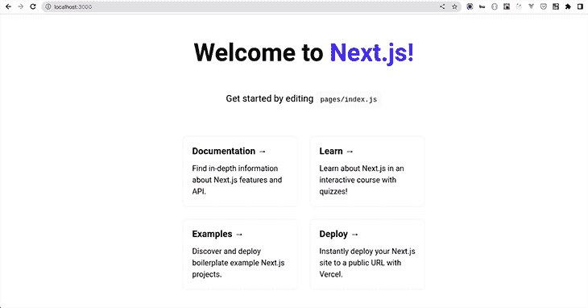
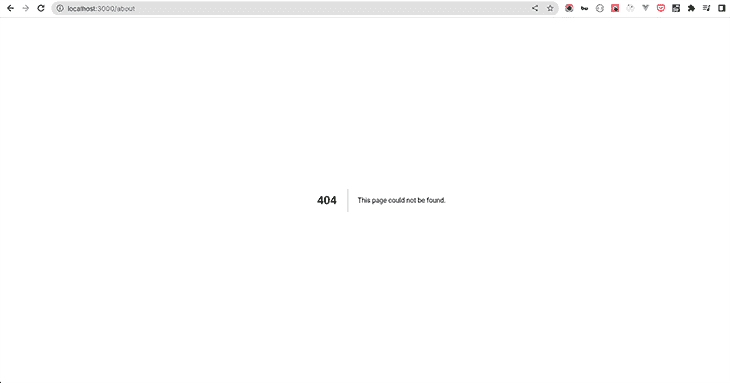
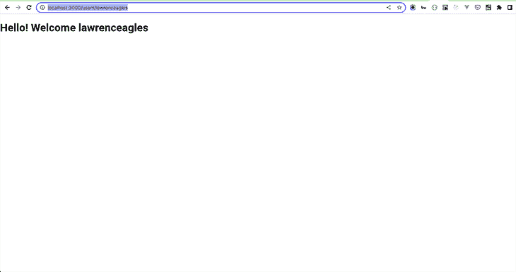
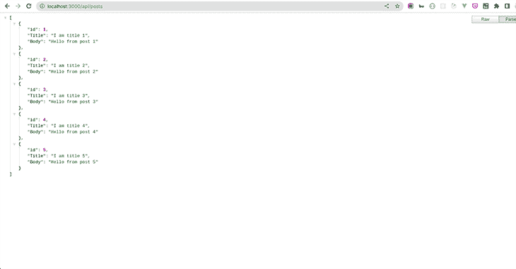
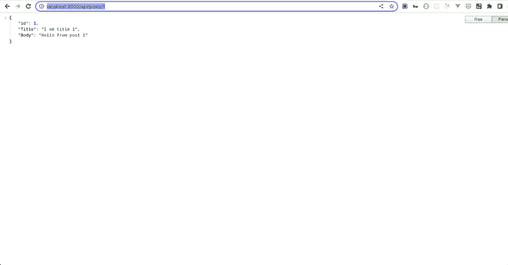

# 在 Next.js 中构建一个具有无服务器功能的 API

> 原文：<https://blog.logrocket.com/build-api-serverless-functions-next-js/>

Next.js 是一个 React 框架，用于创建预渲染的 React 网站。这都是通过服务器端呈现或静态站点生成来完成的。

在服务器端呈现(SSR)中，在来自浏览器的页面请求之后，Next.js 在服务器上将 React 组件呈现为 HTML 页面。在静态站点生成或 SSG 中，Next.js 在构建时将 React 组件呈现到 HTML 页面中。我们只需将网页和 JavaScript 包部署到服务器上。

无论您在 Next.js 中使用的是 SSR 还是 SSG，React 组件在到达浏览器时都已经呈现在 HTML 页面中了。因此，所有路由都在浏览器中处理，应用程序的行为就像一个单页应用程序(SPA)。与此相反，React 通过客户端呈现在浏览器中呈现组件。

有了 Next.js，我们得到了 SSG 和 SSR 的好处，比如改进的性能和更好的 SEO。

在本文中，我们将了解 Next.js 的另一个伟大特性——无服务器函数。我们将学习如何在专为 Next 应用设计的平台 Vercel 上运行无服务器功能。我们将从讨论 Next.js 页面路由和动态路由开始，稍后在我们的知识基础上学习 Next.js API 和动态 API 路由。

## Next.js 中的无服务器函数介绍

术语“无服务器功能”只是一种命名约定。AWS 称它们为 Lambda 函数，但 Vercel 称它们为无服务器函数——它们是一回事。

无服务器函数不是 Next.js API 的直接组成部分。但是，Next.js 为开发者提供了 [API 路由，可以部署为 Vercel 无服务器函数](https://blog.logrocket.com/serverless-deployments-vercel-node-js/)。而这正是本文的症结所在。

### 先决条件

要从本文中获得最大收益，需要满足以下先决条件:

*   对 JavaScript 的基本理解
*   对 Next.js 的基本了解
*   对 API 设计的基本理解
*   系统上安装的最新 Node.js 版本

## 设置我们的应用程序

我们将从引导 Next.js 应用程序开始，并使用`create-next-app`自动设置一切。要创建 Next.js 项目，请运行以下命令:

```
yarn create next-app

```

安装完成后，运行`yarn dev`启动你的应用。当您访问`localhost:3000`时，您将获得:



## Next.js 中的页面路线

在说 API 路由之前，[我们先来了解一下页面路由](https://blog.logrocket.com/what-you-need-know-new-next-js-router/)。

在 Next.js 中，每个页面都由一个组件驱动。例如，“关于”页面将有一个`About`组件，而“联系人”页面将有一个`Contact`组件。每个页面组件在`pages`文件夹中都有一个文件，因此，每个页面组件的文件名和位置都与特定页面的路径相关联。

要详细说明这一点，请将您的浏览器导航至`localhost:3000/about`，您将看到:



上面显示的`404`页面仅仅意味着 Next.js 在`page`文件夹中找不到名为`about`的组件。这是因为我们没有在`pages`文件夹中创建一个`about`组件。

要解决这个问题，在`pages`目录中创建一个`about.js`文件，并添加以下代码:

```
const About = () => {
    return (
        <div>
            <h1>Hello World!</h1>
        </div>
    )
};
export default About;

```

现在，重温`localhost:3000/about`，你会得到:


当我们在`pages`文件夹中创建`About`组件时，Next.js 自动创建了一个路由来服务于`About`组件。因此，路径名与文件名联系在一起。

## Next.js 中的动态路线

Next.js 页面支持[动态路由](https://nextjs.org/docs/routing/dynamic-routes)。这很有用，因为复杂的应用程序不仅仅需要使用预定义的路径来定义路由。

在 Next.js 中，您可以在页面组件名`[param].js`中添加括号，以创建动态路由。页面可以通过其动态路径`pages/users/[param].js`访问。在这里，`[param]`是页面的 id、slug、漂亮的 URL 等。任何像`/users/1`或者`/users/abcdef`这样的路线都可以匹配。

Next.js 会将匹配的路径参数作为查询参数发送到页面。如果有其他查询参数，Next.js 会将匹配的路径参数与它们链接起来。

具体来说，动态路线`pages/users/[param].js`的匹配路线`/users/abcdef`将具有查询对象:

```
{ "param": "abcdef" }

```

类似地，动态路线`pages/users/[param].js`的匹配路线`/users/abcdef?foo=bar`将具有以下`query`对象:

```
{ "foo": "bar", "pid": "abc" } 

```

在您的应用程序中，创建一个`user`文件夹，并在其中创建一个名为`[username.js`的组件。将以下代码添加到组件中:

```
import { useRouter } from "next/router";
const User = () => {
    const router = useRouter();
    const username = router.query["username"];
    return (
        <div>
            <h1>Hello! Welcome {username} </h1>
        </div>
    );
};
export default User;

```

现在，当你访问`[http://localhost:3000/users/lawrenceagles](http://localhost:3000/users/lawrenceagles)`，你会得到:



从上面的演示中，您可以看到 Next 自动将`/users/lawrenceagles`与动态路由`pages/users/[username].js`相匹配。因此，无论`username`在路线中经过什么，都会显示在页面上。您可以尝试不同的用户名。

除了使用页面路由创建和服务页面之外，Next.js 还可以使用 API 路由创建 API。基于我们目前的知识，让我们在下一节学习 Next.js API 路由。

## 使用 Next.js 无服务器函数的 API 路由

[在 Next.js v9](https://nextjs.org/blog/next-9) 中引入了 API 路由。它们使我们能够构建后端应用程序端点，在此过程中利用热重装和统一的构建管道。

这意味着 Next ≥v9 封装了前端和后端。我们可以快速开发可轻松扩展的全栈 React 和 Node.js 应用程序。

页面路由将 Next.js 页面作为网页，而 Next.js API 路由被视为端点。API 路由位于`/pages/api`文件夹中，Next.js 将该文件夹中的任何文件映射到`/api/*`作为端点。

这项功能非常有趣，因为它使 Next.js 能够在前端呈现存储在 Next.js 应用程序中的数据，或者呈现使用 Next.js API 路由获取的数据。

通过用`create-next-app`引导您的应用程序，Next.js 自动为您创建一个示例 API 路径，即`/pages/api/hello.js`文件。在`/pages/api/hello.js`内部，Next.js 创建并导出一个名为`handler`的函数，该函数返回一个 JSON 对象。

您可以通过浏览器导航到`[http://localhost:3000/api/hello](http://localhost:3000/api/hello)`来访问该端点，并返回以下 JSON:

```
{
  "name": "John Doe"
}

```

### 请求处理器功能

如上所述，要创建 Next.js API 路由，您需要导出一个默认的请求处理函数。请求处理器函数接收两个参数:

要使用 API 路径构建 API，在根目录中创建一个名为`data`的文件夹。用下面的代码在`data`文件夹中创建一个`post.json`文件:

```
[
    {
        "Title": "I am title 1",
        "Body": "Hello from post 1"
    },
    {
        "Title": "I am title 2",
        "Body": "Hello from post 2"
    },
    {
        "Title": "I am title 3",
        "Body": "Hello from post 3"
    },
    {
        "Title": "I am title 4",
        "Body": "Hello from post 4"
    },
    {
        "Title": "I am title 5",
        "Body": "Hello from post 5"
    }
]

```

现在，在`pages/api/`文件夹中，用以下代码创建一个名为`posts.js`的新文件:

```
// Next.js API route support: https://nextjs.org/docs/api-routes/introduction
import posts from "../../data/posts.json"
export default function handler(req, res) {
    res.status(200).json(posts)
}

```

在上面的 API 路径中，处理函数导入 JSON 数据`posts`，并将其作为对`GET`请求的响应返回。当您通过从浏览器访问`[http://localhost:3000/api/posts](http://localhost:3000/api/posts)`来查询这些数据时，您会得到:



您可以使用如下所示的`request.method`对象来处理其他 HTTP 请求:

```
export default (req, res) => {
  switch (req.method) {
    case 'GET':
      //...
      break
    case 'POST':
      //...
      break
    case 'PUT':
      //...
      break
    case 'DELETE':
      //...
      break
    default:
      res.status(405).end() // Method not allowed
      break
  }
}

```

## 动态 API 路由

和页面路由一样，Next API 路由支持[动态路由](https://nextjs.org/docs/routing/dynamic-routes)。和[动态 API 路由](https://nextjs.org/docs/api-routes/dynamic-api-routes)遵循用于页面路由的相同文件命名规则。

为了详细说明这一点，在`pages/api/`文件夹中创建一个`posts`文件夹。在`posts`文件夹中创建一个名为`[postid.js]`的文件，并在其中写入以下代码:

```
// Next.js API route support: https://nextjs.org/docs/api-routes/introduction
import posts from "../../../data/posts.json"
export default function handler(req, res) {
    const { postid } = req.query;
    const post = posts.find((post => post.id === parseInt(postid)));
    res.status(200).json(post)
}

```

在上面的代码中，Next 自动将`/posts/1`路径与动态路由`pages/posts/[postid].js`匹配。无论哪个岗位`id`都传递到路线`/posts/[postid]` : `/post/2`、`/post/3`、`/post/4`等。将在`req.query`对象中可用。

上面的请求处理函数从`req.query`对象中检索传递的帖子`id`，在`posts`数组中找到帖子，并将其发送给客户端。

因此，要获得一个`id`为`1`的帖子，请在浏览器中导航到`[http://localhost:3000/api/posts/1](http://localhost:3000/api/posts/1)`。您将获得:



## API 路线的优势

在 Vercel 中，Next.js API 路由被部署为无服务器函数。这意味着它们可以部署到世界上的许多地区，以改善延迟和可用性。

此外，作为无服务器功能，它们是有成本效益的，使您能够按需运行您的代码。这消除了管理基础架构、配置服务器或升级硬件的需要。

API 路由的另一个好处是它们的伸缩性非常好。最后，默认情况下它们没有指定 CORS，因为它们是`same-origin`，但是，您可以通过使用 [CORS 请求助手](https://github.com/vercel/next.js/blob/canary/examples/api-routes-cors/pages/api/cors.ts)定制这个行为。

## 结论

在本文中，我们了解了一个有趣而强大的 Next.js 特性——API routes。我们从了解 Next.js 页面路径开始，并深入研究了 API 路径。我们还学习了如何使用 Next API routes 构建 API，部署为 Vercel 的无服务器功能。

我真的希望在本文结束时，您可以使用 Next.js APIs Route 构建 API！

## [LogRocket](https://lp.logrocket.com/blg/nextjs-signup) :全面了解生产 Next.js 应用

调试下一个应用程序可能会很困难，尤其是当用户遇到难以重现的问题时。如果您对监视和跟踪状态、自动显示 JavaScript 错误、跟踪缓慢的网络请求和组件加载时间感兴趣，

[try LogRocket](https://lp.logrocket.com/blg/nextjs-signup)

.

[](https://lp.logrocket.com/blg/nextjs-signup)[](https://lp.logrocket.com/blg/nextjs-signup)

LogRocket 就像是网络和移动应用的 DVR，记录下你的 Next.js 应用上发生的一切。您可以汇总并报告问题发生时应用程序的状态，而不是猜测问题发生的原因。LogRocket 还可以监控应用程序的性能，报告客户端 CPU 负载、客户端内存使用等指标。

LogRocket Redux 中间件包为您的用户会话增加了一层额外的可见性。LogRocket 记录 Redux 存储中的所有操作和状态。

让您调试 Next.js 应用的方式现代化— [开始免费监控](https://lp.logrocket.com/blg/nextjs-signup)。