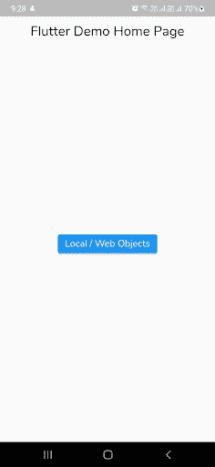
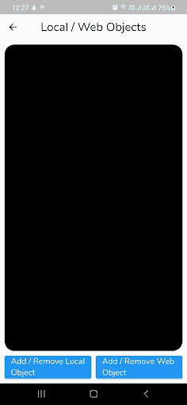
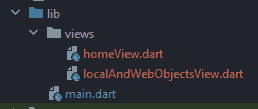
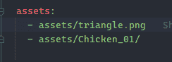

# 在 Flutter - LogRocket 博客中构建一个增强现实应用

> 原文：<https://blog.logrocket.com/build-augmented-reality-app-flutter/>

在本教程中，你将了解如何在 Flutter 中使用一个支持 Android 和 iOS 设备的插件来构建一个增强现实应用程序。

AR 应用程序会在您的相机上为您的体验添加数据或视觉效果。常见的例子包括 Instagram 滤镜、Snapchat 滤镜、各种地图应用等等。

AR 允许用户将虚拟物体放置在现实世界中，然后与它们进行交互。ar 应用程序将(我认为已经)在游戏中特别受欢迎——像微软 Hololens 和谷歌眼镜这样的 AR 头戴设备提供真实的游戏体验——购物和工业部门。

也许我们中的一个人可以开发一个应用程序，让我可以轻松地检查适合我的帽子或便帽的类型？在购买和退回不满意的东西之前，我真的需要它。你看，AR 可以帮助我们，让我们在家里轻松地尝试一些东西。

在本教程中，您将学习以下内容:

注意，本教程假设你对颤振有一定的了解。如果你是 Flutter 新手，请浏览官方文档了解一下。

## ARCore 是什么？

ARCore 是谷歌的平台，使您的手机能够感知环境，了解世界，并与信息互动。提供的一些 API 可跨 Android 和 iOS 设备访问，实现了共享的 AR 体验。

以下是 ARCore 支持的设备。要点是大部分运行 iOS 11.0 或更高版本的 iPhones 和大部分运行 Android 7.0 或更高版本的 Android 手机都支持 ARCore。

谷歌的 ARCore 文档是这样说的:“从根本上说，ARCore 正在做两件事:在移动设备移动时跟踪它的位置，以及建立它对现实世界的理解。”

如果你正在寻找一些 ARCore 的例子，[看看这些使用 ARCore](https://www.androidcentral.com/what-can-you-do-arcore-right-now) 的应用。其中一些应用 arCore 在你自己的空间查看电子商务产品的尺寸，如宜家目录，而另一些则基于娱乐，如星球大战 AR 游戏。

## 什么是 ARKit？

ARKit 是苹果的一套工具，可以让你为 iOS 构建增强现实应用。任何在 iOS 11.0 或更高版本上使用苹果 A9 或更高版本(iPhone 6s/7/SE/8/X，iPad 2017/Pro)的用户都可以使用 ARKit。对于某些功能，需要 iOS 12 或更高版本。

如果您正在寻找一些 ARKit 行动，请查看 [Swift 游乐场](https://www.apple.com/swift/playgrounds/)。这是一款专为 iPad 和 Mac 打造的应用程序，旨在让学习 Swift 变得有趣。

ARKit 与 ARCore 有许多相似之处，关键区别在于它的苹果专有支持与 SceneKit 和 SpriteKit 配合得很好。你可以从这里了解更多关于 ARKit 的信息。

## 入门指南

从这里下载包含所有预建 UI 的 [starter 应用程序](https://github.com/himanshusharma89/arcore_example/tree/starter)。

在编辑器中打开它，然后构建并运行应用程序:





起始项目的文件结构如下所示:



*   `main.dart`——整个 app 的入口
*   `homeView.dart`–包含主视图，有一个按钮导航到 AR 视图屏幕
*   `localAndWebObjectsView.dart`–显示从本地和网络获取 3D 对象的用法的屏幕

## ar_flutter_plugin 是什么？

[ar_flutter_plugin](https://github.com/CariusLars/ar_flutter_plugin) 是 ar 的一个 flutter 插件，支持 Android 上的 ARCore 和 iOS 设备上的 ARKit。你一次得到两个！很明显这是一个优势，因为你不必为了一个而选择开发。

另外，你可以从这里了解插件架构。

## 设置插件

### 添加颤振依赖性

将`ar_flutter_plugin`添加到您的`pubspec.yaml`文件中:

```
...
dependencies:
 flutter:
   sdk: flutter
 ar_flutter_plugin: ^0.6.2
...
```

### Android 配置

更新应用级`build.gradle`文件中的`minSdkVersion`:

```
android {
    defaultConfig {
        ...
        minSdkVersion 24
    }
}
```

或者在 Android 目录下的`local.properties`文件中添加`minSdkVersion`:

```
flutter.minSdkVersion=24
```

并更新 app 级`build.gradle`文件:

```
android {
    defaultConfig {
        ...
        minSdkVersion localProperties.getProperty('flutter.minSdkVersion')
    }
}
```

### iOS 配置

如果您在 iOS 中遇到权限问题，请在您的 iOS 目录中添加以下 pod 文件:

```
post_install do |installer|
    installer.pods_project.targets.each do |target|
      flutter_additional_ios_build_settings(target)
      target.build_configurations.each do |config|
        # Additional configuration options could already be set here

        # BEGINNING OF WHAT YOU SHOULD ADD
        config.build_settings['GCC_PREPROCESSOR_DEFINITIONS'] ||= [
          '$(inherited)',

          ## dart: PermissionGroup.camera
          'PERMISSION_CAMERA=1',

          ## dart: PermissionGroup.photos
          'PERMISSION_PHOTOS=1',

          ## dart: [PermissionGroup.location, PermissionGroup.locationAlways, PermissionGroup.locationWhenInUse]
          'PERMISSION_LOCATION=1',

          ## dart: PermissionGroup.sensors
          'PERMISSION_SENSORS=1',

          ## dart: PermissionGroup.bluetooth
          'PERMISSION_BLUETOOTH=1',´

          # add additional permission groups if required
        ]
        # END OF WHAT YOU SHOULD ADD
      end
    end
  end
```

## 使用

在继续之前，您需要理解以下 API:

*   `ARView`:使用`PlatformARView`创建一个平台相关的摄像机视图
*   `ARSessionManager`:管理`ARView`的会话配置、参数和事件
*   `ARObjectManager`:管理`ARView`的所有节点相关动作
*   `ARAnchorManager`:管理锚功能，如下载处理器和上传处理器
*   `ARLocationManager`:提供获取和更新设备当前位置的能力
*   `ARNode`:节点对象的模型类

你可以从这里了解更多的 API。

### 使用本地或远程对象

最基本的用途之一是将来自资源或网络的 3D 对象放置到屏幕上。

为此，您需要在您的`pubspec`文件中提供您的`.gltf`或`.glb`文件，如下所示:



### 什么是 glTF 或 GLB 文件？

glTF 是用于 3D 模型和场景的图形语言传输格式。它有两个扩展:

*   `.gltf`:以 JSON/ASCII 格式存储场景描述，包括节点层次、摄像机和材质
*   `.glb`:以二进制格式存储模型描述

你可以从这里了解更多关于 glTF 的信息。

现在，转到您的`localAndWebObjectsView.dart`文件并创建以下变量:

```
late ARSessionManager arSessionManager;
late ARObjectManager arObjectManager;

//String localObjectReference;
ARNode? localObjectNode;

//String webObjectReference;
ARNode? webObjectNode;
```

接下来，用`ARView`小部件更新空的`Container`，如下所示:

```
ARView(
 onARViewCreated: onARViewCreated,
)
```

这里，您对小部件的`onARViewCreated`属性使用了`onARViewCreated`方法:

```
void onARViewCreated(
   ARSessionManager arSessionManager,
   ARObjectManager arObjectManager,
   ARAnchorManager arAnchorManager,
   ARLocationManager arLocationManager) {
 // 1
 this.arSessionManager = arSessionManager;
 this.arObjectManager = arObjectManager;
 // 2
 this.arSessionManager.onInitialize(
       showFeaturePoints: false,
       showPlanes: true,
       customPlaneTexturePath: "triangle.png",
       showWorldOrigin: true,
       handleTaps: false,
     );
 // 3
 this.arObjectManager.onInitialize();
}
```

在上面的代码中，您正在执行以下操作:

1.  定义`arSessionManager`和`arObjectManager`变量
2.  使用`ARSessionManager`的 onInitialize 方法设置会话属性
    这些设置用于可视化特征点、平面、世界坐标系等。这里，您使用`customPlaneTexturePath`来引用您的`pubspec`中定义的资产
3.  同样，使用`ARObjectManager`的`onInitialize`来设置管理器

构建并运行您的应用程序。你会看到这样的`ARView`:

### 创建和删除本地对象

现在，您需要使用“添加/删除本地对象”按钮来创建或删除使用如下`onLocalObjectButtonPressed`回调的`localObjectNode`:

```
Future<void> onLocalObjectButtonPressed() async {
 // 1
 if (localObjectNode != null) {
   arObjectManager.removeNode(localObjectNode!);
   localObjectNode = null;
 } else {
   // 2
   var newNode = ARNode(
       type: NodeType.localGLTF2,
       uri: "assets/Chicken_01/Chicken_01.gltf",
       scale: Vector3(0.2, 0.2, 0.2),
       position: Vector3(0.0, 0.0, 0.0),
       rotation: Vector4(1.0, 0.0, 0.0, 0.0));
   // 3
   bool? didAddLocalNode = await arObjectManager.addNode(newNode);
   localObjectNode = (didAddLocalNode!) ? newNode : null;
 }
}
```

在这里，您已经完成了以下操作:

1.  检查`localObjectNode`是否为空，如果不为空则删除本地对象
2.  通过提供本地 glTF 文件路径和类型以及包含节点的位置、旋转和其他变换的坐标系，创建了一个新的`ARNode`对象
3.  将`newNode`添加到`ARView`的顶层(如`Stack`)并分配给`localObjectNode`

`NodeType`是一个枚举，用于设置插件支持的节点类型，包括`localGLTF2`、`webGLB`、`fileSystemAppFolderGLB`、`fileSystemAppFolderGLTF2`。

构建并运行您的应用程序，然后点击**添加/删除本地对象**按钮:

### 添加远程对象

接下来，您需要使用**添加/删除 Web 对象**按钮和`onWebObjectAtButtonPressed`回调，如下所示:

```
Future<void> onWebObjectAtButtonPressed() async {
 if (webObjectNode != null) {
   arObjectManager.removeNode(webObjectNode!);
   webObjectNode = null;
 } else {
   var newNode = ARNode(
       type: NodeType.webGLB,
       uri:
           "https://github.com/KhronosGroup/glTF-Sample-Models/raw/master/2.0/Duck/glTF-Binary/Duck.glb",
       scale: Vector3(0.2, 0.2, 0.2));
   bool? didAddWebNode = await arObjectManager.addNode(newNode);
   webObjectNode = (didAddWebNode!) ? newNode : null;
 }
}
```

上面的方法类似于`onLocalObjectButtonPressed`方法，不同之处在于 URL。这里，URL 指向来自 web 的 GLB 文件。

构建并运行您的应用程序，然后点击**添加/删除 Web 对象**按钮:

## 使用锚点

如果您想要跟踪 3D 对象的位置或姿态变化，您需要为此定义一个锚点。锚点描述或检测真实世界中的特征点和平面，并简单地让您在世界中放置 3D 对象。

*注意，特征点是图像中与众不同的位置。比如角落，路口等等。*

这可确保对象保持在原来的位置，即使环境随时间变化并影响应用程序的用户体验。

最后，使用`dispose`方法释放资源来处置管理器。

## 结论

你可以[在这里](https://github.com/himanshusharma89/arcore_example)找到最终项目。

在本教程中，您学习了如何使用 Flutter 构建增强现实应用程序。下一步，你可以尝试使用手势旋转或变换对象，或者使用 Google Cloud Anchor API 或外部数据库获取 3D 对象。

我们希望你喜欢这个教程。如果您有任何疑问，请随时联系我们。谢谢大家！

## 使用 [LogRocket](https://lp.logrocket.com/blg/signup) 消除传统错误报告的干扰

[](https://lp.logrocket.com/blg/signup)

[LogRocket](https://lp.logrocket.com/blg/signup) 是一个数字体验分析解决方案，它可以保护您免受数百个假阳性错误警报的影响，只针对几个真正重要的项目。LogRocket 会告诉您应用程序中实际影响用户的最具影响力的 bug 和 UX 问题。

然后，使用具有深层技术遥测的会话重放来确切地查看用户看到了什么以及是什么导致了问题，就像你在他们身后看一样。

LogRocket 自动聚合客户端错误、JS 异常、前端性能指标和用户交互。然后 LogRocket 使用机器学习来告诉你哪些问题正在影响大多数用户，并提供你需要修复它的上下文。

关注重要的 bug—[今天就试试 LogRocket】。](https://lp.logrocket.com/blg/signup-issue-free)