# 用 FL 图表在 Flutter 中构建漂亮的图表

> 原文：<https://blog.logrocket.com/build-beautiful-charts-flutter-fl-chart/>

收集数据并通过图表显示出来在移动应用中越来越普遍。一个常见的例子是股票投资应用程序，它显示大量图表，如股票价格和投资组合分布饼图。今天，我们将学习如何使用 Flutter 中的 [FL Chart](https://github.com/imaNNeoFighT/fl_chart) 包为这些情况创建漂亮的图表。FL 图表提供了用于创建高度可定制的折线图、条形图、饼图、散点图和雷达图的小部件。

本教程使用虚构的数据使事情变得简单，更容易理解包的实现；您可以很容易地用 API 中的数据替换它。

## 内容

## 先决条件

在开始之前，让我们快速检查一下我们需要的东西:

*   [颤振 SDK](https://flutter.io/get-started/install/)
*   代码编辑器；你可以使用 VS 代码，Android Studio，或者任何你选择的代码编辑器
*   至少初级的颤振知识

差不多就是这样！

## 设置

在本教程中，我们将使用预先开发的示例应用程序来演示各种图表和图表包的功能。接下来，从 [GitHub](https://github.com/codezri/flutter_charts_demo) 下载或克隆示例应用程序。

输入以下命令安装依赖项:

```
flutter pub get

```

接下来，用`flutter run`运行你的应用程序，确保一切正常。运行该应用程序后，您将看到三个图表，如下图所示:

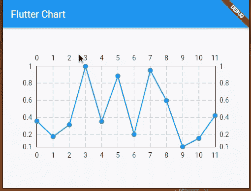

Flutter charts demo app.

让我们看看如何创建和定制这些图表。

## 创建折线图

就数据表示而言，折线图是最有用的图表之一。我们将创建一个折线图来显示一家公司股票的年度价格数据。我们将使用`LineChart`小部件来创建折线图——这是显而易见的。

`LineChart` widget 以`LineChartData`为关键参数，`swapAnimationDuration`和`swapAnimationCurve`为可选参数，可用于控制状态变化时的隐式动画:

```
LineChart(
  LineChartData(
    // control how the chart looks
  ),
  swapAnimationDuration: Duration(milliseconds: 150), // Optional
  swapAnimationCurve: Curves.linear, // Optional
);

```

现在，让我们在图表中添加一条基本线来开始。下面是`line_chart_widget.dart`文件的源代码:

```
import 'package:fl_chart/fl_chart.dart';
import 'package:flutter/material.dart';

import 'package:flutter_chart_demo/data/price_point.dart';

class LineChartWidget extends StatelessWidget {
  final List<PricePoint> points;

  const LineChartWidget(this.points, {Key? key})
      : super(key: key);

  @override
  Widget build(BuildContext context) {
    return AspectRatio(
      aspectRatio: 2,
      child: LineChart(
        LineChartData(
            lineBarsData: [
              LineChartBarData(
                spots: points.map((point) => FlSpot(point.x, point.y)).toList(),
                isCurved: false,
                // dotData: FlDotData(
                //   show: false,
                // ),
              ),
            ],
          ),
      ),
    );
  }
}

```

`LineChatData`包含关于折线图外观的所有信息。我们已经使用了带有一列`LineChartBarData`的`lineBarsData`属性在图上画一条或多条线。我们通过将`isCurved`设置为`false`来确保线条不会弯曲。

上面的例子看起来像这样:

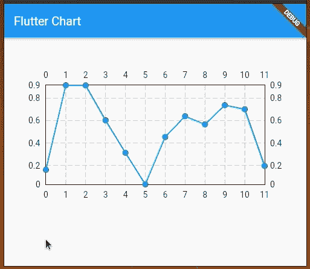

Flutter chart implementation.

`LineChartBarData`用于定义各线条的外观。它需要一个与线形图的绘图点相似的`spots`列表。默认情况下，这些点将用实心圆标记来表示，但是我们可以通过使用`dotData`来控制它们的外观。

尝试删除上面源代码的注释代码行；您将看到没有标记的折线图，如下所示:

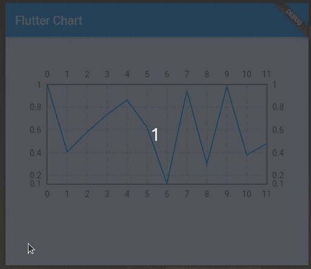

Flutter line chart without markers.

让我们看一下代码:

```
return AspectRatio(
  aspectRatio: 2,
  child: LineChart(
    LineChartData(
        lineBarsData: [
          LineChartBarData(
            spots: points.map((point) => FlSpot(point.x, point.y)).toList(),
            isCurved: false,
            dotData: FlDotData(
              show: false,
            ),
          ),
        ],
      ),
  ),
);

```

***注意，*** *需要用* `*SizedBox*` *或* `*AspectRatio*` *将* `*LineChart*` *小工具包装起来，使其真正出现在屏幕上。最好使用* `*AspectRatio*` *以便图形不会在不同的屏幕尺寸上倾斜*

现在，让我们添加一些水平标签，从该图中清除不必要的混乱，使其更整洁，如以下预览所示:

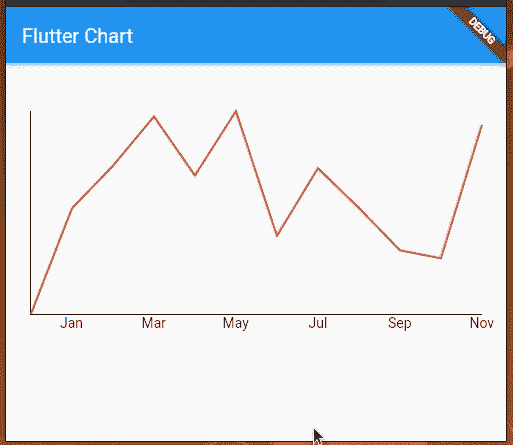

Flutter line chart with clean design.

该示例的代码如下所示:

```
import 'package:fl_chart/fl_chart.dart';
import 'package:flutter/material.dart';

import 'package:flutter_chart_demo/data/price_point.dart';

class LineChartWidget extends StatelessWidget {
  final List<PricePoint> points;

  const LineChartWidget(this.points, {Key? key})
      : super(key: key);

  @override
  Widget build(BuildContext context) {
    return AspectRatio(
      aspectRatio: 2,
      child: LineChart(
        LineChartData(
            lineBarsData: [
              LineChartBarData(
                spots: points.map((point) => FlSpot(point.x, point.y)).toList(),
                isCurved: false,
                dotData: FlDotData(
                  show: false,
                ),
                color: Colors.red
              ),
            ],
            borderData: FlBorderData(
                border: const Border(bottom: BorderSide(), left: BorderSide())),
            gridData: FlGridData(show: false),
            titlesData: FlTitlesData(
              bottomTitles: AxisTitles(sideTitles: _bottomTitles),
              leftTitles: AxisTitles(sideTitles: SideTitles(showTitles: false)),
              topTitles: AxisTitles(sideTitles: SideTitles(showTitles: false)),
              rightTitles: AxisTitles(sideTitles: SideTitles(showTitles: false)),
            ),
          ),
      ),
    );
  }

  SideTitles get _bottomTitles => SideTitles(
    showTitles: true,
    getTitlesWidget: (value, meta) {
      String text = '';
      switch (value.toInt()) {
        case 1:
          text = 'Jan';
          break;
        case 3:
          text = 'Mar';
          break;
        case 5:
          text = 'May';
          break;
        case 7:
          text = 'Jul';
          break;
        case 9:
          text = 'Sep';
          break;
        case 11:
          text = 'Nov';
          break;
      }

      return Text(text);
    },
  );
}

```

我们还可以在折线图上添加触摸事件，并获得触摸事件的回调以执行进一步的操作。默认情况下，`LineChartData`显示一个工具提示，其中`y`值触及折线图上的某个位置。然而，我们可以修改工具提示来显示我们想要的任何文本，我们也可以设置不同的样式。

我们使用`LineTouchData`来修改触摸指示器和工具提示的外观，它提供了一堆属性，比如`touchCallback`、`touchTooltipData`，甚至还有`getTouchedSpotIndicator`。

我们可以使用`touchTooltipData`来定制默认的工具提示，使用`getTouchedSpotIndicator`来定制呈现的图表区域中的触摸事件反馈。

查看以下预览:

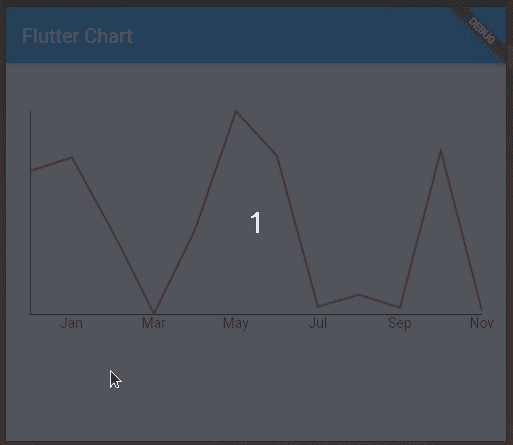

Flutter line chart with customized tooltip.

我们可以通过向`LineChartData`小部件添加以下参数数据来实现上面的图表。

```
lineTouchData: LineTouchData(
    enabled: true,
    touchCallback:
        (FlTouchEvent event, LineTouchResponse? touchResponse) {
      // TODO : Utilize touch event here to perform any operation
    },
    touchTooltipData: LineTouchTooltipData(
      tooltipBgColor: Colors.blue,
      tooltipRoundedRadius: 20.0,
      showOnTopOfTheChartBoxArea: true,
      fitInsideHorizontally: true,
      tooltipMargin: 0,
      getTooltipItems: (touchedSpots) {
        return touchedSpots.map(
          (LineBarSpot touchedSpot) {
            const textStyle = TextStyle(
              fontSize: 10,
              fontWeight: FontWeight.w700,
              color: Colors.white,
            );
            return LineTooltipItem(
              points[touchedSpot.spotIndex].y.toStringAsFixed(2),
              textStyle,
            );
          },
        ).toList();
      },
    ),
    getTouchedSpotIndicator:
        (LineChartBarData barData, List<int> indicators) {
      return indicators.map(
        (int index) {
          final line = FlLine(
              color: Colors.grey,
              strokeWidth: 1,
              dashArray: [2, 4]);
          return TouchedSpotIndicatorData(
            line,
            FlDotData(show: false),
          );
        },
      ).toList();
    },
    getTouchLineEnd: (_, __) => double.infinity
  ),

```

这里我们定制了工具提示，但是库决定了何时显示特定的工具提示。例如，我们需要点击并按住来获得线条边缘的工具提示。这个库非常灵活，可以让你决定何时显示特定的工具提示。

我们可以如下切换工具提示:

```
import 'package:fl_chart/fl_chart.dart';
import 'package:flutter/material.dart';

import 'package:flutter_chart_demo/data/price_point.dart';

class LineChartWidget extends StatefulWidget {
  const LineChartWidget({Key? key, required this.points}) : super(key: key);

  final List<PricePoint> points;

  @override
  State<LineChartWidget> createState() => _LineChartWidgetState(points: this.points);
}

class _LineChartWidgetState extends State<LineChartWidget> {
  final List<PricePoint> points;
  late int showingTooltipSpot;

  _LineChartWidgetState({required this.points});

  @override
  void initState() {
    showingTooltipSpot = -1;
    super.initState();
  }

  @override
  Widget build(BuildContext context) {
    final _lineBarsData = [
      LineChartBarData(
        spots: points.map((point) => FlSpot(point.x, point.y)).toList(),
        isCurved: false,
        dotData: FlDotData(
          show: false,
        ),
        color: Colors.red
      ),
    ];
    return AspectRatio(
      aspectRatio: 2,
      child: LineChart(
        LineChartData(
            lineBarsData: _lineBarsData,
            borderData: FlBorderData(
                border: const Border(bottom: BorderSide(), left: BorderSide())),
            gridData: FlGridData(show: false),
            titlesData: FlTitlesData(
              bottomTitles: AxisTitles(sideTitles: _bottomTitles),
              leftTitles: AxisTitles(sideTitles: SideTitles(showTitles: false)),
              topTitles: AxisTitles(sideTitles: SideTitles(showTitles: false)),
              rightTitles: AxisTitles(sideTitles: SideTitles(showTitles: false)),
            ),
            showingTooltipIndicators: showingTooltipSpot != -1 ? [ShowingTooltipIndicators([
                LineBarSpot(_lineBarsData[0], showingTooltipSpot,
                    _lineBarsData[0].spots[showingTooltipSpot]),
              ])] : [],
            lineTouchData: LineTouchData(
                enabled: true,
                touchTooltipData: LineTouchTooltipData(
                  tooltipBgColor: Colors.blue,
                  tooltipRoundedRadius: 20.0,
                  fitInsideHorizontally: true,
                  tooltipMargin: 0,
                  getTooltipItems: (touchedSpots) {
                    return touchedSpots.map(
                      (LineBarSpot touchedSpot) {
                        const textStyle = TextStyle(
                          fontSize: 10,
                          fontWeight: FontWeight.w700,
                          color: Colors.white,
                        );
                        return LineTooltipItem(
                          points[touchedSpot.spotIndex].y.toStringAsFixed(2),
                          textStyle,
                        );
                      },
                    ).toList();
                  },
                ),
                handleBuiltInTouches: false,
                touchCallback: (event, response) {
                  if (response?.lineBarSpots != null && event is FlTapUpEvent) {
                    setState(() {
                      final spotIndex = response?.lineBarSpots?[0].spotIndex ?? -1;
                      if(spotIndex == showingTooltipSpot) {
                        showingTooltipSpot = -1;
                      }
                      else {
                        showingTooltipSpot = spotIndex;
                      }
                    });
                  }
                },
              ),
          ),
      ),
    );
  }

  SideTitles get _bottomTitles => SideTitles(
    showTitles: true,
    getTitlesWidget: (value, meta) {
      String text = '';
      switch (value.toInt()) {
        case 1:
          text = 'Jan';
          break;
        case 3:
          text = 'Mar';
          break;
        case 5:
          text = 'May';
          break;
        case 7:
          text = 'Jul';
          break;
        case 9:
          text = 'Sep';
          break;
        case 11:
          text = 'Nov';
          break;
      }

      return Text(text);
    },
  );
}

```

接下来，我们需要使用来自`main.dart`的命名参数`points`:

```
//....
children: <Widget>[
  LineChartWidget(points: pricePoints),
//....

```

这里，我们实现了可切换工具提示，对前面的示例代码做了以下修改:

*   使`LineChartWidget`有状态以保存当前可见的工具提示的信息
*   通过将`handleBuiltInTouches`设置为`false`关闭了内置的工具提示处理功能
*   通过为`touchCallback`实现一个函数，在`showingTooltipSpot`中存储关于被触摸行索引的细节
*   用`showingTooltipIndicators`有条件地显示工具提示

运行上面的代码，查看如下所示的可切换工具提示:

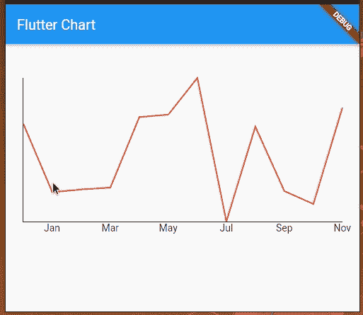

Flutter line chart with toggleable tooltip.

类似地，我们可以为任何支持的图表类型实现可切换的工具提示。

这不是很简单吗？现在我们来看下一个最流行的图表——饼状图。

## 创建条形图

现在我们已经对折线图的类和属性有点熟悉了，理解条形图应该很简单；属性和类名后缀非常相似。

让我们使用与折线图相同的数据集生成器来创建一个条形图。

查看`bar_chart_widget.dart`文件中的源代码:

```
import 'package:fl_chart/fl_chart.dart';
import 'package:flutter/material.dart';

import 'package:flutter_chart_demo/data/price_point.dart';

class BarChartWidget extends StatefulWidget {
  const BarChartWidget({Key? key, required this.points}) : super(key: key);

  final List<PricePoint> points;

  @override
  State<BarChartWidget> createState() => _BarChartWidgetState(points: this.points);
}

class _BarChartWidgetState extends State<BarChartWidget> {
  final List<PricePoint> points;

  _BarChartWidgetState({required this.points});

  @override
  Widget build(BuildContext context) {
    return AspectRatio(
      aspectRatio: 2,
      child: BarChart(
        BarChartData(
            barGroups: _chartGroups(),
            borderData: FlBorderData(
                border: const Border(bottom: BorderSide(), left: BorderSide())),
            gridData: FlGridData(show: false),
            titlesData: FlTitlesData(
              bottomTitles: AxisTitles(sideTitles: _bottomTitles),
              leftTitles: AxisTitles(sideTitles: SideTitles(showTitles: false)),
              topTitles: AxisTitles(sideTitles: SideTitles(showTitles: false)),
              rightTitles: AxisTitles(sideTitles: SideTitles(showTitles: false)),
            ),
          ),
      ),
    );
  }

  List<BarChartGroupData> _chartGroups() {
    return points.map((point) =>
      BarChartGroupData(
        x: point.x.toInt(),
        barRods: [
          BarChartRodData(
            toY: point.y
          )
        ]
      )

    ).toList();
  }

  SideTitles get _bottomTitles => SideTitles(
    showTitles: true,
    getTitlesWidget: (value, meta) {
      String text = '';
      switch (value.toInt()) {
        case 0:
          text = 'Jan';
          break;
        case 2:
          text = 'Mar';
          break;
        case 4:
          text = 'May';
          break;
        case 6:
          text = 'Jul';
          break;
        case 8:
          text = 'Sep';
          break;
        case 10:
          text = 'Nov';
          break;
      }

      return Text(text);
    },
  );
}

```

这里我们创建了一个条形图，通过参数`barGroups`提供了一个`BarChartGroupData`实例的列表。类似于折线图标题，上面的代码使用了`titlesData`参数。我们让这个小部件有状态，因为我们将扩展这个小部件源来动态更新图表数据。

运行上述代码后，您将看到条形图，如下图所示:

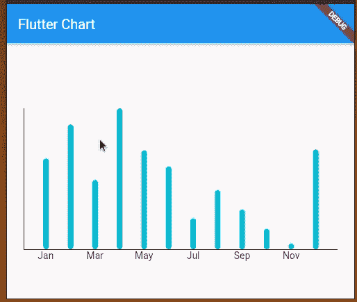

Flutter bar chart.

### 如何创建负条形图

在某些情况下，有必要描绘负条形图段。让我们更新上面的代码，使其也包含负的`y`值！

首先，按如下方式更新`_chartGroups`方法，以包含负的`y`值:

```
List<BarChartGroupData> _chartGroups() {
  return points.map((point) {
    final double y = (Random().nextBool() ? 1 : -1) * point.y;
    return BarChartGroupData(
      x: point.x.toInt(),
      barRods: [
        BarChartRodData(
          toY: y,
          color: y > 0 ? Colors.blue : Colors.red,
        )
      ]
    );
  }
  ).toList();
}

```

确保也导入 Dart `math`包:

```
import 'dart:math';

```

注释掉`titlesData`设置中的以下行，在图表左侧显示标签:

```
leftTitles: AxisTitles(sideTitles: SideTitles(showTitles: false)),

```

您将得到一个多色条形图，上面有正的和负的`y`值:

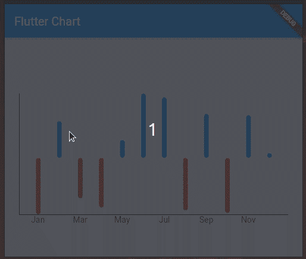

Flutter bar chart with both positive and negative rods.

在这里，图表以蓝色呈现正柱，以红色呈现负值柱。您也可以在折线图中包含负值。

## 在 Flutter 中更新图表数据

在 Flutter 中，如果我们需要执行动态更新，我们通常会制作有状态的小部件。但是，我们如何更新图表数据呢？

我们确实可以使用`setState`方法制作有状态的图表小部件并动态更新图表数据集。然后，FL 图表库将像任何其他 Flutter 小部件一样呈现更新的图形元素。

让我们用不同的图表数据定期更新之前的条形图。在前面的条形图中，我们在`build`方法中生成了一个带有`Random().nextBool()`的随机符号(`+`或`-`),这样`y`值在每次小部件渲染时都会更新。所以，我们可以简单地调用`setState(() {})`来更新图表。

将以下方法实现添加到`BarChartWidget`:

```
@override
initState() {
  Timer.periodic(const Duration(seconds: 1), (timer) {
    setState((){});
  });
  super.initState();
}
```

另外，一定要导入`async`包:

```
import 'dart:async';

```

运行项目后，您会在条形图上看到定期更新的数据:

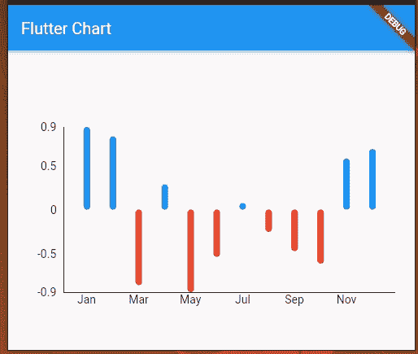

Updating Flutter bar chart data with setState.

类似地，可以用`setState`和一个有状态的小部件更新任何图表数据源。此外，您可以使用 Dart 计时器在图表上实现描绘实时数据，正如我在上面的示例中演示的那样。

## 创建饼图

让我们创建一个饼图来显示用户投资组合的部门分布，其中每个部门用不同的颜色代码表示。

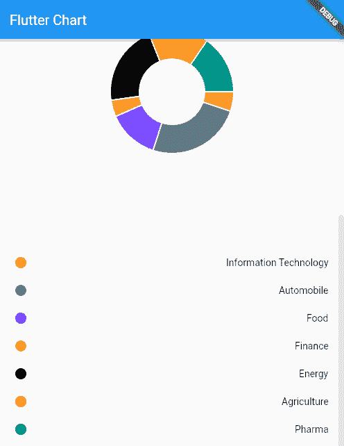

Flutter pie chart.

下面来看看`pie_chart_widget.dart`文件:

```
import 'package:fl_chart/fl_chart.dart';
import 'package:flutter/material.dart';
import 'package:flutter_chart_demo/data/sector.dart';

class PieChartWidget extends StatelessWidget {
  final List<Sector> sectors;

  const PieChartWidget(this.sectors, {Key? key}) : super(key: key);

  @override
  Widget build(BuildContext context) {
    return AspectRatio(
        aspectRatio: 1.0,
        child: PieChart(PieChartData(
          sections: _chartSections(sectors),
          centerSpaceRadius: 48.0,
        )));
  }

  List<PieChartSectionData> _chartSections(List<Sector> sectors) {
    final List<PieChartSectionData> list = [];
    for (var sector in sectors) {
      const double radius = 40.0;
      final data = PieChartSectionData(
        color: sector.color,
        value: sector.value,
        radius: radius,
        title: '',
      );
      list.add(data);
    }
    return list;
  }
}

```

我们使用了一个`PieChart`小部件来创建饼状图；这个小部件将`PieChartData`作为一个参数来定义饼图的外观。

为了使饼图从中心凹陷，我们将`centerSpaceRadius`设置为`48.0`。`sections`属性接受一个`PieChartSectionData`列表来定义饼图中每个部分的外观。`PieChartSectionData`提供对饼图各个部分的值和表示的控制。

如果没有为`PieChartSectionData`提供`title`的值，则默认显示截面值。因此，如果您不希望在饼图上显示任何内容，不要忘记为`title`添加一个空字符串。

## 其他图形选项

除了我们上面讨论的最常用的图形选项之外，这个强大的库还为您提供了一些非常有趣的值得探索的图形类型。让我们也快速浏览一下。

### 散点图

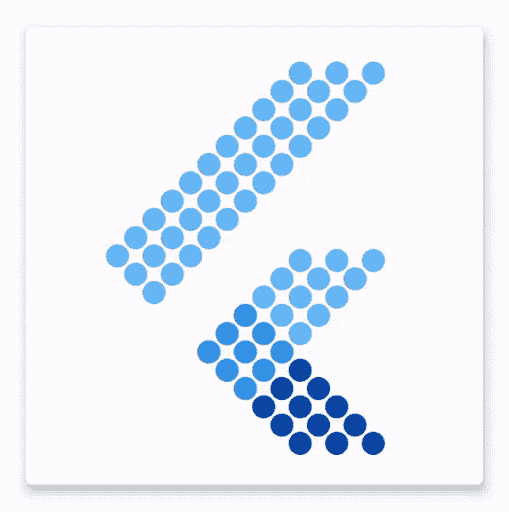

`ScatterChart`允许我们通过指定`x`和`y`坐标以及半径和颜色，在图形的任何地方绘制几个点。这张图表最令人惊奇的地方是我们在从一种状态转换到另一种状态时可以玩的动画。

您可以从官方文档中浏览示例散点图实现。

### 雷达图

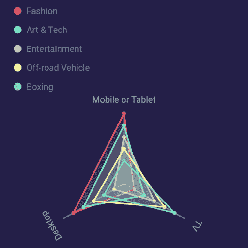

`RadarChart`允许我们从一组三个或更多数据点创建二维图形表示。我们可以使用`RadarDataSet`在同一个图形空间中绘制多个雷达图，它将一列`R``adarEntries`作为`dataEntries`。

您可以从官方文档中浏览示例雷达图实现。

## 带 FL 图表的动画

使这个软件包与其他图表库区别开来的一点是漂亮的动画和你可以对每个图表的动画进行控制。

当我们改变图表的状态时，它会在内部动画化为新的状态(使用[隐式动画](https://flutter.dev/docs/development/ui/animations/implicit-animations))。我们可以分别使用可选的`swapAnimationDuration`和`swapAnimationCurve`属性来控制动画[持续时间](https://api.flutter.dev/flutter/dart-core/Duration-class.html)和[曲线](https://api.flutter.dev/flutter/animation/Curves-class.html)。我们还可以通过利用`<FooChart>TouchData`类，基于用户交互来改变图表状态。该类可用于所有图表选项，对于创建如下所示的漂亮的用户交互非常有用。

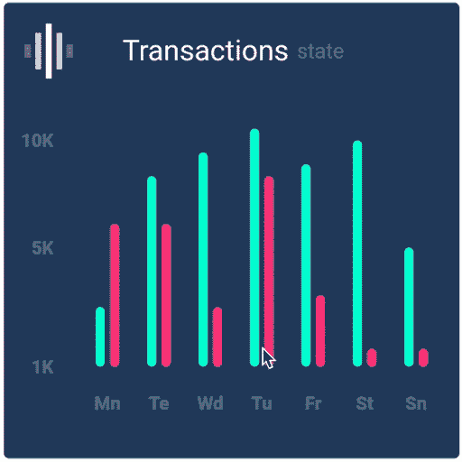

***条形图触摸交互***


***饼状图触摸互动***

## 结论

本文演示了如何在 Flutter 中使用 FL 图表包绘制最广泛使用的图表。但是，FL 图表比这更强大，支持更复杂的图表，如散点图和雷达图，以及动画。如果你想进一步探索它，请点击查看 Flutter 包[。](https://pub.dev/packages/fl_chart)

谢谢你留下来，快乐编码！

## 使用 [LogRocket](https://lp.logrocket.com/blg/signup) 消除传统错误报告的干扰

[](https://lp.logrocket.com/blg/signup)

[LogRocket](https://lp.logrocket.com/blg/signup) 是一个数字体验分析解决方案，它可以保护您免受数百个假阳性错误警报的影响，只针对几个真正重要的项目。LogRocket 会告诉您应用程序中实际影响用户的最具影响力的 bug 和 UX 问题。

然后，使用具有深层技术遥测的会话重放来确切地查看用户看到了什么以及是什么导致了问题，就像你在他们身后看一样。

LogRocket 自动聚合客户端错误、JS 异常、前端性能指标和用户交互。然后 LogRocket 使用机器学习来告诉你哪些问题正在影响大多数用户，并提供你需要修复它的上下文。

关注重要的 bug—[今天就试试 LogRocket】。](https://lp.logrocket.com/blg/signup-issue-free)