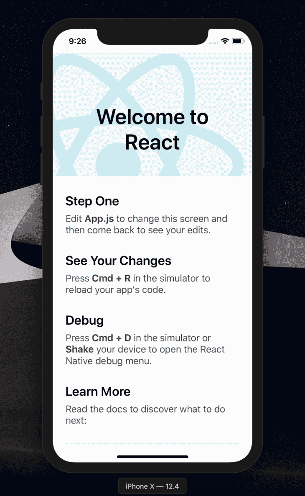
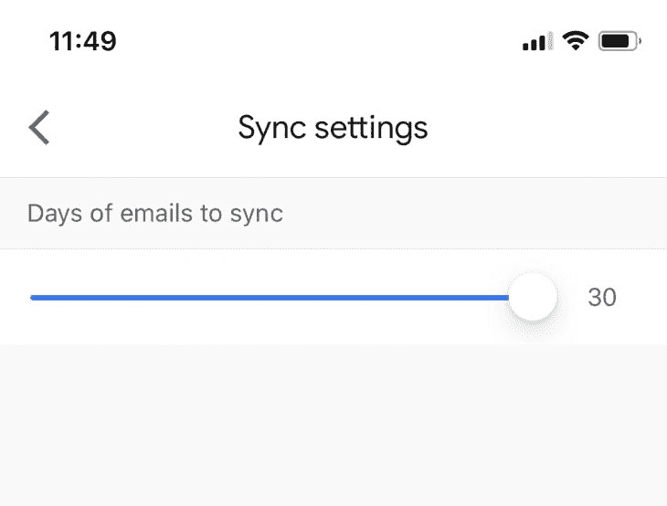
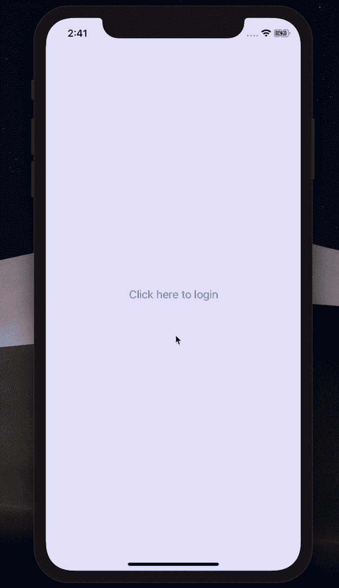
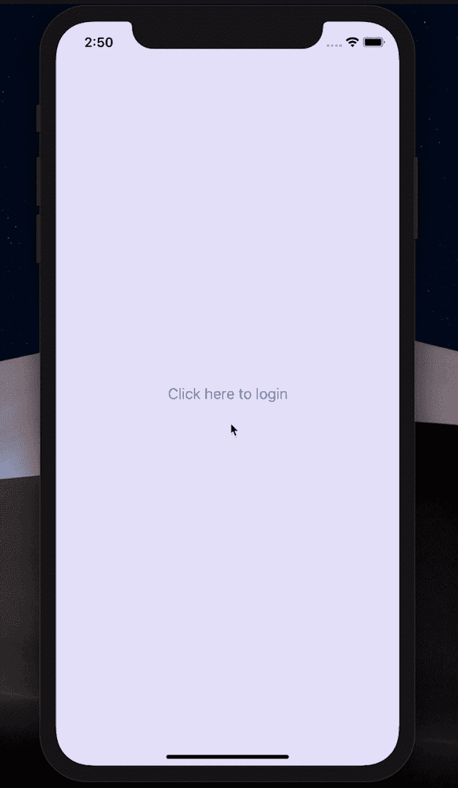

# 用 UI 组件构建 React 原生表单

> 原文：<https://blog.logrocket.com/build-better-forms-with-react-native-ui-components/>

***编者按:**本文更新于 2021 年 3 月 1 日。*

表单是我们网站和产品用户界面的交互部分。反馈、调查、数据收集等。，是产品的关键方面，需要大量使用表单。如果你的表单不正确，你可能会在不知不觉中给你的用户带来不好的体验，这可能会导致你的产品的使用量急剧下降。

在这篇文章中，我们将展示如何用原生的 [React 原生 UI 组件](https://reactnative.dev/docs/native-components-ios)构建不同性能的 React 原生表单。

## 先决条件

*   预先了解 React Native 会有所帮助，但不是强制性的
*   你应该已经安装了 Xcode 或者 Android Studio 来运行模拟器
*   您应该已经安装了[节点 10+](https://nodejs.org/en/download/current/)

> 值得注意的是，我们将不会涵盖我们将在这个项目中构建的应用程序示例的样式。这将使我们专注于功能。然而，所有的样式都可以在[项目库](https://github.com/kenny-io/React-Native-UI-components)中找到供您使用。

## 在 React Native 中创建表单

我们将开始为第一次使用 React Native 的用户进行一些安装。如果这是您第一次使用 React Native，请确保安装所需的软件包，并相应地遵循以下步骤:

**使用 npm 安装 React Native CLI 工具，如下所示:**

```
npm install -g react-native-cli
```

之后，继续运行这些 React 本机命令来创建并启动一个新项目。

**创建动画项目并启动服务器:**

```
react-native init pickerSample

cd pickerSample && npx react-native run-ios // Start the iOS simulator
// OR
cd pickerSample && npx react-native run-android // Android the android emulator
```

如果你已经安装了 [Xcode](https://developer.apple.com/xcode/) 或者 [Android Studio](https://developer.android.com/studio) ，那么上面的命令将运行这个项目，你应该让模拟器像这样出现在屏幕上:



> 就我而言，我使用的是 Xcode。

## 反应原生形式-[选取器](https://github.com/react-native-picker/picker)

React Native picker 组件相当于常规 JavaScript 中的下拉菜单。它主要用于呈现一个多选项列表，用户只需从列表中选择一个选项。当你不得不问一个有不同答案的问题时，这个功能就派上用场了。

比方说，在支付中，你想让用户选择用哪种货币支付，根据用户群的范围尽可能多的呈现货币是有意义的。让我们看看如何使用 React 本机选择器组件来实现这一点！

首先，通过运行`npm install @react-native-picker/picker --save`或`yarn add @react-native-picker/picker`安装 React 原生拾取器。

在我们创建的示例项目的根目录中，创建一个新的`src/components/Picker.js`文件，并定义一些表单字段用于演示:

```
import React, {useState} from 'react';
import {Text, StyleSheet, View, TextInput, Button} from 'react-native';
import { Picker } from '@react-native-picker/picker';

const App = () => {
  const [currency, setCurrency] = useState('US Dollar');
  return (
    <View >
      <Text > Demo Form </Text>
      <View>
        <TextInput 
          placeholder="Email" />
        <TextInput
          secureTextEntry={true}
          placeholder="Password"
        />
        <Picker
          selectedValue={currency}
          onValueChange={currentCurrency => setCurrency(currentCurrency)}>
          <Picker.Item label="USD" value="US Dollars" />
          <Picker.Item label="EUR" value="Euro" />
          <Picker.Item label="NGN" value="Naira" />
        </Picker>
        <Text>
          Selected: {currency}
        </Text>
      </View>
    </View>
  );
};
const styles = StyleSheet.create({
  //Check project repo for styles
});

export default App;
```

为了输出这个组件，我们需要像这样更新我们的 App.js 文件:

```
import React from 'react';
import Picker from './src/components/Picker'
const App = () => {
  return (
    <Picker />
  );
};
export default App;
```

我们所做的只是在这里呈现我们在`src/components/Picker.js`文件中创建的选择器组件。当应用程序加载时，会呈现选择器文件。如果我们此时运行应用程序，我们应该会在模拟器上得到以下输出:


您可以通过了解组件接受哪些道具来控制选择器选项的显示方式，进一步了解该组件。一个很好的参考资料是 picker 组件的官方文档。

## 反应原生形态-[滑块](https://github.com/react-native-community/react-native-slider)

React 本机滑块组件主要用于从一系列值中选择单个值。当您需要向用户呈现从定义的`minimumValue`到`maximumValue`的一系列值时，这个特性在表单中尤为突出。

该组件的一个实际应用示例是产品或性能评级。为了演示这一点，我们将创建一个新组件，构建我们的表单，并实现滑块。

通过运行`yarn add @react-native-community/slider`或`npm install @react-native-community/slider --save`安装组件。

在我们之前创建的`src`中，创建一个新的`src/components/Slider.js`文件，并用下面的代码更新它:

```
import React, {useState} from 'react';
import {Text, StyleSheet, View, TextInput} from 'react-native';
import Slider from '@react-native-community/slider';

const App = () => {
  const [value, setValue] = useState(0);
  return (
    <View>
      <Text> Demo Form </Text>
      <View>
        <TextInput placeholder="Email" />
        <TextInput
          secureTextEntry={true}
          placeholder="Password"
        />
        <Text>
          Rate your teams performance this quarter
        </Text>
        <Slider
          step={1}
          minimumValue={0}
          maximumValue={100}
          value={value}
          onValueChange={slideValue => setValue(slideValue)}
          minimumTrackTintColor="#1fb28a"
          maximumTrackTintColor="#d3d3d3"
          thumbTintColor="#b9e4c9"
        />
        <Text>
          Slide value: {value}%
        </Text>
      </View>
    </View>
  );
};

export default App;
```

为了在应用程序运行时呈现这个组件并查看它的外观，我们将再次更新`App.js`文件，如下所示:

```
import React from 'react';
import Picker from './src/components/Picker'
import Slider from './src/components/Slider'
const App = () => {
  return (
    <Slider />
  );
};
export default App;
```

### React Native 中的滑块演示

再次运行该应用程序，我们应该会得到以下输出:


### 其他反应原生形式示例

该组件的应用范围很广，超出了表单的范围。以下是 Gmail iOS 应用程序同步设置的截图:



## 反应原生形式-[模态](https://facebook.github.io/react-native/docs/modal)

模式 UI 组件允许您直接在父(封闭)视图上显示内容。当您需要执行大量活动，同时避免导航到不同页面时，此功能通常很有用。

就像滑块组件一样，React Native [模态组件](https://facebook.github.io/react-native/docs/modal)也从 React Native core 中提取到了[社区包](https://github.com/react-native-community/react-native-modal)，现在可以通过 npm 获得。主要的区别是`react-native-modal`包中增加的特性。例如动画、内嵌风格道具、更多定制选项等。因此，来自 React Native core 的早期模态组件将在未来版本中被弃用。

### 模态演示

为了进一步举例说明，我们将构建一个演示应用程序来展示如何自己实现模态组件。在我的例子中，我想在用户点击时在我的模态中显示一个登录表单，但是首先，让我们从 npm 安装这个包:

```
npm i react-native-modal
#OR
yarn add react-native-modal
```

然后我们在`/components`目录中创建一个`Login.js`文件。在这个文件中，我们将定义要在模态上呈现的表单:

```
import React, {useState} from 'react';
import { Text, View, TextInput} from 'react-native';

const LoginForm = () => {
  const [value, setValue] = useState(0);
  return (
    <View>
      <Text> Login Form </Text>
      <View>
        <TextInput placeholder="Enter Email" />
        <TextInput
          secureTextEntry={true}
          placeholder="Enter Password"
        />
      </View>
    </View>
  );
};

export default LoginForm;
```

这是一个实际上什么也不做的登录表单。我定义`email`和`password`字段只是为了让您对假设的用例有一个直观的理解。接下来，我们将创建模态组件`src/components/Modal.js`，并像这样更新它:

```
import React, { useState} from 'react';
import {Button, View, StyleSheet} from 'react-native';
import Modal from 'react-native-modal';
import LoginForm from './Login';

const ModalDemo = () => {
  const [isModalVisible, setIsModalVisible] = useState(false);
  const toggleModal = () => {
    setIsModalVisible(!isModalVisible);
  };
  return (
    <View style={styles.container}>
      <Button title="Click here to login" onPress={toggleModal} />
      <Modal
        isVisible={isModalVisible}>
        <View>
          <LoginForm />
          <View>
            <Button title="Hide modal" onPress={toggleModal} />
          </View>
        </View>
      </Modal>
    </View>
  );
};
const styles = StyleSheet.create({
  container: {
    flex: 1,
    backgroundColor: '#E6E6FA',
    alignItems: 'center',
    justifyContent: 'center',
  },
});
export default ModalDemo;
```

这里，我们首先导入之前安装的 React 本机模态组件。我们还对创建的登录表单做了同样的处理，以便在模态上呈现。

接下来，我们用按钮来显示和隐藏模态。最初，模态将被隐藏。我们将通过将模态组件的`isVisible`属性设置为 false 来实现这一点。当点击登录按钮时，我们调用`toggleModal()`函数，将`isVisible`属性的值从 false 改为 true。当这种情况发生时，模态就可见了。

在模态组件中，我们呈现了登录表单和一个按钮，通过切换`isVisible`属性的值来隐藏模态。



对于样式和动画等其他定制，还有许多其他属性可用于模态组件。

例如，我们可以决定通过修改动画样式来改变模态的默认行为。例如，当我们单击隐藏模态按钮时，让我们减慢模态退出速度。我们可以通过给`animationOutTiming`属性设置一个更高的值来做到这一点。同样的道理也适用于从屏幕的顶部而不是下面制作模态动画，就像我们在上面的最后一段录音中看到的那样。

### React Native 中的更多动画道具

```
return (
  <View style={styles.container}>
    <Button title="Click here to login" onPress={toggleModal} />
    <Modal
      animationOutTiming={1000}
      animationOut={'slideOutUp'}
      isVisible={isModalVisible}>
      <View>
        <LoginForm />
        <View style={{marginTop: 150}}>
          <Button title="Hide modal" onPress={toggleModal} />
        </View>
      </View>
    </Modal>
  </View>
);
```

这个更新将产生一个不同于您所期望的模态行为。



你可以在这里找到模态组件[更多可用的道具。](https://github.com/react-native-community/react-native-modal)

## 结论

在本文中，我解释并演示了如何仅使用本机 UI 组件构建更好的 React 本机表单。我们讨论了选择器组件、滑块以及模态组件。我们构建了一些表单示例，让您亲身体验组件如何工作以及如何在 React Native 中构建自己的表单。你可以在这里找到这个项目的源代码。

## [LogRocket](https://lp.logrocket.com/blg/react-native-signup) :即时重现 React 原生应用中的问题。

[](https://lp.logrocket.com/blg/react-native-signup)

[LogRocket](https://lp.logrocket.com/blg/react-native-signup) 是一款 React 原生监控解决方案，可帮助您即时重现问题、确定 bug 的优先级并了解 React 原生应用的性能。

LogRocket 还可以向你展示用户是如何与你的应用程序互动的，从而帮助你提高转化率和产品使用率。LogRocket 的产品分析功能揭示了用户不完成特定流程或不采用新功能的原因。

开始主动监控您的 React 原生应用— [免费试用 LogRocket】。](https://lp.logrocket.com/blg/react-native-signup)