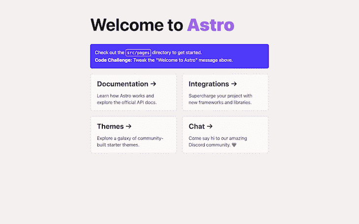
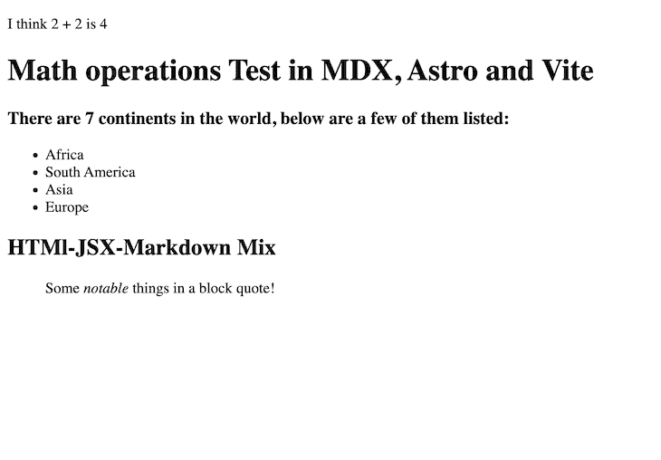
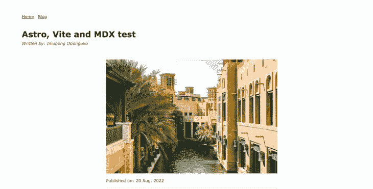
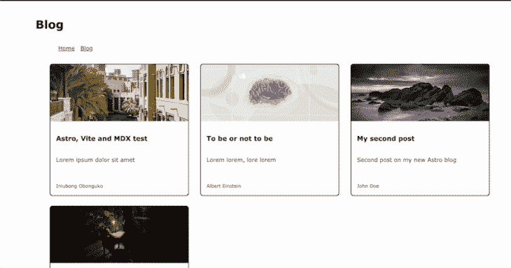

# 用 Astro、Vite 和 MDX 创建一个博客

> 原文：<https://blog.logrocket.com/build-blog-astro-vite-mdx/>

Astro 最近宣布在他们的 Astro 1.0 的[版本中支持 MDX 和 Vite 3.0，这两个重要的集成使他们在构建静态站点方面处于领先地位。Vite 是对其内部引擎的升级，提供了快速的构建和更好的开发体验，MDX 用于扩展 Markdown 功能，以满足交互式的、基于文本的内容。](https://astro.build/blog/astro-1/)

在本文中，您将学习如何使用 Astro 和 MDX 构建博客。我们将涵盖:

## 先决条件

*   JavaScript 和/或 JavaScript 框架的工作知识
*   了解降价语法

## 什么是阿童木？

Astro 是一个强大的静态网站生成器，它让你使用你熟悉和喜爱的 JavaScript 框架创建高性能的网站。Astro 是静态优先的，具有渐进式增强，这意味着，默认情况下，它不会向浏览器发送任何 JavaScript，直到需要时才发送。

## Vite 是什么？

Vite 是下一代 JavaScript 构建工具，它简化了前端 web 应用程序的构建和开发。其他流行的 JavaScript 构建工具，如 Webpack 和 Rollup，解决了开发过程中资产捆绑和本地提供代码的问题。

然而，Vite 以不同的方式处理这个问题，它利用本地浏览器 es 模块在浏览器中立即加载 JavaScript 代码。这样，无论添加到项目中的依赖项或代码数量有多少，您仍然可以获得即时的构建。

## 什么是 MDX？

MDX 是一个工具，它让你通过利用 JSX 的力量来扩展降价的能力。您可以导入和使用交互式组件，如图表、警报等。您甚至可以创建可重用的 MDX 组件。MDX 为创建书面内容开辟了新的可能性。

## Astro 应用程序设置

首先在终端中运行以下命令，使用 Astro CLI 创建一个项目:

```
npm create [email protected]

```

根据您的偏好，按照逐步终端提示完成设置。

完成后，`cd`进入项目目录，运行下面的命令，在`[http://localhost:3000](http://localhost:3000)`启动 Astro dev 服务器:

```
npm run dev

```

打开浏览器并导航至`[http://localhost:3000](http://localhost:3000)`。您应该会在屏幕上看到以下内容:



现在，根据您的软件包管理器，使用下面的命令安装 MDX:

```
# Using NPM
npx astro add mdx
# Using Yarn
yarn astro add mdx
# Using PNPM
pnpm astro add mdx

```

接受所有提示，完成 Astro 应用程序中的集成，并重启开发服务器。

默认情况下，Astro 支持 Markdown 文件，并且可以从`src/pages`文件夹中的 Markdown 文件(`.md`)构建路线/页面。但是通过添加 MDX 集成，你可以使用文件夹中的`.mdx`文件在你的应用中生成页面。

## 将 MDX 代码写入我们的 Astro 应用程序

MDX 没有任何特殊的语法，因为它只是 Markdown 和 JSX 的组合。您可以编写 JSX、Markdown、JavaScript 表达式以及导入和导出语句。

为了体验编写 MDX 代码的感觉，在项目的`src/pages`目录中创建一个文件，给它起一个您想要的名字，并以`.mdx`结束文件扩展名。然后粘贴以下代码块:

```
export const continents = ['Africa', 'South America', 'Asia', 'Europe']
I think 2 + 2 is {2+2}

# Math operations Test in MDX, Astro and Vite
### There are 7 continents in the world, below are a few of them listed:
<ul>
  {continents.map((continent) => (
    <li>{continent}</li>
  ))}
</ul>
## HTMl-JSX-Markdown Mix
<div>
  > Some *notable* things in a block quote!
</div>

```

当您导航到页面名称时，您应该在浏览器中看到以下输出:



## 用 MDX 和 Astro 创建博客

在本教程中，我们将使用 MDX 和 Astro 构建一个博客。

创建博客时，您将:

*   使用 MDX 创建基于文本的内容
*   为`blog`和`post`页面创建布局
*   向 MDX 添加交互式组件
*   使用 Astro 中的`frontmatter`将数据传递给 Astro 布局
*   使用`Astro.glob()`方法在本地获取所有降价文件进行显示

### 创建博客文章布局

导航到`src/layouts`文件夹，创建一个名为`PostLayout.astro`的新布局，并粘贴以下代码:

```
---
import BaseHead from "../components/BaseHead.astro";
import Header from "../components/Header.astro";
import Footer from "../components/Footer.astro";

const {
  frontmatter: { title, description, pubDate, image, author },
} = Astro.props;
---
<html lang="en">
  <head>
    <BaseHead title={title} description={description} />
    <style>
      .title {
        font-size: 2em;
        margin: 0.25em 0 0;
      }
      hr {
        border-top: 1px solid #ddd;
        margin: 1rem 0;
      }
    </style>
  </head>
  <body>
    <Header />
    <main>
      <article>
        <div class="article-head">
          <h1 class="title">{title}</h1>
          <em>Written by: {author}</em>
        </div>
        <div class="article-body">
          {image && }
          Published on: {pubDate && <time>{pubDate}</time>}
          <hr />
          <slot />
        </div>
      </article>
    </main>
    <div class="footer-container">
      <Footer />
    </div>
    <style>
      html {
        min-height: 100vh;
        height: 100%;
      }
      body {
        height: 100%;
      }
      time {
        display: inline-block;
        margin-top: 10px;
      }
    </style>
  </body>
</html>

```

我们来分析一下上面代码块的内容。

首先，文件顶部有一些尚不存在的组件导入。我们将很快创建它们:

*   组件`BaseHead`将包含布局的所有 HTML `<head></head>`属性
*   `Header`组件将在页面顶部包含导航链接，用于在路线之间切换
*   组件将包含布局的页脚
*   第 37 行的`<slot/>`组件用于将 Markdown 文件中的其余文本内容注入到布局中

Astro 为 Markdown 和 MDX 页面提供了一个`frontmatter`属性，可以用来定义描述文件的“元数据”。

在`PostLayout.astro`文件中，可以访问每个 Markdown/MDX 文件传递的`frontmatter` prop 来提取文件中定义的元数据。在第 8 行，由`Astro.props`提供的`frontmatter`属性被析构以暴露模板的变量。

现在，让我们为缺失的导入组件添加代码。

对于下面的每个代码块，在`components`文件夹中创建相应的文件，并粘贴相应代码块中的代码:

对于`Header.astro`:

```
<header>
  <nav>
    <a href="/">Home</a>
    <a href="/blog">Blog</a>
  </nav>
</header>
<style>
  header {
    margin: 2em 4em 2em;
  }
  h2 {
    margin: 0.5em 0;
  }
</style>

```

对于`Footer.astro`:

```
---
const today = new Date();
---
<footer>
    &copy; {today.getFullYear()} YOUR NAME HERE. All rights reserved.
</footer>
<style>
    footer {
        padding: 25px;
        text-align: center;
    }
</style>

```

最后，对于`BaseHead.astro`:

```
---
// Import the global.css file here so that it is included on
// all pages through the use of the <BaseHead /> component.
import "../styles/global.css";

const { title, description } = Astro.props;
---
<!-- Global Metadata -->
<meta charset="utf-8" />
<meta name="viewport" content="width=device-width,initial-scale=1" />
<link rel="icon" type="image/svg+xml" href="/favicon.svg" />
<meta name="generator" content={Astro.generator} />
<!-- Primary Meta Tags -->
<title>{title}</title>
<meta name="title" content={title} />
<meta name="description" content={description} />

```

还有一个缺失的导入:`../styles/global.css`。让我们快速创建文件并向其中添加样式。

在`src`文件夹中，用名为`global.css`的文件创建一个`styles`文件夹，并添加以下代码:

```
/*
  The CSS in this style tag is based off of Bear Blog's default CSS. https://github.com/HermanMartinus/bearblog/blob/297026a877bc2ab2b3bdfbd6b9f7961c350917dd/templates/styles/blog/default.css
  License MIT: https://github.com/HermanMartinus/bearblog/blob/master/LICENSE.md
 */
body {
  font-family: Verdana, sans-serif;
  margin: auto;
  padding: 20px;
  text-align: left;
  background-color: #fff;
  word-wrap: break-word;
  overflow-wrap: break-word;
  line-height: 1.5;
  color: #444;
  width: 100%;
}
.article-head {
  margin-left: 4em;
  margin-bottom: 50px;
}
.article-body {
  max-width: 65ch;
  margin: 0 auto;
}
h1,
h2,
h3,
h4,
h5,
h6,
strong,
b {
  color: #222;
}
a {
  color: #222;
}
nav a {
  margin-right: 10px;
}
textarea {
  width: 100%;
  font-size: 16px;
}
input {
  font-size: 16px;
}
content {
  line-height: 1.6;
}
table {
  width: 100%;
}
img {
  max-width: 100%;
  height: auto;
}
code {
  padding: 2px 5px;
  background-color: #f2f2f2;
}
pre {
  padding: 1rem;
}
pre > code {
  all: unset;
}
blockquote {
  border: 1px solid #999;
  color: #222;
  padding: 2px 0px 2px 20px;
  margin: 0px;
  font-style: italic;
}
```

### 创建降价博客文章

为了测试布局，创建一个`.mdx`文件并添加一些内容。为此，导航到`pages`文件夹，创建一个`post`文件夹，添加第一篇名为`first-post.mdx`的博客文章，然后粘贴下面的代码。您可以随意调整它并更改属性值:

```
---
layout: ../../layouts/PostLayout.astro
title: "Astro, Vite and MDX test"
description: "Lorem ipsum dolor sit amet"
author: "Iniubong Obonguko"
pubDate: "20 Aug, 2022"
image: "https://images.unsplash.com/photo-1664380619395-a25d867b5fb9?crop=entropy&cs=tinysrgb&fit=max&fm=jpg&q=80&w=1080"
slug: "first-post"
---
## Story about Old days
In the olden days, Lorem ipsum dolor sit amet, consectetur adipiscing elit, sed do eiusmod tempor incididunt ut labore et dolore magna aliqua. Vitae ultricies leo integer malesuada nunc vel risus commodo viverra. Adipiscing enim eu turpis egestas pretium. Euismod elementum nisi quis eleifend quam adipiscing. In hac habitasse platea dictumst vestibulum. Sagittis purus sit amet volutpat. Netus et malesuada fames ac turpis egestas. Eget magna fermentum iaculis eu non diam phasellus vestibulum lorem. Varius sit amet mattis vulputate enim. Habitasse platea dictumst quisque sagittis. Integer quis auctor elit sed vulputate mi. Dictumst quisque sagittis purus sit amet.

## Conclusion
Morbi tristique senectus et netus. Id semper risus in hendrerit gravida rutrum quisque non tellus. Habitasse platea dictumst quisque sagittis purus sit amet. Tellus molestie nunc non blandit massa. Cursus vitae congue mauris rhoncus. Accumsan tortor posuere ac ut. Fringilla urna porttitor rhoncus dolor. Elit ullamcorper dignissim cras tincidunt lobortis. In cursus turpis massa tincidunt dui ut ornare lectus. Integer feugiat scelerisque varius morbi enim nunc. Bibendum neque egestas congue quisque egestas diam. Cras ornare arcu dui vivamus arcu felis bibendum. Dignissim suspendisse in est ante in nibh mauris. Sed tempus urna et pharetra pharetra massa massa ultricies mi.

```

`frontmatter`是定义在
三重破折号(—)之间的所有元数据属性和值。

在`.mdx`文件的顶部定义了所有的`frontmatter`数据:

*   属性定义了选择的布局，这是在前面的`PostLayout.astro`中创建的
*   `frontmatter`中的所有其他属性包含布局用来填充页面的“元数据”
*   `frontmatter`下面的其余内容被视为博客的文本内容，并被传递到布局中的`<slot/>`占位符中

在您的浏览器上，转到`[https://localhost:3000/post/first-post](https://localhost:3000/post/first-post)`，您应该会看到一个类似于下图的页面:



### 向我们的 Astro 博客添加交互式组件

现在，我们将看看如何将支持 JavaScript 的交互式组件添加到我们的博客文章中。

为此，我们将使用一个名为`[accessible-astro-components](https://www.npmjs.com/package/accessible-astro-components)`的 Astro 组件库。要继续，我们首先需要安装库。通过在终端的`projects`文件夹下运行下面的代码来实现。

```
npm i accessible-astro-components

```

接下来，在`frontmatter`定义下的`first-post.mdx`文件中，导入`Accordion`和`AccordionItem`组件:

```
import { Accordion, AccordionItem } from "accessible-astro-components";

```

现在，您可以在文件的任何地方使用`Accordion`:

```
{/* first-post.mdx */}
{/* Rest of content at top */}
...
<Accordion>
  <AccordionItem header="First Item">
    <p>
      Lorem ipsum dolor sit amet consectetur adipisicing elit. Architecto quasi
      nobis optio? Qui in quo accusantium debitis sapiente obcaecati magnam
      incidunt sit. Molestiae exercitationem quibusdam quod veritatis laboriosam
      est tenetur.
    </p>
    <a href="#">Tab to me!</a>
  </AccordionItem>
  <AccordionItem header="Second Item">
    <p>
      Lorem ipsum dolor sit amet consectetur adipisicing elit. Architecto quasi
      nobis optio? Qui in quo accusantium debitis sapiente obcaecati magnam
      incidunt sit. Molestiae exercitationem quibusdam quod veritatis laboriosam
      est tenetur.
    </p>
  </AccordionItem>
</Accordion> 
...
{/* Rest of content at bottom */}

```

结果是:


> 也可以使用专门为其他 JavaScript 框架制作的组件，比如 VueJS、React 和 Svelte。你只需要首先在你的 Astro 应用中设置框架，然后导入想要的组件。

参考[这里的官方文档](https://docs.astro.build/en/core-concepts/framework-components/)了解如何操作。

### 在我们的 Astro 博客中创建一个页面

我们需要一个博客页面，将在一个网格中显示所有的博客帖子。

但是在我们开始之前，让我们首先在`/Layout`文件夹下为博客页面创建一个布局，并将其命名为`BlogLayout.astro`。然后将以下代码粘贴到其中:

```
---
import Header from "../components/Header.astro";
import BaseHead from "../components/BaseHead.astro";
const { title } = Astro.props;
---
<!DOCTYPE html>
<html lang="en">
  <BaseHead
    title="Blog Page"
    description="A page to display all our blog posts"
  />
  <body>
    <div class="layout">
      <h1>{title}</h1>
      <Header />
      <main>
        <slot />
      </main>
    </div>
    <style>
      body {
        margin: 0;
        background-color: #fff;
        width: 100%;
      }
      .layout {
        max-width: 1280px;
        margin: 0 auto;
      }
    </style>
  </body>
</html>

```

接下来，转到`src/pages`文件夹，创建一个`blog.astro`文件，并粘贴以下代码:

```
---
import BlogLayout from "../layouts/BlogLayout.astro";
import { Card } from "accessible-astro-components";
const posts = await Astro.glob("../pages/post/**/*.mdx");
---
<BlogLayout title="Blog">
  <section>
    <div class="container">
      <ul>
        {
          posts.map((post) => (
            <li>
              <Card
                url={"/post/" + post.frontmatter.slug}
                img={post.frontmatter.image}
                title={post.frontmatter.title}
                footer={post.frontmatter.author}
              >
                {post.frontmatter.description}
              </Card>
            </li>
          ))
        }
      </ul>
    </div>
  </section>
</BlogLayout>
<style lang="scss">
  ul {
    display: grid;
    grid-gap: 2rem;
    grid-template-columns: repeat(3, 1fr);
    list-style-type: none;
  }
</style>

```

让我们分析一下上面的代码块中发生了什么:

*   首先，`BlogLayout`被导入以用作页面的布局
*   从`accessible-astro-components`包中导入`Card`组件
*   Astro 有一个`Astro`全局上下文和`.glob()`方法，可以用来将许多本地文件加载到静态站点设置中。在这种情况下，所有包含在`/pages/post`目录中的`.mdx`文件都被加载并赋给了`posts`变量
*   然后一个`.map`方法遍历`posts`变量中的值，呈现一个列表，并为`Card`组件分配必要的道具
*   在博客文件的`frontmatter`属性上定义的`slug`属性随后被用于构建卡片组件的 URL

在`pages/post`目录中添加一篇或两篇以上的博客文章来填充博客页面。

完成后，博客页面应该如下所示:



瞧啊。博客现在完成了。

## 结论

使用 Markdown 语法创建基于文本的交互式内容从未如此简单。按照这个教程，你就可以使用 Astro 和 MDX 创建一个博客了。请随意使用您自己的定制样式和额外特性来更新本教程中的代码。

您还可以从官方文档网站了解更多关于 Astro 提供的与 MDX 集成[的酷特性。](https://docs.astro.build/en/guides/markdown-content/)

合十礼。

## 您是否添加了新的 JS 库来提高性能或构建新特性？如果他们反其道而行之呢？

毫无疑问，前端变得越来越复杂。当您向应用程序添加新的 JavaScript 库和其他依赖项时，您将需要更多的可见性，以确保您的用户不会遇到未知的问题。

LogRocket 是一个前端应用程序监控解决方案，可以让您回放 JavaScript 错误，就像它们发生在您自己的浏览器中一样，这样您就可以更有效地对错误做出反应。

[](https://lp.logrocket.com/blg/javascript-signup)[https://logrocket.com/signup/](https://lp.logrocket.com/blg/javascript-signup)

[LogRocket](https://lp.logrocket.com/blg/javascript-signup) 可以与任何应用程序完美配合，不管是什么框架，并且有插件可以记录来自 Redux、Vuex 和@ngrx/store 的额外上下文。您可以汇总并报告问题发生时应用程序的状态，而不是猜测问题发生的原因。LogRocket 还可以监控应用的性能，报告客户端 CPU 负载、客户端内存使用等指标。

自信地构建— [开始免费监控](https://lp.logrocket.com/blg/javascript-signup)。