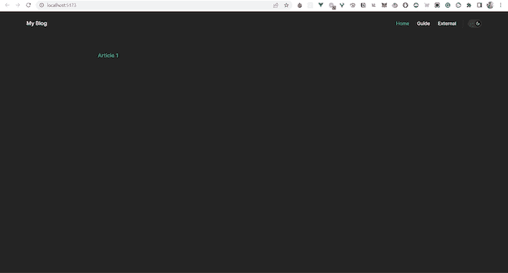
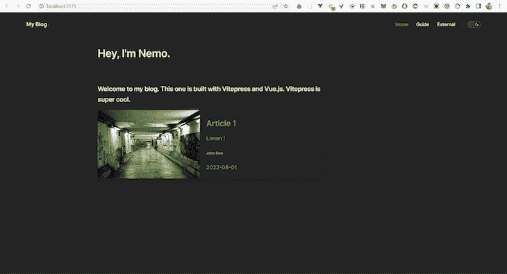
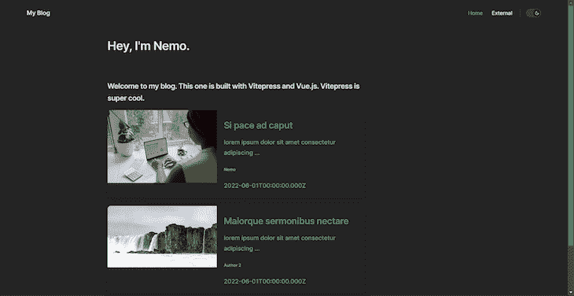

# 用 Vitepress 和 Vue.js 建立一个博客

> 原文：<https://blog.logrocket.com/build-blog-vitepress-vue-js/>

Vitepress 是一个静态的站点生成器，由 T2 的 Vite 和 Vue.js 的 T3 提供支持，在前端世界迅速流行起来。它具有优秀的特性，可以简化静态站点的构建，并在不影响性能的情况下提供最少的功能。使用 Vitepress，您可以使用 Markdown 和不同的主题来设计您的页面和内容，从而更快地构建网页。

本文旨在通过使用带有 Markdown 的 Vitepress 和 Vue.js 构建一个博客，让您熟悉 Vitepress。

向前跳:

## 什么是 Vite 和 Vitepress？

Vitepress，顾名思义，由 [Vite](https://blog.logrocket.com/getting-started-with-vite/) 提供动力。Vite 取代了 Rollup 和 Webpack 等工具，旨在解决 Webpack 和其他前端构建工具的痛点。使用 Vite 的主要好处是:

*   更快的服务器启动
*   即时热模块重装(HMR)
*   减少配置时间

你可以在这里找到更多关于 Vite [的细节。](https://vitejs.dev/guide/why.html)

Webpack 启动开发服务器需要更长的时间，这对于开发人员来说是无法忍受的。当文档站点变大时，使用 Webpack 变得非常烦人。这是开发 Vitepress 的主要动机。如果你以前使用过 [Vuepress](https://blog.logrocket.com/vuepress-in-all-its-glory-2f682e4f70c0/) ，Vitepress 非常相似，两个框架都专注于轻松地构建文档页面。一个区别是 Vuepress 用的是 Webpack，Vitepress 用的是 Vite。

Vue 和 Vitepress 的创始人[尤雨溪](https://twitter.com/youyuxi)没有重构 Vuepress 的代码库，而是创建了新的静态站点生成器，支持 Vite 和 [Vue 3](https://blog.logrocket.com/definitive-guide-vue-3-components/) 。它们的布局也是为文档网站设计的。但是，您也可以创建布局。

因为正处于 alpha 阶段，Vitepress 仍然比 Vuepress 缺少更多的功能，但它也很容易使用，因为 Vitepress 背后的团队希望保持它的最小化。

值得一提的是，Vitepress [不支持当前的 Vuepress 生态系统，因为 Vitepress 的团队希望保持最小的主题 API，以便可以在主题中进行定制。要了解更多关于 Vitepress 与 Vuepress 的不同之处，请参考他们的](https://vitepress.vuejs.org/guide/what-is-vitepress)[官方文档](https://vitepress.vuejs.org/guide/what-is-vitepress)。

## 用 Vitepress 和 Vue.js 创建博客

即使 Vitepress 可以用来快速构建设计良好的文档站点，您也可以扩展 Vitepress 的功能来开发您的博客。在本文中，我们将重点介绍如何在 Vitepress 中创建一个博客并学习主题化和定制。

通读完这篇文章后，您可以使用 Vitepress 和 Vue 3 开发您的文档站点或博客。但是在开始阅读本文之前，请确保您对 Vue 3 有一个基本的了解。

### 用 Vitepress 创建静态站点

使用 Vitepress 非常容易。你可以通过安装两个主要的开发者包来开始用 Vitepress 构建你的网站。在您的工作目录中，安装`vue`和`vitepress`作为开发者依赖项。

要安装软件包，请运行以下命令:

```
 npm i -D vue vitepress

```

`-D`标志将把包作为开发者依赖项安装。现在，在工作目录中创建一个文件夹，并随意命名。通常，这个文件夹被命名为`docs`，所以我也将这个文件夹命名为`docs`。

创建完`docs`之后，你需要添加一些`scripts`到你的`package.json`文件中。复制下面的`scripts`并粘贴到你的`package.json`文件中:

```
"scripts": {
    "docs:dev": "vitepress dev docs",
    "docs:build": "vitepress build docs",
    "docs:serve": "vitepress serve docs"
  },

```

现在，准系统 Vitepress 应用程序的设置已经准备好了。创建一个标题为`index.md`的 Markdown 文件，并在`docs`中添加一些虚拟内容。通过在终端内部运行命令`npm run docs:dev`来启动开发服务器。

Vitepress 的默认开发端口是`localhost:5173`。这个`index.md`文件将作为`index.html`文件或者你的 Vitepress 静态站点的入口点。如果您访问该 URL，您将能够查看您的 Vitepress 页面。Vitepress 附带了一个默认主题。您可以使用主题提供的不同选项来自定义您的网站。

但是，因为`index.md`文件是空的，所以您将看不到任何内容。您可以在`index.md`中添加一些文本，以查看您的 Vitepress 页面上的更改。要定制这些特性，在`docs`中创建一个名为`.vitepress`的文件夹(注意开头的点)。此文件夹用于配置 Vitepress 选项。

在 Vitepress 上可以进行三种类型的配置:应用配置、主题配置和前台配置。应用程序配置包括网站标题、Markdown 解析器定制等功能。同时，主题配置决定了应用程序的外观。例如，如果你想在你的网站上添加一个导航栏，你需要更新主题配置。

前端事件配置可以覆盖特定页面、应用程序配置和主题配置的全局配置。

### Vitepress 配置

在这个文件中创建一个名为`config.js`的文件。Vitepress 将读取这个文件来定制您的应用程序。该文件也可以使用`.ts`、`.mjs`、`.mts`等扩展名创建。

让我们看一个虚拟的`config.js`文件来理解如何定制主题:

```
export default {
  title: 'My Blog',
  description: 'Just playing around.',
  themeConfig: {
    nav: [
      { text: 'Home', link: '/' },
      { text: 'Blog', link: '/articles/' },
      { text: 'External', link: 'https://google.com' },
    ],
  },
};

```

上面代码中的对象由三个选项组成:`title`、`description`和`themeConfig`。`title`和`description`键用于描述你网站的标题和元描述。这些都是 app 配置。

添加一个`head`键还可以在头部添加 Google 字体或者 CSS 文件的特定链接。你可以在这里找到所有的应用配置选项[。](https://vitepress.vuejs.org/config/app-configs)

主题配置可以通过`themeConfig`键添加到对象中，如上所示。`nav`数组定义了导航栏中的元素，您还可以为导航项目添加下拉菜单。这里有一个如何使用它的例子:

```
export default {
  themeConfig: {
    nav: [
      { text: 'Guide', link: '/guide' },
      {
        text: 'Dropdown Menu',
        items: [
          { text: 'Item A', link: '/item-1' },
          { text: 'Item B', link: '/item-2' },
          { text: 'Item C', link: '/item-3' }
        ]
      }
    ]
  }
}

```

你还可以用`themeConfig`添加边栏、页脚、社交链接、[等更多的](https://vitepress.vuejs.org/config/theme-configs)。

### 使用 Vitepress 和 Vue 向博客添加帖子

现在，让我们在博客上添加一些帖子。在`docs`文件夹中创建一个名为`articles`的文件夹，并以 Markdown 格式添加任何帖子。例如，让我们添加一个名为`article1.md`的降价帖子。

现在，打开我们之前创建的`index.md`文件，并添加`article1.md`链接。`index.md` Markdown 文件将如下所示:

```
[Article 1](/articles/article1) 

```

添加这个会在你的主页上呈现如下的文章:



如果你点击链接，它会将你的 Markdown 文件显示为一个 HTML 页面。关于 Vitepress 的一个很棒的事情是，你可以将 Vue 3 组件直接添加到你的 Markdown 文件中，从而轻松地配置你的主页。

### 在主页上设计博客帖子卡

我们在首页加一张博文卡片吧。在`docs`中创建一个`components`文件夹。现在，创建一个名为`ArticleCard.vue`的文件。一个 Vue 组件可以包含一个`template`、`script`和`style`。首先，我们来看看`template`:

```
<template>
  <a :href="href">
    <div class="card">
      <div class="flex">
        <div class="media">
          
        </div>
        <div class="details">
          <h2 class="title">{{ title }}</h2>
          <p class="excerpt">{{ truncateText(excerpt, 50) }}</p>
          <div class="author">
            <div>
              <h3 class="name">{{ author }}</h3>
              <p class="date">{{ date }}</p>
            </div>
          </div>
        </div>
      </div>
    </div>
  </a>
</template>

```

代码相当简单，因为我们只使用几个道具将数据传递到组件中。让我们来看看`script`探索道具:

```
<script>
export default {
  props: {
    title: {
      type: String,
      required: true,
    },
    excerpt: {
      type: String,
      required: true,
    },
    image: {
      type: String,
      required: true,
    },
    author: {
      type: String,
      required: true,
    },
    date: {
      type: String,
      required: true,
    },
    href: {
      type: String,
      required: true,
    },
  },
  methods: {
    truncateText(text, length) {
      if (text.length > length) {
        return text.substring(0, length) + "...";
      }
      return text;
    },
  },
};
</script>

```

### 用 Vitepress 和 Vue 设计博客主页

卡片的道具有`title`、`excerpt`、`image`、`author`、`date`、`href`。道具的名称不言自明。除此之外，我们还有一个截断摘录大小的函数。它将一些文本和字符长度作为参数，并返回一个带有尾随点的截断文本。我不会解释基本的样式，因为我假设你知道 CSS 的基础知识。

该组件的样式如下所示:

```
<style scoped>
.card {
  border-radius: 0.5rem;
  box-shadow: 0 0.5rem 1rem rgba(0, 0, 0, 0.15);
  margin-bottom: 1.5rem;
  overflow: hidden;
  width: 100%;
}

.card:hover {
  box-shadow: 0 0.5rem 1rem rgba(0, 0, 0, 0.25);
  transition: ease-in-out 0.2s all;
}

.flex {
  display: flex;
}

.media {
  width: 45%;
  height: 100%;
  object-fit: cover;
  object-position: center;
}

.details {
  margin-left: 1.2rem;
}

.title {
  border-top: none;
  margin: 0 0;
}

.name {
  margin: 0 0;
  font-size: 0.7rem;
  color: #999;
}
</style>

```

我还做了一个`hero`组件。下面是`Hero.vue`的代码:

```
<template>
  <div class="hero">
    <div class="hero-body">
      <div class="container">
        <h1 class="title">Hey, I'm {{ name || "John Doe" }}.</h1>
        <h2 class="subtitle">
          {{ subtitle }}
        </h2>
      </div>
    </div>
  </div>
</template>

<script>
export default {
  props: {
    name: {
      type: String,
      required: true,
    },
    subtitle: {
      type: String,
      required: true,
    },
  },
};
</script>

<style>
h2.subtitle {
  font-size: 1.2rem;
  border-top: none;
}
</style>

```

现在我们已经创建了组件，让我们将它们添加到`index.md`文件中:

```
<script setup>
  import Hero from './components/Hero.vue'
  import ArticleCard from './components/ArticleCard.vue'
</script>

<Hero name="Nemo" subtitle="Welcome to my blog. This one is built with Vitepress and Vue.js. Vitepress is super cool." />

<ArticleCard title="Article 1" excerpt="Lorem i" image="https://images.unsplash.com/photo-1664663751485-c58e9276ccce?ixlib=rb-1.2.1&ixid=MnwxMjA3fDB8MHxwaG90by1wYWdlfHx8fGVufDB8fHx8&auto=format&fit=crop&w=1167&q=80" author="John Doe" href="/articles/article1" date="2022-08-01" />

```

这就像任何标准的 Vue 组件。但是，如果你想在这个文件中添加降价，你可以直接在结束标签`script`之后添加。

您的主页现在将如下所示:



现在，我们有 Vitepress 设置的默认颜色。您可以通过组件中的`style`标签自定义组件的颜色。对于特定于降价的文件，您也可以覆盖默认样式。更多细节可以参考[文档](https://vitepress.vuejs.org/guide/theme-introduction)。

现在，这个博客有一个问题。每次添加新文章时，手动将所有文章添加到索引文件`.md`中是一个糟糕的主意。那么，我们如何解决这个问题？

### 在 Vitepress 中访问前端内容

Vuepress 内置了对前端获取的支持。您可以通过访问`$site`变量来访问前面的详细信息。但 Vitepress 却不是这样。为了保持 Vitepress 最小，它不支持它。我们必须自己想办法解决这个问题。

实现这一点的一个方法是编写一个简单的脚本，该脚本将获取前面的细节并将其写入一个`JSON`文件。

让我们来看一个简单的脚本:

```
// Credits to Divyansh Singh
// Twitter: @_brc_dd

import fs from 'node:fs/promises';
import matter from 'gray-matter';
import removeMd from 'remove-markdown';

const articles = await fs.readdir('./docs/articles');

const data = await Promise.all(
  articles.map(async (article) => {
    const file = matter.read(`./docs/articles/${article}`, {
      excerpt: true,
      excerpt_separator: '

',
});
const { data, excerpt, path } = file;
const contents = removeMd(excerpt)
.trim()
.split(/\r\n|\n|\r/);
return {
...data,
title: contents[0].replace(/\s{2,}/g, '').trim(),
path: path.replace('./docs/', '').replace(/\.md$/, '.html'),
excerpt: contents
.slice(1)
.join('')
.replace(/\s{2,}/g, '')
.trim(),
};
})
);
await fs.writeFile('./data.json', JSON.stringify(data), 'utf-8');
```

首先，我们需要安装[灰质](https://www.npmjs.com/package/gray-matter)和[去除标记](https://www.npmjs.com/package/remove-markdown)。gray-matter 包从 markdown 文件中读取前面的内容，而 remove-markdown 包用于从文本中删除任何 Markdown。要安装软件包，运行`npm i remove-markdown gray-matter`命令。

### 用 Vitepress 和 Vue.js 完成博客

现在我们来讨论剧本。第一步是读取存储文章的目录。在这种情况下，文章在`docs/articles`文件夹中。我们将文件夹中的值存储在一个名为`articles`的变量中。

现在，在一个`Promise`中，我们将映射到`articles`文件夹中的每个可用项目。使用 gray-matter 软件包中的`matter.read`功能读取降价信息。该函数返回所有必要的信息，如`path`、`excerpt`等。它还包含一个`data`对象，用于存储前面的细节。

* * *

### 更多来自 LogRocket 的精彩文章:

* * *

通过阅读标题后的引用(`>`)来阅读摘录。对于`<!-- more -->`分隔符，它会将引用视为摘录。在上面的代码中，分频器被定义为`excerpt_separator`:

```
---
Author: Nemo
Updated: 2022-06-01
image: https://images.unsplash.com/photo-1664575198263-269a022d6e14?ixlib=rb-1.2.1&ixid=MnwxMjA3fDF8MHxwaG90by1wYWdlfHx8fGVufDB8fHx8&auto=format&fit=crop&w=1170&q=80
---
# Si pace ad caput
> lorem ipsum dolor sit amet consectetur adipiscing elit sed do eiusmod tempor incididunt ut labore et dolore magna aliqua

```

现在，所需的数据从文件中重新构造。使用`removeMd`包清理摘录。`regex`操作用于清洁 CRLF 和 LF 线断线。最后，返回数据。

在`data`中，路径从`./docs/articles/article.md`被替换为`/articles/article.html`，用于将其渲染为 HTML。将`script`保存为`getArticles.mjs`。如果你愿意，你也可以不加任何扩展名。

使用了`mjs`扩展，这样我们就可以使用 [ECMAScript 模块](https://nodejs.org/api/esm.html)。从`script`生成的数据被写入一个 JSON 格式的`data.json`文件。要在每次新构建开始时运行这个`script`，将您的包`scripts`更改为:

```
"scripts": {
    "docs:dev": "node getArticles.mjs && vitepress dev docs",
    "docs:build": "node getArticles.mjs && vitepress build docs",
    "docs:serve": "vitepress serve docs"
  },

```

在开始处添加`node getArticles.mjs`命令可以确保`script`在 Vitepress 服务器启动之前运行。

现在，在主页上，让我们迭代文章并在`ArticleCard`中渲染它们。一个简单的`v-for`循环可以用来渲染文章。让我们看看最后的`index.md`页面:

```
<script setup>
  import Hero from './components/Hero.vue'
  import ArticleCard from './components/ArticleCard.vue'

  import data from '../data.json' 
</script>

<Hero name="Nemo" subtitle="Welcome to my blog. This one is built with Vitepress and Vue.js. Vitepress is super cool." />

<div v-for="(article, index) in data" :key="index">
  <ArticleCard :title="article.title" :excerpt="article.excerpt" :image="article.image" :author="article.Author" :href="article.path" :date="article.Updated" />
</div>

```

当您启动 Vitepress 应用程序时，您的主页将类似于下面的截图:



你的博客已经准备好了！

你可以访问这个 [Stackblitz repo](https://stackblitz.com/github/nemo0/vitepress-blog?file=package.json) 来查看它的工作版本，或者你也可以查看 [GitHub 仓库](https://github.com/nemo0/vitepress-blog)来获得完整的代码。

## 结论

这篇文章的目的是帮助你开始使用 Vitepress。它向您展示了如何扩展 Vitepress 来构建您的博客并根据您的需要定制页面。Vitepress 提供了一种为文档站点或博客构建静态站点的简单方法。

Vitepress 仍处于 alpha 阶段，因此可能会出现问题。现在最好不要在你的生产应用中使用 Vitepress。但是如果你想探索更多关于这个库的信息，你可以查看一下[文档](https://vitepress.vuejs.org/)。

## 像用户一样体验您的 Vue 应用

调试 Vue.js 应用程序可能会很困难，尤其是当用户会话期间有几十个(如果不是几百个)突变时。如果您对监视和跟踪生产中所有用户的 Vue 突变感兴趣，

[try LogRocket](https://lp.logrocket.com/blg/vue-signup)

.

[](https://lp.logrocket.com/blg/vue-signup)[https://logrocket.com/signup/](https://lp.logrocket.com/blg/vue-signup)

LogRocket 就像是网络和移动应用程序的 DVR，记录你的 Vue 应用程序中发生的一切，包括网络请求、JavaScript 错误、性能问题等等。您可以汇总并报告问题发生时应用程序的状态，而不是猜测问题发生的原因。

LogRocket Vuex 插件将 Vuex 突变记录到 LogRocket 控制台，为您提供导致错误的环境，以及出现问题时应用程序的状态。

现代化您调试 Vue 应用的方式- [开始免费监控](https://lp.logrocket.com/blg/vue-signup)。