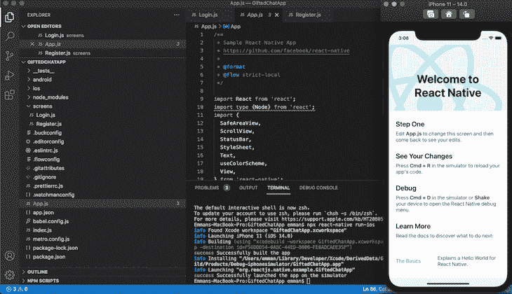
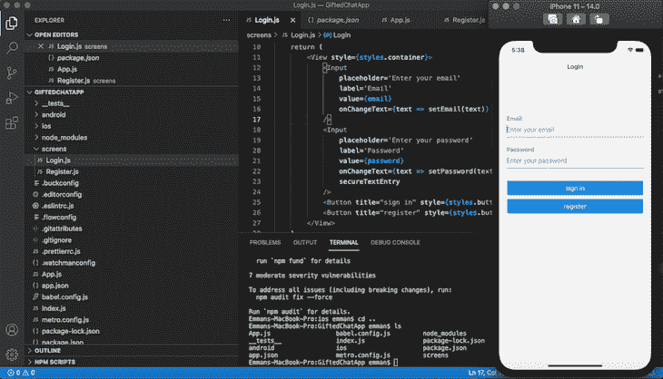
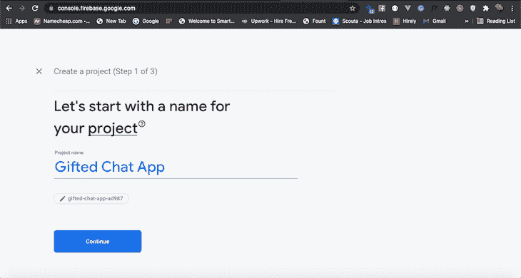
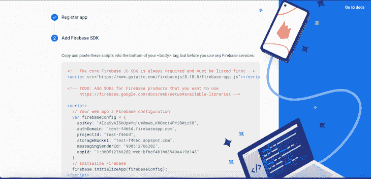
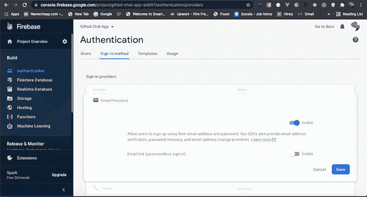
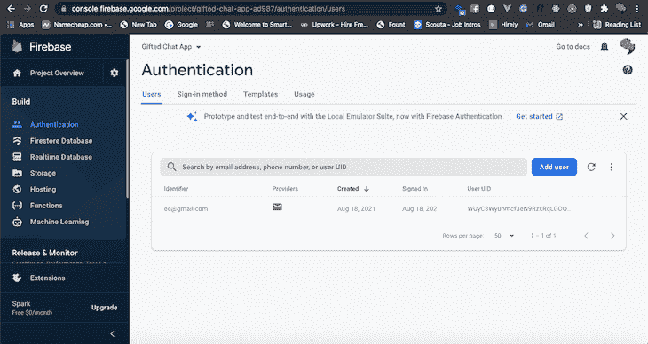
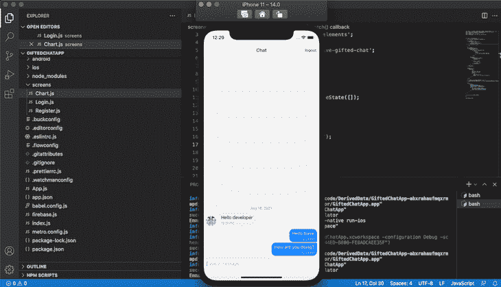

# 用 react-native-gifted-chat-log rocket 博客构建一个聊天应用程序

> 原文：<https://blog.logrocket.com/build-chat-app-react-native-gifted-chat/>

***编者按:*** *本文于 2022 年 3 月 8 日更新，以反映 Firestore 的最新版本，并包括新的 Firebase SDK APIs。*

随着实时通信需求的增长，开发人员正在寻找简单的方法来为移动应用程序添加可靠的通信渠道。在本教程中，我们将学习如何使用 [react-native-gifted-chat](https://github.com/FaridSafi/react-native-gifted-chat) 在 React Native 中为 iOS 和 Android 构建移动聊天应用程序，react-native-gifted-chat 是一个聊天用户界面，旨在使应用程序开发人员能够构建跨平台的聊天应用程序。

要跟随本教程，您需要:

*   CSS、HTML 和 Javascript ES6 的工作知识
*   安装在开发机器上的 Node.js 和 Watchman
*   用于测试的 iOS 模拟器或 Android 模拟器
*   安装在开发机器上的代码编辑器
*   React 和 React Native 的工作知识

## 内容

我们开始吧！

## 反应-原生-天赋-聊天道具

让我们来看看我们将用来创建应用程序的几个内置道具:

*   `messages`(数组)显示消息
*   `text`(字符串)，输入文本的类型。默认为`undefined`
*   `isTyping` (bool)处理打字指示器状态。默认为`false`
*   `timeFormat`(字符串)决定时间格式。默认为`LT`
*   `dateFormat`(字符串)决定日期格式。默认为`ll`
*   `placeholder`(文本)，空文本字段的占位符。默认为`Type a message...`
*   `user`(对象)，发送消息的用户的凭证，即`{_id, name, avatar}`
*   `messageIdGenerator`(函数)为每个新消息生成一个 id。`UUID`默认是`V4`

你可以在[文档](https://github.com/FaridSafi/react-native-gifted-chat#readme)中探索其他道具。

## 安装 react-native-gifted-chat

让我们从设置一个新的 React 原生应用程序开始。打开您的终端，导航到您的工作目录，并运行下面的命令来初始化一个新的 React 本机应用程序:

```
npx react-native init GiftedChatApp

```

安装完成后，导航到`GiftedChatApp`目录并运行以下命令来安装所需的依赖项:

```
cd GiftedChatApp && npm install @react-navigation/native @react-navigation/stack react-native-gifted-chat react-native-reanimated react-native-gesture-handler react-native-screens react-native-safe-area-context @react-native-community/masked-view react-native-vector-icons

```

上面的命令将在您的项目中安装 React Navigation、react-native-gifted-chat 和其他必需的依赖项。如果你设置正确，一旦你用`npx react-native run-ios`或`npx react-native run-android`运行它，你的应用应该看起来像下面的截图:



## 构建登录屏幕

在我们开始构建登录屏幕之前，让我们更新代码，使`App.js`允许屏幕导航。打开`App.js`，然后复制并粘贴下面的代码:

```
import React from 'react';
import { createStackNavigator } from '@react-navigation/stack'
import { NavigationContainer } from '@react-navigation/native';
import LoginScreen from './screens/Login';

const Stack = createStackNavigator();

const App = () => {
  return (
    <NavigationContainer>
      <Stack.Navigator >
        <Stack.Screen name='Login' component={LoginScreen} />
      </Stack.Navigator>
    </NavigationContainer>
  );
};

export default App;

```

让我们安装最后一个依赖项。React Native Elements 是一个 UI 工具包，允许您轻松创建表单元素和图标。要安装 React 本地元素，请在您的终端中运行以下代码:

```
npm install react-native-elements

```

接下来，导航到您的项目目录，创建一个名为`screens`的新文件夹，创建一个名为`Login.js`的新文件，然后将下面的代码复制并粘贴到`Login.js`中:

```
import React, { useState } from 'react';
import { View, StyleSheet } from 'react-native'
import { Input, Button } from 'react-native-elements';
import Icon from 'react-native-vector-icons/FontAwesome';

const Login = ({navigation}) => {
    const [email, setEmail] = useState('');
    const [password, setPassword] = useState('');

    return (
        <View style={styles.container}>
            <Input
                placeholder='Enter your email'
                label='Email'
                leftIcon={{ type: 'material', name: 'email' }}
                value={email}
                onChangeText={text => setEmail(text)}
            />
            <Input
                placeholder='Enter your password'
                label='Password'
                leftIcon={{ type: 'material', name: 'lock' }}
                value={password}
                onChangeText={text => setPassword(text)}
                secureTextEntry
            />
            <Button title='sign in' style={styles.button} />
            <Button title='register' style={styles.button} />
        </View>
    )
}
const styles = StyleSheet.create({
    container: {
        flex: 1,
        alignItems: 'center',
        padding: 10,
        marginTop: 100,
    },
    button: {
        width: 370,
        marginTop: 10
    }
});

export default Login;

```

在上面的代码块中，我们导入了`useState()`钩子，创建了两个状态来存储`email`和`password`字段，使用 React 本地元素创建了登录输入字段，最后添加了样式。

现在，运行`npx react-native run-ios`或`npx react-native run-android`，你的应用应该如下图所示:



## 构建注册屏幕

现在，让我们构建一个注册屏幕，向我们的应用程序添加新用户。

导航到`screens`文件夹，创建一个名为`Register.js`的新文件，然后复制并粘贴以下代码:

```
import React, { useState } from 'react';
import { View, StyleSheet } from 'react-native'
import { Input, Button } from 'react-native-elements';

const Register = () => {
    const [name, setName] = useState('');
    const [email, setEmail] = useState('');
    const [password, setPassword] = useState('');
    const [avatar, setAvatar] = useState('');

    return (
        <View style={styles.container}>
            <Input
                placeholder='Enter your name'
                label='Name'
                value={name}
                onChangeText={text => setName(text)}
            />
            <Input
                placeholder='Enter your email'
                label='Email'
                value={email}
                onChangeText={text => setEmail(text)}
            />
            <Input
                placeholder='Enter your password'
                label='Password'
                value={password} onChangeText={text => setPassword(text)}
                secureTextEntry
            />
            <Input
                placeholder='Enter your image url'
                label='Profile Picture'
                value = {avatar}
                onChangeText={text => setAvatar(text)}
            />
            <Button title='register' style={styles.button} />
        </View>
    )
}
const styles = StyleSheet.create({
    container: {
        flex: 1,
        alignItems: 'center',
        padding: 10,
        marginTop: 100,
    },
    button: {
        width: 370,
        marginTop: 10
    }
});

export default Register;

```

## 为 React Native 设置 Firebase

现在，您已经完成了登录和注册屏幕的构建，让我们将 Firebase 添加到我们的应用程序中来验证用户。

通过运行以下代码安装 Firebase:

```
npm install --save firebase

```

以上命令将安装最新的 Firebase web SDK 版本。在本教程中，我们将使用 Firebase v.9 模块化库。现在，去 [Firebase 网站](https://firebase.google.com)创建一个名为天才聊天应用的新项目:



接下来，我们将向刚刚创建的 Firebase 项目添加一个 web 应用程序。在项目的根目录下创建一个名为`firebase.js`的新文件。从下面的屏幕中复制`firebaseConfig`凭证:



用您项目的独特详细信息替换当前在`firebaseConfig`中的凭证:

```
import { initializeApp, getApp } from 'firebase/app';
import { initializeFirestore } from 'firebase/firestore';
import { getAuth } from 'firebase/auth';

const firebaseConfig = {
  apiKey: 'your_api_key',
  authDomain: 'your_auth_domain',
  projectId: 'your_project_id',
  storageBucket: 'your_storage_bucket',
  messagingSenderId: 'your_messaging_sender_id',
  appId: 'your_app_id',
  measurementId: 'your_measurement_id' // optional
};

const app = initializeApp(firebaseConfig);

const auth = getAuth(app);
const db = initializeFirestore(app, {experimentalForceLongPolling: true});

export { db, auth };

```

上述模块初始化一个 Firebase 应用程序和 Firestore 数据库连接。它还返回初始化的 Firestore 连接实例作为`db`和认证实例作为`auth`。

## 使用 Firebase 认证用户

让我们使用`email`和`password`通过 Firebase 启用用户[认证。在 Firebase 控制台的工具条菜单中点击**认证**，选择`Email/Password`。](https://blog.logrocket.com/storing-retrieving-data-react-native-apps-firebase/)

接下来，选择**使能**和**保存**:



现在 Firebase 的设置和配置已经完成，让我们更新`Register.js`文件来认证一个新用户。

首先，添加以下与 Firebase 相关的导入:

```
import { auth } from '../firebase';
import { createUserWithEmailAndPassword, updateProfile } from 'firebase/auth';

```

复制下面的代码，并将其放在`Register`函数的`return`关键字之上:

```
const register = () => {
  createUserWithEmailAndPassword(auth, email, password)
    .then((userCredential) => {
        // Registered
        const user = userCredential.user;
        updateProfile(user, {
            displayName: name,
            photoURL: avatar ? avatar : 'https://gravatar.com/avatar/94d45dbdba988afacf30d916e7aaad69?s=200&d=mp&r=x',
        })
        .then(() => {
            alert('Registered, please login.');
        })
        .catch((error) => {
            alert(error.message);
        })
    })
    .catch((error) => {
        const errorCode = error.code;
        const errorMessage = error.message;
        alert(errorMessage);
    });
}

```

首先，我们从之前创建的`firebase.js`文件中导入了`auth`对象。接下来，我们创建了一个`register`函数，并将`auth`对象、新用户的电子邮件和密码传递给了`createUserWithEmailAndPassword`方法。最后，我们用`name`和`avatar`更新了用户的凭证。

接下来，我们将用`onPress`处理程序将注册函数传递给注册按钮:

```
<Button title='register' onPress={register} style={styles.button} />

```

下面是经过上述修改后的`Register.js`文件的完整源代码:

```
import React, { useState } from 'react';
import { View, StyleSheet } from 'react-native'
import { Input, Button } from 'react-native-elements';
import { auth } from '../firebase';
import { createUserWithEmailAndPassword, updateProfile } from 'firebase/auth';

const Register = () => {
    const [name, setName] = useState('');
    const [email, setEmail] = useState('');
    const [password, setPassword] = useState('');
    const [avatar, setAvatar] = useState('');

    const register = () => {
      createUserWithEmailAndPassword(auth, email, password)
        .then((userCredential) => {
            // Registered
            const user = userCredential.user;
            updateProfile(user, {
                displayName: name,
                photoURL: avatar ? avatar : 'https://gravatar.com/avatar/94d45dbdba988afacf30d916e7aaad69?s=200&d=mp&r=x',
            })
            .then(() => {
              alert('Registered, please login.');
            })
            .catch((error) => {
                alert(error.message);
            })
        })
        .catch((error) => {
            const errorCode = error.code;
            const errorMessage = error.message;
            alert(errorMessage);
        });
    }

    return (
        <View style={styles.container}>
            <Input
                placeholder='Enter your name'
                label='Name'
                value={name}
                onChangeText={text => setName(text)}
            />
            <Input
                placeholder='Enter your email'
                label='Email'
                value={email}
                onChangeText={text => setEmail(text)}
            />
            <Input
                placeholder='Enter your password'
                label='Password'
                value={password} onChangeText={text => setPassword(text)}
                secureTextEntry
            />
            <Input
                placeholder='Enter your image url'
                label='Profile Picture'
                value = {avatar}
                onChangeText={text => setAvatar(text)}
            />
            <Button title='register' onPress={register} style={styles.button} />
        </View>
    )
}
const styles = StyleSheet.create({
    container: {
        flex: 1,
        alignItems: 'center',
        padding: 10,
        marginTop: 100,
    },
    button: {
        width: 370,
        marginTop: 10
    }
});

export default Register;

```

接下来，通过更新`App.js`文件将注册屏幕添加到导航堆栈，如以下代码所示:

```
import React from 'react';
import {
  StyleSheet,
} from 'react-native';

import { createStackNavigator } from '@react-navigation/stack'
import { NavigationContainer } from '@react-navigation/native';
import LoginScreen from './screens/Login';
import RegisterScreen from './screens/Register';

const Stack = createStackNavigator();

const App = () => {
  return (
    <NavigationContainer>
      <Stack.Navigator >
        <Stack.Screen name='Login' component={LoginScreen} />
        <Stack.Screen name='Register' component={RegisterScreen} />
      </Stack.Navigator>
    </NavigationContainer>
  );
};

export default App;

```

此外，我们需要添加一个从登录屏幕到注册屏幕的导航动作，因此将以下代码添加到`Login.js`文件中:

```
import React, { useState } from 'react';
import { View, StyleSheet } from 'react-native'
import { Input, Button } from 'react-native-elements';
import Icon from 'react-native-vector-icons/FontAwesome';

const Login = ({navigation}) => {
    const [email, setEmail] = useState('');
    const [password, setPassword] = useState('');

    const openRegisterScreen = () => {
      navigation.navigate('Register');
    };

    return (
        <View style={styles.container}>
            <Input
                placeholder='Enter your email'
                label='Email'
                leftIcon={{ type: 'material', name: 'email' }}
                value={email}
                onChangeText={text => setEmail(text)}
            />
            <Input
                placeholder='Enter your password'
                label='Password'
                leftIcon={{ type: 'material', name: 'lock' }}
                value={password}
                onChangeText={text => setPassword(text)}
                secureTextEntry
            />
            <Button title='sign in' style={styles.button} />
            <Button title="register" style={styles.button} onPress={openRegisterScreen} />
        </View>
    )
}
const styles = StyleSheet.create({
    container: {
        flex: 1,
        alignItems: 'center',
        padding: 10,
        marginTop: 100,
    },
    button: {
        width: 370,
        marginTop: 10
    }
});

export default Login;

```

现在，您可以从您的应用程序中注册一个新用户，并在 Firebase 控制台中列出他们:



## 构建聊天屏幕

接下来，我们将构建聊天屏幕，在成功登录后，我们将在其中重定向用户。
在`screens`目录下创建一个名为`Chat.js`的新文件。

要创建一个基本的聊天应用程序，请将下面的代码复制并粘贴到文件中:

```
import React, { useEffect, useCallback, useState, useLayoutEffect } from 'react';
import { View, Text, StyleSheet, TouchableOpacity } from 'react-native';
import { Avatar } from 'react-native-elements';
import { auth, db } from '../firebase';
import { signOut } from 'firebase/auth';
import { GiftedChat } from 'react-native-gifted-chat';

const Chat = ({ navigation }) => {
    const [messages, setMessages] = useState([]);
    const signOutNow = () => {
        signOut(auth).then(() => {
            // Sign-out successful.
            navigation.replace('Login');
        }).catch((error) => {
            // An error happened.
        });
    }
    useLayoutEffect(() => {
        navigation.setOptions({
            headerLeft: () => (
                <View style={{ marginLeft: 20 }}>
                    <Avatar
                        rounded
                        source={{
                            uri: auth?.currentUser?.photoURL,
                        }}
                    />
                </View>
            ),
            headerRight: () => (
                <TouchableOpacity style={{
                    marginRight: 10
                }}
                    onPress={signOutNow}
                >
                    <Text>logout</Text>
                </TouchableOpacity>
            )
        })
    }, [navigation]);

    useEffect(() => {
        setMessages([
            {
                _id: 1,
                text: 'Hello developer',
                createdAt: new Date(),
                user: {
                    _id: 2,
                    name: 'React Native',
                    avatar: 'https://placeimg.com/140/140/any',
                },
            },
        ])
    }, []);
    const onSend = useCallback((messages = []) => {
        setMessages(previousMessages => GiftedChat.append(previousMessages, messages))
    }, []);
    return (
        <GiftedChat
            messages={messages}
            showAvatarForEveryMessage={true}
            onSend={messages => onSend(messages)}
            user={{
                _id: auth?.currentUser?.email,
                name: auth?.currentUser?.displayName,
                avatar: auth?.currentUser?.photoURL
            }}
        />
    );
}

export default Chat;

```

使用 Firebase `auth`对象，我们创建了`messages`状态和一个处理用户注销的函数。接下来，我们创建了一个基本的导航效果，用一个`useLayoutEffect`包装标题`nav`。

使用`useEffect`钩子，我们创建了一个虚拟消息，并将其安装到`GiftedChat`组件上。`GiftedChat`组件上的`user`道具指的是当前登录的用户，在本例中就是你。

我们需要实现登录特性来打开聊天屏幕，所以用下面的代码替换当前的登录屏幕源代码来完成 Firebase 身份验证。

```
import React, { useState } from 'react';
import { View, StyleSheet } from 'react-native'
import { Input, Button } from 'react-native-elements';
import { auth } from '../firebase';
import { signInWithEmailAndPassword } from 'firebase/auth';
import Icon from 'react-native-vector-icons/FontAwesome';

const Login = ({navigation}) => {
    const [email, setEmail] = useState('');
    const [password, setPassword] = useState('');

    const openRegisterScreen = () => {
      navigation.navigate('Register');
    };

    const signin = () => {
      signInWithEmailAndPassword(auth, email, password)
        .then((userCredential) => {
          navigation.navigate('Chat');
        })
        .catch((error) => {
          const errorCode = error.code;
          const errorMessage = error.message;
          alert(errorMessage);
        });
    };

    return (
        <View style={styles.container}>
            <Input
                placeholder='Enter your email'
                label='Email'
                leftIcon={{ type: 'material', name: 'email' }}
                value={email}
                onChangeText={text => setEmail(text)}
            />
            <Input
                placeholder='Enter your password'
                label='Password'
                leftIcon={{ type: 'material', name: 'lock' }}
                value={password}
                onChangeText={text => setPassword(text)}
                secureTextEntry
            />
            <Button title="sign in" style={styles.button} onPress={signin} />
            <Button title="register" style={styles.button} onPress={openRegisterScreen} />
        </View>
    )
}
const styles = StyleSheet.create({
    container: {
        flex: 1,
        alignItems: 'center',
        padding: 10,
        marginTop: 100,
    },
    button: {
        width: 370,
        marginTop: 10
    }
});

export default Login;

```

接下来，我们需要将聊天屏幕组件添加到导航堆栈中。用以下代码替换`App.js`源文件内容，完成主应用程序屏幕实现:

```
import React from 'react';
import {
  StyleSheet,
} from 'react-native';

import { createStackNavigator } from '@react-navigation/stack'
import { NavigationContainer } from '@react-navigation/native';
import LoginScreen from './screens/Login';
import RegisterScreen from './screens/Register';
import ChatScreen from './screens/Chat';

const Stack = createStackNavigator();

const App = () => {
  return (
    <NavigationContainer>
      <Stack.Navigator >
        <Stack.Screen name='Login' component={LoginScreen} />
        <Stack.Screen name='Register' component={RegisterScreen} />
        <Stack.Screen name='Chat' component={ChatScreen} />
      </Stack.Navigator>
    </NavigationContainer>
  );
};

export default App;

```

现在，在您使用正确的用户名和密码登录后，您的应用程序应该看起来像下面的屏幕截图:



目前，我们聊天应用中的消息不会存储在任何地方。为了在`firestore`中存储消息，我们将修改`onSend`函数:

```
const onSend = useCallback((messages = []) => {
    setMessages(previousMessages => GiftedChat.append(previousMessages, messages))
    const { _id, createdAt, text, user,} = messages[0]

    addDoc(collection(db, 'chats'), { _id, createdAt,  text, user });
}, []);

```

上面的代码片段需要以下新的导入:

```
import { collection, addDoc } from 'firebase/firestore';

```

此外，确保为 Firestore 控制台添加相关权限，以满足开发需求。例如，以下配置允许所有登录用户读/写整个数据库:

```
rules_version = '2';
service cloud.firestore {
  match /databases/{database}/documents {
    match /{document=**} {
      allow read, write: if request.auth != null;
    }
  }
}

```

为了检索来自`firestore`的旧消息，我们将使用`useLayoutEffect`调用数据库。将下面的代码复制并粘贴到现有的`useLayoutEffect`钩子回调函数中，以加载聊天屏幕上的旧消息:

```
const q = query(collection(db, 'chats'), orderBy('createdAt', 'desc'));
const unsubscribe = onSnapshot(q, (snapshot) => setMessages(
    snapshot.docs.map(doc => ({
        _id: doc.data()._id,
        createdAt: doc.data().createdAt.toDate(),
        text: doc.data().text,
        user: doc.data().user,
    }))
));

return () => {
  unsubscribe();
};

```

使用基于远程 Firestore 的实时消息支持查看完整的`Chat.js`源代码:

```
import React, { useCallback, useState, useLayoutEffect } from 'react';
import { View, Text, StyleSheet, TouchableOpacity } from 'react-native';
import { Avatar } from 'react-native-elements';
import { auth, db } from '../firebase';
import { signOut } from 'firebase/auth';
import { collection, addDoc, getDocs, query, orderBy, onSnapshot } from 'firebase/firestore';
import { GiftedChat } from 'react-native-gifted-chat';

const Chat = ({ navigation }) => {
    const [messages, setMessages] = useState([]);
    const signOutNow = () => {
        signOut(auth).then(() => {
            // Sign-out successful.
            navigation.replace('Login');
        }).catch((error) => {
            // An error happened.
        });
    }
    useLayoutEffect(() => {
        navigation.setOptions({
            headerLeft: () => (
                <View style={{ marginLeft: 20 }}>
                    <Avatar
                        rounded
                        source={{
                            uri: auth?.currentUser?.photoURL,
                        }}
                    />
                </View>
            ),
            headerRight: () => (
                <TouchableOpacity style={{
                    marginRight: 10
                }}
                    onPress={signOutNow}
                >
                    <Text>logout</Text>
                </TouchableOpacity>
            )
        })

        const q = query(collection(db, 'chats'), orderBy('createdAt', 'desc'));
        const unsubscribe = onSnapshot(q, (snapshot) => setMessages(
            snapshot.docs.map(doc => ({
                _id: doc.data()._id,
                createdAt: doc.data().createdAt.toDate(),
                text: doc.data().text,
                user: doc.data().user,
            }))
        ));

        return () => {
          unsubscribe();
        };

    }, [navigation]);

    const onSend = useCallback((messages = []) => {
        const { _id, createdAt, text, user,} = messages[0]

        addDoc(collection(db, 'chats'), { _id, createdAt,  text, user });
    }, []);

    return (
        <GiftedChat
            messages={messages}
            showAvatarForEveryMessage={true}
            onSend={messages => onSend(messages)}
            user={{
                _id: auth?.currentUser?.email,
                name: auth?.currentUser?.displayName,
                avatar: auth?.currentUser?.photoURL
            }}
        />
    );
}

export default Chat;

```

注意，我们在`onSnapshot`监听器中只使用了一个`setMessages`函数调用，以避免不必要的多种状态变化。在模拟器/仿真器和一个真实的物理设备上尝试两个调试应用程序实例，以测试实时消息传递应用程序。

## 结论

现在，您知道如何使用 React Native 和 Firebase 构建具有跨平台兼容性的标准聊天应用程序了！我们的应用程序允许我们在多个设备之间与无限数量的用户聊天。您可以通过添加聊天声音、表情符号支持、主题、输入指示器动画、可触摸链接、离线通知、离线消息持久性和各种其他现代聊天应用程序功能来进一步扩展该应用程序。

React-native-gifted-chat 是在 React Native 中实现聊天的一个很好的工具，可以帮助您改善应用程序内部的通信。你可以在官方文档中阅读更多关于 [react-native-gifted-chat](https://www.npmjs.com/package/react-native-gifted-chat) 和 [Firebase 认证](https://firebase.google.com/docs/auth/web/start)的内容。此外，你可以从官方 [Firebase JavaScript API 参考](https://firebase.google.com/docs/reference/js)了解更多 Firebase SDK 特性。

## [LogRocket](https://lp.logrocket.com/blg/react-native-signup) :即时重现 React 原生应用中的问题。

[](https://lp.logrocket.com/blg/react-native-signup)

[LogRocket](https://lp.logrocket.com/blg/react-native-signup) 是一款 React 原生监控解决方案，可帮助您即时重现问题、确定 bug 的优先级并了解 React 原生应用的性能。

LogRocket 还可以向你展示用户是如何与你的应用程序互动的，从而帮助你提高转化率和产品使用率。LogRocket 的产品分析功能揭示了用户不完成特定流程或不采用新功能的原因。

开始主动监控您的 React 原生应用— [免费试用 LogRocket】。](https://lp.logrocket.com/blg/react-native-signup)