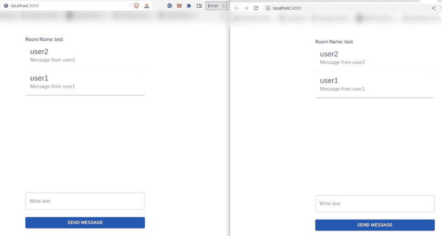

# 用 React 和 Django 通道构建聊天应用程序

> 原文：<https://blog.logrocket.com/build-chat-application-react-django-channels/>

使用 Django 为 HTTP 连接和应用程序请求开发服务器是很常见的。然而，当开发一个应用程序时，需要一直打开连接进行双向连接，比如会议和聊天程序，使用 HTTP 连接是低效的。在这种情况下，使用 WebSockets 至关重要。

通过使用 WebSockets，连接到开放网络的所有用户都可以实时接收相关数据，这提供了一种在客户机和服务器之间建立双向连接的方式。这是一个有状态的协议，这意味着在初始连接身份验证之后，将保存客户端凭据，并且在连接被破坏之前不需要进一步的身份验证。

在本教程中，我们将学习如何使用 Django 和 React 构建一个聊天应用程序。学完本教程后，你应该更熟悉 WebSockets 在 Django 和 React 中的工作方式。要阅读本文，您需要:

你可以在 [GitHub](https://github.com/khabdrick/django-channels-react) 上找到完整的应用。我们开始吧！

## 目录

## WebSocket 功能

WebSocket 是一种双向协议，这意味着数据可以在客户端和服务器之间即时交换，不会中断。出于同样的原因，WebSockets 也被视为全双工通信。

WebSockets 不需要任何特定的浏览器来工作；所有浏览器都兼容。WebSocket 是一个带状态的协议。由于在主要连接验证之后保存客户端凭证，因此在连接丢失之前不需要再次进行额外的身份验证。

## 如何在 Django 中使用 WebSockets

当你想用 WebSockets 做任何事情时， [Django Channels](https://channels.readthedocs.io/en/stable/) 是必不可少的，所以用下面的命令安装它:

```
pip install channels

```

在这一节中，我们将设置 Django 来使用 WebSockets，将其与构建普通的 Django 应用程序进行比较。

感谢 Django 通道，在 Django 中使用 WebSockets 非常简单。您可以使用 Django 通道构建一个 [ASGI](https://asgi.readthedocs.io/en/latest/) (异步服务器网关接口)服务器，之后您可以构建一个群组，其中的成员可以即时相互发送文本。通信不是与特定的用户，而是与一个组，任何数量的用户都可以加入。

创建一个包含项目所有代码的文件夹。导航到您刚刚在终端上创建的文件夹，并运行`startproject`命令来创建一个新的 Django 项目:

```
$ django-admin startproject chat .

```

现在，运行`$ python3 manage.py startapp app`创建一个新的应用程序。

您需要让您的 Django 项目知道已经添加了一个新的应用程序，并且安装了 Channels 插件。你可以通过更新`chat/settings.py`文件并将`'app'`添加到`INSTALLED_APPS`列表中来实现。它将类似于下面的代码:

```
# project/settings.py
INSTALLED_APPS = [
   ...
   'channels',
   'app',
]

```

在`settings.py`文件中，您应该设置配置以允许 Django 和 Django 通道通过消息代理相互连接。为此，我们可以利用 Redis 这样的工具，但是在本例中，我们将坚持使用本地后端。将下面一行代码添加到您的`settings.py`文件中:

```
ASGI_APPLICATION = "chat.routing.application" #routing.py will handle the ASGI
CHANNEL_LAYERS = {
    'default': {
        'BACKEND': "channels.layers.InMemoryChannelLayer"
        }
    }

```

在上面的代码中，需要使用`ASGI_APPLICATION`来运行 ASGI 服务器，并告诉 Django 当事件发生时该做什么。我们将把这个配置放在一个名为`routing.py`的文件中。路由 Django 通道类似于 Django URL 配置；当 WebSocket 请求被发送到服务器时，它选择运行什么代码。

在创建路由之前，我们将首先开发[消费者](https://channels.readthedocs.io/en/stable/topics/consumers.html#consumers)。在 Django 通道中，消费者使您能够在代码中创建函数集，每当事件发生时都会调用这些函数。他们类似于 Django 里的`views`。

要开发消费者，打开`app/`文件夹，创建一个名为`consumers.py`的新文件，并粘贴以下代码:

```
# app/consumers.py
import json
from asgiref.sync import async_to_sync
from channels.generic.websocket import WebsocketConsumer

class TextRoomConsumer(WebsocketConsumer):
    def connect(self):

        self.room_name = self.scope\['url_route'\]['kwargs']['room_name']
        self.room_group_name = 'chat_%s' % self.room_name
        # Join room group
        async_to_sync(self.channel_layer.group_add)(
            self.room_group_name,
            self.channel_name
        )
        self.accept()
    def disconnect(self, close_code):
        # Leave room group
        async_to_sync(self.channel_layer.group_discard)(
            self.room_group_name,
            self.channel_name
        )

    def receive(self, text_data):
        # Receive message from WebSocket
        text_data_json = json.loads(text_data)
        text = text_data_json['text']
        sender = text_data_json['sender']
        # Send message to room group
        async_to_sync(self.channel_layer.group_send)(
            self.room_group_name,
            {
                'type': 'chat_message',
                'message': text,
                'sender': sender
            }
        )

    def chat_message(self, event):
        # Receive message from room group
        text = event['message']
        sender = event['sender']
        # Send message to WebSocket
        self.send(text_data=json.dumps({
            'text': text,
            'sender': sender
        }))

```

现在，我们可以创建处理您刚刚创建的消费者的路由。创建一个名为`routing.py`的新文件，并粘贴下面的代码，这将编排消费者:

```
from channels.routing import ProtocolTypeRouter, URLRouter
# import app.routing
from django.urls import re_path
from app.consumers import TextRoomConsumer
websocket_urlpatterns = [
    re_path(r'^ws/(?P<room_name>[^/]+)/$', TextRoomConsumer.as_asgi()),
]
# the websocket will open at 127.0.0.1:8000/ws/<room_name>
application = ProtocolTypeRouter({
    'websocket':
        URLRouter(
            websocket_urlpatterns
        )
    ,
})

```

## 构建前端

现在，让我们构建一个聊天应用程序的前端，它使用 WebSockets 连接到 Django 后端。我们将用 React 构建这一部分，并用 MUI 添加样式。

在您的终端中，导航到项目的根目录并运行以下命令来获取 React 的 Create React App 样板代码:

```
npx create-react-app frontend

```

接下来，`cd`进入`frontend/`目录并运行以下命令来安装 MUI 和 [WebSocket](https://www.npmjs.com/package/websocket) 依赖项，这允许我们将 React 应用程序连接到 WebSocket 服务器:

```
npm install --save --legacy-peer-deps @material-ui/core
npm install websocket

```

删除`frontend/src/App.js`中的所有代码。我们将用本教程剩余部分中的代码替换它，从初始状态开始:

```
import React, { Component } from 'react';
import { w3cwebsocket as W3CWebSocket } from "websocket";

class App extends Component {
  state = {
    filledForm: false,
    messages: [],
    value: '',
    name: '',
    room: 'test',
  }
  client = new W3CWebSocket('ws://127.0.0.1:8000/ws/' + this.state.room + '/'); //gets room_name from the state and connects to the backend server 
  render(){
    }

}

```

现在，我们需要处理当组件安装到浏览器上时会发生什么。我们希望应用程序连接到后端服务器，并在组件挂载时获取消息，所以我们将使用`componentDidMount()`。您可以通过在`render()`函数之前粘贴以下代码来实现这一点:

```
...
componentDidMount() {
    this.client.onopen = () => {
      console.log("WebSocket Client Connected");
    };
    this.client.onmessage = (message) => {
      const dataFromServer = JSON.parse(message.data);
      if (dataFromServer) {
        this.setState((state) => ({
          messages: [
            ...state.messages,
            {
              msg: dataFromServer.text,
              name: dataFromServer.sender,
            },
          ],
        }));
      }
    };
  }
render() {
...

```

接下来，我们将创建用于更新状态的表单。我们将创建一个表单来更新发送者的`name` 和房间名称。然后，我们将创建另一个表单来处理表单提交。将下面的代码粘贴到`render()`函数中:

```
render() {
    const { classes } = this.props;
    return (
      <Container component="main" maxWidth="xs">
        {this.state.filledForm ? (
          <div style={{ marginTop: 50 }}>
            Room Name: {this.state.room}
            <Paper
              style={{height: 500, maxHeight: 500, overflow: "auto", boxShadow: "none", }}
            >
              {this.state.messages.map((message) => (
                <>
                  <Card className={classes.root}>
                    <CardHeader title={message.name} subheader={message.msg} />
                  </Card>
                </>
              ))}
            </Paper>
            <form
              className={classes.form}
              noValidate
              onSubmit={this.onButtonClicked}
            >
              <TextField id="outlined-helperText" label="Write text" defaultValue="Default Value"
                variant="outlined"
                value={this.state.value}
                fullWidth
                onChange={(e) => {
                  this.setState({ value: e.target.value });
                  this.value = this.state.value;
                }}
              />
              <Button type="submit" fullWidth variant="contained" color="primary"
                className={classes.submit}
              >
                Send Message
              </Button>
            </form>
          </div>
        ) : (
          <div>
            <CssBaseline />
            <div className={classes.paper}>
              <form
                className={classes.form}
                noValidate
                onSubmit={(value) => this.setState({ filledForm: true })}
              >
                <TextField variant="outlined" margin="normal" required fullWidth label="Room name"
                  name="Room name"
                  autoFocus
                  value={this.state.room}
                  onChange={(e) => {
                    this.setState({ room: e.target.value });
                    this.value = this.state.room;
                  }}
                />
                <TextField variant="outlined" margin="normal" required fullWidth name="sender" label="sender"
                  type="sender"
                  id="sender"
                  value={this.state.name}
                  onChange={(e) => {
                    this.setState({ name: e.target.value });
                    this.value = this.state.name;
                  }}
                />
                <Button type="submit" fullWidth variant="contained" color="primary"
                  className={classes.submit}
                >
                  Submit
                </Button>
              </form>
            </div>
          </div>
        )}
      </Container>
    );
  }

export default withStyles(useStyles)(App);
```

当您填写房间名称和发送者姓名时，状态中的`filledForm`会变为`true`，然后会呈现输入消息的表单。在我们的代码中，我们使用了一些需要导入的 MUI 类。你可以将下面的代码粘贴到你的`App.js`文件的顶部:

```
import Button from "@material-ui/core/Button";
import CssBaseline from "@material-ui/core/CssBaseline";
import TextField from "@material-ui/core/TextField";
import Container from "@material-ui/core/Container";
import Card from "@material-ui/core/Card";
import CardHeader from "@material-ui/core/CardHeader";
import Paper from "@material-ui/core/Paper";
import { withStyles } from "@material-ui/core/styles";
const useStyles = (theme) => ({
  submit: {
    margin: theme.spacing(3, 0, 2),
  },
});

```

一旦消息表单被提交，当点击提交按钮时，我们将把文本发送到后端服务器。将下面的代码粘贴到`componentDidMount()`函数的正上方:

```
  onButtonClicked = (e) => {
    this.client.send(
      JSON.stringify({
        type: "message",
        text: this.state.value,
        sender: this.state.name,
      })
    );
    this.state.value = "";
    e.preventDefault();
  };
  componentDidMount() { 
...

```

## 测试应用程序

既然我们已经完成了应用程序的编码，我们就可以测试它了。首先，通过运行以下命令启动后端服务器。确保您位于`manage.py`文件所在的目录中:

```
python manage.py runserver

```

在另一个终端窗口上，导航到`frontend/`目录，通过运行下面的命令运行前端服务器。React 应用程序将自动打开:

```
npm start

```

填写姓名和房间名称。然后，在另一个名称不同但房间名称相同的浏览器中打开该应用程序。现在，您可以开始与自己聊天，您会注意到消息是实时收到的:



## 结论

在本文中，我们已经了解了 WebSockets 及其应用，以及如何通过利用 Django 通道在 Django 中使用它。最后，我们介绍了如何使用 React 建立到 Django 服务器的 WebSocket 连接。

尽管我们构建了一个高效的实时聊天应用程序，但您仍然可以进行改进。例如，为了存储消息，可以包含一个数据库连接。作为本地后端的替代，您可以考虑使用 Redis 作为消息代理。

我希望你喜欢这篇文章，如果你有任何问题，一定要留下评论。编码快乐！

## [LogRocket](https://lp.logrocket.com/blg/react-signup-general) :全面了解您的生产 React 应用

调试 React 应用程序可能很困难，尤其是当用户遇到难以重现的问题时。如果您对监视和跟踪 Redux 状态、自动显示 JavaScript 错误以及跟踪缓慢的网络请求和组件加载时间感兴趣，

[try LogRocket](https://lp.logrocket.com/blg/react-signup-general)

.

[ ](https://lp.logrocket.com/blg/react-signup-general) [](https://lp.logrocket.com/blg/react-signup-general) 

LogRocket 结合了会话回放、产品分析和错误跟踪，使软件团队能够创建理想的 web 和移动产品体验。这对你来说意味着什么？

LogRocket 不是猜测错误发生的原因，也不是要求用户提供截图和日志转储，而是让您回放问题，就像它们发生在您自己的浏览器中一样，以快速了解哪里出错了。

不再有嘈杂的警报。智能错误跟踪允许您对问题进行分类，然后从中学习。获得有影响的用户问题的通知，而不是误报。警报越少，有用的信号越多。

LogRocket Redux 中间件包为您的用户会话增加了一层额外的可见性。LogRocket 记录 Redux 存储中的所有操作和状态。

现代化您调试 React 应用的方式— [开始免费监控](https://lp.logrocket.com/blg/react-signup-general)。