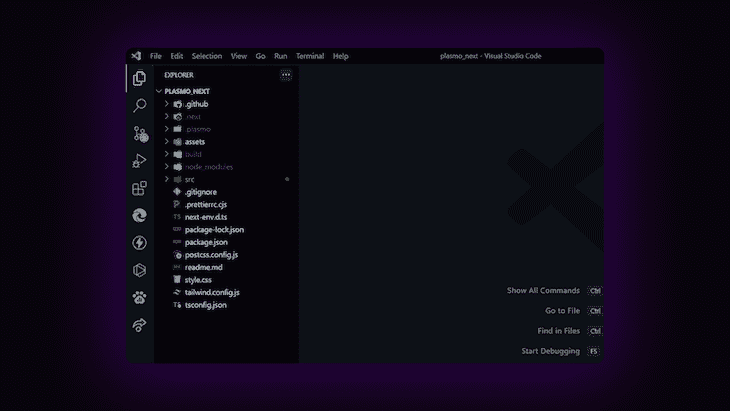
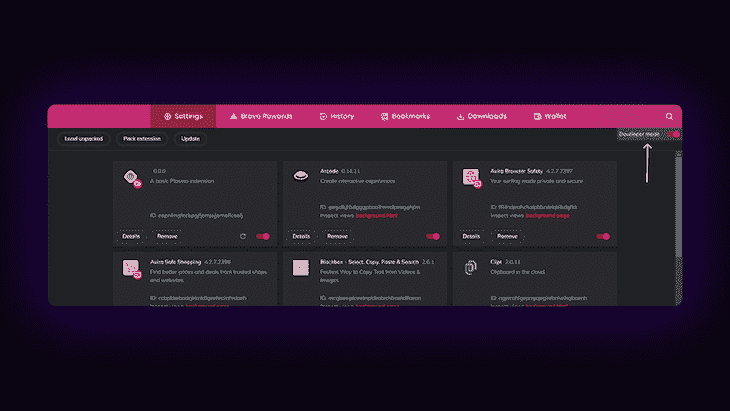
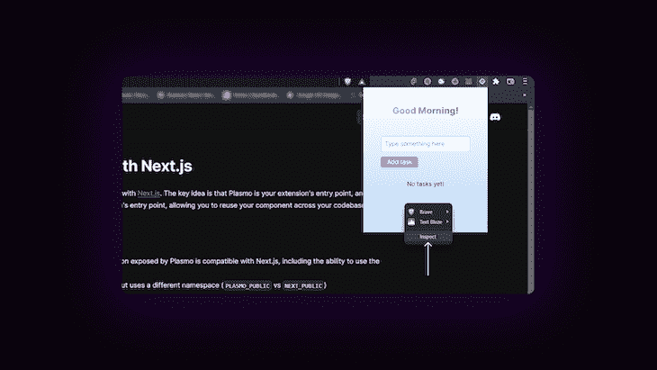
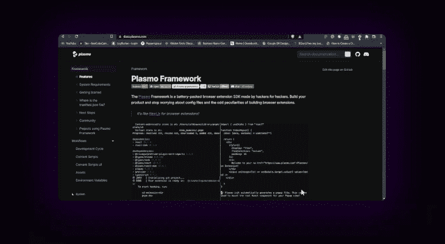

# 用 React 在 Plasmo 中构建一个 chrome 扩展

> 原文：<https://blog.logrocket.com/build-chrome-extension-plasmo-react/>

Chrome 扩展包含了一些非常方便的特性，可以让你的工作变得更加简单。等离子体，一个相对较新的框架，有助于使用 [React](https://blog.logrocket.com/tag/react/) 轻松构建 chrome 扩展！

是的，这意味着你可以使用 React 的基于组件的开发来高效快速地构建 Chrome 扩展！听起来不错，对吧？

在本文中，我们将了解如何使用 Plasmo 通过 React 构建 Chrome 扩展。

以下是我们将要介绍的内容:

1.  [初始化新的等离子体项目](#initialize-new-plasmo-project)
2.  [设置顺风 CSS](#setting-up-tailwind-css)
3.  [构建前端](#building-out-frontend)
4.  [编写逻辑](#writing-logic)
5.  [添加本地存储支持](#adding-local-storage-support)

如需跟进，请参考[本报告](https://github.com/GeoBrodas/plasmo-next)，并访问[等离子体文档](https://docs.plasmo.com/)以获取更多集成指南。

## 初始化新的等离子体项目

旋转终端，移至项目文件夹，通过执行以下操作初始化新的等离子体项目:

```
npm x plasmo init

```

或者使用 [this repo](https://github.com/PlasmoHQ/examples/tree/main/with-nextjs) 简单地用 Next.js 设置 Plasmo。

我是 Next.js 的超级粉丝，因此我将在本教程中使用它。继续安装以下依赖项:

```
npm install [email protected]

```

现在，您将拥有与下图类似的设置:



使用等离子体时要记住的一些事情:

*   你正在构建一个 Chrome 扩展，而不是一个网页。静态网站再生是出了方程，在这里
*   一切都是在客户端获取的。
*   所有基本的 React 功能都应该像预期的那样工作
*   等离子体仍处于发展阶段，因此，可能会有一些小错误
*   Next.js 路由在 Plasmo 中不起作用。(事实上，这是不必要的，因为 Next.js 中的 routing 以静态呈现页面的方式著称)
*   您的源代码驻留在`src`目录中

接下来，让我们在项目中设置 Tailwind CSS。

## 设置顺风-CSS

安装顺风 CSS 所需的下列开发依赖项:

```
npm install autoprefixer postcss tailwindcss --save-dev

```

接下来，运行`init`命令来生成`tailwind.config.js`和`postcss.config.js`文件。

```
npx tailwindcss init -p

```

在`tailwind.config.js`文件中，将以下路径添加到`content`属性中:

```
module.exports = {
  content: ["./**/*.{ts,tsx}"],
  theme: {
    extend: {}
  },
  plugins: []
}

```

然后，创建一个新的`styles.css`文件，并向其中添加`@tailwind`指令。

```
@tailwind base;
@tailwind components;
@tailwind utilities;

```

完成后，将`import`添加到这个文件的`./src/components/main.tsx`文件中。

```
import "../../style.css"

export function Main ({ name = "Extension" }) {...
}

```

(注意:如果你遇到了困难，你可以点击这里阅读 Next.js 的 Tailwind CSS 集成指南)

## 构建前端

在 Tailwind CSS 的帮助下，让我们构建 Chrome 扩展的前端。

让我们首先为 Chrome 扩展做一个布局，它将围绕`Main`组件。

在`./src/components/layouts/Container.tsx`中创建一个新文件:

```
function Container ({ children }) {
  return (
    <div>{chidlren}</div>
  );
}

export default Container;

```

让我们在用户旋转分机时问候他们:

```
function greeting() {
  const time = new Date().getHours()
  if (time < 12) {
    return "Good Morning!"
  }
  if (time < 18) {
    return "Good Afternoon!"
  }
  return "Good Evening!"
}

```

如下所示，将其添加到`Container`组件中…

```
return (
  <div>
    <div>
      <p>{greeting()}</p>
    </div>
    {children}
  </div>
)

```

…和一小撮 CSS✨

```
return (
  <div
    style={{
      padding: "40px 20px",
      // add gradient
      background: "linear-gradient(to top, #BADBFB , #FFFFFF )"
    }}
  >
    // body
  </div>
);

```

现在，把这个`Container`包裹在`main.tsx`上。

完成这些后，现在让我们为 Plasmo 设置开发环境，这样您就可以实时看到您的更改，就像您在开发过程中如何对网站进行更改一样。

首先，前往`chrome://extensions`并切换到开发者模式。



(注意:我在这里使用的是勇敢的浏览器，它使用的是 Chromium 网络浏览器，所以正常的 Chrome 浏览器的过程也是一样的。

点击 Load unpacked 并转到您的项目目录，然后选择`build/chrome-mv3-dev`文件夹。要查看扩展，点击你的扩展部分附近的拼图标志，并选择等离子体项目。

(注意:如果你卡住了，查看等离子体文件[这里](https://docs.plasmo.com/#loading-the-extension-in-chrome)

您的扩展现在应该看起来像这样:


完成后，让我们设置输入任务和显示任务的部分。在`main.tsx`中，让我们添加一个用于输入任务的`input`字段和一个用于添加任务的按钮。

首先，添加两个状态—一个用于从文本框中捕获输入，另一个用于跟踪任务。

```
import { useState } from "react";

export function Main ( ) {
  const [data, setData] = useState("");

  const [tasks, setTasks] = useState([]);

  return (
    <Container>
      {...stuff}
    </Container>
  )
}

```

现在，在`Container`中，添加以下内容:

```
return (
  <Container>
    <div>
      <input 
        className="rounded-md my-3 p-2 border-2 border-gray-300" 
        onChange={(e) => setData(e.target.value)} 
        value={data} 
        placeholder="Add new task" 
      />
    </div>
  <Container/>
);

```

如果您现在登录`data`到控制台，您应该能够看到输入数据。

要在 Chrome DevTools 上检查应用程序，右键单击所需的扩展:



完成后，让我们添加一个按钮来保存当前任务的状态。

```
<button type="submit" onClick={submitHandler} className="button-blue">
  Add task
</button>

```

为`onClick`事件创建一个新函数:

```
function submitHandler () {
  // ...stuff
  console.log(data);
}

```

现在，我们将简单地将数据的当前值记录到控制台上。

接下来，让我们构建组件来显示任务。制作一个名为`Tasks.tsx`的新组件。作为道具，传递`data`和`setData`——这在显示任务和移除任务时会很有用。

在`Tasks.tsx`中，现在，让我们只显示一个随机的任务列表。

```
{data?.length !== 0 ? (
  data?.map((task, index) => (
    <div
      className={...styles}
      key={index}
    >
      <p>{task}</p>

      <button
        aria-label="Remove task"
        type="button"
        <TrashIcon className="w-10 h-10 pr-1" />
      </button>
    </div>
  ))
  ) : (
  <p className="mx-auto w-fit my-8">No tasks yet!</p>
)}

```

(注:要了解风格，请访问 GitHub 的[回购。这里使用的图标来自`react-icons`](https://github.com/GeoBrodas/plasmo-next)

您可以为任务添加一些虚拟数据，并查看组件是否按预期工作。

## 编写逻辑

现在，让我们添加添加和删除任务的基本功能。

首先，让我们研究一下我们之前在按钮上定义的`submitHandler`。每当用户添加任务时，我们希望保留之前的任务，并清除输入字段。

```
async function submitHandler() {
  setTasks([...tasks, data]);
  setData("");
}

```

现在，在`Tasks.tsx`中，我们已经传递了两个道具(即`data`和`setTasks`函数)。现在，每当您添加任何新任务时，都应该显示这些任务。



剩下的是`removeTask`函数，它被绑定到每个任务中的垃圾桶图标。

在`removeTask`功能内:

```
function removeTask () {
  setTasks(
    data.filter(
      (task: string, i: number) => i !== index
    )
  );
}

```

这段代码主要做的是过滤包含任务的`data`数组，只返回与要删除的任务的索引不匹配的任务；然后使用`setTasks`功能设置电流`tasks`。

## 添加本地存储支持

到目前为止，我们能够输入新任务并查看它们，但是如果您关闭扩展或者热重新加载开发服务器，任务就会消失。最好的解决方案是在扩展中添加本地存储支持。

等离子体为此提供了一个内置的解决方案，称为`@plasmohq/storage`。使用以下内容安装它:

```
npm install @plasmohq/storage

```

如果有任务的话，我们会从`localStorage`那里取任务。

```
import { Storage } from "@plasmohq/storage";
import { useEffect } from "react";

const storage = new Storage();

export function Main () {
  // ...code

  useEffect(() => {
     // fetch tasks from the local storage
      storage.get("tasks").then(
        (tasks) => setTasks(tasks || []),
        // if there are no tasks, set an empty array
        // this usually gets triggered if the method fails or returns an error
        () => setTasks([])
      )},
    // run once on mount
    []
  );
}

```

在`useEffect`中，我们使用`storage.get()`方法检查任何保存的字段，字段为`tasks`。如果`tasks`出现，我们设置`tasks`状态。如果承诺被拒绝，我们甚至可以在这里触发另一个回调，从而将`tasks`数组设置为空。

完成后，现在我们将在用户单击提交按钮时向本地存储添加一个任务。

`submitHanlder`里面:

```
async function submitHanlder () {
  setTasks([...tasks, data]);
  setData("");

  // save to local storage
  await storage.set("tasks", [...tasks, data]);
}

```

这里，使用`storage.set()`方法，当前的任务列表被输入到键`tasks`下的`localStorage`中。

完成后，扩展现在应该能够持久化任务，即使扩展在开发期间热重新加载，或者扩展被关闭并重新打开。

同样，我们可以使用`storage.set()`方法来删除特定的任务。

在`removeTask()`功能中，进行以下更改:

```
function removeTask(index: number) {
  setTasks(data.filter((task: string, i: number) => i !== index));

  // remove from local storage
  storage.set(
    "tasks",
    data.filter((task: string, i: number) => i !== index)
  )
} 
```

当从`localStorage`中删除特定任务时，应用我们之前使用的相同逻辑。

(注:要了解更多关于`@plasmohq/storage`的信息，请访问[等离子体文档](https://docs.plasmo.com/framework-api/storage))

最后，我们使用 React 和 Plasmo 成功构建了一个扩展，可以跟踪您的任务。您可以添加更多自己的新功能，并尝试在 Chrome 商店发布一个！

## 结论

Plasmo 是一个构建扩展的好框架；尤其是如果您刚刚开始使用 React，并且有一些使用 React 的经验。

我在本文中链接的文档是初学者友好的，包含了开始使用 Plasmo 所需的几乎所有东西。

Plasmo 仍在积极开发中，因此请注意，您可能会遇到 bug 和其他问题。如果你被困在任何地方，或者对即将到来的版本有任何建议，请确保加入 Plasmo 的官方 [Discord](https://www.plasmo.com/s/d) 服务器，当然也可以在下面的评论区留下你的想法。

## 使用 LogRocket 消除传统反应错误报告的噪音

[LogRocket](https://lp.logrocket.com/blg/react-signup-issue-free)

是一款 React analytics 解决方案，可保护您免受数百个误报错误警报的影响，只针对少数真正重要的项目。LogRocket 告诉您 React 应用程序中实际影响用户的最具影响力的 bug 和 UX 问题。

[ ](https://lp.logrocket.com/blg/react-signup-general) [  ](https://lp.logrocket.com/blg/react-signup-general) [LogRocket](https://lp.logrocket.com/blg/react-signup-issue-free)

自动聚合客户端错误、反应错误边界、还原状态、缓慢的组件加载时间、JS 异常、前端性能指标和用户交互。然后，LogRocket 使用机器学习来通知您影响大多数用户的最具影响力的问题，并提供您修复它所需的上下文。

关注重要的 React bug—[今天就试试 LogRocket】。](https://lp.logrocket.com/blg/react-signup-issue-free)