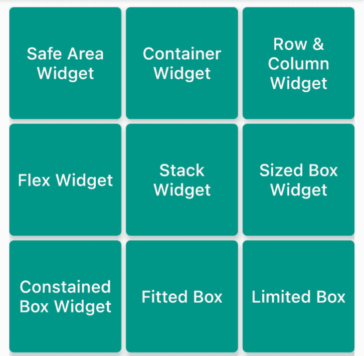
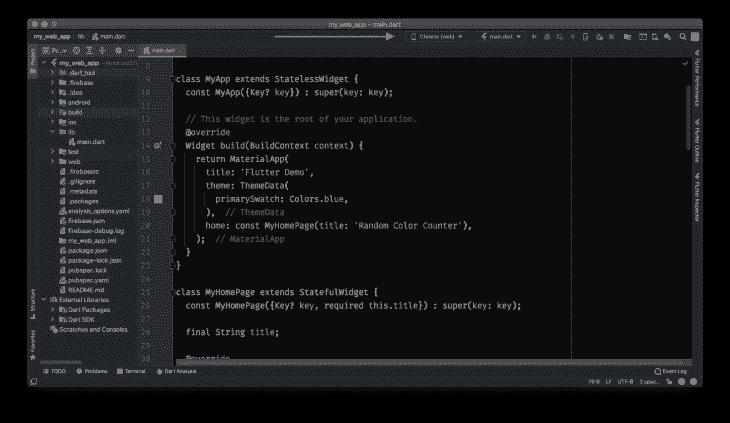
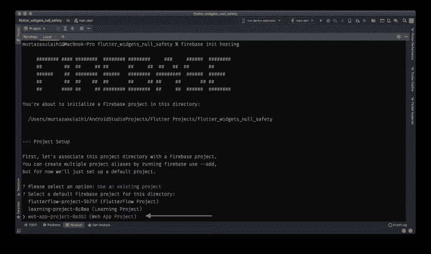
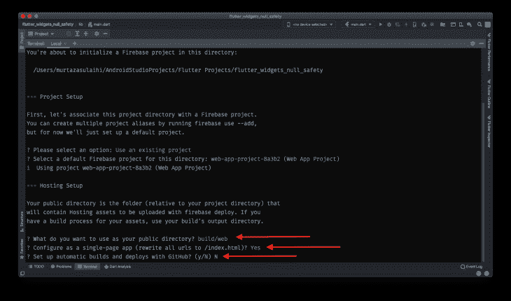
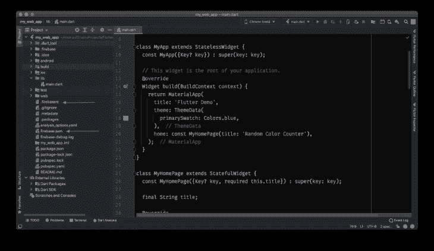
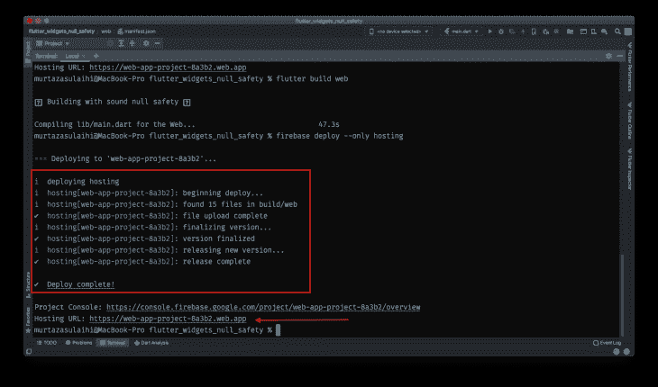

# 用 Flutter 构建一个跨平台的 web 应用

> 原文：<https://blog.logrocket.com/build-cross-platform-web-app-flutter/>

一个奇妙的想法突然出现在你的脑海里。您已经完成了文书工作，编写了关于您想要构建的应用程序的详细信息。现在，您正在寻找一种经济高效且省时的解决方案来开发您的应用程序。你是做什么的？

在这个不断变化的技术世界中，移动应用程序已经从一个简化生活的工具发展成为一个关键的业务必需品和增长因素。以前，我们依靠原生技术来开发移动应用和网站，但现在我们在市场上有了更多的选择。

因此，在过去十年中，出现了许多跨平台框架。在 2015 年推出 React Native 之前，Xarmin 和 Ionic 等框架一直很受欢迎，React Native 通过提交构建跨平台应用程序的新工具改变了游戏规则。

2018 年 12 月，谷歌推出了 Flutter，它席卷了所有人。它受到了全世界程序员和开发人员的热烈欢迎。人们马上开始适应这项新技术。因此，市场上有超过 375，000 个基于 Flutter 的应用程序。为什么？我有三个词:快速、高效和灵活。

## 是什么让 Flutter 成为构建跨平台应用的理想框架？

### 框架和语言


Flutter 是框架，Dart 是它背后的编程语言，这使它有别于其他跨平台应用程序开发工具。像 React Native 这样的平台使用一个桥来与本机环境通信，这最终会影响应用程序的速度和性能。

### 热重装

然而，Dart 在内部处理渲染和动画，这大大提高了产品的速度和质量。它还使用 Skia 引擎进行渲染，在没有任何附加软件的情况下编译代码。这给了 Flutter 最受关注的特性:热重装。这个特殊的特性可以帮助任何程序员快速、轻松地构建 UI、进行更改、试验、添加特性，甚至在旅途中修复 bug。

### 小部件，小部件，小部件…

Flutter 还使用 Skia 引擎实时渲染图形，使 UI 和动画流畅无延迟。



Flutter UI 是围绕其高度灵活和可伸缩的部件库构建的。它的灵感来自 React。此外，它遵循谷歌的材料设计，使任何应用程序都具有吸引力和美感，创造了神话般的用户体验。

### 适应性

应用程序开发有许多不同的 ide。最受欢迎的编辑器是 Visual Studio Code 和 Android Studio。根据程序员的喜好，Flutter 为两种 ide 都提供了插件和扩展。

### 颤动无所不在

不言而喻，我们用例最重要的特性是它的多平台支持和单一代码库。因此，Flutter 为不同的平台提供了最先进的解决方案，比如移动平台、网络平台，很快还将为 Windows 和 macOS 平台提供解决方案。开发人员可以将相同的代码部署到所有上述平台，而无需进行重大更改，最终在所有平台上提供类似本机的体验。


Image from [pngegg](https://www.pngegg.com/en/png-ymzir/download).

### 节省时间和成本

由于上述特征，初创公司和小企业可以开发一个[最小可行产品(MVP)](https://blog.logrocket.com/product-management/what-is-minimum-viable-product-mvp-how-to-define/) ，该产品的初始版本包含足够的组件来测试市场并从客户那里获得实时反馈。也为创业公司和企业节省了时间和开发成本。

## 为所有人构建:在 Flutter 中创建跨平台的 web 应用程序

因此，让我们更进一步，一步一步地把你的 Flutter 应用程序部署到 web 上，并把它转换成 PWA(渐进式 web 应用程序),向世界展示你的创造。

跨平台 web 应用程序或 PWA 的优势在于它不需要特定于平台。通过输入网站 URL，可以在所有可能的平台上访问它。

此外，它将根据访问它的设备进行扩展。但是作为开发人员，在构建这样的应用程序时，您需要非常小心。UI 需要根据不同的平台进行缩放；否则，您将面临不一致和性能故障，最终导致糟糕的用户体验。

### 开始之前

我建议当您开始一个新项目并计划将它部署到 web 时，在项目开始时就遵循该指南。然后，将它部署到您首选的托管服务中，因为随着项目复杂性的增加，事情会变得更加复杂。虽然 web 上的 Flutter 现在更加稳定，但它仍然存在渲染挑战。

此外，随着项目规模的增加，加载变得越来越慢，某些包仍然不支持 web 上的 Flutter。记住所有这些，当试图构建一些东西并遵循指南时，它会变得更加复杂和不愉快，但是它仍然不能正常工作。

这里假设您已经知道如何开发 Flutter 应用程序，并且您的计算机上已经安装了 IDE 和 Flutter。

否则，请参考本[指南](https://docs.flutter.dev/get-started/install)。

### 构建`main.dart`

从设备下拉列表中选择 Chrome 并构建您的`main.dart`文件。您将看到 Chrome 浏览器打开，计数器应用程序已经加载。这一步就像为 iOS 或 Android 构建应用程序一样简单。默认情况下，Flutter 会创建一个类似于 iOS 和 Android 的 web 文件夹。



我使用 Firebase 托管作为我的托管服务，因为它快速、可靠、安全地托管您的单页网站、简单的登录页面或复杂的 PWA。它受到专业开发人员的强烈推荐，并且也有很好的文档记录。

### 创建一个 Firebase 项目

下一件事是创建一个 Firebase 项目。如果您已经创建了一个项目，请跳过这一步，或者您也可以浏览本[指南，了解如何创建 Firebase 项目](https://firebase.google.com/docs/flutter/setup?platform=ios)。

### 安装 Firebase CLI 命令

安装 Firebase CLI 命令，俗称 Firebase 工具。有两种方法可以做到这一点:

*   如果您是新开发人员，不熟悉 Node.js，可以安装独立的二进制 CLI 并运行 Firebase 命令
*   使用 npm(节点程序包管理器)安装 Firebase CLI

根据您的操作系统，任何人都可以在本指南的帮助下安装 Firebase CLI。无论您如何安装 Firebase CLI，您都可以使用 Firebase 命令的相同功能。

### 验证您的 Firebase 帐户

安装 Firebase CLI 命令后，您必须通过登录您的 Firebase 帐户进行身份验证。打开终端并运行以下命令:

```
$ firebase login
```

将打开一个网页，您需要在其中选择您的 Google 帐户或输入您的 Google 帐户凭据。登录后，您将在终端上看到一条成功消息。

您可能有多个 Google 帐户，所以请检查 Firebase 帐户中的项目列表，以测试您是否登录了正确的帐户。

运行这个命令来列出 [Firebase 项目](https://blog.logrocket.com/add-firebase-to-your-flutter-app-with-flutterfire-plugins/):

```
$ firebase projects:list
```

如果您没有看到新创建的项目，您可能已经登录到不同的帐户。

要注销，请运行以下命令:

```
$ firebase logout
```

并重新运行登录命令。

### 初始化您的 Firebase 项目

下一步是通过从项目结构的根目录运行以下命令来初始化 Firebase 项目:

```
$ Firebase init
```

该命令允许您从 Firebase CLI 为您的项目设置所需的产品。但是由于我们目前只对将应用程序托管到 web 感兴趣，我们可以运行这个命令来代替上面的命令:

```
$ Firebase init hosting
```

通过使用箭头键，选择**使用现有项目**。

选择您为 web 应用程序创建的项目。



### 完成 Firebase 设置

接下来，Firebase CLI 将要求您输入公共目录的名称。输入`build/web`。

然后，它会问你要不要配置成单页 app？`Enter y`(表示是)。

最后，它会询问您是否也想配置 GitHub 集成，配置自动构建，并将其部署到 Firebase 主机。当然，你可以以后再做，但是现在，`enter N` (for no)。



就是这样！您已经成功地为 Firebase 托管服务配置了项目。

您将看到在您的项目中创建了两个文件，称为`firebase.json`和`.firebaserc`。重要提示:如果您在项目结构中看不到这些文件，那么 Firebase 没有得到适当的配置。您需要通过输入 Firebase `init`或 Firebase `init`托管命令来重新开始这个过程。



### 将文件添加到`build/web`

输入:

```
$ flutter build web
```

在终端窗口中，从项目结构的根目录开始。它会将所有必要的文件添加到根目录中的`build/web`。

### 上传所有文件到 Firebase 主机

最后，运行这个命令将所有文件上传到 Firebase Hosting，它将生成一个任何人都可以访问的 web URL:

```
$ Firebase deploy
```

[点击此链接，亲自尝试一下](https://web-app-project-8a3b2.firebaseapp.com)。



## 为跨平台 web 应用程序构建响应性 UI 的推荐 Flutter 包

```
responsive_framework: ^0.1.5
```

实现很简单，建议初学者使用，因为您必须通过包装`MaterialApp`小部件来实现一次，它可以适应不同的 UI 和屏幕大小。此外，它根据不同的断点调整大小或自动缩放。

如果你想对你的 UI 元素有更多的控制，下一个就是为你准备的:

```
flutter_screenutil: ^5.0.1
```

它是创建响应性 UI 的最流行的包之一。如果您想根据不同的屏幕大小缩放、调整或重新格式化 UI，这个包可以让您更好地控制每个小部件和字体大小。

## 有什么遗言吗？

Flutter 是一项相对较新的技术，但在过去几年中已经取得了巨大的成功。低学习曲线的多平台兼容框架使得 [Flutter](https://blog.logrocket.com/best-practices-laying-out-flutter-app/) 最适合跨平台应用开发。

如果你想要更快的 app 制作和更广泛的目标受众，Flutter 是正确的选择。它将有助于推出两个本地应用程序和一个 web 应用程序，并为用户提供卓越的体验。每个 Flutter 开发者都在不耐烦地等待谷歌发布其对 Windows 和 macOS 的兼容性。希望，很快！

我希望这篇文章已经让你对为什么应该考虑使用 Flutter 进行跨平台开发有了足够的了解。它将节省时间和生产成本，并把您的业务推向更高的高度。希望我能够清楚地解释如何将您的应用程序部署到 web 上。

发现需要实验，所以继续实验，你真的会发现 Flutter 的新东西。