# 使用 Google Sheets API 构建一个 CRUD API

> 原文：<https://blog.logrocket.com/build-crud-api-using-google-sheets-api/>

顾名思义，Google Sheets API 允许您连接现有的电子表格，解析其可用数据，并将其传递给 web 应用程序。最新的版本是 4.0，它为用户提供了对许多其他属性的控制，例如对单元格格式的完全访问，包括设置颜色、文本样式等。想象一下，有一个完全免费的数据库，有一个直观的用户界面，可以帮助您查看数据，并根据您的需要组织数据，同时充当 CMS。多酷啊。

事不宜迟，让我们直接使用 Google Sheets API 创建自己的 CRUD API。

以下是我们将在本文中涉及的内容:

1.  [在谷歌云控制台中建立新项目](#setting-up-new-project-google-cloud-console)
2.  [链接谷歌表单](#linking-google-sheet)
3.  [设置 CRUD API](#setting-up-crud-api)
4.  [提出你的第一个请求](#making-your-first-request)
5.  [实施 CRUD 操作](#implementing-crud-operation)

## 在 Google Cloud Console 中设置新项目

与访问任何 API 服务一样，我们必须首先设置身份验证和授权。如果你还没有注册账户，请前往 [Google Cloud](https://cloud.google.com) 并注册。然后，按照下面的步骤创建一个新项目。


点击**新建项目**，给它起一个合适的名字，然后点击**创建**。

接下来，点击导航菜单，进入**API****和** **服务**。

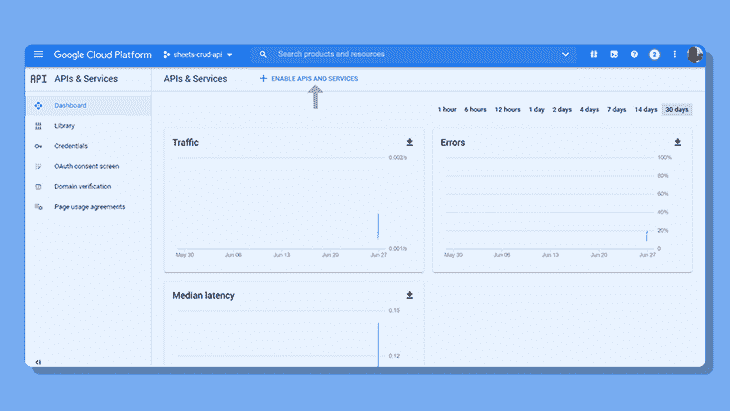

然后，您将被重定向到 API 库。搜索 Google Sheets API 并启用它。

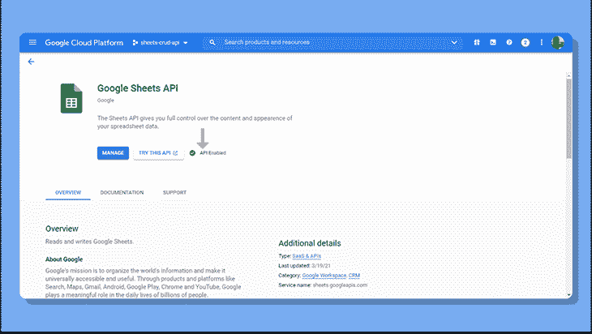

回到 API 和服务仪表板。转到**凭证**并创建一个新凭证。

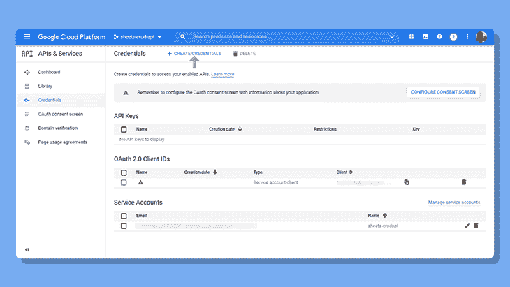

点击**服务账号**。给它起个名字，把剩下的设置成原样，然后点击**完成**。

现在，您已经为电子表格创建了一个 bot 帐户，该帐户拥有对工作表进行读写操作的权限。

复制我们创建的服务电子邮件。当我们将电子表格连接到谷歌云项目时，这将会派上用场。

点击服务账户邮箱，然后移至**键**。

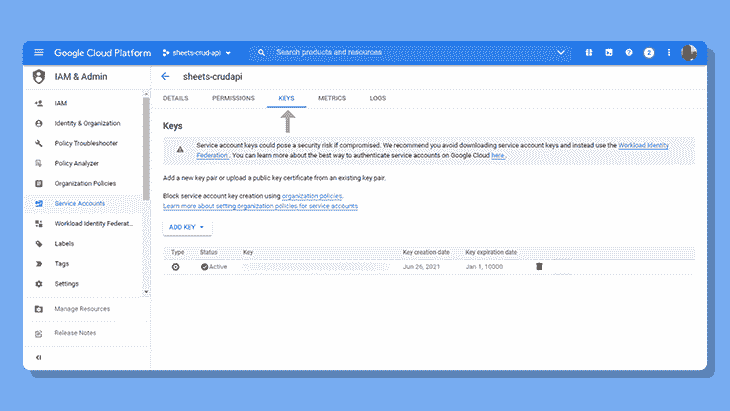

继续创建一个新的键，将文件类型设置为 JSON。一个文件将很快被下载，如果可能的话，您应该将它移动到您希望设置启动文件的文件夹中。

## 链接谷歌表单

现在，我们将电子表格连接到谷歌云项目。前往[谷歌文档](https://docs.google.com/spreadsheets)制作一个新的电子表格。命名电子表格。

输入一些虚拟数据，这样我们在测试 API 时就有东西可以取了。

现在，让我们添加服务帐户并为其分配编辑者角色，该角色赋予其读取、写入、更新和删除数据的权限。

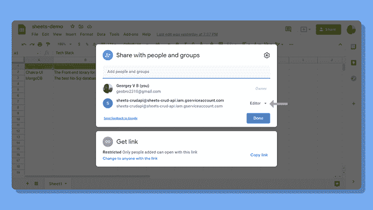

点击**分享**并添加我们最近复制的服务电子邮件，确保您给它编辑权限，并取消勾选**通知人。**

这就是你要做的！现在让我们转到代码编辑器，为 API 设置启动文件。

## 设置 CRUD API

我们将使用几个 API 包: [Express](https://expressjs.com/) 、 [dotEnv](https://www.npmjs.com/package/dotenv) 和 [googleapis](https://www.npmjs.com/package/googleapis) 。在下载之前，让我们使用以下命令初始化 npm:

```
npm init -y

```

现在安装软件包:

```
npm install express dotenv googleapis

```

将 nodemon 添加为 dev 依赖项(这将确保每当我们进行任何代码更改时，开发服务器都会重新启动):

```
npm install nodemon --save-dev

```

完成所有这些后，创建一个名为`index.js`的新文件。

通过要求`dotenv`开始，然后初始化`express`。

* * *

### 更多来自 LogRocket 的精彩文章:

* * *

```
require('dotenv').config();
const express = require('express');
const app = express();

app.listen(3000 || process.env.PORT, () => {
  console.log('Up and running!!');
});

```

在`package.json`文件中创建一个新脚本:

```
"dev": "nodemon index.js"

```

如果一切正常，nodemon 将在我们每次保存文件时重启服务器。

```
npm run dev

```

## 提出你的第一个请求

完成所有这些后，让我们看看我们的电子表格实际上是否与 Google Cloud 项目相关联。

从 googleapis 包中导入以下内容:

```
const { google } = require('googleapis');

```

创建获取路线:

```
app.get('/', async (req, res) => {
  res.send("Hello Google!");
});

```

接下来创建一个`auth`令牌，由一个指向我们下载的`credentials.json`文件的`keyFile`和一个提供读写操作的完全访问权限的`scopes`组成。

```
const auth = new google.auth.GoogleAuth({
  keyFile: 'credentials.json',
  scopes: 'https://www.googleapis.com/auth/spreadsheets'
});

```

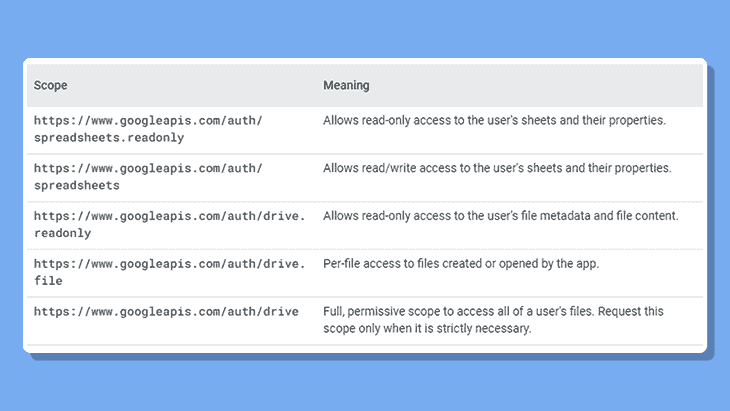

Source: [Google Sheets for Developers](https://developers.google.com/sheets/api/guides/authorizing).

你可以随时参考谷歌官方开发者文档来获得更多帮助。

接下来，定义`client`、API 的最新版本和`spreadsheetId`。

```
const client = await auth.getClient();
const googleSheet = google.sheets({ version: 'v4', auth: client });
const spreadsheetId = your_spreadsheetid

```

从 Google 电子表格的 URL 获取电子表格 ID，如下所示:

```
https://docs.google.com/spreadsheets/d/{_your_database_id_}/edit#gid=0

```

在上面的例子中，`gid`是工作表 ID。

您可能应该将这些敏感信息存储在环境文件中。创建一个`.env`文件并存储电子表格 ID，如下所示:

```
SPREADSHEET_ID=your_spreadsheet_id

```

最后，将它指向环境变量:

```
const spreadsheetId = process.env.SPREADSHEET_ID

```

做完这些，现在让我们最后提出一个请求！

```
const getMetaData = await googleSheet.spreadsheets.get({
  auth,
  spreadsheetId,
  range: 'Sheet1!A:B'
});

res.send(getMetaData);

```

确保你像上面那样命名变量，因为这也是写`auth: auth`的简写。

每个 API 调用接受两个参数，即`auth`和`spreadsheetId`。`range`定义了要编辑的单元格范围。如果您不确定这些值，您总是可以利用电子表格的界面。在下一节中，我们将使用来读取单元格的值。

现在，继续向`localhost:3000`上的根 URL 发出 GET 请求。如果您已经完成了所有的步骤，您将从 API 得到一个很长的响应。

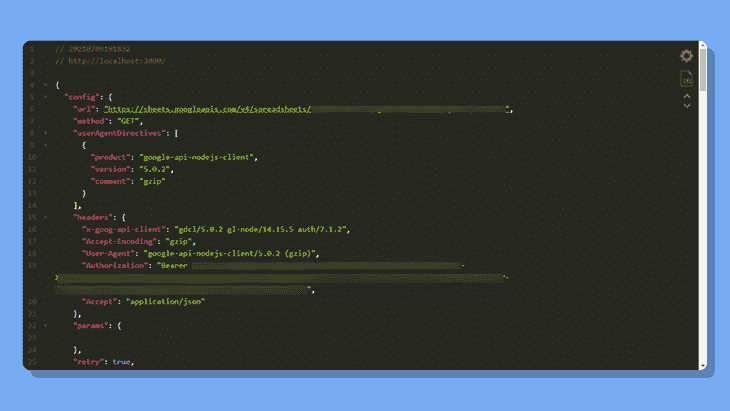

## 实现 CRUD 操作

### 1.读取单元格值

现在，注释掉前面的请求，让我们实际读取我们输入的单元格值。
为了读取单元格的值，我们将使用`spreadsheets.values.get`方法。

```
const getSheetData = await googleSheet.spreadsheets.values.get({
  auth,
  spreadsheetId,
  range: 'Sheet1!A:B'
});

res.send(getSheetData);

```

我之前说过，方法总是接受`auth`和`spreadsheetId`。`range`参数定义了要读写的单元格区域。在这种情况下，我们只对前两列 A 和 b 进行修改。

继续发出 GET 请求。

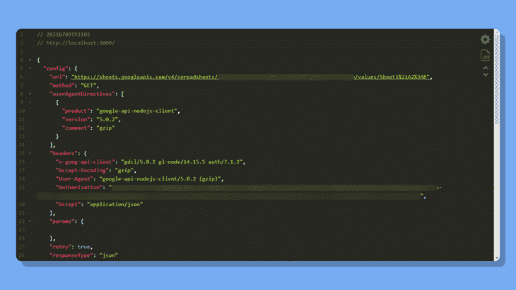

响应包含一系列信息，包括像元值、像元颜色、地理位置和时区。让我们以此处的单元格值为目标。

```
res.send(getSheetData.data.values);

```

回应现在看起来简洁多了。

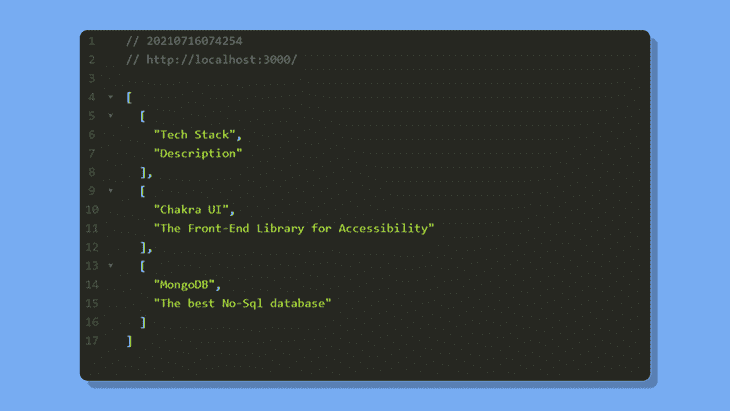

请注意，我们还会在这些结果中获得实际的列标题。您可能希望忽略这些，只发送回第一行下面的单元格值。

下面是我们改变`range`的方法。选择您要在回复中包含的区域。所选区域由一个范围表示。在我们的例子中，是从 A 列到 b 列。

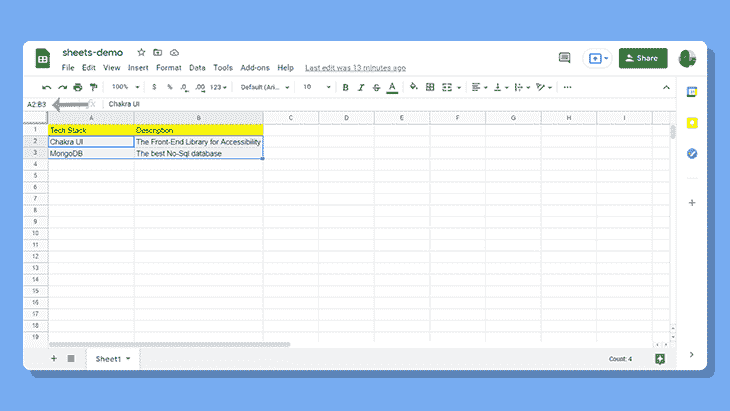

因为我们需要在第一行的列标题下包含单元格值，所以我们可以从第二行开始选择。因此，新的范围现在是`Sheet1!A2:B`。

现在反应看起来好多了！

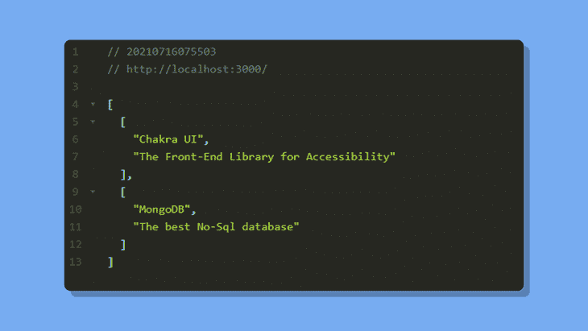

### 2.创建和发布数据

完成之后，让我们继续将数据提交到电子表格中。

设置投递路线:

```
app.post('/post', async (req, res) => {
  res.send("Data submitted!");
});

```

遵循与上面相同的过程，设置`auth`标记并定义电子表格 ID。

为了发布数据，我们将使用`spreadsheets.values.append`方法。Google API 将根据传递给请求的值的数量将值追加到电子表格中。

方法保持不变。我们将传入`auth`、`spreadsheetId`和一个`range`。除此之外，我们现在又传入了两个属性:`valueInputOption`和`resource`。

```
const response = await googleSheet.spreadsheets.values.append({
  auth,
  spreadsheetId,
  range: 'Sheet1!A2:B',
  valueInputOption: 'USER_ENTERED',
  resource: {
    values: [['NextJS', 'The framework for Production']]
  }
});

res.send(response)

```

`valueInputOption`可以带两个选项，`"RAW"`或者`"USER_ENTERED"`。如果`"RAW"`，那么用户输入的任何内容都将被保存。如果你使用`"USER_ENTERED"`，当用户输入被传递时，它将被解析——如果用户输入一个数字，它将被解析为一个数字。

这在某些用例中非常有用——例如，假设您正在构建一个 React 表单，将提交的数据发送到一个电子表格中。我将使用一个简单的电子表格的例子，每个科目对应一个分数。

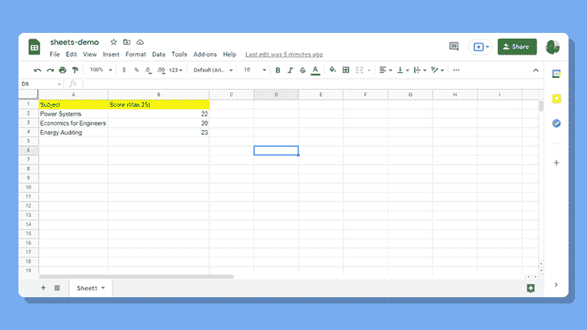

如果`valueInputOption`被设置为`"USER_ENTERED"`，数据被发布并被识别为数字。但是如果我将参数设置为`"RAW"`，并将分数作为一个字符串传递，数据就会被发布，但是 Google Sheets 似乎不会将分数视为一个数字。

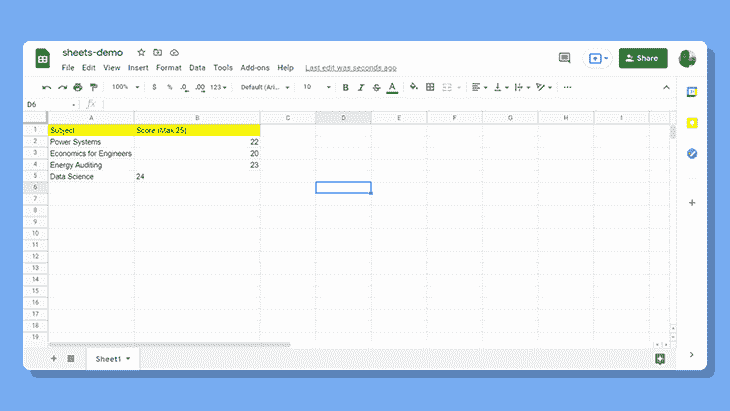

`resource`接收要添加到电子表格中的单元格值。您也可以通过添加另一组数组来输入多个条目。

```
resource: {
  values: [
        ['NextJS', 'The framework for Production'], 
        ['Jest', 'The testing framework for React']
  ]
}

```

继续进行发布请求。你可以利用任何 API 测试器，比如 [Postman](https://postman.com) 来帮助你。

### 3.更新单元格值

为了更新单元格的值，我们将使用`spreadsheets.values.update`方法。

继续做一个卖出路线。

```
app.put('/update', async (req, res) => {
  res.send("Updated cell!");
});

```

该方法照常接收`auth`和`spreadsheetId`。确保`range`只指向一行，除非你要更新多行。

这里我会指定`range:` `"Sheet1!A2:B2"`，只是第二行。其余的都保持不变。您可以将`valueInputOption`设置为`"RAW"`或`"USER_ENTERED"`。最后，通过`resource`输入想要替换的单元格值。

```
const response = await googleSheet.spreadsheets.values.update({
  auth,
  spreadsheetId,
  range: 'Sheet1!A2:B2',
  valueInputOption: 'USER_ENTERED',
  resource: {
    values: [['Jamstack', 'Future of the Web']]
  }
});

res.send(response)

```

继续在 API tester 上发出一个 PUT 请求。单元格值现在应该更新了。

### 4.删除单元格值

Sheets API 建议使用 POST 请求来使用`spreadsheets.values.clear`方法。

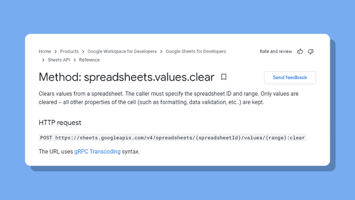

Source: [Google Sheets API documentation](https://developers.google.com/sheets/api/reference/rest/v4/spreadsheets.values/clear).

因此，我们将制定一条新的邮政路线。

```
app.post('/delete', async (req, res) => {
  res.send("Deleted Cell successfully!");
});

```

这种方法非常简单。您需要做的就是通过`range`属性指定电子表格的行和列。

```
const response = await googleSheet.spreadsheets.values.clear({
  auth,
  spreadsheetId,
  range: "Sheet1!A5:B5"
});

```

向`/delete`路线发出新的请求，以查看更改。

恭喜你。那是新的东西！我们已经使用 Google Sheets 实现了 CRUD 操作。如果你被卡住了，你可以在我的 GitHub 上看一下[这个回购。](https://github.com/GeoBrodas/google-sheets-crud)

## 结论

看起来我们发现了一个全新的数据库，它是免费的，并且有一个干净的数据管理界面。您可以将它用于各种语言，包括 Python、Go、Ruby 等等。

尽管您可以发出的请求数量有限制——每 100 秒 100 个请求——但如果您从好的方面看，Google Sheets API 为您提供了一个开始学习 API 的好方法，并可用于集成小规模项目。

## 使用 [LogRocket](https://lp.logrocket.com/blg/signup) 消除传统错误报告的干扰

[](https://lp.logrocket.com/blg/signup)

[LogRocket](https://lp.logrocket.com/blg/signup) 是一个数字体验分析解决方案，它可以保护您免受数百个假阳性错误警报的影响，只针对几个真正重要的项目。LogRocket 会告诉您应用程序中实际影响用户的最具影响力的 bug 和 UX 问题。

然后，使用具有深层技术遥测的会话重放来确切地查看用户看到了什么以及是什么导致了问题，就像你在他们身后看一样。

LogRocket 自动聚合客户端错误、JS 异常、前端性能指标和用户交互。然后 LogRocket 使用机器学习来告诉你哪些问题正在影响大多数用户，并提供你需要修复它的上下文。

关注重要的 bug—[今天就试试 LogRocket】。](https://lp.logrocket.com/blg/signup-issue-free)