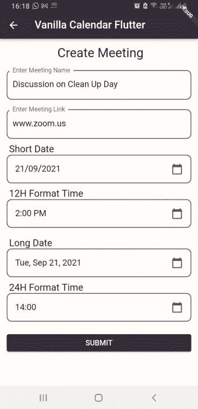
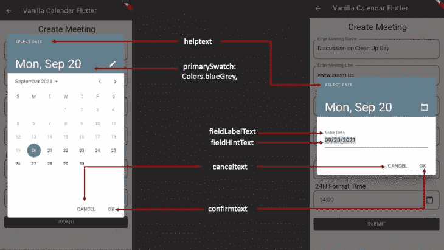
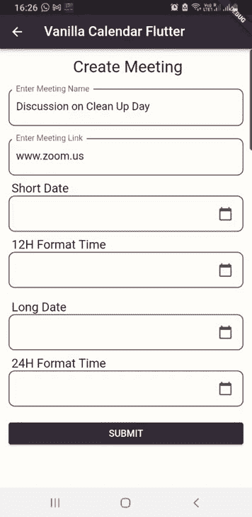
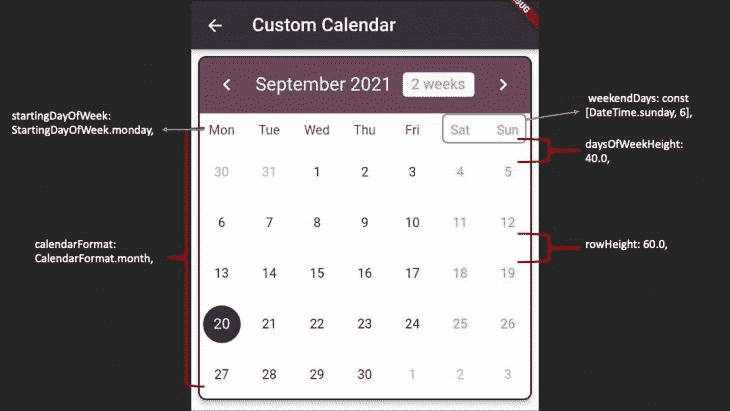
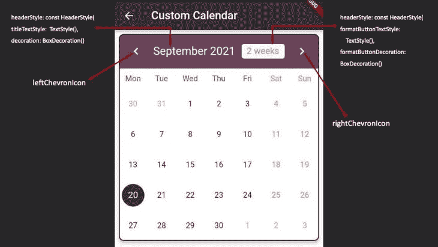
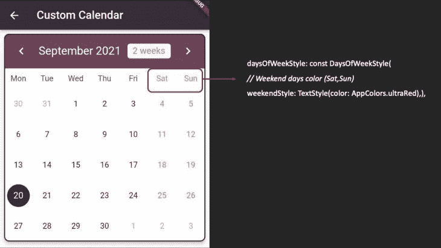
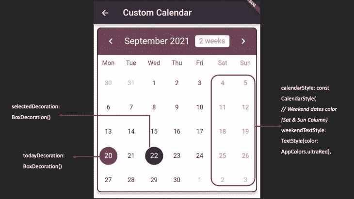
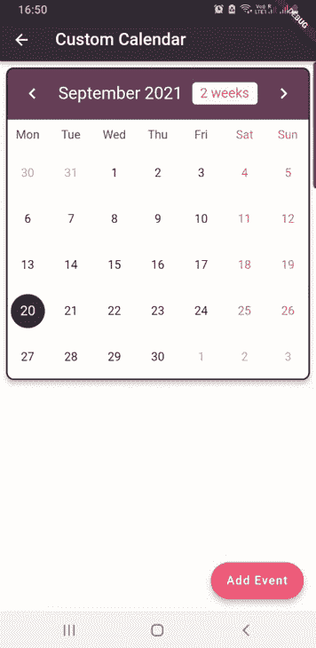

# 如何在 Flutter - LogRocket 博客中创建自定义日历

> 原文：<https://blog.logrocket.com/build-custom-calendar-flutter/>

我们使用的日历已经进化了很多年。从手写日历到印刷日历，现在我们手中都有一个数字日历，它非常可定制，可以在我们需要提醒的时候提醒我们的事件。

我们将了解如何在 Flutter 中构建和定制日历小部件，以便为用户提供这种体验。

虽然 Flutter 以日期和时间选择器的形式提供了一个日历小部件，提供可定制的颜色、字体和用法，但它缺少一些功能。您可以使用它来选择日期和时间(或两者都选)并将其添加到您的应用程序中，但是它需要与一个按钮和一个占位符结合使用，以便保存选择的日期或时间。

因此，我将从 Flutter 架构提供的原生日历开始，然后转到 pub.dev 上最流行的日历小部件`[TableCalendar](https://pub.dev/packages/table_calendar)`。还有许多其他流行的日历小部件可以使用，但对于本教程，我们将深入讨论其中一个。

为了更全面地解释这个小部件，我为在线会议创建了一个单屏幕应用程序。用户可以输入会议名称和链接，然后选择日期和时间。




首先，让我们回顾一下 [`showDatePicker`默认构造函数](https://api.flutter.dev/flutter/material/showDatePicker.html):

```
showDatePicker({
// it requires a context
  required BuildContext context,  
// when datePicker is displayed, it will show month of the current date
  required DateTime initialDate,  
// earliest possible date to be displayed (eg: 2000)
  required DateTime firstDate,
// latest allowed date to be displayed (eg: 2050)
  required DateTime lastDate,
// it represents TODAY and it will be highlighted
  DateTime? currentDate,
 // either by input or selected, defaults to calendar mode.
  DatePickerEntryMode initialEntryMode = DatePickerEntryMode.calendar or input,
// restricts user to select date from range to dates.
  SelectableDayPredicate? selectableDayPredicate,
// text that is displayed at the top of the datePicker
  String? helpText,
// text that is displayed on cancel button
  String? cancelText,
// text that is displayed on confirm button
  String? confirmText,
// use builder function to customise the datePicker  
  TransitionBuilder? Builder,
// option to display datePicker in year or day mode. Defaults to day
  DatePickerMode initialDatePickerMode = DatePickerMode.day or year,
// error message displayed when user hasn't entered date in proper format
  String? errorFormatText,
// error message displayed when date is not selectable
  String? errorInvalidText,
// hint message displayed to prompt user to enter date according to the format mentioned (eg: dd/mm/yyyy)
  String? fieldHintText,
// label message displayed for what the user is entering date for (eg: birthdate)
  String? fieldLabelText,
})
```

关于上面的默认构造函数，你可以参考下面的图片，我已经指出了一些重要的属性，可以根据你的需要进行定制。



### 它是如何工作的？

我不打算在这里张贴整个代码，而是仅仅展示它的实现并解释它。showDatePicker 的其余代码可以在这里找到，供您试验。

#### 步骤 1:实现一个`ValueNotifier`

我实现了一个`ValueNotifier`来保存文本字段中的日期。

```
final ValueNotifier<DateTime?> dateSub = ValueNotifier(null);
```

#### 步骤 2:创建一个`datePicker`对话框

有了`ValueListenerBuilder`和`DateTime`的一个实例，在`InkWell`小部件的帮助下，当我们点击`textField`时，会弹出一个`datePicker`对话框。当用户点击所需日期时，它将显示在`textField`中:

```
ValueListenableBuilder<DateTime?>(
   valueListenable: dateSub,
   builder: (context, dateVal, child) {
     return InkWell(
         onTap: () async {
           DateTime? date = await showDatePicker(
               context: context,
               initialDate: DateTime.now(),
               firstDate: DateTime.now(),
               lastDate: DateTime(2050),
               currentDate: DateTime.now(),
               initialEntryMode: DatePickerEntryMode.calendar,
               initialDatePickerMode: DatePickerMode.day,
               builder: (context, child) {
                 return Theme(
                   data: Theme.of(context).copyWith(
                       colorScheme:  ColorScheme.fromSwatch(
                         primarySwatch: Colors.blueGrey,
                         accentColor: AppColors.blackCoffee,
                         backgroundColor: Colors.lightBlue,
                         cardColor: Colors.white,
                       )
                   ),
                   child: child!,
                 );
               });
           dateSub.value = date;
         },
         child: buildDateTimePicker(
             dateVal != null ? convertDate(dateVal) : ''));
   }),
```

`buildDateTimePicker`不过是一个带有自定义边框和日历图标作为尾随图标的`listTile`:

```
Widget buildDateTimePicker(String data) {
 return ListTile(
   shape: RoundedRectangleBorder(
     borderRadius: BorderRadius.circular(10.0),
     side: const BorderSide(color: AppColors.eggPlant, width: 1.5),
   ),
   title: Text(data),
   trailing: const Icon(
     Icons.calendar_today,
     color: AppColors.eggPlant,
   ),
 );
}
```

我们还有一个字符串方法来将日期转换成所需的格式:

```
String convertDate(DateTime dateTime) {
 return DateFormat('dd/MM/yyyy').format(dateTime);
}
```

这就是代码实现后的样子:



现在，让我们回到我之前讨论的`TableCalendar`，我们将如何实现它，以及我们将如何定制它以满足应用程序的需求。

有几种定制的可能性，讨论它们超出了本文的范围。所以我会尽可能地具体，只谈最重要的部分。当然也有我亲自实验过的代码实现，也有图片可以参考。

## 桌面日历

安装非常简单:您需要从这里复制并粘贴`table_calendar`的`pubspec.yaml`文件中的依赖项。

最新版本是:

```
table_calendar: ^3.0.2
```

现在，我将把它的构造函数分成三部分:

1.  设置`TableCalendar`小部件
2.  根据您的应用需求设计日历
3.  将事件添加到日历

这样你就可以很容易地理解代码，并且知道如何成功地实现它。

### 步骤 1:设置`TableCalendar`小部件

我使用了`SingleChildScrollView`作为我的父窗口小部件，然后在`Column`窗口小部件中添加了一个`Card`窗口小部件来提升日历。然后，我在`Card`小部件中添加了`TableCalendar`小部件作为其子部件:

```
SingleChildScrollView(
 child: Column(
   children: [
     Card(
       margin: const EdgeInsets.all(8.0),
       elevation: 5.0,
       shape: const RoundedRectangleBorder(
         borderRadius: BorderRadius.all(
           Radius.circular(10),
         ),
         side: BorderSide( color: AppColors.blackCoffee, width: 2.0),
       ),
       child: TableCalendar(
          // today's date
         focusedDay: _focusedCalendarDate,
         // earliest possible date
         firstDay: _initialCalendarDate,
         // latest allowed date
         lastDay: _lastCalendarDate, 
         // default view when displayed
         calendarFormat: CalendarFormat.month, 
         // default is Saturday & Sunday but can be set to any day.
         // instead of day, a number can be mentioned as well.
         weekendDays: const [DateTime.sunday, 6],
         // default is Sunday but can be changed according to locale
         startingDayOfWeek: StartingDayOfWeek.monday,
        // height between the day row and 1st date row, default is 16.0
         daysOfWeekHeight: 40.0,
         // height between the date rows, default is 52.0
         rowHeight: 60.0,
```

上面的代码设置了将出现在移动屏幕上的日历，并根据地区设置了一些默认值和一些定制。我在每个属性前添加了注释，以理解它的作用。

我知道在`TableCalendar`小部件的类文件中已经给出了解释，但是有时候用更简单的术语来理解属性更容易。我有一个习惯，阅读一切，理解它，然后我试着为我的读者简化，这样他们就不必在实现代码之前阅读每一行。



### 第二步:设计`TableCalendar`

### 好的，那么在设计台历的时候又有 3 个部分。首先是标题，其中有月份名称和一个在周视图和月视图之间切换的按钮。左右箭头在月份之间滚动。

根据应用程序的主题，您可以定制一切，以便日历的外观和感觉，基本上是日历的整个 UI，与您的应用程序的 UI 相匹配。

再次将代码分成 3 部分:

#### `headerStyle`

```
// Calendar Header Styling
headerStyle: const HeaderStyle(
 titleTextStyle:
     TextStyle(color: AppColors.babyPowder, fontSize: 20.0),
 decoration: BoxDecoration(
     color: AppColors.eggPlant,
     borderRadius: BorderRadius.only(
         topLeft: Radius.circular(10),
         topRight: Radius.circular(10))),
 formatButtonTextStyle:
     TextStyle(color: AppColors.ultraRed, fontSize: 16.0),
 formatButtonDecoration: BoxDecoration(
   color: AppColors.babyPowder,
   borderRadius: BorderRadius.all(
     Radius.circular(5.0),
   ), ),
 leftChevronIcon: Icon(
   Icons.chevron_left,
   color: AppColors.babyPowder,
   size: 28,
 ),
 rightChevronIcon: Icon(
   Icons.chevron_right,
   color: AppColors.babyPowder,
   size: 28,
 ),
),
```

#### 

#### 页眉下的日期样式

您可以在这里为周末、工作日以及节假日(如果您已经设置)设置不同的颜色:

```
// Calendar Days Styling
daysOfWeekStyle: const DaysOfWeekStyle(
 // Weekend days color (Sat,Sun)
 weekendStyle: TextStyle(color: AppColors.ultraRed),
),
```

在上面的代码中，我在实现`TableCalendar`小部件时为最初设置的周末添加了颜色。



#### 设计日期

您可以在这里为特定的周末或假日添加颜色。此外，可以自定义当前日期和选定日期的突出显示颜色。

```
// Calendar Dates styling
calendarStyle: const CalendarStyle(
 // Weekend dates color (Sat & Sun Column)
 weekendTextStyle: TextStyle(color: AppColors.ultraRed),
 // highlighted color for today
 todayDecoration: BoxDecoration(
   color: AppColors.eggPlant,
   shape: BoxShape.circle,
 ),
 // highlighted color for selected day
 selectedDecoration: BoxDecoration(
   color: AppColors.blackCoffee,
   shape: BoxShape.circle,
 ),
),
```



下一段代码来自`TableCalender` 提供的[官方文档。这是实现所选日期的默认方式。该代码根据上述定制的颜色突出显示当前日期和所选日期。没有更好的方法来做到这一点，这是由`TableCalendar`建议的:](https://pub.dev/packages/table_calendar)

```
selectedDayPredicate: (currentSelectedDate) {
 // as per the documentation 'selectedDayPredicate' needs to determine current selected day.
 return (isSameDay(
     _selectedCalendarDate!, currentSelectedDate));
},
onDaySelected: (selectedDay, focusedDay) {
 // as per the documentation
 if (!isSameDay(_selectedCalendarDate, selectedDay)) {
   setState(() {
     _selectedCalendarDate = selectedDay;
     _focusedCalendarDate = focusedDay;
   });
 }
},
```

### 步骤 3:将事件添加到`TableCalendar`

所以我们已经完成了对`TableCalendar`的初始化，并将其风格化以匹配我们的 UI。剩下的唯一一件事就是将事件添加到我们的日历中，这是一个至关重要的特性。没有它，我们的日历只是一份硬拷贝，放在家里或冰箱里。

然而，我们中的许多人倾向于在日历上贴一张便利贴来标明整个月、周甚至一天的重要事件。在我们的手机上，我们能够在默认的日历应用程序中添加提醒或事件。

我已经创建了一个名为`MyEvents`的模型类，并初始化了两个字符串变量`eventTitle`和`eventDescp`(描述):

```
class MyEvents {
 final String eventTitle;
 final String eventDescp;

 MyEvents({required this.eventTitle, required this.eventDescp});

 @override
 String toString() => eventTitle;
}
```

在我们的 `CustomCalendarTable` [Dart](https://blog.logrocket.com/introduction-to-using-dart-in-flutter/) 文件中，我添加了两个`TextEditingController`、一个`Map`和一个方法，我们将在其中保存事件列表并将其应用到 TableCalandar 中的`eventLoader`属性:

```
final titleController = TextEditingController();
final descpController = TextEditingController();

late Map<DateTime, List<MyEvents>> mySelectedEvents;

@override
void initState() {
 selectedCalendarDate = _focusedCalendarDate;
 mySelectedEvents = {};
 super.initState();
}

@override
void dispose() {
 titleController.dispose();
 descpController.dispose();
 super.dispose();
}

List<MyEvents> _listOfDayEvents(DateTime dateTime) {
 return mySelectedEvents[dateTime] ?? [];
}

```

接下来，我在我们的`Scaffold`中添加了一个 fab 按钮，点击 fab 按钮，会出现一个`AlertDialog`，用户将在这里输入事件标题和事件描述。

点击`AlertDialog`内的`Add`按钮后，日历下会添加一个事件，在事件添加的日期上会出现一个彩色小圆点。

我还添加了一个`SnackBar`，以防用户没有在标题文本字段或描述文本字段中输入任何内容。会弹出一个`SnackBar`，提示输入标题和描述。

如果用户输入了标题和描述，在`setState`方法中，它将检查所选事件的列表是否不为空，然后我们将标题和描述添加到`MyEvents`模型类中，并创建一个`MyEvents`列表。

一旦添加了事件，我们就清除`Controller`并关闭`AlertDialog`:

```
_showAddEventDialog() async {
 await showDialog(
     context: context,
     builder: (context) => AlertDialog(
           title: const Text('New Event'),
           content: Column(
             crossAxisAlignment: CrossAxisAlignment.stretch,
             mainAxisSize: MainAxisSize.min,
             children: [
               buildTextField(
                   controller: titleController, hint: 'Enter Title'),
               const SizedBox(
                 height: 20.0,
               ),
               buildTextField(
                   controller: descpController, hint: 'Enter Description'),
             ],           ),
           actions: [
             TextButton(
               onPressed: () => Navigator.pop(context),
               child: const Text('Cancel'),),
             TextButton(
               onPressed: () {
                 if (titleController.text.isEmpty &&
                     descpController.text.isEmpty) {
                   ScaffoldMessenger.of(context).showSnackBar(
                     const SnackBar(
                       content: Text('Please enter title & description'),
                       duration: Duration(seconds: 3),
                     ), );
                   //Navigator.pop(context);
                   return;
                 } else {
                   setState(() {
                if (mySelectedEvents[selectedCalendarDate] != null) {
                     mySelectedEvents[selectedCalendarDate]?.add(MyEvents(
                           eventTitle: titleController.text,
                           eventDescp: descpController.text));
                     } else {
                       mySelectedEvents[selectedCalendarDate!] = [
                         MyEvents(
                             eventTitle: titleController.text,
                             eventDescp: descpController.text)
                       ]; } });

                   titleController.clear();
                   descpController.clear();

                   Navigator.pop(context);
                   return;
                 }
               },
               child: const Text('Add'),
             ),
           ],
         ));}
```

我已经构建了一个自定义文本字段，并在`AlertDialog`中进行了初始化:

```
Widget buildTextField(
   {String? hint, required TextEditingController controller}) {
 return TextField(
   controller: controller,
   textCapitalization: TextCapitalization.words,
   decoration: InputDecoration(
     labelText: hint ?? '',
     focusedBorder: OutlineInputBorder(
       borderSide: const BorderSide(color: AppColors.eggPlant, width: 1.5),
       borderRadius: BorderRadius.circular(
         10.0,
       ),
     ),
     enabledBorder: OutlineInputBorder(
       borderSide: const BorderSide(color: AppColors.eggPlant, width: 1.5),
       borderRadius: BorderRadius.circular(
         10.0,
       ),
     ),
   ),
 );
}
```

当我添加了位于`TableCalendar`小部件下的`eventLoader`属性并向其添加了`_listofDayEvents`方法时，一切都变得简单了:

```
// this property needs to be added to show events
eventLoader: _listOfDayEvents,
```



就这样，我们成功地实现了向日历日期添加事件的方法，并将其显示在日历下的应用程序中。你可以[在这里](https://gist.github.com/timelessfusionapps/d48522da232437a2deb54c55e2a42254)看一下全部代码。

正如我在本文前面提到的，有一些优秀的日历库可用，比如 flutter_calendar_carousel 和 syncfusion_flutter_calendar。

所有的基本实现都是一样的。甚至属性和定制都与我在本文中提到的`TableCalendar`非常相似。尽管属性的名称不同，但功能是相同的。

我试图包括尽可能多的细节，以帮助任何希望将日历集成到应用程序中的人，但正如我常说的，发现需要实验，这一直是我的座右铭。因此，请仔细研究代码，如果您需要更多信息，可以随时参考 pub.dev 网站上的官方文档。

非常感谢！

## 使用 [LogRocket](https://lp.logrocket.com/blg/signup) 消除传统错误报告的干扰

[](https://lp.logrocket.com/blg/signup)

[LogRocket](https://lp.logrocket.com/blg/signup) 是一个数字体验分析解决方案，它可以保护您免受数百个假阳性错误警报的影响，只针对几个真正重要的项目。LogRocket 会告诉您应用程序中实际影响用户的最具影响力的 bug 和 UX 问题。

然后，使用具有深层技术遥测的会话重放来确切地查看用户看到了什么以及是什么导致了问题，就像你在他们身后看一样。

LogRocket 自动聚合客户端错误、JS 异常、前端性能指标和用户交互。然后 LogRocket 使用机器学习来告诉你哪些问题正在影响大多数用户，并提供你需要修复它的上下文。

关注重要的 bug—[今天就试试 LogRocket】。](https://lp.logrocket.com/blg/signup-issue-free)