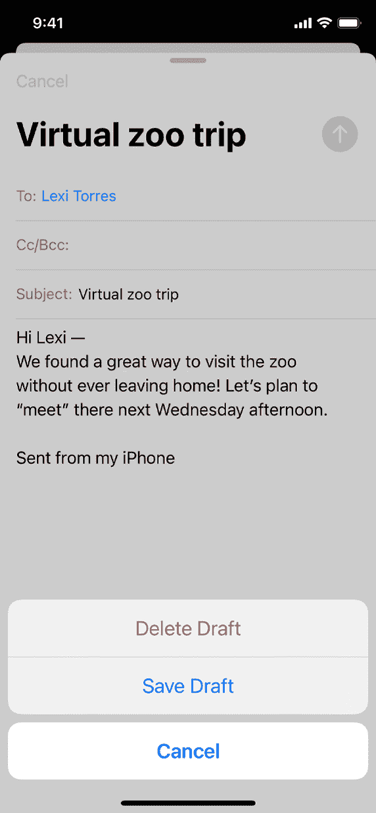
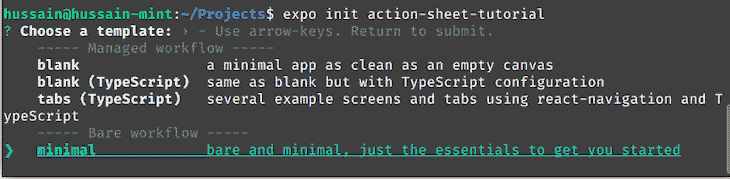
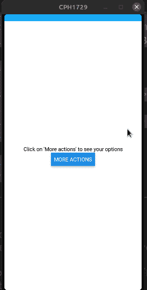
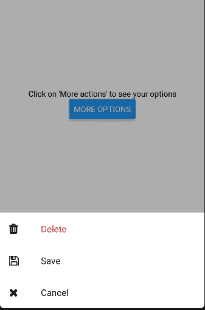
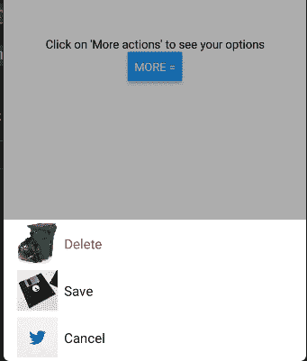
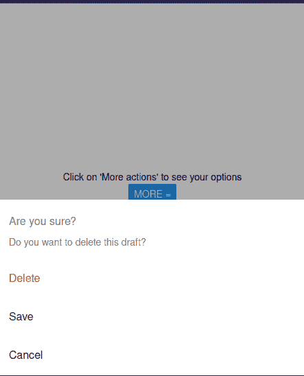

# 构建一个定制的 React 本地动作表

> 原文：<https://blog.logrocket.com/build-custom-react-native-action-sheet/>

假设您正在构建一个电子邮件客户端，让用户管理他们的草稿。在这种情况下，根据所选的草稿显示一个带有选项列表的自定义上下文菜单是明智的。

这里有一个模型:


当然，这个解决方案可能行得通。然而，这种上下文菜单有一个主要问题:它没有针对其他屏幕尺寸进行优化。这意味着，虽然我们的菜单在笔记本电脑上看起来很棒，但在手机屏幕上却显得很小。因此，用户在手机上显示应用程序时可能会面临可访问性问题。

那么，我们如何缓解这个问题呢？

我们可以通过使用一个[动作表](https://developer.apple.com/design/human-interface-guidelines/ios/views/action-sheets/)来解决这个问题。

## 什么是行动表？

动作表是在屏幕底部呈现上下文菜单的 UI 元素。它们通常针对各种屏幕尺寸进行了优化，并对图标提供了强大的支持。这里有一个简单的例子:



在本文中，我们将使用`[react-native-action-sheet](https://github.com/expo/react-native-action-sheet)`模块在 React Native 中构建和定制一个类似 iOS 的动作表。这将是指南的结果:


## 入门指南

在本文中，我们将使用 Expo 初始化我们的项目。为此，首先运行以下终端命令:

```
expo init action-sheet-tutorial

```

接下来，选择显示“最小”的选项:



之后，像这样安装`react-native-action-sheet`包:

```
cd action-sheet-tutorial #go into project
npm install @expo/react-native-action-sheet

```

## 构建基本行动表

在本节中，您将学习`react-native-action-sheet`库的基础知识。

作为第一步，我们需要编写动作表组件。为此，首先创建一个名为`ActionButton.js`的文件。在这里，编写以下代码:

```
import * as React from "react";
import { useActionSheet } from "@expo/react-native-action-sheet";
import { View, Button } from "react-native";
export default function ActionButton() {
  return (
    <View>
      <Button title="More actions" onPress={() => alert("Button pressed")} />
    </View>
  );
}

```

在这段代码中，我们在屏幕上呈现了一个简单的`Button`组件。

要显示`ActionButton`模块，将`App.js`中的所有代码替换为以下代码:

```
import ActionButton from "./ActionButton";
import { ActionSheetProvider } from "@expo/react-native-action-sheet";
export default function App() {
  return (
    <ActionSheetProvider>
      <View>
        <Text>Click on 'More actions' to see your options</Text>
        <ActionButton />
      </View>
    </ActionSheetProvider>
  );
}

```

现在，我们已经将自定义组件呈现到了 UI 中。此外，请注意，我们已经将组件包装在了`ActionSheetProvider`标签中。这告诉 React 我们的应用程序将由一个动作表组成。

让我们来测试一下！用这个 Bash 命令运行您的程序:

```
expo start

```



太好了！我们的代码有效。

我们的下一步是将 React Native 的动作表 API 与我们的项目连接起来。为此，在`ActionSheet.js`中添加以下代码片段:

```
import { useActionSheet } from "@expo/react-native-action-sheet";

const { showActionSheetWithOptions } = useActionSheet();

const openSheet = () => {
  const options = ["Delete", "Save", "Cancel"];
  const destructiveButtonIndex = 0; //the first element in 'options' will denote the Delete option
  const cancelButtonIndex = 2; //Element number 2 in the array will be the 'Cancel' button

  showActionSheetWithOptions(
    {
      options,
      cancelButtonIndex, //the third button will be the 'Cancel' button
      destructiveButtonIndex, //the first button will be the 'Delete' option
    },
    (buttonIndex) => {
      // Do something here depending on the button index selected
      alert("Index pressed: " + buttonIndex);
    }
  );

return (
  <View>
    {/*Edit your Button code here:*/}
    {/*When the button is clicked, execute the openSheet method*/}
    <Button title="More options" onPress={() => openSheet()} />
  </View>
);

```

这段代码乍一看可能令人望而生畏，但是很容易理解。下面是细目分类:

*   首先，我们导入了`useActionSheet`钩子。这将让我们根据我们的配置呈现一个动作表
*   稍后，声明一个保存用户可用选项的`options`数组
*   之后，我们将配置传递给了`showSheetButtonWithOptions`函数。因此，React 将显示我们定制的行动表
*   该函数的第二个参数是一个回调函数，当客户端单击一个选项时，该函数将运行。在这种情况下，我们使用一个`alert`函数来通知用户选择的当前索引


## 定制您的行动表

在指南的这一部分，您将学习如何改变行动表的外观和感觉。

### 显示图标

`icons`属性将为每个选项绘制图标。如果设计者想要一个更好看的上下文菜单，这可能会很方便。

下面是一个图标运行的例子:

```
import Icon from "react-native-vector-icons/FontAwesome";
//create an icon array
//each item in the 'icons' array corresponds to its respective index in the 'options' array.
//each item in the array in an Icon component.
const icons = [
  <Icon name="trash" size={20} />,
  <Icon name="save" size={20} />,
  <Icon name="remove" size={20} />,
];

showActionSheetWithOptions(
  {
    options,
    cancelButtonIndex,
    destructiveButtonIndex,
    icons, //pass in our icons array
  },
  (buttonIndex) => {}
);

```



你甚至可以用图像代替图标，就像这样:

```
//create an icon array
//this array comprises of `Image` components with source images
const icons = [
  <Image
    source={{
      uri: "https://www.chevychasesection3.org/sites/g/files/vyhlif406/f/styles/news_image/public/pages/trash-278x300.jpg?itok=fK7hIbG-",
    }}
    style={{ width: "200%", height: "200%" }}
  />,
  <Image
    source={{
      uri: "https://img-new.cgtrader.com/items/73665/floppy_disk_3_5_3d_model_3ds_fbx_blend_dae_fc20cd23-1906-47a6-b94e-643026bac619.jpg",
    }}
    style={{ width: "200%", height: "200%" }}
  />,
  <Image
    source={{
      uri: "https://about.twitter.com/content/dam/about-twitter/en/brand-toolkit/brand-download-img-1.jpg.twimg.1920.jpg",
    }}
    style={{ width: "200%", height: "200%" }}
  />,
];

showActionSheetWithOptions(
  {
    options,
    icons,
//further code..

```



### 行动表的信息和标题

要在菜单中显示标题或消息，使用`title`和`message`参数。一个用例可能是显示确认提示。例如，当用户选择从列表中删除某个项目时，会显示一个警告:

```
showActionSheetWithOptions(
  {
    message: "Do you want to delete this draft?",
    title: "Are you sure?",
    //further options...
  }
  //further code..
);

```



### 应用 CSS 样式

如果您想要将[自定义 CSS](https://blog.logrocket.com/using-css-variables-react-native/) 应用到您的动作表，React Native 提供了以下参数:

*   `textStyle`:对选项应用任何文本样式属性
*   顾名思义，这将对标题应用文本样式
*   `containerStyle`:这将把 CSS 应用到动作表的容器中
*   `seperatorStyle`:改变分离器的外观

在开发人员想要为他们的应用程序编写自定义主题的情况下，使用自定义 CSS 至关重要。

下面是一个使用 CSS 代码修改菜单的代码示例:

```
showActionSheetWithOptions(
  {
    showSeparators: true, //display a seperator component after each item.
   //apply custom styles to the action sheet.
    containerStyle: styles.container, 
    textStyle: styles.text,
    messageTextStyle: styles.message,
    titleTextStyle: styles.title,
    //further options..
  }
  //further code..
);

//create our styles
const styles = StyleSheet.create({
  container: {
    borderRadius: 20, //our container's borders will be rounded
    backgroundColor: "#cb7856", 
  },
  message: {
    backgroundColor: "purple", 
    color: "white",
  },
  title: {
    backgroundColor: "yellow",
  },
  text: {
    paddingLeft: "40%", //our options will have a certain amount of padding
  },
});

```


## 结论

这是这个项目的相关世博小吃。

在本指南中，您学习了如何使用`react-native-action-sheet`模块使用和定制行动表。它的文档简洁明了，这意味着使用行动表几乎不费吹灰之力。

非常感谢您的阅读！

## [LogRocket](https://lp.logrocket.com/blg/react-native-signup) :即时重现 React 原生应用中的问题。

[](https://lp.logrocket.com/blg/react-native-signup)

[LogRocket](https://lp.logrocket.com/blg/react-native-signup) 是一款 React 原生监控解决方案，可帮助您即时重现问题、确定 bug 的优先级并了解 React 原生应用的性能。

LogRocket 还可以向你展示用户是如何与你的应用程序互动的，从而帮助你提高转化率和产品使用率。LogRocket 的产品分析功能揭示了用户不完成特定流程或不采用新功能的原因。

开始主动监控您的 React 原生应用— [免费试用 LogRocket】。](https://lp.logrocket.com/blg/react-native-signup)