# 用 CSS 构建一个自定义的粘性导航条

> 原文：<https://blog.logrocket.com/build-custom-sticky-navbar-css/>

导航栏可能是让用户毫不费力地浏览你的网站而不会迷路的最好方式。

人们通常会把导航条放在页面的最顶端，但是如果它符合你的设计，你也可以把导航条放在网页的任何一边。导航条可以是导航项目的水平列表，也可以是小屏幕上网页左上角或右上角的汉堡样式。

为了更好地访问导航栏，你可以用几行 CSS 和 JavaScript 把它们粘在顶部。随着 navbar 复杂性的增加，更多的 JavaScript 代码会堆积起来。

在这篇文章中，我们将看到如何创建一个自定义的粘性导航条，它可以响应所有的屏幕尺寸，功能强大，并且只用 CSS 来创建。我们还将学习如何使用 SCSS 的语法规则来更快更干净地编写 CSS 代码。

这是我们将要建立的演示！

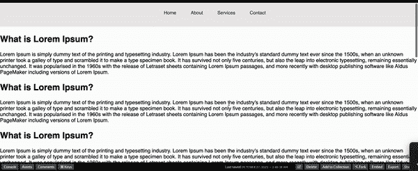

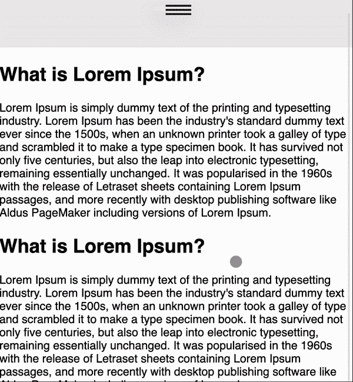

那么，我们开始吧。

### 目录

## 使用 HTML 和 SCSS

随着本文的深入，我们将从一些简单的东西开始，逐渐深入到更复杂的东西。创建导航栏的第一件事是，写一些 HTML。因此，首先将这段 HTML 代码复制到您最喜欢的代码编辑器或 Codepen 中。

```
<html>
  <body>
    <header class="header">
      <nav class="header__nav" id="navbar">
        <ul class="header__list">
          <li class="header__item"><a href="index.html" class="header__link">Home</a></li>
          <li class="header__item"><a href="about.html" class="header__link">About</a></li>
          <li class="header__item"><a href="services.html" class="header__link">Services</a></li>
          <li class="header__item"><a href="services.html" class="header__link">Contact</a></li>
        </ul>
      </nav>
    </header>
  </body>
</html>

```

上面给出的 HTML 代码非常简单，里面没有什么复杂的东西。我想让你注意我为每个元素写类名时使用的惯例。这个为 HTML 元素编写类名的小约定被称为 [BEM，它代表 Block，Element-，Modifier](https://blog.logrocket.com/bem-vs-smacss-comparing-css-methodologies/) 。

我们给 HTML 代码中的每个包装元素起一个块名。在这种情况下，包装器就是我们的`<header class="header">`。您也可以将其描述为父元素。

包装器或父元素中的每个子元素都有其父元素的类名，后跟两个带有唯一标识符的下划线。您可能已经注意到，在我们的案例中，它是:

```
<nav class="header__nav" id="navbar">
```

现在，我们可以给包装器中的每个子元素一个类名，就像这样。这里需要注意的另一件事是，我已经用单词`header`开始了它们的类名，即使它们是 header 的子元素。这样做是为了保持一致性，在编写 SCSS 代码时，它最终会对我们有很大帮助。我们一会儿会看到这一点。

要继续，您可以将下面给出的 SCSS 代码复制到您的 SCSS 文件中:

```
$color-blue: #00315c;
$color-purple: #6f479f;
$color-black: #202020;
$color-gray: #edebeb;
$color-white: #fcfcfc;

html {
  font-size: 62.5%;
  scroll-behavior: smooth;
}

html,
body {
  width: 100%;
  margin: 0px;
  padding: 0px;
  overflow-x: hidden;
}

body {
  font-family: "Montserrat", sans-serif;
}

.header {
  height: 20vh;
  background-color: $color-gray;
  padding: 1.5rem;
  position: relative;

  &__nav {
    display: flex;
    position: fixed;
    top: 0;
    left: 50%;
    transform: translateX(-50%);
    padding: 4rem 5rem;
    justify-content: space-around;
    align-items: center;
    z-index: 100;
    width: 100%;
    transition: 0.6s;
  }

  &__list {
    list-style: none;
    display: flex;
  }

  &__item {
    &:not(:last-child) {
      margin-right: 5rem;
    }
  }

  &__link {
    font-size: 1.6rem;
    color: $color-blue;
    font-weight: 400;
    text-decoration: none;

    &:hover {
      font-weight: 600;
      transition: all 0.3s;
    }
  }
}

```

(注意:如果你和我一起使用 Codepen，你可以在 CSS 窗口的设置菜单中选择 SCSS 选项。如果你在像 VS Code 这样的编辑器中，你可以下载 SCSS 扩展；它将把你的 SCSS 代码编译成 CSS 代码，你可以把它包含在你的 HTML 文件中)

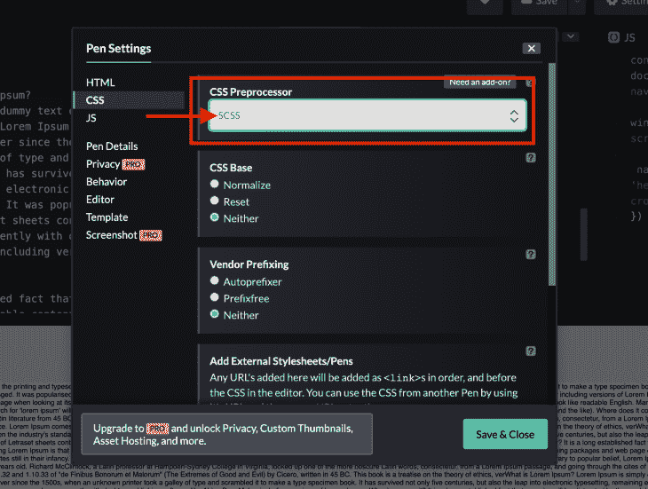

> 如果您熟悉 SCSS，并且理解上面代码中的内容，那么可以跳过下面几段。

前几行代码是颜色的变量，我们将在本教程中使用最多。您可以将这些变量设置为您喜欢的任何颜色，然后不用在每次需要使用颜色时都编写哈希值或 RGBA 值，而是编写变量名。

我要你注意的语法从第 24 行开始。我已经编写了`.header`来初始化 header 元素的样式。但是，在同一个括号内，我还写了`&__nav`，它启动了我们的导航元素的样式。

在 SCSS，您可以在相同的括号中编写嵌套元素的样式。此外，`&`符号保存您的父标识符的值。在这种情况下，如果我们使用的是 id 而不是类名，那么这个`&`就意味着`#header`

您还可以在第 61 行看到我是如何使用`&:hover`的，因为我想在链接元素上应用伪 hover 类。因此，这使得我们很容易编写嵌套样式并删除多余的代码。如果你愿意，你可以[阅读更多关于 SCSS](https://sass-lang.com/guide) 及其语法的内容。

正如你可能已经注意到的，我们并没有花太多的精力来为更大的屏幕创建一个导航条，因为根据良好的用户体验，它应该总是在屏幕顶部的一个水平列表。我们可以在更大的屏幕上添加汉堡菜单，但为了防止用户额外点击，汉堡菜单总是出现在更小的屏幕上，我们现在就要这么做。

## 带有 CSS 的汉堡导航条

现在，我们可以通过使用 CSS 在更小的屏幕上创建一个自定义的汉堡导航条。

给你一个我们正在建造的东西的概述；在较小的屏幕上显示水平导航项目是不可行的。相反，我们将创建一个汉堡菜单，通过覆盖整个屏幕的背景来显示项目。

让我们从写一些代码开始。将下面的 HTML 代码复制到现有 HTML 代码中的第 10 行之后。

```
 <div class="navigation">
    <input
      type="checkbox"
      class="navigation__checkbox"
      id="navi-toggle"
    />
    <label for="navi-toggle" class="navigation__button">
      <span class="navigation__icon"></span>
    </label>
    <div class="navigation__background"></div>
    <nav class="navigation__nav">
      <ul class="navigation__list">
        <li class="navigation__item">
          <a href="index.html" class="navigation__link">Home</a>
        </li>
        <li class="navigation__item">
          <a href="about.html" class="navigation__link">About</a>
        </li>
        <li class="navigation__item">
          <a href="services.html" class="navigation__link">Services</a>
        </li>
        <li class="navigation__item">
          <a href="contact.html" class="navigation__link">Contact Us</a>
        </li>
      </ul>
    </nav>
  </div>

```

复制代码后，您的 HTML 文件应该如下所示:

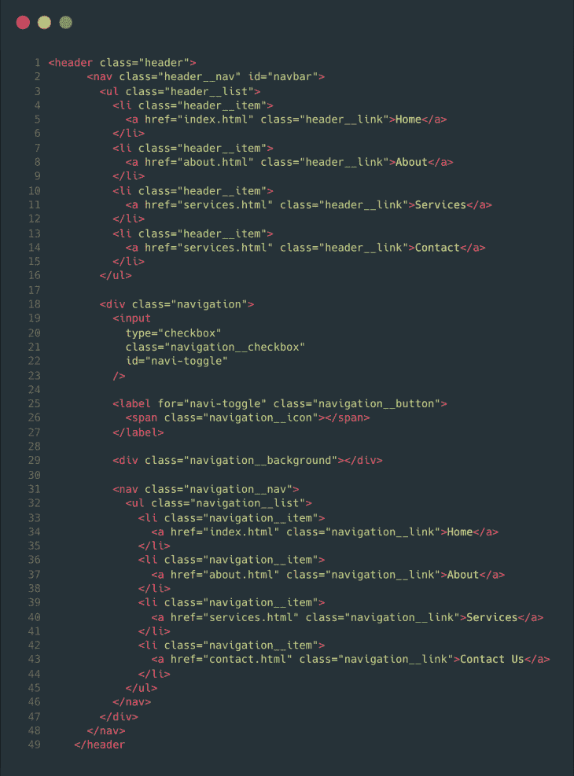

这是我们制作在小屏幕上看起来不错的汉堡菜单所需的唯一 HTML 代码。那么，让我向您解释一下这个新添加的代码中的一些要点:

*   我们添加了一个新的`<div>`元素，并给`<div>`一个类名`navigation`。在 div 中，我们添加了一个复选框。这个复选框将帮助我们决定何时显示导航项目，何时隐藏导航项目
*   在复选框之后，我们有一个标签，它和里面的元素一起，将作为典型的汉堡包图标
*   第三个元素是另一个类名为`navigation__background`的`<div>`。这个 div 将为我们的导航项目提供背景覆盖，以便在屏幕上清楚地显示
*   最后一件事是我们的导航项目列表。我们必须再次添加它们，因为先前的导航项目是用于较大的屏幕，而这些导航项目是用于较小的屏幕

***注意，**我使用了相同的 BEM 命名约定来为每个元素编写类名。*

## 用 CSS 设计导航栏的样式

现在，剩下的就是设计我们的导航栏了。因此，我们将编写大量的 CSS 代码。我将试着一个一个地解释我们编写的 CSS 代码块，这样就不会引起任何混乱。

首先，我们将编写一些媒体查询，因为我们需要以一定的宽度显示汉堡菜单。对于媒体查询，我们将使用 SCSS 混合，这本质上是函数。

对于参数，您将传递要查看更改的断点。为了使事情更简单，您可以给每个断点一个自己的名称；例如，400 像素可以被命名为“电话”，因为这是电话的平均屏幕宽度。

一旦被调用，您可以在花括号内编写您的 CSS 样式，这些样式将被应用到该断点。让我们看看如何通过编写这些媒体查询来实现这一点。

将以下代码复制到 SCSS 文件的顶部，我们就可以使用这些媒体查询了。

```
@mixin respond($breakpoint) {
  @if $breakpoint == phone {
    @media only screen and (max-width: 37.5em) {
      @content;
    } //600px
  }
  @if $breakpoint == s-hundred {
    @media only screen and (max-width: 43.75em) {
      @content;
    } //700px
  }
  @if $breakpoint == tab-port {
    @media only screen and (max-width: 56.25em) {
      @content;
    } //900px
  }
  @if $breakpoint == tab-land {
    @media only screen and (max-width: 75em) {
      @content;
    } //1200px
  }
  @if $breakpoint == big-desktop {
    @media only screen and (min-width: 112.5em) {
      @content;
    } //1800
  }
}

```

你得到这些媒体查询的语法了吗？我们创建了一个名为`respond`的 mixin，它将任何`breakpoint`作为参数，并在媒体查询中应用这些样式。

### 给汉堡做造型

现在，我们可以开始根据这些媒体查询来设计我们的导航栏了。所以，让我们从复制这段代码开始:

```
.navigation {
  display: none;
  @include respond(s-hundred){
    display: block;
  }
  z-index: 2000;
  &__checkbox {
    display: none;
  }
}

```

在上面的代码中，我们将汉堡导航的显示设置为`none`，因为我们只想在较小的屏幕上可见。因此，我们使用了我们的`respond` mixin 来实现这个功能。

z-index 被设置为`2000`,因为我们希望导航栏覆盖所有其他内容。我们将在本文的后面看到它。

因为我们以 700 像素显示汉堡导航，所以我们可以删除同样宽度的水平列表显示。为此，在您的`header__list`样式中添加这个小的突出显示的媒体查询:

```
&__list {
    list-style: none;
    display: flex;
    @include respond(s-hundred){
      display: none;
    }
}

```

添加这些代码块后，您的 SCSS 文件应该如下所示:

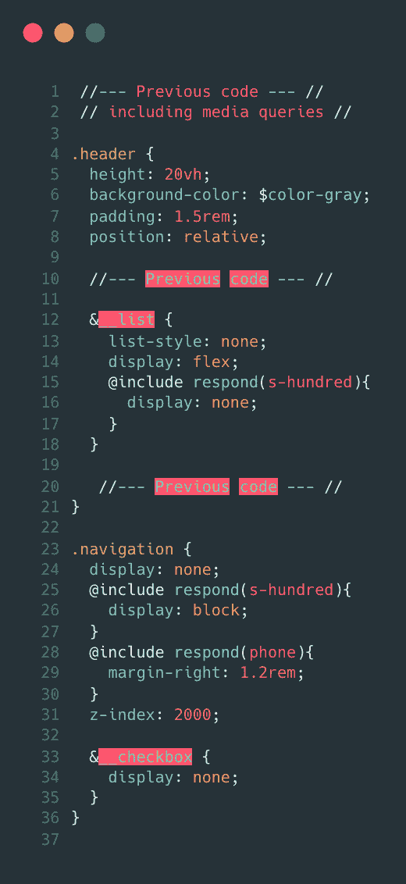

屏幕尺寸超过 700 像素:

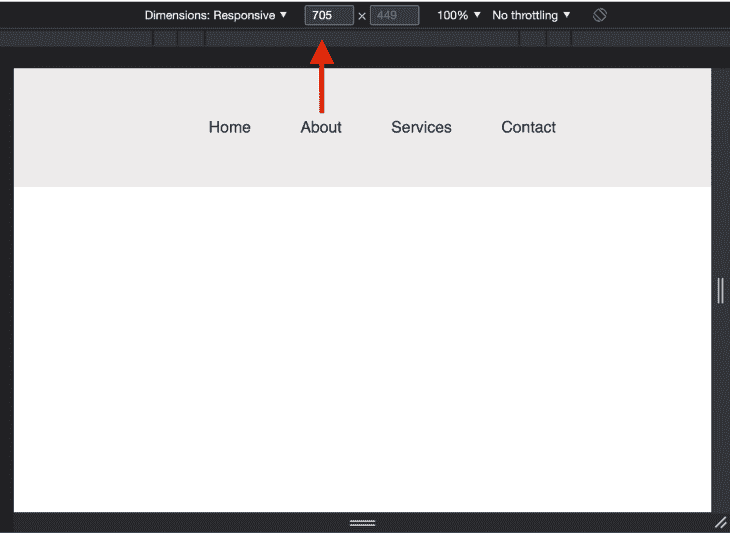

用于比较的屏幕尺寸小于 700 像素:

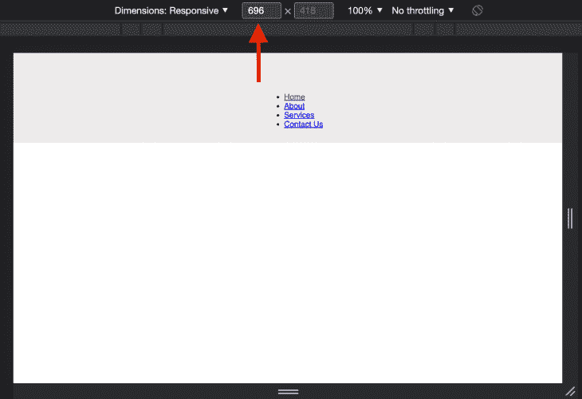

从现在开始，我们必须将所有代码块添加到`.navigation`样式块中，因为一切都是嵌套的。

代码块的下一部分非常简单。这段代码将我们的导航按钮设计成透明的圆形。我们把它做成透明的，因为它里面的导航图标元素将作为这个按钮的汉堡包图标。

```
&__button {
    background-color: transparent;
    height: 7rem;
    width: 7rem;
    top: 6rem;
    right: 6rem;
    border-radius: 50%;
    z-index: 2000;
    box-shadow: 0 1rem 3rem rgba($color-black, 0.1);
    text-align: center;
    cursor: pointer;
  }

```

现在，我们将设计我们的汉堡图标。我们将使用带有`position: absolute`的`before`和`after`伪类。最后，我们将使用`hover`伪类在图标上添加一点悬停效果。

```
&__icon {
    position: relative;
    margin-left: 2rem;
    &,
    &::before,
    &::after {
      width: 4rem;
      height: 3px;
      background-color: $color-black;
      display: inline-block;
    }
    &::before,
    &::after {
      content: '';
      position: absolute;
      left: 0;
      transition: all 0.2s;
    }
    &::before {
      top: -0.65rem;
    }
    &::after {
      top: 0.65rem;
    }
  }
  &__button:hover &__icon::before {
    top: -1rem;
  }
  &__button:hover &__icon::after {
    top: 1rem;
  }

```

此时，我们的汉堡菜单图标应该出现在屏幕上，如下图所示:

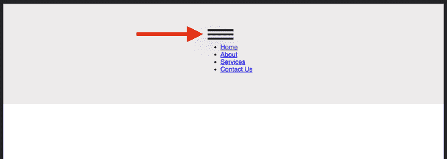

现在，在按钮按下(或检查)时，我们希望我们的汉堡包图标变成一个“X”关闭图标，以表明我们的导航栏现在是可见的，进一步按下它将关闭我们的导航栏。

为此，复制下面的代码，我们就可以使用我们的图标了。

```
&__checkbox:checked + &__button &__icon {
  background-color: transparent;
}
&__checkbox:checked + &__button &__icon::before {
  top: 0;
  transform: rotate(135deg);
  background-color: $color-white;
}
&__checkbox:checked + &__button &__icon::after {
  top: 0;
  transform: rotate(-135deg);
  background-color: $color-white;
}

```

*   在上面的代码块中，我们利用了`checkbox`元素中的`checked`伪类
*   我们还使用了`+` CSS 选择器。CSS 选择器帮助我们选择紧接在指定元素之后的元素
*   最后，我们旋转图标的`before`和`after`伪元素，使其看起来像一个“X”

我们将继续添加我们的背景覆盖。我们背景背后的逻辑相当简单；我们将在按钮上添加背景色，最初，它是不可见的，因为它的 z 索引会在复选框按钮的后面。

一旦我们点击复选框，我们将缩放我们的背景，以覆盖整个屏幕，我们的导航项目变得可见。

复制下面的代码来实现这一点。

```
&__background {
  background: radial-gradient(
    rgba($color-blue, 1),
    rgba($color-purple, 1)
  );
  height: 6rem;
  width: 6rem;
  position: fixed;
  top: -1rem;
  right: 0rem;
  z-index: -1000;
  display: none;
  border-radius: 50rem;
  }

  &__checkbox:checked ~ &__background {
  @include respond(s-hundred) {
    display: block;
    transform: scale(80);
  }
}

```

应用背景覆盖后，导航栏应该是这样的:

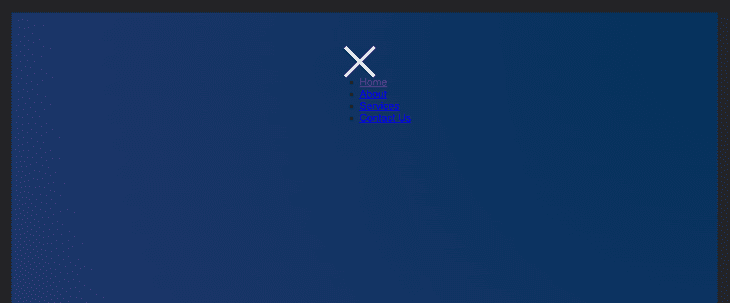

剩下的最后一件事是设计我们的导航项目。对于上下文，导航项目应该只在我们点击汉堡包图标时出现。它将覆盖整个屏幕，在较小的屏幕上提供积极的用户体验。

最后，当我们再次点击图标时，它应该会消失。这个代码块中包含了一些基本的样式逻辑，这与我们在本教程的其余部分中所做的非常相似。

```
&__nav {
    position: fixed;
    margin-top: 1rem;
    padding: 1.2rem;
    font-size: 1.5rem;
    font-weight: 400;
    z-index: 1500;
    @include respond(phone){
      padding: 0;
    }
  }

  &__list {
    list-style: none;
    opacity: 0;
    visibility: hidden;
    margin-top: 50%;
  }

  &__item {
    &:not(:last-child) {
      margin-bottom: 1.5rem;
    }
  }

  &__link {
    text-decoration: none;
    color: $color-white;
    &:hover {
      color: $color-blue;
    }
  }

  &__checkbox:checked ~ &__nav &__list {
    opacity: 1;
    visibility: visible;
    transition: all 0.5s;
  }

  &__checkbox:checked ~ &__nav {
    @include respond(s-hundred) {
      font-size: 4rem;
      position: absolute;
      top: 32rem;
      left: 50%;
      transform: translate(-50%, -50%);
    }
  }

  &__checkbox:checked ~ &__nav &__link {
    @include respond(s-hundred) {
      color: $color-white;
    }
  }

```

最后，我们的自定义粘性导航栏在较小的屏幕上应该是这样的:

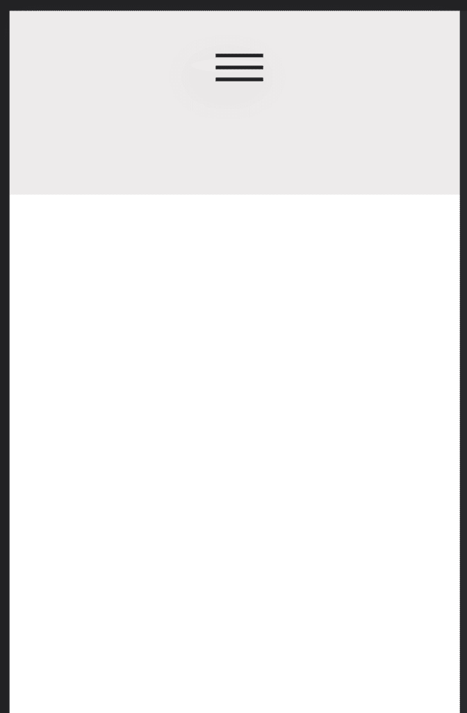

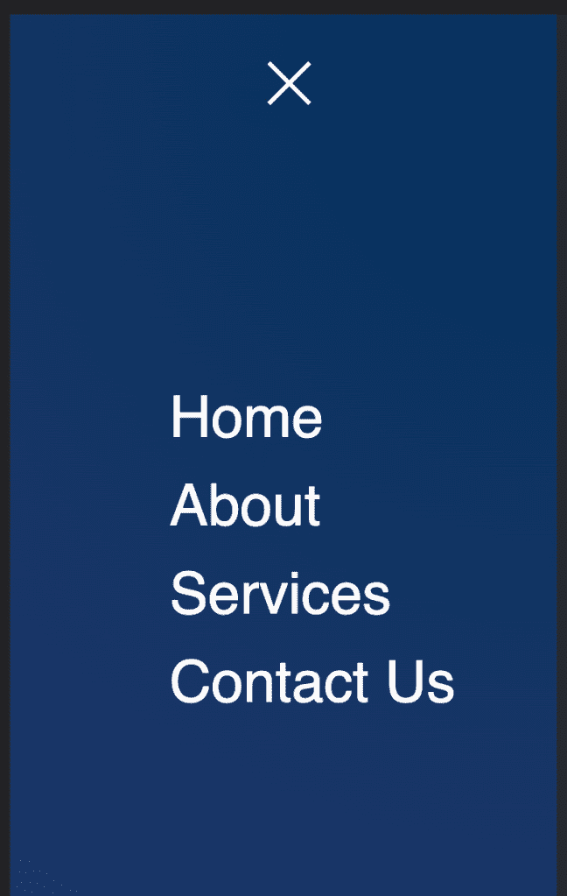

您可以根据需要设置导航栏或其项目的样式。我在中间有一个“X”关闭符号，但它通常位于右上角。你可以自由地做你认为合适的造型。

最后，如果你想在你的滚动条上添加一些小动画，你可以在你的`header`样式块中添加这个 CSS 代码块:

```
&__sticky {
    padding: 5rem 10rem;
    background-color: $color-gray;
    box-shadow: 0px 3px 5px rgba($color-blue, 0.5);
}

```

另外，不要忘记添加这段 JavaScript 代码:

```
const navBar = document.getElementById('navbar');
window.addEventListener('scroll', () => {
  navBar.classList.toggle('header__sticky', window.scrollY > 0);
});

```

CSS 现在为我们提供的工具和技术足以在不使用 JavaScript 的情况下构建超级酷的东西，比如我们的导航栏。该演示的完整代码在 Codepen 中提供。

## 粘性导航条与固定导航条

如果我们检查我们编写的初始 CSS 样式，你一定已经注意到，对于 navbar 样式和它们的对应样式，我使用了`position: fixed`，它与另一个名为`position: sticky`的 CSS 属性非常相似。现在，为了理解为什么我们用了`fixed`而不是`sticky`，我们应该知道这两者之间的区别。

一个`fixed`位置将元素固定到初始视口。当我们将`position: fixed`应用于任何元素时，在 DOM 中没有为该元素创建额外的空间，因此它看起来像是在固定的位置浮动在视窗上，就像我们的 navbar 被固定在最顶端一样。

使用`position: sticky`，元素根据文档的正常流程定位，并相对于其最近的滚动祖先或包含块进行操作，直到它进入视口。一旦它进入视口，它就转向一个固定的元素(相对于其祖先的位置)，而不是通过滚动出去。

[阅读更多关于`position`这里](https://developer.mozilla.org/en-US/docs/Web/CSS/position)。

在我们的 navbar 的上下文中，我们希望它在最顶端，这是我们使用`position: fixed`而不是`sticky`的原因之一，因为 navbar 将总是在视口中，并且它没有祖先。

如果你真的想在我们的导航条中使用`position: sticky`而不是`fixed`，你必须在我们的 CSS 中改变一些样式。

为了尝试一下，让我们回到我们最初写的样式。在`&__nav`样式下的`.header`块中，如下所示:

```
&__nav {
    display: flex;
    position: fixed;
    top: 0;
    left: 50%;
    transform: translateX(-50%);
    padding: 1.5rem 5rem;
    justify-content: space-around;
    align-items: center;
    z-index: 100;
    width: 100%;
    transition: 0.3s;
  }

```

移除/注释掉这些样式，并将`position`的值从`fixed`更改为`sticky`。现在，您的样式块应该如下所示:

```
&__nav {
    display: flex;
    position: sticky;
    top: 0;
    // left: 50%; (deleted style)
    // transform: translateX(-50%); (deleted style)
    // padding: 1.5rem 5rem; (deleted style)
    justify-content: space-around;
    align-items: center;
    z-index: 100;
    width: 100%;
    transition: 0.3s;
  }

```

我们移除了`left`和`transform`属性，因为带有`position: sticky`的元素只需要位置来粘贴，在我们的例子中，它是`top`。请注意，我们移除的一些其他样式完全是为了我们的导航条的外观。

如果你现在试用我们的 navbar，那将是一片混乱，因为我们还需要做一些修改。我们移除了导航条的填充，因为我们需要让它在新样式下看起来更稳定。但是，如果你检查一下`&__sticky`样式块(我们在 scroll 上动态添加到 navbar 的样式)，它仍然有一些填充。所以，下一步是移除那个:

```
&__sticky {
    // padding: 1.5rem 5rem; (deleted style)
    background-color: $color-gray;
    box-shadow: 0px 3px 5px rgba($color-blue, 0.5);
  }

```

按照上面的解释，`psotion: sticky`相对于它的祖先滚动元素或容器工作。在我们的例子中，它是`<header>`元素。虽然，如果我们仔细想想，我们希望看到我们的导航栏的所有时间，而不仅仅是当我们的标题在视窗中。因此，我们可以将导航栏从页眉的内部移除，并将其粘贴到外部的同一层，如下所示:

```
<header class="header">
</header>
<nav class="header__nav" id="navbar">
  <ul class="header__list">
    <li class="header__item">
      <a href="#section-a" class="header__link">Home</a>
    </li>
    <li class="header__item">
      <a href="#section-b" class="header__link">About</a>
    </li>
    <li class="header__item">
      <a href="#section-c" class="header__link">Services</a>
    </li>
    <li class="header__item">
      <a href="#section-d" class="header__link">Contact</a>
    </li>
  </ul>
  <div class="navigation">
    <input
      type="checkbox"
      class="navigation__checkbox"
      id="navi-toggle"
    />
    <label for="navi-toggle" class="navigation__button">
      <span class="navigation__icon"></span>
    </label>
    <div class="navigation__background"></div>
    <nav class="navigation__nav">
      <ul class="navigation__list">
        <li class="navigation__item">
          <a href="#section-a" class="navigation__link">Home</a>
        </li>
        <li class="navigation__item">
          <a href="#section-b" class="navigation__link">About</a>
        </li>
        <li class="navigation__item">
          <a href="#section-c" class="navigation__link">Services</a>
        </li>
        <li class="navigation__item">
          <a href="#section-d" class="navigation__link">Contact Us</a>
        </li>
      </ul>
    </nav>
  </div>
</nav>

```

此外，从你的标题块中删除`position: relative`样式，因为我们的导航条现在是相对于整个视窗的，而不仅仅是标题:

```
.header {
  height: 10vh;
  background-color: $color-gray;
  padding: 1.5rem;
//   position: relative; (deleted style)

```

如果我们现在测试我们的导航条，它仍然不能工作，但是我们已经很接近了，因为它似乎停留在顶部，但是当我们滚动过去的时候它不会。

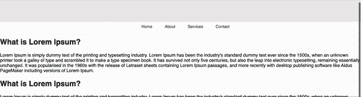

这是因为我们在 body 样式中将`overflow`属性设置为`hidden`。在这种情况下，任何子元素都不会坚持它的位置，因为父元素没有固定的高度，这使它受到约束，因为子元素不知道父元素何时离开视口。

你可以[在这里](https://www.terluinwebdesign.nl/en/css/position-sticky-not-working-try-overflow-clip-not-overflow-hidden/#:~:text=If%20you've%20ever%20tried,hidden%2C%20scroll%2C%20or%20auto.)阅读更多关于`overflow`的信息。

但是，在我们的情况下，我们可以简单地删除该属性，我们就可以了:

```
html,
body {
  width: 100%;
  margin: 0px;
  padding: 0px;
//   overflow-x: hidden; (deleted style)
}

```

在这之后，你会看到我们的导航条工作正常。

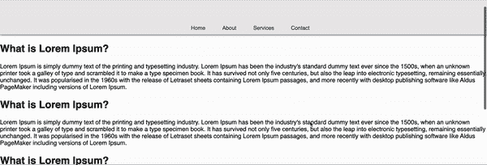

如果我们正在使用`position: sticky`，我们需要记住一些东西来使它正常工作。而`position: fixed`就不是这样了。一般来说，对于导航栏，使用`position: fixed`是因为它位于网页的顶部。但是，如果你想在网页中间修改一些关于其他元素的内容，`position: sticky`是一个不错的解决方案。

你可以在这里找到这个自定义粘性导航栏的 [CodePen 链接。](https://codepen.io/sarthk1012/pen/MWVJmpy)

## 结论

你可以只用 CSS 做很多事情。如果你在自定义导航条上看到教程或任何其他花哨的东西，你必须下载一些库或编写一些 JavaScript 代码，那么首先考虑其他替代方法，因为 JavaScript 不是唯一的方法！

## 你的前端是否占用了用户的 CPU？

随着 web 前端变得越来越复杂，资源贪婪的特性对浏览器的要求越来越高。如果您对监控和跟踪生产环境中所有用户的客户端 CPU 使用、内存使用等感兴趣，

[try LogRocket](https://lp.logrocket.com/blg/css-signup)

.

[](https://lp.logrocket.com/blg/css-signup)[https://logrocket.com/signup/](https://lp.logrocket.com/blg/css-signup)

LogRocket 就像是网络和移动应用的 DVR，记录你的网络应用或网站上发生的一切。您可以汇总和报告关键的前端性能指标，重放用户会话和应用程序状态，记录网络请求，并自动显示所有错误，而不是猜测问题发生的原因。

现代化您调试 web 和移动应用的方式— [开始免费监控](https://lp.logrocket.com/blg/css-signup)。