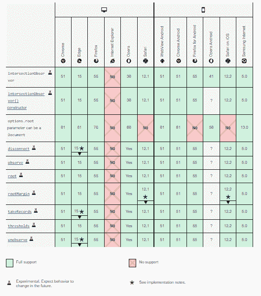
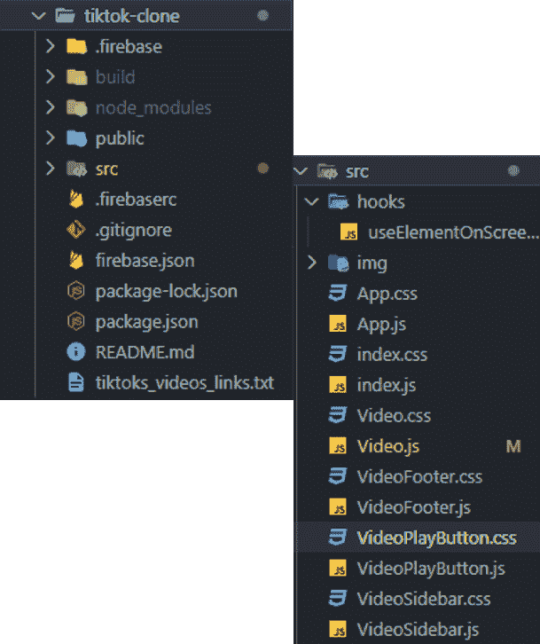
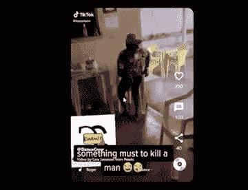

# 建立一个自定义的抖音自动播放反应钩与交叉观察员

> 原文：<https://blog.logrocket.com/build-custom-tiktok-autoplay-react-hook-intersection-observer/>

你有没有想过抖音、Instagram 或 Twitter 等社交媒体应用程序如何检测到视窗中的特定视频帖子，自动播放它，然后在它消失后立即停止它？

在本文中，我将通过创建一个用于抖音克隆的 React 定制钩子来解释如何使用 Intersection Observer 实现这个自动播放和暂停特性。

作为开发人员，您可能希望在视频播放器应用程序中实现自动播放功能，[延迟加载图像](https://blog.logrocket.com/lazy-loading-using-the-intersection-observer-api/)，或者检测广告何时出现在用户浏览器的视窗中。有了交叉点观察器，你可以做到所有这些。

## 什么是路口观察者？

Intersection Observer 是 JavaScript 浏览器 API，它异步监视 DOM 元素相对于客户端视口或根元素的位置。

### 交叉点观察器如何工作

基本上，交叉点观察器 API 在特定情况下触发回调函数。

这些情况包括当所选元素的位置进入客户端的视口时，当所选元素与父元素或根元素相交时，或者当最初声明观察点时。

### 规格和浏览器兼容性

在写这篇文章的时候，规范仍然是一个工作草案*。*不过，更新可以在[这里](https://w3c.github.io/IntersectionObserver/)找到。

至于浏览器兼容性，以下是当前的报告:



### 交叉点观测器的应用

交叉点观察器可以用于本文范围之外的各种应用程序。

它们包括 DOM 元素的可选渲染、 [l](https://blog.logrocket.com/lazy-loading-using-the-intersection-observer-api/) azy [l](https://blog.logrocket.com/lazy-loading-using-the-intersection-observer-api/) 加载、使用[无限滚动](https://blog.logrocket.com/react-hooks-infinite-scroll-advanced-tutorial/)按需加载内容、渲染广告和动画以及创建旋转木马。

我在本文中使用的例子(为抖音克隆创建一个自定义自动播放挂钩)可以帮助您熟悉交叉点观察器 API，以便开始探索它可以为您的应用程序提供的其他选项。

## 使用交叉点观察器

首先，我们想知道我们的浏览器是否支持交叉点观察器 API。

我们可以写一个条件来检查，像这样:

```
if ('IntersectionObserver' in window) {
    console.log("IntersectionObserver is supported!");
} else {
    console.log("IntersectionObserver is not supported!");
}

```

`ItersectionObserver`对象的结构通常是这样的:

```
let options= {
    root: null,
    rootMargin: '0px',
    threshold: 0.5
};

const callback = (entries){ // entries = array of targeted elements
    entries.forEach(entry=>{
        // what happens each entry
    })
}

let observerObj = new IntersectionObserver(callback, options);
observerObj.observe();

```

这里，`IntersectionObserver`对象接受两个参数。执行交叉点观察器后触发的`callback`功能，以及一个可选的`options`对象。这是一个具有某些属性的对象，这些属性决定交叉点观察点何时以及如何工作。

### `callback`功能

当执行`callback`功能时，交叉点观察器检查目标元素列表。这些元素都有特定的属性。

这些属性的示例包括:

*   `boundingClientRect`:
*   `intersectionRatio`:
*   `intersectionRect`
*   `isIntersecting`
*   `rootBounds`
*   `target`
*   `time`

这些属性用于检查当前元素相对于其根元素的行为。

在本文中，我们将使用 [`isIntersecting`](https://developer.mozilla.org/en-US/docs/Web/API/IntersectionObserverEntry/isIntersecting) 来检查当前条目是否与根相交。这将指示我们的视频在视窗中，因此准备开始播放。

### `options`物体

`options`对象包含以下属性:

默认情况下，`root`是浏览器的视窗，如果设置为`null`则为视窗。如果一个元素被指定为根元素，它必须是目标元素的父元素。根是目标元素在触发`callback`功能之前需要相交的部分

`rootMargin`在检测交集之前设置根元素周围的边距。默认情况下它是 0(当`root`属性进入视窗时触发动作)，但是如果你想让`callback`函数在不同的时刻发生，它可以用与 [CSS 边距](https://developer.mozilla.org/en-US/docs/Web/CSS/margin)相同的方式来赋值。

`threshold`表示在执行`callback`功能之前，目标元素应该与`root`相交的百分比。它可以是一个数字，也可以是一组数字；可接受的值范围从 0 到 1。

如果为 0，则意味着在执行`callback`函数之前，目标元素的第一个像素需要与`root`元素相交。如果是 0.5，50%的目标元素需要与`root`相交，依此类推。

## 瞄准要观察的元素

要用 JavaScript 定位一个元素，我们必须使用`querySelector`函数，它将在 DOM 中搜索给定的`id`或`class`。

在 React 中，我们可以使用`useRef`钩子来定位一个元素。然后，我们将`targetElement`作为一个参数传递给 observe 函数，如下所示:

```
/*
In JavaScript we can use querySelector to select a DOM element like this...
*/
let targetElement = document.querySelector('#item')
observerObj.observe(targetElement)

//In React we can use the useRef hook like this...
let targetRef = useRef(null); //Set a component to be ref of targetRef
let targetElement = targetRef.current
observerObj.observe(targetElement)

```

在抖音克隆中，我们将使用`useRef`钩子来定位每个视频组件，以便跟踪它何时进入视口。

# 在 React 中创建交叉点观察点自定义挂钩

为了创建一个可重用的交叉点观察器钩子，我们将创建一个名为`useElementOnScreen`的新函数，并使用我们作为道具传入的`options`和`targetRef`来实现交叉点观察器:

```
import { useEffect, useMemo, useState } from 'react'
const useElementOnScreen = (options, targetRef) => {
    const [isVisibile, setIsVisible] = useState()
    const callbackFunction = entries => {
        const [entry] = entries //const entry = entries[0]
        setIsVisible(entry.isIntersecting)
    }
    const optionsMemo = useMemo(() => {
        return options
    }, [options])
    useEffect(() => {
        const observer = new IntersectionObserver(callbackFunction, optionsMemo)
        const currentTarget = targetRef.current
        if (currentTarget) observer.observe(currentTarget)

        return () => {
        if(currentTarget) observer.unobserve(currentTarget)
        }
    }, [targetRef, optionsMemo])
    return isVisibile
}
export default useElementOnScreen 

```

理解了`options`和`targetRef`是什么之后，我们需要将它们作为道具传递给`useElementOnScreen`钩子，因为我们将需要它们作为新的交叉点观察器函数的参数。

* * *

### 更多来自 LogRocket 的精彩文章:

* * *

然后，我们将元素的默认状态设置为`null`。

在`callback`函数中，我们将`isVisible`状态设置为目标元素`isIntersecting`返回的值(我们总是期待`true`或`false`)。

观察完目标元素后，我们返回`isVisible`状态。`isVisible`的返回值是我们用来决定视频何时播放或停止的。

如果视频组件的`isVisible`状态是`true`,我们播放视频，否则如果是`false`,我们停止视频。

## 在抖音克隆中使用交叉点观察器自定义挂钩

### 设置应用程序

为了简洁起见，我创建了一个 starter 项目，其中包含了抖音克隆的全部源代码，我们将在其中实现我们刚刚在上面创建的交叉点观察器钩子。它可以在我的 [GitHub 库](https://github.com/wolz-CODElife/Tiktok-clone)中找到。

要开始运行应用程序，请在终端上打开一个新的工作文件夹，并运行以下命令:

```
git clone https://github.com/wolz-CODElife/Tiktok-clone.git

cd Tiktok-clone

npm install

```

在下载的文件夹中，应该存在以下文件和目录:



我们正在处理的文件和文件夹在`src`里面。如上所示，我已经在`hooks`目录中包含了我们在本文前一部分创建的交叉点观察器钩子。剩下要做的就是在抖音应用程序中导入`useElementOnScreen`钩子。

### 设置自动播放

现在，让我们更新`Video.js`组件，根据视频的可见性状态来播放和停止视频。

在`Video.js`文件中，放入以下代码:

```
import React, { useEffect, useRef, useState } from "react";
import "./Video.css";
import VideoFooter from "./VideoFooter";
import VideoSidebar from "./VideoSidebar";
import useElementOnScreen from './hooks/useElementOnScreen'
import VideoPlayButton from "./VideoPlayButton";
const Video = ({ url, channel, description, song, likes, messages, shares }) => {
  const [playing, setPlaying] = useState(false);
  const videoRef = useRef(null);
  const options = {
      root: null,
      rootMargin: '0px',
      threshold: 0.3
  }
  const isVisibile = useElementOnScreen(options, videoRef)
  const onVideoClick = () => {
    if (playing) {
      videoRef.current.pause();
      setPlaying(!playing);
    } else {
      videoRef.current.play();
      setPlaying(!playing);
    }
  };
  useEffect(() => {
    if (isVisibile) {
      if (!playing) {        
        videoRef.current.play();
        setPlaying(true)
      }
    }
    else {
      if (playing) {        
        videoRef.current.pause();
        setPlaying(false)
      }
    }
  }, [isVisibile])

  return (
    <div className="video">
      <video className="video_player" loop preload="true" ref={videoRef} onClick={onVideoClick} src={url}></video>
      <VideoFooter channel={channel} description={description} song={song} />
      <VideoSidebar likes={likes} messages={messages} shares={shares} />
      {!playing && <VideoPlayButton onVideoClick={onVideoClick} />}
    </div>
  );
};
export default Video;

```

这里，我们导入了自定义钩子(`useElementOnScreen`)，然后使用返回值(可以是`true`或`false`)作为`isVisible`值。

请注意，我们为交叉点观察点设置了以下选项:`root`是`null`，这意味着我们正在使用窗口作为父元素。`rootMargin`是`0px`,`threshold`是`0.3`，这意味着一旦 30%的目标元素在视口中，回调函数就被触发。

接下来，如果`isVisible`值改变，我们使用`UseEffect`来改变视频的`playing`状态，如下所示:

```
if (isVisibile) {
      if (!playing) {        
        videoRef.current.play();
        setPlaying(true)
      }
    }
    else {
      if (playing) {        
        videoRef.current.pause();
        setPlaying(false)
      }
    }

```

该代码意味着，如果视频可见，则`playing`状态被设置为`true`。如果还没有播放，并且视频不可见，则`playing`状态被设置为`false`。

完成后，我们可以使用以下代码运行应用程序:

```
npm start

```

如果一切顺利，我们应该有这样的东西:



如果您希望更改视频或甚至使用实时数据库，请编辑`App.js`中的`video`状态。

目前，我们有以下对象数组:

```
[
    {
      url: 'https://res.cloudinary.com/codelife/video/upload/v1633232723/tiktok-clone/tiktok2_qxafx3.mp4',
      channel: 'DanceCrew',
      description: 'Video by Lara Jameson from Pexels',
      song: 'Bounce - Ruger',
      likes: 250,
      messages: 120,
      shares: 40
    },
    {
      url: 'https://res.cloudinary.com/codelife/video/upload/v1633232725/tiktok-clone/tiktok1_np37xq.mp4',
      channel: 'Happyfeet',
      description: '#happyfeetlegwork videos on TikTok',
      song: 'Kolo sound - Nathan',
      likes: 250,
      messages: 120,
      shares: 40
    },
    {
      url: 'https://res.cloudinary.com/codelife/video/upload/v1633232726/tiktok-clone/tiktok3_scmwvk.mp4',
      channel: 'thiskpee',
      description: 'The real big thug boys💛🦋 The real big thug boys💛🦋 ',
      song: 'original sound - KALEI KING 🦋',
      likes: 250,
      messages: 120,
      shares: 40
    },
  ]

```

# 结论

成功创建应用程序后，我们应该已经了解了 Intersection Observer 的工作原理，以及如何使用它来实现类似于抖音或 Instagram 中的自动播放功能。

有了这些知识，您可以尝试实现延迟加载图像、旋转木马甚至无限滚动的博客订阅页面！

你可以点击这里查看我的抖音克隆人的现场演示。我建议在桌面浏览器上观看，以获得最佳体验。

如果您有任何问题或意见，请随时在评论中告诉我。

## 使用 [LogRocket](https://lp.logrocket.com/blg/signup) 消除传统错误报告的干扰

[](https://lp.logrocket.com/blg/signup)

[LogRocket](https://lp.logrocket.com/blg/signup) 是一个数字体验分析解决方案，它可以保护您免受数百个假阳性错误警报的影响，只针对几个真正重要的项目。LogRocket 会告诉您应用程序中实际影响用户的最具影响力的 bug 和 UX 问题。

然后，使用具有深层技术遥测的会话重放来确切地查看用户看到了什么以及是什么导致了问题，就像你在他们身后看一样。

LogRocket 自动聚合客户端错误、JS 异常、前端性能指标和用户交互。然后 LogRocket 使用机器学习来告诉你哪些问题正在影响大多数用户，并提供你需要修复它的上下文。

关注重要的 bug—[今天就试试 LogRocket】。](https://lp.logrocket.com/blg/signup-issue-free)

## [LogRocket](https://lp.logrocket.com/blg/react-signup-general) :全面了解您的生产 React 应用

调试 React 应用程序可能很困难，尤其是当用户遇到难以重现的问题时。如果您对监视和跟踪 Redux 状态、自动显示 JavaScript 错误以及跟踪缓慢的网络请求和组件加载时间感兴趣，

[try LogRocket](https://lp.logrocket.com/blg/react-signup-general)

.

[ ](https://lp.logrocket.com/blg/react-signup-general) [](https://lp.logrocket.com/blg/react-signup-general) 

LogRocket 结合了会话回放、产品分析和错误跟踪，使软件团队能够创建理想的 web 和移动产品体验。这对你来说意味着什么？

LogRocket 不是猜测错误发生的原因，也不是要求用户提供截图和日志转储，而是让您回放问题，就像它们发生在您自己的浏览器中一样，以快速了解哪里出错了。

不再有嘈杂的警报。智能错误跟踪允许您对问题进行分类，然后从中学习。获得有影响的用户问题的通知，而不是误报。警报越少，有用的信号越多。

LogRocket Redux 中间件包为您的用户会话增加了一层额外的可见性。LogRocket 记录 Redux 存储中的所有操作和状态。

现代化您调试 React 应用的方式— [开始免费监控](https://lp.logrocket.com/blg/react-signup-general)。