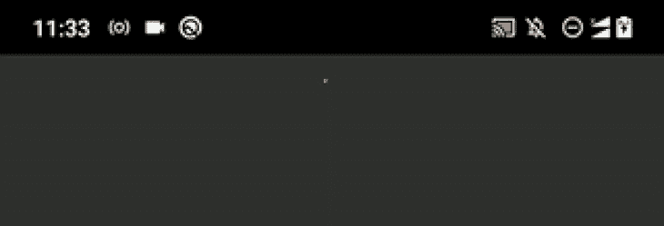
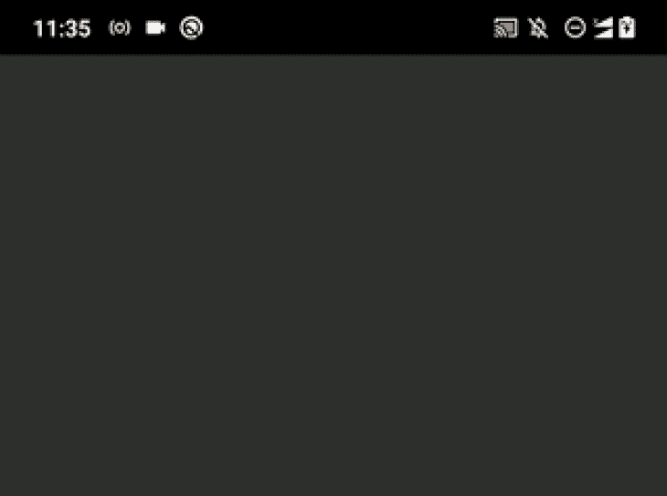
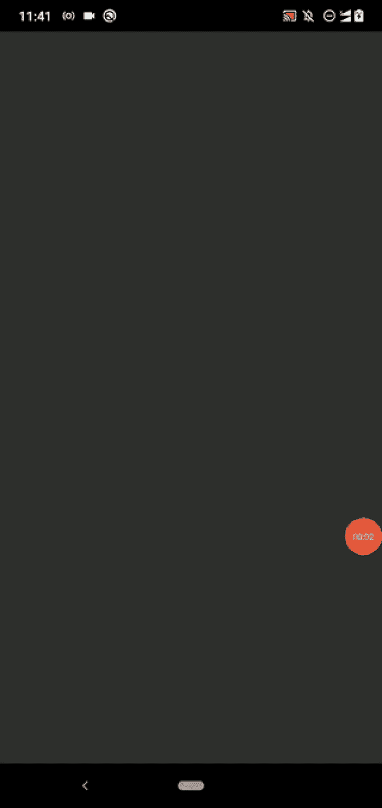
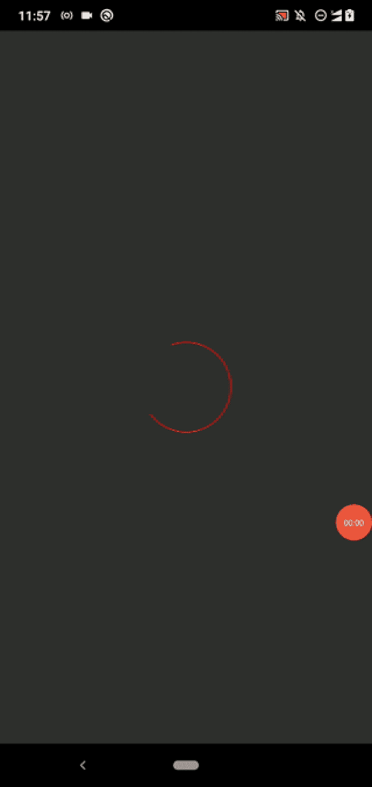
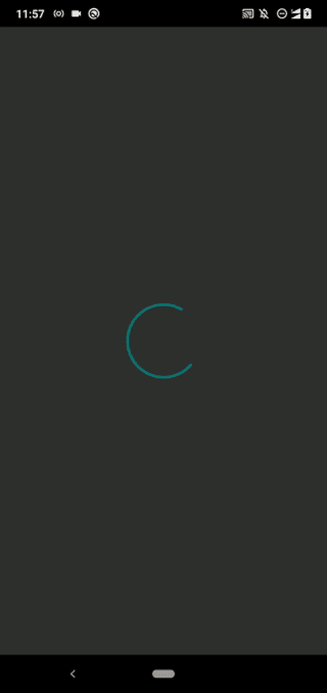

# 如何建立一个定制的 React 本地活动指示器

> 原文：<https://blog.logrocket.com/build-customized-react-native-activity-indicator/>

移动应用通常为用户提供各种 GUI 元素来执行操作。例如，在通过输入字段输入登录凭据后，您可以单击按钮登录到特定的应用程序。当我们考虑响应时间时，移动应用通常以两种方式之一响应用户操作:

1.  开发人员不需要用额外的 UI 元素来指示特定用户动作的状态
2.  在延迟中，开发者应该显示特定事件的当前状态，以避免用户认为应用程序被卡住或损坏

React Native 提供 [`ActivityIndicator`](https://reactnative.dev/docs/activityindicator) 来显示一个循环加载指示器，以获得更长的动作响应时间。`ActivityIndicator`播放特定于平台的无限循环加载动画，因此您可以在任何需要指示延迟响应的地方使用它。

我们可以通过多种方式定制`ActivityIndicator`以适应任何应用。在本教程中，我将通过实际例子说明如何以各种方式定制和使用它。此外，我将向您展示一些使用几个第三方库和内置 API 来显示定制的跨平台活动指示器的替代方法。

*向前跳转:*

## 教程概述:React 本机`ActivityIndicator`定制

我们将构建一个简单的应用程序，列出一些水果名称来演示`ActivityIndicator`定制。该应用程序通过一个异步功能加载数据，该功能创建一个人工的两秒钟延迟来模拟网络延迟。我们将在这两秒钟的延迟期间显示活动指示器，以指示装载状态。

您可以创建一个新项目，也可以在现有项目中使用以下代码。如果您想在新项目中尝试即将出现的代码片段，请使用以下命令创建一个:

```
npx react-native init ActivityIndicatorExample
cd ActivityIndicatorExample

```

项目设置完成后，运行应用程序以确保一切正常:

```
npx react-native run-android
# --- or ---
npx react-native run-ios

```

## 一个基本的`ActivityIndicator`例子

我们计划创建一个应用程序来有条件地显示/隐藏负载指示器，但是先连续显示负载指示器来看看它是什么怎么样？将以下代码粘贴到您的`App.js`文件中:

```
import React from 'react';
import {
  SafeAreaView,
  ActivityIndicator,
} from 'react-native';

function App() {
  return (
    <SafeAreaView>
      <ActivityIndicator/>
    </SafeAreaView>
  );
};

export default App;

```

上面的代码总是呈现一个循环指示器。如果可能的话，在 Android 和 iOS 平台上查看该应用程序。您将看到一个圆形指示器元素，其样式基于您当前的操作系统。查看它在 Android 上的外观:



指标看起来有点小吧？默认情况下，React Native 会显示一个小的活动指示器，但您可以按如下方式放大它:

```
<ActivityIndicator size="large"/>

```

现在，您将看到一个稍微放大的指示器动画，如下所示:


## 如何显示/隐藏活动指示器

如果你查看[官方文档](https://reactnative.dev/docs/activityindicator#animating)，你会注意到我们可以使用`animating`道具来显示和隐藏指示器，但是它不会删除你在视窗中为活动指示器分配的空间。因此，有条件地显示指示器组件——用一个`if`语句、`&&`操作符或三元操作符——是一个很好的选择。

让我们构建我之前提到的 app 来理解条件渲染。用以下代码更新您的`App.js`文件:

```
import React, { useState, useEffect } from 'react';
import {
  SafeAreaView,
  FlatList,
  ActivityIndicator,
  StyleSheet,
  Text,
  View,
} from 'react-native';

async function getItems() {
  await new Promise((resolve) => setTimeout(resolve, 2000));
  return ['Apple', 'Banana'];
}

function Item({ name }) {
  return (
    <View style={styles.item}>
      <Text style={styles.itemText}>{name}</Text>
    </View>
  );
}

function App() {
  const [items, setItems] = useState([]);
  const [loading, setLoading] = useState(true);

  useEffect(() => {
    getItems().then((items) => {
      setItems(items);
      setLoading(false);
    });
  }, []);

  const renderItem = ({ item }) => (
    <Item name={item}/>
  );
  return (
    <SafeAreaView style={styles.container}>
     { loading ?
      <ActivityIndicator size="large"/> :
      <FlatList
        data={items}
        renderItem={renderItem}
      /> }
    </SafeAreaView>
  );
};

const styles = StyleSheet.create({
  container: {
    flex: 1,
  },
  item: {
    backgroundColor: '#888',
    padding: 12,
    marginBottom: 12
  },
  itemText: {
    color: '#fff',
    fontSize: 24,
  }
});

export default App;

```

如前所述，我们使用两秒钟的延迟来模拟网络延迟，因此在显示活动指示器两秒钟后，我们将显示水果列表。

看看我们从`App`组件返回了什么:

```
<SafeAreaView style={styles.container}>
     { loading ?
      <ActivityIndicator size="large"/> :
      <FlatList
        data={items}
        renderItem={renderItem}
      /> }
</SafeAreaView>

```

这里，如果`loading`状态变量是`true`，我们显示`ActivityIndicator`；否则，我们显示`FlatList`组件，因为加载状态已经结束。像往常一样，我们对两个条件组件使用相同的`SafeAreaView`包装器。

运行项目。在循环加载动画后，您将看到水果列表，如以下预览所示:



## 如何正确定位活动指标

您可以通过相应地定位 GUI 元素来提高您的移动应用程序的 UI/UX 质量——这就是为什么每个移动开发人员都努力以最佳方式在应用程序中排列按钮、输入字段和其他 GUI 元素。活动指示器也是一个 GUI 元素，因此正确定位它是非常重要的。

`ActivityIndicator`组件接受`View`道具，所以我们不需要用另一个`View`包装我们的`ActivityIndicator`，因为我们通常会将位置样式应用于`Button`组件。

您可以为圆形指示器使用固定的边距，如下所示。将以下样式对象添加到样式表中:

```
indicator: {
  marginTop: 100
}

```

接下来，在应用程序布局中使用新添加的样式定义:

```
<ActivityIndicator size="large" style={styles.indicator}/>

```

现在，用户会立即注意到指示器:


您也可以通过以下设置使圆形指示器居中:

```
indicator: {
  flex: 1
}

```

现在，您将在屏幕中央看到加载动画:


尝试使用`View`样式适当调整活动指示器的位置。对于一个复杂的应用程序，如果您同时加载多个列表的数据，您可以为每个指示器元素使用紧密的上下边距，以避免不必要的空白。

## 使用活动指示器元素添加状态文本

在某些场景下，用户无法预测为什么 app 长时间显示加载动画。在我们的例子中，我们没有显示水果列表应用程序的标题，所以我们的用户猜不到为什么我们要显示加载指示器。但是，如果我们显示一个标题(即水果)并在标题旁边显示活动指示器动画，用户可以直观地看到水果列表仍在加载。

让我们添加一个状态文本，让我们的用户清楚！将以下代码添加到您的`App.js`文件中:

```
import React, { useState, useEffect } from 'react';
import {
  SafeAreaView,
  FlatList,
  ActivityIndicator,
  StyleSheet,
  Text,
  View,
} from 'react-native';

async function getItems() {
  await new Promise((resolve) => setTimeout(resolve, 2000));
  return ['Apple', 'Banana', 'Orange', 'Pineapple', 'Mango', 'Kiwi'];
}

function Item({ name }) {
  return (
    <View style={styles.item}>
      <Text style={styles.itemText}>{name}</Text>
    </View>
  );
}

function LoadingAnimation() {
  return (
    <View style={styles.indicatorWrapper}>
      <ActivityIndicator size="large" style={styles.indicator}/>
      <Text style={styles.indicatorText}>Loading fruits...</Text>
    </View>
  );
}

function App() {
  const [items, setItems] = useState([]);
  const [loading, setLoading] = useState(true);

  useEffect(() => {
    getItems().then((items) => {
      setItems(items);
      setLoading(false);
    });
  }, []);

  const renderItem = ({ item }) => (
    <Item name={item}/>
  );

  return (
    <SafeAreaView style={styles.container}>
     { loading ?
      <LoadingAnimation/> :
      <FlatList
        data={items}
        renderItem={renderItem}
      /> }
    </SafeAreaView>
  );
};

const styles = StyleSheet.create({
  container: {
    flex: 1,
  },
  item: {
    backgroundColor: '#888',
    padding: 12,
    marginBottom: 12,
    marginLeft: 8,
    marginRight: 8,
  },
  itemText: {
    color: '#fff',
    fontSize: 24,
  },
  indicatorWrapper: {
    flex: 1,
    alignItems: 'center',
    justifyContent: 'center',
  },
  indicator: {},
  indicatorText: {
    fontSize: 18,
    marginTop: 12,
  },
});

export default App;

```

我们用一个`View`包装了`ActivityIndicator`组件，还添加了一个`Text`组件。我们已经将这些组件添加到一个新组件`LoadingAnimation`中，因此我们可以在任何地方将它作为一个可重用的组件使用，并且`App`组件也是干净的。此外，我们还更改了加载指示器文本的字体大小和边距，以提高 UI 质量。

运行应用程序。现在，您可以看到状态文本以及循环加载动画，如以下预览所示:


在这种情况下，活动指示器会在两秒钟后消失，但在一些真实的情况下，网络流量较大的用户可能需要等待几分钟。在这些情况下，您可以动态地更改状态文本，以包含一条友好的消息来让用户了解最新情况。对于后端问题，您也可以显示适当的错误消息，而不是持续显示活动指示器。

## 自定义活动指示器的外观

我们已经知道如何用`size`属性改变指示器元素的大小。但是`ActivityIndicator`接受`View`样式，所以也可以定制它的背景颜色、不透明度、边框、边距、填充等等。

React Native 还允许您更改活动指示器元素的颜色。例如，您可以覆盖默认的系统主题颜色，如下所示:

```
<ActivityIndicator size="large" color="#bb5533" style={styles.indicator}/>

```

现在，您可以看到指示器元素的自定义颜色:



现在，让我们调整背景颜色、边框和填充。对当前样式表中的`indicator`使用以下设置:

```
indicator: {
  padding: 12,
  backgroundColor: '#555',
  borderRadius: 12
},

```

看 app。现在，您将看到一个带有背景层的指示器，如下所示:


多应用`View`风格，尝试打造各种定制化的活动指标。

### 为活动指示器使用主题颜色

React 本地应用通常支持两种系统主题:黑暗和光明。一些开发者开发的应用支持两个以上的主题。如今，大多数 React 本地开发人员使用内置的[外观模块](https://reactnative.dev/docs/appearance)的`[useColorScheme]([https://reactnative.dev/docs/usecolorscheme](https://reactnative.dev/docs/usecolorscheme))`钩子来处理明暗主题相关的样式。

请看下面的代码片段示例:

```
import React from 'react';
import {
  SafeAreaView,
  ActivityIndicator,
  useColorScheme,
} from 'react-native';

const Colors = {
  light: {
    indicator: '#000',
    container: '#fff',
  },
  dark: {
    indicator: '#fff',
    container: '#000',
  },
};

function App() {
  const theme = useColorScheme();
  const colors = Colors[theme];

  return (
    <SafeAreaView style={{ flex: 1, backgroundColor: colors.container}}>
      <ActivityIndicator
        size="large"
        color={colors.indicator}/>
    </SafeAreaView>
  );
};

export default App;

```

在这里，我们根据当前主题更改活动指示器的颜色，因此一旦您运行该应用程序，您将看到基于当前主题的活动指示器的反转颜色。例如，如果你在黑暗模式下测试应用程序，你会看到一个白色的活动指示器，反之亦然。

你可以从[这篇文章](https://blog.logrocket.com/comprehensive-guide-dark-mode-react-native/)中了解更多关于暗/亮主题的知识。

## 修改活动指示器动画

`ActivityIndicator`组件不允许开发人员改变它的默认动画，因为底层的、特定于平台的 UI 元素总是播放系统定义的循环加载动画。但是，您可以使用`setInterval`更改指示器的大小和颜色，以定制其默认动画。

再把我们的果单 app 带回来。查看它如何切换指示器的颜色:

```
import React, { useState, useEffect } from 'react';
import {
  SafeAreaView,
  FlatList,
  ActivityIndicator,
  StyleSheet,
  Text,
  View,
} from 'react-native';

async function getItems() {
  await new Promise((resolve) => setTimeout(resolve, 3000));
  return ['Apple', 'Banana', 'Orange', 'Pineapple', 'Mango', 'Kiwi'];
}

function Item({ name }) {
  return (
    <View style={styles.item}>
      <Text style={styles.itemText}>{name}</Text>
    </View>
  );
}

function LoadingAnimation() {
  const [color, setColor] = useState('teal');
  useEffect(() => {
    const id = setInterval(() => {
      setColor((color) => color == 'teal' ? 'royalblue' : 'teal');
    }, 700);
    return () => clearInterval(id);
  }, []);

  return (
    <View style={styles.indicatorWrapper}>
      <ActivityIndicator size="large" color={color} style={styles.indicator}/>
      <Text style={styles.indicatorText}>Loading fruits...</Text>
    </View>
  );
}

function App() {
  const [items, setItems] = useState([]);
  const [loading, setLoading] = useState(true);

  useEffect(() => {
    getItems().then((items) => {
      setItems(items);
      setLoading(false);
    });
  }, []);

  const renderItem = ({ item }) => (
    <Item name={item}/>
  );

  return (
    <SafeAreaView style={styles.container}>
     { loading ?
      <LoadingAnimation/> :
      <FlatList
        data={items}
        renderItem={renderItem}
      /> }
    </SafeAreaView>
  );
};

const styles = StyleSheet.create({
  container: {
    flex: 1,
  },
  item: {
    backgroundColor: '#888',
    padding: 12,
    marginBottom: 12,
    marginLeft: 8,
    marginRight: 8,
  },
  itemText: {
    color: '#fff',
    fontSize: 24,
  },
  indicatorWrapper: {
    flex: 1,
    alignItems: 'center',
    justifyContent: 'center',
  },
  indicator: {},
  indicatorText: {
    fontSize: 18,
    marginTop: 12,
  },
});

export default App;

```

这里我们用`setInterval`功能切换指示器的颜色。运行该应用程序后，您将看到一个修改后的动画:


通过扩展上述代码(即使用`colors`作为道具)，尝试创建一个支持可配置动画颜色的自定义活动指示器。您可以动态更改大小、背景颜色、边框和其他造型道具来定制其动画。我将在本文最后解释如何用 React Native 的[动画 API](https://reactnative.dev/docs/animations#animated-api) 改变造型道具。

## 分层活动指标

### 用`View`覆盖

在某些场景中，我们需要在其他 GUI 元素上显示活动指示器。你可以使用一个`View`覆盖或者一个`Modal`来实现这样的指示器。

首先，让我们通过修改前面的水果列表应用程序来实现一个带有`View`覆盖的活动指示器。将以下代码添加到您的`App.js`文件中:

```
import React, { useState, useEffect } from 'react';
import {
  SafeAreaView,
  FlatList,
  ActivityIndicator,
  StyleSheet,
  Text,
  View,
} from 'react-native';

async function getItems() {
  await new Promise((resolve) => setTimeout(resolve, 3000));
  return ['Apple', 'Banana', 'Orange', 'Pineapple', 'Mango', 'Kiwi'];
}

function Item({ name }) {
  return (
    <View style={styles.item}>
      <Text style={styles.itemText}>{name}</Text>
    </View>
  );
}

function LoadingAnimation() {
  return (
    <View style={styles.indicatorWrapper}>
      <ActivityIndicator size="large"/>
      <Text style={styles.indicatorText}>Loading fruits...</Text>
    </View>
  );
}

function App() {
  const [items, setItems] = useState(['Pineapple', 'Mango', 'Kiwi']);
  const [loading, setLoading] = useState(true);

  useEffect(() => {
    getItems().then((items) => {
      setItems(items);
      setLoading(false);
    });
  }, []);

  const renderItem = ({ item }) => (
    <Item name={item}/>
  );

  return (
    <SafeAreaView style={styles.container}>
      <FlatList
        data={items}
        renderItem={renderItem}
      />
      { loading && <LoadingAnimation/> }
    </SafeAreaView>
  );
};

const styles = StyleSheet.create({
  container: {
    flex: 1,
  },
  item: {
    backgroundColor: '#888',
    padding: 12,
    marginBottom: 12,
    marginLeft: 8,
    marginRight: 8,
  },
  itemText: {
    color: '#fff',
    fontSize: 24,
  },
  indicatorWrapper: {
    position: 'absolute',
    left: 0,
    right: 0,
    top: 0,
    bottom: 0,
    alignItems: 'center',
    justifyContent: 'center',
    backgroundColor: 'rgba(100, 100, 100, 0.6)',
  },
  indicatorText: {
    fontSize: 18,
    marginTop: 12,
  },
});

export default App;

```

我们对之前的水果清单应用程序进行了以下更改:

*   最初显示了带有一些数据的`FlatList`组件，并让它在三秒钟后检索新数据
*   通过应用某种透明的背景色并将位置设为绝对，将指示器的包装器`View`组件转换为覆盖图

现在，您将在叠层上看到活动指示器，如以下预览所示:


在反应固有模态中

### 之前，我们用各种位置样式道具实现了一个覆盖，但是我们可以用预构建的`Modal`组件实现相同的结果，只需使用较少的样式相关代码。让我们复制前面的代码并使用`Modal`组件。

首先，将`Modal`添加到您的导入中:

对`indicatorWrapper`使用以下样式代码:

```
import {
  SafeAreaView,
  FlatList,
  ActivityIndicator,
  StyleSheet,
  Text,
  View,
  Modal,
} from 'react-native';

```

接下来，对`LoadingAnimation`使用以下实现:

```
indicatorWrapper: {
  flex: 1,
  alignItems: 'center',
  justifyContent: 'center', 
  backgroundColor: 'rgba(100, 100, 100, 0.6)',
},

```

一旦您运行该应用程序，您将看到与基于`View`的覆盖实现相同的结果。基于`View`的叠加和基于`Modal`的看起来一样，但是你可以用`Modal`做更多的事情，比如[添加过渡动画](https://reactnative.dev/docs/modal#animationtype)或者[附加回调](https://reactnative.dev/docs/modal#onshow)。

```
function LoadingAnimation() {
  return (
    <Modal transparent={true}>
      <View style={styles.indicatorWrapper}>
        <ActivityIndicator size="large"/>
        <Text style={styles.indicatorText}>Loading fruits...</Text>
      </View>
    </Modal>
  );
}

```

了解更多关于 React Native `Modal`与[这篇文章](https://blog.logrocket.com/creating-a-pop-up-modal-in-react-native/)。

使用活动指标库

## 内置的框架组件有时会有限制，所以开发人员社区倾向于为特定的用例创建库。内置的`ActivityIndicator`组件使用了安卓上的[一个中级进程](https://developer.android.com/reference/android/widget/ProgressBar#indeterminate-progress) GUI 元素。在 iOS 上，它使用的是`[UIActivityIndicatorView]([https://developer.apple.com/documentation/uikit/uiactivityindicatorview](https://developer.apple.com/documentation/uikit/uiactivityindicatorview))`苹果 SDK 元素。这些特定于平台的 GUI 元素根据操作系统的 UI/UX 定义显示循环加载指示器，它们不会为应用程序开发人员提供灵活的定制。

例如，你不能用内置的活动指示器创建一个三点负载指示器。因此，如果您不喜欢特定于平台的活动指示器，您将不得不使用第三方库或构建自己的自定义活动指示器。

让我们讨论如何用社区图书馆创建现代的、定制的活动指示器。

用 react-native-progress 创建基于 SVG 的活动指示器

### [`react-native-progress`库](https://github.com/oblador/react-native-progress)提供了现代的、跨平台的进度指示器，比如圆形和条形装载机。每个进度指示器支持各种道具进行定制，库使用 [`react-native-svg`库](https://github.com/react-native-svg/react-native-svg)在 app 屏幕上渲染定制的活动指示器元素。

创建一个新的 React 本地项目来测试我们选择的进度指示器库:

接下来，安装库:

```
npx react-native init ProgressIndicatorLibs
cd ProgressIndicatorLibs

```

现在，将以下代码添加到您的`App.js`文件中，以实现一个简单的循环活动指示器:

```
npm install react-native-progress
# --- or ---
yarn add react-native-progress

```

运行应用程序。与内置的特定于平台的`ActivityIndicator`相比，您将看到一个不同的循环加载指示器:

```
import React from 'react';
import {
  SafeAreaView,
} from 'react-native';
import * as Progress from 'react-native-progress';

function App() {
  return (
    <SafeAreaView style={{ flex: 1, alignItems: 'center', justifyContent: 'center' }}>
      <Progress.Circle
        size={100}
        color="red"
        indeterminate={true}
        endAngle={0.7} />
    </SafeAreaView>
  );
};

export default App;

```



尝试为`endAngle`道具设置一个较低的值——然后你会看到一个较短的圆周段。

这个库提供了另外三种进度指示器类型:`Bar`、`CircleSnail`和`Pie`。例如，您可以使用`CircleSnail`组件创建一个未来的多色活动指示器。请看下面的代码片段:

一旦您将上面的代码片段与之前的项目源一起使用，您将会看到以下结果:

```
<Progress.CircleSnail
  size={100}
  color={['teal', 'royalblue']}
/>

```



您可以使用`progress`按钮显示首选进度值。查看[库的 GitHub 自述文件](https://github.com/oblador/react-native-progress/blob/master/README.md)，查看所有支持的道具和指示器类型。

使用 react-native-loading-spinner-overlay 创建指示器覆盖

### 前面，我们通过编写一些实现代码，显示了一个指示器元素以及一个`View`覆盖图和`Modal`。你可以使用一个预先实现的基于`Modal`的覆盖图和 [`react-native-loading-spinner-overlay`库](https://github.com/ladjs/react-native-loading-spinner-overlay)。

首先，安装库以开始:

现在，将库与之前的水果列表应用程序一起使用:

```
npm install react-native-loading-spinner-overlay
# --- or ---
yarn add react-native-loading-spinner-overlay

```

上面的代码将显示一个基于`Modal`的指示器元素，正如我们在前面的实现中看到的。

```
import React, { useState, useEffect } from 'react';
import {
  SafeAreaView,
  FlatList,
  StyleSheet,
  Text,
  View,
} from 'react-native';
import Spinner from 'react-native-loading-spinner-overlay';

async function getItems() {
  await new Promise((resolve) => setTimeout(resolve, 2000));
  return ['Apple', 'Banana', 'Orange', 'Pineapple', 'Mango', 'Kiwi'];
}

function Item({ name }) {
  return (
    <View style={styles.item}>
      <Text style={styles.itemText}>{name}</Text>
    </View>
  );
}

function App() {
  const [items, setItems] = useState(['Pineapple', 'Mango', 'Kiwi']);
  const [loading, setLoading] = useState(true);

  useEffect(() => {
    getItems().then((items) => {
      setItems(items);
      setLoading(false);
    });
  }, []);

  const renderItem = ({ item }) => (
    <Item name={item}/>
  );

  return (
    <SafeAreaView style={styles.container}>
      <FlatList
        data={items}
        renderItem={renderItem}
      />
      { loading && <Spinner
        visible={true}
        textContent="Loading fruits..."
        /> }
    </SafeAreaView>
  );
};

const styles = StyleSheet.create({
  container: {
    flex: 1,
  },
  item: {
    backgroundColor: '#888',
    padding: 12,
    marginBottom: 12,
    marginLeft: 8,
    marginRight: 8,
  },
  itemText: {
    color: '#fff',
    fontSize: 24,
  },
});

export default App;

```

创建定制指示器的其他可选库包括
`react-native-progress`和`react-native-loading-spinner-overlay`，这是两个用于创建定制活动指示器的流行库。像任何其他 npm 包一样，我们也可以为这个场景找到一些替代库。查看以下备选库:

根据你的用户界面/UX 需求选择一个。

创建您自己的活动指示器元素

## 我们已经讨论了如何通过修改内置的`ActivityIndicator`组件来创建定制的活动指示器，并且我们已经检查了两个第三方活动指示器库。在一些罕见的情况下，由于它们的局限性，这些方法可能无法满足您的 UI/UX 需求。然后，你可以用 [React 本地动画 API](https://blog.logrocket.com/implementing-3d-animations-react-native/) 根据你严格的 UI/UX 原则创建你自己的活动指示器。

这个例子是关于从头开始构建一个活动指示器组件。我将与您共享它的源代码，并且只解释基本的事实，以保持这一部分的简短。

从[这个 GitHub 库](https://github.com/codezri/react-native-custom-activity-indicator)中克隆或下载自定义活动指示器源。

安装依赖项:

运行应用程序。现在，您将看到一个动画圆圈作为活动指示器，如以下预览所示:

```
npm install
# --- or ---
yarn install

```


打开`App.js`文件，查看以下基本事实:

`CustomActivityIndicator`组件通过动画 API 呈现带有`Animated.View`的动画

*   源代码用`Animated.timing`定义两个动画，用`Animated.sequence`创建一个帧序列，用`Animated.loop`开始一个动画循环
*   我们通过`scaleX: scaleAnim, scaleY: scaleAnim`样式定义不断扩大和缩小圆圈
*   动画定义使用内置的[缓动模块](https://reactnative.dev/docs/easing)来制作流畅、现代的动画
*   你可以通过移除`scaleY: scaleAnim`代码段来制作一个硬币旋转动画。也可以通过删除`scaleX: scaleAnim`代码段来制作抛硬币动画。通过使用不同的缓动测量和配置开始/结束动画帧定义，根据需要调整圆的动画。

您可以通过使用动画 API 制作`View`样式的动画来创建自己的活动指示器。如果你需要画更高级的动画形状，而`View`风格不能满足你的设计要求，我推荐使用`react-native-svg`库。

结论

## 我们已经讨论了使用内置的`ActivityIndicator`组件和社区库创建定制的活动指示器。我还向您展示了如何使用动画 API 开发自己的活动指示器。

在选择第三方活动指标包之前，也要检查替代指标库。大多数开发人员使用不确定的动画，因为很难预测特定事件的完成时间。例如，如果我们从 RESTful API 加载一些数据，由于网络流量的不确定性，我们无法估计何时会收到响应。

尽管如此，如果您显示确定事件的进度，会更加用户友好。例如，当我们复制、移动或删除多个文件时，几乎所有的文件管理器应用程序都显示带有进度条元素的实时进度，而不是不确定的循环动画。

大多数现代应用程序事件通常会立即或在几秒钟后完成，因此使用不确定的循环加载动画应该更适合几乎所有的用例。正如我们在本教程中学到的那样，确保根据您的偏好对其进行定制。

[LogRocket](https://lp.logrocket.com/blg/react-native-signup) :即时重现 React 原生应用中的问题。

## [LogRocket](https://lp.logrocket.com/blg/react-native-signup) 是一款 React 原生监控解决方案，可帮助您即时重现问题、确定 bug 的优先级并了解 React 原生应用的性能。

[](https://lp.logrocket.com/blg/react-native-signup)

LogRocket 还可以向你展示用户是如何与你的应用程序互动的，从而帮助你提高转化率和产品使用率。LogRocket 的产品分析功能揭示了用户不完成特定流程或不采用新功能的原因。

开始主动监控您的 React 原生应用— [免费试用 LogRocket】。](https://lp.logrocket.com/blg/react-native-signup)

Start proactively monitoring your React Native apps — [try LogRocket for free](https://lp.logrocket.com/blg/react-native-signup).