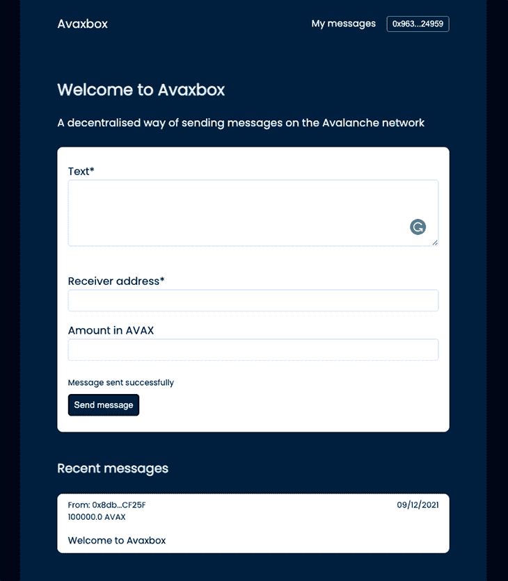
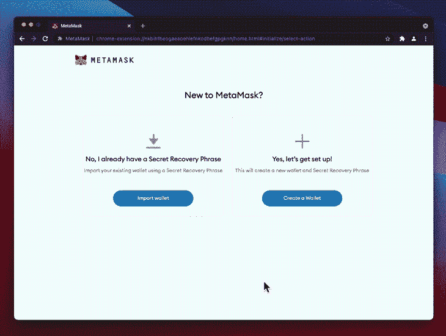
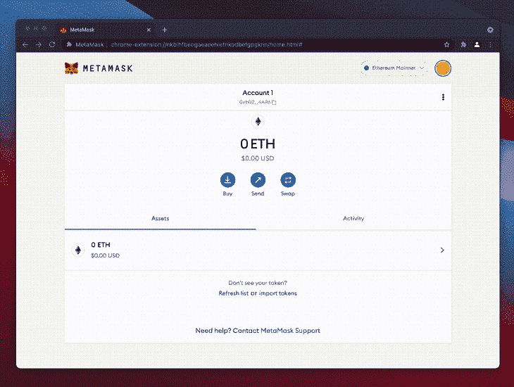
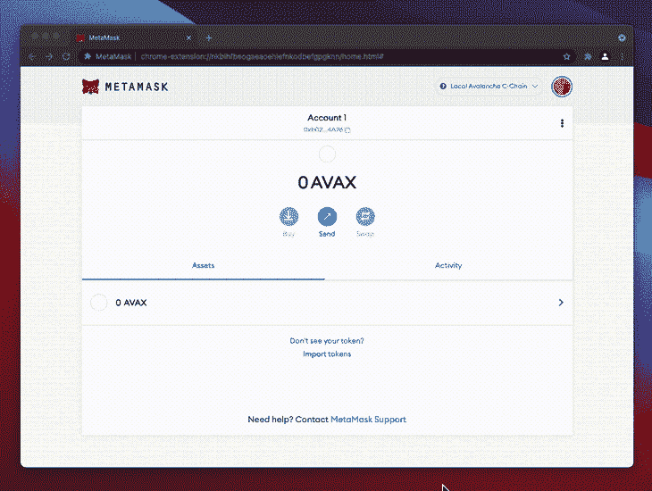
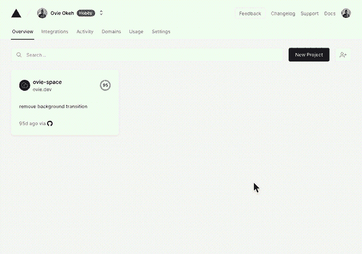

# 在雪崩上建造一个 DApp:一个完整的指南

> 原文：<https://blog.logrocket.com/build-dapp-avalanche-complete-guide/>

越来越多的人采用 Web3，这导致了一场疯狂的争夺:谁能在不影响去中心化的情况下建设最快、最安全的区块链。

以太坊是目前最流行的区块链，拥有最多的开发者。这种创新和采用的大规模增长已经将与以太坊区块链互动的财务成本推到了荒谬的高水平。

如果你曾经尝试铸造 NFT 或者在 UniSwap 这样的 DEX 上交换代币，你就会知道执行简单的交易会有多昂贵。Avalanche 旨在解决这个问题以及更多问题。

## 什么是雪崩？

> Avalanche 是一个开源平台，用于在一个可互操作、高度可扩展的生态系统中启动分散式金融(DeFi)应用程序和企业区块链部署。

[雪崩是区块链的区块链](https://www.avax.network/)。它不是像以太坊或卡尔达诺那样的单一区块链。相反，它是三种不同区块链的组合，每一种都有其特定的用例。这些区块链是:

1.  Exchange (X)链—资产的创建、管理和交易
2.  平台(P)链——子网管理和验证器协调
3.  契约(C)链—智能契约的以太坊虚拟机(EVM)的副本

出于本教程的目的，我们将重点关注契约(C)链，因为它促进了雪崩网络上的智能契约。要了解每个链的功能，请查看 [Avalanche 平台概述。](https://docs.avax.network/learn/platform-overview)

### 那么，什么是契约(C)链呢？

如上所述，C 链是 EVM 的副本，它支持创建[智能合约](https://blog.logrocket.com/writing-smart-contracts-solidity/)。它声称提供更高的速度、更高的吞吐量、更低的费用和更短的交易确认时间。

这是因为，与以太坊不同，C 链基于[利害关系证明(PoS)，而不是工作证明(PoW)](https://www.coinbase.com/learn/crypto-basics/what-is-proof-of-work-or-proof-of-stake) ，以及一种被称为[雪人共识协议](https://support.avax.network/en/articles/4058299-what-is-the-snowman-consensus-protocol#:~:text=Snowman%20is%20a%20chain%2Doptimized,implements%20the%20Snowman%20consensus%20protocol.)的共识算法。

由于它在幕后运行 EVM，开发人员可以使用全套以太坊开发工具为它构建应用程序。本教程结束时，您将能够构建一个应用程序并将其部署到 Avalanche C 链。

## 我们在建造什么？

我们将构建一个名为 Avaxbox 的简单 dApp，允许一个人向区块链上的一个地址发送消息，也有可能发送一些 AVAX。

构建这个应用程序后，您将能够在您的计算机上运行 Avalanche 的本地副本，并在 C 链上部署智能合约并与之交互。我们将用一个用 Next.js 和 Ethers.js 构建的简单前端来完成它。

让我们概述一下流程的所有不同部分以及每个部分的要求—

1.  在本地机器上下载并运行一个雪崩节点
    *   要求: [Go](https://blog.logrocket.com/tag/go) ，雪崩
2.  构建智能合同并将其部署到本地，然后测试网络
3.  构建一个与智能合同交互的前端
    *   要求: [React](https://blog.logrocket.com/tag/react) ，Next.js，Ethers.js，Metamask
4.  托管应用程序

我将使用 GitHub 将项目中的所有代码存储在这个资源库中。我建议您克隆 repo 或跟随它来帮助巩固(呵)您将从本教程中学到的概念。

```
git clone [email protected]:ovieokeh/avalanche-dapp-tutorial.git

```

本教程假设你有中级的 web 开发知识和一些可靠性知识。所有命令都适用于 macOS，因此对于 Windows 设备，某些步骤可能会有所不同。

## 1.旋转一个局部雪崩节点

由于您将向 Avalanche C-Chain 部署智能合约，因此您需要在您的机器上运行 Avalanche 网络的副本，以便进行开发和测试。当然，你可以选择直接在 [Avalanche Fuji testnet](https://docs.avax.network/build/tutorials/platform/fuji-workflow/) 上开发，但是知道如何启动一个本地实例也是很好的。

为此，您需要安装一些东西:

### 安装 Go

如果您的计算机上已经安装了 Go，您可以跳到本节的最后一部分。打开一个终端，按照下面的步骤安装和配置 Go—

1.  如果你还没有安装 Homebrew，运行下面的命令来安装它

    ```
    ruby -e "$(curl -fsSL https://raw.githubusercontent.com/Homebrew/install/master/install)"
    ```

2.  更新自制软件并安装 Go

    ```
    brew update && brew install golang
    ```

3.  设置 Go 的工作空间

    ```
    mkdir -p $HOME/go/{bin,src,pkg}
    ```

4.  通过将其添加到您的终端配置来更新您的路径变量(例如，`nano ~/.zshrc` )

    ```
    export GOPATH=$HOME/go export GOROOT="$(brew --prefix golang)/libexec" export PATH="$PATH:${GOPATH}/bin:${GOROOT}/bin"
    ```

5.  你需要 1.17 版，所以安装 gvm，Go 版本管理器。然后安装`go1.17`，关闭`GO111MODULE`

    ```
    bash < <(curl -s -S -L https://raw.githubusercontent.com/moovweb/gvm/master/binscripts/gvm-installer)  gvm install go1.17 gvm use go1.17 --default  // IMPORTANT for go versions above go1.16 export GO111MODULE="off"
    ```

### 安装雪崩

这是一个雪崩网络节点的 Go 实现。基本上，它允许你在你的机器上运行雪崩。按照以下步骤进行安装。

1.  使用 Go

    ```
    go get -v -d github.com/ava-labs/avalanchego/... // Run the rest of the AvalancheGo commands in this location cd $GOPATH/src/github.com/ava-labs/avalanchego  // IMPORTANT for go versions above go1.16 export GO111MODULE="on"
    ```

    克隆[ava-labs/雪崩库](https://github.com/ava-labs/avalanchego)
2.  构建雪崩包

    ```
    ./scripts/build.sh
    ```

3.  旋转本地节点

    ```
    ./build/avalanchego --network-id=local --staking-enabled=false --snow-sample-size=1 --snow-quorum-size=1
    ```

## 2.编写和部署 Solidity smart 合同

既然您有了一个正在运行的 Avalanche 节点，现在您可以将智能合约部署到 C 链。首先，让我们写一份智能合同。

为了跟随本教程，您可以[克隆所有使用过的源代码库](https://github.com/ovieokeh/avalanche-dapp-tutorial/)来获得所有代码样本的参考。

1.  创建一个项目文件夹，并使用`npm`

    ```
    mkdir avalanche-dapp-tutorial && cd avalanche-dapp-tutorial npm init -y
    ```

    初始化 Node.js 项目
2.  添加一个文件夹来存储您的合同并安装相关的软件包

    ```
    mkdir contracts  npm install -D @nomiclabs/hardhat-ethers @nomiclabs/hardhat-waffle avalanche npm install -D dotenv ethereum-waffle ethers hardhat solc
    ```

3.  在`contracts`文件夹中创建一个`Avaxbox.sol`文件，在你选择的编辑器中打开它，然后开始写你的合同

    ```
    touch contracts/Avaxbox.sol code contracts/Avaxbox.sol
    ```

你可以复制合同的源代码或者自己写。这里有一篇关于撰写可靠智能合同的[精彩文章](https://blog.logrocket.com/writing-smart-contracts-solidity/)，如果你以前从未做过。

### 部署智能合同

要部署智能合约，您需要一个名为 [Hardhat](https://hardhat.org/) 的库来充当通往雪崩网络的桥梁。如果您遵循前面的步骤，您应该已经安装了它。

现在您需要做的就是为它添加一个配置，以及一些用于部署和其他功能的`npm`脚本。

1.  在项目根目录中，添加一个 Hardhat 配置文件，并在编辑器中打开它

    ```
    touch hardhat.config.js code hardhat.config.js
    ```

2.  导入相关包

    ```
    require('dotenv').config() require('@nomiclabs/hardhat-waffle') const { task } = require('hardhat/config')... code continues
    ```

3.  添加 Hardhat 任务以打印网络上的帐户和余额列表

    ```
    ...  /**  * This is a hardhat task to print the list of accounts on the local  * avalanche chain  *  * Prints out an array of Hex addresses  */ task('accounts', 'Prints the list of accounts', async (args, hre) => {   const accounts = await hre.ethers.getSigners()   accounts.forEach((account) => {     console.log(account.address)   }) })  /**  * This is a hardhat task to print the list of accounts on the local  * avalanche chain as well as their balances  *  * Prints out an array of strings containing the address Hex and balance in Wei  */ task(   'balances',   'Prints the list of AVAX account balances',   async (args, hre) => {     const accounts = await hre.ethers.getSigners()     for (const account of accounts) {       const balance = await hre.ethers.provider.getBalance(account.address)       console.log(`${account.address} has balance ${balance.toString()}`)     }   } )  ... code continues
    ```

4.  创建一个`config`对象并配置 Hardhat 使用合适的雪崩网络

    ```
    const config = {   solidity: {     compilers: [{ version: '0.8.0' }],   },   networks: {     // Configure each network to the respective Avalanche instances     local: {       url: 'http://localhost:9650/ext/bc/C/rpc', // Local node we started using `npm run start:avalanche`       gasPrice: 225000000000,       chainId: 43112, // Every network has a chainId for identification       accounts: [         // List of private keys for development accounts - DO NOT TRANSFER ASSETS TO THESE ACCOUNTS ON A MAINNET         '0x56289e99c94b6912bfc12adc093c9b51124f0dc54ac7a766b2bc5ccf558d8027',         '0x7b4198529994b0dc604278c99d153cfd069d594753d471171a1d102a10438e07',         '0x15614556be13730e9e8d6eacc1603143e7b96987429df8726384c2ec4502ef6e',         '0x31b571bf6894a248831ff937bb49f7754509fe93bbd2517c9c73c4144c0e97dc',         '0x6934bef917e01692b789da754a0eae31a8536eb465e7bff752ea291dad88c675',         '0xe700bdbdbc279b808b1ec45f8c2370e4616d3a02c336e68d85d4668e08f53cff',         '0xbbc2865b76ba28016bc2255c7504d000e046ae01934b04c694592a6276988630',         '0xcdbfd34f687ced8c6968854f8a99ae47712c4f4183b78dcc4a903d1bfe8cbf60',         '0x86f78c5416151fe3546dece84fda4b4b1e36089f2dbc48496faf3a950f16157c',         '0x750839e9dbbd2a0910efe40f50b2f3b2f2f59f5580bb4b83bd8c1201cf9a010a',       ],     },     fuji: {       url: 'https://api.avax-test.network/ext/bc/C/rpc', // Public Avalanche testnet       gasPrice: 225000000000,       chainId: 43113,       accounts: [], // Use your account private key on the Avalanche testnet     },     mainnet: {       url: 'https://api.avax.network/ext/bc/C/rpc', // Public Avalanche mainnet       gasPrice: 225000000000,       chainId: 43114,       accounts: [], // Use your account private key on the Avalanche mainnet     },   }, }  ... code continues
    ```

5.  Export the config

    ```
    ...
    module.exports = config
    ```

    这里有一个[到`hardhat.config.js`源](https://github.com/ovieokeh/avalanche-dapp-tutorial/blob/main/hardhat.config.js)的链接。

6.  创建一个`/scripts`目录和一个`/scripts/deploy.js`文件来保存我们的部署脚本

    ```
    async function deploy() {   // Hardhat gets signers from the accounts configured in the config   const [deployer] = await hre.ethers.getSigners()    console.log('Deploying contract with the account:', deployer.address)    // Create an instance of the contract by providing the name   const ContractSource = await hre.ethers.getContractFactory('Avaxbox')   // The deployed instance of the contract   const deployedContract = await ContractSource.deploy()    console.log('Contract deployed at:', deployedContract.address) }  deploy()   .then(() => process.exit(0))   .catch(err => {     console.error(err)     process.exit(1)   })
    ```

7.  打开`package.json`并添加以下 npm 脚本

    ```
    ... "scripts": {     "accounts": "npx hardhat accounts",     "balances": "npx hardhat balances",     "precompile": "rimraf ./build/",     "compile": "npx hardhat compile",     "deploy": "npx hardhat run scripts/deploy.js" }, ... 
    ```

8.  **【可选】**您可以创建一个`.env`文件来保存您的测试和 mainnet 帐户私钥。如果是这样，您可以编辑`hardhat.config.js`文件来配置 Hardhat 从`process.env`中读取。确保不要将`.env`文件提交给 GitHub 或其他任何地方
9.  验证`accounts`和`balances`脚本正在工作

    ```
    npm run accounts npm run balances
    ```

10.  运行`deploy`命令并向`--network`标志传递一个参数。该参数的值应该对应于您在`hardhart.config.js`文件

    ```
    npm run deploy --network local
    ```

    中定义的网络

您应该在终端中获得一个输出，其中包含部署的契约地址，以及部署它的帐户的地址。

```
[email protected] avalanche-tutorial % npm run deploy --network local
$ npx hardhat run scripts/deploy.js --network local
Deploying contract with the account: 0x8db97C7cEcE249c2b98bDC0226Cc4C2A57BF52FC
Contract deployed at: 0xA4cD3b0Eb6E5Ab5d8CE4065BcCD70040ADAB1F00
✨  Done in 1.98s.

```

后端的所有工作都已完成，现在您可以继续设置前端，以便与您部署的智能合约进行交互。

**PRO-TIP:** 将你的智能合约复制到以太坊的 IDE[Remix](https://remix.ethereum.org/)中，以便快速测试和调试。当您的智能合约在 Remix 上工作时，将其复制到本地合约文件，部署并为其构建一个前端。

## 3.用 Next.js 和 Ethers.js 构建前端

到目前为止，你所做的所有工作都在前端完成了。这是你的用户将要与之交互的东西，在这个阶段你基本上可以构建任何你想要的东西。

对于本教程，我们将重点关注一个简单的 Next.js 应用程序，该应用程序通过允许用户向 Avalanche 上的一个地址发送消息并附加一些 AVAX 来使用我们部署的智能契约。



为了保持教程的长度易于管理，我将只触及这一节中最重要的部分，但是所有的组件代码都可以在 GitHub 上获得。

让我们概述一下接下来的步骤——

*   设置元掩码
*   构建一个前端来使用智能合约
*   部署到 Vercel

### 设置元掩码

从前端与智能合约交互的一个非常重要的部分是 [Metamask](https://metamask.io/) ，这是一个浏览器扩展，使您能够签署交易并将其发送到位于 EVM 的区块链网络。

由于 Avalanche C-Chain 位于 EVM，您将能够使用 Metamask 与您部署的合同进行交互，但您必须首先设置网络。

按照以下步骤安装 Metamask，并将其配置为使用本地网络和测试网络。我已经包含了相应的几个步骤的 GIF 演练。

1.  从 [Chrome 扩展商店](https://chrome.google.com/webstore/detail/metamask/nkbihfbeogaeaoehlefnkodbefgpgknn?hl=en)安装扩展
2.  通过完成入职流程
    设置钱包
3.  配置元掩码并将其连接到本地 C 链节点
4.  点击 Metamask 扩展上的**以太坊主网**开关
5.  点击**添加网络**
6.  用以下数据填写字段

    ```
    Network Name: Local Avalanche C-Chain Chain ID: 43112 Currency Symbol: AVAX New RPC URL: http://localhost:9650/ext/bc/C/rpc
    ```

7.  如果你注意到，这与`hardhat.config.js`中的安全帽配置相同
8.  点击**保存**



现在，您可以导入一些测试帐户来与我们已经部署的智能合约进行交互。

*   打开元掩码扩展并点击右上角的**账户**图标
*   确保你在**本地雪崩 C 链**上
*   点击**导入账户**
*   您可以从`hardhart.config.js`中的`config.networks.local.accounts`获得一些私钥
*   复制其中一个私钥，将其粘贴到字段中，然后单击**导入**

您可以对任意数量的帐户重复此过程！



### 以编程方式将雪崩网络添加到元掩膜

当你的应用最终上线时，你的用户可能不在正确的网络上，要么是因为与不同网络上的其他 dapp 交互，要么是因为 Metamask 默认设置为以太坊 mainnet 链。

您必须为此添加一个检查，并将元掩码自动配置到正确的网络。这必须自动完成，因为并非所有用户都可以(或想要)手动配置元掩码。

谢天谢地，这样做很容易。让我们打开`utilities/injectAvalancheNetwork.js`并浏览代码。

开始时，我们有一些用于雪崩主网络、测试网络和本地网络的配置对象。

```
const AVALANCHE_MAINNET_PARAMS = {
  chainId: '0xA86A',
  chainName: 'Avalanche Mainnet C-Chain',
  nativeCurrency: {
    name: 'Avalanche',
    symbol: 'AVAX',
    decimals: 18,
  },
  rpcUrls: ['https://api.avax.network/ext/bc/C/rpc'],
  blockExplorerUrls: ['https://snowtrace.io/'],
}
...

```

您可以看到它与您用来手动将本地网络添加到 Metamask 的数据是多么相似。向下滚动到文件的底部，您可以看到实际上与 Metamask 交互来添加这个网络的代码。

```
export default function addAvalancheNetwork(network) {
  window.ethereum
    .request({
      method: 'wallet_addEthereumChain',
      params: [
        network === 'main'
          ? AVALANCHE_MAINNET_PARAMS
          : network === 'test'
          ? AVALANCHE_TESTNET_PARAMS
          : AVALANCHE_LOCAL_PARAMS,
      ],
    })
    .catch((error) => {
      console.log(error)
    })
}

```

`addAvalancheNetwork`函数是通过 Metamask 注入浏览器的 API 调用一个以太坊方法。这个方法`wallet_addEthereumChain`接收一个类似上面的网络配置。

当您检测到错误的网络时，可以通过显示的按钮来触发此功能。现在，您已经准备好构建一个前端，它将与我们部署的智能契约进行交互，并使用 Metamask 来签署您的事务。

### 构建前端

为了保持这篇文章的简洁，由于前端可以有很大的不同，我将只链接到前端文件。你可以通读[源代码](https://github.com/ovieokeh/avalanche-dapp-tutorial)，看看我是如何通过前端与合同交互的。

按照以下步骤在当前`avalanche-dapp-tutorial`项目中创建一个 Next.js 应用程序—

1.  安装 React 和 Next.js

    ```
    npm install react react-dom next
    ```

2.  创建以下文件夹和文件

    ```
    mkdir components context pages styles utilities views
    ```

3.  从 GitHub 上的源文件中复制以下文件夹和文件
    1.  `[components](https://github.com/ovieokeh/avalanche-dapp-tutorial/tree/main/components)` →复制所有文件和文件夹
    2.  [`context`](https://github.com/ovieokeh/avalanche-dapp-tutorial/tree/main/context/auth) →复制所有文件和文件夹
    3.  [`pages`](https://github.com/ovieokeh/avalanche-dapp-tutorial/tree/main/pages) →复制所有文件
    4.  [`styles`](https://github.com/ovieokeh/avalanche-dapp-tutorial/tree/main/styles) →复制所有样式变量
    5.  `[utilities](https://github.com/ovieokeh/avalanche-dapp-tutorial/tree/main/utilities)` →复制所有实用程序
    6.  [`views`](https://github.com/ovieokeh/avalanche-dapp-tutorial/tree/main/views) →复制所有文件和文件夹
4.  在`package.json`文件

    ```
    "build": "next build", "start:client": "next start", "start:client:dev": "next dev", ...
    ```

    中添加以下`npm`脚本

与我们的智能契约交互的所有代码都包含在`/context/avaxbox/avaxboxContext.js`文件中。这基本上是一个 React 上下文提供者，它公开了一些函数，这些函数可以调用智能契约中的相应函数。我建议你浏览一下代码,因为它有描述性的注释来解释它是做什么的。

现在，您可以在组件中使用该上下文来与您的智能合约进行交互。为了举例说明这是如何工作的，[看一下`MessagesView`组件](https://github.com/ovieokeh/avalanche-dapp-tutorial/blob/main/views/messages/MessagesView.jsx)。

如果您一直在跟进，并且从存储库中复制了所有文件，那么您可以使用下面的命令启动这个应用程序。

1.  `npm run start:avalanche` —启动本地雪崩节点(如果尚未运行)
2.  `npm run deploy --network local` —将智能合约部署到正在运行的节点(如果尚未部署)
    *   复制登录到终端的合同地址
    *   转到`context/avaxbox/avaxboxContext.js`并替换第 30 行的地址
3.  `npm run dev` —启动前端

## 4.部署到 Vercel

为了完成这个项目，我们将使用 Vercel 将其部署到一个公共 URL。Vercel 是部署 Next.js 应用程序最简单的方法。

要开始，请确保您已经将最新的更改推送到 GitHub (Vercel 从 GitHub 中提取您的代码)。然后，按照以下步骤部署您的前端:

1.  登录[Vercel.com](https://vercel.com)(如果您没有帐户，请创建一个)
2.  在您的仪表板上，点击**新建项目**
3.  导入包含前端代码的 Git 存储库
4.  检查以确保一切正常，然后点击**部署**
5.  等待部署完成，然后您应该能够在公共 URL 上访问您的应用程序



## 后续步骤和结论

如果你一直关注这篇文章，你是最棒的。虽然我们触及了在 Avalanche 上构建 dApp 的最重要的部分，但我认为仍有改进的空间。

例如，您可以为智能合约和 UI 添加测试，更好地组织代码，添加新功能，甚至构建全新的东西。你基本上拥有建造任何你想要的东西的技能，在这一点上天空是极限。

在雪崩上建造几乎和在以太坊上建造一样简单，我希望这篇教程对你有用。

## 加入像 Bitso 和 Coinsquare 这样的组织，他们使用 LogRocket 主动监控他们的 Web3 应用

影响用户在您的应用中激活和交易的能力的客户端问题会极大地影响您的底线。如果您对监控 UX 问题、自动显示 JavaScript 错误、跟踪缓慢的网络请求和组件加载时间感兴趣，

[try LogRocket](https://lp.logrocket.com/blg/web3-signup)

.

[](https://lp.logrocket.com/blg/web3-signup)[https://logrocket.com/signup/](https://lp.logrocket.com/blg/web3-signup)

LogRocket 就像是网络和移动应用的 DVR，记录你的网络应用或网站上发生的一切。您可以汇总和报告关键的前端性能指标，重放用户会话和应用程序状态，记录网络请求，并自动显示所有错误，而不是猜测问题发生的原因。

现代化您调试 web 和移动应用的方式— [开始免费监控](https://lp.logrocket.com/blg/web3-signup)。