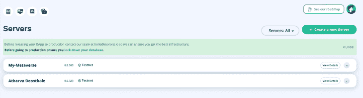
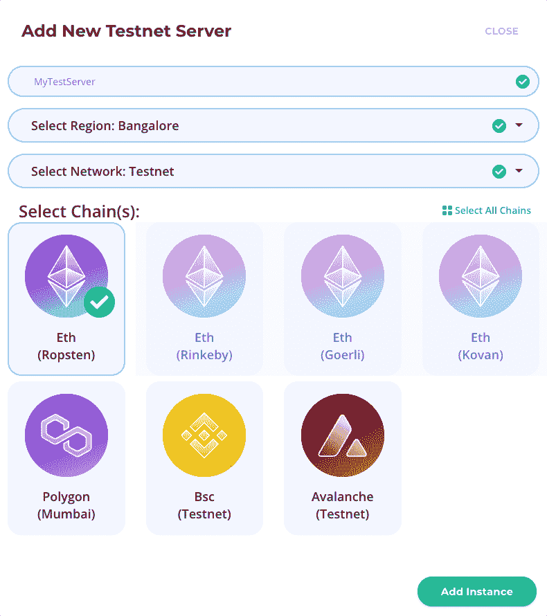
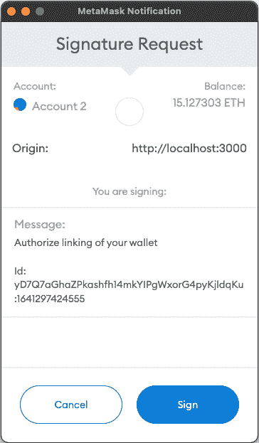
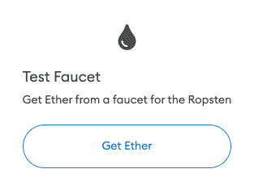
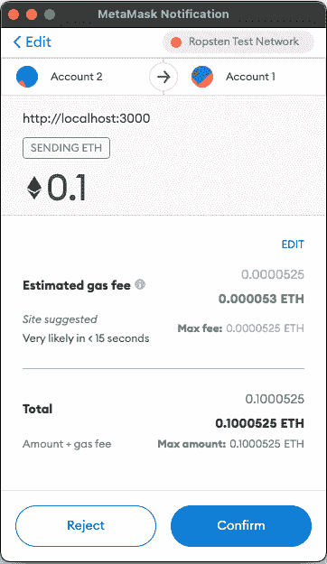

# 使用 Moralis 和 MetaMask 在 Next.js 中构建一个 DApp

> 原文：<https://blog.logrocket.com/build-dapp-nextjs-moralis-metamask/>

如今，开发者正在学习更多关于 Web3 的知识。它是前两个版本网站的继承者，第一个版本，Web1，专注于向用户提供信息，就像维基百科一样。它是在互联网早期使用的。

我们现在在 Web2 中，人们在由大公司管理的网站上分享数据，这些公司将数据出售给广告商。但是现在，Web3 正在崛起。Web3 的基本概念是用户拥有他的数据。这些数据将不会存储在由公司(如谷歌或脸书)监控的服务器上，而是存储在由成千上万台电脑组成的链上，我们称之为区块链。

正因为如此，许多 Web3 技术每天都在涌现，Moralis 就是其中之一。Moralis 简化了 Web3 APIs 的使用。它是“Web3 的燃烧基”，因为它遵循“一行代码”的座右铭。我个人最近一直在使用 Moralis，它节省了我很多开发时间。认证、数据库、Web3 传输等等；只要你说得出名字，道德家就能更容易地做这些复杂的事情。

今天，我们将看看 Moralis 是如何工作的，并用 [Next.js](https://blog.logrocket.com/tag/nextjs/) 做一个简单的项目。我们将使用 Metamask 认证(由 Moralis 简化),我们将创建一个按钮，帮助我们将资金从一个登录的 Metamask 钱包转移到另一个。

我们将使用 Next.js，因为我们不需要从头开始设置重复的东西，如路由；Next.js 为我们提供了一个内置路由器。此外，许多开发人员正在过渡到 Next.js，因此展示它如何与这个框架一起工作是有意义的。但是，如果您仍然喜欢使用 React，本教程也将使用它，所以不要担心！

## 什么是道德，你为什么要使用道德？

> Moralis 提供了构建高性能 dapps 的单一工作流程。完全兼容你最喜欢的 web3 工具和服务。–[道德标准](https://moralis.io)

Moralis 是一个为高性能 DApps 提供完整的端到端区块链应用开发平台的平台。Moralis 可以监视您的区块链数据库的索引，监听事件，并在区块链上设置连锁警报事件。用户余额可以在数据库中同步；Moralis 在一个设置中完成所有这些。

总的来说，Moralis 将 Web3 工作流引入 DApps。Moralis 支持任何区块链上的 DApps 中的简单认证。它还支持社交登录(例如，Google、Twitter 等。)穿着时髦的衣服。Moralis 可以实时监控和跟踪区块链交易。它还提供了许多用于 DApp web、后端和移动开发的 SDK。

我们已经知道道德是什么，以及它能提供什么。在接下来的部分中，我们将深入研究在 Next.js 中构建一个集成了道德的 DApp。

## 要求

在您继续学习本教程之前，让我们先看一下需求列表，这样在开发过程中它们不会占用您太多时间:

*   React 的工作知识
*   关于区块链如何工作和存储数据的实用知识
*   一个 Metamask 钱包——我建议设置两个钱包，因为我们需要两个钱包来转移资金
*   代码编辑器——我更喜欢 [Visual Studio 代码](https://code.visualstudio.com)
*   安装在计算机上的 Node.js

如果你在教程的某个地方卡住了，可以随意看看 [GitHub 库](https://github.com/atharvadeosthale/moralis-tutorial-article)。

## 设置 Moralis 服务器

转到 [Moralis.io](https://moralis.io/) 并创建一个新帐户，如果您已经有一个帐户，请登录。登录后，您将看到一个如下所示的控制面板:



现在，点击按钮**创建一个新的服务器**，然后点击 **Testnet** (这是一个区块链的测试版本，因为在本教程中我们不会使用真正的 ETH 进行交易)。现在将提示您几个选项:



在这里，我已经输入了我的服务器的名称、首选位置和首选 testnet 链。在本教程中，我们将致力于 Ropsten ETH Testnet，因为在这个链中很容易获得一些用于开发目的的测试 ETH。我也尝试过使用 Rinkeby，但经历了停机。

在您填写完必填字段后，单击 **Add Instance** ，这将开始创建您的实例。同时，让我们继续设置我们的 Next.js 应用程序。

## 创建 Next.js 应用程序

导航到一个安全目录，使用以下命令创建一个新的 Next.js 应用程序:

```
npx create-next-app projectname --example with-tailwindcss

```

用您选择的名称替换`projectname`。这个命令将设置 Next.js，并为我们设置 Tailwind CSS 来做一些最小的样式，尽管在本教程中我们不会太关注样式。

创建应用程序后，导航到项目目录，使用以下命令安装项目所需的依赖项:

```
npm install moralis react-moralis @walletconnect/web3-provider

```

这将安装`moralis`核心库和`react-moralis`，这将为我们提供一些方便的钩子。`@walletconnect/web3-provider`正在被安装，因为如果不安装，Moralis 会抛出警告；这个包用来使用 [WalletConnect](https://walletconnect.com/) 而不是 Metamask。在本教程中，我们将只涉及元掩码，所以我们安装这个包只是为了摆脱警告。

## 设置环境变量

返回到您的 Moralis 仪表板，您应该看到您的项目是这样创建的:


现在，点击**查看详细信息**以获取将我们的 Next.js 应用程序链接到我们的 Moralis 服务器所需的信息。记下**服务器 URL** 和**应用程序 ID** 。

回到你的 Next.js 应用程序，创建一个名为`.env`的新文件。按照如下所示的格式填写详细信息:

```
NEXT_PUBLIC_SERVER_URL=(server url here)
NEXT_PUBLIC_APP_ID=(application id here)

```

我们在这里使用`NEXT_PUBLIC_`作为前缀，以便 Next.js 知道这个环境变量在应用程序的客户端公开是安全的。

使用以下命令启动 Next.js 开发服务器:

```
npm run dev

```

这个命令应该会在`localhost:3000`上启动我们的 Next.js 应用程序，所以打开浏览器看看这个应用程序吧！

## 将 Next.js 应用程序与 Moralis 连接

为了将应用程序与服务器连接起来，我们需要将每个组件包装在一个`MoralisProvider`下。

最好的方法是使用`pages`文件夹中的根文件`app.js`。打开文件并将其更改为以下内容:

```
import { MoralisProvider } from "react-moralis";
import "../styles/globals.css";
function MyApp({ Component, pageProps }) {
  return (
    <MoralisProvider
      appId={process.env.NEXT_PUBLIC_APP_ID}
      serverUrl={process.env.NEXT_PUBLIC_SERVER_URL}
    >
      <Component {...pageProps} />
    </MoralisProvider>
  );
}
export default MyApp;

```

在这里，我们已经用`MoralisProvider`包装了`Component`，所以所有的子组件都将在 Moralis 的支持下正确呈现。我们还通过之前创建的环境变量传递了`appId`和`serverUrl`。

## 创建登录页面

打开`pages`文件夹下的`index.js`。这将是我们 Next.js 应用的起点。移除除了`<Head>`组件之外的所有组件，使用下面的布局设计简单的登录页面:

```
return (
  <div className="h-screen w-screen flex items-center justify-center">
    <Head>
      <title>Moralis IO tutorial</title>
      <meta name="description" content="A basic tutorial of Moralis IO" />
      <link rel="icon" href="/favicon.ico" />
    </Head>
    <button
      className="px-7 py-4 text-xl rounded-xl bg-yellow-300 animate-pulse"
    >
      Login using Metamask
    </button>
  </div>
);

```

当你保存文件时，你会看到一个黄色的动画按钮，上面写着**使用元掩码**登录。

现在让我们给它添加功能。毫不奇怪，使用道德很容易！从`react-moralis`导入`useMoralis`钩子，用它来获得一些有用的函数:

```
const { isAuthenticated, authenticate } = useMoralis();
const router = useRouter();

useEffect(() => {
  if (isAuthenticated) router.replace("/dashboard");
}, [isAuthenticated]);

```

在上面的代码中，我们已经导入了一个变量`isAuthenticated`，它跟踪应用程序的身份验证状态。我们还导入了`authenticate`函数，它实际上帮助用户使用元掩码登录。

每当用户通过身份验证时，`useEffect`会将用户重定向到仪表板。将`onClick`属性添加到按钮，这样您的按钮看起来应该是这样的:

```
<button
  className="px-7 py-4 text-xl rounded-xl bg-yellow-300 animate-pulse"
  onClick={() =>
    authenticate({ signingMessage: "Authorize linking of your wallet" })
  }
>
  Login using Metamask
</button>

```

我们还传入了`signingMessage`,这样我们就可以在使用元掩码进行身份验证时显示一条消息。现在，如果您点击**使用元掩码**登录，您应该会看到元掩码弹出，并像这样要求授权:



一旦您点击 **Sign** ，您就可以使用您的钱包登录，您将会看到一个 404 错误页面，因为我们还没有创建一个仪表板。

在转到仪表板之前，我想谈一些重要的事情。我在 Metamask 上的 Ropsten 测试网络上，所以这个应用程序中的每个事务都将在 Ropsten Testnet 上执行。测试时确保不在 Metamask 上的 MainNet(以太坊的量产版)上；总是在工作前设置某种测试网。

## 获取测试乙醚

在我们到达仪表板之前，让我们用一些测试乙醚装满我们的第一个钱包。Ropsten Testnet 是最好的测试网络，因为与其他测试网络相比，你可以很容易地获得测试 ETH(在我看来)。所以，打开 Metamask，确保你在 Ropsten 测试网络上，点击**购买**按钮。向下滚动后，您应该看到这个选项来获取 test ETH:



根据您重定向到的水龙头 Metamask，您可能需要粘贴您的钱包地址。很快，你的钱包里就会有运行在 Ropsten Testnet 上的 test ETH。

你能从水龙头中提取多少 ETH 是有一些限制的，所以即使在测试时也要明智地花费。现在，我们可以进入控制面板，在这里将执行一个简单的 ETH 传输。

## 创建仪表板

在`pages`下新建一个名为`dashboard`的文件夹。创建一个新文件`index.js`，布局如下:

```
import Head from "next/head";
import { useRouter } from "next/router";
import { useEffect } from "react";
import Moralis from "moralis";
import { useMoralis } from "react-moralis";

function Index() {
  const { isAuthenticated, logout } = useMoralis();
  const router = useRouter();

  useEffect(() => {
    if (!isAuthenticated) router.replace("/");
  }, [isAuthenticated]);

  return (
    <div className="h-screen w-screen flex flex-col items-center justify-center">
      <Head>
        <title>Moralis Tutorial - Dashboard</title>
      </Head>
      <button
        className="px-7 py-4 mb-5 text-xl rounded-xl bg-yellow-300"
      >
        Send 0.1 ETH to owner
      </button>
      <button
        className="px-7 py-4 text-xl rounded-xl bg-yellow-300"
      >
        Logout
      </button>
    </div>
  );
}
export default Index;

```

这里，我们导入了 Moralis 钩子，并提取了需要 Moralis 的动作所需的有用函数。`useEffect`确保一旦用户不再通过身份验证，就将用户重定向回登录页面。要注销，将`logout`函数添加到注销按钮，看起来应该是这样的:

```
<button
  onClick={logout}
  className="px-7 py-4 text-xl rounded-xl bg-yellow-300"
>
  Logout
</button>

```

现在，让我们创建一个函数来帮助我们将 test ETH 转移到另一个 wallet:

```
const sendEth = async () => {
  try {
    await Moralis.Web3.enableWeb3();
    const result = await Moralis.Web3.transfer({
      type: "native",
      amount: Moralis.Units.ETH("0.1"),
      receiver: "account not connected with the app",
    });
    console.log(result);
    alert("Transfer of funds succeeded!");
  } catch (err) {
    console.error(err);
    alert("Something went wrong");
  }
};

```

在上面的代码中，我们首先启用 Web3 实例，这样我们就可以访问与之相关的功能。然后，我们开始转移，所以当交易被批准和处理时，`result`将被记录在控制台中，或者记录一个错误。

进入**发送 0.1 ETH 给主人**按钮的`onClick`功能。您的按钮应该是这样的:

```
<button
  onClick={sendEth}
  className="px-7 mb-5 py-4 text-xl rounded-xl bg-yellow-300"
>
  Send 0.1 ETH to owner
</button>

```

现在，当您单击按钮时，您应该看到 Metamask 弹出来请求批准交易:



确保您在 Ropsten Testnet 上，点击**确认**处理交易。处理交易可能需要一些时间，因为交易是在区块链上写的。一旦处理完成，你可以看到测试 ETH 到达你的另一个帐户。

## 下一步是什么？

这些是道德的基本功能。除此之外，您还可以管理自定义令牌、发送 NFT、与部署的智能合约交互，等等！继续使用 Moralis 探索 Web3 的宇宙吧！

## [LogRocket](https://lp.logrocket.com/blg/nextjs-signup) :全面了解生产 Next.js 应用

调试下一个应用程序可能会很困难，尤其是当用户遇到难以重现的问题时。如果您对监视和跟踪状态、自动显示 JavaScript 错误、跟踪缓慢的网络请求和组件加载时间感兴趣，

[try LogRocket](https://lp.logrocket.com/blg/nextjs-signup)

.

[](https://lp.logrocket.com/blg/nextjs-signup)[](https://lp.logrocket.com/blg/nextjs-signup)

LogRocket 就像是网络和移动应用的 DVR，记录下你的 Next.js 应用上发生的一切。您可以汇总并报告问题发生时应用程序的状态，而不是猜测问题发生的原因。LogRocket 还可以监控应用程序的性能，报告客户端 CPU 负载、客户端内存使用等指标。

LogRocket Redux 中间件包为您的用户会话增加了一层额外的可见性。LogRocket 记录 Redux 存储中的所有操作和状态。

让您调试 Next.js 应用的方式现代化— [开始免费监控](https://lp.logrocket.com/blg/nextjs-signup)。