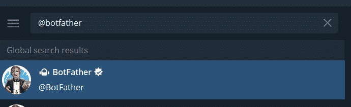
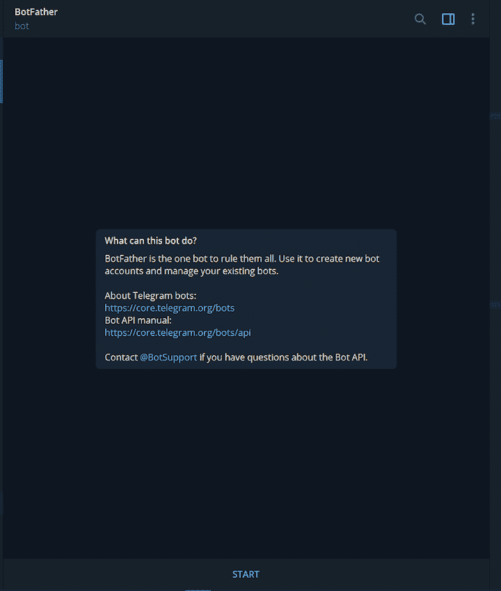
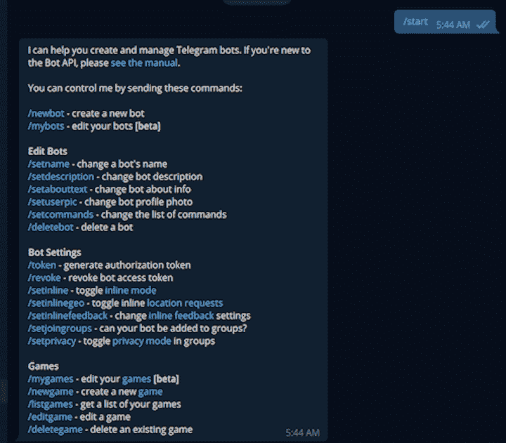
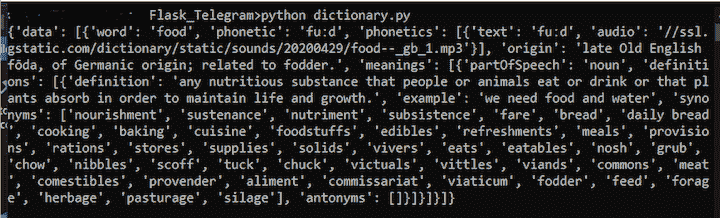
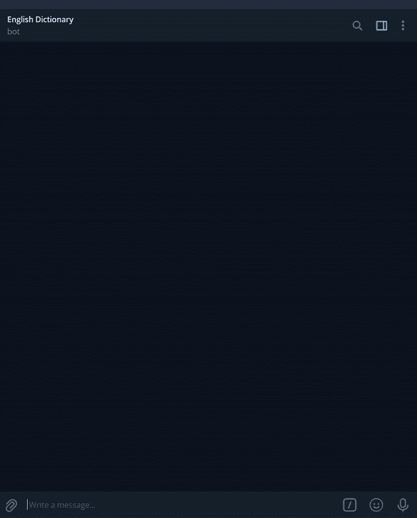
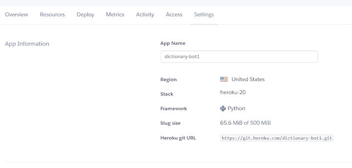
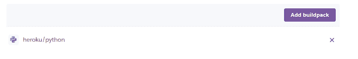

# 如何使用 Flask - LogRocket 博客构建和部署电报机器人

> 原文：<https://blog.logrocket.com/build-deploy-telegram-bot-with-flask/>

今天，几乎每个 SaaS 网站或应用程序都使用聊天机器人。聊天机器人提供一致的信息、全天候服务和快速的响应时间。这些工具已被证明可以降低业务成本，提高客户满意度。

聊天机器人的主要应用之一是回答简单的查询，但它们也可以用于许多其他功能:

*   消息广播
*   提醒
*   定制的通知和新闻
*   用户教育
*   比赛
*   搜索引擎应用
*   与其他服务的集成

在本文中，我们将介绍如何设置一个 [Telegram](https://telegram.org/) bot，然后将其与 [Flask](https://flask.palletsprojects.com/en/2.0.x/) 集成，以快速构建一个定制的字典应用程序并将其部署到 Heroku。

## 设置电报机器人配置文件

Telegram 是一个多媒体在线消息应用程序，具有标准的核心功能。用户可以创建群组对话，发送视频和照片，向其他用户发送消息，并与联系人进行语音和视频通话。

Telegram 区别于其他消息平台的一个方面是它的聊天机器人特别容易设置、编程和管理。电报机器人可以用于多种用途。

要设置电报机器人，首先登录您的电报档案。如果你还没有在 Telegram 上创建个人资料，你可以在这里注册。

接下来，通过将@BotFather 粘贴到 Telegram 的搜索栏中来查找 BotFather。BotFather 是 Telegram 的管理机器人，它使用户能够创建和管理机器人。




启动 BotFather 后，点击**开始**按钮或在用户界面的输入栏中键入命令`/start`开始对话。

BotFather 将使用一系列其他命令来响应`/start`,这些命令可以被调用来执行不同的操作:

要创建新的机器人，请在输入字段中键入`/newbot`命令。机器人父亲将会回应，询问关于新机器人的细节:


接下来，您将收到来自 BotFather 的包含 HTTP 令牌的消息。不要公开此标记。任何有权访问令牌的人都可以对您的机器人进行修改。

我们将使用这个令牌通过 Flask 应用程序中的 Telegram API 与新的 bot 进行交互。


## 构建 Flask 应用程序

Flask 是一个开源的 Python web 框架。它的轻量级代码库使它适合快速构建 web 应用程序。

对于这个例子，我们将构建一个 Flask 应用程序，作为一个字典。我们的应用程序将接收一个英语单词作为请求，并以关于该单词的信息做出响应，如其定义、示例、同义词和反义词。对于这个应用程序，我们将利用一个免费的[字典 API](https://dictionaryapi.dev/) 。

首先，创建一个文件夹`Flask_Telegram`，将应用程序和`cd`包含到目录中。

```
mkdir Flask_Telegram
cd Flask_Telegram
```

安装`requests`库，向外部目录 API 发送 HTTP 请求:

```
pip install requests
```

接下来，创建一个`dictionary.py`文件，该文件将包含提供关于所请求单词的信息的逻辑。然后，添加以下代码片段:

```
import os
import requests
from flask import Flask

app = Flask(__name__)

@app.route('/')
def get_info(word):

    url = 'https://api.dictionaryapi.dev/api/v2/entries/en/{}'.format(word)

    response = requests.get(url)

# return a custom response if an invalid word is provided
    if response.status_code == 404:
        error_response = 'We are not able to provide any information about your word. Please confirm that the word is ' \
                         'spelled correctly or try the search again at a later time.'
        return error_response

    data = response.json()[0]

    print(data)
    return data

get_info("food")

if __name__ == "__main__":
    port = int(os.environ.get('PORT', 5000))
    app.run(debug=True, host='0.0.0.0', port=port)
```

在上面的示例`dictionary.py`文件中，`@app.route('/')`是应用程序的入口点。

当用户请求关于某个`word`的信息时，该值被传递给`get_info()`函数。然后，在将请求发送到字典 API 之前，我们将函数附加到`url`变量。

在执行任何附加操作之前，我们首先检查请求是否是一个有效的英语单词。对 dictionary API 的成功请求以列表的形式返回 JSON 数据。然后，我们从列表中提取 JSON 数据，并将其返回给客户机。但是，在无效的 word 请求的情况下，将返回 404 代码状态，并向用户显示一条自定义消息。

下面是应用程序收到关于`food`的信息请求时的预期响应:



## 将 Flask 应用程序与电报机器人集成在一起

让我们通过将 Flask 字典脚本与 Telegram bot 集成来完成应用程序。

首先，创建一个新的 Python 文件`bot.py`，并添加以下代码片段:

```
import telegram
from telegram.ext import Updater, MessageHandler, Filters
from telegram.ext import CommandHandler
from dictionary import get_info

telegram_bot_token = 

updater = Updater(token=telegram_bot_token, use_context=True)
dispatcher = updater.dispatcher

# set up the introductory statement for the bot when the /start command is invoked
def start(update, context):
    chat_id = update.effective_chat.id
    context.bot.send_message(chat_id=chat_id, text="Hello there. Provide any English word and I will give you a bunch "
                                                   "of information about it.")

# obtain the information of the word provided and format before presenting.
def get_word_info(update, context):
    # get the word info
    word_info = get_info(update.message.text)

    # If the user provides an invalid English word, return the custom response from get_info() and exit the function
    if word_info.__class__ is str:
        update.message.reply_text(word_info)
        return

    # get the word the user provided
    word = word_info['word']

    # get the origin of the word
    origin = word_info['origin']
    meanings = '\n'

    synonyms = ''
    definition = ''
    example = ''
    antonyms = ''

    # a word may have several meanings. We'll use this counter to track each of the meanings provided from the response
    meaning_counter = 1

    for word_meaning in word_info['meanings']:
        meanings += 'Meaning ' + str(meaning_counter) + ':\n'

        for word_definition in word_meaning['definitions']:
            # extract the each of the definitions of the word
            definition = word_definition['definition']

            # extract each example for the respective definition
            if 'example' in word_definition:
                example = word_definition['example']

            # extract the collection of synonyms for the word based on the definition
            for word_synonym in word_definition['synonyms']:
                synonyms += word_synonym + ', '

            # extract the antonyms of the word based on the definition
            for word_antonym in word_definition['antonyms']:
                antonyms += word_antonym + ', '

        meanings += 'Definition: ' + definition + '\n\n'
        meanings += 'Example: ' + example + '\n\n'
        meanings += 'Synonym: ' + synonyms + '\n\n'
        meanings += 'Antonym: ' + antonyms + '\n\n\n'

        meaning_counter += 1

    # format the data into a string
    message = f"Word: {word}\n\nOrigin: {origin}\n{meanings}"

    update.message.reply_text(message)

# run the start function when the user invokes the /start command 
dispatcher.add_handler(CommandHandler("start", start))

# invoke the get_word_info function when the user sends a message 
# that is not a command.
dispatcher.add_handler(MessageHandler(Filters.text, get_word_info))
updater.start_polling()
```

在这个例子中，我们首先将电报模块和字典脚本导入`bot.py`文件。接下来，我们使用唯一的 HTTP 令牌初始化电报更新程序。

`start(update, context)`函数包含在运行 bot 的`/start`命令时呈现自定义欢迎消息的逻辑。我们通过`context.bot.send_message`功能发起与用户的对话，使用`chat_id`来确定将响应定向到哪里。

在`get_word_info`函数中，我们执行逻辑来格式化从`dictionary.py`脚本中的`get_info`函数获得的数据。

如果用户提供一个有效的英文单词，`get_info`函数返回一个字典数据类型:`dict`。使用这种数据类型，我们执行进一步的操作，提取我们想要显示给用户的数据。提取的值然后被格式化成一个字符串，并存储在`message`变量中。

但是，如果用户提供了一个无效的英文单词，`get_info`函数将返回一个字符串数据类型:`str`。当这种情况发生时，在`dictionary.py`文件中创建的定制消息会显示给用户。

最后一步，我们告诉电报机器人在用户调用`/start`命令时执行启动功能，在用户发送非命令消息时执行`get_word_info`功能。



## 部署电报机器人

让我们将应用程序部署到远程服务器上。我们将使用 Heroku 云平台来托管我们的应用程序。

如果您还没有 Heroku 帐户，您可以在此创建一个[。](https://signup.heroku.com/)

要部署电报机器人，请遵循以下六个步骤:

### 1.创建`requirements.txt`文件

`requirements.txt`文件包含应用程序成功运行所需的依赖项和各自的版本。

运行以下命令生成一个`requirements.txt`文件，其中包含用于构建电报机器人的依赖项:

```
pip freeze > requirements.txt
```

`requirements.txt`文件至少应包含以下包:

```
python-telegram-bot==13.8.1
telegram==0.0.1
requests==2.25.1
```

根据应用程序的类型，`requirements.txt`文件可能包含更多的包和不同的版本号。

### 2.创建`Procfile`

`Procfile`是一个文本文件，它定义了应用程序启动时应该在 Heroku 上运行的命令。

对于本例，在应用程序根目录中创建一个文件，并将其命名为`Procfile`。然后添加以下代码片段:

```
web: python bot.py $PORT
```

### 3.创建 Heroku 应用程序

使用以下命令指示 Heroku 创建具有指定名称的应用程序:

```
heroku create
```

成功运行此命令后，Heroku 将提供两个 URL:应用程序 URL 和远程 Git URL，Heroku 将通过这两个 URL 将应用程序部署到其服务器。

### 4.添加应用程序构建包

要查看应用程序，请访问 Heroku 仪表板。在**设置**选项卡中，点击**添加 buildpack** ，选择 **heroku/python** 选项:





### 5.修改`bot.py`文件

在将机器人部署到 Heroku 之前，我们需要对文件`bot.py`的`updater.start_polling()`部分做一个小小的修改。

这一步是必不可少的，因为`updater.start_polling()`方法监控新消息的电报 API。因为我们将在远程 web 服务器上启动 bot，所以我们需要指示 Telegram 直接与 web 服务器通信。

用以下代码片段替换`updater.start_polling()`:

```
updater.start_webhook(listen="0.0.0.0",
                      port=int(os.environ.get('PORT', 5000)),
                      url_path=telegram_bot_token,
                      webhook_url=  + telegram_bot_token
                      )
```

### 6.部署应用程序

使用以下命令将 Telegram 应用程序部署到 Heroku:

```
git add .
git commit -m "first commit"
git push heroku main
```

## 结论

在本文中，我们演示了如何通过集成电报机器人和 Flask 来快速构建字典应用程序。这个项目在 [GitHub](https://github.com/olu-damilare/dictionary_bot) 上有，你可以在这里和我们创建的[字典机器人互动。](https://t.me/dami_dictionaryBot)