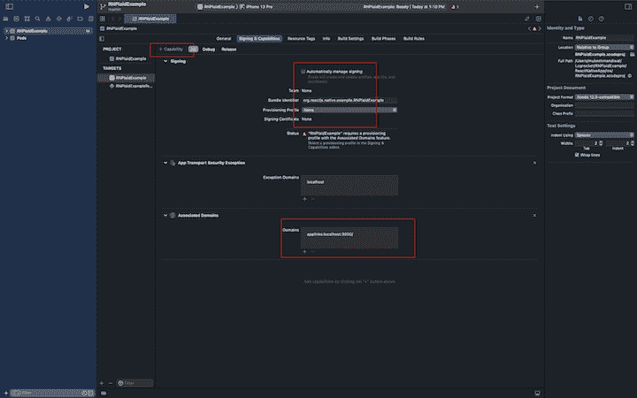
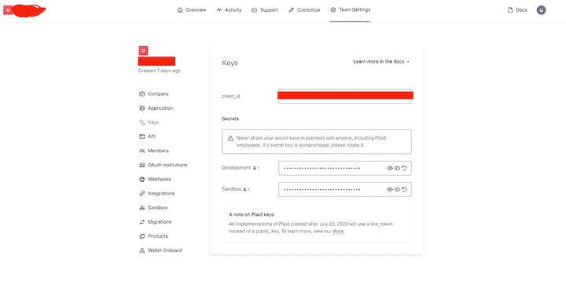
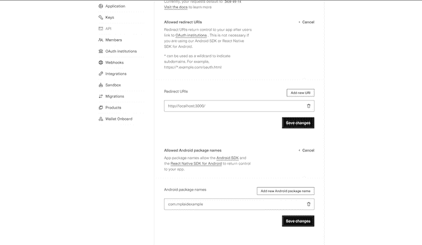
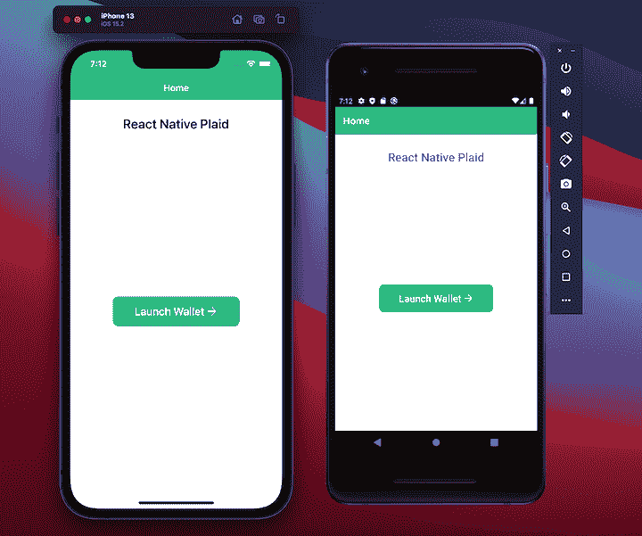
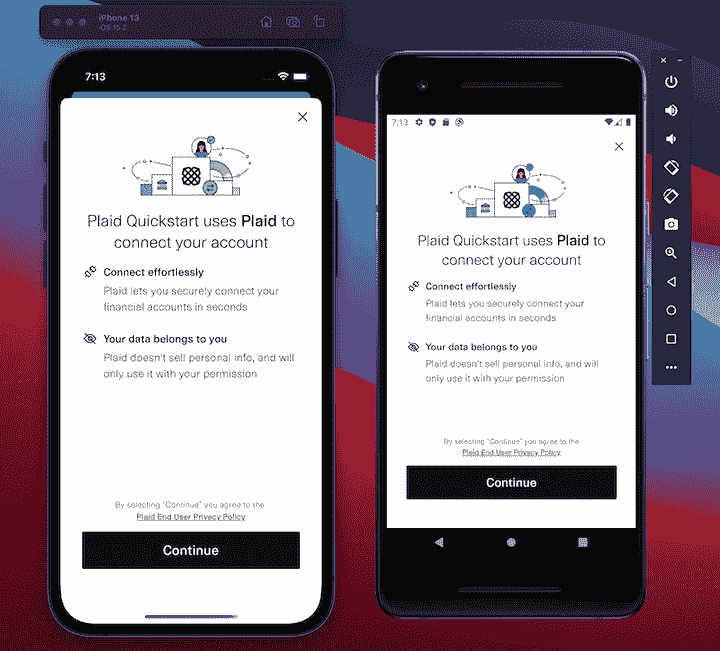
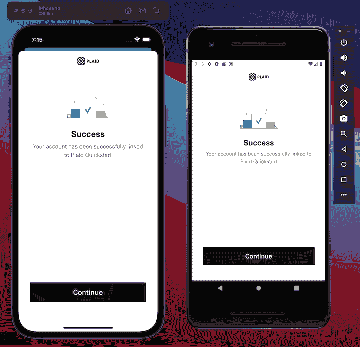
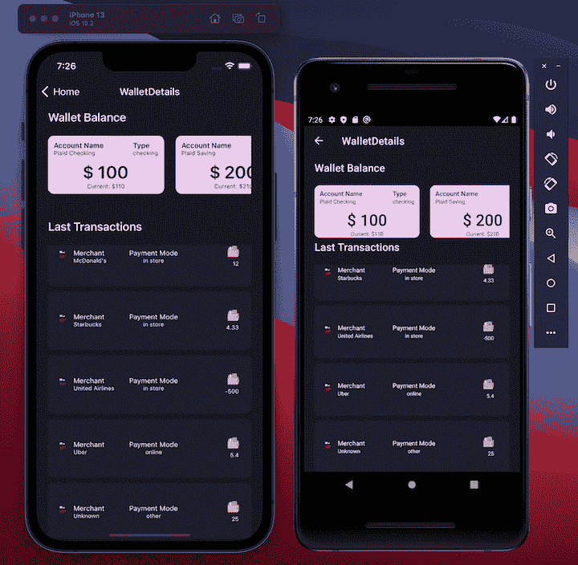

# 用格子和 React Native 构建一个金融科技应用

> 原文：<https://blog.logrocket.com/build-fintech-app-plaid-react-native/>

React Native 是一个流行的 JavaScript 框架，使开发人员能够为 Android 和 iOS 平台构建原生移动应用程序。在本文中，我们将讨论如何使用 React Native 和 [Plaid](https://plaid.com) 构建一个移动应用程序，允许用户管理他们的财务账户并跟踪他们的支出。

我们将演示如何设置一个 [React 本地开发环境](https://blog.logrocket.com/integrate-react-native-components-native-apps/)以及如何将 Plaid 的 API 和特性集成到 React 本地应用中。无论您是初学者还是有经验的开发人员，本文都将为您提供入门 React Native 和 grid 所需的知识和资源。

## 内容

## 先决条件

要阅读本文，您需要以下内容:

*   系统上安装的 Node.js v16 或更高版本
*   React Native [开发环境](https://reactnative.dev/docs/environment-setup)
*   用于测试的 iOS 模拟器或 Android 模拟器
*   对 JavaScript、React 和 React Native 有基本的了解

## 设置 React 本机应用程序

首先，创建一个项目文件夹。在这种情况下，我们将其命名为`RNPlaidExample`:

```
mkdir RNPlaidExample
# To create a RNPlaidExample directory
cd RNPlaidExample 

```

接下来，cd 进入项目目录，并通过运行以下命令安装 React 本地项目:

```
npx react-native init ReactNativeApp
# navigate to project directory
cd ReactNativeApp

```

这个命令将为我们的 Plaid 应用程序创建一个新的 React 本地项目。

***注意，*** *我们在这篇文章中使用的是**React Native v 0 . 70 . 6*

接下来，添加以下依赖项，以便将 Plaid SDK 与 React 本地应用程序集成:

```
yarn add react-native-plaid-link-sdk

```

***注意，*** 我们在本文中使用的是 react-native-plaid-link-SD v 8 . 0 . 1；更多关于其[版本兼容性](https://github.com/plaid/react-native-plaid-link-sdk)的细节请见 GitHub

现在，在终端中使用以下命令之一来运行您的 iOS 或 Android 应用程序:

```
# To run the iOS app
npx react-native run-ios

# To run the Android's app
npx react-native run-android

```

这两个命令启动[Metro](https://github.com/facebook/metro)(React Native 的 JavaScript bundler)，创建应用程序，并在模拟器(iOS)或仿真器(Android)中启动它。

## 为 iOS 配置 Plaid SDK

为了完成 iOS 应用程序的设置，请运行以下命令:

```
cd ios && pod install 

```

接下来，按照以下步骤确保在 Xcode 中正确配置项目:

1.  在 Xcode 中打开`ReactNativeApp`文件
2.  从左侧导航中，选择**反应应用**
3.  点击**签约&能力**
4.  取消选择**自动管理签名**复选框
5.  点击 **+能力**页签，在弹出菜单中选择**关联域**，在**域字段**中添加`applinks:localhost:3000/`



## 为 Android 配置 Plaid SDK

为 Android 配置 Plaid SDK 不需要任何更改。

## 设置格子账户

Plaid `client_id`和`secret key`键是为后端配置沙盒环境所必需的。

首先[创建一个格子账户](https://dashboard.plaid.com/signup)(如果你还没有的话)。然后，打开格子仪表板，从左侧导航栏中选择**键**。接下来，从**客户端 id** 和**沙箱**字段中复制信息。我们稍后将在后端沙盒配置中使用这些密钥:



***注意，**请记住不要与任何人共享密钥，因为那样会提供对您的格子账户的访问；如果密钥泄露，点击刷新符号*更新密钥

接下来，我们需要在我们的格子仪表板中创建和设置一个重定向 URI。转到左侧导航中的 [**API**](https://dashboard.plaid.com/team/api) ，指定`localhost:3000/`为**重定向 URI** ，同时添加 **Android 包名**，如下图所示:



***注意，**重定向 URI 必须使用 HTTPS。唯一的例外是 Plaid 沙箱，出于测试目的，指向本地主机的重定向 URIs 可能会使用< HTTP。关于重定向 URI* 的更多细节参见 [*的官方文档*](https://plaid.com/docs/link/oauth/)

## 配置后端沙箱

接下来，我们需要设置一个后端沙箱，以便我们可以测试我们的应用程序。在`RNPlaidExample`项目文件夹下创建一个新文件夹`backend`。我们将使用[格子快速启动库](https://github.com/plaid/quickstart)为后端创建一个沙盒环境。

Plaid QuickStart 存储库支持多种后端语言。在本教程中，我们将直接使用 Node.js 作为后端，但是，您也可以使用 Docker。

通过在`backend`文件夹中创建一个`.env`文件来设置环境变量，如下所示:

```
cp .env.example .env

```

接下来，将`.env.example`内容复制到`.env`文件中，添加不带字符串的`PLAID_CLIENT_ID`和`PLAID_SECRET`。按照上一节中概述的步骤从 Plaid 仪表板获取客户机 ID 和密码:

```
# Get your Plaid API keys from the dashboard: https://dashboard.plaid.com/team/keys
PLAID_CLIENT_ID=
PLAID_SECRET=

PLAID_ENV=sandbox
PLAID_PRODUCTS=auth,transactions
PLAID_COUNTRY_CODES=US,CA

# For sandbox, set PLAID_REDIRECT_URI to 'http://localhost:3000/'

PLAID_REDIRECT_URI=http://localhost:3000/

```

现在，一旦设置好环境变量，通过运行下面的命令启动后端服务器。它将在`[http://localhost:8080/](http://localhost:8080/)`启动并运行:

```
yarn start 
>
```

既然后端沙箱已经启动并运行，是时候设置格子链接流了。

## 设置格子链接流

Plaid Link 用于将用户财务帐户(或沙箱)连接到 Plaid API。在我们的教程中，我们将使用 Plaid Link 建立一个流来显示钱包的交易历史和余额。

首先，从项目文件夹导航到 React 本地应用程序文件夹`ReactNativeApp`。

要访问大多数 Plaid API 端点，您需要一个访问令牌:

```
const createLinkToken = React.useCallback(async () => {
    await fetch(`http://${address}:8080/api/create_link_token`, {
      method: 'POST',
      headers: {
        'Content-Type': 'application/json',
      },
    })
      .then(response => response.json())
      .then(data => {
        setLinkToken(data.link_token);
      })
      .catch(err => {
        console.log(err);
      });
  }, [setLinkToken]);
  React.useEffect(() => {
    if (linkToken == null) {
      createLinkToken();
    }
  }, [linkToken]);

```

在上面的代码中，`api/create_link_token` API 端点用于获得一个`link_token`。这个`link_token`用于配置和初始化`PlaidLink`流程，比如:

```
 <PlaidLink
          tokenConfig={{
            token: linkToken,
            noLoadingState: false,
          }}
          onSuccess={async success => {
            await fetch(`http://${address}:8080/api/set_access_token`, {
              method: 'POST',
              headers: {
                'Content-Type': 'application/json',
              },
              body: JSON.stringify({public_token: success.publicToken}),
            })
              .then(response => response.json())
              .then(data => {
                dispatch({
                  type: 'SET_STATE',
                  accessToken: data.access_token,
                  itemId: data.item_id,
                });
              })
              .catch(err => {
                console.log(err);
              });
            navigation.navigate('WalletDetails');
          }}
          onExit={response => {
            console.log(response);
          }}><PlaidLink/>

```

为了启动 Plaid SDK，我们将把 UI 添加到我们的主页，并使用上面的代码初始化 Plaid SDK 流:



当你点击**启动钱包**按钮时，Plaid SDK 打开，支付流程启动，iOS 和 Android 如下所示:



以下是成功完成`PlaidLink`流程后您将收到的消息:



一旦用户成功完成支付链接流程，`PlaidLink`将通过`onSuccess`回调返回一个新的公共令牌。这个`public_token`是用来交换`access_token`的。然后，可以使用它来调用 Plaid API 的其他端点，以获取诸如余额和交易之类的信息:

```
onSuccess={async success => {
            await fetch(`http://${address}:8080/api/set_access_token`, {
              method: 'POST',
              headers: {
                'Content-Type': 'application/json',
              },
              body: JSON.stringify({public_token: success.publicToken}),
            })
              .then(response => response.json())
              .then(data => {
                dispatch({
                  type: 'SET_STATE',
                  accessToken: data.access_token,
                  itemId: data.item_id,
                });plaidli
              })
              .catch(err => {
                console.log(err);
              });

```

为了在其他 API 请求中使用这个交换的访问令牌，并获得关于项目、钱包和资产余额的信息，我们通过一个已经配置好的全局上下文提供者在我们的全局状态中设置它。

在成功回调`PlaidLink` SDK 流之后，用户被重定向到 WalletDetails 屏幕，对于 iOS 和 Android 如下所示:



我们与`/api/balance` API 端点通信以获取余额信息，并与`api/transaction` API 端点通信以获取最近的交易历史:

```
const getBalance = React.useCallback(async () => {
    await fetch(`http://${address}:8080/api/balance`, {
      method: 'GET',
      headers: {
        'Content-Type': 'application/json',
        access_token: accessToken,
      },
    })
      .then(response => response.json())
      .then(data => {
        setData(data);
      })
      .catch(err => {
        console.log(err);
      });
  });
 const getTransactions = React.useCallback(async () => {
    await fetch(`http://${address}:8080/api/transactions`, {
      method: 'GET',
      headers: {
        'Content-Type': 'application/json',
        access_token: accessToken,
      },
    })
      .then(response => response.json())
      .then(data => {
        setTransactionData(data);
      })
      .catch(err => {
        console.log(err);
      });
  });

```

要了解更多关于额外的 Plaid API 端点的信息，请访问官方文档。

## 结论

在本文中，我们介绍了如何为 React 本机应用程序设置 Plaid，为后端创建沙盒环境，以及定义环境变量。我们还演示了如何创建公共链接令牌来访问大多数 API 端点数据。

作为我们的例子，我们使用 Plaid 和 React Native 构建了一个适用于 iOS 和 Android 的 fintech 应用程序。我们启动了一个格子链接流来显示钱包的余额和最近的交易历史。本文中使用的源代码可以在 [GitHub](https://github.com/mukeshmandiwal/RNPlaidExample) 上获得。

我希望这篇文章对使用 React Native 创建一个格子应用程序有所帮助。如果你有更多的问题，请在下面的评论中告诉我。

## [LogRocket](https://lp.logrocket.com/blg/react-native-signup) :即时重现 React 原生应用中的问题。

[](https://lp.logrocket.com/blg/react-native-signup)

[LogRocket](https://lp.logrocket.com/blg/react-native-signup) 是一款 React 原生监控解决方案，可帮助您即时重现问题、确定 bug 的优先级并了解 React 原生应用的性能。

LogRocket 还可以向你展示用户是如何与你的应用程序互动的，从而帮助你提高转化率和产品使用率。LogRocket 的产品分析功能揭示了用户不完成特定流程或不采用新功能的原因。

开始主动监控您的 React 原生应用— [免费试用 LogRocket】。](https://lp.logrocket.com/blg/react-native-signup)