# 用 Next.js 和 Supabase - LogRocket Blog 构建一个全栈应用

> 原文：<https://blog.logrocket.com/build-full-stack-app-next-js-supabase/>

在我看来，在为下一个全栈应用构建和选择框架时，结合 Next.js 和 Supabase 是最好的选择之一。

Supabase 是一个开源的 Firebase 替代品，有很多强大的工具，包括无缝认证**。**作为开发人员，这是构建成功的全栈应用的关键。

除了认证之外，Supabase 还具有其他特性，如 Postgres 数据库、实时订阅和对象存储。我相信 Supabase 是最容易上手或集成的后端即服务之一。

在本文中，我们将学习如何使用 Next.js 和 Supabase **构建一个全栈 app。**我们将讨论如何建立一个 Supabase 项目，配置 UI，实现认证和功能。

这个应用程序的概念是让用户根据指定的参数跟踪和创建锻炼活动，如果有任何错误或必要的更改，可以编辑这些活动，如果需要，可以删除它们。我们开始吧！

## Next.js 和 Supabase 简介

Next.js 是构建生产就绪的 React 应用程序的最简单和最流行的方法之一。近年来，Next.js 经历了显著的指数增长，许多公司都采用它来构建自己的应用程序。

## 为什么要用 Supabase？

Supabase 是 Firebase 的一个无服务器、开源的替代方案，建立在 PostgreSQL 数据库之上。它提供了创建全栈应用所需的所有后端服务。

作为用户，您可以从 Supabase 界面管理您的数据库，从创建表和关系到在 PostgreSQL 之上编写您的 SQL 查询和实时引擎。

Supabase 提供了非常酷的特性，让你的全栈应用开发变得更加容易。这些功能包括:

*   行级安全性(RLS)–Supabase 带有 PostgreSQL RLS 特性，允许您限制数据库表中的行。当您创建策略时，您可以使用 SQL 直接创建它们
*   实时数据库——Supabase 在 PostgreSQL 数据库上有一个更新特性，可以用来监听实时变化
*   supa base UI——supa base 有一个开源的用户界面组件库，可以快速高效地创建应用程序
*   用户认证——一旦您创建了数据库，Supabase 就会创建一个`auth.users`表。当您创建一个应用程序时，只要您在数据库中可以引用的应用程序上注册，Supabase 就会分配一个用户和 ID。对于登录方法，有不同的方法可以验证用户，如电子邮件，密码，魔术链接，谷歌，GitHub，等等
*   边缘函数–边缘函数是在靠近用户的边缘全局分布的类型脚本函数。它们可以用来执行一些功能，比如与第三方集成或者监听 WebHooks

## 用 Next.js 启动我们的项目

为了在终端中使用 Next.js 模板启动我们的项目，我们将运行以下命令:

```
npx create-next-app nextjs-supabase

```

`nextjs-supabase`是我们应用程序的文件夹名称，我们将在其中包含 Next.js 应用程序模板。

我们需要安装 Supabase 客户端包，以便稍后连接到 Next.js 应用程序。我们可以通过运行以下命令之一来实现这一点:

```
yarn add @supabase/supabase-js
```

或者

```
npm i @supabase/supabase-js

```

应用程序完成设置后，在您喜欢的代码编辑器中打开文件夹。现在，我们可以删除我们的`/pages/index.js`文件中的基本模板，并替换为标题为“欢迎使用锻炼应用程序”的`h1`

完成后，在终端中运行命令`yarn dev`在 [http://localhost:3000](http://localhost:3000) 启动你的应用。您应该会看到这样一个页面:

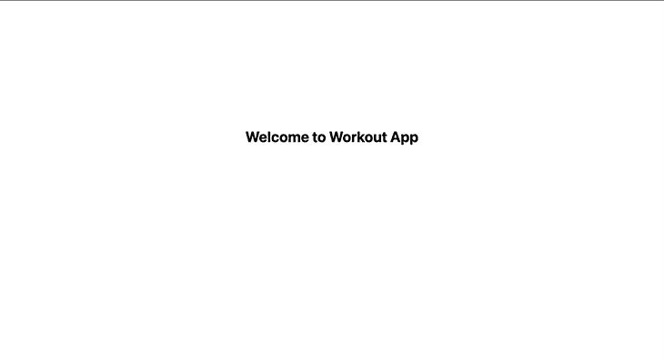

## 建立 Supabase 项目并创建数据库表

要设置 Supabase 项目，请访问[app.supabase.com](https://app.supabase.com/)使用您的 GitHub 帐户登录应用仪表板。

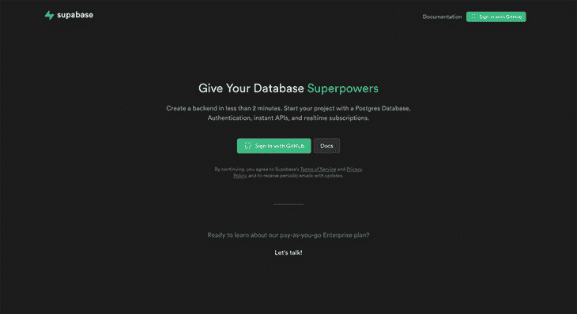

登录后，您可以创建您的组织，并通过单击**所有项目**在其中设置一个新项目。

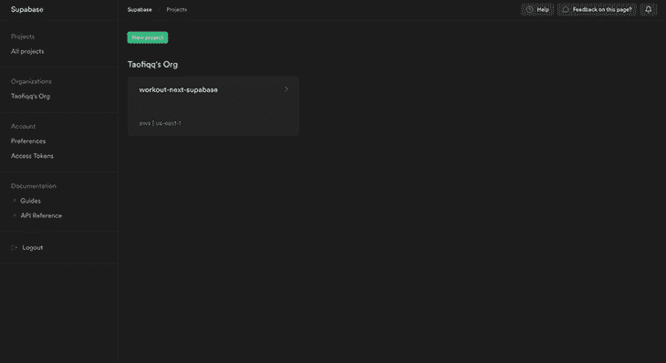

点击**新建项目**，给你的项目起一个名字和数据库密码。点击**新建项目**按钮；您的项目启动并运行需要几分钟时间。

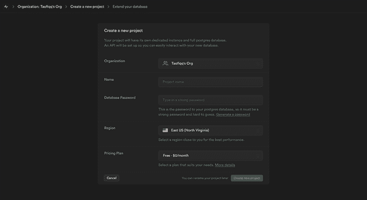

项目创建完成后，您应该会看到如下所示的仪表板:


对于本教程，我已经创建了一个名为`workout-next-supabase.`的项目

现在，让我们通过点击仪表板上的 **SQL 编辑器**图标并点击**新查询**来创建我们的数据库表。在编辑器中输入下面的 SQL 查询，点击**运行**执行查询。

```
CREATE TABLE workouts (
 id bigint generated by default as identity primary key,
 user_id uuid references auth.users not null,
 user_email text,
 title text,
 loads text,
 reps text,
 inserted_at timestamp with time zone default timezone('utc'::text, now()) not null
);

alter table workouts enable row level security;

create policy "Individuals can create workouts." on workouts for
   insert with check (auth.uid() = user_id);

create policy "Individuals can update their own workouts." on workouts for
   update using (auth.uid() = user_id);

create policy "Individuals can delete their own workouts." on workouts for
   delete using (auth.uid() = user_id);

create policy "Workouts are public." on workouts for
   select using (true);

```

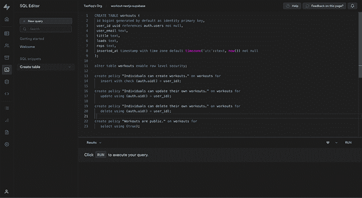

这将创建我们用来构建 CRUD 应用程序的测试表。

在创建表格的同时，将启用行级权限，以确保只有授权用户才能创建、更新或删除其锻炼的详细信息。

要查看健身表的外观，我们可以单击仪表盘上的**表格编辑器**图标，查看我们刚刚创建的健身表。

对于此应用程序，我们将有七列:

*   `user_id`
*   `user_email`
*   `id`
*   `title`
*   `loads`
*   `reps`
*   `Date stamp`

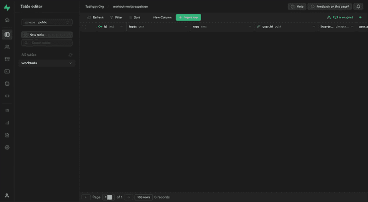

一旦我们的表和列设置好了，下一步就是将我们的 Supabase 数据库与我们的 Next.js 前端应用程序连接起来！

## 将 Next.js 与 Supabase 数据库连接

要将 Supabase 与我们的 Next.js 应用程序连接起来，我们需要我们的**项目 URL** 和 **Anon Key** 。这两者都可以在我们的数据库仪表板上找到。要得到这两把钥匙，点击齿轮图标进入**设置**，然后点击 **API** 。你会看到这两个键是这样显示的:

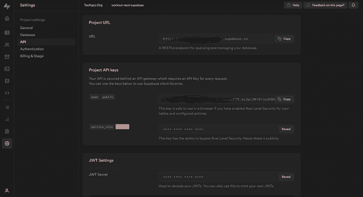

当然，我们不希望在浏览器或我们的存储库上公开这些值，因为这是敏感信息。对我们有利的是，Next.js 提供了对环境变量的内置支持，允许我们在项目的根目录下创建一个`.env.local`文件。这将加载我们的环境变量，并通过在它前面加上`NEXT_PUBLIC`来向浏览器公开它们。

现在，让我们在项目的根目录下创建一个`.env.local`文件，并在文件中包含我们的 URL 和密钥。

```
.env.local

NEXT_PUBLIC_SUPABASE_URL= // paste your project url here
NEXT_PUBLIC_SUPABASE_ANON_KEY= // paste your supabase anon key here

```

> **注意，**不要忘记在你的`gitignore`文件中包含`.env.local`，以防止它在部署时被推送到 GitHub repo(并可供所有人查看)。

现在让我们通过在项目的根目录下创建一个名为`supabase.js`的文件来创建我们的 Supabase 客户端文件。在`supabase.js`文件中，我们将编写以下代码:

```
// supabase.js
import { createClient } from "@supabase/supabase-js";

const supabaseUrl = process.env.NEXT_PUBLIC_SUPABASE_URL;
const supabaseKey = process.env.NEXT_PUBLIC_SUPABASE_ANON_KEY;

export const supabase = createClient(supabaseUrl, supabaseKey);

```

这里，我们从 Supabase 导入一个`createClient`函数，并创建一个名为`supabase`的变量。我们调用`createClient`函数，然后传入我们的参数:URL ( `supabaseUrl`)和 Anon Key ( `supabaseKey`)。

现在，我们可以在项目的任何地方调用和使用 Supabase 客户端！

## 配置我们应用的用户界面

首先，我们需要将我们的应用程序配置成我们想要的样子。我们将有一个项目名称的导航栏，以及首次加载应用程序时的**登录**和**注册**选项。当用户注册并登录时，我们将显示导航栏，其中有**主页**、**注销**和**创建锻炼**按钮。

网站上的每一页都会有一个页脚。

为此，我们将创建一个`component`文件夹来存放`Navbar.js`和`Footer.js`文件。然后，在`_app.js`中，我们将用`Navbar`和`Footer`组件包装我们的`pages`组件，这样它们就会显示在应用程序的每个页面上。

```
// _app.js
import Footer from "../components/Footer";
import Navbar from "../components/Navbar";
import "../styles/globals.css";

function MyApp({ Component, pageProps }) {
 return (
   <div>
     <Navbar/>
     <Component {...pageProps}/>
     <Footer />
   </div>
 );
}

export default MyApp;

```

[我在这里创建了一个 GitHub gist】来看看这两个组件和我使用的风格是什么样子。](https://gist.github.com/Taofiqq/5fe986309bf2bdbf7eb7edd4249960cd)

现在，我们的主页应该是这样的:

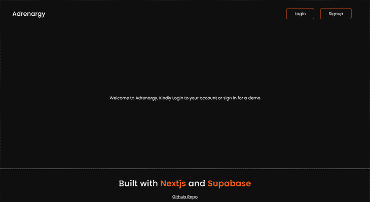

## 实施用户身份验证

为了实现用户认证，我们将在我们的`_app.js`文件中初始化用户状态，并创建一个`validateUser`函数来检查和验证用户。然后，我们将用户状态设置为返回的会话对象。

```
// _app.js

import { useState, useEffect } from "react";
import Footer from "../components/Footer";
import Navbar from "../components/Navbar";
import "../styles/globals.css";
import { supabase } from "../utils/supabase";

function MyApp({ Component, pageProps }) {
 const [session, setSession] = useState(null);

 useEffect(() => {
   setSession(supabase.auth.session());
   supabase.auth.onAuthStateChange((_event, session) => {
     setSession(session);
   });
 }, []);
 return (
   <div>
     <Navbar session={session} />
     <Component {...pageProps} session={session} />
     <Footer />
   </div>
 );
}
export default MyApp;

```

当用户加载我们的应用程序的主页时，我们希望显示一个按钮，告诉他们要么登录，要么注册。当点击**登录**按钮时，它会将用户重定向到一个页面，用户可以在那里输入他们的电子邮件和密码。如果他们是现有用户并且登录详细信息有效，他们将被重定向到主页。

如果用户的凭据无效，将显示一条警告消息，告诉用户该问题。他们会看到一个注册选项。

当用户注册时，一封确认邮件将被发送到他们输入的邮箱。他们需要点击邮件正文中的链接来确认他们的邮件。

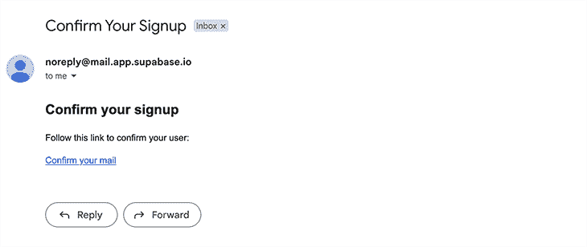

现在，当我们点击**登录**按钮时，我们应该被重定向到用户页面到这个页面:

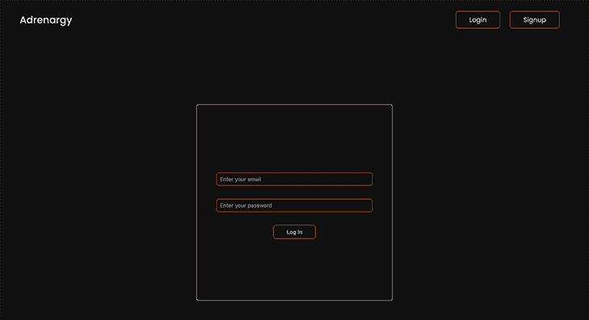

现在，我们可以点击**注册**按钮并输入电子邮件。

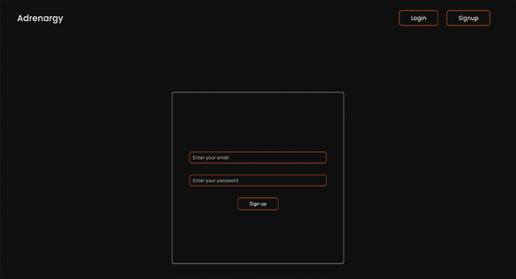

单击此按钮后，将会发送一封电子邮件来确认电子邮件地址。确认后，它会让我们登录，我们应该会看到这样一个页面:

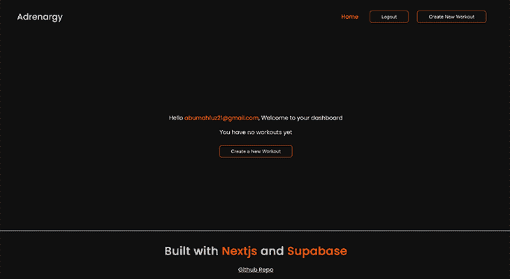

请注意，如果我们尚未登录，我们将无法看到我们的活动仪表板、创建新健身程序的按钮或注销。这就是最初提到的由 Supabase 提供给我们的认证！

## 实现健身程序功能

现在，我们将让用户能够创建、修改和删除他们的锻炼。

### 获取所有锻炼数据

我们需要获取我们将创建的所有训练，并将其呈现在主页上。我们将在`index.js`文件中这样做:

```
// /pages/index.js
import Head from "next/head";
import Link from "next/link";
import { useEffect, useState } from "react";
import styles from "../styles/Home.module.css";
import { supabase } from "../utils/supabase";
import WorkoutCard from "../components/WorkoutCard";

export default function Home({ session }) {
 const [workouts, setWorkouts] = useState([]);
 const [loading, setLoading] = useState(true);

 useEffect(() => {
   fetchWorkouts();
 }, []);

 const fetchWorkouts = async () => {
   const user = supabase.auth.user();
   try {
     setLoading(true);
     const { data, error } = await supabase
       .from("workouts")
       .select("*")
       .eq("user_id", user?.id);

     if (error) throw error;
     setWorkouts(data);
   } catch (error) {
     alert(error.message);
   } finally {
     setLoading(false);
   }
 };

 if (loading) {
   return <div className={styles.loading}>Fetching Workouts...</div>;
 }
 return (
   <div className={styles.container}>
     <Head>
       <title>Nextjs x Supabase</title>
       <meta name="description" content="Generated by create next app" />
       <link rel="icon" href="/favicon.ico" />
     </Head>

     <div className={styles.home}>
       {!session?.user ? (
         <div>
           <p>
             Welcome to Adrenargy. Kindly log in to your account or sign in for
             a demo
           </p>
         </div>
       ) : (
         <div>
           <p className={styles.workoutHeading}>
             Hello <span className={styles.email}>{session.user.email}</span>,
             Welcome to your dashboard
           </p>
           {workouts?.length === 0 ? (
             <div className={styles.noWorkout}>
               <p>You have no workouts yet</p>
               <Link href="/create">
                 <button className={styles.button}>
                   {" "}
                   Create a New Workout
                 </button>
               </Link>
             </div>
           ) : (
             <div>
               <p className={styles.workoutHeading}>Here are your workouts</p>
               <WorkoutCard data={workouts}/>
             </div>
           )}
         </div>
       )}
     </div>
   </div>
 );
}

```

在这个组件中，我们正在析构从`_app.js`文件中的`page`道具传递来的`session`对象，并使用它来验证授权用户。如果没有用户，仪表板将不会显示。如果有用户登录，将会出现健身程序控制面板。如果没有创建健身程序，会出现一条“您还没有健身程序”的文字和一个创建新健身程序的按钮。

为了渲染我们创建的训练，我们有两个状态:`workouts`，一个空数组，和一个接受布尔值`true`的`loading`状态。加载页面时，我们使用`useEffect`从数据库中获取锻炼数据。

`fetchWorkouts`函数用于调用 Supabase 实例，以使用`select`方法返回我们数据库中健身程序表的所有数据。的。`eq()` filter 方法用于过滤并只返回用户 id 与当前登录用户匹配的数据。然后，`setWorkouts`被设置为从数据库发送的数据，一旦我们获取数据，`setLoading`被设置回`false`。

如果数据仍在获取中，页面应该显示“获取训练…”并且如果对我们的数据库的请求返回了我们的训练数组，我们希望映射数组并呈现`WorkoutCard`组件。

在`WorkoutCard`组件中，我们呈现了健身程序标题、负荷、重复次数以及创建的日期和时间。创建的时间正在使用`date-fns`库格式化，你可以在这里查看[。当我们在下一节开始创建卡片时，我们将看到我们的卡片是什么样子的。](https://date-fns.org/)

```
// Workoutcard.js

import Link from "next/link";
import styles from "../styles/WorkoutCard.module.css";
import { BsTrash } from "react-icons/bs";
import { FiEdit } from "react-icons/fi";
import { formatDistanceToNow } from "date-fns/";

const WorkoutCard = ({ data }) => {
 return (
   <div className={styles.workoutContainer}>
     {data?.map((item) => (
       <div key={item.id} className={styles.container}>
         <p className={styles.title}>
           {" "}
           Title: {""}
           {item.title}
         </p>
         <p className={styles.load}>
           {" "}
           Load(kg): {"  "}
           {item.loads}
         </p>
         <p className={styles.reps}>Reps:{item.reps}</p>
         <p className={styles.time}>
           created:{" "}
           {formatDistanceToNow(new Date(item.inserted_at), {
             addSuffix: true,
           })}
         </p>
       </div>
     ))}
   </div>
 );
};

export default WorkoutCard;

```

### 创建新的健身程序

现在我们已经登录，我们的仪表板是新鲜和干净的。为了实现创建新锻炼的能力，我们将分别在`pages`和`styles`文件夹中添加`create.js`和`Create.module.css`文件，并实现一些逻辑和样式。

```
// /pages/create.js

import { supabase } from "../utils/supabase";
import { useState } from "react";
import styles from "../styles/Create.module.css";
import { useRouter } from "next/router";

const Create = () => {
 const initialState = {
   title: "",
   loads: "",
   reps: "",
 };

 const router = useRouter();
 const [workoutData, setWorkoutData] = useState(initialState);

 const { title, loads, reps } = workoutData;

 const handleChange = (e) => {
   setWorkoutData({ ...workoutData, [e.target.name]: e.target.value });
 };

 const createWorkout = async () => {
   try {
     const user = supabase.auth.user();

     const { data, error } = await supabase
       .from("workouts")
       .insert([
         {
           title,
           loads,
           reps,
           user_id: user?.id,
         },
       ])
       .single();
     if (error) throw error;
     alert("Workout created successfully");
     setWorkoutData(initialState);
     router.push("/");
   } catch (error) {
     alert(error.message);
   }
 };

 return (
   <>
     <div className={styles.container}>
       <div className={styles.form}>
         <p className={styles.title}>Create a New Workout</p>
         <label className={styles.label}>Title:</label>
         <input
           type="text"
           name="title"
           value={title}
           onChange={handleChange}
           className={styles.input}
           placeholder="Enter a title"
         />
         <label className={styles.label}>Load (kg):</label>
         <input
           type="text"
           name="loads"
           value={loads}
           onChange={handleChange}
           className={styles.input}
           placeholder="Enter weight load"
         />
         <label className={styles.label}>Reps:</label>
         <input
           type="text"
           name="reps"
           value={reps}
           onChange={handleChange}
           className={styles.input}
           placeholder="Enter number of reps"
         />

         <button className={styles.button} onClick={createWorkout}>
           Create Workout
         </button>
       </div>
     </div>
   </>
 );
};

export default Create;

```

在这里，基本的 UI 范围是我们将有一个表单来创建一个新的锻炼。该表单将由三个字段(标题、负载和代表)组成，这是我们在创建数据库时指定的。

定义一个初始状态对象来处理所有这些被传递到`workoutsData`状态的字段。`onChange`功能用于处理输入字段的变化。

`createWorkout`功能使用 Supabase 客户端实例，通过我们定义的初始状态字段创建新的健身程序，并将其插入数据库表格。

最后，我们有一个提醒祝酒词，通知我们新的锻炼何时创建。

然后，一旦创建了健身程序，我们就将表单数据设置回初始的空字符串状态。之后，我们使用`router.push`方法将用户导航回主页。

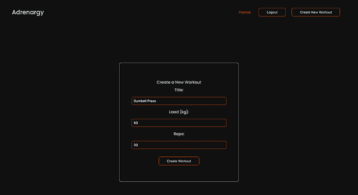

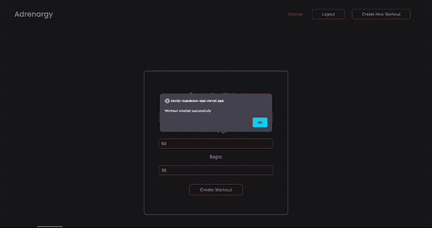

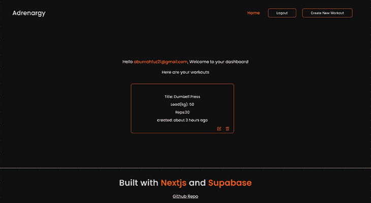

### 更新健身程序

为了更新训练，我们将在我们的`pages`文件夹中创建一个名为`edit`的文件夹，用于保存我们的`[id].js`文件。我们将在健身程序组件卡上创建一个链接到此页面的编辑链接图标。当卡片呈现在主页上时，我们可以点击这个编辑图标，它将把我们带到特定卡片的编辑页面。

然后，我们将从我们的健身程序表中获取所需健身程序卡的详细信息，并由其`id`和卡的授权所有者进行更新。然后，我们将创建一个`updateWorkout`函数来更新我们的锻炼卡详情:

```
// /pages/edit/[id].js
import { useRouter } from "next/router";
import { useEffect, useState } from "react";
import styles from "../../styles/Edit.module.css";
import { supabase } from "../../utils/supabase";

const Edit = () => {
 const [workout, setWorkout] = useState("");
 const router = useRouter();

 const { id } = router.query;
 useEffect(() => {
   const user = supabase.auth.user();
   const getWorkout = async () => {
     const { data } = await supabase
       .from("workouts")
       .select("*")
       .eq("user_id", user?.id)
       .filter("id", "eq", id)
       .single();
     setWorkout(data);
   };
   getWorkout();
 }, [id]);

 const handleOnChange = (e) => {
   setWorkout({
     ...workout,
     [e.target.name]: e.target.value,
   });
 };

 const { title, loads, reps } = workout;
 const updateWorkout = async () => {
   const user = supabase.auth.user();
   const { data } = await supabase
     .from("workouts")
     .update({
       title,
       loads,
       reps,
     })
     .eq("id", id)
     .eq("user_id", user?.id);

   alert("Workout updated successfully");

   router.push("/");
 };
 return (
   <div className={styles.container}>
     <div className={styles.formContainer}>
       <h1 className={styles.title}>Edit Workout</h1>
       <label className={styles.label}> Title:</label>
       <input
         type="text"
         name="title"
         value={workout.title}
         onChange={handleOnChange}
         className={styles.updateInput}
       />
       <label className={styles.label}> Load (kg):</label>
       <input
         type="text"
         name="loads"
         value={workout.loads}
         onChange={handleOnChange}
         className={styles.updateInput}
       />
       <label className={styles.label}> Reps:</label>
       <input
         type="text"
         name="reps"
         value={workout.reps}
         onChange={handleOnChange}
         className={styles.updateInput}
       />

       <button onClick={updateWorkout} className={styles.updateButton}>
         Update Workout
       </button>
     </div>
   </div>
 );
};

export default Edit;

```

首先，我们创建一个状态来存储将从我们的表中获取的锻炼卡细节。然后，我们使用`useRouter`钩子提取该卡的`id`。`getWorkout`功能调用 Supabase 客户端实例来过滤该健身卡的`id`并返回数据(标题、负荷和重复次数)。

返回健身卡详情后，我们可以创建`updateWorkout`函数，使用`.update()`函数修改详情。一旦用户更新了健身程序并点击了**更新健身程序**按钮，就会发送一条警告消息，用户将被重定向回主页。

让我们看看它是如何工作的。

单击编辑图标转到编辑页面。我们将把标题从“Dumbell Press”更名为“Arm Curl”:

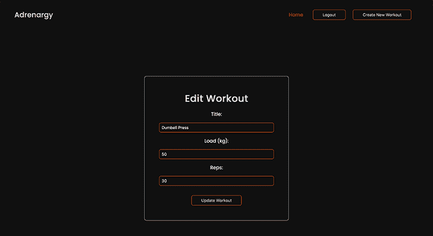

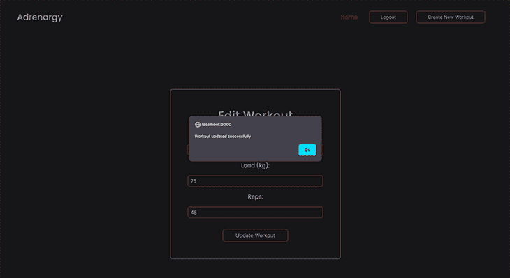

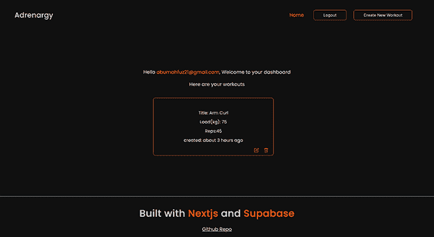

### 删除健身程序

要删除每张卡上的健身程序，我们将创建将`id`作为参数的`handleDelete`函数。我们将调用 Supabase 实例，使用

`.delete()`功能。这个`.eq('id', id)`指定了表中要删除的行的`id`。

```
 const handleDelete = async (id) => {
   try {

     const user = supabase.auth.user();
     const { data, error } = await supabase
       .from("workouts")
       .delete()
       .eq("id", id)
       .eq("user_id", user?.id);
     fetchWorkouts();
     alert("Workout deleted successfully");
   } catch (error) {
     alert(error.message);
   }
 };

```

`eq('user_id', user?.id)`用于检查被删除的卡是否属于该特定用户。该函数将被传递给`index.js`文件中的`WorkoutCard`组件，并被析构以便在组件本身中使用，如下所示:

```
const WorkoutCard = ({ data, handleDelete }) => {
 return (
   <div className={styles.workoutContainer}>
     {data?.map((item) => (
       <div key={item.id} className={styles.container}>
         <p className={styles.title}>
           {" "}
           Title: {""}
           {item.title}
         </p>
         <p className={styles.load}>
           {" "}
           Load(kg): {"  "}
           {item.loads}
         </p>
         <p className={styles.reps}>Reps:{item.reps}</p>
         <p className={styles.time}>
           created:{" "}
           {formatDistanceToNow(new Date(item.inserted_at), {
             addSuffix: true,
           })}
         </p>

         <div className={styles.buttons}>
           <Link href={`/edit/${item.id}`}>
             <a className={styles.edit}>
               <FiEdit />
             </a>
           </Link>
           <button
             onClick={() => handleDelete(item.id)}
             className={styles.delete}
           >
             <BsTrash />
           </button>
         </div>
       </div>
     ))}
   </div>
 );
};

```

一旦卡被成功删除，将显示一个提示提示，用户将被重定向到主页。

## 部署到 Vercel

现在，我们必须将我们的应用程序部署到 Vercel，这样互联网上的任何人都可以使用它！

要部署到 Vercel，您必须首先将您的代码推送到您的存储库，登录到您的 Vercel 仪表板，点击 **Create New Project** ，然后点击您刚刚将代码推送到的存储库。

在**环境变量**字段中输入我们之前创建的环境变量及其值(`NEXT_PUBLIC_SUPABASE_URL`和`NEXT_PUBLIC_SUPABASE_ANON_KEY`，然后单击**部署**将您的应用程序部署到生产环境中。

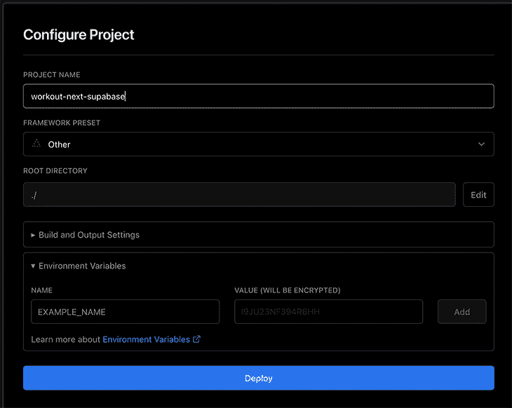

我们做到了！

## 结论

感谢您的阅读！我希望这篇教程能给你提供使用 Next.js 和 Supabase 创建一个全栈应用程序所需的知识。

您可以根据您的用例定制样式，因为本教程主要关注创建全栈应用程序的逻辑。

你可以在这里找到这个项目的完整资源库和这里的 [live Vercel 链接](https://nextjs-supabase-app.vercel.app/)。如果你想了解更多关于 [Supabase](https://supabase.com/docs/) 和 Next.js 的信息，你可以查看他们的文档。

## [LogRocket](https://lp.logrocket.com/blg/nextjs-signup) :全面了解生产 Next.js 应用

调试下一个应用程序可能会很困难，尤其是当用户遇到难以重现的问题时。如果您对监视和跟踪状态、自动显示 JavaScript 错误、跟踪缓慢的网络请求和组件加载时间感兴趣，

[try LogRocket](https://lp.logrocket.com/blg/nextjs-signup)

.

[](https://lp.logrocket.com/blg/nextjs-signup)[](https://lp.logrocket.com/blg/nextjs-signup)

LogRocket 就像是网络和移动应用的 DVR，记录下你的 Next.js 应用上发生的一切。您可以汇总并报告问题发生时应用程序的状态，而不是猜测问题发生的原因。LogRocket 还可以监控应用程序的性能，报告客户端 CPU 负载、客户端内存使用等指标。

LogRocket Redux 中间件包为您的用户会话增加了一层额外的可见性。LogRocket 记录 Redux 存储中的所有操作和状态。

让您调试 Next.js 应用的方式现代化— [开始免费监控](https://lp.logrocket.com/blg/nextjs-signup)。