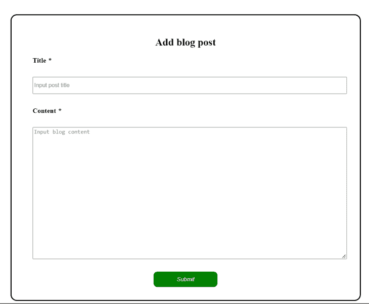
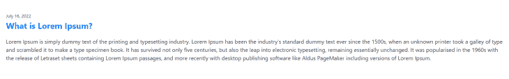
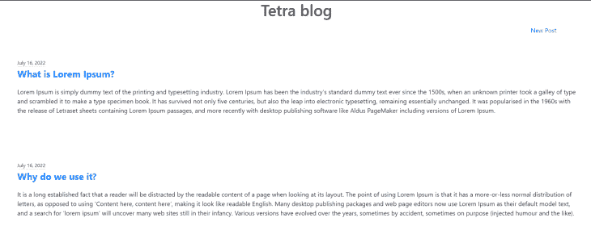
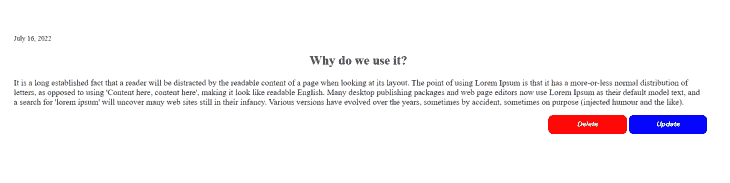
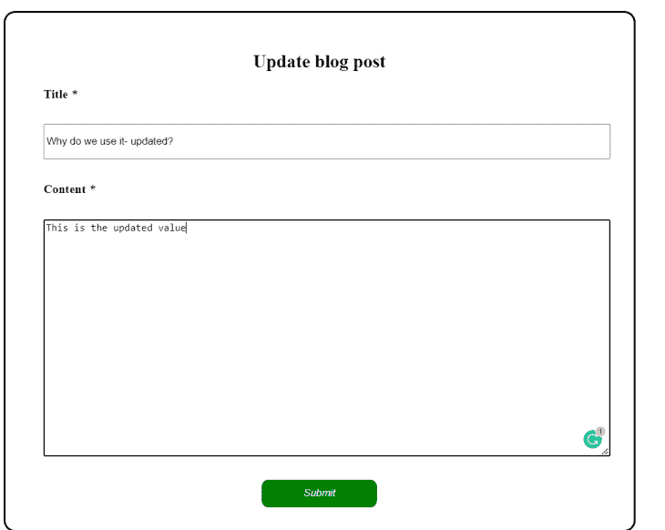
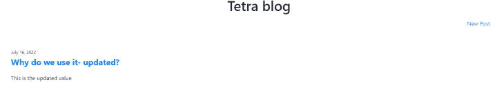

# 使用 Tetra 构建全栈应用

> 原文：<https://blog.logrocket.com/build-full-stack-app-tetra/>

大多数全栈应用将前端和后端代码分离到不同的文件中；大多数 web 框架都是基于这种结构构建的。随着文件和代码行数的增加，可能会增加代码库的复杂性，从而使调试更加困难。通过引入一个名为 [Tetra](https://www.tetraframework.com/) 的框架，这些独立文件导致的复杂性被最小化。

本教程将向您介绍 Tetra 框架及其组件。您还将学习如何构建一个简单的全栈博客应用程序，使用 Tetra 执行 CRUD 功能。

我们将讨论以下内容:

## Tetra 是什么？

[Tetra](https://www.tetraframework.com/#features) 是在服务器端用 [Django](https://docs.djangoproject.com/) 和 [Alpine.js](https://alpinejs.dev/) 搭建的全栈框架，执行前端逻辑。Tetra 允许在一个统一的位置拥有前端和后端逻辑，并降低应用程序中的代码复杂性。它使用一个称为组件类的类将后端实现与前端连接起来。

### Tetra 组件

tetra 组件是一个代码单元，它将 Python、HTML、CSS 和 JavaScript 逻辑作为单个 Python 文件中的一个实体来处理。如果您熟悉 [React 框架](https://reactjs.org/)，您可以将其组件的行为比作 Tetra 组件，除了 React 组件只执行前端功能。

组件可以相互依赖，也可以相互独立。这意味着您可以从一个组件调用另一个组件，或者将它作为一个独立的组件。你可以在这里阅读更多关于 tetra 组件[的信息。](https://www.tetraframework.com/docs/components)

## 让我们建立一个 Tetra 博客应用程序

本教程的其余部分将指导您如何在 Django 应用程序中安装 Tetra，以及如何使用 Tetra 构建博客应用程序的分步流程。博客应用程序将从管理员的角度呈现，在这里您可以创建新帖子，更新现有帖子，删除帖子，以及查看所有博客帖子。

应用程序将不包括任何身份验证或授权层。目标是在关注 Tetra 核心功能的同时，尽可能保持简单。

### 先决条件

*   熟练使用 [Django](https://www.djangoproject.com/) 构建单片应用
*   HTML、CSS 和 JavaScript 的工作知识
*   任何合适的 IDE 或文本编辑器
*   计算机上安装的 Python 版本 3.9 或更高版本
*   安装在您机器上的 npm 软件包管理器

## 项目设置

第一步是为应用程序创建一个虚拟环境。在终端中运行以下命令来设置项目目录和虚拟环境:

```
mkdir tetra
cd tetra
python -m venv tetra 
cd tetra
Scripts/activate
```

下一步是安装 Django。因为 Tetra 在 Django 框架上运行，所以需要将 Django 集成到您的应用程序中。

```
pip install django
django-admin startproject tetra_blog
cd tetra_blog
```

接下来，创建博客应用程序:

```
python manage.py startapp blog
```

将博客应用添加到`settings.py`文件的`INSTALLED_APPS`列表中，如下图所示:

```
INSTALLED_APPS = [
    'blog.apps.BlogConfig',
    ...
 ]
```

在 app 目录中，创建一个`components.py`文件，该文件将包含您将在项目中构建的所有组件。

## Tetra 安装和配置

成功设置 Django 项目后，下一步是在应用程序中安装 Tetra 框架。

```
pip install tetraframework
```

在`settings.py`文件中，将`tetra`添加到`INSTALLED_APPS`列表中，如下图所示:

```
INSTALLED_APPS = [
    ...
    'tetra',
    'django.contrib.staticfiles',
    ...
]
```

确保`tetra`列在`django.contrib.staticfiles`元素之前。

接下来，您将希望在`MIDDLEWARE`列表的末尾包含`tetra.middleware.TetraMiddleware`。这会将组件中的 JavaScript 和 CSS 添加到 HTML 模板中。

```
MIDDLEWARE = [ 
    ...
    'tetra.middleware.TetraMiddleware'
]
```

将下面的修改应用到根`urls.py`文件，通过你的公共方法公开 Tetra 的端点:

```
from django.urls import path, include
from django.conf import settings
from django.conf.urls.static import static

urlpatterns = [
    ...

    path('tetra/', include('tetra.urls')),
  ] + static(settings.STATIC_URL, document_root=settings.STATIC_ROOT)
```

### 安装 ebuild

Tetra 构建你的 JS/CSS 组件并使用 [esbuild](https://esbuild.github.io/) 打包它们。这允许您跟踪任何可能发生在 Python 源文件的前端实现中的错误。

```
npm init
npm install esbuild
```

如果您使用的是 Windows 操作系统，您必须在您的`settings.py`文件中明确声明`esbuild`的构建路径:

```
TETRA_ESBUILD_PATH = '<absolute-path-to-project-root-directory>/node_modules/.bin/esbuild.cmd'
```

## 博客帖子模型

该应用程序将在博客帖子上执行 CRUD 功能。`Post`模型将包含三个属性:标题、内容和日期。

将以下代码添加到`models.py`文件中，以设置`Post`模型:

```
from django.db import models
from django.utils import timezone
from django.urls import reverse

class Post(models.Model):
    title = models.CharField(max_length=100)
    content = models.TextField()
    date_posted = models.DateTimeField(default=timezone.now)

    def __str__(self):
        return self.title
    // generate a reverse url for the model
    def get_absolute_url(self):
        return reverse('post-detail', kwargs={'pk': self.id})
```

执行迁移命令为模型创建一个表:

```
python manage.py makemigrations
python manage.py migrate
```

## `AddPost`组件

该组件负责呈现 UI 以创建新文章。它还将包含我们创建一个`Post`模型并在数据库中保存数据所需的 Python 逻辑。

在`components`文件夹中创建`add_post.py`文件，并将以下代码添加到该文件中:

```
from sourcetypes import javascript, css, django_html
from tetra import Component, public, Library
from ..models import Post

default = Library()

@default.register
class AddPost(Component):
    title=public("")
    content=public("")

    def load(self):
        self.post = Post.objects.filter(id=0)

    @public
    def add_post(self, title, content):
        post = Post(
            title = title,
            content = content
        )
        post.save()
```

在上面的代码中，`AddPost`类是 Tetra 组件类的子类，Tetra 组件类是构建定制组件的基类。使用`@default.register`装饰器，将`AddPost`组件注册到 Tetra 库中。

`title`和`content`变量是组件的[公共属性](https://www.tetraframework.com/docs/components#public-attributes)，每个变量都有一个空字符串的初始值。`public attributes`的值可用于模板、JavaScript 和服务器逻辑。

当组件启动时，以及当它从保存状态恢复时，`load`方法运行。你可以把`load`方法当做组件的构造器；它在您从模板中调用组件时运行。

`add_post`方法是一个[公共方法](https://www.tetraframework.com/docs/components#public-methods)，它接收标题和内容作为参数来创建一个`Post`实例，然后将它保存到数据库中。就像公共属性一样，公共方法向模板、JavaScript 和 Python 公开。通过在方法签名上方添加`@public`装饰器，将方法声明为公共的。

下面是您应该作为`AddPost`组件的一部分包含在`add_post.py`文件中的 HTML 代码:

```
template: django_html = """

    <div class="container">
        <h2>Add blog post</h2>
        <label> Title
        <em>*</em>
        </label>
        <input type="text" maxlength="255" x-model="title" name="title" placeholder="Input post title" required/>

        <label> Content
        <em>*</em>
        </label>
        <textarea rows="20" cols="80" x-model="content" name="content" placeholder="Input blog content" required /> </textarea>

        <button type="submit" @click="addPost(title, content)"><em>Submit</em></button>
    </div>

    """
```

输入字段接收文章标题，并通过 [Alpine.js x-model 属性](https://alpinejs.dev/directives/model)将其绑定到`title`公共属性。同样，`textarea`接收博客文章的内容，并将该值绑定到组件的`content`公共属性。

使用按钮标记中的 Alpine.js `@click`指令，模板调用 JavaScript `addPost`方法:

```
script: javascript = """
    export default {

        addPost(title, content){
            this.add_post(title, content)   
        }

    }
    """
```

JavaScript `addPost`方法将从标题和内容中获得的值作为参数传递给组件的`add_post`公共方法。您也可以从上面的 HTML 模板中直接调用`add_post`公共方法。

这里通过 JavaScript 函数传递它的目的是演示如何在 Tetra 组件中执行 JavaScript 操作。这有助于您更好地控制用户的行为，例如在用户单击按钮后禁用按钮，以防止用户在处理之前的请求时发送多个请求。

下面是设置模板样式的 CSS 代码:

```
style: css = """
    .container {
        display: flex;
        flex-direction: column;
        align-items: left;
        justify-content: center;
        border-style: solid;
        width: fit-content;
        margin: auto;
        margin-top: 50px;
        width: 50%;
        border-radius: 15px;
        padding: 30px;
    }

    input, textarea, label{
        margin-bottom: 30px;
        margin-left: 20px;
        ;
    }

    label {
        font-weight: bold;
    }

    input{
        height: 40px;
    }

    h2 {
        text-align: center;
    }

    button {
        width: 150px;
        padding: 10px;
        border-radius: 9px;
        border-style: none;
        background: green;
        color: white;
        margin: auto;
    }

    """
```

下一步是从 Django 视图模板中调用`AddPost`组件。在博客应用程序`templates`文件夹中创建一个`add_post.html`文件，该文件夹是您在本教程的上一节中创建的。将以下代码片段添加到文件中:

```

<!Doctype html>
<html lang="en">
  <head>
    <title> Add post </title>
    
    
  </head>
  <body>
     <form enctype="multipart/form-data" method="POST">
      
      
    </form>
  </body>
  </html>
```

该模板首先将 Tetra 模板标签加载到模板中。它通过代码顶部描述的``命令来实现这一点。您还需要分别通过``和`{% tetra_scripts}`将 CSS 和 JavaScript 注入模板。

默认情况下，Tetra 不会在模板中包含 Alpine.js。在注入组件的 JavaScript 时，必须通过添加`include_alpine=True`来显式声明它。

`form`标签中的``标签调用`AddPost`组件的`load`方法，并呈现您在创建组件时声明的 HTML 内容。

注意，用于加载组件的组件名是蛇形的。这是从模板调用组件的默认配置。您也可以在创建组件时设置自定义名称，如下所示:

```
...
@default.register(name="custom_component_name")
class AddPost(Component):
...
```

然后您可以使用``加载组件。

接下来，将下面的代码片段添加到`views.py`文件中:

```
from django.shortcuts import render

def add_post(request):
    return render(request, 'add_post.html')
```

在博客应用程序目录中创建一个`urls.py`文件，并将以下代码片段添加到该文件中:

```
from django.urls import path
from . import views

urlpatterns = [
     path("add", views.add_post, name='add-post'),

]
```

在根文件`urls.py`中，添加以下路径:

```
urlpatterns = [
    ...
    path('tetra/', include('tetra.urls')),
    path('post/', include('blog.urls'))
]
```

用`python manage.py runserver command`运行应用程序。通过`localhost:8000/post/add`在浏览器上查看页面。

以下是该页面的输出:



## `PostItem`组件

`PostItem`组件包含用于在主屏幕上呈现创建的帖子的模板。

```
@default.register
class PostItem(Component):

    def load(self, post):
        self.post = post
```

`load`方法接收`Post`实例作为其参数，并将其暴露给 HTML 模板，该模板在屏幕上呈现其标题和内容。

```
 template: django_html = """

    <article class="post-container" >
            <small class="article-metadata">{{ post.date_posted.date}}</small>
            <p class="article-title"> {{ post.title }}</p>
            <p class="article-content">{{ post.content }}</p>

        </article>

    """
```

``标签是一个 [Tetra 属性标签](https://www.tetraframework.com/docs/attribute-tag)，模板在调用组件时用它来接收传递给它的参数。当使用 attributes 标记接收参数时，应该在 HTML 模板的根节点中声明该标记，就像上面代码片段中的 article 标记一样。

下面是模板的 CSS 实现:

```
style: css = """

    .article-metadata {
        padding-bottom: 1px;
        margin-bottom: 4px;
        border-bottom: 1px solid #e3e3e3;

    }

    .article-title{
        font-size: x-large;
        font-weight: 700;
    }

    .article-content {
        white-space: pre-line;
    }

    .post-container{
        margin: 50px;
    }

    a.article-title:hover {
        color: #428bca;
        text-decoration: none;
    }

    .article-content {
        white-space: pre-line;
    }

    a.nav-item{
        text-align: right;
        margin-right: 100px;
    }

    h1 {
       text-align: center;
    }
    """
```

下面是通过`PostItem`组件发布的内容:



## `ViewPosts`组件

该组件负责呈现所有创建的帖子。将以下代码片段添加到`components.py`文件中:

```
@default.register
class PostView(Component):

    def load(self):
        self.posts = Post.objects.all()

    template: django_html = """
        <div>
            <h1> Tetra blog </h1>
            <div class="navbar-nav">
                <a class="nav-item nav-link" href="">New Post</a>
            <div>
            <div class="list-group">
                
                    
                
            </div>
         </div>
        """
```

组件中的`load`方法从数据库中检索所有创建的帖子。HTML 模板包含一个锚标记，它指向`add-post` URL 来创建一篇新文章。

对于从数据库获取的每个 post，HTML 通过在 For 循环中传递 post 对象作为其参数来创建一个`PostItem`组件。

接下来，从 Django 视图模板中调用`ViewPost`组件。在博客应用程序的`templates`文件夹中创建一个`home.html`文件，并将以下代码片段添加到该文件中:

```

<!Doctype html>
<html lang="en">
  <head>
    <title> Blog home </title>
    <link rel="stylesheet" href="https://maxcdn.bootstrapcdn.com/bootstrap/4.0.0/css/bootstrap.min.css" integrity="sha384-Gn5384xqQ1aoWXA+058RXPxPg6fy4IWvTNh0E263XmFcJlSAwiGgFAW/dAiS6JXm" crossorigin="anonymous">
    
    
  </head>
  <body>
      
  </body>
  </html>
```

接下来，将以下内容添加到`views.py`文件中:

```
def home(request):
    return render(request, 'home.html')
```

最后，更新博客应用程序`urls.py`文件中的`urlpatterns`列表。

```
urlpatterns = [
     path("", views.home, name='home'),
    ...
]
```

您可以通过`localhost:8000/post`查看页面。



## `PostDetail`组件

该组件将在一个页面上呈现完整的文章。该页面还将包含两个按钮:分别用于删除和更新文章。将以下代码添加到`components.py`文件中:

```
@default.register
class PostDetail(Component):

    def load(self, pk):
        self.post = Post.objects.filter(id=pk)[0]

    @public(update=False)
    def delete_item(self):
        Post.objects.filter(id=self.post.id).delete()
        self.client._removeComponent()
```

`load`方法通过`pk`变量接收帖子的`id`并获取`Post`实例，该实例的 ID 与数据库中的`pk`值相匹配。

`delete_item`方法从数据库中删除`Post`实例，自动将其从主屏幕中删除。默认情况下，当您调用组件时，公共方法将重新呈现该组件。通过在`@public`装饰器中将`update`属性设置为`False`，它确保不会试图重新呈现之前删除的帖子。

以下是 HTML 模板:

```
 template: django_html = """
        <article > 
            <small class="text-muted">{{ post.date_posted.date}}</small>

            <h2 class="article-title">{{ post.title }}</h2>
            <p class="article-content">{{ post.content }}</p>

            <div class="post-buttons">
            <button id="delete-button" type="submit" @click="delete_item()"><em>Delete</em></button>
           <button id="update-button"> <em>Update</em> </button>
            </div>

        </article>
    """
```

该模板检索从`load`方法获取的文章的日期、标题和内容，并呈现这些值。它还包含删除和更新文章的按钮。**删除**按钮调用`delete_item`方法对帖子执行删除操作。我们将在后续部分实现**更新**按钮。

下面是模板的 CSS:

```
 style: css = """

        article{
            margin: 100px;
        }

        .post-buttons{
            position: absolute;
            right: 0;
        }

        #delete-button, #update-button{
            width: 150px;
            padding: 10px;
            border-radius: 9px;
            border-style: none;
            font-weight: bold;
            margin: auto;
        }

        #update-button{
            background: blue;
            color: white;
        }

        #delete-button{
            background: red;
            color: white;
        }

    """
```

在上一节创建的`PostItem`模板中，通过包含一个`anchor`标签来更新 HTML 代码，该标签将用户从主屏幕引导到帖子详细信息页面。

```
@default.register
class PostItem(Component):

  ...        

    template: django_html = """

    <article class="post-container" >
           ...
            <a href=""> {{ post.title }}</a>
          ...

        </article>

    """
```

在 templates 文件夹中，创建一个`post-detail.html`文件，该文件将作为 post-detail 页面的根 HTML 文件，并在该文件中包含以下代码:

接下来，更新`views.py`和`urls.py`文件以包含帖子详细信息页面的路径:

```
def post_detail(request, **kwargs):
    return render(request, 'post_detail.html', kwargs)
```

```
urlpatterns = [
     path("<int:pk>/", views.post_detail, name='post-detail')
]
```

通过单击博客主页上的文章标题，在浏览器中查看文章的详细信息。



## `UpdatePost`组件

该组件负责更新现有帖子的标题和内容。

```
@default.register
class PostUpdate(Component):
    title=public("")
    content=public("")

    def load(self, pk):
        self.post = Post.objects.filter(id=pk)[0]
        self.title=self.post.title
        self.content=self.post.content

    @public
    def update_post(self, title, content):
        self.post.title = title
        self.post.content = content

        self.post.save()

```

`load`方法接收您想要更新的文章的 ID，并从数据库中获取它。然后，它将其标题和内容分别分配给`title`和`content`公共属性。

`update_post`方法接收更新的标题和内容，并将它们分配给获取的文章，然后保存到数据库。

下面是组件的 HTML 模板:

```
 template: django_html = """
        <div class="container">
            <h2>Update blog post</h2>
            <label> Title
            <em>*</em>
            </label>
            <input type="text" maxlength="255" x-model="title" name="title" required/>

            <label> Content
            <em>*</em>
            </label>
            <textarea rows="20" cols="80" x-model="content" name="content" required> </textarea>

            <button type="submit" @click="update_post(title, content)"><em>Submit</em></button>
        </div>
        """
```

上面的模板通过 Alpine.js `x-model`属性呈现标题和内容公共属性的值，而按钮使用 Alpine.js `@click`函数调用`update_post`方法，并将标题和内容的新值作为参数传递。

在上一节创建的`PostDetail`模板中，通过包含一个`anchor`标签来更新 HTML 代码，该标签将用户从主屏幕引导到 post update 页面。

```
@default.register
class PostDetail(Component):

   ...

    template: django_html = """
        <article   > 
            ...
            <a class="nav-item nav-link" href=""><button id="update-button"> <em>Update</em> </button></a>
         ...

        </article>
    """
```

接下来，在 template 文件夹中，创建一个`post_update.html`文件，作为`PostUpdate`组件的根 HTML 模板。将以下代码片段添加到文件中:

```

<!Doctype html>
<html>
  <head>
    <title> Update post </title>
    
    
  </head>
  <body>
     <form enctype="multipart/form-data" method="POST">
      
      
    </form>
  </body>
  </html>
```

最后，分别用下面的代码更新`views.py`和`urls.py`文件:

```
def update_post(request, **kwargs):
    return render(request, 'post_update.html', kwargs)
```

```
urlpatterns = [
     ...
     path("<int:pk>", views.update_post, name='update-post'),
     ...

]
```

您可以通过点击帖子详细信息屏幕上的**更新**按钮导航到`update-post`页面。





## 关于 Tetra 生产准备就绪的说明

在撰写本文时，Tetra 仍处于早期开发阶段，目前支持 Python 3.9 及更高版本。然而，Tetra 团队正致力于将该框架的功能扩展到 Python 的旧版本。

在用 Tetra 开始生产之前，你应该知道的一件事是框架文档需要大量的改进。它太简洁了，因为有些依赖项要么根本没有解释，要么不够详细。例如，文档没有讨论如何处理图像，这就是为什么我们为这个演示构建了一个博客应用程序。

直到我完成了这个项目，我才意识到这个框架并不像文档中描述的那么复杂。

## 结论

本文向您介绍了 Tetra 及其组件。通过构建一个执行 CRUD 操作的简单博客应用程序，您了解了 Tetra 如何工作，以及如何从单个文件执行全栈操作。

Tetra 主页包含了一些额外的例子，展示了如何用 Tetra 构建一些简单的应用程序。如果你也有兴趣了解这个框架的更多信息，[文档](https://www.tetraframework.com/docs/introduction)可以为你提供指导。你可以在 [GitHub](https://github.com/olu-damilare/tetra_blog) 上查看博客应用的完整实现。

## 使用 [LogRocket](https://lp.logrocket.com/blg/signup) 消除传统错误报告的干扰

[](https://lp.logrocket.com/blg/signup)

[LogRocket](https://lp.logrocket.com/blg/signup) 是一个数字体验分析解决方案，它可以保护您免受数百个假阳性错误警报的影响，只针对几个真正重要的项目。LogRocket 会告诉您应用程序中实际影响用户的最具影响力的 bug 和 UX 问题。

然后，使用具有深层技术遥测的会话重放来确切地查看用户看到了什么以及是什么导致了问题，就像你在他们身后看一样。

LogRocket 自动聚合客户端错误、JS 异常、前端性能指标和用户交互。然后 LogRocket 使用机器学习来告诉你哪些问题正在影响大多数用户，并提供你需要修复它的上下文。

关注重要的 bug—[今天就试试 LogRocket】。](https://lp.logrocket.com/blg/signup-issue-free)