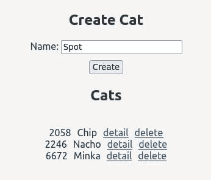
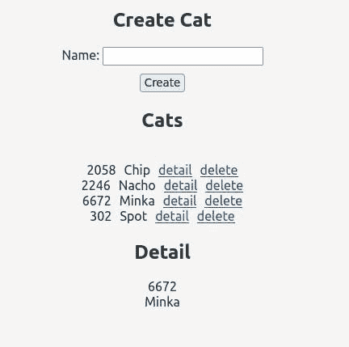
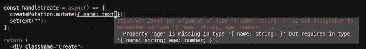
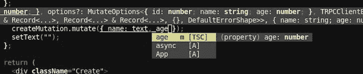

# 使用 tRPC 和 React - LogRocket 博客构建一个全栈 TypeScript 应用程序

> 原文：<https://blog.logrocket.com/build-full-stack-typescript-app-trpc-react/>

你可能已经熟悉了远程过程调用框架 [gRPC](https://grpc.io/) 。鉴于命名的相似性，你可能倾向于相信 [tRPC](https://trpc.io/) 与它有某种联系，或者做相同或相似的事情。然而，事实并非如此。

虽然 tRPC 确实也是一个远程过程调用框架，但它的目标和基础与 gRPC 有根本的不同。tRPC 的主要目标是提供一种简单的、类型安全的方法，以最小的占用空间为基于 TypeScript 和 JavaScript 的项目构建 API。

在本文中，我们将使用 tRPC 构建一个简单的全栈 TypeScript 应用程序，当涉及到代码和跨越 API 边界时，它将是类型安全的。我们将构建一个小型的 cat 主题应用程序，展示如何在后端设置 tRPC，以及如何在 React 前端使用创建的 API。你可以在 [GitHub](https://github.com/zupzup/trpc-example) 上找到这个例子的完整代码。我们开始吧！

## 探索 tRPC

如果您有一个在后端和前端都使用 TypeScript 的应用程序，tRPC 会帮助您以一种在依赖性和运行时复杂性方面产生绝对最小开销的方式来设置 API。然而，tRPC 仍然提供了类型安全和所有随之而来的特性，比如整个 API 的自动完成和当 API 被无效使用时的错误。

实际上，您可以将 tRPC it 视为 GraphQL 的一个非常轻量级的替代方案。然而，tRPC 并非没有其局限性。首先，它仅限于 TypeScript 和 JavaScript。此外，您正在构建的 API 将遵循 tRPC 模型，这意味着它不是 REST API。你不能简单地把一个 REST API 转换成 tRPC，然后拥有和以前一样的 API，但是包含类型。

从本质上讲，tRPC 是一个包含电池的解决方案，可以满足你所有的 API 需求，但它也将是一个 tRPC-API。这就是名称中的 RPC 的来源，它从根本上改变了远程调用的工作方式。只要您习惯在 API 网关上使用 TypeScript，tRPC 可能是一个很好的解决方案。

## 设置 tRPC

我们首先在项目根目录下创建一个名为`server`的文件夹。在`server`文件夹中，我们创建一个`package.json`文件，如下所示:

```
{
  "name": "server",
  "version": "1.0.0",
  "description": "",
  "main": "index.js",
  "scripts": {
    "test": "echo \"Error: no test specified\" && exit 1"
  },
  "author": "",
  "license": "ISC",
  "devDependencies": {
    "@tsconfig/node14": "^1.0.1",
    "typescript": "^4.5"
  },
  "dependencies": {
    "@trpc/server": "^9.21.0",
    "@types/cors": "^2.8.12",
    "@types/express": "^4.17.13",
    "cors": "^2.8.5",
    "express": "^4.17.2",
    "zod": "^3.14.2"
  }
}

```

我们还将创建一个`tsconfig.json`文件:

```
{
  "extends": "@tsconfig/node14/tsconfig.json",
  "compilerOptions": {
      "outDir": "build"
  }
}

```

最后，创建一个可执行的`run.sh`文件:

```
#!/bin/bash -e

./node_modules/.bin/tsc && node build/index.js

```

接下来，我们创建一个名为`src`的文件夹，并在其中包含一个`index.ts`文件。最后，我们执行`server`文件夹中的`npm install`。至此，我们完成了后端的设置。

对于前端，我们将使用 [Create React App 来设置一个 React app](https://blog.logrocket.com/getting-started-with-create-react-app-d93147444a27/) ,使用项目根中的以下命令来支持 TypeScript:

```
npx create-react-app client --template typescript

```

我们也可以运行`client`文件夹中的`npm install`，用`npm start`运行应用程序，看看一切正常，设置正确。接下来，我们将实现应用程序的后端。

## 设置我们的 Express 后端

### 安装依赖项

正如您在应用程序的`server`部分的`package.json`中看到的，我们使用 Express 作为 HTTP 服务器。此外，我们添加了 TypeScript 和`trpc-server`依赖项。

除此之外，我们使用了`cors`库来将 CORS 添加到我们的 API 中，这对于这个例子来说并不是必需的，但是这是一个很好的实践。我们还添加了[Z](https://github.com/colinhacks/zod)od，这是一个支持类型脚本的模式验证库，通常与 tRPC 结合使用。然而，你也可以使用其他库，比如[Y](https://github.com/jquense/yup)up 或者 [Superstruct](https://github.com/ianstormtaylor/superstruct) 。稍后我们会看到这到底是为了什么。

解决了依赖关系之后，让我们用 tRPC 支持来设置我们的基本 Express 后端。

### 带有 Express 的后端

我们将从定义 tRPC 路由器开始，它是整个基础设施的一个非常重要的部分，允许我们在类型安全和自动完成方面将后端和前端连接在一起。这个路由器应该在它自己的文件中，例如`router.ts`，因为我们稍后也会将它导入到 React 应用程序中。

在`router.ts`中，我们首先为我们的域对象`Cat`定义数据结构:

```
let cats: Cat[] = [];

const Cat = z.object({
    id: z.number(),
    name: z.string(),
});
const Cats = z.array(Cat);

...

export type Cat = z.infer<typeof Cat>;
export type Cats = z.infer<typeof Cats>;

```

您可能想知道为什么我们不构建简单的 JavaScript 或 TypeScript 类型和对象。因为我们使用 Zod 对 tRPC 进行模式验证，所以我们也需要用它来构建这些域对象。我们实际上可以使用 Zod 添加验证规则，比如字符串的最大字符数、电子邮件验证等等，将类型检查与实际验证结合起来。

当输入无效时，我们还会得到自动创建的错误消息。但是，这些错误可以完全自定义。如果您对验证和错误处理感兴趣，[查看文档](https://trpc.io/docs/error-formatting)了解更多信息。

使用 Zod 实现我们的类型后，我们可以使用`z.infer`从中推断出一个 TypeScript 类型。一旦我们有了这些，我们就导出类型用于应用程序的其他部分，如前端，然后继续创建应用程序的核心，路由器:

```
const trpcRouter = trpc.router()
    .query('get', {
        input: z.number(),
        output: Cat,
        async resolve(req) {
            const foundCat = cats.find((cat => cat.id === req.input));
            if (!foundCat) {
                throw new trpc.TRPCError({
                    code: 'BAD_REQUEST',
                    message: `could not find cat with id ${req.input}`,
                });
            }
            return foundCat;
        },
    })
    .query('list', {
        output: Cats,
        async resolve() {
            return cats;
        },
    })

```

我们可以通过调用`router()`方法创建一个 tRPC 路由器，并将我们不同的端点链接到它上面。我们还可以创建多个路由器，并将它们组合在一起。在 tRPC 中，有两种类型的程序:

*   查询:用于提取数据。思考`GET`
*   突变:用于改变数据。想想`POST`、`PUT`、`PATCH`、`DELETE`

在上面的代码片段中，我们创建了我们的`query`端点，一个用于通过 ID 获取单个的`Cat`对象，一个用于获取所有的`Cat`对象。tRPC 还支持`infiniteQuery`的概念，它接受一个光标，如果需要的话，可以返回一个潜在无限数据的分页响应。

对于 out `GET`端点，我们定义了一个`input`。这个端点本质上是一个`GET /get?input=123`端点，根据上面的定义返回我们的`Cat`的 JSON。

如果需要，我们可以定义多个输入。在`resolve`异步函数中，我们实现了实际的业务逻辑。在现实世界的应用程序中，我们可能称之为服务或数据库层。然而，因为我们只是将我们的`Cat`对象保存在内存中，或者保存在一个数组中，我们检查是否有一个具有给定 ID 的`Cat`，如果没有，我们抛出一个错误。如果我们找到一个`Cat`，我们就返回它。

`list`端点甚至更简单，因为它不接受任何输入，只返回我们当前的`Cat`对象列表。让我们看看如何用 tRPC 实现创建和删除:

```
    .mutation('create', {
        input: z.object({ name: z.string().max(50) }),
        async resolve(req) {
            const newCat: Cat = { id: newId(), name: req.input.name };
            cats.push(newCat)
            return newCat
        }
    })
    .mutation('delete', {
        input: z.object({ id: z.number() }),
        output: z.string(),
        async resolve(req) {
            cats = cats.filter(cat => cat.id !== req.input.id);
            return "success"
        }
    });

function newId(): number {
    return Math.floor(Math.random() * 10000)
}

export type TRPCRouter = typeof trpcRouter;
export default trpcRouter;

```

如您所见，我们使用`.mutation`方法来创建一个新的突变。在其中，我们可以再次定义`input`，在本例中它将是一个 JSON 对象。请务必注意我们在这里为`name`提供的验证选项。

在`resolve`中，我们用一个随机 ID 从给定的名称创建一个新的`Cat`。检查底部的`newId`函数，并将其添加到我们的`Cat`对象列表中，将新的`Cat`返回给调用者。这样做会导致类似`POST /create`的东西期待某种身体。如果我们使用`application/json content-type`，它将返回 JSON 给我们，并期待 JSON。

在`delete`变异中，我们期待一个`Cat`对象的 ID，为该 ID 过滤`Cat`对象的列表，并更新列表，向用户返回一个成功消息。这些响应实际上并不像我们在这里定义的那样。相反，它们被包装在 tRPC 响应中，如下所示:

```
{"id":null,"result":{"type":"data","data":"success"}}

```

这就是我们的路由器；我们有所有需要的端点。现在，我们必须将它与一个快速 web 应用程序连接起来:

```
import express, { Application } from 'express';
import cors from 'cors';
import * as trpcExpress from '@trpc/server/adapters/express';
import trpcRouter from './router';

const app: Application = express();

const createContext = ({}: trpcExpress.CreateExpressContextOptions) => ({})

app.use(express.json());
app.use(cors());
app.use(
    '/cat',
    trpcExpress.createExpressMiddleware({
        router: trpcRouter,
        createContext,
    }),
);

app.listen(8080, () => {
    console.log("Server running on port 8080");
});

```

tRPC 附带了一个 Express 适配器，所以我们只需创建我们的 Express 应用程序，并在应用程序中使用提供的 tRPC 中间件。我们可以定义应该使用此配置的子路由、路由器和上下文。

为每个传入的请求调用上下文函数，并将结果传递给处理程序。在 context 函数中，您可以为每个请求添加所需的上下文数据，比如身份验证令牌或登录用户的`userId`。

如果你想学习更多关于 tRPC 授权的知识，在[文档](https://trpc.io/docs/authorization)中有一节是关于 tRPC 的。

## 测试我们的 Express 后端

app 到此为止！让我们快速测试一下，这样我们就知道一切正常。我们可以通过执行`./run.sh`文件来启动应用程序，并使用 cURL 发送一些 HTTP 请求。首先，让我们创建一个新的`Cat`:

```
curl -X POST "http://localhost:8080/cat/create" -d '{"name": "Minka" }' -H 'content-type: application/json'

{"id":null,"result":{"type":"data","data":{"id":7216,"name":"Minka"}}}

```

然后，我们可以列出现有的`Cat`对象:

```
curl "http://localhost:8080/cat/list"

{"id":null,"result":{"type":"data","data":[{"id":7216,"name":"Minka"}]}}

```

我们也可以通过 ID 获取`Cat`:

```
curl "http://localhost:8080/cat/get?input=7216"

{"id":null,"result":{"type":"data","data":{"id":7216,"name":"Minka"}}}

```

最后，删除一个`Cat`:

```
curl -X POST  "http://localhost:8080/cat/delete" -d '{"id": 7216}' -H 'content-type: application/json'

{"id":null,"result":{"type":"data","data":"success"}}

curl "http://localhost:8080/cat/list"

{"id":null,"result":{"type":"data","data":[]}}

```

一切似乎都像预期的那样工作。现在，有了后端，让我们建立我们的反应前端。

## 创建我们的 React 前端

首先，在`src`文件夹中，让我们创建一个`cats`文件夹，在我们的应用程序中添加一些结构。然后，我们添加一些额外的依赖项:

```
npm install --save @trpc/client @trpc/server @trpc/react react-query zod

```

我们需要用于类型安全的`server`，用于调用 API 所需的最小逻辑的`client`，`zod`，如前所述，用于模式验证，`trpc/react`用于[更容易与 React Query](https://blog.logrocket.com/pagination-infinite-scroll-react-query-v3/) 集成，最后是 React Query。然而，也有可能单独使用`trpc/client`，或者完全是普通的，这也在[文档](https://trpc.io/docs/vanilla)中有所涉及。

在这个例子中，像在官方例子中一样，我们将使用 React Query，它为 React 应用程序添加了 API 交互。添加 React Query 是完全可选的，可以只使用一个普通的客户端和您选择的前端框架，包括 React，并按照您想要的方式集成它。让我们从在`App.tsx`中构建我们的应用程序的基本结构开始:

```
import { useState } from 'react';
import './App.css';
import type { TRPCRouter } from '../../server/src/router';
import { createReactQueryHooks } from '@trpc/react';
import { QueryClient, QueryClientProvider } from 'react-query';
import Create from './cats/Create';
import Detail from './cats/Detail';
import List from './cats/List';

const BACKEND_URL: string = "http://localhost:8080/cat";

export const trpc = createReactQueryHooks<TRPCRouter>();

function App() {
  const [queryClient] = useState(() => new QueryClient());
  const [trpcClient] = useState(() => trpc.createClient({ url: BACKEND_URL }));

  const [detailId, setDetailId] = useState(-1);

  const setDetail = (id: number) => {
    setDetailId(id);
  }

  return (
    <trpc.Provider client={trpcClient} queryClient={queryClient}>
      <QueryClientProvider client={queryClient}>
        <div className="App">
          <Create />
          <List setDetail={setDetail}/>
          { detailId > 0 ? <Detail id={detailId} /> : null }
        </div>
      </QueryClientProvider>
    </trpc.Provider>
  );
}

export default App;

```

要解开的东西很多，所以让我们从头开始。我们使用来自`trpc/react`的`createReactQueryHooks`助手实例化`trpc`，给它我们从后端应用程序导入的`TRPCRouter`。我们还导出用于我们的应用程序的其余部分。

本质上，这创建了所有到我们底层 API 的绑定。接下来，我们创建一个 React 查询客户端和一个 tRPC 客户端来为我们的后端提供 URL。我们将使用这个客户机向 API 发出请求，或者更确切地说，是 React Query 将在下面使用的客户机。

除了所有这些设置之外，我们还为`detailId`定义了一个状态变量，这样我们就知道如果用户选择了某个细节，将显示哪个`Cat`细节。

如果你检查一下我们从`App`返回的内容，你可以看到我们实际的标记，带有`App`类的`div`嵌套在两层中。这些层在外面，tRPC 提供者，在里面，React 查询提供者。

这两个组件为我们的整个应用程序提供了必要的活动部件。因此，我们可以在整个应用程序中使用 tRPC，并且我们的查询调用可以与 React 应用程序无缝集成。接下来，我们将为`Create`、`List`和`Detail`添加组件到我们的标记中，这将包括我们所有的业务逻辑。

让我们从`Create`组件开始，在`src/cats`文件夹中创建一个`Create.css`和`Create.tsx`文件。在这个组件中，我们将简单地创建一个表单，并将表单连接到我们在后端实现的`create`变异。一旦创建了一个新的`Cat`，我们想要重新获取`Cat`对象的列表，以便它总是最新的。我们可以用下面的代码实现这一点:

```
import './Create.css';
import { ChangeEvent, useState } from 'react';
import { trpc } from '../App';

function Create() {
  const [text, setText] = useState("");
  const [error, setError] = useState("");

  const cats = trpc.useQuery(['list']);
  const createMutation = trpc.useMutation(['create'], {
    onSuccess: () => {
      cats.refetch();
    },
    onError: (data) => {
      setError(data.message);
    }
  });

  const updateText = (event: ChangeEvent<HTMLInputElement>) => {
    setText(event.target.value);
  };

  const handleCreate = async() => {
    createMutation.mutate({ name: text });
    setText("");
  };

  return (
    <div className="Create">
      {error && error}
      <h2>Create Cat</h2>
      <div>Name: <input type="text" onChange={updateText} value={text} /></div>
      <div><button onClick={handleCreate}>Create</button></div>
    </div>
  );
}

export default Create;

```

让我们从一些非常基本的、普通的 React 逻辑开始。我们为表单域创建一些内部组件状态，以及我们可能想要显示的潜在错误。我们返回一个简单的表单，其中包含一个连接到州的文本字段，以及一个提交它的按钮。

现在，我们来看看`handleCreate`函数。我们在`createMutation`上调用`.mutate`，我们在它上面定义它，然后重置`text`字段。

使用`trpc.useMutation`和我们的`create`端点创建`createMutation`。在您的 IDE 或编辑器中，注意当在`useMutation`调用中键入`create`时，您将得到自动完成建议。我们还在有效载荷中得到关于`.mutate`调用的建议，建议我们使用`name`字段。

在`.useMutation`调用中，我们定义了成功和错误时应该发生的事情。如果我们遇到一个错误，我们只是想使用我们的组件内部状态来显示它。如果我们成功地创建了一个`Cat`，我们想要为我们的`Cat`对象列表重新获取数据。为此，我们使用`trpc.useQuery`和我们的`list`端点来定义对这个端点的调用，并在`onSuccess`处理程序中调用它。

我们已经可以看到将我们的应用程序与 tRPC API 集成是多么容易，以及 tRPC 如何在开发过程中帮助我们。接下来让我们看看详细视图，在`cats`文件夹中创建`Detail.tsx`和`Detail.css`:

```
import './Detail.css';
import { trpc } from '../App';

function Detail(props: {
  id: number,
}) {
  const cat = trpc.useQuery(['get', props.id]);

  return (
    cat.data ? 
      <div className="Detail">
        <h2>Detail</h2>
        <div>{cat.data.id}</div>
        <div>{cat.data.name}</div>
      </div> : <div className="Detail"></div>
  );
}

export default Detail;

```

在上面的组件中，我们基本上只是再次使用`.useQuery`来定义我们的`getCatById`端点，通过 props 提供我们从根组件获得的 ID。如果我们真的得到数据，我们渲染`Cat`的细节。我们也可以在这里使用数据获取的效果。本质上，任何将 API 与 React 应用程序集成的方式都可以很好地与 tRPC 和 React Query 配合使用。

最后，让我们通过在`cats`中创建`List.css`和`List.tsx`来实现我们的`List`组件。在我们的`Cat`对象列表中，我们将显示一个`Cat`的 ID 和名称，以及一个详细显示它的链接和一个删除它的链接:

```
import './List.css';
import { trpc } from '../App';
import type { Cat } from '../../../server/src/router';
import { useState } from 'react';

function List(props: {
  setDetail: (id: number) => void,
}) {
  const [error, setError] = useState("");
  const cats = trpc.useQuery(['list']);
  const deleteMutation = trpc.useMutation(['delete'], {
    onSuccess: () => {
      cats.refetch();
    },
    onError: (data) => {
      setError(data.message);
    }
  });

  const handleDelete = async(id: number) => {
    deleteMutation.mutate({ id })
  };

  const catRow = (cat: Cat) => {
    return (
      <div key={cat.id}>
        <span>{cat.id}</span>
        <span>{cat.name}</span>
        <span><a href="#" onClick={props.setDetail.bind(null, cat.id)}>detail</a></span>
        <span><a href="#" onClick={handleDelete.bind(null, cat.id)}>delete</a></span>
      </div>
    );
  };

  return (
    <div className="List">
      <h2>Cats</h2>
      <span>{error}</span>
      { cats.data && cats.data.map((cat) => {
        return catRow(cat);
      })}
    </div>
  );
}

export default List;

```

这个组件基本上结合了我们在前两个组件中使用的功能。首先，我们在我们的`list`端点上使用`useQuery`获取猫的列表，还实现了`Cat`对象的删除，随后使用`deleteMutation`重新获取，指向后端的`delete`变异。

除此之外，一切都很相似。我们通过 props 从`App`传入`setDetailId`函数，这样我们可以设置猫在`Detail`中显示细节，并创建一个删除猫的处理程序，它执行我们的变异。

注意 tRPC 提供的所有自动完成功能。如果您输入错误，例如，一个端点的名称，您将得到一个错误，并且前端不会启动，直到错误被纠正。这就是我们的前端，让我们测试它，看看 tRPC 的行动！

## 测试和 tRPC 特性

首先，我们用`npm start`启动 app，看看效果如何。一旦应用程序启动，我们可以创建新的猫，删除它们，并观看它们的详细页面，同时直接在列表中观察变化。不是特别好看，但是很管用！





让我们看看 tRPC 如何在我们的开发过程中帮助我们。假设我们想为我们的猫添加一个`age`字段:

```
const Cat = z.object({
    id: z.number(),
    name: z.string(),
    age: z.number(),
});

...
    .mutation('create', {
        input: z.object({ name: z.string().max(50), age: z.number().min(1).max(30) }),
        async resolve(req) {
            const newCat: Cat = { id: newId(), name: req.input.name, age: req.input.age };
            cats.push(newCat)
            return newCat
        }
    })
...

```

我们将字段添加到我们的域对象中，我们还需要将它添加到我们的`create`端点中。一旦你点击了后端代码上的**保存**，导航回到`./client/src/cats/Create.tsx`中的前端代码。我们的编辑给我们指出了一个错误。在我们对`createMutation`的呼叫中，`age`房产丢失；



如果我们现在想将`age`字段添加到我们的变异中，我们的编辑器将直接从我们更改的`router.ts`中为我们提供完整的类型信息:



从我的角度来看，这是 tRPC 的真正力量。虽然有一种简单的方法在前端和后端创建 API 很好，但真正的卖点是，如果我在一端而不是另一端进行突破性的更改，代码实际上不会构建。

例如，想象一个巨大的代码库，有多个团队在处理 API 端点和 UI 元素。就 API 兼容性而言，在几乎不增加应用程序开销的情况下拥有这种安全性是非常了不起的。

## 结论

希望本文向您展示了 tRPC 如何在前端和后端都使用 TypeScript 的情况下非常有用。我喜欢低足迹的方法。有了最少或没有额外的依赖，您可以专注于编译时正确性，而不是运行时检查。

显然，在某些情况下，TypeScript 限制可能会让人难以承受。tRPC 背后的原则在开发人员体验方面非常好。tRPC 是一个令人兴奋的项目，我将来一定会继续关注它。我希望你喜欢这篇文章！快乐编码。