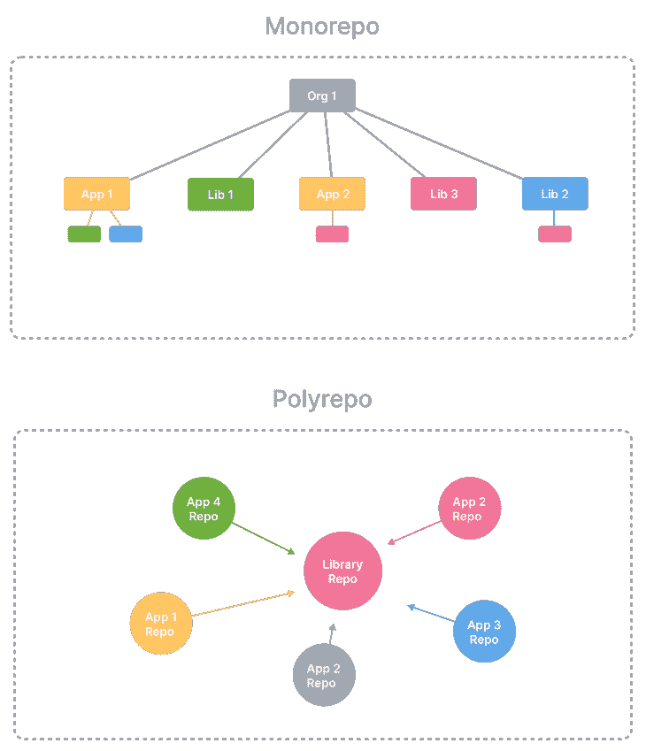
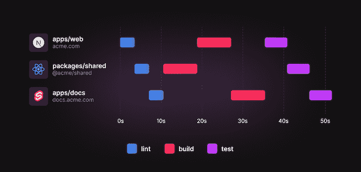
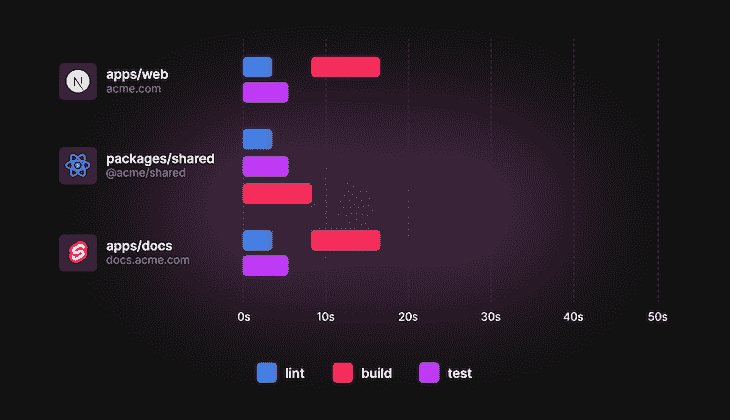

# 使用 Turborepo 构建全栈类型脚本应用程序

> 原文：<https://blog.logrocket.com/build-full-stack-typescript-application-turborepo/>

无论你是构建一个全栈应用还是一个由多个前端和后端项目组成的应用，你都可能需要在不同程度上跨项目共享部分。

它可以是类型、实用程序、验证模式、组件、设计系统、开发工具或配置。Monorepos 帮助开发人员在一个存储库中管理所有这些部分。

在本文中，我们将概述什么是 monorepos 以及使用 Turborepo 的好处。然后，我们将使用 Turborepo 和 React 以及 Node.js，使用 [pnpm](https://blog.logrocket.com/managing-full-stack-monorepo-pnpm/) 工作区构建一个简单的全栈应用程序，并演示如何通过使用 Turborepo 来改进这个过程。

## 什么是单向回购？

monorepo 是包含多个应用程序和/或库的单个存储库。Monorepos 简化了项目管理、代码共享、带有即时类型检查验证的交叉回购变更等等。

Turborepo 是 JavaScript/TypeScript 生态系统中最好的 monorepo 工具之一。

它快速、易于配置和使用，独立于应用程序技术，并且可以逐步采用。它的学习曲线很短，进入门槛也很低——无论你是刚刚开始使用 monorepos，还是经验丰富并希望尝试生态系统中的不同工具。

下面是单回购和多回购的结构示意图(来源可在此处找到):



### 聚 repos

假设我们正在构建一个全栈应用程序；前端和后端都是两个独立的项目，每个项目都放在不同的存储库中——这就是 polyrepo。

如果我们需要在前端和后端之间共享类型或实用程序，并且我们不想在两个项目中重复它们，我们必须创建第三个存储库，并将它们作为两个项目的外部包来使用。

每次我们修改共享包时，我们都必须构建并发布一个新版本。然后，所有使用这个包的项目应该更新到最新版本。

除了版本控制和发布的开销之外，这些多个部分很容易变得不同步，并且很有可能频繁中断。

根据你的项目，polyrepos 还有其他缺点，使用 monorepo 是解决其中一些问题的替代方案。

### 优化 monrepos

使用 monorepos 而没有合适的工具会使应用程序比使用 polyrepos 更难管理。要获得优化的 monorepo，您需要一个缓存系统以及优化的任务执行，以节省开发和部署时间。

像 [Lerna](https://lerna.js.org) 、 [Nx](https://nx.dev) 、 [Turborepo](https://turborepo.org) 、 [Moon](https://moonrepo.dev) 、 [Rush](https://rushjs.io) 、 [Bazel](https://bazel.build) 等等工具，不一而足。今天，我们将使用 Turborepo，因为它轻巧、灵活且易于使用。

您可以在 [monorepo.tools](https://monorepo.tools) 了解更多关于 monorepos 的信息，何时以及为何使用它们，以及各种工具之间的比较。

### 什么是 Turborepo？

Turborepo 是 JavaScript/TypeScript 生态系统中流行的 monorepo 工具。它是用围棋写的，由[贾里德·帕尔默](https://twitter.com/jaredpalmer)创作——一年前它被[Vercel 收购。](https://vercel.com/blog/vercel-acquires-turborepo)

Turborepo 速度快，易于使用和配置，是一个轻量级的层，可以很容易地添加或替换。它建立在工作区之上，这是所有主要包管理器都具有的特性。我们将在下一节更详细地讨论工作区。

一旦在 monorepo 中安装并配置了 Turborepo，它将理解您的项目如何相互依赖，并最大限度地提高脚本和任务的运行速度。

Turborepo 不会两次做同样的工作；它有一个缓存系统，允许跳过之前已经完成的工作。缓存还跟踪多个版本，因此如果您回滚到以前的版本，它可以重用以前版本的“文件”缓存。

Turborepo 文档是了解更多信息的绝佳资源。[官方 Turborepo 手册](https://turborepo.org/docs/handbook)还涵盖了 monorepos 的重要方面和相关主题，如迁移到 monorepo、开发工作流、代码共享、林挺、测试、发布和部署。

## 构建基础单一报告

### 使用 pnpm 的工作区

工作区是 monorepo 的基本构造块。所有主要的包管理器都内置了对工作区的支持，包括 [npm](https://docs.npmjs.com/cli/v8/using-npm/workspaces) 、 [yarn](https://classic.yarnpkg.com/lang/en/docs/workspaces) 和 [pnpm](https://pnpm.io/workspaces) 。

工作区支持在单个存储库中管理多个项目。每个项目都包含在一个工作空间中，有自己的`package.json`、源代码和配置文件。

在 monorepo 的根级别还有一个`package.json`和一个锁文件。锁文件保存了跨所有工作区安装的所有包的引用，因此您只需要运行一次`pnpm install`或`npm install`就可以安装所有的工作区依赖项。

我们将使用 pnpm，不仅因为它的效率、速度和磁盘空间使用，还因为它对管理工作区有很好的支持，并且是 Turborepo 团队推荐的。

您可以查看这篇[文章](https://blog.logrocket.com/managing-full-stack-monorepo-pnpm)，了解更多关于使用 pnpm 管理全栈 monorepo 的信息。

如果您没有安装 pnpm，请查看他们的[安装指南](https://pnpm.io/installation)。如果您愿意，也可以使用 npm 或 yarn 工作空间来代替 pnpm 工作空间。

### 结构概述

我们将从一般的高层结构开始。

首先，我们将把`api`、`web`和`types`放在 monorepo 根目录下的`packages`目录中。在根级别，我们还有一个用于 pnpm 的`package.json`和`pnpm-workspace.yaml`配置文件来指定哪些包是工作区，如下所示:

```
.
├── packages
│   ├── api/
│   ├── types/
│   └── web/
├── package.json
└── pnpm-workspace.yaml

```

我们可以使用下面的`mkdir`命令快速创建`packages`目录及其子目录:

```
mkdir -p packages/{api,types,web}

```

然后，我们将在 monorepo 根目录和三个包中运行`pnpm init`:

```
pnpm init

cd packages/api; pnpm init
cd ../../packages/types; pnpm init
cd ../../packages/web; pnpm init

cd ../..

```

注意，在使用`cd ../..`命令返回 monorepo 根目录之前，我们在每个`cd`命令后使用`../..`返回两个目录。

我们希望`packages`目录中的任何直接子目录都是工作区，但是 pnpm 和其他包管理器直到我们显式定义它们时才识别工作区。

配置工作区意味着我们要么通过单独列出每个工作区来指定工作区，要么使用一种模式一次匹配多个目录或工作区。该配置写在根级`pnpm-workspace.yaml`文件中。

我们将使用 glob 模式将所有的`packages`直接匹配到子目录。配置如下:

```
# pnpm-workspace.yaml

packages:
  - 'packages/*'

```

出于性能原因，最好避免像`packages/**`这样的嵌套 glob 匹配，因为它不仅匹配直接的孩子，还匹配`packages`目录中的所有目录。

我们选择使用名称`packages`作为包含我们工作区的目录，但是它可以有不同的名称；`apps`和`libs`是我个人的喜好(受 Nx 启发)。

将它们添加到`[pnpm-workspace.yaml]([https://pnpm.io/pnpm-workspace_yaml](https://pnpm.io/pnpm-workspace_yaml))`后，您还可以拥有多个工作区目录。

在接下来的小节中，我们将为每个工作区设置一个基础项目，并安装它们的依赖项。

## 共享类型包设置

我们将从在`packages/types`设置类型包开始。

`typescript`是这个工作区唯一需要的依赖项。下面是将其作为开发依赖项安装的命令:

```
pnpm add --save-dev typescript --filter types

```

`package.json`应该是这样的:

```
// packages/types/package.json

{
  "name": "types",
  "main": "./src/index.ts",
  "types": "./src/index.ts",
  "scripts": {
    "type-check": "tsc"
  },
  "devDependencies": {
    "typescript": "^4.8.4"
  }
}

```

我们现在将添加 TypeScript 的配置文件:

```
// packages/types/tsconfig.json

{
  "compilerOptions": {
    "baseUrl": ".",
    "target": "es2017",
    "lib": ["dom", "dom.iterable", "esnext"],
    "allowJs": true,
    "skipLibCheck": true,
    "strict": true,
    "forceConsistentCasingInFileNames": true,
    "noEmit": true,
    "esModuleInterop": true,
    "module": "esnext",
    "moduleResolution": "node",
    "resolveJsonModule": true,
    "isolatedModules": true,
    "jsx": "preserve"
  },
  "include": ["./src"]
}

```

现在一切都准备好了，让我们添加并导出我们将用于`api`和`web`的类型。

```
// packages/types/src/index.ts

export type Workspace = {
  name: string
  version: string
}

```

共享的`types`工作区，或者任何与此相关的共享工作区，应该安装在使用它的其他工作区中。共享工作区将与消费工作区的`package.json`中的其他依赖项或开发依赖项一起列出。

pnpm 有一个专用的协议(`workspace:<version>`)来解析带有链接的本地工作空间。您可能还想将工作区`<version>`更改为`*`，以确保您总是拥有最新的工作区版本。

我们可以使用下面的命令来安装`types`工作区:

```
pnpm add --save-dev [email protected] --filter <workspace>

```

> **注意**，用于安装和引用`types`工作区的包名应该和`types`工作区`package.json`中定义的`name`字段完全一样

## 后端设置(快速、类型脚本、`esbuild`、`tsx`)

我们现在将使用 Node.js 和 Express at `packages/api`构建一个简单的后端 API。

以下是我们的依赖项和开发依赖项:

```
pnpm add express cors --filter api
pnpm add --save-dev typescript esbuild tsx @types/{express,cors} --filter api
pnpm add --save-dev [email protected] --filter api

```

`package.json`应该是这样的:

```
// packages/api/package.json

{
  "name": "api",
  "scripts": {
    "dev": "tsx watch src/index.ts",
    "build": "esbuild src/index.ts --bundle --platform=node --outfile=dist/index.js --external:express --external:cors",
    "start": "node dist/index.js",
    "type-check": "tsc"
  },
  "dependencies": {
    "cors": "^2.8.5",
    "express": "^4.18.1"
  },
  "devDependencies": {
    "@types/cors": "^2.8.12",
    "@types/express": "^4.17.14",
    "esbuild": "^0.15.11",
    "tsx": "^3.10.1",
    "types": "workspace:*",
    "typescript": "^4.8.4"
  }
}

```

我们将使用来自`types`工作区的完全相同的`tsconfig.json`。

最后，我们将添加应用程序条目并公开一个端点:

```
// packages/api/src/index.ts

import cors from 'cors'
import express from 'express'

import { Workspace } from 'types'

const app = express()
const port = 5000

app.use(cors({ origin: 'http://localhost:3000' }))

app.get('/workspaces', (_, response) => {
  const workspaces: Workspace[] = [
    { name: 'api', version: '1.0.0' },
    { name: 'types', version: '1.0.0' },
    { name: 'web', version: '1.0.0' },
  ]
  response.json({ data: workspaces })
})

app.listen(port, () => console.log(`Listening on http://localhost:${port}`))

```

## 前端(React、TypeScript、Vite)设置

这是我们将添加的最后一个工作区，它将位于`packages/web`中。这些是要安装的依赖项:

```
pnpm add react react-dom --filter web
pnpm add --save-dev typescript vite @vitejs/plugin-react @types/{react,react-dom} --filter web
pnpm add --save-dev [email protected] --filter web

```

`package.json`应该是这样的:

```
// packages/web/package.json

{
  "name": "web",
  "scripts": {
    "dev": "vite dev --port 3000",
    "build": "vite build",
    "start": "vite preview",
    "type-check": "tsc"
  },
  "dependencies": {
    "react": "^18.2.0",
    "react-dom": "^18.2.0"
  },
  "devDependencies": {
    "@types/react": "^18.0.21",
    "@types/react-dom": "^18.0.6",
    "@vitejs/plugin-react": "^2.1.0",
    "types": "workspace:*",
    "typescript": "^4.8.4",
    "vite": "^3.1.6"
  }
}

```

同样，我们将使用与用于`types`和`api`相同的`tsconfig.json`文件，在`compilerOptions`处只添加一行用于 Vite 的客户端类型:

```
// packages/web/tsconfig.json

{
  "compilerOptions": {
    // ...
    "types": ["vite/client"]
  }
  // ...
}

```

现在，让我们添加`vite.config.ts`和条目`index.html`:

```
// packages/web/vite.config.ts

import { defineConfig } from 'vite'
import react from '@vitejs/plugin-react'

export default defineConfig({
  plugins: [react()],
})

```

```
<!DOCTYPE html>
<html lang="en">
  <head>
    <meta charset="UTF-8" />
    <meta name="viewport" content="width=device-width, initial-scale=1.0" />
    <title>Building a fullstack TypeScript project with Turborepo</title>
  </head>

  <body>
    <div id="app"></div>
    <script type="module" src="/src/index.tsx"></script>
  </body>
</html>

```

最后，这是 React 应用程序在`src/index.tsx`的条目:

```
// packages/web/src/index.tsx

import { StrictMode, useEffect, useState } from 'react'
import { createRoot } from 'react-dom/client'

import { Workspace } from 'types'

const App = () => {
  const [data, setData] = useState<Workspace[]>([])

  useEffect(() => {
    fetch('http://localhost:5000/workspaces')
      .then((response) => response.json())
      .then(({ data }) => setData(data))
  }, [])

  return (
    <StrictMode>
      <h1>Building a fullstack TypeScript project with Turborepo</h1>
      <h2>Workspaces</h2>
      <pre>{JSON.stringify(data, null, 2)}</pre>
    </StrictMode>
  )
}

const app = document.querySelector('#app')
if (app) createRoot(app).render(<App />)

```

## 添加 Turborepo

如果您的 monorepo 很简单，只有几个工作区，那么用 pnpm 工作区管理它们就足够了。

然而，对于更大的项目，我们需要一个更有效的 monorepo 工具来管理它们的复杂性和规模。Turborepo 可以在不改变 monorepo 结构的情况下，通过加速林挺、测试和管道建设来改善您的工作空间。

速度的提升主要是因为 Turborepo 的[缓存系统](https://turbo.build/repo/docs/core-concepts/caching)。运行任务后，在工作空间本身或相关工作空间发生变化之前，它不会再次运行。

另外，Turborepo 可以多任务处理；它调度任务以最大化执行它们的速度。

> **注意**，你可以在 Turborepo [核心概念指南](https://turborepo.org/docs/core-concepts/running-tasks)中阅读更多关于运行任务的信息

下面是 turborrepo 文档中的一个例子，它比较了直接使用包管理器运行工作空间任务和使用 turborrepo 运行任务(图片来源[此处](https://turbo.build/repo/docs/core-concepts/monorepos/running-tasks)):



使用 Turborepo 运行相同的任务将导致更快、更优化的执行:



### 安装和配置

如前所述，我们不需要修改工作空间设置来使用 Turborepo。我们只需要做两件事来让它与我们现有的 monorepo 一起工作。

让我们首先在 monorepo 根目录安装`turbo`包:

```
pnpm add --save-dev --workspace-root turbo

```

让我们也将`.turbo`目录添加到`.gitignore`文件中，连同我们想要缓存的任务工件、文件和目录——就像我们例子中的`dist`目录。`.gitignore`文件应该是这样的:

```
.turbo
node_modules
dist

```

> **注意:**，如果您还没有初始化 Git，请运行`git init`，确保已经在您的 monorepo 根目录中初始化了 Git，因为 Turborepo 使用 Git 和文件哈希进行缓存

现在，我们可以在`turbo.json`配置我们的 Turborepo 管道。管道允许我们在 monorepo 中声明哪些任务相互依赖。管道推断任务的依赖图，以适当地调度、执行和缓存任务输出。

每个管道直接键都是通过`turbo run <task>`可运行的任务。如果我们在工作区的`package.json` `scripts`中没有包含任务名称，那么对于相应的工作区，该任务将被忽略。

这些是我们想要为 monorepo 定义的任务:`dev`、`type-check`和`build`。

让我们开始定义每个任务及其选项:

```
// turbo.json

{
  "pipeline": {
    "dev": {
      "cache": false
    },
    "type-check": {
      "outputs": []
    },
    "build": {
      "dependsOn": ["type-check"],
      "outputs": ["dist/**"]
    }
  }
}

```

`cache`默认为启用选项；我们已经为`dev`任务禁用了它。`output`选项是一个数组。如果它是空的，它将缓存任务日志；否则，它将缓存任务指定的输出。

在运行`build`任务之前，我们使用`dependsOn`为每个工作区运行`type-check`任务。

`cache`和`outputs`使用起来很简单，但是`dependsOn`有多种情况。你可以在参考[这里](https://turbo.build/repo/docs/reference/configuration)了解更多配置选项。

以下是添加 Turborepo 后的文件结构概述:

```
.
├── packages
│   ├── api
│   │   ├── package.json
│   │   ├── src
│   │   │   └── index.ts
│   │   └── tsconfig.json
│   ├── types
│   │   ├── package.json
│   │   ├── src
│   │   │   └── index.ts
│   │   └── tsconfig.json
│   └── web
│       ├── index.html
│       ├── package.json
│       ├── src
│       │   └── index.tsx
│       ├── tsconfig.json
│       └── vite.config.ts
├── package.json
├── pnpm-lock.yaml
├── pnpm-workspace.yaml
└── turbo.json

```

## 下一步是什么？

Monorepos 有助于管理和扩展复杂的应用程序。在很多用例中，在工作区上使用 Turborepo 是一个很好的选择。

我们仅仅触及了 Turborepo 的皮毛。你可以在 GitHub 上的 [Turborepo 示例目录中找到更多示例。](https://github.com/vercel/turborepo/tree/main/examples)[GitHub](https://github.com/skillrecordings/products)上的技能记录也是另一个伟大的资源，自从 Turborepo 首次发布以来就一直存在。

我们强烈建议您看看 [Turborepo 核心概念](https://turborepo.org/docs/core-concepts/why-turborepo)和[新手册](https://turborepo.org/docs/handbook)。在 [Vercel 的频道](https://www.youtube.com/c/VercelHQ)上也有几个关于 Turborepo 的视频，你可能会觉得有用。

欢迎在下面发表评论，分享你对 Turborepo 的看法，或者如果你有任何问题。如果你觉得这篇文章有用，请分享，并关注即将发布的文章！

## [LogRocket](https://lp.logrocket.com/blg/typescript-signup) :全面了解您的网络和移动应用

[](https://lp.logrocket.com/blg/typescript-signup)

LogRocket 是一个前端应用程序监控解决方案，可以让您回放问题，就像问题发生在您自己的浏览器中一样。LogRocket 不需要猜测错误发生的原因，也不需要向用户询问截图和日志转储，而是让您重放会话以快速了解哪里出错了。它可以与任何应用程序完美配合，不管是什么框架，并且有插件可以记录来自 Redux、Vuex 和@ngrx/store 的额外上下文。

除了记录 Redux 操作和状态，LogRocket 还记录控制台日志、JavaScript 错误、堆栈跟踪、带有头+正文的网络请求/响应、浏览器元数据和自定义日志。它还使用 DOM 来记录页面上的 HTML 和 CSS，甚至为最复杂的单页面和移动应用程序重新创建像素级完美视频。

[Try it for free](https://lp.logrocket.com/blg/typescript-signup)

.