# 在 Node.js - LogRocket 博客中构建 Google Analytics dashboard 克隆

> 原文：<https://blog.logrocket.com/build-google-analytics-dashboard-clone-node/>

编者按:这篇文章于 2021 年 12 月 15 日更新，以反映 Node.js 和 Google API 的更新。

如果你曾经使用过 Google Analytics，你就会知道它并没有提供最干净或者最赏心悦目的界面。虽然它完成了工作，但它没有提供许多定制或个性化的选项。幸运的是，作为软件开发人员，我们可以构建符合我们设计标准的自己版本的谷歌分析。

在本教程中，我们将使用 Google 的几个 API 在 Node.js 项目中构建我们自己的仪表板[。我们开始吧！](https://blog.logrocket.com/building-structuring-node-js-mvc-application/)

要查看该项目的完整源代码，请查看 GitHub repo 。

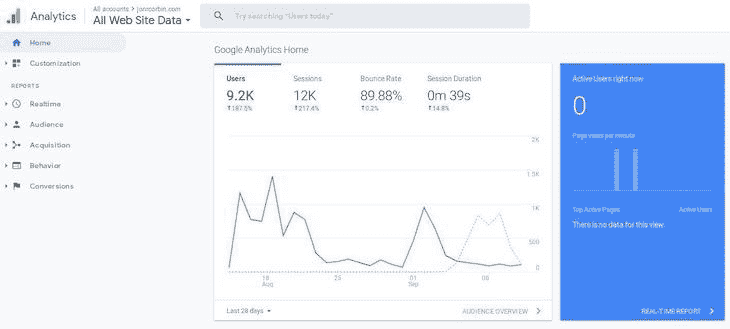

### 目录

## 创建一个新的 Google API 项目

首先，如果你还没有的话，建立一个谷歌开发者账户。点击页面左上角的**我的项目**选项，创建一个新项目:


然后，点击**新项目**创建一个新项目。你可以给它起任何你喜欢的名字，但我会叫我的名字:

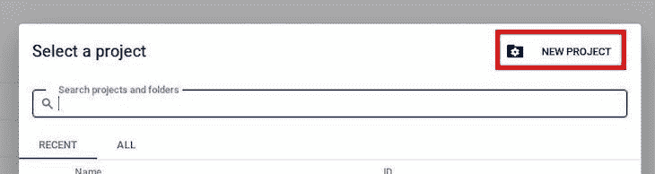

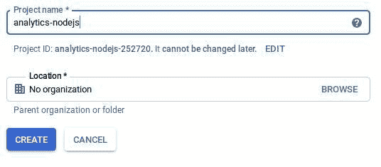

## 添加 Google Analytics API

随着我们新项目的创建，我们将需要添加一些服务，让我们使用谷歌分析 API。为此，我们将单击页面顶部的 **+** **启用 API 和服务**:

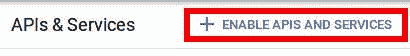

在 APIs & Services 页面上，搜索“google analytics api”并将其添加到您的项目中。确保选择并启用 Google Analytics API，而不是 Google Analytics Reporting API，如下图所示:

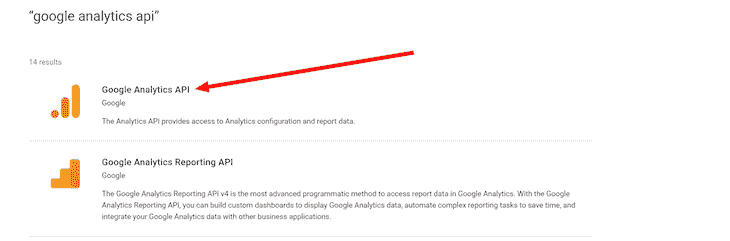

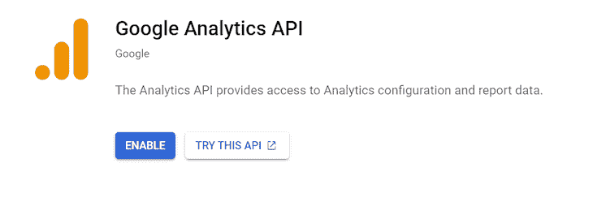

## 创建服务帐户

添加分析 API 后，我们需要创建一个服务帐户，以便我们的应用程序可以访问 API。为此，让我们从控制台主屏幕转到凭证部分。

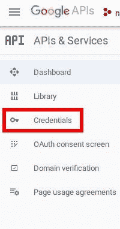

点击+ **创建凭证**下拉菜单，选择**服务账户**键:

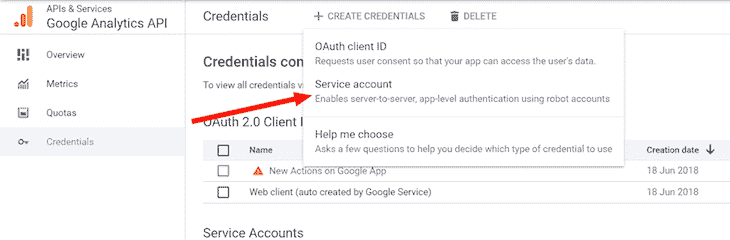

在下一个屏幕上，设置服务帐户名称和描述，如下所示。服务帐户 ID 是根据帐户名自动设置的。之后，点击**创建并继续**。您可以跳过可选的步骤 2 和 3，点击**完成**按钮继续:

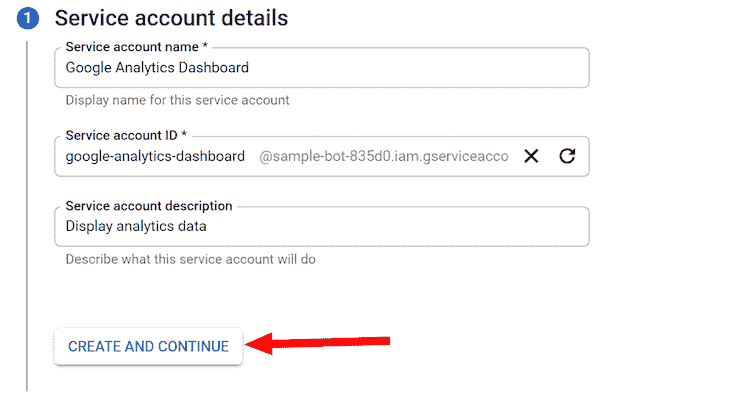

创建服务帐户后，您将被重定向到凭据页面。点击**服务账户**部分下新创建的条目:

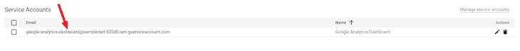

前往**键**选项卡，点击**创建新键**:


在弹出的结果中选择 **JSON** ，点击**创建**按钮，将生成的文件下载到您的电脑中；

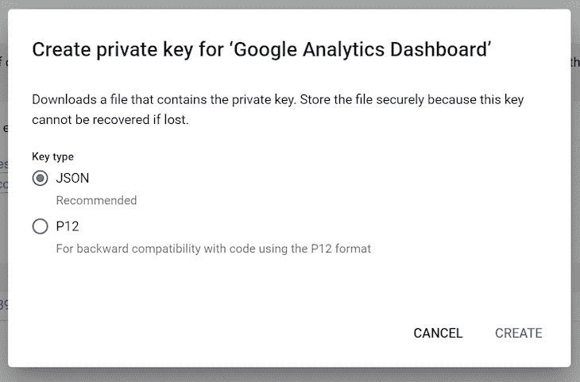

一旦点击**创建**，就会生成一个 JSON 文件。将它保存在一个已知的位置，因为我们稍后需要访问它的部分内容。

接下来，我们将在 Google Analytics 的视图中添加一个新用户。点击左下角的**管理**选项，然后在**查看**部分点击**查看访问** **管理**:

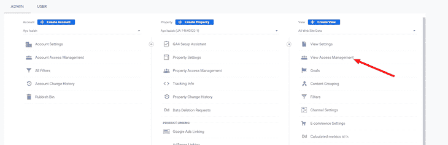

要添加新用户，点击右上角带有白色 **+** 符号的蓝色按钮，然后选择**添加用户:**

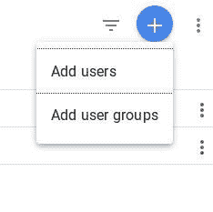

将您的 JSON 文件中的`client_email`字段的值粘贴到电子邮件地址字段中，并确保角色设置为**查看器**。完成后点击右上角的**添加**按钮:

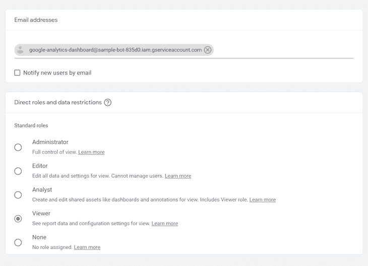

最后，我们需要获得在 Node.js 后端使用的 Google Analytics 视图 ID。从你的管理设置中，进入**视图设置**并复制**视图 ID** 以备后用。更好的是，只需在一个单独的选项卡中打开该页面:

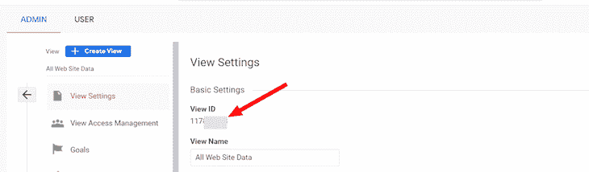

现在，您的 Google APIs 应该已经准备好了！

## 构建后端 Node.js API

我们将使用 Node.js 来设置应用程序的服务器方面。让我们从设置我们的项目开始；对于这一步，我将使用纱线包管理器，但是 npm 应该也能很好地工作。

### 设置 Node.js 应用程序

首先，在文件系统上创建一个新目录，导航到这个目录，运行`yarn init` `-y`用一个`package.json`文件初始化应用程序。接下来，运行下面的命令来安装所需的依赖项:

```
$ yarn add cors dotenv express googleapis

```

我们还想将`concurrently`和`jest`添加到我们的开发依赖项中，我们将在脚本中使用它们:

```
$ yarn add -D concurrently jest

```

让我们现在设置我们的脚本。在我们的`package.json`文件中，运行下面的代码:

```
"scripts": {
    "test_server": "jest ./ --passWithNoTests",
    "test_client": "cd client && yarn test",
    "test": "concurrently \"yarn test_server\" \"yarn test_client\"",
    "start": "concurrently \"npm run server\" \"npm run client\"",
    "server": "node server.js",
    "client": "cd client && npm start",
    "build": "cd client && yarn build"
  },

```

最后，在项目目录的根目录下创建一个`.env`文件来存储应用程序的秘密和配置:

```
CLIENT_EMAIL="<the client_email in your json file>"
PRIVATE_KEY="<the private_key in your json file>"
VIEW_ID="<The view id from google analytics you copied down earlier>"
SERVER_PORT=3001
NODE_ENV="dev"

```

现在，我们基本上已经准备好开始开发我们的服务器了。

### 设置服务器

首先，用`touch server.js`创建一个新的服务器文件，然后在您喜欢的编辑器中打开它。在文件的顶部，我们需要定义以下内容:

```
require('dotenv').config();

// Server
const express = require('express');
const cors = require('cors');
const app = express();
app.use(cors());
const server = require('http').createServer(app);

// Config
const port = process.env.SERVER_PORT;
if (process.env.NODE_ENV === 'production') {
  app.use(express.static('client/build'));
}

```

我们将使用`require('dotenv').config()`加载我们的环境变量，它为我们处理困难的工作，将我们的变量从`.env`文件加载到`process.env`供以后使用。

接下来，我们使用`express`包定义我们的服务器。我们将`cors`中间件添加到我们的 Express 应用程序中，这样我们以后可以从我们的前端访问它。然后，我们用`require('http').createServer`包装我们的应用程序，这样我们就可以添加 Socket。木卫一以后。

最后，我们将通过设置一个全局常量`port`来添加一些配置。我们将根据我们的`NODE_ENV`变量改变我们的`static`路径。

现在，让我们将下面的代码添加到我们的`server.js`文件的底部，让我们的服务器监听我们的`port`:

```
server.listen(port, () => {
  console.log(`Server running at localhost:${port}`);
});

```

### 设置我们的谷歌分析 API 库

回到我们的终端，让我们使用`mkdir libraries`创建一个名为`libraries/`的新目录，并创建我们的分析处理程序，我称之为`gAnalytics.js`。为了创建我们的分析处理程序，我们将使用`touch libraries/gAnalytics.js`，然后切换回编辑器。

在`gAnalytics.js`中，我们将配置定义如下:

```
// gAnalytics.js
const clientEmail = process.env.CLIENT_EMAIL;
const privateKey = process.env.PRIVATE_KEY.replace(new RegExp('\\\\n'), '\n');
const scopes = ['https://www.googleapis.com/auth/analytics.readonly'];

```

我们需要从 Google API 控制台提供的 JSON 凭证文件和`process.env`文件中获取我们的客户端电子邮件和私钥。我们需要用`\n`替换我们的私有密钥中的`\\n`，这也是`dotenv`将读取它的方式。最后，我们将为 Google APIs 定义一些范围。这里有很多不同的选项，如下所示:

```
https://www.googleapis.com/auth/analytics to view and manage the data
https://www.googleapis.com/auth/analytics.edit to edit the management entities
https://www.googleapis.com/auth/analytics.manage.users to manage the account users and permissions

```

接下来，让我们使用这些变量设置 Google Analytics:

```
// gAnalytics.js
const { google } = require('googleapis');
const analytics = google.analytics('v3');
const viewId = process.env.VIEW_ID;
const jwt = new google.auth.JWT({
  email: clientEmail,
  key: privateKey,
  scopes,
});

```

这里，我们要求`google`模块创建`analytics`和`jwt`。我们还从`process.env`拿出了分析`viewId`。随后，当我们试图检索一些数据时，出于授权目的会创建一个 [JWT。](https://blog.logrocket.com/how-to-secure-a-rest-api-using-jwt-7efd83e71432/)

现在，我们需要创建函数来实际检索数据；让我们从编写一个从 Google Analytics 获取数据的函数开始:

```
// gAnalytics.js
async function getMetric(metric, startDate, endDate) {
  await setTimeout[Object.getOwnPropertySymbols(setTimeout)[0]](
    Math.trunc(1000 * Math.random()),
  );

  const result = await analytics.data.ga.get({
    auth: jwt,
    ids: `ga:${viewId}`,
    'start-date': startDate,
    'end-date': endDate,
    metrics: metric,
  });

  const res = {};
  res[metric] = {
    value: parseInt(result.data.totalsForAllResults[metric], 10),
    start: startDate,
    end: endDate,
  };
  return res;
}

```

首先，我们让代码异步，这样我们可以一次获取许多指标。Google 强加了一个配额，所以我们需要添加一个随机等待:

```
await setTimeout[Object.getOwnPropertySymbols(setTimeout)[0]](
  Math.trunc(1000 * Math.random()),
);

```

如果有许多用户试图加载数据，可能会遇到可伸缩性问题。然而，我们正在为单个用户开发我们的应用程序，所以这种方法现在可以用。

我们使用`analytics.data.ga.get`获取数据，它将返回一个相当大的对象，包含大量数据。我们将去掉重要的部分，`result.data.totalsForAlResults[metric]`，它是一个字符串，在与开始和结束日期一起被返回到一个对象中之前，它首先被转换成一个整数。

接下来，让我们添加一种批量获取指标的方法:

```
// gAnalytics.js
function parseMetric(metric) {
  let cleanMetric = metric;
  if (!cleanMetric.startsWith('ga:')) {
    cleanMetric = `ga:${cleanMetric}`;
  }
  return cleanMetric;
}

function getData(metrics = ['ga:users'], startDate = '30daysAgo', endDate = 'today') {
  // ensure all metrics have ga:
  const results = [];
  for (let i = 0; i < metrics.length; i += 1) {
    const metric = parseMetric(metrics[i]);
    results.push(getMetric(metric, startDate, endDate));
  }

  return results;
}

```

使用上面的代码，我们可以很容易地一次请求多个指标，只返回一个`getMetric`承诺列表。我们还添加了一种方法来清理使用`parseMetric`传递给函数的指标名称，如果指标前面还没有`ga:`的话，就把它添加到指标前面。

最后，在底部导出`getData`，我们的库就可以运行了:

```
// gAnalytics.js
module.exports = { getData };

```

### 把这一切联系在一起

现在，我们将通过添加一些路线来利用应用程序中的库。在编辑器中打开`server.js`,添加以下代码片段:

```
// gAnalytics.js
app.get('/api', (req, res) => {
  const { metrics, startDate, endDate } = req.query;
  console.log(`Requested metrics: ${metrics}`);
  console.log(`Requested start-date: ${startDate}`);
  console.log(`Requested end-date: ${endDate}`);

  Promise.all(getData(metrics ? metrics.split(',') : metrics, startDate, endDate))
    .then((data) => {
      // flatten list of objects into one object
      const body = {};
      Object.values(data).forEach((value) => {
        Object.keys(value).forEach((key) => {
          body[key] = value[key];
        });
      });
      res.send({ data: body });
      console.log('Done');
    })
    .catch((err) => {
      console.log('Error:');
      console.log(err);
      res.send({ status: 'Error getting a metric', message: `${err}` });
      console.log('Done');
    });
});

```

该路由允许我们的客户端请求一个或一个度量列表，然后一旦检索到就返回所有数据，正如`Promise.all`所观察到的，它会一直等到给定列表中的所有承诺都完成或者其中一个失败。

我们可以添加一个带有一个`data`参数的`.then`方法，这个参数是我们在`gAnalytics.getData`中创建的数据对象列表。在这个方法中，我们遍历所有的对象，并将它们组合成一个实体对象。对象以`res.send({data: body});`的形式发送回客户端。我们还添加了一个`.catch`方法，它将发回任何错误消息并记录错误。

现在让我们添加`api/graph/`路线，我们将使用它来绘制图表；它将与我们的`/api`路径非常相似，但也有其自身的细微差别:

```
// gAnalytics.js
app.get('/api/graph', (req, res) => {
  const { metric } = req.query;
  console.log(`Requested graph of metric: ${metric}`);
  // 1 week time frame
  let promises = [];
  for (let i = 7; i >= 0; i -= 1) {
    promises.push(getData([metric], `${i}daysAgo`, `${i}daysAgo`));
  }
  promises = [].concat(...promises);
  Promise.all(promises)
    .then((data) => {
      // flatten list of objects into one object
      const body = {};
      body[metric] = [];
      Object.values(data).forEach((value) => {
        body[metric].push(value[metric.startsWith('ga:') ? metric : `ga:${metric}`]);
      });
      console.log(body);
      res.send({ data: body });
      console.log('Done');
    })
    .catch((err) => {
      console.log('Error:');
      console.log(err);
      res.send({ status: 'Error', message: `${err}` });
      console.log('Done');
    });
});
```

如您所见，我们仍然依赖于`gAnalytics.getData`和`Promise.all`，但是取而代之的是，我们获取最近七天的数据，并将其编译成一个列表，在正文中发送回去。

这就是我们的服务器！现在，我们将着手构建前端。

## 构建前端

构建前端很有趣，但是开发和设计起来却很有挑战性。为了构建我们的前端，我们将使用 React。

### 设置和结构

首先，我们需要创建样板文件。我们将使用 Create React 应用程序样板；在项目目录的根目录下运行`npx create-react-app client`。一旦完成，我们将安装我们的依赖项。确保你进入了`client/`文件夹，然后运行下面的命令:

```
$ yarn [email protected]/core prop-types recharts

```

接下来，我们将在进入结构之前清理`src/App.js`。打开`src/App.js`并删除所有内容，只留下下面的代码:

```
// client/src/App.js

import React from 'react';
import './App.css';
function App() {
  return (
    <div className="App">
    </div>
  );
}
export default App;

```

你还需要删除`serviceWorker.js`并将其从`src/index.js`中移除。然后，通过运行以下命令启动服务器:

```
$ yarn start 
```

如果您使用的是 Node.js ≥v17，您应该编辑您的`client/package.json`文件中的启动脚本以指向`react-scripts --openssl-legacy-provider start`命令，从而避免错误。

* * *

### 更多来自 LogRocket 的精彩文章:

* * *

对于我们的应用程序结构，我们将立即设置好一切，然后再进行开发。我们的`src`文件夹将使用以下结构:

```
├── App.css
├── App.js
├── App.test.js
├── components
│   ├── Dashboard
│   │   ├── DashboardItem
│   │   │   ├── DashboardItem.js
│   │   │   └── DataItems
│   │   │       ├── index.js
│   │   │       ├── ChartItem
│   │   │       │   └── ChartItem.js
│   │   │       └── TextItem
│   │   │           └── TextItem.js
│   │   └── Dashboard.js
│   └── Header
│       └── Header.js
├── index.css
├── index.js
├── theme
│   ├── index.js
│   └── palette.js
└── utils.js

```

从这里开始，每个文件引用都是相对于`src/`文件夹的。

## 添加前端组件

回到`App.js`并编辑文件夹，看起来像下面的代码:

```
// App.js
import React from 'react';
import './App.css';
import Dashboard from './components/Dashboard/Dashboard';
import { ThemeProvider } from '@material-ui/styles';
import theme from './theme';
import Header from './components/Header/Header';

function App() {
  return (
    <ThemeProvider theme={theme}>
      <div className="App">
        <Header text={"Analytics Dashboard"}/>
        <br/>
        <Dashboard />
      </div>
    </ThemeProvider>
  );
}

export default App;

```

上面的代码将引入必要的组件并创建我们的主题提供者。接下来，让我们通过向`theme/index.js`添加以下代码来编辑主题:

```
import { createMuiTheme } from '@material-ui/core';
import palette from './palette';

const theme = createMuiTheme({
  palette,
});

export default theme;

```

打开`theme/palette.js`并添加以下内容:

```
import { colors } from '@material-ui/core';

const white = '#FFFFFF';
const black = '#000000';

export default {
  black,
  white,
  primary: {
    contrastText: white,
    dark: colors.indigo[900],
    main: colors.indigo[500],
    light: colors.indigo[100]
  },
  secondary: {
    contrastText: white,
    dark: colors.blue[900],
    main: colors.blue['A400'],
    light: colors.blue['A400']
  },
  text: {
    primary: colors.blueGrey[900],
    secondary: colors.blueGrey[600],
    link: colors.blue[600]
  },
  background: {
    primary: '#f2e1b7',
    secondary: '#ffb3b1',
    tertiary: '#9ac48d',
    quaternary: '#fdae03',
    quinary: '#e7140d',
  },
};

```

使用上面的代码，我们为组件添加了不同样式选项的主题。我们还定义了我们的主题颜色，你可以根据你想要的结果进行更改。我选择了柔和的主题。

接下来，让我们创建我们的标题。打开`components/Header/header.js`并将其更改为如下所示:

```
// components/Header/header.js

import React from 'react';
import PropTypes from 'prop-types';
import { withStyles } from '@material-ui/core/styles';
import Paper from '@material-ui/core/Paper';
import AppBar from '@material-ui/core/AppBar';

const styles = (theme) => ({
  header: {
    padding: theme.spacing(3),
    textAlign: 'center',
    color: theme.palette.text.primary,
    background: theme.palette.background.primary,
  },
});

export const Header = (props) => {
  const { classes, text } = props;
  return (
    <AppBar position="static">
      <Paper className={classes.header}>{text}</Paper>
    </AppBar>
  );
};

Header.propTypes = {
  classes: PropTypes.object.isRequired,
  text: PropTypes.string.isRequired,
};

export default withStyles(styles)(Header);

```

上面的代码将在我们的页面顶部创建一个水平栏，文本是我们设置的道具。它也融入了我们的风格，提供了一个视觉愉悦的结果。

现在，让我们研究一下`components/Dashboard/Dashboard.js`，一个简单得多的组件:

```
// components/Dashboard/Dashboard.js

import React from 'react';
import PropTypes from 'prop-types';
import { withStyles } from '@material-ui/core/styles';
import Grid from '@material-ui/core/Grid';
import DashboardItem from './DashboardItem/DashboardItem';
import { isMobile } from '../../utils';

const styles = () => ({
  root: {
    flexGrow: 1,
    overflow: 'hidden',
  },
});

const Dashboard = (props) => {
  const { classes } = props;

  return (
    <div className={classes.root}>
      <Grid container direction={isMobile ? 'column' : 'row'} spacing={3} justify="center" alignItems="center">
        <DashboardItem size={9} priority="primary" metric="Users" visual="chart" type="line" />
        <DashboardItem size={3} priority="secondary" metric="Sessions"/>
        <DashboardItem size={3} priority="primary" metric="Page Views"/>
        <DashboardItem size={9} metric="Total Events" visual="chart" type="line"/>
      </Grid>
    </div>
  );
};

Dashboard.propTypes = {
  classes: PropTypes.object.isRequired,
};

export default withStyles(styles)(Dashboard);

```

我们添加了一些来自 Google Analytics API 的不同指标的例子。我们还需要创建一个包含以下内容的`utils.js`文件:

```
// utils.js
export function numberWithCommas(x) {
  return x.toString().replace(/\B(?=(\d{3})+(?!\d))/g, ',');
}

export const isMobile = window.innerWidth <= 500;

```

上面的代码会告诉我们用户是否在移动设备上。我们想要一个响应迅速的应用程序，所以我们需要知道用户是否在移动设备上。

我们有了`DashboardItem`组件，我们将通过编辑`components/Dashboard/DashboardItem/DashboardItem.js`来创建它。继续添加以下代码:

```
// components/Dashboard/DashboardItem/DashboardItem.js

import React, { Component } from 'react';
import PropTypes from 'prop-types';
import { withStyles } from '@material-ui/core/styles';
import Paper from '@material-ui/core/Paper';
import Grid from '@material-ui/core/Grid';
import { TextItem, ChartItem, RealTimeItem } from './DataItems';
import { numberWithCommas, isMobile } from '../../../utils';

const styles = (theme) => ({
  paper: {
    marginLeft: theme.spacing(1),
    marginRight: theme.spacing(1),
    paddingTop: theme.spacing(10),
    textAlign: 'center',
    color: theme.palette.text.primary,
    height: 200,
    minWidth: 300,
  },
  chartItem: {
    paddingTop: theme.spacing(1),
    height: 272,
  },
  mainMetric: {
    background: theme.palette.background.quaternary,
  },
  secondaryMetric: {
    background: theme.palette.background.secondary,
  },
  defaultMetric: {
    background: theme.palette.background.tertiary,
  },
});

class DashboardItem extends Component {
  constructor(props) {
    super(props);
    const {
      classes,
      size,
      metric,
      priority,
      visual,
      type,
    } = this.props;
    this.state = {
      classNames: classes,
      size,
      metric,
      priority,
      visual,
      type,
      data: 'No data',
    };
  }

  componentDidMount() {
    this.getMetricData();
    this.getClassNames();
  }

  getMetricData() {
    const { visual, metric } = this.state;
    const strippedMetric = metric.replace(' ', '');

    let url;
    if (visual === 'chart') {
      url = `http://localhost:3001/api/graph?metric=${strippedMetric}`;
    } else {
      url = `http://localhost:3001/api?metrics=${strippedMetric}`;
    }

    fetch(url, {
      method: 'GET',
      mode: 'cors',
    })
      .then((res) => (res.json()))
      .then((data) => {
        let value;
        let formattedValue;
        if (visual === 'chart') {
          value = data.data[strippedMetric];
          formattedValue = value;
        } else {
          try {
            value = strippedMetric.startsWith('ga:') ? data.data[strippedMetric] : data.data[`ga:${strippedMetric}`];
            formattedValue = numberWithCommas(parseInt(value.value, 10));
          } catch (exp) {
            console.log(exp);
            formattedValue = "Error Retrieving Value"
          }
        }
        this.setState({ data: formattedValue });
      });
  }

  getClassNames() {
    const { priority, visual } = this.state;
    const { classes } = this.props;
    let classNames = classes.paper;
    switch (priority) {
      case 'primary':
        classNames = `${classNames} ${classes.mainMetric}`;
        break;
      case 'secondary':
        classNames = `${classNames} ${classes.secondaryMetric}`;
        break;
      default:
        classNames = `${classNames} ${classes.defaultMetric}`;
        break;
    }
    if (visual === 'chart') {
      classNames = `${classNames} ${classes.chartItem}`;
    }
    this.setState({ classNames });
  }

  getVisualComponent() {
    const { data, visual, type } = this.state;
    let component;
    if (data === 'No data') {
      component = <TextItem data={data} />;
    } else {
      switch (visual) {
        case 'chart':
          component = <ChartItem data={data} xKey='start' valKey='value' type={type} />;
          break;
        default:
          component = <TextItem data={data} />;
          break;
      }
    }
    return component;
  }

  render() {
    const {
      classNames,
      metric,
      size,
    } = this.state;
    const visualComponent = this.getVisualComponent();
    return (
      <Grid item xs={(isMobile || !size) ? 'auto' : size} zeroMinWidth>
        <Paper className={`${classNames}`}>
          <h2>{ metric }</h2>
          {visualComponent}
        </Paper>
      </Grid>
    );
  }
}

DashboardItem.propTypes = {
  size: PropTypes.number,
  priority: PropTypes.string,
  visual: PropTypes.string,
  type: PropTypes.string,
  classes: PropTypes.object.isRequired,
  metric: PropTypes.string.isRequired,
};

DashboardItem.defaultProps = {
  size: null,
  priority: null,
  visual: 'text',
  type: null,
};

export default withStyles(styles)(DashboardItem);

```

该组件相当庞大，但它是我们应用程序的基础，允许我们拥有一个高度可定制的界面。根据传递的道具，我们可以改变大小、颜色和视觉类型。`DashboardItem`组件也为自己获取数据，然后将其传递给它的可视组件。让我们现在就开始创造吧！

### 视觉组件:`DataItems`

为了让我们的`DashboardItem`正确渲染，我们需要创建`ChartItem`和`TextItem`。打开`components/Dashboard/DashboardItem/DataItems/TextItem/TextItem.js`并添加以下内容:

```
// components/Dashboard/DashboardItem/DataItems/TextItem/TextItem.js

import React from 'react';
import PropTypes from 'prop-types';

export const TextItem = (props) => {
  const { data } = props;
  let view;

  if (data === 'No data') {
    view = data;
  } else {
    view = `${data} over the past 30 days`
  }

  return (
    <p>
      {view}
    </p>
  );
};

TextItem.propTypes = {
  data: PropTypes.string.isRequired,
};

export default TextItem;

```

上面的代码基本上将传递给它的文本显示为`data`属性。现在，让我们通过打开`components/Dashboard/DashboardItem/DataItems/ChartItem/ChartItem.js`并向其中添加以下代码来执行`ChartItem`:

```
// components/Dashboard/DashboardItem/DataItems/ChartItem/ChartItem.js

import React from 'react';
import PropTypes from 'prop-types';
import {
  ResponsiveContainer, LineChart, XAxis, YAxis, CartesianGrid, Line, Tooltip,
} from 'recharts';

export const ChartItem = (props) => {
  const { data, xKey, valKey } = props;

  return (
    <ResponsiveContainer height="75%" width="90%">
      <LineChart data={data}>
        <XAxis dataKey={xKey} />
        <YAxis type="number" domain={[0, 'dataMax + 100']} />
        <Tooltip />
        <CartesianGrid stroke="#eee" strokeDasharray="5 5" />
        <Line type="monotone" dataKey={valKey} stroke="#8884d8" />
      </LineChart>
    </ResponsiveContainer>
  );
};

ChartItem.propTypes = {
  data: PropTypes.array.isRequired,
  xKey: PropTypes.string,
  valKey: PropTypes.string,
};

ChartItem.defaultProps = {
  xKey: 'end',
  valKey: 'value',
};

export default ChartItem;

```

上面的代码会像它听起来的那样，呈现一个图表。它使用我们之前添加到服务器的`api/graph/`路由。现在，您需要从最顶层的目录运行`yarn start`,一切都应该启动得很好。

## 查看实时统计数据

谷歌分析最棒的部分之一是能够实时看到谁在使用你的网站。我们也可以在我们的应用程序中这样做。

可悲的是，在写这篇文章的时候，Google APIs 已经把 Realtime API 作为封闭的测试版，但是，我们还是软件开发者！我们自己做吧。

### 正在添加套接字。超正析象管(Image Orthicon)

我们将使用套接字。IO，因为它允许机器之间的实时通信。首先，添加插座。IO 到您的依赖关系与`yarn add socket.io`。现在，打开您的`server.js`文件，并将以下内容添加到它的顶部:

```
const io = require('socket.io').listen(server);

```

您可以将它添加到`server`定义的正下方。在文件底部的`server.listen`上方，添加以下代码片段:

```
io.sockets.on('connection', (socket) => {
  socket.on('message', (message) => {
    console.log('Received message:');
    console.log(message);
    console.log(Object.keys(io.sockets.connected).length);
    io.sockets.emit('pageview', { connections: Object.keys(io.sockets.connected).length - 1 });
  });
});

```

上面的代码将允许我们的服务器监听连接到它的套接字并向它发送消息。当它接收到一个消息时，它将向所有套接字发出一个`'pageview'`事件。注意，出于安全考虑，这样做通常不是最佳实践，但是我们只发送连接数，这不是重要的信息。

### 创建公共脚本

为了让我们的客户向我们的服务器发送消息，他们需要一个脚本！让我们在`client/public`中创建一个名为`realTimeScripts.js`的脚本，它将包含以下内容:

```
const socket = io.connect();

socket.on('connect', function() {
  socket.send(window.location);
});

```

我们需要在我们的任何网页中引用这两个脚本，并且连接将被跟踪:

```
<script src="/socket.io/socket.io.js"></script>
<script src="realTimeScripts.js"></script>

```

`/socket.io/socket.io.js`由`socket.io`的安装来处理，所以不需要创建它。

### 创建新组件

要查看这些连接，我们需要一个新组件。让我们首先通过向`getMetricData`添加以下内容来编辑`DashboardItem.js`:

```
    //...
    const strippedMetric = metric.replace(' ', '');
    // Do not need to retrieve metric data if metric is real time, handled in component
    if (metric.toUpperCase() === "REAL TIME") {
      this.setState({ data: "Real Time" })
      return;
    }
    //...

```

上面的代码将设置我们的状态并让我们退出`getMetricData`函数，因为我们不需要获取任何东西。接下来，我们将以下内容添加到`getVisualComponent`:

```
    //...
      component = <TextItem data={data} />;
    } else if (data === 'Real Time') {
      component = <RealTimeItem />
    } else {
      switch (visual) {
    //...

```

现在，当`metric`道具为`"Real Time"`时，我们的视觉组件将被设置为我们的`RealTimeItem`。

我们需要创建`RealTimeItem`组件。创建`components/``Dashboard/DashboardItem/DataItems/RealTimeItem/RealTimeItem.js`路径和文件。现在，添加以下内容:

```
// components/Dashboard/DashboardItem/DataItems/RealTimeItem/RealTimeItem.js

import React, { useState } from 'react';
import openSocket from 'socket.io-client';
const socket = openSocket('http://localhost:3001');
const getConnections = (cb) => {
  socket.on('pageview', (connections) => cb(connections.connections))
}

export const RealTimeItem = () => {
  const [connections, setConnections] = useState(0);
  getConnections((conns) => {
    console.log(conns);
    setConnections(conns);
  });

  return (
    <p>
      {connections}
    </p>
  );
};

export default RealTimeItem;

```

这样做将为我们的仪表板添加一个实时卡。现在，您应该有了一个功能齐全的控制面板，如下所示:

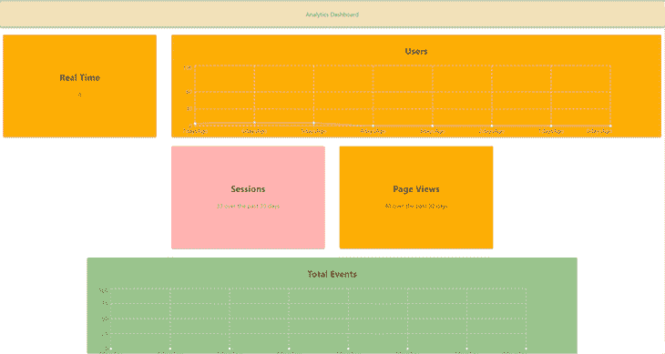

这意味着是一个高度可扩展的仪表板，您可以用类似于我们添加实时组件的方式添加新的数据项。

## 结论

在本教程中，我们使用 Node.js 构建了我们自己的 Google Analytics API 副本，添加了我们自己的定制和个性化。您可以通过添加更改大小、在不同图表类型之间切换等功能来进一步开发我们的仪表板！