# 用 Svelvet 构建华丽的流程图

> 原文：<https://blog.logrocket.com/build-gorgeous-flow-diagrams-svelvet/>

Svelte 是基于 JavaScript 的最流行的框架之一。虽然它是在 2016 年推出的，但它仍然被认为是前端领域中相对较新的框架(与 React、Vue.js 和其他框架相比)。

尽管参加派对的时间较晚，但 Svelte 友好的语法和出色的表演让人无法忽视。但是，即使拥有良好的声誉，苗条的生态系统发现自己很难跟上当代工具，并将需要更多的时间来匹配其对手的工具箱大小。

幸运的是，Svelte 社区通过不断引入新的、有用的工具来努力保持框架的相关性，希望能够弥合其他框架之间的差距。一个例子是最近发布的组件库 [Svelvet](https://www.svelvet.io) ，它允许在 Svelte 中轻松创建华丽的、可定制的流程图。

在本文中，我们将介绍 Svelvet 的核心概念，并演示如何使用 Svelvet 在 Svelte 中构建流程图。

*向前跳转:*

## 先决条件

按照这个教程，你需要有一个苗条和它的概念的基础知识。

## 斯维尔韦特是什么？

Svelvet 是一个轻量级组件库，用于在 Svelte 中呈现交互式的基于节点的流程图。该库使用基于图形的编辑器来转换、分析和可视化数据。它还利用 [D3.js](https://d3js.org) 缩放和选择组件在图形上提供平滑的缩放和平移行为。

据 Svelvet 的[创建者称，该库的建立是为了满足类似于](https://medium.com/@alexander.zambrano) [React flow](https://reactflow.dev) 的绘图工具的需求，React 是 Svelte 中基于节点的图形渲染器。因此，Svelvet 具有与 React Flow 相似的功能和特性，例如:

*   易用性
*   易于定制
*   交互性
*   快速渲染

现在我们对 Svelvet 有了基本的了解，让我们看看如何将它添加到我们的项目中，并开始呈现流程图。

## 入门指南

您可以使用以下命令之一通过 npm 或 Yarn 在项目中安装 Svelvet:

```
npm install svelvet
```

```
yarn add svelvet

```

如果你还没有一个项目，你可以启动一个简单的项目，就像这样:

```
npx degit sveltejs/template

```

然后，安装依赖项:

```
npm install

```

接下来，您可以通过在项目文件夹中的任何组件的脚本部分中导入一个`Svelvet`组件来将 Svelvet 集成到您的 Svelte 项目中:

```
import Svelvet from 'svelvet';

```

`Svelvet`组件接受几个道具，但是`nodes`和`edges`属性是组件的实际构建块。组件的`nodes`和`edges`根据它们的赋值来渲染图形。

下面是`Svelvet`组件的一个基本用法:

```
<script>
  import Svelvet from 'svelvet';

  const initialNodes = [
    {
    id: 1,
    position: { x: 350, y: 50 },
    data: { label: 'input Node' },
    width: 175,
    height: 40,
    bgColor: 'white'
    },
    {
    id: 2,
    position: { x: 350, y: 150 },
    data: { label: 'Default Node' },
    width: 175,
    height: 40,
    bgColor: 'white'
    }
];

  const initialEdges = [
    { id: 'e1-2', source: 1, target: 2, type: 'default', label: 'label'},
];
</script>

<Svelvet nodes={initialNodes} edges={initialEdges} background />

```

如您所见，对象的`initialNodes`和`initialEdges`数组分别被传递给节点和边属性。Svelvet 将根据每个数组中对象属性的值来呈现图形。

上面的代码将向浏览器呈现下图:

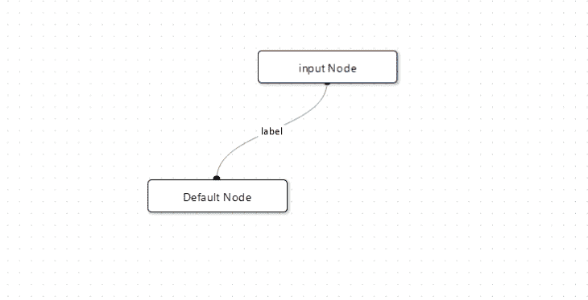

这个例子应该让你知道`nodes`和`edges`道具是如何工作的。接下来，我们将看看对象属性如何定义和连接`nodes`和`edges`道具。

## 节点

`nodes` prop 用于将被称为节点的盒状元素渲染到图形中。每个节点可能包含一些描述该节点代表什么的文本或信息。

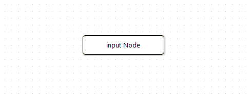

`nodes` prop 接受一个对象数组，对象的属性用于定义每个节点的`width`、`height`、`position`和背景颜色(`bgColor`)。每个对象代表一个节点，所以如果在一个特定的节点数组中有五个对象，那么组件将向图中呈现五个节点。

下面是一个典型的节点对象:

```
{
    id: 1,
    position: { x: 350, y: 50 },
    data: { label: 'input Node' },
    width: 175,
    height: 40,
    bgColor: 'white'
}

```

现在，让我们看看每个对象的属性，以便更好地理解它们的用途。

### `id`

`id`属性用于为每个节点分配 id。属性采用一个整数作为节点的标识符。定义边属性时，整数用于引用每个节点。

### `data`

属性用来标记节点，它接受一个带有属性的对象，该属性接受要在节点上显示的文本或信息的字符串值。

### `position`

属性用于在图上定位一个节点；它接受一个具有 x 和 y 属性的对象。这些属性接受用于在 x 轴和 y 轴上对齐节点的整数值。

### `bgColor`

`bgColor`属性顾名思义；它用于改变节点的背景颜色。

### `width`和`height`

`width`和`height`属性用于控制节点的尺寸；它们接受整数值。

## 优势

`edges`属性用于构建图表上节点之间的连线。这些线被称为边，它们充当两个节点之间的连接器。

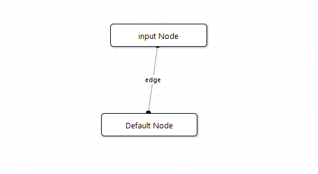

`edges` prop 接受一个对象数组，对象的属性用于引用和连接节点。

```
const initialEdges = [
    { 
      id: 'e1-2',
      source: 1,
      target: 2,
      type: 'straight',
      label: 'edge'
    },
];

...
 <Svelvet ... edges={initialEdges} .../> 

```

让我们看一下对象属性，以便更好地理解它们是如何工作的。

### `id`

`id`属性也用作边的标识符，但是与前者不同，它接受字符串值而不是整数。该值描述由对象连接的节点。例如，`id`值为`'e1-2'`的边对象会将`id`值为`1`的节点连接到另一个`id`值为`2`的节点。

```
//edge for connecting node 1 and 2
{ id: 'e1-2', ...}

```

### `source`

`source`属性用于设置边缘的原点。该属性接受一个引用节点的`id`值的整数，并将其标记为边的源。

```
//referencing the node with an id of 1
{ 
  ...,
  source: 1, 
  ...
}

```

设置目标节点后，组件将从源节点开始绘制边缘线。

### `target`

`target`属性用于从源设置边缘的目的地。该属性还接受一个整数，该整数引用不同于源的节点的`id`值。

例如，如果源属性引用了一个`id`为`1`的节点，那么`target`属性将引用另一个`id`为`2`或`3`的节点。

```
//node 1 targeting node 2
{
  ...,
  source: 1,
  target: 2,
  ...
}

```

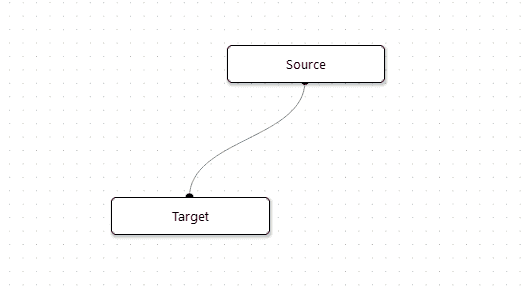

### `label`

`label`属性的工作方式类似于节点`data`属性；它用于向边缘添加文本或信息。`label`放置在两个连接节点的交点上。

```
{
  ...,
  label: 'label'
}

```

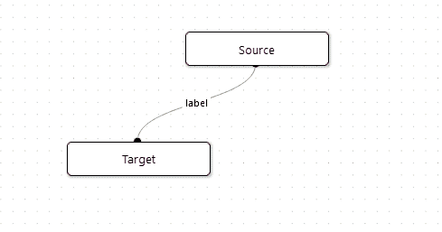

### `animate`

属性用于动画边缘。它采用一个布尔值，当设置为`true`时，该值激活边缘，当设置为 false 时，该值保持静态。

```
{
  ... ,
  animate: true
}

```

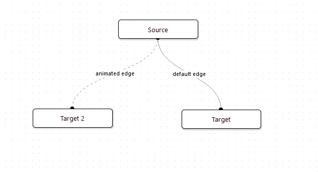

### `type`

`type`属性用于设置边缘的外观，它采用一个`default`或`straight`字符串值。`default`边缘类型是贝塞尔曲线，而`straight`边缘类型是直线。

```
{
  ... ,
  type: ‘default’
}
//or
{
  ... ,
  type: ‘straight’
} 

```

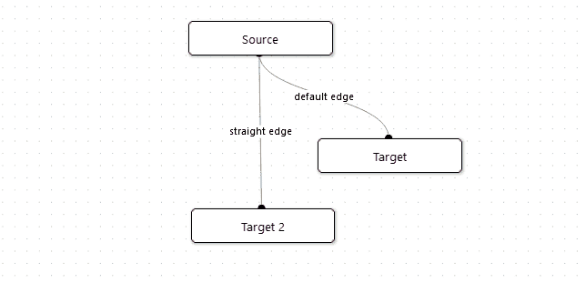

### `arrow`

`arrow`属性用于配置边缘线的终点；它将边缘转换成指向目标节点的箭头。`arrow`属性接受布尔值`true`或`false`。

```
{
  ... ,
  arrow: true
}

```

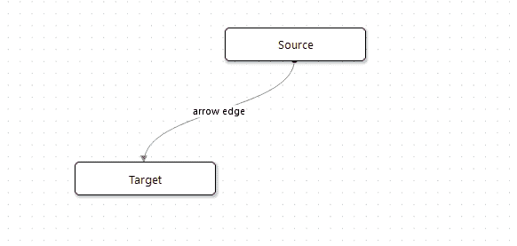

### `noHandle`

这个`noHandle`属性类似于`arrow`属性；它用于移除朝向目标节点的边缘线的句柄。该属性接受布尔值`true`或`false`。

```
{
  ... ,
  noHandle: true
}

```

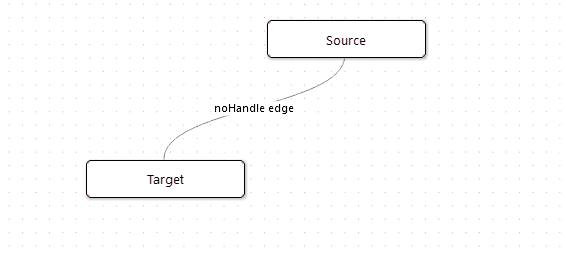

## 用 Svelvet 构建流程图

我们已经回顾了斯维尔韦特的核心概念；这些信息足以帮助你启动你的 Svelvet 图表之旅。

最后，让我们从头开始构建一个流程图。

作为第一步，在你的苗条项目中创建一个新组件或者使用`App.svelte`主组件。接下来，将 Svelte 组件导入脚本部分，创建两个对象数组，并根据您的喜好调整属性。

对于本例，我们将使用以下内容:

```
<script>
Import Svelvet from ‘svelvet’

//nodes array
const nodeArr = [
   {
     id: 1,
     position: { x: 300, y: 20 },
     data: { label: "Input Node" },
     width: 175,
     height: 40,
     bgColor: "#127369"
   },
   {
     id: 2,
     position: { x: 80, y: 150 },
     data: { label: "bezier" },
     width: 70,
     height: 40,
     bgColor: "#8AA6A3"
   },
   {
     id: 3,
     position: { x: 282, y: 190 },
     data: { label: "straight" },
     width: 70,
     height: 40,
     bgColor: "#F2BE22"
   },
   {
     id: 4,
     position: { x: 494, y: 150 },
     data: { label: "animated" },
     width: 140,
     height: 40,
     bgColor: "#BFBFBF"
   },
   {
     id: 5,
     position: { x: 120, y: 225 },
     data: { label: "no handle" },
     width: 80,
     height: 40,
     bgColor: "#03A678"
   },
   {
     id: 6,
     position: { x: 390, y: 225 },
     data: { label: "arrow handle" },
     width: 100,
     height: 40,
     bgColor: "#F27405"
   }
 ];

 //edges array
 const edgeArr = [
   {
     id: "e1-2",
     source: 1,
     target: 2,
     type: "bezier",
     label: "default edge"
   },
   {
     id: "e1-3",
     source: 1,
     target: 3,
     type: "straight",
     label: "straight edge"
   },
   {
     id: "e1-4",
     source: 1,
     target: 4,
     type: "bezier",
     animate: true,
     label: "animated edge"
   },
   {
     id: "e1-5",
     source: 1,
     target: 5,
     type: "bezier",
     noHandle: true,
     label: "noHandle edge"
   },
   {
     id: "e1-6",
     source: 1,
     target: 6,
     type: "bezier",
     arrow: true,
     label: "arrow edge"
   }
 ];
</script>

```

接下来，将`Svelvet`组件添加到组件的模板部分，并将`nodeArr`数组传递给`node`的道具，将`edgesArr`数组传递给`edges`的道具，如下所示:

```
<Svelvet nodes={nodeArr} edges={edgeArr} />

```

现在，保存代码并通过运行以下命令启动开发服务器:

```
npm run dev

```

您会注意到很难察觉 Svelvet 渲染器的边界，节点经常会在边界之外重叠。这是由于渲染器的默认白色背景。

要解决这个问题并使渲染器不那么模糊，您可以向组件添加一个`background`道具，如下所示:

```
<Svelvet nodes={nodeArr} edges={edgeArr} background />

```

道具将为渲染器添加一个点状背景，这将使它更容易感知渲染器的大小。

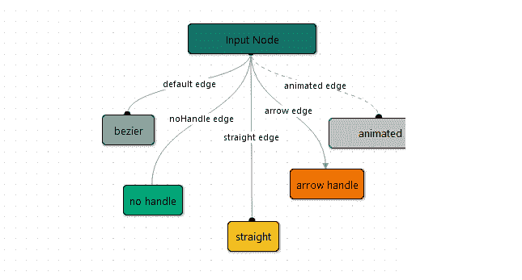

我们还可以通过向组件添加`width`和`height`道具来增加渲染器的大小:

```
<Svelvet nodes={nodeArr} edges={edgeArr} background width={900} height={800} />

```

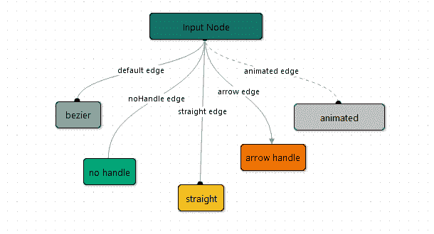

就是这样；我们很快就创建了流程图！

斯维尔韦特是开箱即用的互动。您和那些查看您的流程图的人可以在图中选择和移动节点，以及缩放和平移。

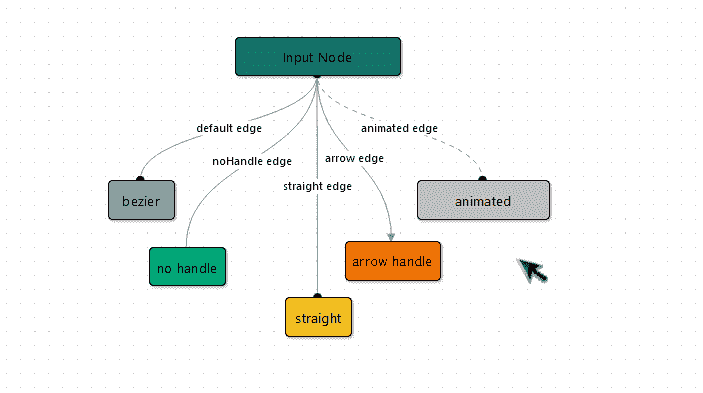

> 基本用法(分叉)由 david4473 使用 svelte，svelvet

结论

## 在本文中，我们研究了 Svelvet 的核心概念，研究了节点和边缘对象的属性，并演示了如何使用 Svelvet 建立一个基本的流程图。

Svelvet 仍处于起步阶段，缺乏其对手 React flow 提供的一些功能。Svelvet 团队承诺在未来通过集成额外的定制、测试和错误处理功能来使库更加广泛。

无论如何，库的基本功能已经构建完毕，可以投入生产了；您可以在您的项目中使用它。即使没有额外的功能，Svelvet 也是一个直观的解决方案，可以在 Svelte 中构建漂亮的流程图。

要了解有关 Svelvet 的更多信息，请参考[文档](https://svelvet.io/docs/installation/)或 [GitHub repo](https://github.com/open-source-labs/Svelvet) 。

使用 [LogRocket](https://lp.logrocket.com/blg/signup) 消除传统错误报告的干扰

## [LogRocket](https://lp.logrocket.com/blg/signup) 是一个数字体验分析解决方案，它可以保护您免受数百个假阳性错误警报的影响，只针对几个真正重要的项目。LogRocket 会告诉您应用程序中实际影响用户的最具影响力的 bug 和 UX 问题。

[](https://lp.logrocket.com/blg/signup)

然后，使用具有深层技术遥测的会话重放来确切地查看用户看到了什么以及是什么导致了问题，就像你在他们身后看一样。

LogRocket 自动聚合客户端错误、JS 异常、前端性能指标和用户交互。然后 LogRocket 使用机器学习来告诉你哪些问题正在影响大多数用户，并提供你需要修复它的上下文。

关注重要的 bug—[今天就试试 LogRocket】。](https://lp.logrocket.com/blg/signup-issue-free)

Focus on the bugs that matter — [try LogRocket today](https://lp.logrocket.com/blg/signup-issue-free).