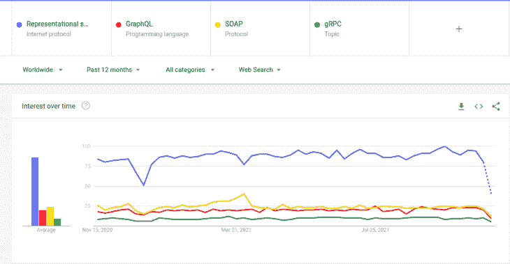
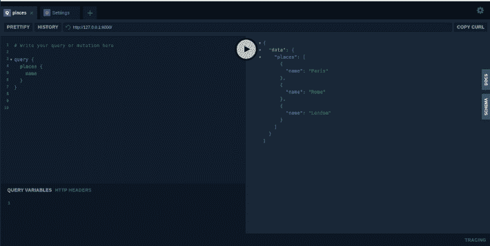
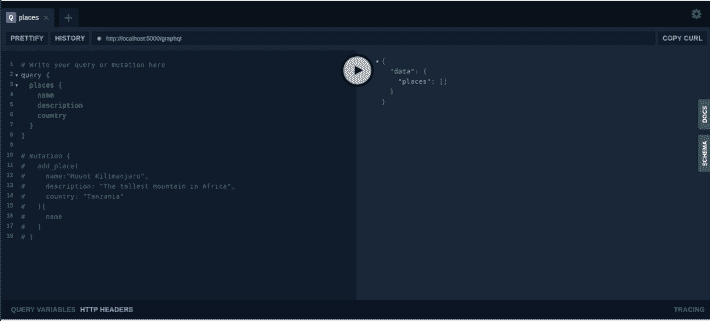

# 用 Python、Flask 和 Ariadne 构建一个 GraphQL API

> 原文：<https://blog.logrocket.com/build-graphql-api-python-flask-ariadne/>

说到 API 开发，有几种架构风格可以根据您的 API 需求进行选择，每一种都有自己的优缺点。这些方法包括:

*   简单对象访问协议(SOAP)
*   表征状态转移(REST)
*   远程过程调用
*   GraphQL

这是我在谷歌趋势上找到的。通过比较人们搜索 API 架构风格的频率，我们可以清楚地看到 REST 遥遥领先，也是开发人员最熟悉的。但不要忽视这一点:GraphQL 自 2015 年由脸书公开发布以来才出现了大约六年，而 REST 自 2000 年初就已经出现了。



## 为什么是 GraphQL？

我整理了一些你应该在这个项目中使用 GraphQL 的理由。这些问题包括:

### 只取你需要的东西

GraphQL 通过提供从多个资源查询数据的能力，允许您避免过量提取和不足提取，从而消除了拥有多个端点和进行多个 API 调用来获取所需数据的需要。

### 不再有版本控制

因为 GraphQL 允许您对 API 内部(字段、解析器等)进行更改。)而不必更改资源 URL，这使您不必手动管理 API 版本以及更新客户端代码库。

### 强类型架构(不容易出错)

GraphQL 使用强类型模式，这意味着当您在模式中指定类型时，它将为您处理所有类型验证。这可以避免调试由无效类型导致的错误。

## 图 QL 术语

在我们继续之前，最好熟悉一下经常提到的 GraphQL 术语:

#### 询问

用于查询数据的预构建类型，更像 REST API 中的 GET 请求。

#### 变化

一种用于操作数据的预构建类型。`Mutation`类型中的每个字段都可以看作是 REST API 中的 POST/PUT/DELETE/PATCH 请求。

#### 分解器

将模式字段和类型连接到各种后端的函数。

#### 田

属于模式中某个类型的数据单元。

你可以从官方的 [GraphQL 文档](https://graphql.org/)中了解更多关于所有术语的信息。

## Ariadne 入门

Ariadne 使用模式优先的方法，而其他用于在 Python 中实现 GraphQL 的库，如 Graphene 和 Strawberry，则使用代码优先的方法。你可能想知道这两者的区别。

主要区别在于 schema-first 表示我们首先为 GraphQL 服务定义模式，然后通过匹配模式中的定义来实现代码。在代码优先的方法中，我们首先对解析器进行编码，然后，从作为单一事实来源的代码开始，我们将模式作为工件生成。

您可以在这里了解更多关于[模式优先方法和代码优先方法之间的区别。](https://blog.logrocket.com/code-first-vs-schema-first-development-graphql/)

### **安装要求**

现在我们对 GraphQL 和 Ariadne 有了一个很好的概念，让我们安装所有需要的库，看看它们是如何以代码方式实现的。

`pip install ariadne, uvicorn, flask, flask-sqlalchemy, flask-migrate`

uvicorn 是一个 ASGI 服务器，在与 Flask 集成之前，我们将使用它来运行我们的 GraphQL API。

[Flask](https://flask.palletsprojects.com/en/2.0.x/) 是一个用 Python 写的微型 web 框架。这是后端开发中首选的框架之一。

[Flask-SQLAlchemy](https://flask-sqlalchemy.palletsprojects.com/en/2.x/) 和 [Flask-Migrate](https://flask-migrate.readthedocs.io/en/latest/) 是处理与数据库交互的扩展。Flask-SQLAlchemy 提供了 ORM 抽象，而 Flask-Migrate 提供了处理数据库迁移的方法。

## “你好，世界！”:构建一个简单的 GraphQL API

让我们用 Ariadne 创建一个简单的 GraphQL API，它返回要访问的目的地列表。我们的代码将如下所示:

```
from ariadne.asgi import GraphQL
from ariadne import gql, QueryType, make_executable_schema

# Define type definitions (schema) using SDL
type_defs = gql(
   """
   type Query {
       places: [Place]
   }

   type Place {
       name: String!
       description: String!
       country: String!
       }  
   """
)

# Initialize query

query = QueryType()

# Define resolvers
@query.field("places")
def places(*_):
   return [
       {"name": "Paris", "description": "The city of lights", "country": "France"},
       {"name": "Rome", "description": "The city of pizza", "country": "Italy"},
       {
           "name": "London",
           "description": "The city of big buildings",
           "country": "United Kingdom",
       },
   ]

# Create executable schema
schema = make_executable_schema(type_defs, query)

# Create ASGI application
app = GraphQL(schema)

```

现在我们简单 API 的代码已经准备好了，我们可以用 uvicorn 运行它，如下所示，假设脚本的标题是`hello_world.py`:

```
uvicorn  hello_world:app

```

您可以在浏览器上访问 GraphQL Playground，网址为 [http://127.0.0.1:8000/](http://127.0.0.1:8000/) ，与您的 GraphQL API 进行交互，并根据您需要的字段动态查询地点，如下图 GIF 所示:



## 将 Ariadne 与烧瓶整合

现在我们知道了 Ariadne 的工作原理，是时候看看如何将它与 Flask 集成在一起了。这不需要新的库；我们只会改变一些事情。

您可能想知道，如果可以使用 uvicorn ASGI 服务器独立运行 Ariadne，为什么敢与 Flask 集成。这种集成有助于利用现有的 flask 生态系统(Flask 扩展和特性),而无需重新发明轮子。

例如，使用 Flask-SQLAlchemy、Flask-MongoDB、Flask-Migrate 等扩展处理数据库集成。

### “你好，世界！”:烧瓶+阿里阿德涅

为了改变世界“你好，世界！”在前面的例子中，我们需要添加两条路由来处理两个功能，这两个功能以前是由内置的 ASGI web 服务器处理的。这包括:

*   获取客户端请求并将其传递给可执行模式，然后向客户端返回响应的路由
*   一个充当游乐场客户端的路由，可以轻松地与客户端进行交互(在生产中可能不需要这个路由)

下面是与 Flask 集成后的最终代码:

```
from ariadne.constants import PLAYGROUND_HTML
from flask import Flask, request, jsonify
from ariadne import gql, QueryType, make_executable_schema, graphql_sync

# Define type definitions (schema) using SDL
type_defs = gql(
   """
   type Query {
       places: [Place]
   }

   type Place {
       name: String!
       description: String!
       country: String!
       }  
   """
)

# Initialize query

query = QueryType()

# Define resolvers
@query.field("places")
def places(*_):
   return [
       {"name": "Paris", "description": "The city of lights", "country": "France"},
       {"name": "Rome", "description": "The city of pizza", "country": "Italy"},
       {
           "name": "London",
           "description": "The city of big buildings",
           "country": "United Kingdom",
       },
   ]

# Create executable schema
schema = make_executable_schema(type_defs, query)

# initialize flask app
app = Flask(__name__)

# Create a GraphQL Playground UI for the GraphQL schema
@app.route("/graphql", methods=["GET"])
def graphql_playground():
   # Playground accepts GET requests only.
   # If you wanted to support POST you'd have to
   # change the method to POST and set the content
   # type header to application/graphql
   return PLAYGROUND_HTML

# Create a GraphQL endpoint for executing GraphQL queries
@app.route("/graphql", methods=["POST"])
def graphql_server():
   data = request.get_json()
   success, result = graphql_sync(schema, data, context_value={"request": request})
   status_code = 200 if success else 400
   return jsonify(result), status_code

# Run the app
if __name__ == "__main__":
   app.run(debug=True)

```

当您运行该应用程序时，它将自动在 [http://localhost:5000/](http://localhost:5000/) 上启动，您可以通过访问[http://localhost:5000/GraphQL](http://localhost:5000/graphql)来查看操场以与 graph QL 服务器进行交互。这个应用程序的结果将和我们第一个没有 Flask 的例子完全一样。

### 添加突变

让我们给我们的应用程序添加一些突变，以允许我们添加新的地方。为此，我们需要更新两个主要部分，查询和解析器。我们将添加一个新的变异`add_place` (name，description，country)，它将 name，description 和 country 作为参数，然后创建一个解析器，向列表中添加新的位置。

我们的最终代码将如下所示:

```
from ariadne.constants import PLAYGROUND_HTML
from flask import Flask, request, jsonify
from ariadne import gql, QueryType, MutationType, make_executable_schema, graphql_sync

# Define type definitions (schema) using SDL
type_defs = gql(
   """
   type Query {
       places: [Place]
   }

   type Place {
       name: String!
       description: String!
       country: String!
       }  

   type Mutation{add_place(name: String!, description: String!, country: String!): Place}
   """
)

# Initialize query

query = QueryType()

# Initialize mutation

mutation = MutationType()

# Define resolvers

# places resolver (return places )
@query.field("places")
def places(*_):
   return places

# place resolver (add new  place)
@mutation.field("add_place")
def add_place(_, info, name, description, country):
   places.append({"name": name, "description": description, "country": country})
   return {"name": name, "description": description, "country": country}

# Create executable schema
schema = make_executable_schema(type_defs, [query, mutation])

# initialize flask app
app = Flask(__name__)

# Create a GraphQL Playground UI for the GraphQL schema
@app.route("/graphql", methods=["GET"])
def graphql_playground():
   # Playground accepts GET requests only.
   # If you wanted to support POST you'd have to
   # change the method to POST and set the content
   # type header to application/graphql
   return PLAYGROUND_HTML

# Create a GraphQL endpoint for executing GraphQL queries
@app.route("/graphql", methods=["POST"])
def graphql_server():
   data = request.get_json()
   success, result = graphql_sync(schema, data, context_value={"request": request})
   status_code = 200 if success else 400
   return jsonify(result), status_code

# Run the app
if __name__ == "__main__":
   places = [
       {"name": "Paris", "description": "The city of lights", "country": "France"},
       {"name": "Rome", "description": "The city of pizza", "country": "Italy"},
       {
           "name": "London",
           "description": "The city of big buildings",
           "country": "United Kingdom",
       },
   ]
   app.run(debug=True)

```

以下是如何向我们的 GraphQL Flask 服务器发出突变请求的示例:


### 添加数据库(Flask-SQLAlchemy + Flask-Migrate)

既然您已经熟悉了 Flask 和 Ariadne，那么您可以开始将其他组件集成到应用程序中，包括数据库。我们可以使用 Flask-SQLAlchemy 将数据存储到数据库中，而不是将数据存储到字典列表中。我们还可以集成 Flask-Migrate 来管理数据库的迁移。

下面是一个 GraphQL API 的例子，它与前面的代码有相似的功能，只是有一些变化。唯一的区别是，这段代码使用的是真实的数据库，而不是将数据存储在字典列表中:

```
from flask_migrate import Migrate
from flask_sqlalchemy import SQLAlchemy
from ariadne.constants import PLAYGROUND_HTML
from flask import Flask, request, jsonify
from ariadne import gql, QueryType, MutationType, make_executable_schema, graphql_sync

# Define type definitions (schema) using SDL
type_defs = gql(
   """
   type Query {
       places: [Place]
   }

   type Place {
       name: String!
       description: String!
       country: String!
       }  

   type Mutation{add_place(name: String!, description: String!, country: String!): Place}
   """
)

# Initialize query

query = QueryType()

# Initialize mutation

mutation = MutationType()

# Define resolvers

# places resolver (return places )
@query.field("places")
def places(*_):
   return [place.to_json() for place in Places.query.all()]

# place resolver (add new  place)
@mutation.field("add_place")
def add_place(_, info, name, description, country):
   place = Places(name=name, description=description, country=country)
   place.save()
   return place.to_json()

# Create executable schema
schema = make_executable_schema(type_defs, [query, mutation])

# initialize flask app
app = Flask(__name__)
app.config["SQLALCHEMY_DATABASE_URI"] = "sqlite:///db.sqlite3"
app.config["SQLALCHEMY_TRACK_MODIFICATIONS"] = False
db = SQLAlchemy(app)
migrate = Migrate(app, db)

class Places(db.Model):
   id = db.Column(db.Integer, primary_key=True)
   name = db.Column(db.String(80), nullable=False)
   description = db.Column(db.String(255), nullable=False)
   country = db.Column(db.String(80), nullable=False)

   def to_json(self):
       return {
           "name": self.name,
           "description": self.description,
           "country": self.country,
       }

   def save(self):
       db.session.add(self)
       db.session.commit()

# Create a GraphQL Playground UI for the GraphQL schema
@app.route("/graphql", methods=["GET"])
def graphql_playground():
   # Playground accepts GET requests only.
   # If you wanted to support POST you'd have to
   # change the method to POST and set the content
   # type header to application/graphql
   return PLAYGROUND_HTML

# Create a GraphQL endpoint for executing GraphQL queries
@app.route("/graphql", methods=["POST"])
def graphql_server():
   data = request.get_json()
   success, result = graphql_sync(schema, data, context_value={"request": request})
   status_code = 200 if success else 400
   return jsonify(result), status_code

# Run the app
if __name__ == "__main__":
   app.run(debug=True)

```

#### 迁移到数据库

因为我们已经为`Places`添加了一个新的数据库模型，所以我们需要进行迁移。首先，要初始化数据库，然后将我们新创建的模型迁移到我们的本地数据库，您可以使用下面的命令来完成:

```
export FLASK_APP=hello_world.py # assuming you named your script hello_world.py
flask db init 
flask db migrate
flask db upgrade 

```

完成迁移后，我们准备运行我们的应用程序，如下所示:

```
python  hello_world.py

```

GraphQL Playground 上的交互看起来与上一个非常相似:



我们已经到了文章的结尾；我希望这篇文章对你有用！

## 参考

1.  [https://daily.dev/blog/graphql-terminology-cheatsheet](https://daily.dev/blog/graphql-terminology-cheatsheet)
2.  [https://www . apollographql . com/docs/resources/graph QL-glossary/](https://www.apollographql.com/docs/resources/graphql-glossary/)
3.  [https://ariadniegraphql . org/](https://ariadnegraphql.org/)
4.  [https://graphql.org/learn/](https://graphql.org/learn/)

## 使用 [LogRocket](https://lp.logrocket.com/blg/signup) 消除传统错误报告的干扰

[](https://lp.logrocket.com/blg/signup)

[LogRocket](https://lp.logrocket.com/blg/signup) 是一个数字体验分析解决方案，它可以保护您免受数百个假阳性错误警报的影响，只针对几个真正重要的项目。LogRocket 会告诉您应用程序中实际影响用户的最具影响力的 bug 和 UX 问题。

然后，使用具有深层技术遥测的会话重放来确切地查看用户看到了什么以及是什么导致了问题，就像你在他们身后看一样。

LogRocket 自动聚合客户端错误、JS 异常、前端性能指标和用户交互。然后 LogRocket 使用机器学习来告诉你哪些问题正在影响大多数用户，并提供你需要修复它的上下文。

关注重要的 bug—[今天就试试 LogRocket】。](https://lp.logrocket.com/blg/signup-issue-free)