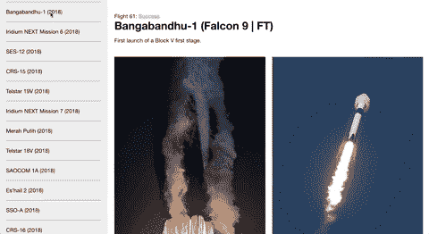
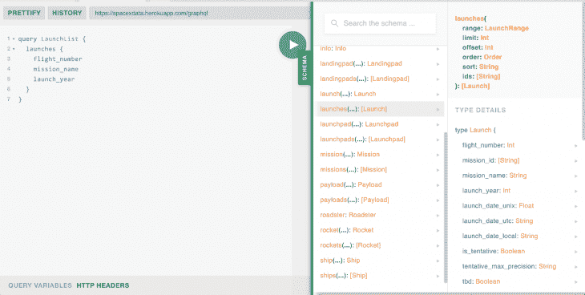
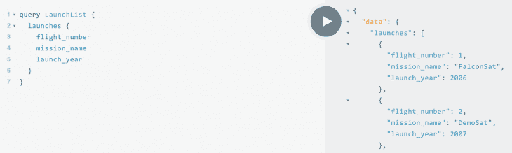
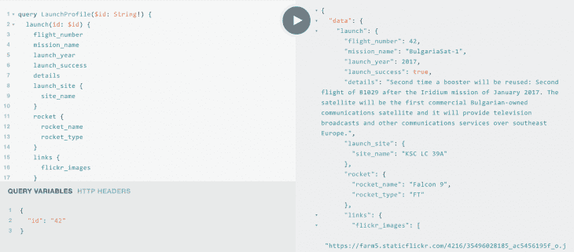
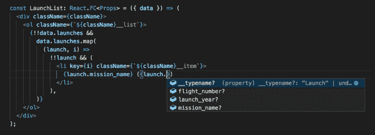

# 用 TypeScript - LogRocket 博客构建一个 GraphQL + React 应用程序

> 原文：<https://blog.logrocket.com/build-graphql-react-app-typescript/>

***编者按:**为了准确起见，本文最后一次更新于 2021 年 7 月 29 日，代码库由作者审核。*

GraphQL 和 TypeScript 都得到了广泛采用，当这两者与 React 结合时，它们创造了理想的开发人员体验。

GraphQL 改变了我们对 API 的看法，并利用直观的键/值对匹配，客户端可以请求在网页或移动应用程序屏幕上显示所需的准确数据。TypeScript 通过向变量添加静态类型来扩展 JavaScript，从而导致更少的错误和更可读的代码。

本文将带您通过 React 和 Apollo 构建一个客户端应用程序，使用公共的 SpaceX GraphQL API 来显示关于发射的信息。我们将为我们的查询自动生成 TypeScript 类型，并使用 React 钩子执行这些查询。我们将讨论以下主题:

本文将假设您对 React、GraphQL 和 TypeScript 有所了解，并将重点放在集成它们以构建一个正常运行的应用程序上。如果你需要额外的练习，你可以找到大量高质量的编码教程来帮助你提高速度。

如果你在任何一点卡住了，可以参考[源代码](https://github.com/treyhuffine/graphql-react-typescript-spacex)或者看[直播 app](https://spacex-graphql.netlify.com/) 。



## 为什么是 GraphQL + TypeScript？

GraphQL API 需要是强类型的，并且数据是从单个端点提供的。通过在这个端点上调用一个`GET`请求，客户机可以接收一个完全自我记录的后端表示，其中包含所有可用的数据和相应的类型。

使用 [GraphQL 代码生成器](https://github.com/dotansimha/graphql-code-generator)，我们扫描 web 应用程序目录以查找查询文件，并将它们与 GraphQL API 提供的信息进行匹配，从而为所有请求数据创建 TypeScript 类型。通过使用 GraphQL，我们可以免费自动输入 React 组件的属性。这导致你的产品更少的错误和更快的迭代速度。

## TypesScript、React 和 GraphQL 入门

我们将使用 [create-react-app](https://blog.logrocket.com/getting-started-with-create-react-app-d93147444a27/) 和 TypeScript 设置来引导我们的应用程序。通过执行以下命令初始化您的应用程序:

```
npx create-react-app graphql-typescript-react --template typescript
// NOTE - you will need Node v8.10.0+ and NPM v5.2+
```

通过使用`--template typescript`标志，CRA 将把你的文件生成为`.ts`和`.tsx`，并且它将创建一个`tsconfig.json`文件。

导航到应用程序目录:

```
cd graphql-typescript-react
```

现在我们可以安装额外的依赖项了。我们的应用程序将使用 Apollo 来执行 GraphQL API 请求。Apollo 需要的附加库是`@apollo/client`和`graphql`。

`apollo-boost`包含查询 API 和在内存中本地缓存数据所需的工具；`react-apollo`为 React 提供绑定；`react-apollo-hooks`在 React 钩子中包装 Apollo 查询；`graphql-tag`用于建立我们的查询文档；而`graphql`是提供 GraphQL 实现细节的对等依赖:

```
yarn add @apollo/client graphql
```

`graphql-code-generator`用于自动化我们的打字稿工作流程。我们将安装 codegen CLI 来生成我们需要的配置和插件:

```
yarn add -D @graphql-codegen/cli
```

通过执行以下命令来设置 codegen 配置:

```
npx graphql-codegen init
```

这将启动 CLI 向导。请执行以下步骤:

1.  用 React 构建的应用程序。
2.  该模式位于 [`https://spacexdata.herokuapp.com/graphql`](https://spacexdata.herokuapp.com/graphql) 。
3.  将 operations 和 fragments location 设置为`./src/components/**/*.{ts,tsx}`,这样它将在我们所有的 TypeScript 文件中搜索查询声明。
4.  使用默认插件“TypeScript”、“TypeScript Operations”、“TypeScript React Apollo”
5.  将生成的目的地更新为`src/generated/graphql.tsx`(Apollo 插件需要`.tsx`)。
6.  不要生成自省文件。
7.  使用默认的`codegen.yml`文件。
8.  制作您的跑步脚本`codegen`。

现在，通过在您的 CLI 中运行`yarn`命令，安装 CLI 工具添加到您的`package.json`中的插件。

我们还将对我们的`codegen.yml`文件进行一次更新，这样它也可以通过添加`withHooks: true`配置选项来生成类型化的 React Hook 查询。您的配置文件应该如下所示:

```
overwrite: true
schema: 'https://spacexdata.herokuapp.com/graphql'
documents: './src/components/**/*.ts'
generates:
  src/generated/graphql.tsx:
    plugins:
      - 'typescript'
      - 'typescript-operations'
      - 'typescript-react-apollo'
    config:
      withHooks: true
```

## 编写 GraphQL 查询和生成类型

GraphQL 的一个主要好处是它利用了[声明性数据获取](https://blog.logrocket.com/data-retrieval-in-graphql-with-react-apollo/)。我们能够编写与使用它们的组件共存的查询，并且 UI 能够准确地请求它需要呈现的内容。

当使用 REST APIs 时，我们需要找到可能是最新的也可能不是最新的文档。如果 REST 有任何问题，我们将需要对 API 和控制台发出请求。

GraphQL 解决了这个问题，它允许您访问 URL，查看完整定义的模式，并对其执行请求，所有这些都在 UI 中完成。访问[https://spacexdata.herokuapp.com/graphql](https://spacexdata.herokuapp.com/graphql),看看你到底要处理什么数据。



虽然我们有大量的 SpaceX 数据可供我们使用，但我们只会显示有关发射的信息。我们将有两个主要组件:

1.  用户可以点击`launches`列表了解更多信息。
2.  单个`launch`的详细简介。

对于我们的第一个组件，我们将查询`launches`键并请求`flight_number`、`mission_name`和`launch_year`。我们将在一个列表中显示这些数据，当用户点击其中一项时，我们将通过`launch`键查询该火箭的更多数据。让我们在 GraphQL playground 中测试我们的第一个查询。



为了编写我们的查询，我们首先创建一个`src/components`文件夹，然后创建一个`src/components/LaunchList`文件夹。在这个文件夹中，创建`index.tsx`、`LaunchList.tsx`、`query.ts`和`styles.css`文件。在`query.ts`文件中，我们可以从操场传输查询，并将其放在一个`gql`字符串中:

```
import { gql } from '@apollo/client';

export const QUERY_LAUNCH_LIST = gql`
  query LaunchList {
    launches {
      flight_number
      mission_name
      launch_year
    }
  }
`;
```

我们的另一个查询将获得基于`flight_number`的单次发射的更详细的数据。由于这将由用户交互动态生成，我们将需要使用 [GraphQL 变量](https://graphql.org/learn/queries/#variables)。我们还可以在操场上用变量测试查询。

在查询名称旁边，指定变量，并在前面加上一个`$`及其类型。然后，在主体内部，可以使用变量。对于我们的查询，我们通过将类型为`String!`的`$id`变量传递给它来设置启动的`id`。



我们将`id`作为变量传入，它对应于来自`LaunchList`查询的`flight_number`。`LaunchProfile`查询还将包含嵌套的对象/类型，我们可以通过指定括号内的键来获取值。

例如，launch 包含一个`rocket`定义(类型`LaunchRocket`，我们将要求它包含`rocket_name`和`rocket_type`。为了更好地理解`LaunchRocket`的可用字段，您可以使用旁边的模式导航器来理解可用数据。

现在让我们将这个查询转移到我们的应用程序中。用`index.tsx`、`LaunchProfile.tsx`、`query.ts`和`styles.css`文件创建一个`src/components/LaunchProfile`文件夹。在`query.ts`文件中，我们粘贴来自操场的查询。

```
import { gql } from '@apollo/client';

export const QUERY_LAUNCH_PROFILE = gql`
  query LaunchProfile($id: String!) {
    launch(id: $id) {
      flight_number
      mission_name
      launch_year
      launch_success
      details
      launch_site {
        site_name
      }
      rocket {
        rocket_name
        rocket_type
      }
      links {
        flickr_images
      }
    }
  }
`;
```

现在我们已经定义了查询，您终于能够生成您的 TypeScript 接口和类型化挂钩了。在您的终端中，执行:

```
yarn codegen
```

在`src/generated/graphql.ts`中，您将找到定义应用程序所需的所有类型，以及获取 GraphQL 端点以检索数据的相应查询。

这个文件往往很大，但其中充满了有价值的信息。我建议花点时间浏览一下，理解我们的 codegen 完全基于 GraphQL 模式创建的所有类型。

例如，检查`type Launch`，它是 GraphQL 中的`Launch`对象的类型脚本表示，我们在操场上与它交互。还可以滚动到文件的底部，查看专门为我们将要执行的查询生成的代码——它已经创建了组件、hoc、类型化的 props/query 和类型化的 hooks。

## 初始化阿波罗客户端

在我们的`src/index.tsx`中，我们需要初始化 Apollo 客户端，并使用`ApolloProvider`组件添加我们的`client`到 React 的上下文。

* * *

### 更多来自 LogRocket 的精彩文章:

* * *

我们初始化一个新的`ApolloClient`并给它我们的 GraphQL API 的 URI，然后我们在上下文提供者中包装我们的`<App />`组件。您的索引文件应该如下所示:

```
import * as React from 'react';
import ReactDOM from 'react-dom';
import { ApolloClient, ApolloProvider, InMemoryCache } from '@apollo/client';
import './index.css';
import App from './App';

const client = new ApolloClient({
  uri: 'https://spacexdata.herokuapp.com/graphql',
  cache: new InMemoryCache(),
});

ReactDOM.render(
  <ApolloProvider client={client}>
  <App />  
  </ApolloProvider>,
  document.getElementById('root'),
);

```

## 构建我们的组件

我们现在已经准备好了通过 Apollo 执行 GraphQL 查询所需的一切。

在`src/components/LaunchList/index.tsx`内部，我们将创建一个使用生成的`useLaunchListQuery`钩子的函数组件。查询挂钩返回`data`、`loading`和`error`值。我们将检查容器组件中的`loading`和`error`，并将`data`传递给我们的表示组件。

我们将通过使用这个组件作为容器/智能组件来保持关注点的分离，并且我们将把数据传递给一个表示/哑组件，该组件仅仅显示它已经被给予的内容。我们还将显示等待数据时的基本加载和错误状态。

您的容器组件应该如下所示:

```
import * as React from 'react';
import { useLaunchListQuery } from '../../generated/graphql';
import LaunchList from './LaunchList';

const LaunchListContainer = () => {
  const { data, error, loading } = useLaunchListQuery();

  if (loading) {
    return <div>Loading...</div>;
  }

  if (error || !data) {
    return <div>ERROR</div>;
  }

  return <LaunchList data={data} />;
};

export default LaunchListContainer;
```

我们的表示组件将使用我们的类型化的`data`对象来构建 UI。我们用`<ol>`创建一个有序列表，并映射我们的发布以显示`mission_name`和`launch_year`。

我们的`src/components/LaunchList/LaunchList.tsx`会是这样的:

```
import * as React from 'react';
import { LaunchListQuery } from '../../generated/graphql';
import './styles.css';

interface Props {
  data: LaunchListQuery;
}

const className = 'LaunchList';

const LaunchList: React.FC<Props> = ({ data }) => (
  <div className={className}>
    <h3>Launches</h3>
    <ol className={`${className}__list`}>
      {!!data.launches &&
        data.launches.map(
          (launch, i) =>
            !!launch && (
              <li key={i} className={`${className}__item`}>
                {launch.mission_name} ({launch.launch_year})
              </li>
            ),
        )}
    </ol>
  </div>
);

export default LaunchList;
```

如果您使用的是 VS 代码，IntelliSense 将准确显示可用的值，并提供一个自动完成列表，因为我们使用的是 TypeScript。它还会警告我们正在使用的数据可能是`null`或`undefined`。



说真的，这有多神奇？我们的编辑将为我们编码。同样，如果你需要一个类型或者函数的定义，你可以`Cmd + t`，用鼠标悬停它，它会给你所有的细节。

我们还将添加一些 CSS 样式，这将显示我们的项目，并允许它们在列表溢出时滚动。在`src/components/LaunchList/styles.css`中，添加以下代码:

```
.LaunchList {
  height: 100vh;
  overflow: hidden auto;
  background-color: #ececec;
  width: 300px;
  padding-left: 20px;
  padding-right: 20px;
}

.LaunchList__list {
  list-style: none;
  margin: 0;
  padding: 0;
}

.LaunchList__item {
  padding-top: 20px;
  padding-bottom: 20px;
  border-top: 1px solid #919191;
  cursor: pointer;
}
```

现在我们将构建我们的 profile 组件来显示关于发布的更多细节。这个组件的`index.tsx`文件基本相同，只是我们使用了`Profile`查询和组件。我们还将一个变量传递给 React 挂钩，用于启动的`id`。现在，我们将把它硬编码到`'42'`中，然后在我们设计好应用程序后添加动态功能。

在`src/components/LaunchProfile/index.tsx`中，添加以下代码:

```
import * as React from 'react';
import { useLaunchProfileQuery } from '../../generated/graphql';
import LaunchProfile from './LaunchProfile';

const LaunchProfileContainer = () => {
  const { data, error, loading } = useLaunchProfileQuery({ variables: { id: '42' } });

  if (loading) {
    return <div>Loading...</div>;
  }

  if (error) {
    return <div>ERROR</div>;
  }

  if (!data) {
    return <div>Select a flight from the panel</div>;
  }

  return <LaunchProfile data={data} />;
};

export default LaunchProfileContainer;
```

我们现在需要创建我们的表示组件。它将在 UI 顶部显示启动名称和详细信息，然后在描述下面有一个启动图像网格。

`src/components/LaunchProfile/LaunchProfile.tsx`组件将如下所示:

```
import * as React from 'react';
import { LaunchProfileQuery } from '../../generated/graphql';
import './styles.css';

interface Props {
  data: LaunchProfileQuery;
}

const className = 'LaunchProfile';

const LaunchProfile: React.FC<Props> = ({ data }) => {
  if (!data.launch) {
    return <div>No launch available</div>;
  }

  return (
    <div className={className}>
      <div className={`${className}__status`}>
        <span>Flight {data.launch.flight_number}: </span>
        {data.launch.launch_success ? (
          <span className={`${className}__success`}>Success</span>
        ) : (
          <span className={`${className}__failed`}>Failed</span>
        )}
      </div>
      <h1 className={`${className}__title`}>
        {data.launch.mission_name}
        {data.launch.rocket &&
          ` (${data.launch.rocket.rocket_name} | ${data.launch.rocket.rocket_type})`}
      </h1>
      <p className={`${className}__description`}>{data.launch.details}</p>
      {!!data.launch.links && !!data.launch.links.flickr_images && (
        <div className={`${className}__image-list`}>
          {data.launch.links.flickr_images.map((image, i) =>
            image ? (
              
            ) : null,
          )}
        </div>
      )}
    </div>
  );
};

export default LaunchProfile;

```

最后一步是用 CSS 样式化这个组件。将以下内容添加到您的`src/components/LaunchProfile/styles.css`文件中:

```
.LaunchProfile {
  height: 100vh;
  max-height: 100%;
  width: calc(100vw - 300px);
  overflow: hidden auto;
  padding-left: 20px;
  padding-right: 20px;
}

.LaunchProfile__status {
  margin-top: 40px;
}

.LaunchProfile__title {
  margin-top: 0;
  margin-bottom: 4px;
}

.LaunchProfile__success {
  color: #2cb84b;
}

.LaunchProfile__failed {
  color: #ff695e;
}

.LaunchProfile__image-list {
  display: grid;
  grid-gap: 20px;
  grid-template-columns: repeat(2, 1fr);
  margin-top: 40px;
  padding-bottom: 100px;
}

.LaunchProfile__image {
  width: 100%;
}
```

现在我们已经完成了组件的静态版本，我们可以在 UI 中查看它们。我们将在`src/App.tsx`文件中包含我们的组件，并将`<App />`转换成一个函数组件。我们使用一个函数组件来简化它，并允许我们在添加点击功能时使用钩子。

```
import * as React from 'react';
import LaunchList from './components/LaunchList';
import LaunchProfile from './components/LaunchProfile';

import './App.css';

const App = () => {
  return (
    <div className="App">
      <LaunchList />
      <LaunchProfile />
    </div>
  );
};

export default App;
```

为了得到我们想要的样式，我们将把`src/App.css`改为如下:

```
.App {
  display: flex;
  width: 100vw;
  height: 100vh;
  overflow: hidden;
}
```

在您的终端中执行`yarn start`，在您的浏览器中导航到`[http://localhost:3000](http://localhost:3000)`，您应该会看到您的应用程序的基本版本！

## 添加用户交互

现在，我们需要添加功能，以便在用户单击面板中的项目时获取完整的启动数据。我们将在`App`组件中创建一个钩子来跟踪航班 ID，并将其传递给`LaunchProfile`组件来重新获取发射数据。

在我们的`src/App.tsx`中，我们将添加`useState`来维护和更新 ID 的状态。我们还将使用名为`handleIdChange`的`useCallback`作为点击处理程序，当用户从列表中选择一个时更新 ID。我们将`id`传递给`LaunchProfile`，将`handleIdChange`传递给`<LaunchList />`。

更新后的`<App />`组件应该如下所示:

```
const App = () => {
  const [id, setId] = React.useState(42);
  const handleIdChange = React.useCallback(newId => {
    setId(newId);
  }, []);

  return (
    <div className="App">
      <LaunchList handleIdChange={handleIdChange} />
      <LaunchProfile id={id} />
    </div>
  );
};
```

在`LaunchList.tsx`组件中，我们需要为`handleIdChange`创建一个类型，并将其添加到我们的 props 析构中。然后，在我们的`<li>`航班项目上，我们将执行`onClick`回调中的函数。

```
export interface OwnProps {
  handleIdChange: (newId: number) => void;
}

interface Props extends OwnProps {
  data: LaunchListQuery;
}

// ...
const LaunchList: React.FC<Props> = ({ data, handleIdChange }) => (

// ...
<li
  key={i}
  className={`${className}__item`}
  onClick={() => handleIdChange(launch.flight_number!)}
>
```

在`LaunchList/index.tsx`里面，一定要从`LaunchList/LaunchList.tsx`导入`OwnProps`声明，键入要传递给容器组件的`props`，然后将道具展开到`<LaunchList data={data} {...props} />`。

最后一步是在`id`改变时`refetch`数据。在`Launch/Profile/index.tsx`文件中，我们将使用`useEffect`，它管理 React 生命周期，并在`id`改变时触发获取。以下是实现提取所需的唯一更改:

```
interface OwnProps {
  id: number;
}

const LaunchProfileContainer: React.FC<OwnProps> = ({ id }) => {
  const { data, error, loading, refetch } = useLaunchProfileQuery({
    variables: { id: String(id) },
  });
  React.useEffect(() => {
    refetch({ id: String(id) });
  }, [refetch, id]);
```

因为我们已经将表示从数据中分离出来，所以我们不需要对我们的`<LaunchProfile />`组件做任何更新；我们只需要更新`index.tsx`文件，这样当选择的`flight_number`改变时，它可以重新提取完整的启动数据。

现在你有了！如果您遵循这些步骤，您应该有一个功能完整的 GraphQL 应用程序。如果您在任何地方迷路了，您可以在[源代码](https://github.com/treyhuffine/graphql-react-typescript-spacex)中找到工作解决方案。

## 结论

一旦配置好 app，我们可以看到开发速度快得不可思议。我们可以轻松地构建一个数据驱动的 UI。GraphQL 允许我们定义我们在组件中需要的数据，并且我们可以无缝地在我们的组件中使用它作为道具。生成的 TypeScript 定义对我们编写的代码给予了极高的信任。

如果您希望更深入地了解项目，下一步将是使用 API 中的附加字段添加分页和更多的数据连接。要对启动列表进行分页，您需要获取当前列表的长度，并将`offset`变量传递给`LaunchList`查询。

我鼓励您更深入地探索它，并编写您自己的查询，这样您就可以巩固所介绍的概念。

*如果您觉得这篇文章很有帮助，[请关注我的 Medium](https://medium.com/@treyhuffine) ，获取更多关于 React、Node.js 和 JavaScript 的文章！你也可以在推特上找到我。*

## 使用 LogRocket 消除传统反应错误报告的噪音

[LogRocket](https://lp.logrocket.com/blg/react-signup-issue-free)

是一款 React analytics 解决方案，可保护您免受数百个误报错误警报的影响，只针对少数真正重要的项目。LogRocket 告诉您 React 应用程序中实际影响用户的最具影响力的 bug 和 UX 问题。

[ ](https://lp.logrocket.com/blg/react-signup-general) [  ](https://lp.logrocket.com/blg/react-signup-general) [LogRocket](https://lp.logrocket.com/blg/react-signup-issue-free)

自动聚合客户端错误、反应错误边界、还原状态、缓慢的组件加载时间、JS 异常、前端性能指标和用户交互。然后，LogRocket 使用机器学习来通知您影响大多数用户的最具影响力的问题，并提供您修复它所需的上下文。

关注重要的 React bug—[今天就试试 LogRocket】。](https://lp.logrocket.com/blg/react-signup-issue-free)

## [LogRocket](https://lp.logrocket.com/blg/typescript-signup) :全面了解您的网络和移动应用

[](https://lp.logrocket.com/blg/typescript-signup)

LogRocket 是一个前端应用程序监控解决方案，可以让您回放问题，就像问题发生在您自己的浏览器中一样。LogRocket 不需要猜测错误发生的原因，也不需要向用户询问截图和日志转储，而是让您重放会话以快速了解哪里出错了。它可以与任何应用程序完美配合，不管是什么框架，并且有插件可以记录来自 Redux、Vuex 和@ngrx/store 的额外上下文。

除了记录 Redux 操作和状态，LogRocket 还记录控制台日志、JavaScript 错误、堆栈跟踪、带有头+正文的网络请求/响应、浏览器元数据和自定义日志。它还使用 DOM 来记录页面上的 HTML 和 CSS，甚至为最复杂的单页面和移动应用程序重新创建像素级完美视频。

[Try it for free](https://lp.logrocket.com/blg/typescript-signup)

.