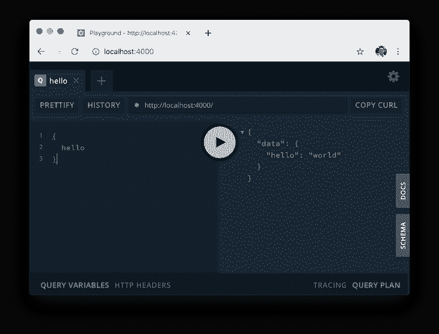
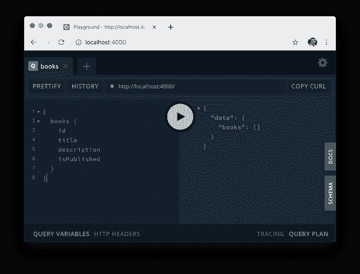
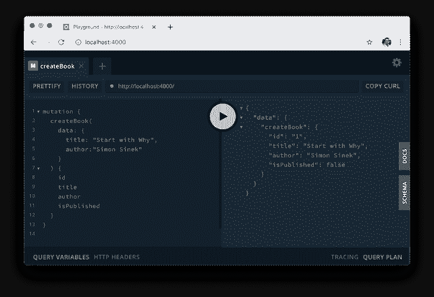
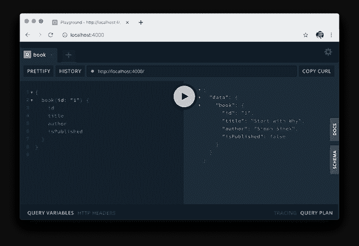
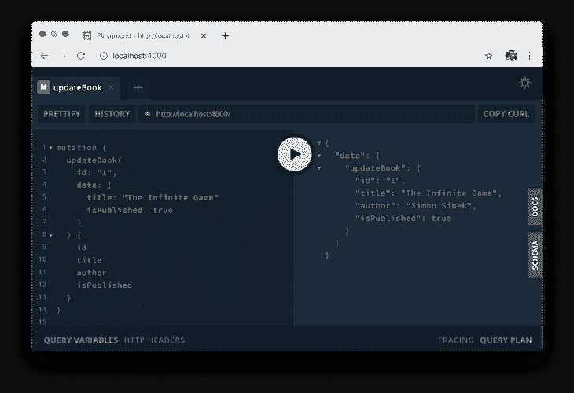
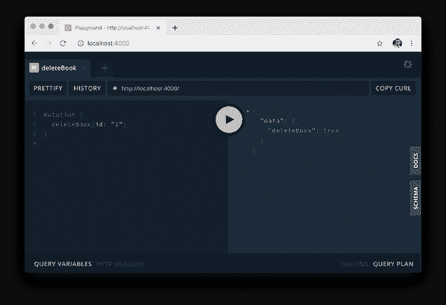

# 用 TypeGraphQL 和 TypeORM 构建 GraphQL APIs

> 原文：<https://blog.logrocket.com/build-graphql-typegraphql-typeorm/>

***编者按:*** *本帖于 2021 年 12 月 15 日修订，包含更新的代码块和信息。*

GraphQL 的受欢迎程度在不断增长，原因并不神秘:它是一个很好的工具，解决了开发人员在使用 RESTful APIs 时遇到的许多常见问题。GraphQL 允许我们轻松地获取数据关系，但也防止我们过度获取数据。简而言之，GraphQL 改善了开发体验，使前端应用程序更快。

如果您以前曾经使用 Node.js 创建过 GraphQL 服务器，那么您很有可能使用 GraphQL 模式语言为您的对象类型、变异和查询定义了模式，并使用 JavaScript/TypeScript 定义了解析器，它们与您定义的模式相匹配。

这种方法可能很难维护，尤其是在处理大型模式时，因为模式和解析器位于不同的位置。

如果我们想要更改数据中的一个字段，我们需要更改数据库模型类和 GraphQL 模式，并调整类型接口(如果使用 TypeScript)。但在本教程中，我将向您展示一种用 TypeGraphQL 和 TypeORM 构建 GraphQL API 的愉快方式。

[TypeGraphQL](https://typegraphql.com/) 是一个用 Node.js 和 TypeScript 构建 GraphQL APIs 的框架。这个工具的主要目的是让我们直接从我们的 TypeScript 代码中定义我们的模式。[另一方面，TypeORM](https://typeorm.io/#/) 是一个允许我们与 SQL 数据库交互的类型脚本库。结合这些工具，我们可以构建一个类型安全的 GraphQL API，而不会遇到这类项目通常会遇到的挫折。

事不宜迟，让我们来看看如何用 TypeGraphQL 和 TypeORM 构建一个 GraphQL API，它可以用 [CRUD 功能](https://blog.logrocket.com/crud-with-node-graphql-react/)管理图书数据。

## 先决条件

开始之前，请确保您:

1.  理解 JavaScript
2.  对 Node.js 和 npm 有一个大致的了解
3.  具备打字稿的基本知识

## GraphQL 入门

我们将从初始化一个新的 Node.js 项目开始。

```
mkdir learn-typegraphql
npm init -y

```

接下来，我们将安装一些依赖项。

```
npm install apollo-server type-graphql typeorm reflect-metadata

```

在这里，我们正在安装:

*   Apollo 服务器来构建和运行我们的 GraphQL 服务器
*   从 TypeScript 类生成我们的模式
*   键入与我们的 SQL 数据库交互的表单
*   与打字稿装饰者一起工作

此外，我们需要安装一些开发依赖项。

```
npm install -D typescript ts-node nodemon

```

该脚本将安装:

1.  将我们的代码编译成普通的 JavaScript
2.  在开发环境中运行我们的服务器
3.  当我们修改代码时，自动重启服务器

现在，为了让我们的工作简单一点，让我们在`package.json`中定义 npm 启动脚本。

```
{
  // ...
  "scripts": {
    "start": "nodemon -w src --ext ts --exec ts-node src/index.ts"
  }
}

```

接下来，创建一个`tsconfig.json`文件。该文件包含我们的 TypeScript 配置，因为我们将使用一些目前仍处于试验阶段的 TypeScript 特性，但对于我们的目的来说已经足够稳定了。

```
{
  "compilerOptions": {
    "target": "es5",
    "module": "commonjs",
    "strict": true,
    "esModuleInterop": true,
    "experimentalDecorators": true,
    "emitDecoratorMetadata": true,
    "strictPropertyInitialization": false
  }
}

```

确保`experimentalDecorators`和`emitDecoratorMetadata`设置为真。

作为参考，我把这个项目的全部源代码发布到我的 [GitHub](https://github.com/rahmanfadhil/learn-typegraphql) 上。你可以随意摆弄或者克隆到你的电脑上。

```
git clone https://github.com/rahmanfadhil/learn-typegraphql.git

```

## 设置 GraphQL 服务器

是时候开始开发我们的服务器 API 了。让我们在`src`文件夹中创建一个名为`index.ts`的新文件。

```
// src/index.ts

import "reflect-metadata";
import { createConnection } from "typeorm";
import { ApolloServer } from "apollo-server";
import { buildSchema } from "type-graphql";

async function main() {
  const connection = await createConnection()
  const schema = await buildSchema()
  const server = new ApolloServer({ schema })
  await server.listen(4000)
  console.log("Server has started!")
}
main()
```

在这个文件中，我们可以编写一个名为`main`的函数。这个函数使得初始化我们在这个项目中使用的每一个库变得更加容易。在这个函数中，我们将首先使用 TypeORM 提供的`createConnection`函数创建一个到数据库的新连接。

接下来，我们将使用 TypeGraphQL 的`buildSchema`方法生成我们的 GraphQL 模式。这将使用我们所有的解析器，并生成一个可执行的 GraphQL 模式，我们可以在我们的 Apollo 服务器中使用。这些解析器略有不同，我们将在本教程的后面讨论。

我们在顶部导入的 [reflect-metadata](https://www.npmjs.com/package/reflect-metadata) 包是一个助手库，它扩展了 TypeScript decorators 的功能。这个包是使用 TypeORM 和 TypeGraphQL 所必需的。

最后，我们将初始化我们的 Apollo 服务器，传递我们的模式，并在端口`4000`(或者您想要的任何其他端口)启动它。

## GraphQL 中的数据库配置

在上一节中，我们从 TypeORM 调用了`createConnection`函数来建立数据库连接。现在，我们需要定义一个数据库配置来告诉 TypeORM 我们计划使用哪种数据库以及如何访问它。有几种方法可以做到这一点；就个人而言，我喜欢在`ormconfig.json`文件中创建配置。

目前，TypeORM 支持九种类型的 SQL 数据库，包括 MySQL 和 PostgreSQL 等流行的数据库。您可以使用任何想要的数据库，但是为了简单起见，我将使用 SQLite——SQL 数据库引擎的最小实现，非常容易上手。要使用这个数据库，我们必须首先安装 Node.js 的驱动程序。

```
npm install sqlite3

```

现在，我们可以将`ormconfig.json`文件添加到我们的项目中。

```
{
  "type": "sqlite",
  "database": "./db.sqlite3",
  "entities": ["./src/models/*.ts"],
  "synchronize": true
}

```

## 下决心者

假设您创建了一个只有 Apollo 库的 GraphQL 服务器。在这种情况下，您用 GraphQL 模式语言为对象类型、变异和查询定义模式，并用 JavaScript/TypeScript 定义与您定义的模式相匹配的解析器。这种方法可能很难维护，尤其是当您有很多变化和查询时，因为您的模式和解析器位于不同的位置。

* * *

### 更多来自 LogRocket 的精彩文章:

* * *

然而，使用 TypeGraphQL，我们不需要显式地编写模式。相反，我们用 TypeScript 类和 decorators 定义解析器，TypeGraphQL 将为我们生成模式。

要了解这一点，让我们看看下面的代码。

```
// src/resolvers/BookResolver.ts

import { Resolver, Query } from "type-graphql";

@Resolver()
export class BookResolver {
  @Query(() => String)
  hello() {
    return "world";
  }
}

```

在这里，我们创建了一个名为`BookResolver`的类，并用 TypeGraphQL 的`Resolver`装饰器来装饰它。这使我们能够将所有的解析器作为一个方法放在这个类中。我们还想确保用`Query`或`Mutation`来修饰方法，并在第一个参数上传递返回类型。

到目前为止，我们只有一个返回字符串的`hello`查询。稍后，我们将使用 TypeORM 对我们的数据库实现完整的 CRUD。

现在我们需要在`src/index.ts`中注册我们的解析器。

```
import "reflect-metadata";
import { createConnection } from "typeorm";
import { ApolloServer } from "apollo-server";
import { BookResolver } from "./resolvers/BookResolver.ts"; // add this
import { buildSchema } from "type-graphql";

async function main() {
  const connection = await createConnection()
  const schema = await buildSchema({
    resolvers: [BookResolver] // add this
  })
  const server = new ApolloServer({ schema })
  await server.listen(4000)
  console.log("Server has started!")
}
main()
```

就是这样！为了确保一切设置正确，让我们通过在终端上运行`npm start`并在浏览器中打开`localhost:4000`来运行我们的服务器。



## 用 TypeORM 定义模型

现在我们的服务器已经启动并运行了，下一步是定义我们的模型。

模型本质上是一个类，它允许我们与数据库中的特定表进行交互。使用 TypeORM，我们可以用类和装饰器定义我们的数据库模型，就像我们的解析器一样。因为我们试图构建一个书店 API，所以让我们创建一个代表我们的书籍的模型。

```
// src/models/Book.ts

import { Entity, BaseEntity, PrimaryGeneratedColumn, Column } from "typeorm";

@Entity()
export class Book extends BaseEntity {
  @PrimaryGeneratedColumn()
  id: string;

  @Column()
  title: string;

  @Column()
  author: string;

  @Column({ default: false })
  isPublished: boolean;
}

```

TypeORM 模型本质上是一个用`Entity`修饰的普通 TypeScript 类。该类包含表示数据库中表的字段的属性。你可以在 [TypeORM 官方文档](https://typeorm.io/#/entities)中了解更多。

这个类扩展了`BaseEntity`类，它包含了访问 books 表的有用方法。

## 对象类型

因为我们正在构建一个 GraphQL API，所以我们还需要定义我们的对象类型。在 GraphQL 中，每一个查询和变异都会返回一个对象，无论是布尔值、字符串还是我们自己定义的自定义对象。就像我们的模型一样，我们可以通过使用类和装饰器来简单地定义我们的对象类型。

这就是奇迹发生的地方。我们可以将 TypeGraphQL 和 TypeORM 装饰器组合在一个 TypeScript 类中。这样，我们可以有一个表示 GraphQL 对象类型以及数据库模型的类。代码应该如下所示:

```
// src/models/Book.ts

import { Entity, BaseEntity, PrimaryGeneratedColumn, Column } from "typeorm";
import { ObjectType, Field, ID } from "type-graphql";

@Entity()
@ObjectType()
export class Book extends BaseEntity {
  @Field(() => ID)
  @PrimaryGeneratedColumn()
  id: string;

  @Field(() => String)
  @Column()
  title: string;

  @Field(() => String)
  @Column()
  author: string;

  @Field(() => Boolean)
  @Column({ default: false })
  isPublished: boolean;
}

```

这使得我们的代码更加高效，因为我们在一个地方定义了单一的数据类型，这应该有助于减少由属性不一致导致的错误。

假设我们想将`isPublished`属性更新为`published`。传统上，当使用默认的 GraphQL 模式语言时，我们需要在数据库模型和 GraphQL 模式中定义我们的数据类型。然而，通过使用这些装饰器，我们可以简单地更新类中的属性来更新模式和模型。

您甚至可以为数据库表列和 GraphQL 模式使用不同的名称。假设您想要将数据库中的`isPublished`字段命名为`is_published`,并在 GraphQL 模式中发布，您可以通过向属性装饰器添加 name 选项来实现:

```
@Field(() => Boolean, { name: "published" })
@Column({ default: false, name: 'is_published' })
isPublished: boolean;

```

## 数据库积垢

创建数据库模型后，让我们回到解析器，实现一个返回所有书籍的查询。

```
import { Resolver, Query } from "type-graphql";
import { Book } from "../models/Book";

@Resolver()
class BookResolver {
  @Query(() => [Book])
  books() {
    return Book.find()
  }
}

```

我们将在 resolver 类中创建`books`方法，并用`Query`修饰它。为了指定查询的返回类型，我们需要在`Query`装饰参数中传递它，在本例中，它是一个书籍数组。在这个方法中，我们用`find`方法从我们的模型中获取我们的书。

现在让我们回到我们的操场，测试这个查询。



它返回一个空数组，这意味着我们还没有创建任何书籍。让我们通过创造一个突变来做到这一点。

```
@Mutation(() => Book)
async createBook(@Arg("data") data: CreateBookInput) {
  const book = Book.create(data);
  await book.save();
  return book;
}

```

这里，我们创建了一个返回图书类型的`createBook`方法。在这个方法中，我们初始化一个新的`Book`实例，用`save`方法将它保存到数据库中，并返回它。此方法需要数据作为参数。为了从用户那里获得数据，我们可以构建一个输入类型来指定哪些字段对于这种变异是必需的。

让我们创建一个输入来创建一本新书。

```
// src/inputs/CreateBookInput.ts

import { InputType, Field } from "type-graphql";

@InputType()
export class CreateBookInput {
  @Field()
  title: string;

  @Field()
  author: string;
  @Field({ nullable: true })
  isPublished?: boolean;
}

```

输入类型类类似于我们的对象类型。唯一不同的是我们用`InputType`修饰了这个类。这里，我们指定除了`id`列之外的所有列，因为它是在我们每次插入新行时由数据库自动生成的。我们还为`isPublished`列设置了`nullable: true`，因为它有一个默认值。

让我们来测试一下！



接下来，我们将创建一个新的查询来获取一本书。

```
@Query(() => Book)
book(@Arg("id") id: string) {
  return Book.findOne({ where: { id } });
}

```

让我们试试这个查询:



到目前为止，一切顺利！

现在是添加更新操作的时候了。

```
@Mutation(() => Book)
async updateBook(@Arg("id") id: string, @Arg("data") data: UpdateBookInput) {
  const book = await Book.findOne({ where: { id } });
  if (!book) throw new Error("Book not found!");
  Object.assign(book, data);
  await book.save();
  return book;
}

```

在`updateBook`方法中，我们需要我们想要更新的`book`的`id`以及用户输入，我们将在后面创建。首先，我们会找到这本书，如果它存在的话。然后，我们将更新在`data`参数中定义的属性。最后，我们将保存对数据库的所有更改，并将更新后的图书数据返回给用户。

下面我们定义更新一本书的输入。

```
import { InputType, Field } from "type-graphql";

@InputType()
export class UpdateBookInput {
  @Field({ nullable: true })
  title?: string;

  @Field({ nullable: true })
  author?: string;

  @Field({ nullable: true })
  isPublished?: boolean;
}

```

输入与我们的`CreateBookInput`类非常相似。然而，所有这些属性都是可选的，这意味着用户不必填写书的所有属性。



最后一步是实现删除图书特性。

```
@Mutation(() => Boolean)
async deleteBook(@Arg("id") id: string) {
  const book = await Book.findOne({ where: { id } });
  if (!book) throw new Error("Book not found!");
  await book.remove();
  return true;
}

```

这个方法非常简单。我们从给定的`id`中找到那本书，用`remove`函数将它从数据库中删除，并返回`true`作为结果。



## 结论

TypeGraphQL 可以帮助解决开发人员在构建 GraphQL APIs 时遇到的许多问题，尤其是使用 TypeScript 时。它不仅提供了一种更干净、更安全的方式来构建 GraphQL APIs，还避免了我们一遍又一遍地重复相同的任务。

如果使用 TypeORM，它甚至会更有用，因为它采用相同的方法来定义数据库模型。这些工具被证明可以完成工作，应该是你下一个大项目的首要考虑因素。

## [LogRocket](https://lp.logrocket.com/blg/typescript-signup) :全面了解您的网络和移动应用

[](https://lp.logrocket.com/blg/typescript-signup)

LogRocket 是一个前端应用程序监控解决方案，可以让您回放问题，就像问题发生在您自己的浏览器中一样。LogRocket 不需要猜测错误发生的原因，也不需要向用户询问截图和日志转储，而是让您重放会话以快速了解哪里出错了。它可以与任何应用程序完美配合，不管是什么框架，并且有插件可以记录来自 Redux、Vuex 和@ngrx/store 的额外上下文。

除了记录 Redux 操作和状态，LogRocket 还记录控制台日志、JavaScript 错误、堆栈跟踪、带有头+正文的网络请求/响应、浏览器元数据和自定义日志。它还使用 DOM 来记录页面上的 HTML 和 CSS，甚至为最复杂的单页面和移动应用程序重新创建像素级完美视频。

## 监控生产中失败和缓慢的 GraphQL 请求

虽然 GraphQL 有一些调试请求和响应的特性，但确保 GraphQL 可靠地为您的生产应用程序提供资源是一件比较困难的事情。如果您对确保对后端或第三方服务的网络请求成功感兴趣，

[try LogRocket](https://lp.logrocket.com/blg/graphql-signup)

.

[](https://lp.logrocket.com/blg/graphql-signup)[https://logrocket.com/signup/](https://lp.logrocket.com/blg/graphql-signup)

LogRocket 就像是网络和移动应用的 DVR，记录下你网站上发生的每一件事。您可以汇总并报告有问题的 GraphQL 请求，以快速了解根本原因，而不是猜测问题发生的原因。此外，您可以跟踪 Apollo 客户机状态并检查 GraphQL 查询的键值对。

LogRocket 检测您的应用程序以记录基线性能计时，如页面加载时间、到达第一个字节的时间、慢速网络请求，还记录 Redux、NgRx 和 Vuex 操作/状态。

[Start monitoring for free](https://lp.logrocket.com/blg/graphql-signup)

.

[Try it for free](https://lp.logrocket.com/blg/typescript-signup)

.