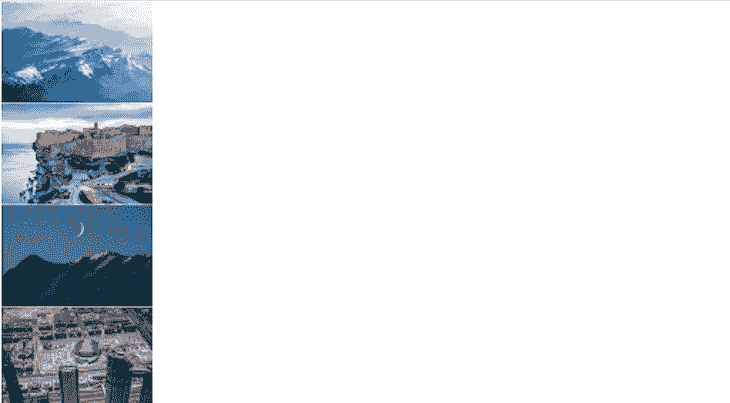
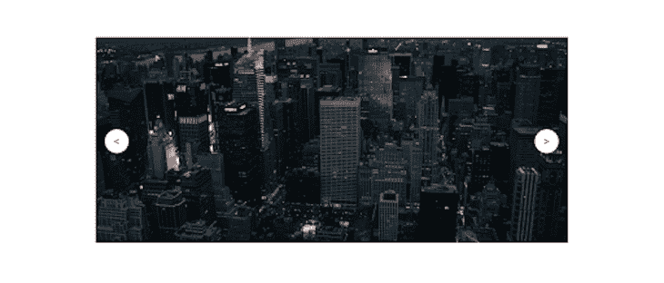
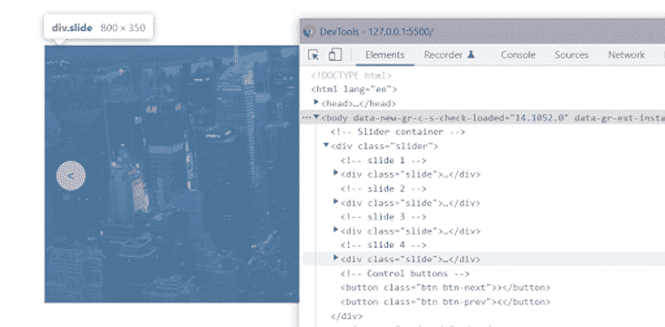
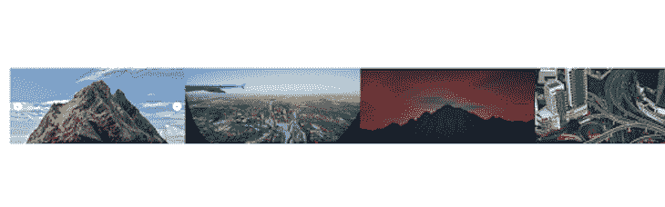
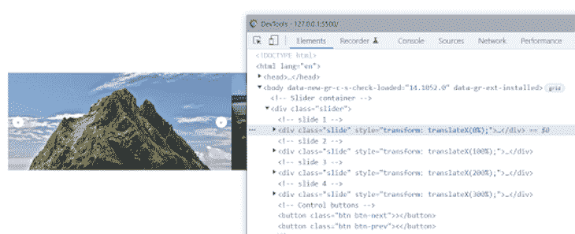
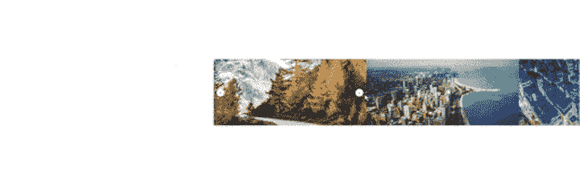
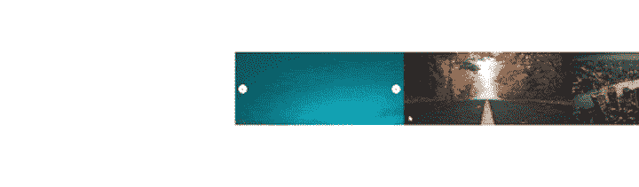
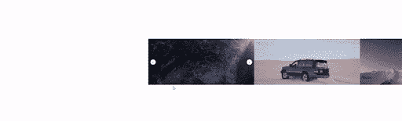
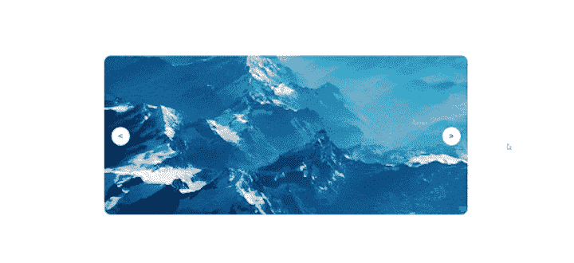

# 用普通的 JavaScript 从头开始构建一个图像转盘

> 原文：<https://blog.logrocket.com/build-image-carousel-from-scratch-vanilla-javascript/>

毫无疑问，旋转木马是网站设计中必不可少的组成部分。当你空间有限的时候。当你空间有限，但仍想显示大量信息时，旋转木马非常方便，因为它们非常适合显示相关或不相关的内容组。

无论是用于呈现幻灯片、推荐部分，还是在滑块中展示多条消息，旋转木马都是必不可少的。在本教程中，我们将看看如何只用 HTML、CSS 和普通的 JavaScript 构建一个旋转木马。

## 预建转盘组件的潜在问题

通常，当基于设计需求或者只是出于美观的原因，需要在网站中实现一个轮播时，我们会立即考虑使用现有的库、插件或者一些已经预先构建好的东西来节省时间。

虽然这是合理的，而且非常好，但是使用外部库之类的东西经常会给我们的应用程序增加不必要的依赖和代码膨胀。这可能会导致额外的加载时间，因为必须下载这些依赖项。它还会导致库或插件与我们现有的应用程序代码库之间的代码冲突，这需要时间来解决。

仅用 HTML、CSS 和普通 JavaScript 构建自己的 carousel 可能是最有效的解决方案，因为它将花费更少的时间来实现，而不会增加依赖性，也不会引起冲突/错误。

说完了，我们开始吧！

## 为轮播创建 HTML 标记

我们将从创建转盘的 HTML 标记结构开始。为了简单起见，我们只需要几个 HTML 元素:

*   一个主滑块容器 div
*   每张幻灯片的包装 div
*   分别包含来自 Unsplash 的四个随机图像的四个实际幻灯片
*   用于在幻灯片之间导航的两个按钮

让我们就这么做吧:

```
 <body>
   *<!-- slider container -->*
    <div class="slider">

      *<!-- slide 1 -->*
      <div class="slide">
        
      </div>

       *<!-- slide 2 -->*
      <div class="slide">
        
      </div>

       *<!-- slide 3 -->*
      <div class="slide">
        
      </div>

       *<!-- slide 4 -->*
      <div class="slide">
        
      </div>

       *<!-- Control buttons -->*
      <button class="btn btn-next">></button>
      <button class="btn btn-prev"><
    </div>
  </body>
```

我们选择使用 Unsplash 的图片作为我们的 carousel，这样就不会因为实际的内容标记而使我们的代码过于复杂。结果输出如下所示:



既然我们已经弄清楚了这一点，我们就准备好进入 CSS 部分，开始设计我们的 carousel。

注意:因为我们使用的是 Unsplash 随机图像端点，所以每当我们重新加载浏览器时，都会从 Unsplash 获得一组新的随机图像。

## 为旋转木马创建 CSS 样式

现在，让我们继续为 carousel 创建 CSS 样式表。在开始写代码之前，让我们先来看看我们将要做什么 **:**

*   我们首先使用 grid 将滑块容器放在 body 元素的中心。我们还将为滑块容器和幻灯片提供相应的固定宽度和高度，以响应
*   接下来，我们将设置滑块容器有一个相对位置；然后，它成为幻灯片的父容器，因为我们会将这些幻灯片的位置分别设置为绝对位置。这使得它们在滑块容器中相互堆叠
*   最后，我们将使用 absolute、transform 和 z-index 属性设置 previous 和 next 按钮的样式，使其位于幻灯片上方

```
body {
  height: 100vh;
  display: grid;
  place-items: center;
}

.slider {
  width: 100%;
  max-width: 800px;
  height: 350px;
  position: relative;
  /* overflow: hidden; */
}

.slide {
  width: 100%;
  max-width: 800px;
  height: 350px;
  position: absolute;
  transition: all 0.5s;
}

.slide img {
  width: 100%;
  height: 100%;
  object-fit: cover;
}

.btn {
  position: absolute;
  width: 40px;
  height: 40px;
  padding: 10px;
  border: none;
  border-radius: 50%;
  z-index: 10px;
  cursor: pointer;
  background-color: #fff;
  font-size: 18px;
}

.btn:active {
  transform: scale(1.1);
}

.btn-prev {
  top: 45%;
  left: 2%;
}

.btn-next {
  top: 45%;
  right: 2%;
}
```

请注意，我们在上面的滑块样式规则中注释掉了一个溢出属性。我们稍后需要这个来隐藏任何溢出的图像。但是现在我们需要能够看到滑块发生了什么。

结果输出将是:



如果这还不明显的话，这四张幻灯片按照它们在 HTML 标记中出现的顺序堆叠在一起，因为我们将幻灯片的位置设置为绝对位置。检查滑块会显示所有的幻灯片都在那里，最后一张幻灯片出现在顶部，如下所示。



## 让它与普通的 JavaScript 一起工作

我们的 carousel 现在不工作，因为我们还没有使用 JavaScript 添加一些交互性，这正是我们接下来要做的。我们将不得不添加一些事件监听器到下一个和上一个控制按钮，这样每当它们被点击时，它们就向左或向右移动幻灯片。

为了实现这一点，我们将一节一节地处理让我们的轮播工作所需的 JavaScript 代码，以便它易于理解和遵循。

第一步是获取所有幻灯片的数组(NodeList ),并将它们各自的 translateX 属性设置为 100%乘以数组中每个幻灯片的索引。因为数组是以零为基的索引排序的，所以第一张幻灯片从索引 0、1、2、3 开始，即 0%、100%、200%、300%。

```
// Select all slides
const slides = document.querySelectorAll(".slide");

// loop through slides and set each slides translateX property to index * 100% 
slides.forEach((slide, indx) => {
  slide.style.transform = `translateX(${indx * 100}%)`;
});
```

因此，每张幻灯片的`translateX`属性将为 0%、100%、200%和 300%——使得最后三张幻灯片水平溢出到 carousel slider 容器的右侧，如下所示。



注意:我们能够看到上面的所有幻灯片，因为浏览器窗口已经缩小到 50%以容纳幻灯片，所以我们可以完全看到它们是如何呈现的。

使用开发工具检查网页会更清楚地说明上面的 JavaScript 代码到底做了什么，如下所示。



如您所见，每张幻灯片都是用其索引号乘以 100%进行水平平移的。

接下来，我们将创建一个初始的当前幻灯片计数器来跟踪当前幻灯片，然后继续向 Next 按钮添加一个事件侦听器和一个函数，当单击按钮时，当前幻灯片增加+1。

然后，在乘以 100%之前，我们将从每个索引中减去当前幻灯片的值。这将确保每次单击按钮时，单个幻灯片索引减少-1，从而将幻灯片索引移动到-1(即-1、0、1、2，再次单击时为-2、-1、0、1 等等)。

```
// current slide counter
let curSlide = 0;

// select next slide button
const nextSlide = document.querySelector(".btn-next");

// add event listener and next slide functionality
nextSlide.addEventListener("click", function () {
     curSlide++;

  slides.forEach((slide, indx) => {
    slide.style.transform = `translateX(${100 * (indx - curSlide)}%)`;
  });
});
```

如前所述，单击按钮时，索引顺序从 0，1，2，3 到-1，0，1，2(即-100%，0%，100%，200%)。再次单击时，它会从-1，0，1，2 变为-2，-1，0，1(即-200%，100%，0%，100%)，依此类推。结果是每张幻灯片水平向左平移(移动)100%。



但是现在我们面临一个问题:幻灯片在每次点击时都在移动，甚至在它到达幻灯片的结尾而不是回到第一张幻灯片之后。这是因为我们没有编写任何条件来检查这一点。

我们现在将创建一个最大幻灯片计数器，它保存数组中的幻灯片总数，即 4，然后从中减去 1，使其与幻灯片从零开始的索引顺序相匹配。

接下来，我们将重构下一张幻灯片事件函数，以检查当前幻灯片是否等于最大幻灯片值(即，它位于最后一张幻灯片)，当该条件为真时，将当前幻灯片的值重置回 0，从而将幻灯片恢复到第一张幻灯片。

```
// select next slide button
const nextSlide = document.querySelector(".btn-next");

// current slide counter
let curSlide = 0;
// maximum number of slides
let maxSlide = slides.length - 1;

// add event listener and navigation functionality
nextSlide.addEventListener("click", function () {
  // check if current slide is the last and reset current slide
  if (curSlide === maxSlide) {
    curSlide = 0;
  } else {
    curSlide++;
  }

//   move slide by -100%
  slides.forEach((slide, indx) => {
    slide.style.transform = `translateX(${100 * (indx - curSlide)}%)`;
  });
});
```

这样，当我们的幻灯片碰到最后一张幻灯片时，应该会回到第一张幻灯片，如下所示。



现在我们有了下一个按钮**，让我们继续到**上一个**按钮。**

*   对于上一个按钮，我们将简单地复制下一个按钮的事件函数，只改变一件事。我们不是给当前幻灯片加上+1，而是减去-1，这样幻灯片就会向相反的方向移动。
*   最后，我们将添加一个条件，检查幻灯片当前是否是第一张(即 0)，如果是，则将幻灯片移动到最后一张(最大幻灯片值)。

    ```
    // select prev slide button const prevSlide = document.querySelector(".btn-prev");  // add event listener and navigation functionality prevSlide.addEventListener("click", function () {   // check if current slide is the first and reset current slide to last   if (curSlide === 0) {     curSlide = maxSlide;   } else {     curSlide-;   }    //   move slide by 100%   slides.forEach((slide, indx) => {     slide.style.transform = `translateX(${100 * (indx - curSlide)}%)`;   }); });
    ```

正如预期的那样，当点击幻灯片时，它应该向与下一张幻灯片相反的方向(向后)移动，如下所示。



这样一来，我们的幻灯片也就完成了，只剩下一步了。还记得我们注释掉了滑块的 CSS 样式规则中设置为隐藏的溢出属性吗？我们这样做是为了在图像被翻译(移动)时能看到所有的图像。现在，我们将取消对该属性的注释，以便隐藏溢出的图像，并且始终只显示当前幻灯片。

```
.slider {
  width: 100%;
  max-width: 800px;
  height: 350px;
  position: relative;
  overflow: hidden;  /* <===  */
  border-radius: 15px;
}
```

隐藏溢出，增加一点边框半径，将浏览器窗口重置为正常后，我们现在应该有一个完美的旋转滑块，如下所示。



要玩这个演示，请在 [CodePen](https://codepen.io/davehert/pen/MWrYjZy) 上查看一个互动示例。你可以在 [GitHub](https://github.com/DaveyHert/Image-carousel-slider) 上找到与本教程相关的完整源代码。

## 结论

恭喜你。您刚刚学习了如何只用 HTML、CSS 和普通的 JavaScript 构建一个功能转盘。您可以扩展该功能，使其更易于访问，方法是使用箭头键导航或包含圆点来突出显示当前幻灯片和幻灯片数量等。

您还可以将任何想要的内容放入这个轮播中，无论是图像、实际的标记内容、评价、服务等等。不管怎样，现在你不再需要使用庞大的库来创建简单的传送带。

我希望你喜欢这个教程，并发现它很有帮助。

## 通过理解上下文，更容易地调试 JavaScript 错误

调试代码总是一项单调乏味的任务。但是你越了解自己的错误，就越容易改正。

LogRocket 让你以新的独特的方式理解这些错误。我们的前端监控解决方案跟踪用户与您的 JavaScript 前端的互动，让您能够准确找出导致错误的用户行为。

[](https://lp.logrocket.com/blg/javascript-signup)

LogRocket 记录控制台日志、页面加载时间、堆栈跟踪、慢速网络请求/响应(带有标题+正文)、浏览器元数据和自定义日志。理解您的 JavaScript 代码的影响从来没有这么简单过！

[Try it for free](https://lp.logrocket.com/blg/javascript-signup)

.