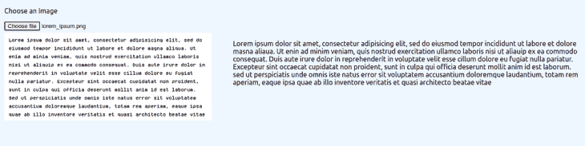

# 使用 React 和 Tesseract.js OCR 构建一个图像到文本的转换应用程序

> 原文：<https://blog.logrocket.com/build-image-text-conversion-app-react-tesseractjs/>

[Tesseract.js](https://tesseract.projectnaptha.com/) 是一个开源的文本识别引擎，允许我们从图像中提取文本。这项技术的另一个词是光学字符识别，或 OCR。

ocr 的工作原理是扫描图像，并将其文本提取为机器可读文件。例如，假设你有一封想要复制的信件的图像。在这种情况下，Tesseract 可以允许您的计算机通过从您的图像中提取文本来复制和粘贴信件的内容。

Tesseract 的一个很大的好处是，它支持 100 多种语言，以防您需要提取英语以外的语言的文本。

在本文中，我们将了解 Tesseract，我们可以用它做什么，并通过使用 React 创建一个示例图像到文本转换应用程序来演示它是如何工作的。

## 用 React 和 Tesseract.js 构建一个图像到文本的转换应用程序

我们要做的 app 很简单；我们将有一个“选择图像”选项，然后在选择图像后，我们将做一些处理，最后显示扫描的文本。简单吧？

我们完成的应用程序将如下所示:



在顶部，我们有一个“选择图像”按钮。下面将显示上传的图像，右边是我们转换的文本。

要制作这个应用，我们必须首先创建一个 React 应用。为此，我们将使用 Create React App 命令行工具。

打开您的终端，写下以下内容:

```
npx create-react-app <your_app_name>

```

创建应用程序后，我们需要安装宇宙魔方。

在项目目录中打开您的终端，并安装以下内容:

```
yarn add tesseract.js
or
npm install -S tesseract.js 

```

现在我们已经安装了宇宙魔方依赖项。

## 构建应用程序

打开`App.js`文件，输入以下内容创建 UI:

```
import { useEffect, useState } from "react";
import { createWorker } from "tesseract.js";
import "./App.css";
function App() {
  const [ocr, setOcr] = useState("");
  const [imageData, setImageData] = useState(null);
  const worker = createWorker({
    logger: (m) => {
      console.log(m);
    },
  });
  const convertImageToText = async () => {
    if (!imageData) return;
    await worker.load();
    await worker.loadLanguage("eng");
    await worker.initialize("eng");
    const {
      data: { text },
    } = await worker.recognize(imageData);
    setOcr(text);
  };

  useEffect(() => {
    convertImageToText();
  }, [imageData]);

  function handleImageChange(e) {
    const file = e.target.files[0];
    if(!file)return;
    const reader = new FileReader();
    reader.onloadend = () => {
      const imageDataUri = reader.result;
      console.log({ imageDataUri });
      setImageData(imageDataUri);
    };
    reader.readAsDataURL(file);
  }
  return (
    <div className="App">
      <div>
        <p>Choose an Image</p>
        <input
          type="file"
          name=""
          id=""
          onChange={handleImageChange}
          accept="image/*"
        />
      </div>
      <div className="display-flex">
        
        <p>{ocr}</p>
      </div>
    </div>
  );
}
export default App;

```

在上面的代码中，我们有两种状态；第一个用于我们将提取的 OCR 文本，第二个用于将在 UI 中显示的所选图像。

之后，我们有工人，这有助于宇宙魔方在后台运行；在`createWorker`函数中，我们有一个记录器选项。

接下来，我们创建了`convertImageToText`函数，这是我们的主函数。它会做它所说的事情:将我们的图像转换成文本。

## 将图像转换为文本

首先，我们使用`worker.load()`函数加载 Tesseract 核心脚本。之后，我们从高速缓存中加载语言训练模型。否则，它将从 Tesseract 服务器下载训练好的模型，缓存并使用它。

加载语言模型后，我们使用`worker.initialize()`初始化 Tesseract，然后传入英语的`eng`，这是我们的首选语言。

接下来，我们需要调用`recognize`函数并传入图片 URL。它将文本作为数据返回；收到数据后，我们使用`setOcr`函数将它设置为我们的`ocr`状态，这样我们就可以将它显示给用户。

我们还有一个`handleImageChange`功能，当我们选择另一个图像时就会触发这个功能。在这个函数中，我们读取文件并将它的数据存储在`imageData`状态。

## 构建用户界面

最后，让我们为 UI 写一些 JSX。

在 UI 中，我们有一个带有`type="file"`的输入标签和一个`onChange`属性，它由我们之前编写的`handleImageChange`函数来处理。

在底部，我们使用`imageData`显示图像，使用 OCR 状态显示文本。

* * *

### 更多来自 LogRocket 的精彩文章:

* * *

现在，如果你运行你的应用程序，它将转换文本并显示在用户界面上。但是，您会注意到显示该文本需要一些时间。

为了制作更好的 UX，我们可以在用户等待加载转换时添加一个进度条:

```
function App() {
....
....
const [progress, setProgress] = useState(0);

  const worker = createWorker({
    logger: (m) => {
      console.log(m);
      setProgress(parseInt(m.progress * 100));
    },
  }); 

.....
.....

return (
    <div className="App">
      <div>
        <p>Choose an Image</p>
        <input
          type="file"
          name=""
          id=""
          onChange={handleImageChange}
          accept="image/*"
        />
      </div>
      {progress < 100 && progress > 0 && <div>
        <div className="progress-label">Progress ({progress}%)</div>
        <div className="progress-bar">
          <div className="progress" style={{width: `${progress}%`}} ></div>
        </div>
      </div>}
      <div className="display-flex">
        
        <p>{ocr}</p>
      </div>
    </div>
  );

```

这样，我们可以显示一个百分比进度条，让用户知道将图像转换成文本需要多长时间。

这将是我们 UI 的最终 CSS:

```
body {
    background-color: aliceblue;
}
.App {
    padding: 10px;
}
input {
    margin-bottom: 5px;
}
img {
    width: 30vw;
    height: auto;
    margin-right: 50px;
}
p {
    width: 50vw;
}
.display-flex {
    display: flex;
}
.progress-label {
    margin-bottom: 5px;
}
.progress-bar {
    background-color: rgb(232, 232, 232);
    border-radius: 10px;
    overflow: hidden;
    margin-bottom: 10px;
    max-width: 50vw;
}
.progress {
    background-color: rgb(0, 255, 170);
    width: 0%;
    height: 10px;
}

```

这里没有什么花哨的，只是简单的 CSS 规则，使一个更好的用户界面。在这里，我们改变了页面的背景颜色，并制作了一个进度条来指示我们将图像转换为文本时的进度。

## 结论

恭喜各位，现在你知道如何利用宇宙魔方的力量来做一些令人敬畏和兴奋的项目了。我希望这篇文章已经教会你更多关于 Tesseract 和这个工具的许多可能性。

用这项技术构建的其他一些有趣的东西是一个数学求解应用程序，用户可以上传一个数学方程的图像，它将被转换为文本并求解。或者，你可以开发一个应用程序，从图像中检测链接，并使它们可以点击。

感谢您的阅读，祝您有美好的一天。🙂

## [LogRocket](https://lp.logrocket.com/blg/react-signup-general) :全面了解您的生产 React 应用

调试 React 应用程序可能很困难，尤其是当用户遇到难以重现的问题时。如果您对监视和跟踪 Redux 状态、自动显示 JavaScript 错误以及跟踪缓慢的网络请求和组件加载时间感兴趣，

[try LogRocket](https://lp.logrocket.com/blg/react-signup-general)

.

[ ](https://lp.logrocket.com/blg/react-signup-general) [](https://lp.logrocket.com/blg/react-signup-general) 

LogRocket 结合了会话回放、产品分析和错误跟踪，使软件团队能够创建理想的 web 和移动产品体验。这对你来说意味着什么？

LogRocket 不是猜测错误发生的原因，也不是要求用户提供截图和日志转储，而是让您回放问题，就像它们发生在您自己的浏览器中一样，以快速了解哪里出错了。

不再有嘈杂的警报。智能错误跟踪允许您对问题进行分类，然后从中学习。获得有影响的用户问题的通知，而不是误报。警报越少，有用的信号越多。

LogRocket Redux 中间件包为您的用户会话增加了一层额外的可见性。LogRocket 记录 Redux 存储中的所有操作和状态。

现代化您调试 React 应用的方式— [开始免费监控](https://lp.logrocket.com/blg/react-signup-general)。