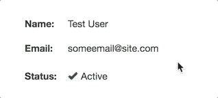
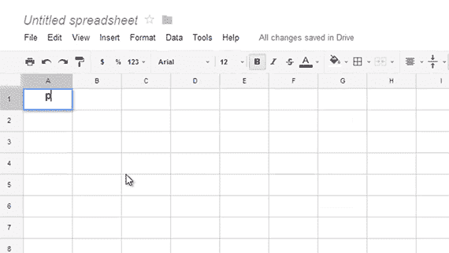

# 如何在 React - LogRocket 博客中构建一个内嵌的可编辑 UI

> 原文：<https://blog.logrocket.com/build-inline-editable-ui-react/>

***编者按**:这篇文章最后一次更新是在 2022 年 12 月 15 日，以包括关于 TanStack Table v8 和 Ag Grid 的信息，以及反映对 react-easy-edit 和* *react-editext 库的更新。*

随着 React 客户端 UI 库变得越来越强大，用户界面变得越来越复杂。如今，我们可以通过试验 React 内联可编辑 UI 组件，如可编辑的表格、列表和文本字段，来创建更加令人兴奋的用户体验。

下面是一个基本的 React 内联可编辑用户界面的示例:



在本教程中，我们将使用简化版的 [Asana Create a task](https://developers.asana.com/docs/get-a-task) 函数在 React 中构建基本的内联可编辑 UI 组件。我们的可编辑 UI 将只有一个任务名称和一个描述字段。

我们将讨论以下内容:

请随意查看我们将在本演练中构建的 React 可编辑 UI 的[演示。我们开始吧！](https://logrocket-inline-edit.netlify.app)

首先，让我们回顾一下一些最著名的产品，它们使用了带有清晰 UX 的内嵌可编辑用户界面。

*   Asana :最好的定制用户界面之一，带有内嵌的可编辑表格和表单
*   [吉拉](https://www.atlassian.com/software/jira):为字段提供定制的内嵌编辑功能。这里有一个来自吉拉设计系统的[设计例子](https://atlassian.design/components/inline-edit/examples)
*   [Trello](https://trello.com/en) :你可以通过简单的点击来编辑一张 Trello 卡
*   [Airtable](https://www.airtable.com/lp/campaign/brand?&utm_source=google&utm_medium=paidsearch&utm_extra5=kwd-325289323194&utm_extra2=936407691&utm_extra10=47735600558&creative=464489871110&utm_extra8=c&cx=us&utm_campaign=demand_br_brand_creator&utm_content=text&utm_term=airtable&ds_e_utm_extra8=c&gclid=CjwKCAiAzKqdBhAnEiwAePEjkhmaIPxqcobAhfsjIHHiuNaZTnrX45U7-XD5gf8u3AaCHz8HE7gDPhoCGjMQAvD_BwE&gclsrc=aw.ds) 和[idea](https://www.notion.so/product?utm_source=google&utm_campaign=2075789710&utm_medium=80211061601&utm_content=500427479647&utm_term=notion&targetid=kwd-312974742&gclid=CjwKCAiAzKqdBhAnEiwAePEjkp-cdk6_7fUhmQeYk7k9U2J8AY9ZG3Ng95tVEKEghDkd1EA0IJW7QxoCrcgQAvD_BwE)是使用内嵌可编辑 UI 元素的现代应用
*   谷歌的 [工作表](https://www.google.com/sheets/about/):为网络提供一个内嵌的可编辑智能表格用户界面



## React 内联可编辑 UI 组件库

在开始我们的内联可编辑组件的自定义实现之前，让我们考虑一些现有的 React 组件库，您可以使用它们来实现各种内联可编辑 UI 元素。

### 反应-简单-编辑

[react-easy-edit](https://github.com/giorgosart/react-easy-edit) 库允许对 HTML 5 输入组件进行内联编辑，这意味着您可以在 react-easy-edit 库的基础上定制样式和功能。下面是一个使用`textbox`组件的简单例子:

```
import React, { Component } from 'react';
import EasyEdit from 'react-easy-edit';

function App() {

  const save = (value) => {alert(value)}
  const cancel = () => {alert("Cancelled")}

  return (
    <EasyEdit
      type="text"
      onSave={save}
      onCancel={cancel}
      saveButtonLabel="Save Me"
      cancelButtonLabel="Cancel Me"
      attributes={{ name: "awesome-input", id: 1}}
      instructions="Star this repo!"
    />
  );
}

```

您可以在 [Stackblitz](https://stackblitz.com/edit/react-pun7mm?file=src/App.js) 上查看更多示例。

### 亚特兰蒂斯人

建造吉拉的团队 Atlassian ，有一个带有[内嵌编辑](https://www.npmjs.com/package/@atlaskit/inline-edit)功能的设计系统。虽然它依赖于 Atlassian 设计系统，但是如果您的应用程序需要可靠的特性，您可以考虑使用它。

### 反应-编辑文本

[react-editext](https://github.com/alioguzhan/react-editext#readme) 是一个内嵌编辑库，它将`textarea`元素转换成可编辑的内容。下面是 react-editext 的一个简单示例:

```
import React, { Component } from 'react'
2import EdiText from 'react-editext'
3
4export default class App extends Component {
5  onSave = val => {
6    console.log('Edited Value -> ', val)
7  }
8
9  render () {
10    return (
11      <EdiText
12        type='text'
13        value='What is real? How do you define real?'
14        onSave={this.onSave}
15      />
16    )
17  }
18}

```

react-editext 还允许你用样式化组件来[样式化`EdiText`。为了更好地理解它，你可以参考 Stackblitz](https://blog.logrocket.com/benefits-using-styled-components-react/) 的[例子。](https://stackblitz.com/edit/react-aawg51?file=src%2FApp.js)

### 反应-内容可编辑

[react-contenteditable](https://github.com/lovasoa/react-contenteditable) 可以说是内联可编辑 UI 最著名的包。react-contenteditable 与其他组件库的主要区别在于，它允许您内联编辑 HTML，而不仅仅是文本内容。

您可以使用 react-contenteditable 来编辑 UI 中的标记和降价。您还可以管理可编辑元素的高度，以定制输入或`textarea`元素的外观。请随意查看 Stackblitz 上的[示例。](https://stackblitz.com/edit/react-2aq9zw?file=src%2FApp.js)

### 反应表

React Table 是最流行的 UI 库之一，它允许您使用内嵌可编辑特性构建表格和数据网格。您可以通过定制 React 表库组件来创建一个类似于 Google Sheets 的 UI。

2020 年 3 月，React Table 创建者 Tanner Linsley 发布了 React Table，他将其描述为“一年多来将整个库重构为一个只支持钩子的 UI/样式/标记不可知的表构建实用程序的工作的高潮。”2022 年 7 月，[transstack Table V8](https://twitter.com/tannerlinsley/status/1542925072502968320?ref_src=twsrc%5Etfw%7Ctwcamp%5Etweetembed%7Ctwterm%5E1542925072502968320%7Ctwgr%5Eb9309e1e718ad882624e44e4731403429a7e01bb%7Ctwcon%5Es1_&ref_url=https%3A%2F%2Fwww.redditmedia.com%2Fmediaembed%2Fvptwvr%3Fresponsive%3Dtrueis_nightmode%3Dfalse)发布，[包含了对 TypeScript](https://github.com/TanStack/table) 的完全重写。然而，在撰写本文时，该迁移指南还不可用。

为了更好地了解最近稳定的 React Table 版本中的新内容，请查看我们关于使用 React Table v7 构建和整理表格的综合指南[。或者，继续阅读，了解如何使用 React Table](https://blog.logrocket.com/building-styling-tables-react-table-v7/) 呈现您自己的 [React table 组件。您还可以查看 React Table 厨房水槽](https://blog.logrocket.com/complete-guide-building-smart-data-table-react/#reacttableexample)来了解这个可编辑的 UI 如何在表格布局中工作。

### Ag 网格

Ag Grid 是另一个流行的库，用于构建具有内嵌可编辑功能的数据网格。像 [`ag-grid-react`](https://www.npmjs.com/package/ag-grid-react) 和 React Table 这样的库可以帮助我们构建数据网格，将大量数据可视化在一个表结构中。内嵌编辑是其中包含的功能之一。

下面是`ag-grid-react`的一个基本实现:

```
//javascript
import { AgGridReact } from "ag-grid-react";

return( <AgGridReact
   rowData={mockTransactionData()}
   columnDefs={mockTransactionDataColumns()}
 />);

```

您可以在 [Stackblitz](https://stackblitz.com/edit/react-ts-xu5kqm?file=App.tsx) 上查看完整示例。

## 可编辑用户界面是如何工作的？

现在我们已经熟悉了一些有用的组件库，让我们来探索一下可编辑 UI 是如何工作的。

首先，一个可编辑的 UI 显示一个标签。悬停时，它会显示边框，使用户界面看起来内嵌和可编辑。单击时，它会将简单的标签转换成自定义的输入元素。一些值得注意的输入元素是输入字段、`textarea`、`select`组件、日期选择器等。

通过点击`Enter`或`Escape`，我们将回到初始状态并显示标签。如果您点击`Tab`，它将再次切换到一个输入元素，并使该组件可使用键盘。

在本教程中，我们将构建一个没有`Tab`功能的简单版本。您可以很容易地添加`Tab`功能，但是我将把它留给您。请随意为我的回购创建一个[拉动请求。](https://github.com/learnwithparam/logrocket-inline-edit-ui)

## 为可编辑 UI 构建一个简单的 React 组件

首先，我们将使用 Create React App 创建一个简单的 React 应用程序。我正在使用 Tailwind CSS 进行造型。有关更多信息，请查看我们关于在 React 中使用 Tailwind CSS 来配置 Create React App 的文章。

现在，让我们用下面的代码创建`Editable` React 组件:

```
// Editable.js
import React, { useState } from "react";

// Component accept text, placeholder values and also pass what type of Input - input, textarea so that we can use it for styling accordingly
const Editable = ({
  text,
  type,
  placeholder,
  children,
  ...props
}) => {
  // Manage the state whether to show the label or the input box. By default, label will be shown.
// Exercise: It can be made dynamic by accepting initial state as props outside the component 
  const [isEditing, setEditing] = useState(false);

// Event handler while pressing any key while editing
  const handleKeyDown = (event, type) => {
    // Handle when key is pressed
  };

/*
- It will display a label is `isEditing` is false
- It will display the children (input or textarea) if `isEditing` is true
- when input `onBlur`, we will set the default non edit mode
Note: For simplicity purpose, I removed all the classnames, you can check the repo for CSS styles
*/
  return (
    <section {...props}>
      {isEditing ? (
        <div
          onBlur={() => setEditing(false)}
          onKeyDown={e => handleKeyDown(e, type)}
        >
          {children}
        </div>
      ) : (
        <div
          onClick={() => setEditing(true)}
        >
          <span>
            {text || placeholder || "Editable content"}
          </span>
        </div>
      )}
    </section>
  );
};

export default Editable;

```

组件非常简单。如果`isEditing`状态为`true`，则显示子节点。这里，我们传递了`input`或`textarea`元素。输入状态将在该组件之外进行管理。

如果`isEditing`状态是`false`，我们显示简单标签`text`或`placeholder`，这取决于文本值是否为空。

让我们看看一个简单的输入可编辑组件是什么样子的:

```
// App.js - Input editable UI

import React, { useState } from "react";
import Editable from "./Editable";

function App() {
  // State for the input
  const [task, setTask] = useState("");

  /*
    Enclose the input element as the children to the Editable component to make it as inline editable.
  */
  return (
    <Editable
      text={task}
      placeholder="Write a task name"
      type="input"
    >
      <input
        type="text"
        name="task"
        placeholder="Write a task name"
        value={task}
        onChange={e => setTask(e.target.value)}
      />
    </Editable>
  );
}

export default App;

```

在上面的代码中，我们将`input`包含在`Editable`组件中。您可以包含任何自定义表单组件，使其成为可编辑的 UI。

这个例子非常简单。如果您想为可编辑 UI 创建一个更复杂的示例，您可以创建更高阶的组件或自定义挂钩来管理可编辑组件之外的所有状态。

让我们看看可编辑组件如何为`textarea`工作:

```
<Editable
  text={description}
  placeholder="Description for the task"
  type="textarea"
>
  <textarea
    name="description"
    placeholder="Description for the task"
    rows="5"
    value={description}
    onChange={e => setDescription(e.target.value)}
  />
</Editable&gt

```

就这么简单。我们只是用一个`textarea`交换了输入元素。只要我们根据我们传递给`Editable`组件的类型提供适当的 CSS，它就能工作。

然而，我们会遇到一些问题:

*   当我们点击标签时，它不会自动聚焦在输入元素上
*   使用`Tab`键可以导航一个简单的表单。然而，如果不手动实现该功能，就无法导航内联可编辑 UI

### 解决焦点问题

为了解决焦点问题，我们需要使用对输入元素的引用，并在设置编辑状态时聚焦它:

```
// App.js
import React, { useRef, useState } from "react";
import Editable from "./Editable";

function App() {
  /* 
    1\. create a reference using use reference and add the ref={inputRef} to input element
    2\. pass this reference to the Editable component, use different name than ref, I used `childRef`. Its basically a normal prop carrying the input element reference.
  */
  const inputRef = useRef();
  const [task, setTask] = useState("");

  return (
    <Editable
      text={task}
      placeholder="Write a task name"
      childRef={inputRef}
      type="input"
    >
      <input
        ref={inputRef}
        type="text"
        name="task"
        placeholder="Write a task name"
        value={task}
        onChange={e => setTask(e.target.value)}
      />
    </Editable>
  );
}
export default App;

```

接下来，我们将输入元素引用传递给`Editable`组件，然后当`isEditing`状态为`true`时聚焦:

```
// Editable.js
import React, { useState, useEffect } from "react";
import "./Editable.css";

const Editable = ({ childRef, ... }) => {
  const [isEditing, setEditing] = useState(false);

  /* 
    using use effect, when isEditing state is changing, check whether it is set to true, if true, then focus on the reference element
  */ 
  useEffect(() => {
    if (childRef && childRef.current && isEditing === true) {
      childRef.current.focus();
    }
  }, [isEditing, childRef]);

  const handleKeyDown = (event, type) => {
    ...
  };

  return (
    ...
};

export default Editable;

```

### 按键事件的小故障

在处理 keydown 事件时，需要注意一些事情。输入元件的按键，包括`Enter`、`Escape`、`Tab`，会将`isEditing`状态设置为`false`。

对于`textarea`元素，`Enter`键必须在`textarea`中添加一个新行，所以我们需要单独处理这个用例:

```
const handleKeyDown = (event, type) => {
    const { key } = event;
    const keys = ["Escape", "Tab"];
    const enterKey = "Enter";
    const allKeys = [...keys, enterKey]; // All keys array

  /* 
    - For textarea, check only Escape and Tab key and set the state to false
    - For everything else, all three keys will set the state to false
  */
    if (
      (type === "textarea" && keys.indexOf(key) > -1) ||
      (type !== "textarea" && allKeys.indexOf(key) > -1)
    ) {
      setEditing(false);
    }
}:

```

## 使用`Tab`键导航的表单的可访问性

默认情况下，输入和`textarea`是隐藏的。因此，我们不能通过点击`Tab`键来浏览表单字段。

为了实现键盘支持，我们需要监控组件或整个页面上的`Tab`键事件，并手动为每个元素设置状态。然后，我们可以在下一次按键时导航到下一个表单元素。

我们没有在示例代码中实现这一点，但是值得一试，以确保您可以在 React 中处理页面上的按键事件。

## 何时使用 React 内联可编辑用户界面

你不需要一个内嵌的可编辑用户界面来满足基本的表单需求。然而，对于复杂的 React 应用程序来说，最好是在一个地方构建视图和编辑，因为在这个地方有许多带有编辑选项的内容。否则，您将不得不维护两个不同的 ui。

## React 中内联可编辑 UI 的限制

在内联可编辑 UI 中，你可能遇到的最大挑战是显示错误。在考虑 UX 时，最好考虑到这一点。

您可能也很难获得支持鼠标事件所必需的可访问性。触摸事件也可能是一个问题。

最后，当表单元素被隐藏时，支持移动设备可能会很困难。如果 UI 必须支持移动布局，这将特别棘手，因为没有悬停向用户显示该字段是否可以在触摸屏上内联编辑。

## 结论

这是一个在 React 中创建内联可编辑组件的简单示例和概述。尝试使用现有组件，但是如果没有符合您需要的组件，您可以创建自定义组件。你可以在这里查看演示[，在这里](https://logrocket-inline-edit.netlify.com/)查看代码库[。编码快乐！](https://github.com/learnwithparam/logrocket-inline-edit-ui)

## [LogRocket](https://lp.logrocket.com/blg/react-signup-general) :全面了解您的生产 React 应用

调试 React 应用程序可能很困难，尤其是当用户遇到难以重现的问题时。如果您对监视和跟踪 Redux 状态、自动显示 JavaScript 错误以及跟踪缓慢的网络请求和组件加载时间感兴趣，

[try LogRocket](https://lp.logrocket.com/blg/react-signup-general)

.

[ ](https://lp.logrocket.com/blg/react-signup-general) [](https://lp.logrocket.com/blg/react-signup-general) 

LogRocket 结合了会话回放、产品分析和错误跟踪，使软件团队能够创建理想的 web 和移动产品体验。这对你来说意味着什么？

LogRocket 不是猜测错误发生的原因，也不是要求用户提供截图和日志转储，而是让您回放问题，就像它们发生在您自己的浏览器中一样，以快速了解哪里出错了。

不再有嘈杂的警报。智能错误跟踪允许您对问题进行分类，然后从中学习。获得有影响的用户问题的通知，而不是误报。警报越少，有用的信号越多。

LogRocket Redux 中间件包为您的用户会话增加了一层额外的可见性。LogRocket 记录 Redux 存储中的所有操作和状态。

现代化您调试 React 应用的方式— [开始免费监控](https://lp.logrocket.com/blg/react-signup-general)。