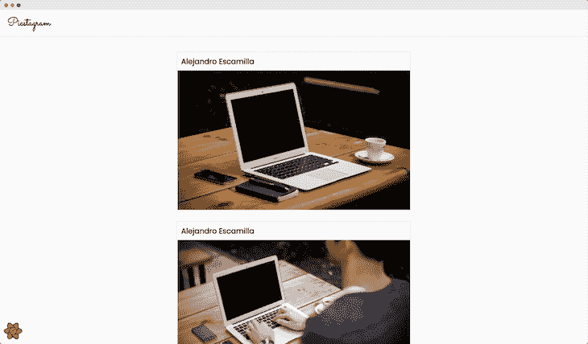

# 用 React Query 构建一个类似 Instagram 的无限滚动提要

> 原文：<https://blog.logrocket.com/build-instagram-infinite-scrolling-feed-react-query/>

无限滚动是一种流行的交互模式，允许用户在向下滚动页面的同时不断加载内容。这意味着应用程序获取一小块数据，并随着用户滚动继续获取更多数据。

这种模式最常见的一个用例出现在 Instagram 和 Twitter 等大型社交媒体网站上。与在初始加载期间获取网站的全部数据相比，这提供了重大的性能改进。

在本文中，我们将学习如何使用 React Query 的`useInifiniteQuery()`钩子在 React 应用程序中构建一个类似 Instagram 的无限滚动提要。

## React 查询先决条件和演示

本文假设您对 React 组件、常见的挂钩(如 [`useState()`](https://blog.logrocket.com/noobs-guide-to-usestate/) 和`[useEffect()](https://blog.logrocket.com/guide-to-react-useeffect-hook/)`)有基本的了解，并且熟悉向 React 项目添加 npm 包。

如果你是 React Query 的新手，你可以看看 React Query 的新特性来了解更多关于它的信息和它的好处。然而，在本文中我们将只讨论`useInfiniteQuery()`钩子。

要完整预览这个项目，请访问这个 [CodeSandbox 链接，查看源代码和演示](https://codesandbox.io/s/completed-demo-r9fkj)。


## 为什么使用 React Query？

React 是一个非个人化的 JavaScript 库，用于构建交互式和可伸缩的 web 应用程序。然而，这种非个人化的特性也是一把双刃剑，因为它没有内置的数据获取解决方案。

虽然您可以实现自己的数据获取机制，但 React Query 以挂钩的形式提供了一种更简单、更有效的方式来管理异步服务器状态。

这些挂钩还带来了缓存响应数据、对多个请求进行重复数据删除以及更多性能优化的额外好处。

这个库中一些最常用的钩子是`useQuery()`钩子，它从 API 获取数据，以及`useMutation()`钩子，它创建、更新和删除服务器数据。

`useInfiniteQuery()`钩子只是`useQuery()`钩子的一个修改版本，提供无限滚动功能。

## 理解`useInfiniteQuery()`挂钩

在深入项目之前，让我们花点时间了解一下`useInfiniteQuery()`钩子是如何工作的，以及如何使用它。这个钩子带有两个强制参数:查询键和查询函数，以及一个可选的`options`对象。

这个钩子返回一些值和函数，这些值和函数可以检索获取的数据，检查查询的状态(比如`error`、`loading`、`fetching`或`idle`，并检查是否有更多的页面或其他信息要发送给无限滚动条组件。

关于`[useInfiniteQuery()](https://react-query.tanstack.com/reference/useInfiniteQuery)` [钩子的详细解释，参见官方 API 参考文档](https://react-query.tanstack.com/reference/useInfiniteQuery)。

现在，让我们在接下来的几节中探索这个钩子的实际用法。

## 构建`useInfiniteQuery()`项目

为了与这个项目一起编码，您可以访问这个 [CodeSandbox 链接来获得预安装了所有依赖项的 starter 文件](https://codesandbox.io/s/starter-files-6b55e)，或者通过运行这个命令使用`create-react-app`工具在您的本地机器上创建一个新的 React 应用程序:

```
npx create-react-app infinite-scroll

```

如果您选择在本地计算机上创建 React 应用程序，请使用下面给出的命令安装 React Query 和 infinite scroller 组件:

```
npm install react-query react-infinite-scroller
#or
yarn add react-query react-infinite-scroller

```

虽然 React Query 可以帮助您获取数据，但是否提供 infinite scroller 组件的 UI 实现取决于您。这就是我们使用`react-infinite-scroller`库的原因。

### 配置反应查询

在我们开始使用 React Query 的钩子之前，我们必须从`react-query`导入`QueryClient`和`QueryClientProvider`,并在`index.js`文件中用`<App />`组件包装它。

这确保了 React 应用程序中的所有组件都可以访问钩子和缓存:

```
#index.js
import { QueryClient, QueryClientProvider } from "react-query";
import { ReactQueryDevtools } from "react-query/devtools";
import ReactDOM from "react-dom";
import App from "./App";

const queryClient = new QueryClient();

ReactDOM.render(
  <QueryClientProvider client={queryClient}>
    <App />
    <ReactQueryDevTools />
  </QueryClientProvider>,
 document.getElementById("root")
);

```

这段代码呈现了我们的图片最终将驻留的登录页面:


在上面的例子中，我们还导入了 React Query Devtools，这是一个方便的工具，带有内置的`react-query`来监控网络请求和其他查询细节。

这样，我们就完成了将 React Query 集成到 React 项目中。就这么简单。

### 使用 Lorem Picsum API

为了显示无限滚动提要的图像，我们将使用 [Lorem Picsum API](https://picsum.photos/) 以 JSON 格式获取一组图像及其信息。更具体地说，我们将使用以下 API 端点:

```
https://picsum.photos/v2/list?page=1&limit=10

```

使用`limit`查询参数，我们可以将每个 API 调用获取的图像数量设置为`10`。这最初检索 10 个图像，并且每当用户接近到达提要的末尾时继续获取 10 个以上的图像。

通过增加查询参数`page`,我们可以获取下一组图像。最初，`page`查询参数被设置为`1`以从第一页开始。

来自上述端点的响应如下所示:

```
[
  {
    "id": "0",
    "author": "Alejandro Escamilla",
    "width": 5616,
    "height": 3744,
    "url": "https://unsplash.com/photos/yC-Yzbqy7PY",
    "download_url": "https://picsum.photos/id/0/5616/3744"
  },
  {
    ...
  },
  {
    ...
  }
]

```

同样值得注意的是，这个 API 端点总共提供了 1000 个图像。因此，使用每个 API 调用 10 个图像的限制，我们可以预期有 100 页图像。

* * *

### 更多来自 LogRocket 的精彩文章:

* * *

### 构建和设计一个组件

让我们制作一个简单的 React 组件来显示图像及其作者。首先，在`src`目录中创建一个名为`components`的文件夹。在这个`components`文件夹中，创建一个名为`PostCard.jsx`的新文件，并粘贴以下代码:

```
// components/PostCard.jsx
const PostCard = ({ post }) => {
  return (
    <div className="post-card">
      <h4>{post.author}</h4>
      
    </div>
  );
};
export default PostCard;

```

该组件采用一个名为`post`的道具，并使用`author`和`download_url`属性来显示作者的姓名和图像。要设计这个组件的样式，将下面给出的 CSS 附加到`App.css`文件中:

```
// App.css
.post-card {
  display: flex;
  flex-direction: column;
  border: 1px solid #dbdbdb;
  margin-bottom: 1.5rem;
}
.post-card h4 {
  background: #fafafa;
  padding: 0.5rem;
}
.post-card img {
  height: 300px;
  width: 500px;
  object-fit: cover;
}

```

`PostCard`组件现在可以在`App.js`文件中使用了。现在让我们继续从 API 获取数据。

### 实现无限滚动

要开始在我们的应用程序中实现无限滚动，让我们创建一个名为`fetchPosts()`的函数，向端点发出一个`GET`请求，并根据页码和限制检索一组帖子:

```
const fetchPosts = async ({ pageParam = 1 }) => {
  const response = await fetch(
    `https://picsum.photos/v2/list?page=${pageParam}&limit=10`
  );
  const results = await response.json();
  return { results, nextPage: pageParam + 1, totalPages: 100 };
};

```

该函数还接受 React Query 在调用该函数时自动传递的`pageParam`参数。在这种情况下，`pageParam`是页码。

由于我们使用的 API 没有在响应中提供总页数和下一页的页码，所以让我们返回一个带有这些属性的自定义对象，因为我们知道下一页的页码将是当前页码加 1，总页数将是 100。

现在，从`react-query`导入`useInfiniteQuery()`钩子，并以这种方式使用它:

```
const { data, isLoading, isError, hasNextPage, fetchNextPage } =
  useInfiniteQuery("posts", fetchPosts, {
    getNextPageParam: (lastPage, pages) => {
      if (lastPage.nextPage < lastPage.totalPages) return lastPage.nextPage;
      return undefined;
    },
  });

```

将`"posts"`作为查询键，将`fetchPosts`函数作为查询函数。作为第三个参数，传递一个包含`getNextPageParam`函数的对象，如上所示。

这个函数获取下一页的页码。如果我们已经在最后一页，我们可以返回`undefined`，这样 React Query 就不会试图获取更多数据。

最后，我们可以析构出由页面、`isLoading`布尔、`isError`布尔、`hasNext`布尔和`fetchNextPage`函数组成的`data`数组来相应地呈现 UI。

### 导入`InfiniteScroll`组件

现在，从`react-infinite-scroller`导入`InfiniteScroll`组件。映射通过`data.pages`数组的每一页里面的所有帖子来渲染`<InfiniteScroll>`里面的`<PostCard />`组件:

```
<InfiniteScroll hasMore={hasNextPage} loadMore={fetchNextPage}>
  {data.pages.map((page) =>
    page.results.map((post) => <PostCard key={post.id} post={post} />)
  )}
</InfiniteScroll>;

```

`<InfiniteScroll>`组件有两个道具:`hasMore`，一个布尔值用来检查是否有更多的页面要获取，还有一个`loadMore`函数用来在用户接近页面末尾时获取更多的文章。

从`useInfiniteQuery()`的返回属性中构造的`hasNextPage`布尔可以用作`hasMore`属性的值。

类似地，return 属性还包含一个`fetchNextPage`函数，该函数可以获取下一页的结果，并用作`loadMore`属性的值。

最后，在将所有代码片段和一些条件渲染拼凑在一起后，我们的`App.js`文件看起来会像这样:

```
// App.js
import InfiniteScroll from "react-infinite-scroller";
import { useInfiniteQuery } from "react-query";
import Navbar from "./components/Navbar";
import PostCard from "./components/PostCard";
import "./styles.css";
export default function App() {
  const fetchPosts = async ({ pageParam = 1 }) => {
    const response = await fetch(
      `https://picsum.photos/v2/list?page=${pageParam}&limit=10`
    );
    const results = await response.json();
    return { results, nextPage: pageParam + 1, totalPages: 100 };
  };
  const {
    data,
    isLoading,
    isError,
    hasNextPage,
    fetchNextPage
  } = useInfiniteQuery("posts", fetchPosts, {
    getNextPageParam: (lastPage, pages) => {
      if (lastPage.nextPage < lastPage.totalPages) return lastPage.nextPage;
      return undefined;
    }
  });
  return (
    <div className="App">
      <Navbar />
      <main>
        {isLoading ? (
          <p>Loading...</p>
        ) : isError ? (
          <p>There was an error</p>
        ) : (
          <InfiniteScroll hasMore={hasNextPage} loadMore={fetchNextPage}>
            {data.pages.map((page) =>
              page.results.map((post) => <PostCard key={post.id} post={post} />)
            )}
          </InfiniteScroll>
        )}
      </main>
    </div>
  );
}

```

因此，最终呈现出类似 instagram 的无限滚动提要:



## 结论

至此，您已经使用 React Query、Lorem Picsum API 和 React `InfiniteScroll`组件成功构建了自己的无限滚动图像提要。您可以使用这个概念为您的项目构建任何类型的无限滚动提要。

## 使用 LogRocket 消除传统反应错误报告的噪音

[LogRocket](https://lp.logrocket.com/blg/react-signup-issue-free)

是一款 React analytics 解决方案，可保护您免受数百个误报错误警报的影响，只针对少数真正重要的项目。LogRocket 告诉您 React 应用程序中实际影响用户的最具影响力的 bug 和 UX 问题。

[ ](https://lp.logrocket.com/blg/react-signup-general) [  ](https://lp.logrocket.com/blg/react-signup-general) [LogRocket](https://lp.logrocket.com/blg/react-signup-issue-free)

自动聚合客户端错误、反应错误边界、还原状态、缓慢的组件加载时间、JS 异常、前端性能指标和用户交互。然后，LogRocket 使用机器学习来通知您影响大多数用户的最具影响力的问题，并提供您修复它所需的上下文。

关注重要的 React bug—[今天就试试 LogRocket】。](https://lp.logrocket.com/blg/react-signup-issue-free)