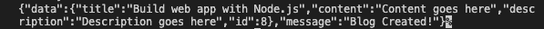

# 使用 Tigris 构建 Jamstack 应用程序

> 原文：<https://blog.logrocket.com/build-jamstack-app-tigris/>

当开发人员必须设置和配置多个工具时，构建 web 应用程序可能特别具有挑战性，这些工具可能包括数据库、服务器、构建工具和存储服务器。设置所有这些可能需要几个小时的开发时间，延长了产品上线的时间。

Jamstack 的创建是为了减轻开发人员的负担，让他们在开发灵活、可伸缩、高性能和可维护的 web 应用程序时，能够专注于代码或业务逻辑。在本教程中，我们将学习如何用 Tigris 构建 Jamstack 应用程序。

要阅读本文，您需要在您的机器上安装 Docker 和 Node.js *≥* v14。我们开始吧！

## 什么是底格里斯

Tigris 是一款开源、现代、可扩展的后端软件，用于开发实时网站和应用。凭借其零操作方法，Tigris 将开发人员解放出来，让他们专注于自己的应用程序。Tigris 是一个数据平台，允许开发人员构建实时应用程序，而不必处理所有繁琐的基础设施管理，从而允许更多以代码为中心的开发和更少的数据基础设施。

重要的是要记住，在撰写本文时，Tigris 还处于测试阶段。

## 为什么要用 Tigris？

让我们考虑一下您可能选择 Tigris 作为 web 应用程序的一些原因。首先，它处理所有的部署、配置、安全、监控和维护任务，以及基础设施组件。它是查询调优、索引管理和维护等传统数据处理方法的替代方法。

默认情况下，每个 Tigris 应用程序都包含一个数据库，因此没有必要学习新的数据库语言。Tigris 保持数据控制，同时避免供应商锁定，并消除数据孤岛和庞大的数据基础设施。

## Tigris 入门

满足上述要求后，让我们开始使用下面的命令搭建一个 Tigris 应用程序:

```
mkdir tigris-app && cd tigris-app
npx create-tigris-app

```

上面的命令将创建一个`tigris-app`文件夹，并用下面的文件夹结构搭建一个新的 Tigris 应用程序:

```
tigris-app
┣ src
 ┃ ┣ lib
 ┃ ┃ ┗ config.ts
 ┃ ┣ models
 ┃ ┃ ┗ user.ts
 ┃ ┣ app.ts
 ┃ ┗ index.ts
 ┣ package-lock.json
 ┣ package.json
 ┗ tsconfig.json

```

*   `index.ts`:生成的应用程序的入口点
*   `app.ts`:初始化 Tigris 客户端的应用程序类
*   `models/user.ts`:包含用户集合的数据容器和模式。这里定义了 Tigris 应用程序中的所有模式

您可以随意修改项目结构。

## 用 Docker 启动 Tigris

要运行 Tigris 服务器，运行下面的命令来[运行 Tigris 的 Docker 映像](https://blog.logrocket.com/node-js-docker-improve-dx-docker-compose/):

```
docker run -d -p 8081:8081 tigrisdata/tigris-local

```

上面的命令将在`localhost:8081`运行 Tigris。现在，用下面的命令运行应用程序:

```
npm run start

```

上面的命令将运行项目中配置的默认操作，但我们将在以后更改这些操作。

## 创建 RESTful web 应用程序

创建并运行我们的应用程序后，让我们修改项目，为博客网站创建一个 RESTful web 应用程序。首先，[使用下面的命令安装 Express](https://blog.logrocket.com/express-js-5-migration-guide/) :

```
npm install express @types/express

```

然后，在`src`目录下创建一个`controllers`文件夹。

### 创建模型

Tigris 允许您将数据模型声明为应用程序的一部分，然后将它们转换为适当的对象，比如集合。我们将在模型的文件夹中这样做。将`models/user.ts`文件重命名为`blog.ts`,并用下面的代码片段替换现有代码:

```
import {
    TigrisCollectionType,
    TigrisDataTypes,
    TigrisSchema
} from "@tigrisdata/core/dist/types";

export interface Blog extends TigrisCollectionType {
    id?: number;
    title: string;
    content: string;
    description: string
}

export const blogSchema: TigrisSchema<Blog> = {
    id: {
        type: TigrisDataTypes.INT32,
        primary_key: {
            order: 1,
            autoGenerate: true,
        },
    },
    title: {
        type: TigrisDataTypes.STRING,
    },
    content: {
        type: TigrisDataTypes.STRING,
    },
    description: {
        type: TigrisDataTypes.STRING,
    },
};

```

在上面的代码片段中，我们导入了`TigrisCollectionType`来定义我们正在创建的博客的接口类型，导入了`TigrisDataTypes`来定义我们的`blog`模式中的字段的数据类型，导入了`TigrisSchema`来定义模式类型。

接下来，我们创建了`blog`模式并定义了字段。我们有一个自动生成的主键`id`，以及每个博客的`title`、`content`和`description`。

### 创建控制器

创建模式后，让我们创建应用程序的控制器。首先，在`controllers`目录下创建`blog.ts`和`controller.ts`文件。在下面的代码片段中，我们将在`controller.ts`文件中定义一个接口来设置该应用程序的路由:

```
import express from "express";

export interface Controller {
    setupRoutes(app: express.Application);
}

```

然后，在`controller/blog.ts`文件中，我们将创建所需的导入，创建一个`BlogController`类，并用代码片段定义所需的变量:

```
import express, { Request, Response, Router } from "express";
import { Collection, DB } from "@tigrisdata/core";
import { Blog } from "../models/blog";
import { Controller } from "./controller";

export class BlogController implements Controller {
   private readonly db: DB;
   private readonly blogs: Collection<Blog>;
   private readonly router: Router;
   private readonly path: string;

  constructor(db: DB, app: express.Application) {
    this.blogs = db.getCollection<Blog>("blogs");
    this.path = "/blogs";
    this.router = Router();
    this.db = db;
  }
}

```

在上面的代码片段中，我们从 Tigris 导入了`Collection`和`DB`、`Blog`模式和`Controller`接口。然后，我们定义了全局变量，并在构造函数方法中为它们分配了适当的值和方法。

现在，让我们使用下面的代码片段将 CRUD 方法添加到该类中:

```
//...
  public createBlog = async (req: Request, res: Response) => {
        try {
            const newBlog = await this.blogs.insert(req.body);

            res.status(200).json({
                data: newBlog,
                message: "Blog Created!",
            });
        } catch (e) {
            res.status(500).json({
                message: "An error occured:" + e,
            });
        }
    }
    public getBlogs = async (req: Request, res: Response) => {
        try {
            const blogs = await this.blogs.findMany(req.body);
            res.status(200).json({
                data: blogs
            });
        } catch (e) {
            res.status(500).json({
                message: "An error occured:" + e,
            });
        }
    }

    public getBlog = async (req: Request, res: Response) => {
        try {
            const blog = await this.blogs.findOne({
                id: Number.parseInt(req.params.id),
            });
            if (!blog) {
                return res.status(404).json({
                    data: blog,
                    message: "Blog not found!",
                });
            }
            return res.status(200).json({
                data: blog
            });
        } catch (e) {
            res.status(500).json({
                message: "An error occured:" + e,
            });
        }
    };

    public updateBlog = async (req: Request,
        res: Response,) => {
        try {
            await this.blogs.update({ id: parseInt(req.params.id) }, req.body);
            res.status(200).json({
                message: "Blog Updated"
            });

        } catch (e) {
            res.status(500).json({
                message: "An error occured:" + e,
            });
        }
    }
    public deleteBlog = async (
        req: Request,
        res: Response,
    ) => {
        try {
            await this.blogs.delete({
                id: Number.parseInt(req.params.id),
            });
            res.status(200).json({
                message: "Blog deleted",
            });
        } catch (e) {
            res.status(500).json({
                message: "An error occured:" + e,
            });
        }
    };
  //...

```

在上面的代码片段中，我们使用了 blog 的实例，它是我们通过`db.getCollection`函数访问的`Blog`模式的集合。这个函数为我们提供了在数据库中执行 CRUD 操作所需的方法。

然后，通过添加以下方法为此方法设置路由:

```
//...
   public setupRoutes(app: express.Application) {
        this.router.post(`${this.path}/`, this.createBlog);
        this.router.get(`${this.path}/`, this.getBlogs);
        this.router.get(`${this.path}/:id`, this.getBlog);
        this.router.put(`${this.path}/:id`, this.updateBlog);
        this.router.delete(`${this.path}/:id`, this.deleteBlog);
        app.use("/", this.router);
    }
//...

```

在上面的代码片段中，我们使用了快速路由器(可以通过`router`实例访问)来为我们的`BlogController`中的每个方法定义路由的端点。最后，调用构造函数方法中的`setupRoutes`方法:

```
constructor(db: DB, app: express.Application){
   // ...
   this.setupRoutes(app);
   //...
}

```

### 配置应用程序

设置好控制器和路由后，让我们配置应用程序，初始化 Tigris，为应用程序创建一个数据库，并创建一个博客集合。首先，删除`app.ts`文件中的代码，并替换为下面的代码片段:

```
import { DB, Tigris } from "@tigrisdata/core";
import { Blog, blogSchema } from "./models/blog";
import express from "express";
import { BlogController } from "./controllers/blog";

export class Application {
    private readonly tigris: Tigris;
    private db: DB
    private readonly app: express.Application;
    private readonly PORT: string | number;
    private readonly dbName: string;

    constructor(tigris: Tigris) {
        this.tigris = tigris
        this.app = express()
        this.PORT = 3000;
        this.dbName = 'tigris_blog'
        this.setup();
    }

    public async setup() {
        this.app.use(express.json());
        await this.initTigris();
    }

    public async initTigris() {
        //create a database
        this.db = await this.tigris.createDatabaseIfNotExists(this.dbName);
        console.log('database created successfully')

        //register collections
        await this.db.createOrUpdateCollection<Blog>('blogs', blogSchema);

        //setup controllers
        new BlogController(this.db, this.app);
    }

    public start() {
        this.app.listen(this.PORT, () => {
            console.log(`Server is running at ${this.PORT}`)
        })
    }
}

```

在上面的代码中，我们导入并定义了这个类中需要的模块和全局变量。我们创建一个设置方法，其中我们创建应用程序的中间件，并通过调用`initTigris`方法初始化 Tigris，这将创建一个数据库和我们的博客集合。我们还创建了一个 start 方法来在`port 3000`上运行应用程序，这是由`PORT`变量定义的。

现在，让我们修改`index.ts`文件来调用我们的`Application`类中的`start`方法，这将开始运行服务器:

```
//..
app.start();

```

最后，确保在`lib/config`文件中初始化的 Tigris 客户端`serverUrl`正在监听`localhost:8081`，如下面的代码片段所示:

```
import {Tigris} from "@tigrisdata/core";

export class Config {
    public initializeTigrisClient(): Tigris {
        return new Tigris({
            serverUrl: "localhost:8081",
            insecureChannel: true,
        });
    }
}

```

## 测试应用程序

现在，让我们使用 cURL 测试应用程序。运行以下命令创建新博客:

```
curl http://localhost:4000/blogs \
    -X POST \
    -H 'Content-Type: application/json' \
    -d '{
        "title": "Build a web app with Node.js",
        "content": "Content goes here",
        "description":"Description goes here"
      }'

```

您应该会得到如下截图所示的响应:



## 结论

在本教程中，我们学习了如何用 Tigris 构建一个 Jamstack 应用程序。我们首先介绍了 Tigris，并讨论了为什么您应该考虑使用它。然后，作为演示，我们构建了一个 RESTful web 应用程序来管理博客。

Tigris 是一个令人兴奋的工具，我推荐查看 Tigris 文档以了解更多信息。我希望你喜欢这篇文章，并快乐编码！