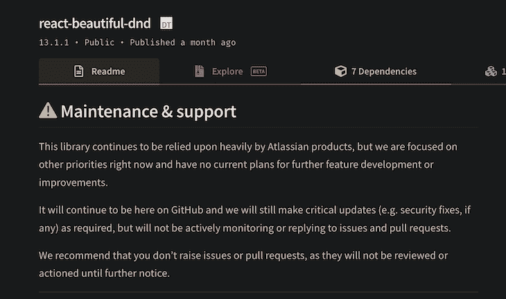
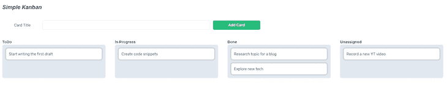
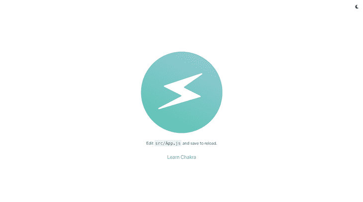
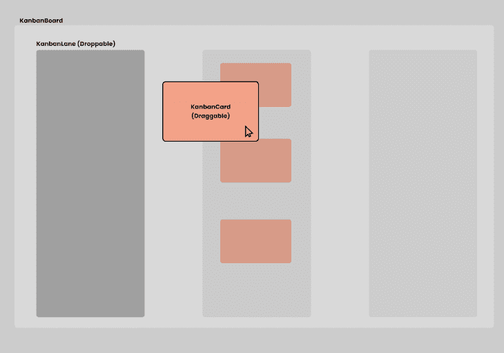
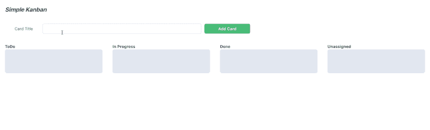

# 用 dnd 套件制作看板并做出反应

> 原文：<https://blog.logrocket.com/build-kanban-board-dnd-kit-react/>

你是一个正在寻找 react-beautiful-dnd 替代品的开发人员吗？不要再看了！dnd 工具包在这里，我们将在本演练指南中讨论如何使用它。

*向前跳转:*

## dnd 套件作为 react-beautiful-dnd 的替代产品

用于设计 web 界面的最流行的 UI 模式之一是拖放模式。这是一种包含在项目中的易于使用且直观的模式，最常用于上传文件、重新排序或移动项目等过程。

有几个软件包可以使拖放功能的实现变得简单，React 开发人员的一个流行选择是 [react-beautiful-dnd](https://www.npmjs.com/package/react-beautiful-dnd) 。

不幸的是，它不再被维护，也没有任何未来发展的计划。这让像我这样的开发人员寻找一个可靠的替代品，也给了我一个不喜欢 Atlassian 的理由(第一个是吉拉😅！)



输入免打扰套件。

## 什么是免打扰套件？

dnd 套件是新的“套件”(责怪这个笑话的创造者🤣)对于那些寻求替代反应-美丽-dnd 的人来说，它看起来肯定很有希望。

在本教程中，我们将创建一个基本的看板，同时了解 dnd 套件及其特性。

这是我们完成后，我们的板看起来会是什么样子的图像:



## 免打扰套件入门

我们将从使用 Create React App 建立一个 React 项目开始。为了简单起见，我们将使用 Chakra UI 组件库，因为它易于设置和使用。

要创建和设置 React 项目，请运行以下命令:

```
npx create-react-app react-kanban-app --template @chakra-ui   # create project
cd react-kanban-app   # move into the project directory

# If you prefer TS over JS and yarn over npm
npx create-react-app react-kanban-app --template @chakra-ui/typescript
yarn create react-app react-kanban-app --template @chakra-ui
yarn create react-app react-kanban-app --template @chakra-ui/typescript

```

这将创建一个名为`react-kanban-app`的文件夹。使用命令行 cd 进入项目目录并运行:

```
npm run start

```

这将在端口 3000 上启动应用程序。在您的浏览器中打开`localhost:3000`，您将看到以下屏幕:



## 安装`dnd-kit/core`

现在我们已经建立了一个基础项目，让我们从安装 dnd 工具包开始；我们今天将使用的轻量级、高性能、可扩展的 React 拖放工具包。

要安装该软件包，请运行:

```
npm install @dnd-kit/core

# If you run into peer dependencies issues (esp. npm 7+)
npm install --legacy-peer-deps @dnd-kit/core

```

该命令将从 dnd-kit 安装`core`包。

`core`包附带了在 React 应用程序中创建拖放功能所需的构建块。该套件附带有`DndContext`、`Draggable`和`Droppable`核心组件。

除此之外，它还附带了一个`DragOverlay`组件，以更流畅的外观改善用户体验——我们将在本文后面更详细地介绍核心组件。

对于更高级的用例，我们还可以安装 dnd kit 提供的其他包。

### 修饰语

这个包附带了有用的[修改器](https://docs.dndkit.com/api-documentation/modifiers)，可以用来改变核心组件的行为。

以下是修改器的一些主要功能:

*   将运动限制在一个轴上(水平或垂直)
*   将运动限制到窗口或可拖动项目的父元素
*   将可拖动项目对齐网格
*   创建自定义修改器

### 预设(可排序预设)

dnd-kit 工具包附带了一个[可分类的](https://docs.dndkit.com/presets/sortable)预置。该预设可用于在 React 中构建可排序的拖放界面。

对于本教程，我们将坚持核心包，所以让我们在弄脏手之前仔细看看它。

## dnd 套件的构建模块

### `DndContext`

这是我们拖放功能的根组件，所有其他块都嵌套在里面。

该组件接受大约 12 个道具，在特定事件发生时帮助修改行为或运行代码。

出于本教程的目的，我们将使用`collisionDetection`和`onDragEnd`道具。

> **注意，** [了解更多关于其他道具的](https://docs.dndkit.com/api-documentation/context-provider#props)。

### 可拖动的

核心包导出了`useDraggable`钩子，它可以在我们的 React 组件中使用，使它成为一个可拖动的组件(稍后将详细介绍)。

```
//exampleDraggable.jsx
import {useDraggable} from "@dnd-kit/core"
import {CSS} from "@dnd-kit/utilities"

export const MyDraggableComponent = () => {
const {attributes, listeners, setNodeRef, transfrom} = useDraggable({
  id: 'draggable-1',
  data: {
    ....
    parent: 'ToDo',
    title: 'Complete blogpost.'
    ....
  }
  return <div 
          {...attributes} 
          {...listeners} 
          ref={setNodeRef} 
          styles={{transfrom: CSS.Translate.toString(transform) }}>Drag Me!</div>
})

```

### 可抛弃的

很像`useDraggable`钩子，我们可以使用`useDroppable`钩子使我们的 React 组件成为一个可丢弃的目标。

* * *

### 更多来自 LogRocket 的精彩文章:

* * *

```
//exampleDroppable.jsx
import {useDroppable} from "@dnd-kit/core"

export const MyDroppableComponent = () => {
  const {setNodeRef} = useDroppable({
    id: 'droppable-1'
  })

  return <div ref={setNodeRef}> Drop on me! </div>
}

```

### 传感器

传感器是不同的输入方法，可用于启动可拖动项目的拖动。

我们可以使用一些内置传感器:

*   指针
*   键盘
*   触控
*   老鼠

`DndContext`默认为一个`Pointer`和`Keyboard`传感器。如果您想使用另一个传感器，可以通过初始化一个传感器，然后将其传递给`DndContext`来完成。

```
//sensors.jsx
import {MouseSensor, TouchSensor, useSensor} from '@dnd-kit/core';

export const DragDropContainer = () => {

  const mouseSensor = useSensor(MouseSensor); // Initialize mouse sensor
  const touchSensor = useSensor(TouchSensor); // Initialize touch sensor
  const sensors = useSensors(mouseSensor, touchSensor)

  return (<DndContext sensors={sensors}>.....</DndContext>) // Pass the 2 sensors
}

```

既然我们已经讨论了这些基础，现在我们可以开始用 dnd 套件构建看板，所以让我们直接进入正题。



上面显示的是我们将要构建的看板的组件分解。

我们今天将探讨三个主要组件:

*   `KanbanCard`:一个可拖动的看板`Item`，可以放到一个可放下的区域
*   `KanbanLane`:可以放下`KanbanCard`的可放下区域
*   `KanbanBoard`:将所有东西结合在一起的组件

## `KanbanCard`组件

让我们从`KanbanCard`组件开始:

```
// KanbanCard.tsx
import { Flex, Text } from "@chakra-ui/react";
import { useDraggable } from "@dnd-kit/core";
import { CSS } from "@dnd-kit/utilities";

const KanbanCard = ({
  title,
  index,
  parent,
}: {
  title: string;
  index: number;
  parent: string;
}) => {
  const { attributes, listeners, setNodeRef, transform } = useDraggable({
    id: title,
    data: {
      title,
      index,
      parent,
    },
  });
  const style = {
    transform: CSS.Translate.toString(transform),
  };
  return (
    <Flex
      padding="3"
      backgroundColor="white"
      margin="2"
      borderRadius="8"
      border="2px solid gray.500"
      boxShadow="0px 0px 5px 2px #2121213b"
      transform={style.transform}
      {...listeners}
      {...attributes}
      ref={setNodeRef}
    >
      <Text>{title}</Text>
    </Flex>
  );
};

```

这里有几件事需要注意，我将在下面重点说明。

该组件有三个支柱:

*   `title`:卡片的标题
*   `index`:当前车道卡片的索引
*   `parent`:卡片当前所在车道的名称

为了使组件可拖动，我们必须使用`useDraggable`钩子。在上面的例子中，我们需要传递一些东西作为参数:

*   `id`:标识`DndContext`中可拖动节点的唯一值
*   `data`:可以在事件处理程序中使用的数据

钩子也返回了一些我们必须考虑的东西:

*   `attributes`:需要添加到可拖动 DOM 节点的可访问性属性
*   `listeners`:拖动工作需要大量的事件处理程序
*   `setNodeRef`:dnd-kit 用来跟踪 DOM 节点的函数
*   `transform`:保存可拖动元素的位置和缩放值的对象

最后，为了可视化地更新组件，我们必须更新卡片的`transform` CSS 属性。为了获得卡片位置，我们需要将`useDraggable`钩子返回的转换值传递给 dnd-kit 提供的辅助函数。

## `KanbanLane`组件

现在，让我们来看看`KanbanLane`组件:

```
// KanbanLane.tsx
import { Flex, Text } from "@chakra-ui/react";
import { useDroppable } from "@dnd-kit/core";

interface KanbanLaneProps {
  title: string;
  items: Cards[];
}

export default function KanbanLane({ title, items }: KanbanLaneProps) {
  const { setNodeRef } = useDroppable({
    id: title,
  });
  return (
    <Flex flex="3" padding="5" flexDirection="column" minH="10rem">
      <Text fontWeight="bold">{title}</Text>
      <Flex
        ref={setNodeRef}
        backgroundColor="gray.200"
        borderRadius="8"
        flex="1"
        padding="2"
        flexDirection="column"
      >
        {items.map(({ title: cardTitle }, key) => (
          <KanbanCard title={cardTitle} key={key} index={key} parent={title} />
        ))}
      </Flex>
    </Flex>
  );
}

```

这是一个非常精简的组件，因为它所做的只是渲染多个`KanbanCard`组件。需要注意的一点是，它使用了`useDroppable`钩子，这使得它成为一个可放置的区域。

我们需要传入一个在`DndContext`中唯一的`id`。

## `KanbanBoard`组件

最后，让我们仔细看看将所有这些联系在一起的`KanbanBoard`组件:

```
// KanbanBoard.tsx
import { DndContext, rectIntersection } from "@dnd-kit/core";
import KanbanLane from "./KanbanLane";
import AddCard from "./AddCard";
import { Flex } from "@chakra-ui/react";
import { useState } from "react";
import { Cards } from "./types";
export default function KanbanBoard() {
  const [todoItems, setTodoItems] = useState<Array<Cards>>([]);
  const [doneItems, setDoneItems] = useState<Array<Cards>>([]);
  const [inProgressItems, setInProgressItems] = useState<Array<Cards>>([]);
  const [uItems, setuItems] = useState<Array<Cards>>([]);
  const addNewCard = (title: string) => {
    setuItems([...uItems, { title }]);
  };
  return (
    <DndContext
      collisionDetection={rectIntersection}
      onDragEnd={(e) => {
        const container = e.over?.id;
        const title = e.active.data.current?.title ?? "";
        const index = e.active.data.current?.index ?? 0;
        const parent = e.active.data.current?.parent ?? "ToDo";
        if (container === "ToDo") {
          setTodoItems([...todoItems, { title }]);
        } else if (container === "Done") {
          setDoneItems([...doneItems, { title }]);
        } else if (container === "Unassigned") {
          setuItems([...uItems, { title }]);
        } else {
          setInProgressItems([...inProgressItems, { title }]);
        }
        if (parent === "ToDo") {
          setTodoItems([
            ...todoItems.slice(0, index),
            ...todoItems.slice(index + 1),
          ]);
        } else if (parent === "Done") {
          setDoneItems([
            ...doneItems.slice(0, index),
            ...doneItems.slice(index + 1),
          ]);
        } else if (parent === "Unassigned") {
          setuItems([...uItems.slice(0, index), ...uItems.slice(index + 1)]);
        } else {
          setInProgressItems([
            ...inProgressItems.slice(0, index),
            ...inProgressItems.slice(index + 1),
          ]);
        }
      }}
    >
      <Flex flexDirection="column">
        <AddCard addCard={addNewCard} />
        <Flex flex="3">
          <KanbanLane title="ToDo" items={todoItems} />
          <KanbanLane title="In Progress" items={inProgressItems} />
          <KanbanLane title="Done" items={doneItems} />
          <KanbanLane title="Unassigned" items={uItems} />
        </Flex>
      </Flex>
    </DndContext>
  );

```

这里发生了相当多的事情；让我们一个一个地检查它们。

首先，该板有四个通道:`ToDo`、`In Progress`、`Done`和`Unassigned`。

其次，`<AddCard/>`组件只是一个带按钮的文本框。点击该按钮，将创建一张标题在文本框中指定的卡片，并将其添加到`Unassigned`通道。

`DndContext`是组件的根，我们需要向它传递两个重要的道具:

*   `collisionDetection`:这个[指示使用哪种方法](https://docs.dndkit.com/api-documentation/context-provider/collision-detection-algorithms)来检测可拖动和可放下组件之间的碰撞
*   这是一个事件处理程序，每次我们停止拖动一个可拖动的组件时都会运行。在事件处理程序中:
    *   我们识别出卡所在的通道并将其移除
    *   我们确定卡片是从哪个通道掉落的，并将其添加到该通道

最后，这是它看起来的样子👇



## 结论

虽然 [react-beautiful-dnd](https://www.npmjs.com/package/react-beautiful-dnd) 没有被积极维护，但它更加成熟，周围有一个巨大的社区。正因为如此，说服人们跳槽肯定会很有挑战性。它还具有一些高级特性，如支持多次拖动、虚拟列表支持和 SSR，这些都是 dnd kit 不能开箱即用的。

然而，我觉得 dnd 套件有潜力达到与 react-beautiful-dnd 相当的功能，甚至超过它。感兴趣的人可以通过解决问题和打开 PRs 来帮助实现这一目标！

就是这样！我们已经使用 dnd 套件和 React 构建了一个基本的看板。你可以在这里找到这个教程[的回购。我发关于 web 开发和 JavaScript 的微博，所以如果你感兴趣，可以找我](https://github.com/rahulnpadalkar/react-dnd-kanban) [@rahulnpadalkar](https://twitter.com/rahulnpadalkar) 。

## 使用 LogRocket 消除传统反应错误报告的噪音

[LogRocket](https://lp.logrocket.com/blg/react-signup-issue-free)

是一款 React analytics 解决方案，可保护您免受数百个误报错误警报的影响，只针对少数真正重要的项目。LogRocket 告诉您 React 应用程序中实际影响用户的最具影响力的 bug 和 UX 问题。

[ ](https://lp.logrocket.com/blg/react-signup-general) [  ](https://lp.logrocket.com/blg/react-signup-general) [LogRocket](https://lp.logrocket.com/blg/react-signup-issue-free)

自动聚合客户端错误、反应错误边界、还原状态、缓慢的组件加载时间、JS 异常、前端性能指标和用户交互。然后，LogRocket 使用机器学习来通知您影响大多数用户的最具影响力的问题，并提供您修复它所需的上下文。

关注重要的 React bug—[今天就试试 LogRocket】。](https://lp.logrocket.com/blg/react-signup-issue-free)