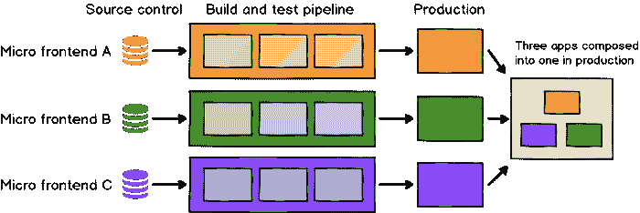
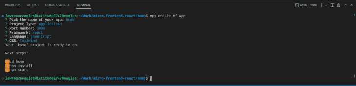
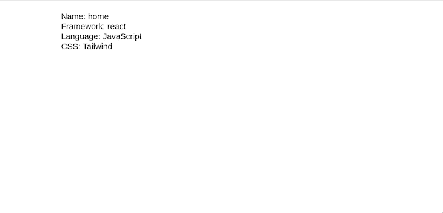
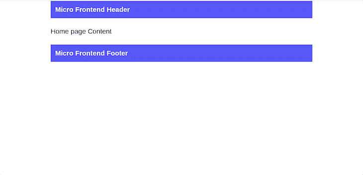
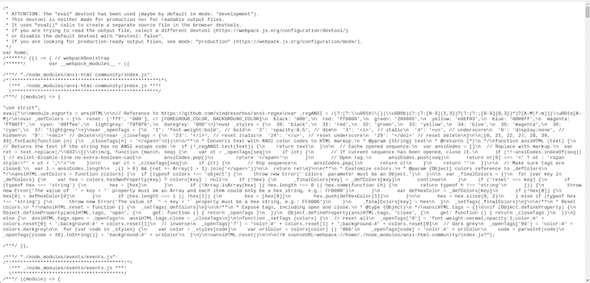
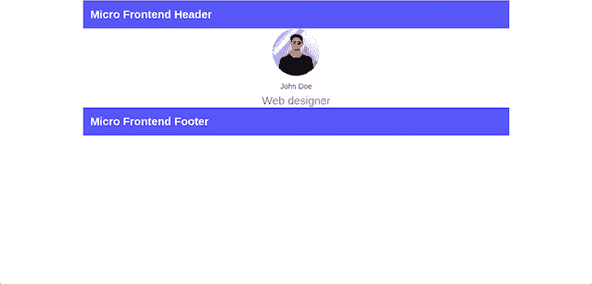

# 用 React - LogRocket 博客构建微前端应用

> 原文：<https://blog.logrocket.com/build-micro-frontend-application-react/>

***编者按**:本文最后一次更新于 2023 年 2 月 28 日，以反映代码的变化。*

对于团队来说，从事大型项目并管理他们的代码库是一个巨大的挑战。虽然微前端已经出现了一段时间，但由于其独特的功能，它们越来越受欢迎。

有了微前端，多个团队可以在同一个项目的单个模块上工作，而不会影响其他模块；向当前系统添加多少模块并不重要。

在本文中，我们将介绍什么是微前端的基础知识，并学习如何使用 React 实现微前端。我们还将讨论在您的应用中使用微前端的优势。我们开始吧！

*向前跳转:*

## 微前端简介

当前的 web 开发趋势包括构建一个位于微服务架构之上的前端单片应用程序。但是，随着不同团队的开发人员对这个前端整体的贡献，维护变得越来越困难。微服务为此提供了解决方案。

微前端一词将微服务的概念扩展到前端；微前端对于前端就像微服务对于后端一样。本质上，微前端的目标是将 web 应用程序视为由不同的独立团队拥有的具有不同使命的功能的组合；每个团队端到端地工作，从数据库到 UI。

微前端不遵循任何特定的结构，也没有固定的边界。您的项目可能会发展久而久之，并且您可能需要在进行过程中修改您的微前端:



图片来源:[https://microfrontends.com/](https://microfrontends.com/)

React 是一个流行的前端技术栈，所以它是实现微前端的一个很好的选择。微前端架构仍然是相当新的，并且仍然被不同的框架采用，所以最佳实践仍然在发展。因此，您可能会发现从头实现微前端很有挑战性。这里， [`create-mf-app`](https://github.com/jherr/create-mf-app) 包进来了。

根据它的文档，`create-mf-app`基于它的一个模板创建一个模块联合应用程序、API 服务器或库。它是框架不可知的，这意味着它支持多种框架和库，包括 Preact、react、Svelte 等。

## 微前端的最佳实践

让我们介绍一些在实现微前端架构时要记住的最佳实践。

### 隔离团队代码

每个团队都应该作为一个独立的应用程序开发其功能，而不使用共享状态或依赖于全局变量。因此，即使所有团队使用相同的框架，也不应该共享运行时。

### 建立团队前缀

当隔离还不可能时，团队应该就名称空间的所有权达成一致，以避免可能的冲突，例如 CSS、事件、本地存储等。

### 构建有弹性的 web 应用程序

每个独立的团队都应该实现弹性特性；即使 JavaScript 没有启用或失败，该特性应该仍然可以工作。此外，您应该通过通用渲染和渐进增强来提高性能。

### 在自定义 API 上使用本机浏览器 API

你应该支持浏览器事件进行交流，而不是构建一个全局发布/订阅系统；保持跨团队 API 简单。

## 使用微前端的优势

简单地说，微前端使 web 应用程序更易于维护。如果你曾经参与构建一个大型应用程序，你会知道管理一切是非常乏味的；[微前端的工作方式类似于分治规则](https://blog.logrocket.com/micro-frontend-apps-single-spa/)。现在，让我们来了解一下使用微前端最有价值的好处。

### 部署和安全性

微前端架构的一个显著优点是，您可以将单个主体分成可以独立部署的独立部分。无论使用何种语言或框架，Vercel 都可以支持使用不同前端的单个回购协议，并将它们部署在一起。否则，你可以使用像 [Netlify](https://www.netlify.com/) 这样的部署服务。一旦部署了微前端，您就只能将其用作单独的前端。

为了保护您的微前端，您可以使用一个 SSL 证书，如通配符、单域或多域，或者一个 [SAN SSL 证书](https://www.cheapsslshop.com/uc-san-ssl-certificates)。一个 SAN 或多域 SSL 证书可以保护多个站点和子域。

### 技术不可知论和可扩展性

有了微前端架构，你可以在一个项目中结合任何语言或框架，比如 React、Vue、Angular 等。每个前端团队可以独立选择和升级自己的技术堆栈，而没有义务与其他团队协调。

### 更快的发展

您的团队可以随时开发和部署您的前端。各个模块之间没有任何依赖关系，这意味着发布可以很快完成。定义微前端的主要目标是更快的迭代。

### 更容易的学习曲线

每个团队处理一个独立的应用程序功能，与前端的整体相比，新开发人员更容易理解。因此，学习曲线是线性的，转化为新开发人员更低的投入成本和更高的总产出。

### 垂直领域所有权

在引入微前端之前，垂直域所有权只能通过微服务架构在后端实现。公司可以在独立团队中扩展产品开发，以促进后端的所有权，然而，前端仍然是铁板一块。

随着微前端的引入，前端被分割成由每个团队拥有的垂直领域的组件，从数据库到 UI。

### 代码可重用性

微前端促进了代码的可重用性，因为一个团队可以实现和部署一个可以被多个团队重用的组件。

### 易于测试

在开始集成测试之前，最好测试应用程序的各个部分。团队将在测试应用程序之前测试微前端，从而减少真实系统中出现错误的机会。

除此之外，其他优势包括易于维护的小代码库，以及快速添加或删除系统中任何模块的能力。

## 先决条件

在本教程中，我们将用 React 构建一个微前端。要跟进，您需要以下内容:

为了跟随代码，您可以[查看这个项目的 GitHub repo](https://github.com/lawrenceagles/micro-frontend-react) 。

## 自举微前端

创建一个名为`micro-frontend-react`的应用文件夹。要引导 React 微前端应用程序，从该文件夹运行`npx create-mf-app`并将以下数据传递给交互终端:

*   名称:`home`
*   项目类型:`Application`
*   端口号:`3000`

选择 **React** 、 **JavaScript** 和 **Tailwind** 作为你的堆栈。一个名为`home`的 React 微前端应用程序将为您引导。在您的终端中，您应该看到以下内容:



要测试来自`home`文件夹的应用程序，运行`yarn install`安装所有依赖项。然后，运行`yarn start`启动`dev-server`。如果一切顺利，您应该会在屏幕上看到以下内容:



在`about`文件夹中，使用以下数据重复上述步骤:

*   名称:`about`
*   项目类型:`Application`
*   端口号:`3001`

像之前一样，选择 **React** 、 **JavaScript** 、 **Tailwind** 作为你的栈，应用就会为你自举。

最后，为了测试应用程序，通过运行`yarn install`安装所需的依赖项。然后，通过运行`yarn start`启动`dev-server`。如果一切顺利，您应该会在屏幕上看到以下内容:


## 实现微前端

在我们的微前端实现中，`home`应用程序将包含并公开两个组件，`Header`和`Footer`。`about`应用程序导入并使用这些组件。

为了实现这一点，在`home`应用程序的`src`目录中，创建两个组件`Header.jsx`和`Footer.jsx`。将以下代码片段分别添加到`Header.jsx`和`Footer.jsx`:

```
import React from "react"
export default function Header() {
    return (
        <div className="p-5 bg-blue-500 text-white -text-3xl font-bold">
            Micro Frontend Header
        </div>
    )
}
```

```
import React from "react"
export default function Footer() {
    return (
        <div className="p-5 bg-blue-500 text-white -text-3xl font-bold">
            Micro Frontend Footer
        </div>
    )
}

```

接下来，更新`App.jsx`组件以使用以下导航条:

```
import React from "react";
import ReactDOM from "react-dom";
import "./index.scss";
import Header from "./Header"
import Footer from "./Footer";

const App = () => (
  <div className="text-3xl mx-auto max-w-6xl">
    <Header />
    <div className="my-10">
      Home page Content
    </div>
    <Footer />
  </div>
);

ReactDOM.render(<App />, document.getElementById("app"));

```

通过重启服务器来测试应用程序，您将得到以下结果:



我们需要在`about`应用程序中构建`about`页面。为此，更新`about`应用程序中的`App.jsx`组件，如下所示:

```
import React from "react";
import ReactDOM from "react-dom";
import "./index.scss";
const App = () => (
  <div className="text-3xl mx-auto max-w-6xl">
    <div class="text-center">
      
      <h5 class="text-xl font-medium leading-tight mb-2">John Doe</h5>
      <p class="text-gray-500">Web designer</p>
    </div>
  </div>
);

ReactDOM.render(<App />, document.getElementById("app"));

```

重启`dev-server`，你会得到如下结果:


从上面的 UI 中，我们看到了页眉和页脚导航的必要性。但是，我们不需要创建重复的副本，因为我们可以通过微前端共享它们。

## 添加模块联盟

我们在上面提到过，`about`应用程序中的`about`页面需要使用家庭应用程序的`Header`和`Footer`组件。为此，我们需要添加模块联合。

我们首先将把`home`应用程序的`Header`和`Footer`组件转换成微前端，以便其他应用程序中的组件可以使用它们。

打开`home` app 中的`webpack.config.js`文件，该文件已经由`create-mf-app`包创建并配置。首先，更新`ModuleFederationPlugin`配置中的`exposes`属性，如下所示:

```
exposes: {
        "./Header": "./src/Header.jsx",
        "./Footer": "./src/Footer.jsx"
      },

```

在上面的代码中，我们指定`home`应用程序将`Header`和`Footer`组件公开为微前端。因此，这些组件可以共享。

现在，重新启动服务器。虽然 UI 没有任何变化，但是已经为我们创建了一个远程条目文件。要查看远程条目文件，请在浏览器中导航到 URL `localhost:3000/remoteEntry.js`，您将看到以下内容:



这个远程入口文件`remoteEntry.js`，是由`home`应用程序公开的所有模块的清单文件。

为了完成我们的设置，复制清单文件的链接`localhost:3000/remoteEntry.js`，然后在`about`应用程序的`webpack.config.js`文件中更新`ModuleFederationPlugin`配置的`remotes`属性，如下所示:

```
remotes: {
        home: "[email protected]://localhost:3000/remoteEntry.js",
      },

```

上面的代码指定了`about`组件有一个名为`home`的远程微前端应用程序，它与组件共享它的模块。有了这个设置，我们可以访问从`home`应用程序中暴露的任何组件。

现在，用共享的导航栏更新`about`应用程序的`App.jsx`组件，如下所示:

```
import React from "react";
import ReactDOM from "react-dom";
import "./index.scss";
import Header from "home/Header";
import Footer from "home/Footer";
const App = () => (
  <div className="text-3xl mx-auto max-w-6xl">
    <Header />
    <div class="text-center">
      
      <h5 class="text-xl font-medium leading-tight mb-2">John Doe</h5>
      <p class="text-gray-500">Web designer</p>
    </div>
    <Footer />
  </div>
);
ReactDOM.render(<App />, document.getElementById("app"));

```

重启`dev-server`，您将在浏览器中看到以下内容:



从上面的代码和显示的 UI 中，我们看到我们已经成功地使用微前端在两个应用程序之间共享了组件。

## 结论

在本文中，我们通过示例探讨了微前端的概念，讨论了它们相对于前端单片应用程序和其他可用设置的优势。微前端提供了一些很棒的特性，并且易于采用。

通过`create-mf-app`，我们实现了微前端架构，就像使用 Create React App 一样简单。就个人而言，我喜欢微前端风格，因为它很容易在团队中维护。此外，前端建设和安全管理相当优雅。

我希望你喜欢这篇文章，如果你有任何问题，一定要留下评论。编码快乐！

劳伦斯·伊格尔斯对本文进行了修改。

## [LogRocket](https://lp.logrocket.com/blg/react-signup-general) :全面了解您的生产 React 应用

调试 React 应用程序可能很困难，尤其是当用户遇到难以重现的问题时。如果您对监视和跟踪 Redux 状态、自动显示 JavaScript 错误以及跟踪缓慢的网络请求和组件加载时间感兴趣，

[try LogRocket](https://lp.logrocket.com/blg/react-signup-general)

.

[ ](https://lp.logrocket.com/blg/react-signup-general) [](https://lp.logrocket.com/blg/react-signup-general) 

LogRocket 结合了会话回放、产品分析和错误跟踪，使软件团队能够创建理想的 web 和移动产品体验。这对你来说意味着什么？

LogRocket 不是猜测错误发生的原因，也不是要求用户提供截图和日志转储，而是让您回放问题，就像它们发生在您自己的浏览器中一样，以快速了解哪里出错了。

不再有嘈杂的警报。智能错误跟踪允许您对问题进行分类，然后从中学习。获得有影响的用户问题的通知，而不是误报。警报越少，有用的信号越多。

LogRocket Redux 中间件包为您的用户会话增加了一层额外的可见性。LogRocket 记录 Redux 存储中的所有操作和状态。

现代化您调试 React 应用的方式— [开始免费监控](https://lp.logrocket.com/blg/react-signup-general)。