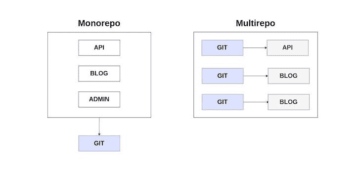
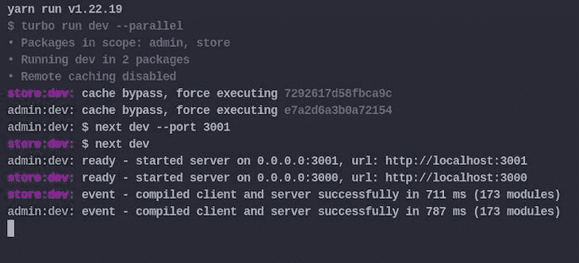
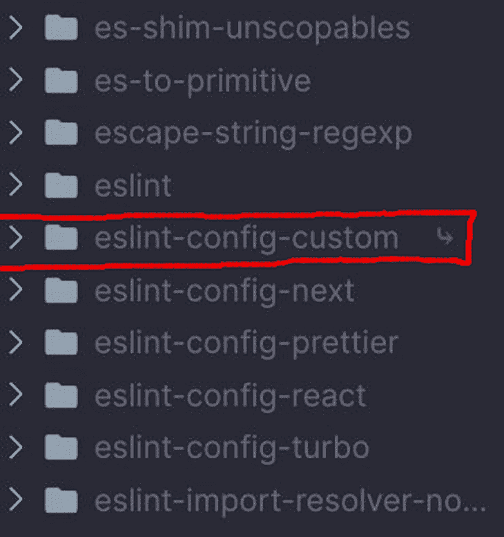
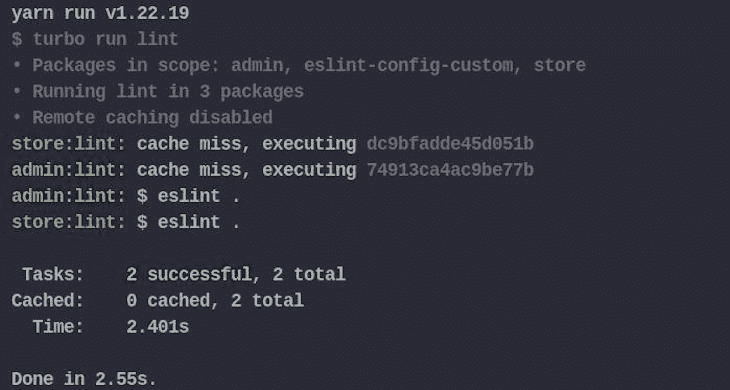
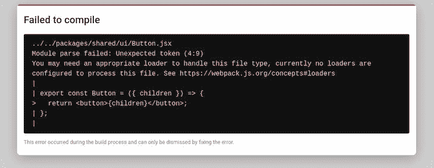

# 了解如何在 Next.js 中构建 monorepo

> 原文：<https://blog.logrocket.com/build-monorepo-next-js/>

Monorepo 架构在开发现代 web 应用程序的开发人员中已经成为一种非常流行的趋势。

尽管这种做法并不新鲜，但像谷歌和微软这样的大公司已经利用 monorepos 大规模管理软件很长时间了，它也用于流行的开源项目，如 React、Next.js、Jest、Babel 等等。

在这篇文章中，我们将讨论什么是 monorepos 以及使用它们所需的工具。

我们还将探索如何为 Next.js 项目构建 monorepo，并提供一个样例用例。

*向前跳转:*

## 什么是单向回购？

monorepo 是一个单一的受版本控制的存储库，它包含几个具有良好定义关系的独立项目。

这种方法不同于更典型的软件开发方法，在这种方法中，每个项目通常存储在一个单独的存储库中，有自己的配置用于构建、测试和部署。



## 在 Next.js 中使用 monorepo 的好处

有一些关键因素导致了关于软件项目如何构建的方向的转变(特别是那些具有大代码库的项目)。

这些因素是:

### 简单代码共享

monorepo 中构建的应用程序可以很容易地共享可重用的代码和配置，因为它们共享同一个存储库。

与 polyrepo 相比，这意味着减少了代码重复，确保了更快的开发和易于维护。

此外，开发人员不必经历发布包和解决与依赖它们的项目不兼容的困难过程。

### 原子提交

影响多个应用程序的大规模更改可以在一次提交中完成，同时确保应用程序在提交更改前按预期工作。

原子提交的一个很好的例子是当对几个应用程序使用的共享库进行重大更改时，从而迫使开发人员确保依赖它的应用程序更新为与最近的更改兼容。

### 一致性

Monorepos 比 polyrepos 提供了更好的一致性，因为代码库都在一个地方，每个项目都可以轻松地共享相同的编码风格和工具来进行测试、部署和代码维护。

Monorepos 对于管理项目非常有用，但是要充分利用它们，您需要使用正确的工具来确保您的开发工作流快速有效。

可用的 monorepo 工具因其功能、语言支持和使用它们所需的专业知识而异。

以下是使用 JavaScript/TypeScript 代码库的 monorepo 工具列表:

*   [Turborepo](https://github.com/vercel/turborepo) :由 Vercel 为 JavaScript/TypeScript monorepos 维护的智能构建系统
*   [Nx](https://github.com/nrwl/nx) :具有一流 monorepo 支持和强大集成的下一代构建系统
*   Bazel :快速、可伸缩、多语言和可扩展的构建系统
*   Lerna :快速现代的构建系统，用于管理和发布来自同一个存储库的多个 JavaScript/TypeScript 包

Turborepo 是本教程的首选工具。对于 TypeScript/JavaScript 代码库来说，这是一个易于使用、快速且有效的构建系统。

> **注意，**如果你想看看 Turborepo 还能做些什么，我们有另一个教程，重点是[构建一个全栈式脚本 monorepo](https://blog.logrocket.com/build-full-stack-typescript-application-turborepo/)

Turborepo 构建在[工作空间](https://docs.npmjs.com/cli/v7/using-npm/workspaces)上，这是一个由 Yarn、npm 和 [pnpm](https://blog.logrocket.com/managing-full-stack-monorepo-pnpm/) 支持的特性，用于管理一个顶级根包中的多个包。

Turborepo 附带以下功能，使 monorepos 的使用变得简单:

*   增量构建:这确保当工作空间中有变化时构建被执行，以防止不必要的计算
*   并行执行:并行执行任务，同时最大限度地利用 CPU 中的每个可用内核，以确保快速执行
*   远程缓存:这是 Turborepo 支持的一个令人印象深刻的特性，它允许您与开发团队和 CI/CD 服务器共享任务执行的缓存，以减少执行时间
*   依赖图可视化:这支持生成任务执行计划的图形，以给出运行它所采取的步骤的高级视图

## 构建 monorepo

对于本教程，我们将为一个示例电子商务应用程序构建一个 monorepo，该应用程序由两个独立的 Next.js 应用程序组成:一个 admin 和一个 store。

我们还将介绍如何利用 monorepos 提供的显著优势。这些主要是:

*   代码共享；创建一个可重用的组件库，供两个 Next.js 应用程序使用
*   用于林挺和格式化的共享配置包

## 项目设置

在您的终端中，输入以下命令为项目创建一个新目录并设置`package.json`:

```
mkdir nextjs-monorepo 
cd nextjs-monorepo 
yarn init -y

```

这是构建单一回购的第一步；现在我们必须设置项目的工作环境。

## 创建工作区

在本文的前面，我提到了 Turborepo 是建立在工作空间之上的 monorepo 中的所有包和应用程序都将存储在它们自己的独立工作空间中。

打开项目根目录下的`package.json`文件，插入下面的代码:

```
{
  "name": "nextjs-monorepo",
  "private": true,
  "version": "1.0.0",
  "workspaces": [
    "apps/*",
    "packages/config/*",
    "packages/shared/*"
  ],
  "engines": {
    "node": ">=14.0.0"
  },
  "packageManager": "[email protected]"
}

```

`package.json`文件中的`workspaces`字段是一个路径数组，它告诉包管理器我们的工作区位于哪里。

`apps/*`是针对所有独立的 Next.js 应用；`packages/config/*`存储可重复使用的包，用于林挺和格式化；并且`packages/shared/*`包含由`app/`中的项目使用的可重用代码——这是 UI 组件库将被存储的地方。

## 设置 Next.js 应用程序

在项目的根目录下，创建一个新文件夹`apps/`，用于存储我们将要设置的 Next.js 应用程序:

```
mkdir apps
cd apps

```

接下来，让我们添加`admin`和`store`应用程序:

```
yarn create next-app admin 
yarn create next-app store

```

安装完成后，打开位于`apps/admin/package.json`的`admin`应用程序的`package.json`文件。然后，用下一个`dev`——端口 3001——替换`dev`脚本的值，这样它就可以在不同的端口上运行。

一旦完成，用`yarn dev`运行两个项目的开发服务器，以确保一切正常工作。

在`apps/admin/pages/index.js`文件中，插入以下代码:

```
export default function Home() {
  return (
    <div>
      <h1>Admin</h1>
      <button>Click Me!</button>
    </div>
  );
}

```

我们将在`apps/store/pages/index.js`文件中做同样的事情，所以再次插入下面的代码:

```
export default function Home() {
  return (
    <div>
      <h1>Store</h1>
      <button>Click Me!</button>
    </div>
  );
}

```

现在，我们已经完成了两个 Next.js 应用程序的基本设置。在下一节中，我们将设置 Turborepo 来运行我们的开发任务。

## 设置 Turborepo

工作区和任务是 monorepo 的构造块。

Yarn 和 npm 之类的包管理器在安装包和配置工作空间方面工作得很好，但是它们并不适合在 monorepo 之类的复杂项目设置中运行任务，而这正是 Turborepo 的优势所在。

### 安装 Turborepo

让我们从为我们的项目安装 Turborepo 开始。在 monorepo 的根目录下，运行以下脚本:

```
yarn add turborepo -DW

```

安装完成后，在 monorepo 的根目录下创建一个新文件`turbo.json`，以存储 Turborepo 工作所需的配置。然后，输入以下代码:

```
{
  "$schema": "https://turborepo.org/schema.json",
}

```

### 运行任务

让我们配置 Turborepo 来运行`apps/`中的 Next.js 应用程序。打开`turbo.json`文件，输入下面的代码:

```
{
  "$schema": "https://turborepo.org/schema.json",
  "pipeline": {
    "dev": {
      "cache": false
    }
  }
}

```

让我们花点时间来检查一下`turbo.json`文件的内容:

*   `pipeline`字段定义了 Turborepo 将在 monorepo 上运行的任务；对象中的每个属性都是一个任务，对应于工作区的`package.json`文件中的一个脚本
*   `pipeline`对象中的`dev`字段定义了一个工作区的开发任务；`"cache": false`告诉 Turborepo 不要缓存该任务的结果

> **注意，** Turborepo 将只运行在工作区的`package.json`文件的`scripts`部分中定义的任务

我们需要在 monorepo 根目录下的`package.json`文件的`scripts`字段中定义一个脚本来运行 Next.js 应用程序的开发服务器。

在 monorepo 根目录下的`package.json`文件中插入以下代码:

```
{
  "scripts": {
    "dev": "turbo run dev --parallel"
  }
}

```

`--parallel`标志告诉 Turborepo 并行运行工作区的`dev`任务。

在 monorepo 根目录下的终端中输入`yarn dev`,启动 Next.js 应用程序的开发服务器。

如果这是成功的，您应该得到类似下图的输出:



既然 Turborepo 已经启动并运行，下一步就是为林挺和格式化设置一个可重用的配置包。

## 林挺和格式

Monorepos 支持对其中的所有项目使用统一的代码标准，以确保整个代码库的一致性。

像 [ESLint](https://blog.logrocket.com/troubleshooting-next-js-app-eslint/) 这样的自动化代码林挺和格式化工具可以被配置为扩展项目中每个工作空间都可以使用的共享配置。

### 设置 ESLint

我们需要为共享的 ESLint 配置包创建一个新的工作空间，它将在`apps/`中的工作空间中使用。

输入以下脚本为 ESLint 配置包创建新的工作区:

```
mkdir -p packages/config/eslint-config-custom 
cd packages/config/eslint-config-custom    

```

在`packages/config/eslint-config-custom`中创建一个`package.json`文件，并插入以下代码:

```
{
  "name": "eslint-config-custom",
  "version": "1.0.0",
  "main": "index.js",
}    

```

`"main": "index.js"`指定这个包的入口点，而`index.js`包含将由使用它的模块导入的 ESLint 配置。

安装 ESLint 和与此项目相关的插件，如下所示:

```
yarn add eslint eslint-config-next eslint-config-prettier eslint-config-react eslint-config-turbo

```

在`packages/config/eslint-config-custom`中创建一个新文件`index.js`，并输入以下代码:

```
module.exports = {
  extends: ["next", "turbo", "prettier"],
};

```

现在我们已经为这个项目设置了可重用的 ESLint 配置包，下一步是在我们的 Next.js 应用程序中使用它。

为了在`admin`和`store`工作区中使用`eslint-config-custom`包，我们需要将它添加为一个依赖项。

在`admin`和`store`工作区的`package.json`文件中，删除每个 ESLint 包和插件，并插入以下代码:

```
{
  "devDependencies": {
   "eslint-config-custom": "*"
  }    
}

```

用以下代码更新`apps/store`和`apps/admin`工作区中的`.eslintrc.json`文件:

```
{
  "root": true,
  "extends": ["custom"] // Tells ESLint to use the "eslint-config-custom" package
}

```

最后，在 monorepo 的根目录下运行`yarn install`来更新`node_modules`文件夹中的依赖项。

如果您正确地遵循了前面的步骤，您应该在根`node_modules`文件夹中找到本地`eslint-config-custom`包。



### 运行林挺和格式化任务

在我们开始运行林挺和格式化任务之前，我们需要在`admin`和`store`应用程序的`package.json`文件中添加必要的脚本。

打开`admin`和`store`应用程序的`package.json`文件，在`scripts`字段插入以下内容:

```
{
  "lint": "eslint .",
  "format": "eslint --fix --ext .js,.jsx ."
}

```

接下来，我们需要为林挺创建任务，并在 monorepo 中格式化工作区。在 monorepo 根目录下的`turbo.json`文件中，在`pipeline`字段中添加以下代码:

```
{
  "lint": {
    "outputs": []
  },
  "format": {
    "outputs": []
  }  
}

```

`lint`和`format`任务中的`outputs`字段存储了一组 glob——任何匹配 glob 模式的文件都被视为将被缓存的工件。

在`lint`和`format`任务中的`output`的值被设置为一个空数组，这告诉 Turborepo 将日志缓存到这个任务的`stdout`和`stderr`。因此，每当该任务重新运行并且工作区中没有任何更改时，Turborepo 都会重放缓存的日志，这意味着任务的执行时间非常快。

要运行新任务，我们需要用下面的代码更新 monorepo 根目录下的`package.json`文件的`scripts`字段:

```
{
  "lint": "turbo run lint",
  "format": "turbo run format"  
}

```

一旦完成，您现在可以通过输入以下命令来运行`lint`和`format`任务:

```
yarn lint
yarn format

```

下面是执行`yarn lint`的示例输出:



## 构建可重用的组件库

在现代前端开发中，组件是每个应用程序的构建块，与项目的大小无关。

将复杂的 ui 分解成可重用的组件，并将它们抽象成共享的组件库，这是当今标准的开发实践——它使得代码库更容易维护，同时仍然遵循软件开发的最佳实践，如 DRY。

我们将构建自己的可重用组件库，供`apps/`中的项目使用。首先，我们需要创建一个新的工作空间。

在 monorepo 的根目录下输入以下命令，为组件库创建一个新的工作区:

```
mkdir -p packages/shared/ui
cd packages/shared/ui

```

在`packages/shared/ui`中，创建一个新的`package.json`文件，并插入以下内容:

```
{
  "name": "ui",
  "version": "1.0.0",
  "main": "index.js",
  "license": "MIT",
  "scripts": {
    "lint": "eslint .",
    "format": "eslint --fix --ext .js,.jsx ."
  },
  "devDependencies": {
    "eslint": "^7.32.0",
    "eslint-config-custom": "*",
    "react": "^18.2.0"
  }
}

```

接下来，让我们创建一个可重用的按钮组件，供 Next.js 应用程序使用。在`packages/shared/ui`工作区中，创建一个新文件`Button.jsx`，并输入以下代码:

```
import * as React from "react";

export const Button = ({ children }) => {
  return <button>{children}</button>;
};

```

创建一个新文件`index.js`，它将作为这个包的入口点，并导出各个 React 组件。

将以下代码添加到`index.js`文件中:

```
import { Button } from "./Button.jsx";
export { Button };

```

要在 Next.js 应用程序中使用`Button`组件，我们需要将`ui`包作为依赖项添加到工作区的`package.json`文件中。

通过在`admin`和`store`工作区的`package.json`文件的`dependencies`字段中分别插入以下代码来添加`ui`包:

```
{
  "dependencies": {
    "ui": "*"
  }
}

```

一旦完成，运行`yarn install`来更新`node_modules`文件夹中的依赖项。

接下来，在 Next.js 应用程序的`pages/index.js`文件中，用以下代码替换现有代码:

```
// apps/admin/pages/index.js
import { Button } from "ui";
export default function Home() {
  return (
    <div>
      <h1>Admin</h1>
      <Button>Click Me!</Button>
    </div>
  );
}

// apps/store/pages/index.js
import { Button } from "ui";
export default function Home() {
  return (
    <div>
      <h1>Store</h1>
      <Button>Click Me!</Button>
    </div>
  );
}

```

重新启动开发服务器，访问每个应用程序，您将看到类似下图的错误:



这个错误的原因是我们没有配置我们的 Next.js 应用程序来处理本地包的编译，就像`packages/shared`中的`ui`包一样。

npm 上有一个很好的包可以解决这个问题:[next-trans file-modules](https://www.npmjs.com/package/next-transpile-modules)。它支持使用 Next.js/Babel 配置的本地包的传输。

让我们通过输入以下命令在`admin`和`store`工作区中安装`next-transpile-modules`包:

```
yarn workspace admin add -D next-transpile-modules
yarn workspace store add -D next-transpile-modules

```

在`admin`和`store`工作区的`next.config.js`文件中，输入以下代码，使用`next-transpile-modules`包传输组件库包:

```
/** @type {import('next').NextConfig} */
const withTM = require("next-transpile-modules")(["ui"]);
module.exports = withTM({
  reactStrictMode: true,
  swcMinify: true,
});

```

因为我们已经对`next.config.js`文件进行了更改，所以我们必须重启开发服务器以使更改生效。重启服务器后，导航到 [localhost:3000](http://localhost:3000) ，错误应该会得到解决，现在一切正常。

## 结论

Monorepos 将继续在 web 开发社区中流行，因为它们有许多好处，而且工具的进步使开发人员更容易使用它们。

我希望你觉得这篇在 Next.js 中构建 monorepo 的指南很有用——请在下面的评论中告诉我你的经历。

## [LogRocket](https://lp.logrocket.com/blg/nextjs-signup) :全面了解生产 Next.js 应用

调试下一个应用程序可能会很困难，尤其是当用户遇到难以重现的问题时。如果您对监视和跟踪状态、自动显示 JavaScript 错误、跟踪缓慢的网络请求和组件加载时间感兴趣，

[try LogRocket](https://lp.logrocket.com/blg/nextjs-signup)

.

[](https://lp.logrocket.com/blg/nextjs-signup)[](https://lp.logrocket.com/blg/nextjs-signup)

LogRocket 就像是网络和移动应用的 DVR，记录下你的 Next.js 应用上发生的一切。您可以汇总并报告问题发生时应用程序的状态，而不是猜测问题发生的原因。LogRocket 还可以监控应用程序的性能，报告客户端 CPU 负载、客户端内存使用等指标。

LogRocket Redux 中间件包为您的用户会话增加了一层额外的可见性。LogRocket 记录 Redux 存储中的所有操作和状态。

让您调试 Next.js 应用的方式现代化— [开始免费监控](https://lp.logrocket.com/blg/nextjs-signup)。