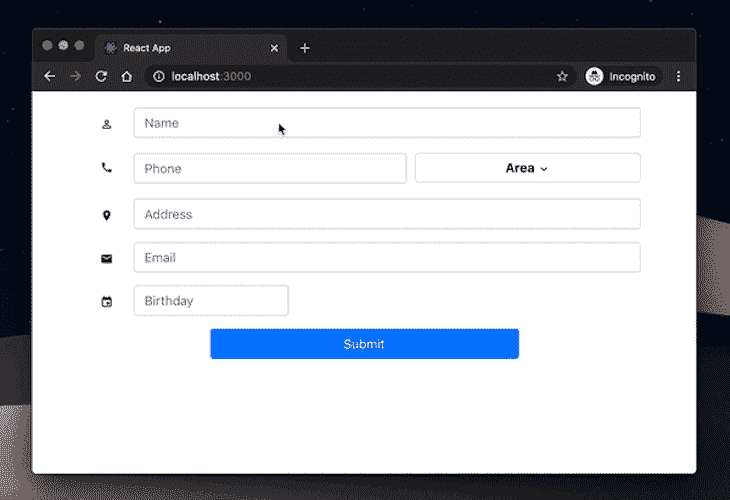
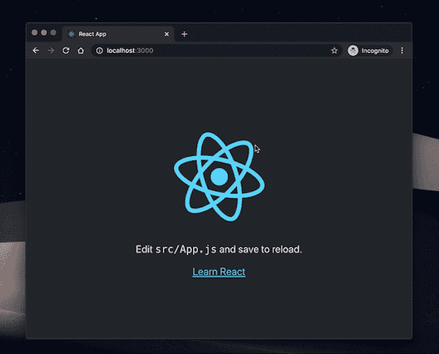
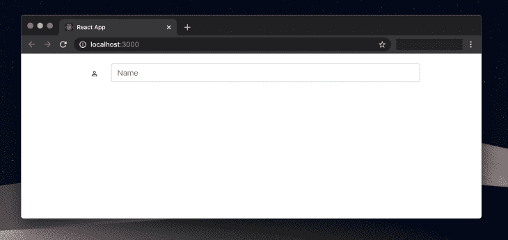

# 用 React 图标构建更易访问的表单

> 原文：<https://blog.logrocket.com/build-more-accessible-forms-with-react-icons/>

采取额外措施来构建更易访问的 React 应用程序可能是一个耗时的过程。然而，为了给每个人创造一个更加包容的网络，这是我们必须做的事情。

这篇文章的目的是帮助你理解如何通过使用流行的 [react 图标库](https://react-icons.netlify.com)和 [ReachUI 库](https://reacttraining.com/reach-ui/)提供的非常容易访问的 react 组件来构建更容易访问的 React 表单。

## 为什么要反应图标？

[React Icons](https://react-icons.netlify.com) 提供数以千计的免费开源图标。它包括十个流行的开源图标库，包括字体真棒和材料设计。它利用 ES6 导入，允许您只包含项目正在使用的图标。我们使用 react-icons 有很多原因，主要是针对用户输入和向表单字段添加可视化描述。以下是一些好处:

*   快速安装过程(可以通过 npm 安装)
*   默认情况下，所有反应图标都针对可访问性进行了优化
*   找到众多图标的变化更加容易
*   内存友好，它不会在您的包中留下很大的足迹
*   它通过 SVG(可缩放矢量图形)选项确保最小的文件大小
*   它是开源的，因此可以用于商业和非商业项目

## 构建可访问的 React 表单

### 先决条件

*   预先了解 React 会有所帮助，但不是强制性的
*   你应该已经安装了 Xcode 或者 Android Studio 来运行模拟器
*   您应该已经安装了[节点 10+](https://nodejs.org/en/download/current/)

### 我们将建造什么

出于演示的目的，为了给你一个更实际的体验，我们将构建一个联系表单来收集一个新朋友的详细信息。我们将使用 Reach UI 的组件和 React 图标使该表单可访问。这是最终产品的视觉输出。



## 入门指南

启动 React 项目最常见的方式是使用 [create-react-app](https://reactjs.org/docs/create-a-new-react-app.html) CLI 工具。如果您以前没有这样做过，请继续运行以下命令来安装必要的包并启动本地开发服务器:

```
npx create-react-app accessible-form
cd accessible-form
npm start
```

如果你在`localhost:3000`查看你的浏览器，你会看到你的项目正在运行。



图标已经成为创建优秀用户界面不可或缺的一部分。它们有助于以清晰简洁的方式呈现您的内容，使用户更容易浏览您的网站或应用程序。

## 构建联系人表单

为了构建表单字段，我们使用了从 [ReachUI](https://reacttraining.com/reach-ui/) 开始提供给我们的组件。要了解更多 ReachUI 的组件，请访问 [ReachUI 组件](https://reacttraining.com/reach-ui/)。

## 属国

为了帮助我们构建这个项目，我们将重用一些现有的库:

1.  [ReachUI](https://reacttraining.com/reach-ui/) —以最易访问的方式构建和设计表单
2.  [反应图标](https://www.npmjs.com/package/react-icons) —为表单字段提供必要的图标
3.  [Bootstrap](https://www.npmjs.com/package/bootstrap)——在各种尺寸的屏幕上构建更具响应性的表单
4.  React DatePicker —一个帮助 React 应用程序实现日期选择的简单组件

要安装这些库，请打开终端并在项目的根文件夹中运行以下命令:

```
npm install --save react-icons react-datepicker bootstrap
```

在我们创建的示例项目的根目录下，创建一个新的
文件。在这个文件中，我们将设置我们的联系表单，并使用`react-icons`来提高其可访问性和整体体验。打开它，用下面的代码更新它:

```
import React, { Component } from "react";
import { Combobox, ComboboxInput } from "@reach/combobox";
import { Menu, MenuList, MenuButton, MenuItem } from "@reach/menu-button";
import {
  MdPhone,
  MdPermIdentity,
  MdLocationOn,
  MdEmail,
  MdExpandMore,
  MdEvent
} from "react-icons/md";
import DatePicker from "react-datepicker";
class Contact extends Component {
  render(){
    return(
      <>  
      //Form here
      </>
    );
  }
}
```

这里，我们导入了一些之前安装的外部组件，以帮助我们实现该应用程序所需的功能。让我们仔细看看它们各自的功能:

*   这是一个可访问的输入框组件，由 ReachUI 库提供。像 ReachUI 库中的其他组件一样，它在默认情况下是可访问的，并且遵守所有 ARIA 元素规范
*   `<[Menu](https://reacttraining.com/reach-ui/menu-button)/>`:reach ui 菜单组件用于在 web 应用程序中提供下拉选择功能。在我们的表单中，我们将有一个下拉菜单，允许用户选择他们居住的位置。使用`<Menu/>`组件给了我们开箱即用的可访问性，也使菜单项键盘可访问。最后，菜单选项非常适合辅助技术
*   `<[React Icons](https://www.npmjs.com/package/react-icons)/>`:我们导入到这个项目中的图标都来自 react-icons 库提供给我们的[材质设计图标](https://react-icons.netlify.com/#/icons/md)。它使我们的表单域更加直观
*   这是一个可重用的 Datepicker 组件，专门用于构建 React 应用程序。我们将使用该组件来呈现生日选择字段的日期选择器。它可以通过键盘访问，并且可以高效地显示日期

导入所有必要的外部库后，我们可以继续在我们的`Contact.js`文件中定义`return()`函数。在其中，我们将使用导入的组件来构建所需的表单字段。

## 名称输入字段

这是收集用户名的表单字段。为此，我们将使用下面的代码更新前面的代码片段:

```
// imports
class Contact extends Component {
  render(){
    return(
      <>  
        <form onSubmit={this.handleSubmit}>
          <Combobox>
            <div>
              <label for="userName">
                <MdPermIdentity />
              </label>
            </div>
            <div>
              <ComboboxInput
                className="form-control"
                id="userName"
                aria-label="user name"
                name="userName"
                value={this.state.userName}
                placeholder="Name"
                onChange={this.handleChange}
              />
            </div>
          </Combobox>        
        </form>
      </>
    );
  }
}
export default Contact    

```



这里，我们使用了`<Combobox/>`组件来定义收集用户名的字段。在呈现`MDPermIdentity`图标时，我们将它包装在一个 HTML `label`标签中，使用它提供的`for`属性为表单输入增加更多的可视辅助功能。最后，为了呈现该字段的文本输入组件，我们使用了接受`aria-label`属性的`ComboboxInput`组件，为使用屏幕阅读器的用户提供音频可访问性。

我们还在所有其他字段中应用了相同的功能，使用户能够输入文本，如电话号码字段、地址字段和电子邮件字段。

## 区域输入字段

这是我们将允许用户根据预定义的位置列表选择居住位置的字段。我们将使用 ReachUI 的`<Menu/>`组件来方便地实现这一功能。下面是我们如何在`Contact.js`文件中实现它:

```
// imports
class Contact extends Component {
  render(){
    return(
      <>  
        <form onSubmit={this.handleSubmit}>
          <div>
            <Menu>
                <MenuButton aria-label="menu button for area">
                  {(this.state.userArea == '') ? ('Area') : (this.state.userArea)}
                  <span aria-hidden><MdExpandMore /></span>
                </MenuButton>
                <MenuList>
                  <MenuItem onSelect={() => this.handleSelect('Ajah', 'userArea' )}>
                    Ajah
                  </MenuItem>
                  <MenuItem onSelect={() => this.handleSelect('Apapa', 'userArea' )}>
                    Apapa
                  </MenuItem>
                  <MenuItem onSelect={() => this.handleSelect('Festac', 'userArea' )}>
                    Festac
                  </MenuItem>
                  <MenuItem
                    onSelect={() => this.handleSelect('Gbagada', 'userArea' )}>
                    Gbagada
                  </MenuItem>
                  <MenuItem onSelect={() => this.handleSelect('Lekki', 'userArea' )}>
                    Lekki
                  </MenuItem>
                  <MenuItem
                    onSelect={()=> this.handleSelect('Victoria Island', 'userArea' )}>
                    Victoria Island
                  </MenuItem>
                </MenuList>
              </Menu>
            </div>
          </div>
        </form>
      </>
    );
  }
}
export default Contact
```

菜单组件具有一些扩展的辅助功能，但是，它实际上仍然是普通 HTML 元素的包装器，具体表现在以下几个方面:

*   `<Menu />`组件— HTML `<select />` HTML 元素
*   `<Menubutton />` — HTML `<button />`元素
*   `<MenuItem/>`—`<select/>`元素的 HTML `<option/>`属性
*   `<MenuList />`—`<MenuItem />`的包装

我们再次使用`aria-label`为屏幕阅读器提供音频访问。

## 结论


恭喜你！您刚刚使用 React 图标和 ReachUI 在 React 中构建了一个可访问的联系人表单。目标是帮助您获得构建易访问的 React 表单的直接实践方法。我们没有详细讨论表单的样式，以免将注意力从这篇文章更重要的方面转移开。但是，您可以在[项目存储库中找到所有样式的源代码。](https://github.com/kenny-io/accessible-react-form)

## 使用 LogRocket 消除传统反应错误报告的噪音

[LogRocket](https://lp.logrocket.com/blg/react-signup-issue-free)

是一款 React analytics 解决方案，可保护您免受数百个误报错误警报的影响，只针对少数真正重要的项目。LogRocket 告诉您 React 应用程序中实际影响用户的最具影响力的 bug 和 UX 问题。

[ ](https://lp.logrocket.com/blg/react-signup-general) [  ](https://lp.logrocket.com/blg/react-signup-general) [LogRocket](https://lp.logrocket.com/blg/react-signup-issue-free)

自动聚合客户端错误、反应错误边界、还原状态、缓慢的组件加载时间、JS 异常、前端性能指标和用户交互。然后，LogRocket 使用机器学习来通知您影响大多数用户的最具影响力的问题，并提供您修复它所需的上下文。

关注重要的 React bug—[今天就试试 LogRocket】。](https://lp.logrocket.com/blg/react-signup-issue-free)