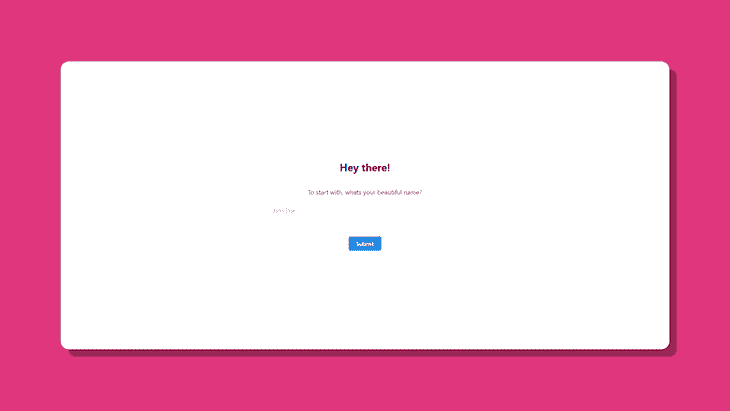
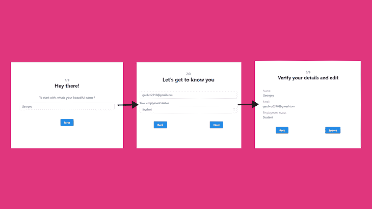
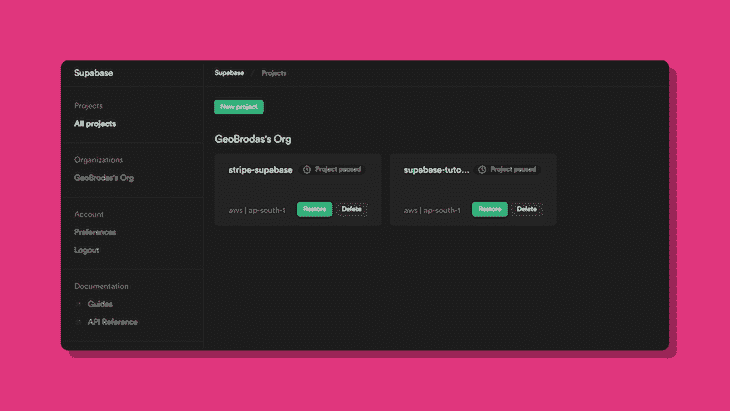
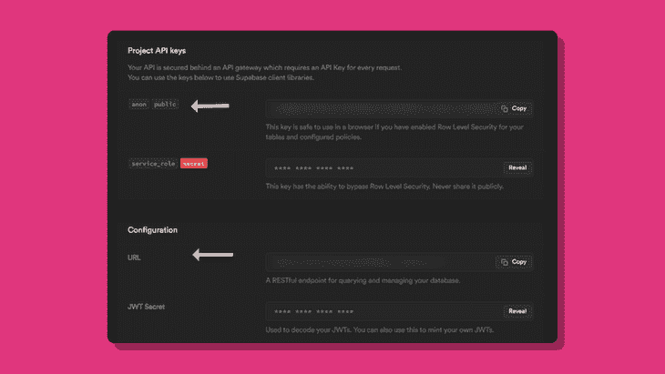
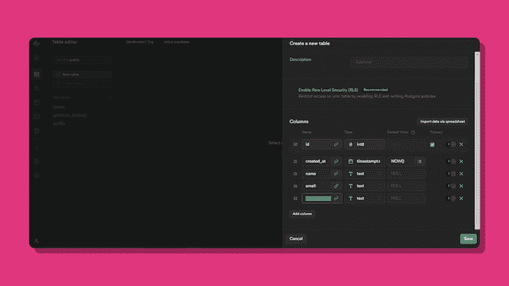

# 如何只用 useState Hook 构建多步表单

> 原文：<https://blog.logrocket.com/build-multi-step-form-usestate-hook/>

表单是大多数应用程序的重要组成部分。在不同的建筑模板包中有很多可用的包。在本文中，我们将使用`useState`钩子构建一个多步表单，而不使用任何第三方包，同时实现相同的功能。

本教程的主要重点是分析多步表单的逻辑。我们将跳过大部分的样式部分，所以如果你在某个地方卡住了，看看这个[库](https://github.com/GeoBrodas/multi-step-supabase)。

以下是我们将在本教程中涉及的内容，因此您可以随意跳到您想要的任何部分:

## 初始化启动文件

让我们通过输入以下命令来安装一个新的 Next.js 项目:

```
npx create-next-app mulitstep-form

```

如果您愿意，React 项目也可以很好地工作。要安装新的 React 项目，请输入以下内容:

```
npx create-react-app multistep-form 

```

样式是可选的，但如果你想跟着做，我们将在这个项目中使用 Mantine CSS。

**安装 Mantine CSS**

```
npm install @mantine/core @mantine/next @mantine/hooks

```

在这里遵循 Next.js [的设置指南。](https://mantine.dev/theming/next/)

接下来，让我们为多步表单中的每一步构建一些组件。

首先，我们将构建`Form`组件，它将处理大部分表单逻辑。继续在`./components/Form.js`创建一个新文件。

```
import { Box, Button, Title } from '@mantine/core';

function Form() {
  return (
    <Box
      sx={boxStyle}
    >
      <Title
        sx={{
          textAlign: 'center',
        }}
        order={2}
      >
        Hey there!
      </Title>
        {/* Steps */}
      <Button>Submit</Button>
    </Box>
  );
}
export default Form;

```

(注意:这里，术语“步骤”只是指多步骤形式的不同阶段)

接下来，让我们完成表单的第一步——一条简单的介绍性消息。

在`./components/First/index.js`中创建一个新文件:

```
import { Box, Text, TextInput } from '@mantine/core';
function First() {
  return (
    <Box
      sx={boxStyle}
    >
      <Text>To start with, whats your beautiful name?</Text>
      <Box
        sx={{
          margin: '1rem 0',
        }}
      >
        <TextInput
          placeholder="John Doe"
          required
        />
      </Box>
    </Box>
  );
}
export default First;

```

您的输出现在应该是这样的:



## 使用`useState`钩在组件之间移动

接下来，我们将使用`useState`钩子在不同的步骤之间移动。

到目前为止，我们只完成了一个步骤，但是您可以随意添加您自己的步骤。下面是本教程中的流程图。



现在组件准备好了，让我们添加在组件之间切换的逻辑。

初始化一个新的`useState`钩子，初始值为 0。

```
const [page, setPage] = useState(0);

```

创建另一个函数，根据`page`值有条件地呈现不同的组件:

```
import First from './First';
import SecondStep from './Second';
import ThirdStep from './Third';

export default function Form () {
  const conditionalComponent = () => {
    switch (page) {
      case 0:
        return <First />;
      case 1:
        return <SecondStep />;
       case 2:
         return <ThirdStep />;
       default:
         return <First />;
    }
  }; 

return (
    <>
      <Box>
        {conditionalComponent()}
      </Box>
    </>
  )
}

```

接下来，让我们创建一个按钮，它在`onClick`将`page`的值增加 1:

```
//...imports
import { Button } from "@mantine/core"

export default function Form () {
  // stuff

  function handleSubmit () {
    //...stuff
  }

  return (
    <>
      {conditionalComponent()}
      <Button onClick={handleSubmit}>
        { page === 0 || page === 1 ? "Next" : "Submit" }
      </Button>
    </>
  )
}

```

同时，在`handleSubmit`函数中，我们将增加页面。在本文前面，我们将添加验证并使用`fetch` API 将数据发送到 Supabase 实例。

```
function handleSubmit () {
  setPage(page + 1);
}

```

同样，我们需要一个按钮和一个函数来返回到之前的`page`。如果用户在第一页，则不会显示后退按钮，因此:

```
{
  page > 0 && <Button onClick={() => setPage(page - 1)}>Back</Button>
}

```

## 跟踪表单数据

为了跟踪用户输入，我们将创建另一个`useState`钩子。

```
const [formData, setFormData] = useState({
  name: '',
  email: '',
  employment_status: null
});

```

接下来，我们将把`formData`和`setFormData`作为道具传递给每个条件组件。

```
const conditionalComponent = () => {
   switch (page) {
    case 0:
       return <First formData={formData} setFormData={setFormData} />;
     case 1:
      return <SecondStep formData={formData} setFormData={setFormData} />;
    case 2:
      return <ThirdStep formData={formData} setFormData={setFormData} />;
    default:
      return <First formData={formData} setFormData={setFormData} />;
  }
};

```

为了从输入字段中获取表单数据，我们将利用`Input`字段中的`value`和`onChange`属性。

```
import { Box, Text, TextInput } from '@mantine/core';

function First({ formData, setFormData }) {
  return (
    <Box
      sx={boxStyle}
    >
      <Text>To start with, whats your beautiful name?</Text>
      <Box>
        <TextInput
          onChange={(e) => {
            setFormData({
              ...formData,
              name: e.target.value,
            });
          }}
          value={formData.name}
          placeholder="John Doe"
          required
        />
      </Box>
    </Box>
  );
}

export default First;

```

这里发生了两件事:

*   `value`属性包含相应的`Input`字段的当前值
*   每当用户试图更改`Input`字段时，就会调用`onChange`属性

`select`组件作为受控输入，如下所示:

```
<Select
    data={[
    { value: 'Student', label: 'Student' },
    { value: 'Employed', label: 'Employed' },
    { value: 'Business', label: 'Business' },
   ]}
    onChange={(e) => {
    console.log(e);
    setFormData({ ...formData, employment_status: e });
   }}
   value={formData.employment_status}
   sx={selectInputStyle}
   label="Your emplyment status"
   placeholder="Choose one"
/>

```

这里，代替`e.target.value`，我们简单地将`e`对象作为一个整体传递。确保除了在`Select`组件内的`data`道具中的字符串之外，不要传递任何其他东西。

在最后一步中，我们将简单地显示表单数据供用户交叉检查和验证，如果需要，还可以让用户选择返回并更改之前输入的内容。

因为我们在最后一个组件中没有任何输入字段，所以只需传递`formData`并相应地显示它们:

```
import { Box, Text } from '@mantine/core';
import Detail from '../Detail';

function ThirdStep({ formData }) {
  const boxStyle = {
    width: '70%',
    margin: '1rem auto',
    textAlign: 'center',
    padding: '1rem 0',
  };

  return (
    <Box sx={{ ...boxStyle, textAlign: 'left' }}>
      <Detail title="Name" data={formData.name} />
      <Detail title="Email" data={formData.email} />
      <Detail title="Employment status" data={formData.employment_status} />
    </Box>
  );
}
export default ThirdStep;

```

`Detail`组件看起来像这样:

```
import { Box, Text } from '@mantine/core';

function Detail({ title, data }) {
  return (
    <Box
      sx={{
        margin: '10px 0',
      }}
    >
      <Text weight={300}>{title}</Text>
      <Text>{data}</Text>
    </Box>
  );
}

export default Detail;

```

完成后，您的多步骤表单现在可以无缝地跟踪表单数据。

* * *

### 更多来自 LogRocket 的精彩文章:

* * *

## 添加表单验证

接下来，我们将添加表单验证，以接受来自用户的有效数据。

在`handleSubmit`函数中，我们将创建一个`if...else`流来检查每页上的输入字段，并随后将用户移动到下一页。

```
function handleSubmit () {
  if (page === 0) {
    // do form validation
  } else if (page === 1) {
    // do form validation again
  } else if (page === 2) {
    // set page === 0 , and clear fields
  } else setPage(page + 1);
} 

```

在第一个`if`语句中:

```
if (page === 0) {
  if (formData.name === '' || formData.name.length <= 1) {
    return alert('Please enter your name');
  } else {
    setPage(page + 1);
    console.log(formData);
  }
}

```

这里，如果`name`字段为空或者长度小于 1，则显示一个`alert`框。

类似地，我们向第二个页面添加以下验证，它由一个电子邮件地址字段和一个用于`employment_status`的字段组成:

```
else if (page === 1) {
  if (formData.email === '' || !formData.email.includes('@')) {
    return alert('Please enter a valid email');
  } else if (!formData.employment_status) {
    return alert('Please select your employment status');
  } else {
    setPage(page + 1);
    console.log(formData);
  }
}

```

这里，我们将首先检查电子邮件是否存在，或者电子邮件是否包含“@”符号。如果它通过了第一次检查，那么我们将检查`employment_status`字段是否包含任何内容；否则，我们增加`page`并记录数据。

对于最后一页，我们只想显示表单数据，因此将`page`设置为 0 并清除所有输入字段就足够了。

```
else if (page === 2) {
  setPage(0);
  console.log(formData);
  setFormData({
     name: '',
     email: '',
     employment_status: null,
  });
}

```

这就是我们所有的验证！

## 设置超级数据库实例

让我们将表单数据发送到一个新的 Supabase 实例。Supabase 是 Firebase 的开源替代方案。如果您是新用户，请前往 [Supabase](https://app.supabase.io/) 创建一个新帐户。



创建项目后，进入新创建项目的主页，点击`anon key`和`url`。

(注:如果您找不到您的密钥，请尝试在**设置** > **API** 中找到它们)



完成后，现在安装 Supabase SDK，使用:

```
npm install @supabase/supabase-js

```

在`./lib/supabase.js`新建一个文件，导出 Supabase 客户端，如下图所示。

```
import { createClient } from '@supabase/supabase-js';

export const supabase = createClient(
  process.env.NEXT_PUBLIC_SUPABASE_URL,
  process.env.NEXT_PUBLIC_SUPABASE_KEY
)

```

对于环境变量，在根目录下创建一个名为`.env.local`的新文件，并传递密钥。

```
NEXT_PUBLIC_SUPABASE_KEY=<Your key>
NEXT_PUBLIC_SUPABASE_URL=<Your url>

```

## 向超级数据库表发送数据

返回到新创建的 Supabase 实例，并在表编辑器中创建一个新表。



为了处理 Supabase 逻辑，我们将创建一个单独的 Next.js API 路由，从而通过本机 Fetch API 发出一个`POST`请求。

继续在`./pages/api/post-supabase.js`创建一个新的 Next.js API 路径。

```
async function handler (req, res) {
  // server-side logic
}

export default handler;

```

现在，由于我们有了一个传递表单数据的 API 路径，我们可以添加另一层保护来验证表单数据。客户端验证并不总是可靠的，所以在将用户数据保存到 Supabase 表之前，也应该总是实现服务器端验证。

在`handler`函数内部，我们将首先检查 fetch 方法是否为`POST`。

```
async function handler (req, res) {
  if(req.method === 'POST') {
    // post logic
    return res.status(200).json({message: "Success"});
  }
}

```

接下来，从请求体中析构所有表单数据，如下所示:

```
if(req.method === "POST") {
  const { name, email, employment_status } = req.body;
}

```

接下来，我们将执行服务器端验证:

```
if(req.method === "POST") {
  const { name, email, employment_status } = req.body;

    // server-side validation
    if (!name || name.length <= 3) {
      return res.status(400).json({
        status: 'fail',
        message: 'Please enter your name',
      });
    } else if (!email || !email.includes('@')) {
      return res.status(400).json({
        status: 'fail',
        message: 'Please enter a valid email',
      });
    } else if (!employment_status) {
      return res.status(400).json({
        status: 'fail',
        message: 'Please select your employment status',
      });
    }
}

```

在这种情况下，如果有人试图篡改客户端验证或执行 MITM 攻击，服务器仍然能够拒绝表单数据，并发回错误响应。

验证完成后，剩下的工作就是将表单数据发送到 Supabase 表。为此，导入 Supabase 客户端并调用`insert`方法。

```
import { supabase } from 'utils/supabase';

async function handler (req, res) {
  // ...server-side validation 
  try {
    await supabase.from('formdata').insert({
      name,
      email,
      employment_status,
    });
    return res
        .status(200)
        .json({ success: true, message: 'Post successful' });
  } catch (error) {
    console.log(error.response.data.message);
    return res.status(500).json({
        status: 'fail',
        message: 'Something went wrong',
      });
  }
}

```

`.from`是要插入数据的表格。现在这已经完成了，当用户点击按钮提交时，我们将从客户端向这个 API 路由发出一个`POST`请求。

回到`handleSubmit`函数，在这里我们编写了`page === 2`的提交逻辑。让我们对 API 路由`/api/post-supabase`调用一个获取请求:

```
try {
    await fetch('/api/post-supabase', {
    method: 'POST',
    headers: {
      'Content-Type': 'application/json',
    },
    body: JSON.stringify(formData),
  });
    setFormData({
    name: '',
    email: '',
    mployment_status: null,
    });
    setPage(0);
  } catch (error) {
    console.log(error);
}

```

如果`fetch`方法按预期运行，我们将重置表单数据并将`page`设置为 0，如果出现任何错误，我们将简单地记录错误(您也可以将其显示为警报)。

继续并尝试多步表单——您应该能够在 Supabase 表中看到一个新条目。

## 结论

在这篇博文中，我们学习了如何创建多步表单。使用`useState`钩子，我们成功地创建了易于操作的表单。

我们可以创建具有验证功能的表单，并且可以轻松重用，而不需要为不同的用例创建新的表单。最重要的是，我们构建了这个多步表单，没有任何第三方包，比如 React-Stepzilla。

## [LogRocket](https://lp.logrocket.com/blg/react-signup-general) :全面了解您的生产 React 应用

调试 React 应用程序可能很困难，尤其是当用户遇到难以重现的问题时。如果您对监视和跟踪 Redux 状态、自动显示 JavaScript 错误以及跟踪缓慢的网络请求和组件加载时间感兴趣，

[try LogRocket](https://lp.logrocket.com/blg/react-signup-general)

.

[ ](https://lp.logrocket.com/blg/react-signup-general) [](https://lp.logrocket.com/blg/react-signup-general) 

LogRocket 结合了会话回放、产品分析和错误跟踪，使软件团队能够创建理想的 web 和移动产品体验。这对你来说意味着什么？

LogRocket 不是猜测错误发生的原因，也不是要求用户提供截图和日志转储，而是让您回放问题，就像它们发生在您自己的浏览器中一样，以快速了解哪里出错了。

不再有嘈杂的警报。智能错误跟踪允许您对问题进行分类，然后从中学习。获得有影响的用户问题的通知，而不是误报。警报越少，有用的信号越多。

LogRocket Redux 中间件包为您的用户会话增加了一层额外的可见性。LogRocket 记录 Redux 存储中的所有操作和状态。

现代化您调试 React 应用的方式— [开始免费监控](https://lp.logrocket.com/blg/react-signup-general)。