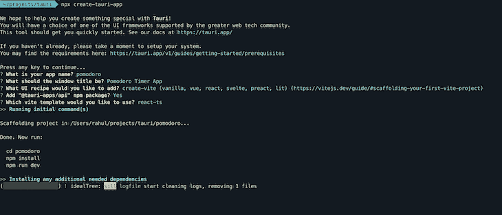
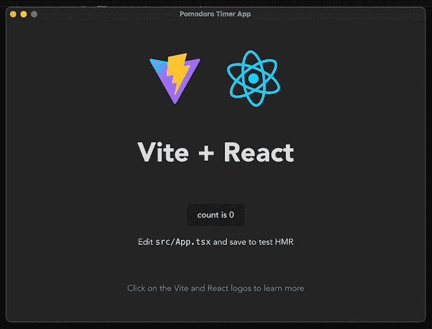
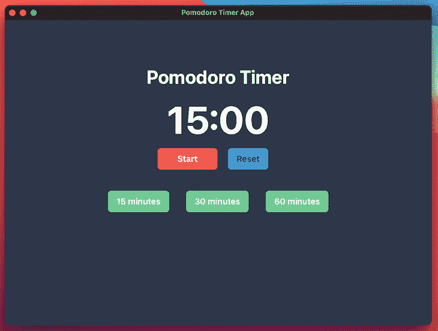
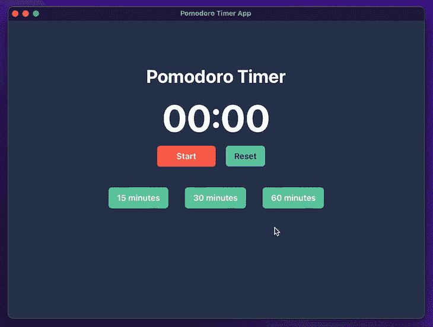

# 使用 React 和 Vite - LogRocket Blog 用 Tauri 构建番茄定时器

> 原文：<https://blog.logrocket.com/build-pomodoro-timer-tauri-using-react-and-vite/>

Tauri 是一套工具，可以让你使用前端框架构建跨平台的桌面应用。当与 React 和 [Vite](https://blog.logrocket.com/vite-3-vs-create-react-app-comparison-migration-guide/) 结合使用时，它可以用于为所有桌面平台构建速度极快的二进制文件。

开发人员可以使用 Tauri 编写安全、精简、快速的跨平台桌面应用程序，并使用 web 技术。对于许多开发人员来说，Electron 通常是这些应用的首选框架，但 Tauri 现在已经做好了竞争的准备。

在本帖中，我们将构建一个简单的番茄定时器，我邀请你按照自己的进度跟随这个教程。

## Tauri 是什么？

是“[快得惊人](https://tauri.app/about/benchmarks/)”(他们的话，不是我的；但请点击链接查看基准并自行决定),因为它使用 Rust 作为后端(与 Node 相比),生成更小的二进制文件，并且比 Node 更安全。

它使用底层操作系统提供的 WebView 来呈现应用程序的 UI——这是应用程序二进制文件较小(与 electronic 相比)的原因之一。Tauri 工具包中的 WRY 库提供了一个统一的接口来与不同操作系统提供的 WebViews 进行交互。WRY 库使用 Tao 板条箱进行跨平台窗口管理。

Tauri 将所有这些结合在一起，使开发人员能够编写强大的高性能桌面应用程序。

## 先决条件

在我们开始之前，我们需要安装一些东西。

### 锈

要安装 Rust，请打开您的终端并运行:

```
curl --proto '=https' --tlsv1.2 -sSf https://sh.rustup.rs | sh

```

如果您使用的是 Windows，请遵循这些说明[。](https://forge.rust-lang.org/infra/other-installation-methods.html)

### npm

npm 是节点的程序包管理器。它是与 Node 捆绑在一起的，所以如果您的系统上安装了 Node，您很可能也安装了 npm。

如果你没有 Node，用[自制软件](https://brew.sh/)安装它，

```
brew install node

```

安装了 npm 和 Rust 之后，我们就可以开始使用 Tauri 开发应用了！

## 用 create-tauri-app 搭建 Tauri 应用程序

既然先决条件现在已经安装好了，我们可以开始开发 pomodoro timer 桌面应用程序了。Tauri 的人们用[**create-Tauri-app**](https://www.npmjs.com/package/create-tauri-app)NPM 包让搭建一个应用程序变得超级简单。

要开始，请运行:

```
npx create-tauri-app

```

运行此命令后，您需要输入一些信息:

*   项目的名称
*   将在其中加载应用程序的窗口的标题
*   UI 配方
*   要使用的模板

对于这个教程应用程序，我用下面的，发现如下👇

*   项目名称为`pomodoro`
*   窗口标题为`Pomodoro Timer App`
*   UI 配方为`create-vite`
*   要使用的模板`react-ts`



点击“Enter”将安装所有必需的包，并在与项目名称同名的文件夹下输出一个脚手架项目。

我们现在已经准备好第一次运行这个项目了！

要运行项目，请运行:

```
cd pomodoro // cding into the project folder
npm run tauri dev //running the app

```

这将首先启动前端服务器，然后将下载板条箱(如有必要)并编译 Rust 后端。一旦编译没有任何错误，应用程序将启动，你会看到这样的问候:



项目文件夹包含许多重要的文件和文件夹。我们将在本教程中处理的两个问题是:

*   `src`文件夹
*   `src-tauri/tauri.config.json`文件

第一次运行应用程序需要一些时间，因为应用程序需要下载和编译必要的 rust crates。

(注:对于使用 macOS 进行开发的人:如果你运行命令启动应用程序，而应用程序窗口出现在全屏应用程序上，你将无法移动应用程序窗口。这是一个已知的 bug，可以在这里 [追踪](https://github.com/tauri-apps/tauri/issues/4310)

## 构建前端

我们将使用 [ChakraUI](https://chakra-ui.com/) 作为 UI 组件和样式。要设置 ChakraUI，请遵循他们的[入门指南](https://chakra-ui.com/getting-started)。

我们将在下面建立用户界面。



以下是我们的应用程序的要求:

*   应该有一个“开始”和“暂停”按钮，启动和停止计时器
*   一旦计时器达到“0”，触发通知用户
*   选择间隔长度的选项，即 15 分钟。，30 分钟。、和 60 分钟。
*   “重置”按钮，将计时器重置为初始值

首先，前往`src/App.tsx`。

```
// src/App.tsx
import { Button, Flex, Text } from "@chakra-ui/react";
import { useEffect, useState } from "react";

function App() {
  const [time, setTime] = useState(0);
  const [timerStart, setTimerStart] = useState(false);
  const buttons = [
    {
      value: 900,
      display: "15 minutes",
    },
    {
      value: 1800,
      display: "30 minutes",
    },
    {
      value: 3600,
      display: "60 minutes",
    },
  ];
  const toggleTimer = () => {
    setTimerStart(!timerStart);
  };
  useEffect(() => {
    const interval = setInterval(() => {
      if (timerStart) {
        if (time > 0) {
          setTime(time - 1);
        } else if (time === 0) {
          // TODO: Send notification to user.
          clearInterval(interval);
        }
      }
    }, 1000);
    return () => clearInterval(interval);
  }, [timerStart, time]);
  return (
    <div className="App" style={{ height: "100%" }}>
      <Flex
        background="gray.700"
        height="100%"
        alignItems="center"
        flexDirection="column"
      >
        <Text color="white" fontWeight="bold" marginTop="20" fontSize="35">
          Pomodoro Timer
        </Text>
        <Text fontWeight="bold" fontSize="7xl" color="white">
          {`${
            Math.floor(time / 60) < 10
              ? `0${Math.floor(time / 60)}`
              : `${Math.floor(time / 60)}`
          }:${time % 60 < 10 ? `0${time % 60}` : time % 60}`}
        </Text>
        <Flex>
          <Button
            width="7rem"
            background="tomato"
            color="white"
            onClick={toggleTimer}
          >
            {!timerStart ? "Start" : "Pause"}
          </Button>
          {/* TODO: Add Button to reset timer */}
        </Flex>
        <Flex marginTop={10}>
          {buttons.map(({ value, display }) => (
            <Button
              marginX={4}
              background="green.300"
              color="white"
              onClick={() => {
                setTimerStart(false);
                setTime(value);
              }}
            >
              {display}
            </Button>
          ))}
        </Flex>
      </Flex>
    </div>
  );
}
export default App;

```

这里，我们使用 ChakraUI 的内置组件来设置按钮和文本的布局。`useEffect`钩子中的`setTimeout`通过每秒设置状态来驱动 UI。

效果重新运行:

*   当用户点击持续时间按钮时(这将设置`timerStart`和`time`状态值)
*   当用户点击开始/暂停按钮时(这将设置`timerStart`状态值)
*   每过一秒钟(`setTimeout`触发对`time`值的更新，见第 29 行)

为了以一致的格式(mm:ss)显示时间，我们需要做一些数学运算。这当然不是完美的，但它做的工作。

这里有两个待办事项:

*   **添加复位按钮**
    *   点击这个按钮，会触发一个本地对话框，要求用户确认操作
*   **添加通知触发器**
    *   当计时器计时到 0 时，需要向用户发送通知

但是，在我们开始处理这些项目之前，我们需要添加我们将在`src-tauri/tauri.config.json`文件中调用的本地 API。如果我们不做这一步，我们将无法触发原生元素。

所以，转到`src-tauri/tauri.config.json`并把这个加到`tauri.allowlist`:

```
  "tauri": {
    "allowlist": {
      // other allowed items
      "notification": {
        "all": true
      },
      "dialog": {
        "all": true
      }
    }    
  }

```

(注:为了简单起见，`dialog`和`notification`都是允许的。我们可以更具体地避免不必要的访问)

## 触发通知并添加重置计时器按钮

```
// src/App.tsx
import { Button, Flex, Text } from "@chakra-ui/react";
import { useEffect, useState } from "react";
+ import { sendNotification } from "@tauri-apps/api/notification";
+ import { ask } from "@tauri-apps/api/dialog";
function App() {
  const [time, setTime] = useState(0);
  const [timerStart, setTimerStart] = useState(false);
  const buttons = [
    {
      value: 900,
      display: "15 minutes",
    },
    {
      value: 1800,
      display: "30 minutes",
    },
    {
      value: 3600,
      display: "60 minutes",
    },
  ];
  const toggleTimer = () => {
    setTimerStart(!timerStart);
  };
+ const triggerResetDialog = async () => {
+   let shouldReset = await ask("Do you want to reset timer?", {
+     title: "Pomodoro Timer App",
+     type: "warning",
+   });
+   if (shouldReset) {
+     setTime(900);
+     setTimerStart(false);
+   }
+ };
  useEffect(() => {
    const interval = setInterval(() => {
      if (timerStart) {
        if (time > 0) {
          setTime(time - 1);
        } else if (time === 0) {
+         sendNotification({
+           title: `Time's up!`,
+           body: `Congrats on completing a session!🎉`,
+         });
          clearInterval(interval);
        }
      }
    }, 1000);
    return () => clearInterval(interval);
  }, [timerStart, time]);
  return (
    <div className="App" style={{ height: "100%" }}>
      <Flex
        background="gray.700"
        height="100%"
        alignItems="center"
        flexDirection="column"
      >
        <Text color="white" fontWeight="bold" marginTop="20" fontSize="35">
          Pomodoro Timer
        </Text>
        <Text fontWeight="bold" fontSize="7xl" color="white">
          {`${
            Math.floor(time / 60) < 10
              ? `0${Math.floor(time / 60)}`
              : `${Math.floor(time / 60)}`
          }:${time % 60 < 10 ? `0${time % 60}` : time % 60}`}
        </Text>
        <Flex>
          <Button
            width="7rem"
            background="tomato"
            color="white"
            onClick={toggleTimer}
          >
            {!timerStart ? "Start" : "Pause"}
          </Button>
+         <Button
+           background="blue.300"
+           marginX={5}
+           onClick={triggerResetDialog}
+         >
+           Reset
+         </Button>
        </Flex>
        <Flex marginTop={10}>
          {buttons.map(({ value, display }) => (
            <Button
              marginX={4}
              background="green.300"
              color="white"
              onClick={() => {
                setTimerStart(false);
                setTime(value);
              }}
            >
              {display}
            </Button>
          ))}
        </Flex>
      </Flex>
    </div>
  );
}
export default App;

```

Tauri 提供了一个 [JS/TS API](https://www.npmjs.com/package/@tauri-apps/api) 包，用于从 Rust 后端调用函数。必要的包已经被`create-tauri-app`实用程序安装好了，所以我们可以直接导入 npm 包并在我们的前端代码中使用它。

要触发通知:

*   从通知模块导入`sendNotification`函数
*   调用前端代码中的函数(见第 42 行)。更多关于 API [的信息，请点击这里](https://tauri.app/v1/api/js/modules/notification#sendnotification)

要触发对话:

*   从对话框模块导入`ask`功能
*   调用前端代码中的函数。第一个参数是将出现在对话框中的文本(见第 27 行)。更多关于 API [的信息，请点击这里](https://tauri.app/v1/api/js/modules/dialog#ask)
*   因为它需要用户输入，该函数返回一个带有布尔值的承诺，所以我们可以`await`它来获得用户点击的值
*   如果用户接受，我们将时间值重置为 15 分钟。并且如果计时器已经在运行，则停止计时器

最后，要运行应用程序，运行`npm run tauri dev`。



## 构建应用程序

可以通过运行以下命令来构建用于分发的应用程序:

```
cargo tauri build

```

这将构建应用程序并在`src-tauri/target/release`下创建一个二进制文件。

现在，app 准备[发布](https://tauri.app/v1/guides/distribution/publishing/)！

## 结论

就是这样！感谢您阅读我关于使用 Tauri 与 Vite 和 React 构建应用程序的演练。如果您有任何问题/建议，请随时通过 Twitter [@rahulnpadalkar](https://twitter.com/rahulnpadalkar) 联系我。你可以在这里找到 GitHub repo 与[的所有代码](https://github.com/rahulnpadalkar/PomodoroTimer)。

## 使用 LogRocket 消除传统反应错误报告的噪音

[LogRocket](https://lp.logrocket.com/blg/react-signup-issue-free)

是一款 React analytics 解决方案，可保护您免受数百个误报错误警报的影响，只针对少数真正重要的项目。LogRocket 告诉您 React 应用程序中实际影响用户的最具影响力的 bug 和 UX 问题。

[ ](https://lp.logrocket.com/blg/react-signup-general) [  ](https://lp.logrocket.com/blg/react-signup-general) [LogRocket](https://lp.logrocket.com/blg/react-signup-issue-free)

自动聚合客户端错误、反应错误边界、还原状态、缓慢的组件加载时间、JS 异常、前端性能指标和用户交互。然后，LogRocket 使用机器学习来通知您影响大多数用户的最具影响力的问题，并提供您修复它所需的上下文。

关注重要的 React bug—[今天就试试 LogRocket】。](https://lp.logrocket.com/blg/react-signup-issue-free)