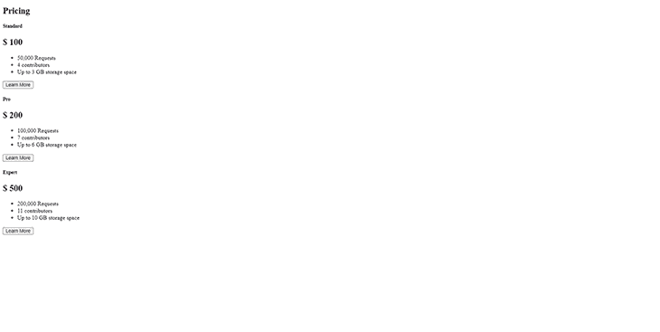
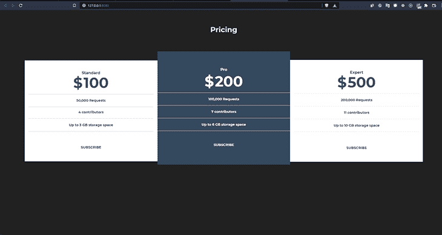
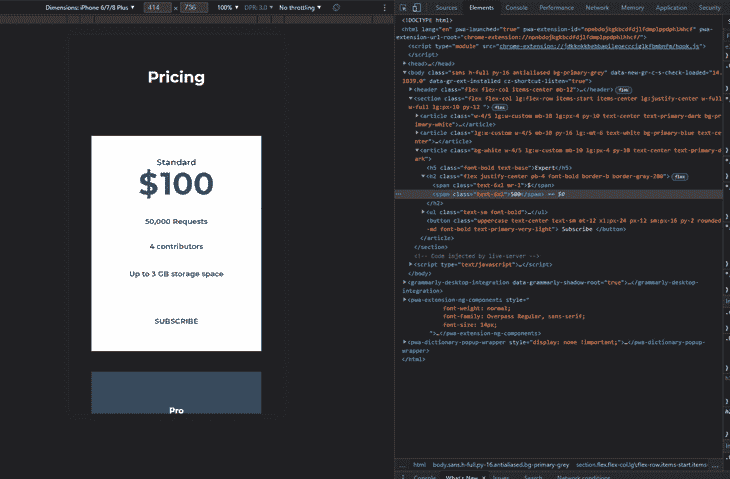

# 使用 Tailwind CSS 从头开始构建定价组件

> 原文：<https://blog.logrocket.com/build-pricing-component-tailwind-css-from-scratch/>

编者按:这篇文章于 2021 年 11 月 8 日更新，以取代教程，增加了一个关于提取组件实用程序类的部分，并删除了过时的信息。

在本文中，我们将使用 HTML 和 Tailwind CSS(一个实用程序优先的 CSS 框架)从头开始构建一个简单的响应式价格表组件。

## 为什么是顺风？

Tailwind 没有提供预配置的样式和组件来构建——相反，它提供了一组非个性化的构建块，称为实用程序或助手类，来帮助您设计组件的样式。这有助于创建自定义设计，而不必覆盖不需要的样式。
此外，它给了你通过直接添加 CSS 类到 HTML 来构建自定义界面的灵活性。

我们将使用 HTML 和 Tailwind CSS 复制这个组件的设计。


## 入门指南

确保您安装了以下软件:

首先，让我们创建项目目录:

```
mkdir pricing-component

```

接下来，将目录更改为创建的文件夹:

```
cd pricing-component

```

继续创建一个`Index.html`文件，并在其中包含以下内容:

```
<!DOCTYPE html>
<html lang="en">
<head>
    <meta charset="UTF-8">
    <meta name="viewport" content="width=device-width, initial-scale=1.0">
    <title>Tailwind Pricing Component</title>
</head>
<body>

</body>
</html>

```

## 顺风的安装和使用

要使用 npm 安装 Tailwind，请在终端中键入以下命令:

```
npm i tailwindcss

```

该命令将 Tailwind CSS 的最新稳定版本添加为依赖项。

接下来，继续创建默认配置框架。这有助于使用安装`tailwindcss`包时附带的 Tailwind CLI 实用程序定制您的 Tailwind 安装:

```
npx tailwindcss init

```

该命令在项目的基本目录中创建一个空的`tailwind.config.js`。在这个文件中，你可以[定义任何定制](https://tailwindcss.com/docs/configuration/)。

或者，您可以通过 CDN 引入最新的默认配置构建，并将其链接到 HTML 的`head`标签中，从而开始使用 Tailwind:

```
<link href="https://unpkg.com/[email protected]^1.0/dist/tailwind.min.css" rel="stylesheet">

```

然而，重要的是要注意，许多 Tailwind CSS 特性在使用 CDN 构建时是不可用的。为了充分利用 Tailwind，你真的应该使用一个包管理器来安装它。

继续在我们的根文件夹中创建一个`css/styles.css`来存放我们的样式表。

## 配置您的风格指南

我们需要在配置文件中定义自定义样式，如宽度、颜色和字体。首先，打开`tailwind.config.js`文件，并在`theme`对象中包含以下内容。

```
fontFamily: {
      'sans': [
        'Montserrat',
        'sans-serif',
      ],
    }

```

接下来，在`theme`对象中创建一个`extend`对象，并包含以下内容:

```
colors:{
    primary: {
          blue: "#34495E",
          grey: "#212121",
          normal: "hsl(233, 13%, 49%)",
          dark: "hsl(232, 13%, 33%)",
          white: "#FFFFFF"
        },
  },
width: {
    custom: '31%'
  }

```

在包含了我们的自定义样式之后，配置文件应该看起来像这样:

```
module.exports = {
  purge: [],
  darkMode: false, // or 'media' or 'class'
  theme: {
    extend: {
      colors: {
        primary: {
          blue: "#34495E",
          grey: "#212121",
          normal: "hsl(233, 13%, 49%)",
          dark: "hsl(232, 13%, 33%)",
          white: "#FFFFFF"
        },
      },
      width: {
        custom: "31%",
      },
    },
    fontFamily: {
      'sans': ["Montserrat", "sans-serif"],
    },
  },
  variants: {},
  plugins: [],
};

```

接下来，运行这个命令，根据我们的`tailwind.config.js`文件中的配置创建一个`tailwind.css`文件。

```
npx tailwindcss -o tailwind.css

```

这会生成一组自以为是的基本样式，并使用 [`modern-normalize`，这解决了您的顺风项目中的跨浏览器问题和不一致性。它还包括配置文件中定义的自定义样式。](https://www.npmjs.com/package/modern-normalize)

接下来，转到我们的`index.html`文件并导入 Montserrat 字体:

```
<link href="https://fonts.googleapis.com/css2?family=Montserrat:[email protected];700;900&display=swap" rel="stylesheet"/>

```

因为我们没有使用 PostCSS，所以您可以运行下面的命令来用我们的顺风样式填充`css/styles.css`:

```
npx tailwindcss build tailwind.css -o css/styles.css

```

然后，继续将您的`css/styles.css`文件导入到您的项目中，或者在您的 JavaScript 文件中，或者作为您的 HTML 文件中的链接，如下所示:

```
<link href="css/styles.css" rel="stylesheet">

```

或者，您也可以直接将`tailwind.css`导入到您的`index.html`文件中。

此外，您可以运行`npx tailwindcss -o tailwind.css --watch`，这样它就可以观察配置文件中的变化并重建我们的`tailwind.css`。

## 创建基本 HTML 结构

我们将开始为我们的设计编写不带样式的 HTML，这使得我们的工作更快，因为我们可以直接从那里开始设计 HTML 的样式。

首先，让我们在 body 标签中创建一个`header`元素。这将包含定价文本和拨动开关。

```
<header class=""> </header>

```

现在，在`header`标签中，我们将添加一个包含文本的`h2`元素。

```
<header class="">
  <h2 class="">Pricing</h2>
</header>

```

让我们继续创建定价表部分。我们将创建一个`section`标记，并在其中创建一个包含我们定价信息的`article`标记:

```
<section class=" ">
  <article class="">
     <h5 class="">Standard</h5>
     <h2 class="">
       <span class="">$</span>
       <span class="l"> 100</span>
     </h2>
     <ul class="">
      <li class="">50,000 Requests</li>
       <li class="">4 contributors</li>
       <li class="">Up to 3 GB storage space</li>
    </ul>
     <button class="">
       Learn More
     </button>
   </article>
</section>

```

最后，我们只需要再复制两次`article`标签，并改变其中的内容:

```
<section class=" ">
   <article class="">
     <h5 class="">Standard</h5>
     <h2 class="">
       <span class="">$</span>
       <span class="l">100</span>
     </h2>
     <ul class="">
       <li class="">50,000 Requests</li>
       <li class="">4 contributors</li>
       <li class="">Up to 3 GB storage space</li>
     </ul>
     <button class="">
      Learn More
     </button>
   </article>
   <article class="">
     <h5 class="">Pro</h5>
     <h2 class="">
       <span class="">$</span>
       <span class="">200</span>
     </h2>
     <ul class="">
       <li class="">100,000 Requests</li>
       <li class="">7 contributors</li>
       <li class="">Up to 6 GB storage space</li>
     </ul>
     <button class="">
       Learn More
     </button>
   </article>
   <article class="">
     <h5 class="">Expert</h5>
     <h2 class="">
       <span class="">$</span>
       <span class="">500</span>
     </h2>
     <ul class="">
       <li class="">200,000 Requests</li>
       <li class="">11 contributors</li>
       <li class="">Up to 10 GB storage space</li>
     </ul>
     <button class="">
       Learn More
     </button>
   </article>
 </section>

```

当我们完成后，我们的 HTML 的内容将看起来像这样:

```
<!DOCTYPE html>
<html lang="en">
  <head>
    <meta charset="utf-8" />
    <meta name="viewport" content="width=device-width, initial-scale=1, shrink-to-fit=no"/>
    <link rel="stylesheet" href="styles/styles.css">
    <title>Welcome to Tailwind!</title>
  </head>
  <body class="">
    <header class="">
      <h2 class="">Pricing</h2>
    </header>
    <section class=" ">
   <article class="">
     <h5 class="">Standard</h5>
     <h2 class="">
       <span class="">$</span>
       <span class="l">100</span>
     </h2>
     <ul class="">
       <li class="">50,000 Requests</li>
       <li class="">4 contributors</li>
       <li class="">Up to 3 GB storage space</li>
     </ul>
     <button class="">
      Learn More
     </button>
   </article>
   <article class="">
     <h5 class="">Pro</h5>
     <h2 class="">
       <span class="">$</span>
       <span class="">200</span>
     </h2>
     <ul class="">
       <li class="">100,000 Requests</li>
       <li class="">7 contributors</li>
       <li class="">Up to 6 GB storage space</li>
     </ul>
     <button class="">
       Learn More
     </button>
   </article>
   <article class="">
     <h5 class="">Expert</h5>
     <h2 class="">
       <span class="">$</span>
       <span class="">500</span>
     </h2>
     <ul class="">
       <li class="">200,000 Requests</li>
       <li class="">11 contributors</li>
       <li class="">Up to 10 GB storage space</li>
     </ul>
     <button class="">
       Learn More
     </button>
   </article>
 </section>
  </body>
</html>

```

输出如下所示:



## 用顺风 CSS 设计我们的定价组件

接下来，让我们开始将样式添加到 HTML 中:

```
<body class="h-full py-16 antialiased bg-primary-very-light sans">
  <header class="flex flex-col items-center mb-12">
    <h2 class="text-3xl text-primary-white font-bold">Pricing</h2>
  </header>

```

下面是我们刚刚在上面的代码中所做的总结:

*   给定标签的高度为 100%
*   通过了`antialiased`的字体平滑
*   将`font-family`改为 Montserrat，这是我们在配置文件中定义的字体
*   向带有`flex-direction: column`的`header`标签添加了一个`flex`类
*   将我们的项目与主轴中心对齐
*   增加了我们定价文本的`font-size`
*   已更改字体颜色

接下来，我们来设计定价卡部分的样式:

```
<section
      class="flex flex-col lg:flex-row items-start items-center lg:justify-center w-full w-full lg:px-10 py-12 "
    >
      <article
        class="w-4/5 lg:w-custom mb-10 lg:px-4 py-10 text-center text-primary-dark bg-primary-white"
      >
        <h5 class="font-bold text-base">Standard</h5>
        <h2 class="pb-4 flex justify-center font-bold border-b border-gray-300">
          <span class="text-6xl mr-1">$</span
          ><span class="text-6xl"> 100</span>
        </h2>
        <ul class="text-sm font-bold">
          <li class="pt-4 pb-4 border-b border-gray-300">50,000 Requests</li>
          <li class="pt-3 pb-4 border-b border-gray-300">4 contributors</li>
          <li class="pt-4 pb-4 border-b border-gray-300">Up to 3 GB storage space</li>
        </ul>
        <button
          class=" uppercase text-center text-sm mt-12 xl:px-24 px-12 sm:px-16 py-2 font-bold text-primary-very-light rounded-md"
        >
        Subscribe
        </button>
      </article>
      <article
        class="lg:w-custom w-4/5 mb-10 py-16 lg:-mt-6 text-white bg-primary-blue text-center"
      >
        <h5 class="font-bold text-base ">Pro</h5>
        <h2
          class="font-bold pb-4 mt-2 border-b border-gray-100 flex justify-center"
        >
          <span class="text-6xl mr-1">$</span
          ><span class="text-6xl "> 200</span>
        </h2>
        <ul class=" text-sm font-bold">
          <li class="pt-4 pb-4 border-b border-gray-200">100,000 Requests</li>
          <li class="pt-4 pb-4 border-b border-gray-200">7 contributors</li>
          <li class="pt-4 pb-4 border-b border-gray-200">Up to 6 GB storage space</li>
        </ul>
        <button
          class="uppercase text-center text-sm mt-10 xl:px-24 px-12 sm:px-16 py-2 rounded-md font-bold bg-primary-very-light text-primary-white"
        >
          Subscribe
        </button>
      </article>
      <article
        class="bg-white w-4/5 lg:w-custom mb-10 lg:px-4 py-10 text-center text-primary-dark"
      >
        <h5 class="font-bold text-base">Expert</h5>
        <h2 class="flex justify-center pb-4 font-bold border-b border-gray-200">
          <span class="text-6xl mr-1">$</span
          ><span class="text-6xl">500</span>
        </h2>
        <ul class="text-sm font-bold">
          <li class="pt-4 pb-4 border-b border-gray-200">200,000 Requests</li>
          <li class="pt-4 pb-4 border-b border-gray-200">11 contributors</li>
          <li class="pt-4 pb-4 border-b border-gray-200">Up to 10 GB storage space</li>
        </ul>
        <button
          class="uppercase text-center text-sm mt-12 xl:px-24 px-12 sm:px-16 py-2 rounded-md font-bold text-primary-very-light"
        >
        Subscribe
        </button>
      </article>
    </section>

```

在这段代码中，我们在较小的屏幕上给了我们的`<section>`一个类`flex`和一个`flex-direction:column`，在较大的屏幕上给了`row`。然后，我们将内容沿主轴居中。

我们还设计了我们的`article`标签，在大屏幕上给它们 31%的宽度，在小屏幕上给它们 80%的宽度。我们还将文本居中对齐，并将第二个价格类别的背景设为`bg-primary-blue`，同时将按钮设为`text-transform: uppercase`。三个价格牌都没有`border-radius`，跟设计一样。



我们最终的代码应该是这样的:

```
<!DOCTYPE html>
<html lang="en">
<head>
    <meta charset="UTF-8">
    <meta name="viewport" content="width=device-width, initial-scale=1.0">
    <link href="https://fonts.googleapis.com/css2?family=Montserrat:[email protected];700;900&display=swap" rel="stylesheet"/>
    <link rel="stylesheet" href="/css/styles.css">
    <title>Tailwind Pricing Component</title>
</head>
<body class="sans h-full py-16 antialiased bg-primary-grey">
    <header class="flex flex-col items-center mb-12">
      <h2 class="text-3xl text-primary-white font-bold">Pricing</h2>
    </header>
    <section
      class="flex flex-col lg:flex-row items-start items-center lg:justify-center w-full w-full lg:px-10 py-12 "
    >
      <article
        class="w-4/5 lg:w-custom mb-10 lg:px-4 py-10 text-center text-primary-dark bg-primary-white"
      >
        <h5 class="font-bold text-base">Standard</h5>
        <h2 class="pb-4 flex justify-center font-bold border-b border-gray-300">
          <span class="text-6xl mr-1">$</span
          ><span class="text-6xl"> 100</span>
        </h2>
        <ul class="text-sm font-bold">
          <li class="pt-4 pb-4 border-b border-gray-300">50,000 Requests</li>
          <li class="pt-3 pb-4 border-b border-gray-300">4 contributors</li>
          <li class="pt-4 pb-4 border-b border-gray-300">Up to 3 GB storage space</li>
        </ul>
        <button
          class=" uppercase text-center text-sm mt-12 xl:px-24 px-12 sm:px-16 py-2 font-bold text-primary-very-light rounded-md"
        >
        Subscribe
        </button>
      </article>
      <article
        class="lg:w-custom w-4/5 mb-10 py-16 lg:-mt-6 text-white bg-primary-blue text-center"
      >
        <h5 class="font-bold text-base ">Pro</h5>
        <h2
          class="font-bold pb-4 mt-2 border-b border-gray-100 flex justify-center"
        >
          <span class="text-6xl mr-1">$</span
          ><span class="text-6xl "> 200</span>
        </h2>
        <ul class=" text-sm font-bold">
          <li class="pt-4 pb-4 border-b border-gray-200">100,000 Requests</li>
          <li class="pt-4 pb-4 border-b border-gray-200">7 contributors</li>
          <li class="pt-4 pb-4 border-b border-gray-200">Up to 6 GB storage space</li>
        </ul>
        <button
          class="uppercase text-center text-sm mt-10 xl:px-24 px-12 sm:px-16 py-2 rounded-md font-bold bg-primary-very-light text-primary-white"
        >
          Subscribe
        </button>
      </article>
      <article
        class="bg-white w-4/5 lg:w-custom mb-10 lg:px-4 py-10 text-center text-primary-dark"
      >
        <h5 class="font-bold text-base">Expert</h5>
        <h2 class="flex justify-center pb-4 font-bold border-b border-gray-200">
          <span class="text-6xl mr-1">$</span
          ><span class="text-6xl">500</span>
        </h2>
        <ul class="text-sm font-bold">
          <li class="pt-4 pb-4 border-b border-gray-200">200,000 Requests</li>
          <li class="pt-4 pb-4 border-b border-gray-200">11 contributors</li>
          <li class="pt-4 pb-4 border-b border-gray-200">Up to 10 GB storage space</li>
        </ul>
        <button
          class="uppercase text-center text-sm mt-12 xl:px-24 px-12 sm:px-16 py-2 rounded-md font-bold text-primary-very-light"
        >
        Subscribe
        </button>
      </article>
    </section>
  </body>
</html>

```

我们最终的设计看起来是这样的:



## 将重复的实用程序类提取到组件中

我们可以通过将重复的实用程序类提取到一个组件中来进一步构建这个组件，比如我们的`article`标签中的样式。例如，我们可以使用`@apply`提取所有的样式并将其分配给一个单独的类，而不是在`<article/>`标签中重复价格卡中的样式。

```
<article class="pricing-card">
  Click me
</article>

<style>
  .pricing-card {
    @apply bg-white w-4/5 lg:w-custom mb-10 lg:px-4 py-10 text-center text-primary-dark;
  }
</style>

```

对于具有重复样式的较小组件也是如此，比如按钮和定价功能。你可以在 LogRocket 博客上[找到更多关于提取组件和类](https://blog.logrocket.com/10-tailwind-css-tips-to-boost-your-productivity/)的信息，也可以在 [Tailwind CSS 的文档](https://tailwindcss.com/docs/extracting-components)中找到。

## 结论

在本文中，我们探讨了如何使用 Tailwind CSS 构建一个响应式定价组件。Tailwind CSS 真的让构建和原型制作变得轻而易举。你可以在 GitHub 上查看这篇文章的资源库，也可以在 Netlify 上查看[托管的演示。](https://tailwind-pricing-component.netlify.app/)

Tailwind 的[文档](https://tailwindcss.com/docs)非常详细，而[视频教程](https://www.youtube.com/playlist?list=PL5f_mz_zU5eXWYDXHUDOLBE0scnuJofO0)也是很好的资源，可以让你了解更多关于这个框架以及如何入门。此外，你可以学习在其他前端框架中使用 Tailwind，比如这篇关于[在 Svelte](https://blog.logrocket.com/how-to-use-tailwind-css-with-svelte/) 中使用 Tailwind 的教程。

## 你的前端是否占用了用户的 CPU？

随着 web 前端变得越来越复杂，资源贪婪的特性对浏览器的要求越来越高。如果您对监控和跟踪生产环境中所有用户的客户端 CPU 使用、内存使用等感兴趣，

[try LogRocket](https://lp.logrocket.com/blg/css-signup)

.

[](https://lp.logrocket.com/blg/css-signup)[https://logrocket.com/signup/](https://lp.logrocket.com/blg/css-signup)

LogRocket 就像是网络和移动应用的 DVR，记录你的网络应用或网站上发生的一切。您可以汇总和报告关键的前端性能指标，重放用户会话和应用程序状态，记录网络请求，并自动显示所有错误，而不是猜测问题发生的原因。

现代化您调试 web 和移动应用的方式— [开始免费监控](https://lp.logrocket.com/blg/css-signup)。