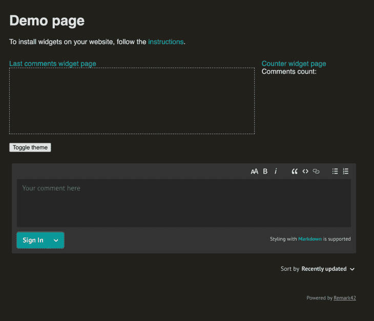
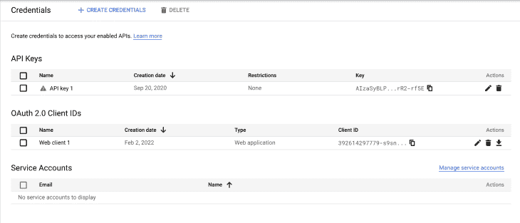
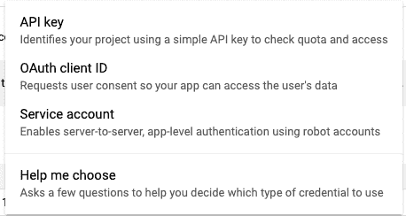
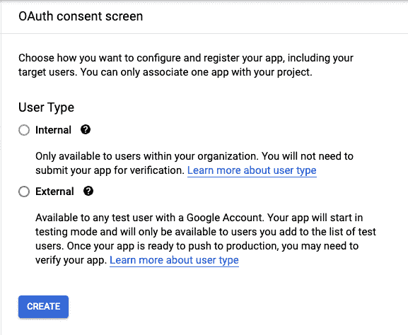
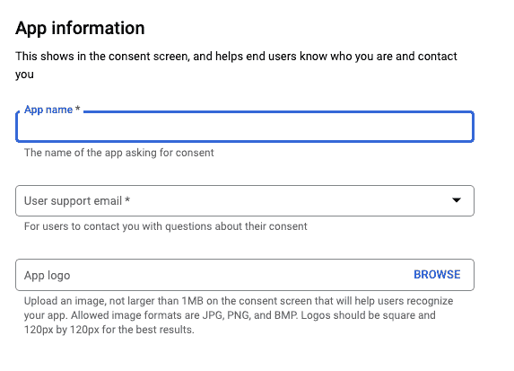
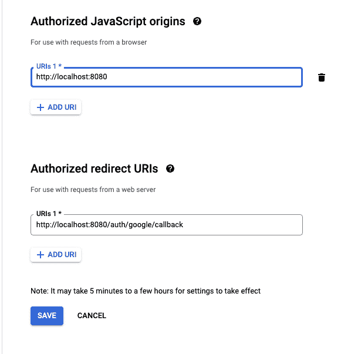
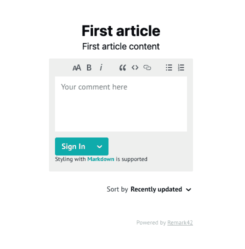
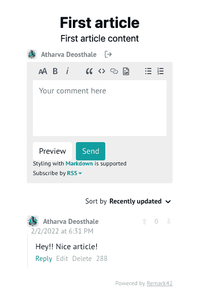
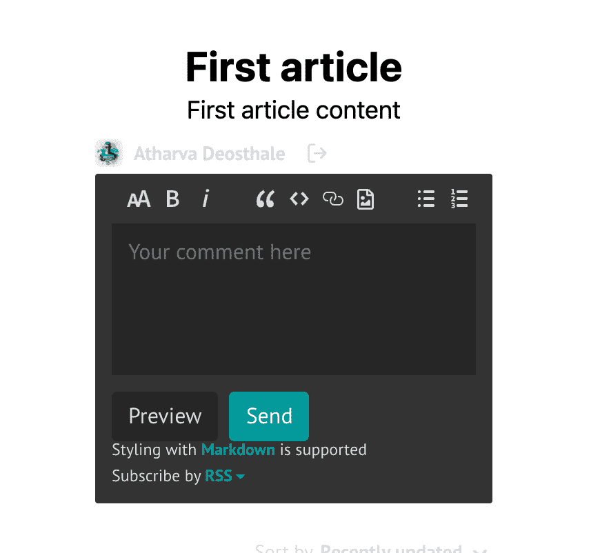
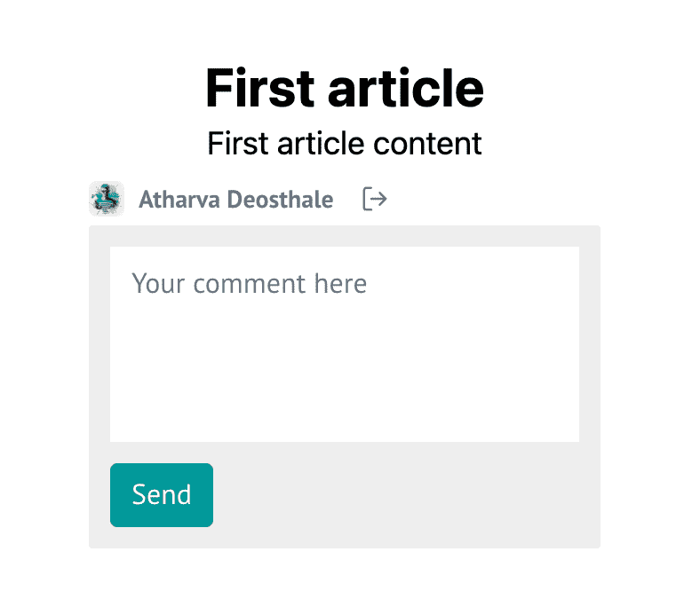

# 在你的 Next.js 博客上建立一个关注隐私的评论区

> 原文：<https://blog.logrocket.com/build-privacy-focused-comments-section-nextjs-blog/>

当你创建一个博客网站的时候，你应该关注的一件事就是评论部分。您可以尝试使用您自己的实现，但是如果您没有太多时间并且希望保持简单，这可能不是最佳选择。一个很好的解决方案是 [Remark42](https://remark42.com/) ，一个评论引擎，它给你控制权，所以你可以在你自己的服务器上托管评论部分。

你也可以在 Remark42 中实现 Google 登录，这样你的读者就不必经历输入邮箱和密码的繁琐过程。每个页面上的评论都是单独跟踪的，因此您不需要跟踪博客帖子来获取评论。

今天，我们将在一个使用 Next.js 和 Tailwind CSS 制作的简单博客应用程序中实现 Remark42。我们将只关注博客的评论部分。Remark42 没有针对 Next.js 的本地实现，但是我已经构建了一个工作区，应该不会引起任何问题。

## 要求

*   [反应](https://blog.logrocket.com/tag/react/)的工作知识
*   [Next.js](https://blog.logrocket.com/tag/nextjs/) 的工作知识
*   您的计算机上安装的节点
*   代码编辑器——我更喜欢 Visual Studio 代码
*   一个谷歌帐户-我们将使用这个来处理谷歌认证
*   MacOS、Windows 或 Linux 系统。我使用的是 MacOS，因此设置服务器的说明应该适用于 MacOS 和 Linux 用户。Windows 用户可以使用 WSL 来使用 Linux 终端，并遵循完全相同的步骤

如果你被困在教程中，或者需要参考代码，请随意参考 [GitHub 库](https://github.com/atharvadeosthale/remark42-article)。

## 设置 Remark42 服务器

让我们设置 Remark42 服务器。这个服务器将是我们所有评论的家，也处理认证。前往[这个链接](https://github.com/umputun/remark42/releases)，下载与你的操作系统相关的二进制文件。对于 MacOS 用户来说，二进制文件应该类似于下面这样:`remark42.darwin-amd64.tar.gz`。

使用合适的提取程序提取您刚刚下载的`tar.gz`档案，并在提取的文件夹中启动一个终端。编写以下命令，将二进制文件转换为可执行文件，以便系统可以运行它:

```
chmod +x remark42.darwin-amd64

```

请确保根据您运行的操作系统替换文件名。现在，您已经将二进制文件转换为可执行文件，您可以使用以下命令运行服务器:

```
./remark42.darwin-amd64 server --site=remark123 --secret=12345 --url=http://localhost:8080

```

确保您在这里使用了唯一的`secret`,因为它将用于签署您的 JSON web 令牌以进行身份验证。也提供一个站点 ID；我提供`remark123`。一旦你运行这个命令，服务器将开始运行，如果你访问[http://localhost:8080/web](http://localhost:8080/web)，你应该会看到这样的演示:



但是，您现在不能发表任何评论，因为我们需要一种适当的方法来验证我们博客中的用户，这是在他们可以发表评论之前所必需的。在这种情况下，我们将使用 Google 认证，然而，Remark42 支持多种认证方式，您可以在这里看到。

## 创建 Google OAuth2 客户端

首先，进入[谷歌云控制台](https://console.cloud.google.com)。如果你还没有项目，创建一个新项目，然后点击工具条上的**凭证**。现在，您应该会看到以下屏幕:



点击顶部的**创建凭证**。您应该会看到一个选项列表:



点击 **OAuth 客户端 ID** ，因为这是用于谷歌认证的。如果您没有 OAuth 同意屏幕，将要求您创建一个:



点击**外部**，然后**创建**。现在，您将被要求提供项目的一些详细信息:



填写相关详细信息并提交表单。现在，返回到**凭证**，创建一个新的 OAuth 客户端 ID，现在不应该要求您创建一个同意屏幕。出现提示时，添加以下详细信息(这些详细信息根据备注 42 的文档):



现在你应该得到你的**客户 ID** 和**客户秘密**。记下它们，但不要与任何人分享这些细节。

现在终止正在运行的 Remark42 服务器，让我们再次启动它，但是这次添加 Google 凭证:

```
./remark42.darwin-amd64 server --secret=12345 --url=http://localhost:8080 --auth.google.cid=392614297779-s9sn37kc587341uk8b2olhpiigg6v9kh.apps.googleusercontent.com --auth.google.csec=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 --site=remark123

```

确保用你自己的证件代替我的。现在点击**进入**，服务器将开始运行。

## 创建 Next.js 应用程序并集成 Remark42

导航到安全目录，运行以下命令创建新的 Next.js 应用程序:

```
npx create-next-app remark42-app --example with-tailwindcss

```

您可以用任何合适的名称替换`remark42-app`，因为它是一个项目名称。我们使用`with-tailwindcss`示例，这样我们就可以预装 Tailwind CSS，并且不需要太担心样式。

进入`pages`目录并打开`index.tsx`文件，然后更新布局如下:

```
import Head from 'next/head'
export default function Home() {
  return (
    <div className="flex min-h-screen flex-col items-center justify-center py-2">
      <Head>
        <title>Create Next App</title>
        <link rel="icon" href="/favicon.ico" />
      </Head>
      <div className="text-3xl font-bold">First article</div>
      <div className="text-lg">First article content</div>
      <div id="remark42">{''}</div>
    </div>
  )
}

```

这将是我们的虚拟博客文章在主页上的基本布局。我们在`div`下使用了`{''}`,因为 Remark42 会导致 Next.js 出现问题，这是对其中一个问题的快速修复。

现在让我们在布局的末尾添加脚本:

```
<script
  dangerouslySetInnerHTML={{
    __html: `
    const remark_config = {
      host: 'http://localhost:8080',
      site_id: 'remark123',
    };
    window.remark_config = remark_config;
          !function(e,n){for(var o=0;o<e.length;o++){var r=n.createElement("script"),c=".js",d=n.head||n.body;"noModule"in r?(r.type="module",c=".mjs"):r.async=!0,r.defer=!0,r.src=remark_config.host+"/web/"+e[o]+c,d.appendChild(r)}}(remark_config.components||["embed"],document);`,
  }}
></script>

```

当您转入生产时，记得更改`host`和`site_id`。同样，这个对象有必要被命名为`remark_config`，因为 Remark42 在初始化时会寻找这个对象。

因为我们在 Next.js 中运行这段代码，所以我们通过将`remark_config`附加到`window`对象来做一个快速修复，这样代码就能正常工作。其余看起来不太好的代码是来自 Remark42 的一个脚本，用来做其他的事情。如果由于某种原因，这段代码不工作，它可能已经改变了，您可能需要从 Remark42 的文档中找到新的脚本。

现在，通过在终端中运行以下命令来运行 Next.js 开发服务器:

```
npm run dev

```

现在服务器应该启动了。访问 [http://localhost:8000](http://localhost:8000) 查看页面:



现在，您可以对页面进行验证并添加评论:



现在，让我们在`pages`目录中创建一个名为`second.js`的新文件来模拟博客中的另一篇文章:

```
import React from 'react'
function Second() {
  return (
    <div className="flex min-h-screen flex-col items-center justify-center py-2">
      <div className="text-3xl font-bold">Second article</div>
      <div className="text-lg">Second article content</div>
      <div id="remark42">{''}</div>
      <script
        dangerouslySetInnerHTML={{
          __html: `
          const remark_config = {
            host: 'http://localhost:8080',
            site_id: 'remark123',
          };
          window.remark_config = remark_config;
          !function(e,n){for(var o=0;o<e.length;o++){var r=n.createElement("script"),c=".js",d=n.head||n.body;"noModule"in r?(r.type="module",c=".mjs"):r.async=!0,r.defer=!0,r.src=remark_config.host+"/web/"+e[o]+c,d.appendChild(r)}}(remark_config.components||["embed"],document);`,
        }}
      ></script>
    </div>
  )
}
export default Second

```

它类似于第一篇文章的代码。理想情况下，您可以从数据库中获取帖子，URL 将是动态的，因此您不必处理重复性。我们这样做只是为了让事情更简单。

现在，如果你访问 http://localhost:3000/second，你应该会看到我们最初的评论已经不存在了，因为这是一个完全不同的页面。这是因为 Remark42 为我们处理不同页面的评论。

## 一些附加配置

您可以使用它提供的各种配置来修改 Remark42 的外观和行为。例如，如果您想实现黑暗模式，您只需按如下方式更新`remark_config`:

```
const remark_config = {
  host: 'http://localhost:8080',
  site_id: 'remark123',
  theme: 'dark',
};

```

这将启用黑暗模式，您的评论部分应该如下所示:



您还可以启用简单视图，这有助于在评论部分保持简单。在简单视图中，没有使用很多 JavaScript，只加载了必要的组件:

```
const remark_config = {
  host: 'http://localhost:8080',
  site_id: 'remark123',
  simple_view: true,
};

```

这应该如下所示:



注意这里不支持格式化文本。你可以在这里找到其余的配置[。](https://remark42.com/docs/configuration/frontend/)

## 结论

如果你正在创建一个博客，但不想让事情变得太复杂，Remark42 是一个很好的工具。你也可以试着调整配置来改变它的整体功能，并使它适合你的博客网站。

同样，如果你被困在教程中或者需要参考代码，这里有 [GitHub 库](https://github.com/atharvadeosthale/remark42-article)。

## [LogRocket](https://lp.logrocket.com/blg/nextjs-signup) :全面了解生产 Next.js 应用

调试下一个应用程序可能会很困难，尤其是当用户遇到难以重现的问题时。如果您对监视和跟踪状态、自动显示 JavaScript 错误、跟踪缓慢的网络请求和组件加载时间感兴趣，

[try LogRocket](https://lp.logrocket.com/blg/nextjs-signup)

.

[](https://lp.logrocket.com/blg/nextjs-signup)[](https://lp.logrocket.com/blg/nextjs-signup)

LogRocket 就像是网络和移动应用的 DVR，记录下你的 Next.js 应用上发生的一切。您可以汇总并报告问题发生时应用程序的状态，而不是猜测问题发生的原因。LogRocket 还可以监控应用程序的性能，报告客户端 CPU 负载、客户端内存使用等指标。

LogRocket Redux 中间件包为您的用户会话增加了一层额外的可见性。LogRocket 记录 Redux 存储中的所有操作和状态。

让您调试 Next.js 应用的方式现代化— [开始免费监控](https://lp.logrocket.com/blg/nextjs-signup)。