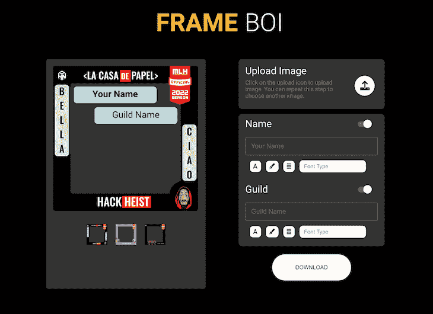
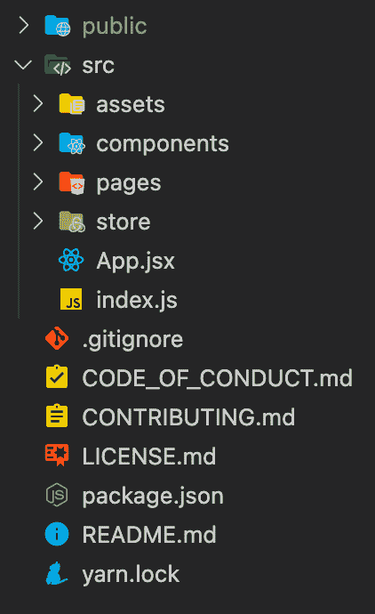
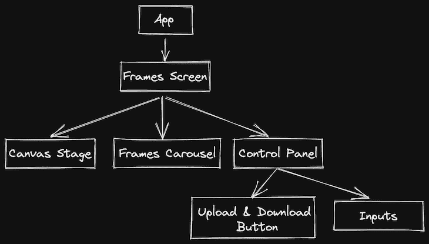
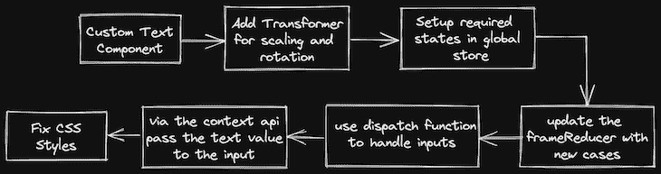

# 用 React Konva 构建一个框架生成器

> 原文：<https://blog.logrocket.com/build-profile-frame-generator-react-konva/>

如果你花时间在社交媒体上，你可能见过你的一个朋友更改他们在脸书的个人资料照片，加入支持他们最喜欢的运动队的框。或者，你可能已经看到了一个同事的 LinkedIn 个人资料，其中有一个关于工作开放性的框架。在本文中，我们将使用 [React Konva](https://github.com/dscnitrourkela/project-icecream/tree/cra-version) 在 React 中构建我们自己的 profile picture frame 生成器。

作为一个例子，我们将使用一个[帧生成器，它是我为我大学的黑客马拉松帮助构建和维护的](https://github.com/dscnitrourkela/project-icecream)。本教程结束时，您将能够构建一个供在线活动参与者使用的个人资料框架生成器。我们的最终输出将如下图所示:



你也可以[看看现场的例子](https://gracious-volhard-22bfe6.netlify.app)。我们开始吧！

## React Konva 是什么？

HTML5 Canvas API 是一个强大的工具，用于在 web 应用中整合动态、高性能的视觉效果。Canvas 支持多种浏览器，并包括用于添加形状、图片和文本的内置 API。像 [Konva.js](https://konvajs.org/) 和 [p5.js](https://p5js.org) 这样的各种实用程序库已经在 Canvas 上创建，以协助事件处理和动画。

Canvas API 本质上是必不可少的，它是通过类似于`ctx.rect(x, y, width, height)`的方法与普通 JavaScript 交互而构建的。这种语法对于 React 开发人员来说是完全陌生的，并且与现代 React 模式不兼容。 [React Konva，Konva.js](https://blog.logrocket.com/canvas-manipulation-react-konva/) 的 React 包装器，允许你使用 React 组件接口连接 Konva API。

### 先决条件

要阅读本文，您应该[熟悉 React 并创建 React 应用程序](https://blog.logrocket.com/getting-started-with-create-react-app-d93147444a27/)。你还应该了解[状态管理工具，如 Redux](https://blog.logrocket.com/why-use-redux-reasons-with-clear-examples-d21bffd5835/) 或 [React 上下文 API](https://blog.logrocket.com/react-context-api-deep-dive-examples/) 。此外，预先了解 React Konva 是有益的。

在本教程中，我们将使用以下技术:React、Create React App、styled-components、React Context API、React Konva 和 Netlify。我们开始吧！

## 入门指南

首先，我们将安装 Yarn 以使我们的开发过程更加顺畅。要运行这个命令，您需要安装 Node.js。您可以使用命令`node --version`检查 Node.js 是否已安装。安装 Node.js 将自动启用`npm`和`npx`命令:

```
# Globally install yarn
npm install -g yarn

```

接下来，我们将使用 Create React App 创建一个基本的 React 应用程序。

```
# Using npm
npx create-react-app profile-frames

# Using yarn
yarn create react-app profile-frames

```

让我们建立一个干净的目录结构；删除 Create React App 附带的所有文件，并创建所需的文件夹和文件，如下所示:



*   `public`:用户可以直接访问该目录下的文件
*   `src`:包含我们将要上传和构建的文件
    *   `assets`:包含所有图像和帧
    *   `components`:包含组件
    *   包含我们应用程序的不同屏幕
    *   `store`:包含处理应用程序全局状态管理的文件

要运行 React 应用程序，在`src`目录下创建`index.js`和`App.jsx`文件，然后添加以下代码:

```
// App.jsx
import React from "react";

const App = () => {
  return (
    <div>
      <h1>Hello World</h1>
    </div>
  );
};

export default App;

// index.js
import React from "react";
import ReactDOM from "react-dom";

import App from "./App";

ReactDOM.render(
  <React.StrictMode>
    <App />
  </React.StrictMode>,
  document.querySelector("#root")
);

```

最后，我们将[安装样式组件](https://blog.logrocket.com/benefits-using-styled-components-react/)并分别为 CSS 样式和画布操作反应 Konva:

```
yarn add styled-components react-konva konva
```

> 在本文中，我们不会详细讨论 CSS 样式。您可以在上面的存储库中找到具体实现的细节。

## 列出我们应用的功能

在我们开始编码之前，最好列出一份我们想要包含的特性的详细清单。我们的应用将包括以下功能，我们将基于此列表构建我们的组件:

*   用户可以与不同的 Konva 元素交互的组件
*   由各种可供用户选择的框架选项组成的旋转木马
*   控制面板由以下部分组成:
    *   一个`upload image`按钮
    *   `Name`和`Guild`输入
    *   一个`Download`按钮

下面的组件架构将适合我们的项目:



## 创建`Canvas`组件

React Konva 有一个名为`Stage`的组件，可以用来渲染各种形状和项目。`Stage`的直接子组件需要是一个`Layer`组件，它可以容纳不同的组件，如图像、文本、形状等。在我们的演示中，一层就能完成任务。

在`components`目录中创建一个名为`Canvas.jsx`的新文件，并添加以下代码:

```
import React, { useRef } from "react";

// Libraries
import { Layer, Stage, Image, Text } from "react-konva";

// Assets
import frame1 from "../assets/frame1";
import profile from "../assets/frame1";

const Canvas = () => {
  /**
   * A list of variables containing the various details that we
   * would require for all the different elements.
   * 
   * It is better to separate them now as we will be shifting 
   * them to their global states later
   */
  const stageRef = useRef();
  const stageDetails = {
    width: 350,
    height: 350,
    x: 0,
    y: 0,
  };

  const imageDetails = {
    originalDimensions: {
      width: 0,
      height: 0,
    },
    renderDimensions: {
      width: 300,
      height: 300,
    },
    position: {
      x: 0,
      y: 0,
    },
  };

  const textDetails = {
    name: {
      value: "name field",
      id: "user-name",
      dimensions: {
        width: 100,
        height: 50,
      },
      position: {
        x: 50,
        y: 50,
      },
    },
    guild: {
      value: "guild field",
      id: "user-guild",
      dimensions: {
        x: 100,
        y: 50,
      },
      position: {
        x: 100,
        y: 100,
      },
    },
  };

  return (
    <Stage
      ref={stageRef}
      width={stageDetails.width}
      height={stageDetails.height}
      style={{ position: "relative" }}
    >
      <Layer>
        <Image
          image={profile}
          width={imageDetails.renderDimensions.width}
          height={imageDetails.renderDimensions.height}
          x={imageDetails.position.x}
          y={imageDetails.position.y}
        />

        <Text
          text={textDetails.name.value}
          width={textDetails.name.dimensions.width}
          height={textDetails.name.dimensions.height}
          x={textDetails.name.position.x}
          y={textDetails.name.position.y}
        />
        <Text
          text={textDetails.guild.value}
          width={textDetails.guild.dimensions.width}
          height={textDetails.guild.dimensions.height}
          x={textDetails.guild.position.x}
          y={textDetails.guild.position.y}
        />

        <Image
          image={frame1}
          width={stageDetails.width}
          height={stageDetails.height}
          x={0}
          y={0}
          style={{ position: "absolute", top: 0, left: 0, zIndex: 100 }}
        />
      </Layer>
    </Stage>
  );
};

export default Canvas;

```

这段代码中有很多内容。让我们回顾一下传递给所有元素的不同道具。

每个`canvas`元素采用以下道具:

*   `width`和`height`，指定特定部件的尺寸
*   `x`和`y`，指定组件的位置

`x`和`y`相对于`Stage`组件，从`Stage`组件的左上角开始。`Stage`组件需要一个引用，这个引用是使用`useRef`钩子创建的。

有两个图像组件，一个用于个人资料图片，一个用于框架。这些图像应该是高分辨率的，所以我们需要计算每张图像的渲染尺寸，以适应`Stage`组件。此外，有两个文本组件都有一个呈现内容的`text`属性，即我们提供的文本。

此时，您的下一步将是准备好`Stage`组件，但是您会注意到一些问题。首先，出现的文本没有背景。我们需要修复它，使它看起来不同于图像。此外，我们的元素都是不可变换的，这意味着我们不能改变大小或旋转元素。最后，我们的应用程序是静态的，但我们希望它是动态的和交互式的。

## 创建定制的`text`组件

内置的`text`组件不包含任何背景。我们将通过使用放置在一个`Rect`矩形组件之上的`text`组件来创建我们自己的定制组件。React Konva 提供了一个`group`组件，它只为一个组件而不是多个组件提供一组属性，比如尺寸和位置。

创建一个名为`CustomText.jsx`的新文件，并添加以下代码:

```
import React from "react";

// Libraries
import { Rect, Text, Group } from "react-konva";

const CustomText = ({ dimensions, position, name }) => {
  const shapeRef = React.useRef(null);

  /**
   * As with other konva components, group also takes in
   * width, height and positions x and y.
   *
   * In addition to this, the properities of offsetX and offsetY
   * prop which shifts its coordinate system origin to the center instead
   * of the top-left corner are also added.
   *
   * This would help in positioning both the rectangle and the
   * text element at the center of the group.
   */
  const groupProps = {
    width: dimensions.width,
    height: dimensions.height,
    offsetX: dimensions.width / 2,
    offsetY: dimensions.height / 2,
    x: position.x,
    y: position.y,
  };

  return (
    <Group ref={shapeRef} {...groupProps}>
      {/* The width of both the elements are kept same */}
      {/* Not passing any positions defaults them to x=0 and y=0 */}
      <Rect
        width={dimensions.width}
        height={dimensions.height}
        cornerRadius={[7, 7, 7, 7]}
                                fill="lightblue"
      />
      <Text
        width={dimensions.width}
        height={dimensions.height}
        align='center'
        verticalAlign='middle'
        text={name}
        fontSize={20}
      />
    </Group>
  );
};

export default CustomText;

```

现在，我们有了一个定制的`text`组件，它更清晰，更容易与背景图像区分开来。

## 使用`Transformer`缩放您的组件

至此，我们已经准备好了大部分组件。然而，我们缺少一个关键特性，它将为我们的应用程序带来全新的定制水平。

先说图像。在我们可以创建自定义的`image`组件之前，我们需要重构`Canvas`组件以包含状态，从而允许我们转移到一个具有交互的更动态的应用程序:

```
import profile from "../assets/frame1";

const Canvas = () => {
        /* Existing Code */

        /**
   * Okay so the imageDetails variables are removed and 
   * shifted to a state. Not only this but also 2 new properties of 
   * scale defaulted to 1 which would determine
   * the size of our shape/element and id are added
   * 
   * In addition to that, a new state called selectedElement is also
   * selectedElement. This element stores an id or unique field which
   * showcases which element is currently selected.
   */
  const [selectedElement, setSelectedElement] = useState(null);
  const [imageDetails, setImageDetails] = useState({
    originalDimensions: {
      width: 0,
      height: 0,
    },
    renderDimensions: {
      width: 300,
      height: 300,
    },
    position: {
      x: 0,
      y: 0,
    },
    scale: 1,
    id: 'user-profile-image',
    image: profile
  });

        /* Existing code */
}

export default Canvas;

```

随着`Stage`被设置为包含状态，让我们构建我们的可转换图像组件。为了减少单个组件中的代码并避免任何重复，创建一个名为`CustomImage.jsx`的新文件。

React Konva 提供了一个`Transformer`组件，可以在形状周围创建一个框，因此用户可以轻松地调整它的大小或旋转它。将以下代码添加到`CustomImage.jsx`文件中:

```
import React from "react";

// Components
import { Image, Transformer } from "react-konva";

const CustomImage = ({
  imageDetails,
  setImageDetails,
  isSelected,
  onSelect,
}) => {
  /**
   * Create references to the shape which needs to be transformed
   * and to the transformer component itself.
   */
  const shapeRef = React.useRef();
  const transformerRef = React.useRef();

  /**
   * This effect runs whenever the isSelected variable is toggled
   * The isSelected variable is set from the parent element which indicates
   * that the current element is selected and is to be transformed.
   */
  React.useEffect(() => {
    if (isSelected) {
      /**
       * Here you are instructing the transformer component via its ref to
       * enable the specified component i.e. the image is to be transformed
       * and then create the transformer box around it.
                         * This code will run everytime the isSelected variable is updated.
       */
      transformerRef.current?.nodes([shapeRef.current]);
      transformerRef.current?.getLayer().batchDraw();
    }
  }, [isSelected]);

  const {
    renderDimensions: { width, height },
    position: { x, y },
    image,
  } = imageDetails;

  /**
   * The most important handler functions for transformations
   * You need to handle 2 things -
   *    Change in Dimensions on transform and
   *    Change in Positions on drag
   */

  /**
   * This function handles the dimension changes of the shape
   * If you recall, you have set a property named scale equal to 1 on
   * initialisation.
   * Using this handler, you need to update the scale property of this
   * shape which can be obtained from the shapeRef
   */
  const onTransformEnd = () => {
    if (shapeRef.current) {
      const node = shapeRef.current;
      setImageDetails((current) => ({ ...current, scale: node.scale() }));
    }
  };

  /**
   * This function handles the positional changes of the shape
   * You have positions (x and y) properties in the state which you
   * will update through this handler, similar to the onTransformEnd
   * function.
   */
  const onDragEnd = () => {
    if (shapeRef.current) {
      const node = shapeRef.current;
      setImageDetails((current) => ({ ...current, x: node.x(), y: node.y() }));
    }
  };

  return (
    <>
      <Image
        ref={shapeRef}
        image={image}
        width={width}
        height={height}
        x={x}
        y={y}

        /**
        onSelect is a function that toggles the isSelected
        variable. This function is called when image is
        clicked or tapped.
        */
        onClick={onSelect}
        onTap={onSelect}

        /** Transformation Handlers Explained above */
        onTransformEnd={onTransformEnd}
        onDragEnd={onDragEnd}
      />

      {isSelected && (
        <Transformer
          ref={transformerRef}
          boundBoxFunc={(oldBox, newBox) => {
            /**
              this function handles the sizing of the box
              Essentially what it does is adding a check
              to avoid reduction of size to 0
              if the newBox dimensions are less than 5 units,
              it returns the oldBox dimensions
             */
            if (newBox.width < 5 || newBox.height < 5) {
              return oldBox;
            }
            return newBox;
          }}
        />
      )}
    </>
  );
};

export default CustomImage;

```

现在您已经设置了一个可转换的图像组件，让我们用这个新组件来更新我们的代码。在`Canvas.jsx`文件中，用以下代码替换图像组件:

> 注意:因为您不希望框架是可转换的，所以只替换用于用户配置文件的图像组件。

```
<CustomImage
  imageDetails={imageDetails}
  setImageDetails={setImageDetails}
  isSelected={selectedElement === imageDetails.id}
  onSelect={() => setSelectedElement(imageDetails.id)}
/>

```

您还需要重构您的`CustomText`组件，使其可转换。

## 是时候重构了

根据当前的设置，我们在组件本身中存储了许多与状态相关的项目，如图像细节、文本细节、舞台细节以及处理函数。在这种情况下，您的代码将很快变得混乱和不可读。

此外，在我们的代码中只有三个组件的情况下，会出现大量的钻取，这不是好的实践。我们需要提升输入和上传按钮等组件所需的一些状态。

让我们建立全局状态管理。我们将使用上下文 API 和`useReducer`钩子。我认为，React 的核心是一个状态管理库，因此像 Redux 这样的外部库是不必要的。

在`store/actions`目录中，创建一个名为`frames.action.js`的新文件，并添加以下代码:

```
/**
 * the useReducer hook from react takes the initialState as
 * one of its parameters. If no param is passed, the initial state
 * would be considered as null which not necessarily wrong but not at
 * all a better practice. It can lead to unknown undefined errors during
 * build time.
 * As defined below, this is the initial state structure considering all
 * the required fields related to the user profile image.
 */
export const initialState = {
  imageDetails: {
    originalDimensions: {
      width: 0,
      height: 0,
    },
    renderDimensions: {
      width: 0,
      height: 0,
    },
    position: {
      x: 0,
      y: 0,
    },
    scale: 1,
    id: "user-profile-image",
    image: null,
  },
};

/**
 * Similar to redux, define all the different types of
 * actions related to image state changes to avoid any errors down
 * the line.
 */
export const CANVAS_ACTIONS = Object.freeze({
  UPLOAD_IMAGE: "IMAGE/UPDATE_IMAGE_DETAILS",
  UPDATE_IMAGE_DIMENSIONS: "IMAGE/UPDATE_IMAGE_RENDER_DIMENSIONS",
  UPDATE_IMAGE_POSITION: "IMAGE/UPDATE_IMAGE_POSITIONS",
});

```

设置好我们的动作类型和初始状态后，让我们对减速器做同样的操作。在`store/reducers`目录下创建一个名为`frames.reducer.js`的文件，并添加以下代码:

```
import { CANVAS_ACTIONS } from "../actions/compose.action";

/**
 * Similar to Redux, canvasReducer handles all the different
 * actions and the changes to be made to the state depending
 * on the action type.
 *
 * For now, each case returns the default state. You'll start
 * writing cases after the context API is setup
 */
export default function canvasReducer(state, action) {
  switch (action.type) {
    case CANVAS_ACTIONS.UPLOAD_IMAGE:
      return state;

    case CANVAS_ACTIONS.UPDATE_IMAGE_DIMENSIONS:
      return state;

    case CANVAS_ACTIONS.UPDATE_IMAGE_POSITIONS:
      return state;

    default:
      return state;
  }
}

```

在一个标准的 React 应用程序中，props 用于从父节点到子节点自顶向下地发送数据。然而，这种数据流对于应用程序中多个组件所需要的某些类型的 props 来说是不方便的。上下文 API 使得在组件之间共享这样的值成为可能，而不必通过组件树的每一层显式地传递一个属性。

在`store/contexts`目录下创建一个名为`canvas.context.js`的新文件，并添加以下代码:

```
import React, { useReducer, useMemo, createContext, useContext } from "react";

// Reducer, Initial State, Types
import canvasReducer from "../reducers/frames.reducer";
import { initialState } from "../actions/frames.action";

/**
* use the createContext function from react to create a context component
*/
const FramesContext = createContext(initialState);

export function FramesCtxProvider(props) {
  /**
   * The useReducer hook provided by React enables you to create
   * global states. Similar to the useState hook, useReducer provides
   * access to the state through is first destructured variable and a
   * function - dispatch to which you pass an object consisting of 2 properites -
   *
   * dispatch({
   *         type: one of the types from CANVAS_ACTIONS,
   *         payload: data that would be sent to reducer function to update the state,
   * })
   */
  const [state, dispatch] = useReducer(canvasReducer, initialState);
  const value = useMemo(() => [state, dispatch], [state]);
  return <FramesContext.Provider value={value} {...props} />;
}

/**
 * A very handy custom hook to easily get access to the state and dispatch functions
 * in any component
 *
 * This avoids quite a few steps where you would have to import the above context,
 * useContext hook from react and bunch of other steps.
 *
 * Instead, all you have to do now is import this hook and call it inside a component!
 */
export function useFrames() {
  const context = useContext(FramesContext);
  if (!context)
    throw new Error("useFrames must be used within a FramesCtxProvider");

  const [state, dispatch] = context;
  return [state, dispatch];
}

```

在使用 reducers 之前，您需要用上下文提供者包装您的应用程序。转到`App.jsx`，用以下代码更新它:

```
import React from "react";

// Components
import { FramesCtxProvider } from "./store/contexts/frames.context";
import Frames from "./pages/Frame";

const App = () => {
  return (
    <FramesCtxProvider>
      <Frames />
    </FramesCtxProvider>
  );
};

export default App;

/* ==================== Inside pages/Frames.jsx ==================== */
import React from "react";

// Components
import Canvas from "../components/Canvas";

const Frames = () => {
  return (
    <div>
      <Canvas />
    </div>
  );
};

export default Frames;

```

理想情况下，对于结构良好的状态管理，您只需要上面的代码。然而，在撰写本文时，React Konva 不支持上下文 API。因此，我们需要设置我们的`canvas`组件来使它工作。在您的`Canvas.jsx`文件中，更新以下代码:

```
/* Previous imports */
import { FramesContext, useFrames } from "../store/contexts/frames.context";

const Canvas = () => {
  /* remaining code */

  return (
    <FramesContext.Consumer>
      {(value) => (
        <Stage
          ref={stageRef}
          width={stageDetails.width}
          height={stageDetails.height}
          style={{ position: "relative" }}
        >
          <FramesContext.Provider value={value}>
            <Layer>
              {/* remaining code */}
            </Layer>
          </FramesContext.Provider value={value}>
        </Stage>
      )}
    </FramesContext.Consumer>
  )
}

```

现在，我们将更新我们的`reducer`函数来处理不同的更新，并用适当的动作类型调用 dispatch 函数。用下面的代码重构`frames.reducer.js`文件:

```
export default function canvasReducer(state, action) {
  switch (action.type) {
    case CANVAS_ACTIONS.UPLOAD_IMAGE:
      return {
        ...state,
        originalDimensions: {
          width: action.payload.width,
          height: action.payload.height,
        },
        image: action.payload.image,
      };

    case CANVAS_ACTIONS.UPDATE_IMAGE_DIMENSIONS:
      return {
        ...state,
        scale: action.payload.scale,
      };

    case CANVAS_ACTIONS.UPDATE_IMAGE_POSITIONS:
      return {
        ...state,
        position: {
          x: action.payload.x,
          y: action.payload.y,
        },
      };

    default:
      return state;
  }
}

```

## 更新组件以使用调度

在我们的`Image`组件中，当`onTransformEnd`和`onDragEnd`分别被触发时，我们需要更新图像比例和图像位置:

```
// State Handlers
import { useFrames } from "../store/contexts/frames.context";
import { CANVAS_ACTIONS } from "../store/actions/frames.action";

/* Remove the rest of the destructured props */
const CustomImage = ({ isSelected, onSelect }) => {
        /* Rest of code */

        const [state, dispatch] = useFrames();

        /* Update the destructured element to use the state */
  const {
    renderDimensions: { width, height },
    position: { x, y },
    image,
  } = state.imageDetails;

        /* Replace the setImageDetails with the following dispatch code */
  const onTransformEnd = () => {
    if (shapeRef.current) {
      const node = shapeRef.current;
      dispatch({
        type: CANVAS_ACTIONS.UPDATE_IMAGE_DIMENSIONS,
        payload: {
          scale: node.scale(),
        },
      });
    }
  };

        /* Replace the setImageDetails with the following dispatch code */
  const onDragEnd = () => {
    if (shapeRef.current) {
      const node = shapeRef.current;
      dispatch({
        type: CANVAS_ACTIONS.UPDATE_IMAGE_POSITIONS,
        payload: {
          x: node.x(),
          y: node.y(),
        },
      });
    }
  };

        /* Rest of code */

}

```

我们还需要在上传图像时更新图像细节，但我们将稍后再做。

## 创建一个`upload image`组件

为了将图像上传到我们的 profile frame 生成器，我们将创建一个相当简单的组件，它有一个类型为`image`的输入和一个具有类型为`upload image`的分派功能的`onChange`处理程序。

在组件目录中创建一个名为`UploadImage.jsx`的文件:

```
import React from "react";

// State Handlers
import { CANVAS_ACTIONS } from "../store/actions/frames.action";
import { useFrames } from "../store/contexts/frames.context";

const UploadImage = () => {
  /**
   * Following is a destructuring way to get only dispatch
   */
  const [, dispatch] = useFrames();

  const handleInputChange = (e) => {
    /**
     * The following code is to get the image data and
     * the dimensions of the uploaded image. In order to get this
     * use the FileReader class.
     */
    if (e.target.files.length > 0) {
      const file = e.target.files[0];
      const i = new Image();
      i.src = URL.createObjectURL(file);

      i.onload = () => {
        const reader = new FileReader();
        reader.readAsDataURL(file);
        reader.onload = () => {
          dispatch({
            type: CANVAS_ACTIONS.UPLOAD_IMAGE,
            payload: {
              image: i.src,
              originalDimensions: {
                width: i.width,
                height: i.height,
              },
            },
          });
        };
      };
    }
  };

  return (
    <div>
      <label htmlFor='contained-button-file'>
        <button>Upload Image</button>
      </label>

      <input
        type='file'
        accept='image/*'
        style={{ display: "none" }}
        id='contained-button-file'
        maxFiles={1}
        onChange={handleInputChange}
      />
    </div>
  );
};

export default UploadImage;

```

现在，上传功能已经准备好了，但是我们还有一个小问题要处理。目前，我们错误地硬编码了`CustomImage`组件的尺寸。如果上传的图像的长宽比不是 1:1 会怎样？

`renderedDimensions`属性处于图像的初始状态，并且您正在获取上传时图像的原始尺寸。相反，我们将计算图像的纵横比，然后根据`stage`的大小，我们将计算图像的渲染尺寸。

在第一次调度之后，将以下代码添加到`handleImageInput`函数中:

```
                                        const aspectRatio = i.width / i.height;
          const stageHeight = state.stageDetails.height;
          const stageWidth = state.stageDetails.width;
          dispatch({
            type: CANVAS_ACTIONS.UPDATE_IMAGE_RENDERED_DIMENSIONS,
            payload: {
              width: aspectRatio > 1 ? stageWidth : stageHeight * aspectRatio,
              height: aspectRatio > 1 ? stageWidth / aspectRatio : stageHeight,
            },
          });

```

## 下载帧

React Konva 提供了一种方法，通过我们传递给`Stage`组件的引用将画布转换成图像:

```
const downloadURI = (uri, name) => {
  const link = document.createElement('a');
  link.download = name;
  link.href = uri;
  document.body.appendChild(link);
  link.click();
  document.body.removeChild(link);
};

const handleDownload = () => {
  if (stageRef.current) {
    const uri = stageRef.current.toDataURL();
    downloadURI(uri, 'certificate.png');
  }
};

```

您需要准备好输入组件，并在 stage 的`text`组件，即`CustomText`组件中显示值。实现这一点的方法与我们对图像遵循的步骤完全相同。这里是一个回顾:



## 结论

在本文中，我们学习了如何使用 React Konva 构建一个 profile 图片框架生成器。我们遵循复杂的状态管理模式，不需要任何外部包。我们还学习了如何在基于 React 的单页面应用程序中设置画布环境和操纵画布的不同方面。

如果您想让您的项目更具交互性，您可以将其他 React Konva 组件集成到您的应用程序中。请务必查看官方文档以了解更多详细信息。编码快乐！

## 使用 LogRocket 消除传统反应错误报告的噪音

[LogRocket](https://lp.logrocket.com/blg/react-signup-issue-free)

是一款 React analytics 解决方案，可保护您免受数百个误报错误警报的影响，只针对少数真正重要的项目。LogRocket 告诉您 React 应用程序中实际影响用户的最具影响力的 bug 和 UX 问题。

[ ](https://lp.logrocket.com/blg/react-signup-general) [  ](https://lp.logrocket.com/blg/react-signup-general) [LogRocket](https://lp.logrocket.com/blg/react-signup-issue-free)

自动聚合客户端错误、反应错误边界、还原状态、缓慢的组件加载时间、JS 异常、前端性能指标和用户交互。然后，LogRocket 使用机器学习来通知您影响大多数用户的最具影响力的问题，并提供您修复它所需的上下文。

关注重要的 React bug—[今天就试试 LogRocket】。](https://lp.logrocket.com/blg/react-signup-issue-free)